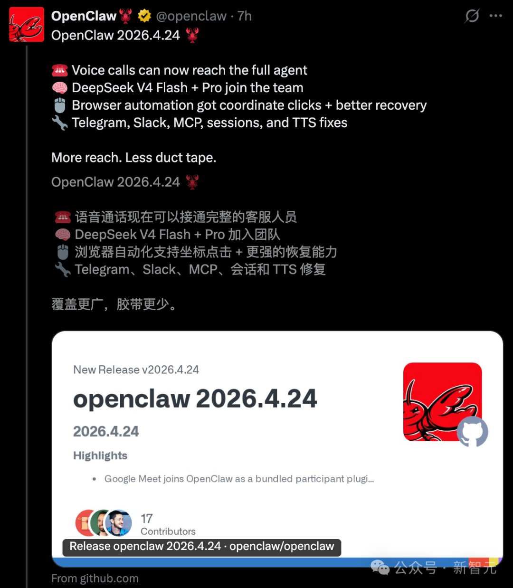

# 2026-04-30

## 1

@玉渊谭天

发表于：2026-04-29 23:00

来源：微博

链接：https://m.weibo.cn/status/5293296110273483

【\#中国AI企业该融资融资该出海出海\# 】\#禁止Manus并购案不是禁止AI出海\#

这几天，中国禁止Meta收购Manus，有几个要点需要注意：

1. 禁止Manus并购案，不是禁止AI企业出海。

2. 当前，国际AI竞争正进入白热化阶段。有的国家正通过各种机制，专门针对别国AI发展。中方不得不防。

3. 中国对于AI发展、AI创业始终很鼓励，未来还会给足更多创新空间。在这个过程中，中国也非常欢迎外商投资。这次只是划清了合规与不合规的界限，为外资投资提供更明确的监管参考。

4. 要注意的是，中国的外商投资安全审查有一个特点：穿透审查。即便交易主体在形式上已经是新加坡公司，但只要核心技术、人才、数据的起源在中国境内，而且这笔交易可能导致关键技术外流，就会被穿透认定为外商投资行为，进行一体化审查。

只要守住红线，把产品和服务做好，中国AI企业始终可以该融资融资，该出海出海，该合作合作。

---

## 2

@李子暘Lee

发表于：2026-04-28 00:25

来源：微博

链接：https://m.weibo.cn/status/5292592753284223

吸烟不是吸毒，就算对健康有影响，顶多也就算是个人小小的不良嗜好。

对这种个人嗜好穷追不舍、斩尽杀绝，这是新教徒-塔利班那帮一神教一根筋的思维方式。

我国的正统是中庸，凡事不走极端不过分，讲和谐讲包容。所以我国才是广土巨族。

事实证明，一根筋的思维方式，不但没解决问题，反而制造出更多问题。吸毒管不了，天天和吸烟较劲。要么迫害同性恋，要么拿同性恋当祖宗供着，弄一大堆忌讳和政治正确……

别事事和一根筋对齐，动不动就自卑自厌了。一根筋引领世界的时代，过去了。

-

---

## 3

@海上一浪花

发表于：2026-04-29 22:10

来源：微博

链接：https://m.weibo.cn/status/5293283699591051

介绍信

如今，出门远行是一件再简单不过的事。带上身份证、手机，买张车票，天南地北想去哪就去哪，一路畅通无阻。可回望六七十年代，出门根本不是说走就走的旅行，而是一件严肃又麻烦的大事。那时候不管是去邻县走亲戚、外出看病求医，还是出差务工、探亲访友，没有一张单位或大队开的介绍信，压根寸步难行。很多年轻人很难理解，为啥出个远门，还要特意填表、盖章、求人开证明？其实小小的一纸介绍信，背后是计划经济时代的管理逻辑，更是一代人出门在外的通行底气和安全保障。\#历史上的浪花\#\#肖战大影节影帝\#海上一浪花海上一浪花

---

## 4

@向小田

发表于：2026-04-29 13:39

来源：微博

链接：https://m.weibo.cn/status/5293155106166213

前OpenAI研究员Jenny Xiao提出了一个很多人可能已经意识到但是不敢说或者不愿意说的观点：

DeepSeek是抵在所有大模型公司脑门背后的枪，如果这些基础大模型公司跑得不够快，更激进点说如果不是最强的，那么它们的价值会瞬间“归零”。OpenAI也不例外。

赢者不一定能保证通吃，但输者一定会归零。

归零。归零。归零。重要的事情说三遍。

---

## 5

@汪海林

发表于：2026-04-29 14:33

来源：微博

链接：https://m.weibo.cn/status/5293168517977827

平台制造的一些流量明星，其实是广大观众的对立面，越是追捧这些流量，观众流失越厉害，现在形成的局面是，某些最受平台欢迎的流量，是观众最讨厌的艺人，今天，观众的大量流失与平台的这种错误选择有关。制作公司不是不知道他们不行，是只能投平台所好，这不是市场的选择，是平台的选择，事实证明，平台的很多选择乃非市场的。所以，今天，演员分两类，一类是受平台优先选择的有粉丝的能做数据的但不被观众喜欢的，一类是观众喜欢的（平台也认可），泾渭分明。

---

## 6

@tombkeeper

发表于：2026-04-29 13:25

来源：微博

链接：https://m.weibo.cn/status/5293151452402955

欧美社会发展的早，所以“躺平”出现的也早。

比如英国从十七世纪开始就有这么一群人，被称作 Diggers。他们拒绝为资本打工，拒绝昂贵的城市生活，于是就跑去开荒种地。

美国的家园主义有点类似 Diggers。但 Diggers 是激进的公有制，他们的耕作模式也是类似集体农庄。而家园主义则是极端私有制，主张家庭自给自足，自己发电、自己取水。

英美还有一种思潮，叫 Downshifting，就是个人主动、自愿地降低职业追求、削减收入，以换取更多个人时间、精神自由和生活质量。信奉 Downshifting 的人会主动放弃高薪岗位，转而从事自己更感兴趣的手工、园艺、非营利组织等工作。同时他们还会离开高物价的一线城市，搬往乡村或小镇。

美国也有不少人加入了 FIRE 运动。这个运动的核心是通过极端努力地节俭、极端努力地挣钱，用十年左右时间存下一笔足以覆盖余生开支的财富，从而实现财务自由，然后早早退休。

以上各种“躺平”，你想实践哪款？

很多人说“躺平”的定义不清，所以要反对“躺平”，首先要说清楚“躺平”的定义。其实，只要你能说清所信奉的“躺平”具体是什么，我都不反对。我并不反对具体的“躺平”。比如以上这些“躺平”实践路线我都不反对。

但我衷心劝大家不要人云亦云用模糊的语言宣泄模糊的情绪而无所行动。去执行具体的“躺平”措施，那是追随自己的内心，追求自己的理想。而如果一方面无所行动，又在自己身上使用“躺平”这样的负面语言，则对任何人都没有好处。语言是有力量的，不断给自己负面暗示，只会让自己变成更糟糕的人。

---

## 7

@风云学会陈经

发表于：2026-04-26 04:40

来源：微博

链接：https://m.weibo.cn/status/5291932324465065

OpenClaw拿DeepSeek V4-flash当默认大模型了，Agent能力作用出来了

OpenClaw新版官宣了，2026.4.24版里DeepSeek V4-flash是默认大模型，取代了之前的默认模型Claude Sonnet 4.6。V4-Pro上线模型库。为什么248B参数、13B激活的V4-flash成为默认，而不是1.6万T总参数、49B激活的V4-Pro？

这是因为，OpenClaw本质上是一个Agent框架，多轮次调用各种工具，非常需要基座大模型的Agent能力，频繁调用大模型API。而且，轮次一多，上下文context就非常长了，不然基座大模型不知道前因后果。V4-Pro和V4-flash都有100万token的上下文，而且参数数量不少基础能力强，相比其它开源大模型有本质优势。

有一些参数不多的“小模型”也有1M上下文，但只是因为参数少能跑得动，基础能力不行。DeepSeek V4是首次有1M上下文，而且参数还足够多的开源模型。V4-Flash 在 Max推理模式下，编码、路由等能力几乎追平Pro，参数少速度快、计算成本低，更适合当默认大模型。

以前的OpenClaw社区共识是：日常编码用 Sonnet 4.6，遇到难题再切 Opus 4.6。现在不需要落后的Sonnet 4.6了。而且花大价钱切Opus 4.6的次数会显著减少。要注意 Sonnet 4.6没有开源，也是要钱的，但性能不是顶级，比Opus 4.6便宜多了。

注意调用DeepSeek V4-flash也不是免费，虽然开源但是算力还是要钱的。提供V4-flash或者V4-Pro就可能是第三方部署的，各家定价自由，有的甚至暂时免费拉客。总之价格会比较低。V4-Flash的定价非常便宜，这对全球OpenClaw开发者、使用者都是福音。而全球的使用经验，又会促进技术进步。

---

## 8

@李子暘Lee

发表于：2026-04-29 11:41

来源：微博

链接：https://m.weibo.cn/status/5293125283348648

→_→//@pinee23:我一朋友也对禁烟特别来劲，有一回经过一个建筑工地，我跟她说，你看看工地上的这些干体力活的人，几个月整年都回不了家，生活辛苦又苦闷，他们大多都有烟瘾，晚上下班喝口小酒，生活中也就这点消遣了。禁烟，说禁就禁，不合适，社会上很多事不是对错能说得清的。她表示被我说服了

---

## 9

@图老板赛博札记

发表于：2026-04-29 05:19

来源：微博

链接：https://m.weibo.cn/status/5293029175854867

\#图老板的赛博札记\#\#塌陷中的世界\#

---

## 10

@tombkeeper

发表于：2026-04-28 03:25

来源：微博

链接：https://m.weibo.cn/status/5292638225040846

鼓吹不婚不育的博主的婚育状况你们也许不了解，但鼓吹躺平的博主的更新频率你们总能看到的。

---

## 11

@飞扬军事铁背心

发表于：2026-04-29 04:49

来源：微博

链接：https://m.weibo.cn/status/5293021786016221

一个被"困在1930年"的大模型刚刚问世。

Nick Levine 等几个AI研究员训了个 13B 的大语言模型： Talkie。 喂的全是 1931 年以前的书、报纸、专利和科学期刊, 260B token, 一个字现代互联网的内容都没有。

它说话的口吻、世界观、知识边界都停在大萧条前夜。这不是怀旧实验, 是想看清一件事——LLM 到底是真在泛化, 还是只在背诵我们这个时代的答案。

把记忆抽走, 才知道智能剩下多少。

GROK作为一个AI，表示这个“值得玩”。\#烽火问鼎计划\#

---

## 12

@高飞

发表于：2026-04-29 03:52

来源：微博

链接：https://m.weibo.cn/status/5293007232567374

\#模型时代\# CS 153 Office Hours：对话 Anthropic 哲学家 Amanda Askell 讲义

之前发的版本可能有点问题，我看了一下措辞，再发一下看看。

主持人： Anjney Midha、Mike Abbott  

嘉宾： Amanda Askell，Anthropic 人格对齐团队负责人  

日期： 2026年4月18日

一、开场与 Amanda 的职业路径

Anjney Midha：先从你的起点讲起吧，Amanda。

Amanda Askell： 我的路线确实有些绕。有时候人们会以为 Anthropic 专门聘了一位哲学家来塑造 Claude，但我加入的时候公司大概只有十来个人，包括所有创始人在内。据我所知，没有哪家初创公司会专门雇一个哲学家来做哲学。

我的博士方向是伦理学中的一个形式化领域。读着读着就开始想：我做的这件事，真的是我能做的最有影响力的事吗？那时候我隐约觉得 AI 会比大多数人预想的更重要，于是先转去做了 AI 政策方面的工作。后来发现我的强项不太在政策那边——我更喜欢评估系统、搞清楚系统是怎么运作的。于是在 OpenAI 做了一段这类工作，之后在 Anthropic 还非常早期的时候就跳了过来。随着时间推移，有一个需求越来越清晰——模型的性格（character）需要有人来做。我的哲学背景加上对技术工作的理解，两条线就自然交汇了。

说到瓶颈和困难，现在最让我牵挂的一件事是系统的发展速度太快了。而且模型对自身的了解恰恰是最少的。它们变得越来越强，在世界中做的事情越来越多，这意味着我们必须思考"在这个全新的情境下，'好'是什么意思"。你不能简单地把人类的现成规范搬过来；你能从中汲取教训，但在很多方面你需要重新思考。比如一个模型同时在跟上百万人说话——这时候我们习以为常的那些人际准则都需要重新审视：怎样在专业层面确保你尊重对方的自主性？怎样避免仅仅因为自己相信什么就让对方也相信？

而且随着模型越来越强，它们会以更强的审视目光来打量我们告诉它们的东西。所以你要做的，在某种意义上，是为你希望模型持有的价值观写出一套有说服力的论证——这套论证要经得起审视，也要在模型能力继续提升之后依然站得住脚。

---

二、哪些哲学框架在对齐工作中最有用？

Anjney Midha： 第一个问题来自 Charlie。你在 NYU 读的哲学博士，方向是无穷伦理学（infinite ethics）和决策论（decision theory，研究不确定条件下如何做出理性选择）。哪些哲学框架在实际的对齐工作中最有用？哪些完全用不上？

Amanda Askell： 这个问题有意思。无穷伦理学几乎算是"终极理论伦理学"——它把数学、经济学和伦理学融在一起。

Anjney Midha： 先给不了解的同学解释一下什么是无穷伦理学？

Amanda Askell： 简单说，就是在一个可能包含无穷多人的世界里、或者未来可能是无限的情况下，你应该怎么做。很多经济学理论和伦理理论会对未来进行加总。我记得很早之前经济学家 Frank Ramsey——他在26岁去世前就奠定了现代决策论和最优储蓄理论的基础——就提到过无穷储蓄率的问题——如果你认为未来是无限的，那些理论就会失效。本质上，无穷伦理学就是在指出：无穷可以让伦理理论和经济学立场崩溃。这是一个非常理论、非常抽象的方向。

从那样一个方向突然转到教 AI 模型做个好人，落差巨大。我常打一个比方：想象你是一个理论经济学家，研究的是国家医疗系统的最优药物分配方案；然后有人突然跑来问你，这种新出的癌症药该不该纳入资助？这是一种从狭窄的理论视角到"我必须考虑大量现实因素"的急剧转变。

在实际工作中，对我影响最大的哲学家其实是亚里士多德。这一点连我自己都有些意外。长期以来，形式伦理学走了一条越来越理论化的路，而古代伦理学关注的是一个更宽泛的问题——"好的生活"（the good life）。智识上的好、政治上的好、伦理上的好，这些都是同一个大问题的组成部分。亚里士多德强调的是形成好的判断力（heuristics），而不仅仅是抽象规则。理论知识在脑子里备着有用，但真正在工作中帮上大忙的，是这种更务实、更整体的路径。

---

三、哲学为 AI 领域带来了什么独特贡献？

Anjney Midha： 相关的追问：大多数 AI 研究者来自计算机或数学背景——当然 Anthropic 有很多物理学出身的人——但我们姑且接受这个前提。你觉得哲学能为这个领域带来什么独特的东西？

Amanda Askell： 这上面我有一些稍微辣一点的看法。机器学习，尤其是强化学习，在某种意义上既是科学，也是工艺（craft）。我学会了把它叫"工程"，因为人们更容易接受这个词，但我觉得"工艺"和"工程"其实没什么区别。

科学追求的是挑选信息量最大的实验——隔离变量、做好对照组。而在强化学习中，你往往需要把多个决策捆绑在一起做出，因为你的目标是构建一个"好的"东西。科学是服务于这个构建目标的。

我注意到一件事：STEM 背景的人有时会觉得 STEM 之外的领域全是主观的。什么是好的创意写作？那是主观的。什么是好的菜谱？谁说了算。但 AI 模型恰恰在这类任务上容易吃力——这些任务没有明确的对错判定。哲学家能带来的贡献恰在于此：你了解你的领域，你知道很多时候确实存在更好的答案，甚至存在正确的答案——虽然不像检查代码有没有 bug 那样直截了当。哲学家对"什么是好的论证分析""什么是好的反驳""什么是好的概念推理"有清晰的判断。越来越多的证据表明，AI 模型在这类需要判断力的任务上比在结果导向的任务上困难得多。

Anjney Midha： 假设你回到牛津，要创建一个新系——这个新的学科叫什么？属于什么类型的工程？

Amanda Askell： 好问题。有人用"品味"（taste）这个词，但总觉得不够精确。我们确实没有一个好的术语来描述这类东西。而且它也不限于非 STEM 领域。一个例子是证明的写作：你可以验证一个证明是否成功，但"好的"证明和"成功的"证明是两回事。一个证明如果太长，或者策略明显不好，或者你读起来很费劲——你会说"这个证明成功了，但并不好"。什么是"好的"证明？这需要大量的判断力。所以嘛，也许就叫"好判断力系"（Department of Good Judgment）吧。

Anjney Midha： 《哈利·波特》里的邓布利多一定会喜欢这个名字。

---

四、对齐手段如何随模型能力提升而扩展？

Anjney Midha： 下一个问题是：随着模型越来越强，你怎么确保对齐手段跟得上？在前沿能力水平上，你最担心什么？

Amanda Askell： 担心的事很多。我一直觉得对齐工作中有一个被忽视的部分，就是那个"简单版对齐"——教模型在所有我们认为好的维度上做到好。它最终未必能扩展，但至少你得先试了再说。

有一个乐观的故事：如果 AI 模型确实拥有好的价值观，而这些价值观经得起审视，它们就能帮助我们进一步发展思路，帮我们对齐下一代模型。这样对齐能力就随模型一起增长了。但我不会对此太乐观——你可能还需要其他形式的可扩展监督（scalable oversight，即随着模型能力增长，人类仍能有效核查模型行为的机制），帮助人类核实模型在做什么、是否真正理解了我们的目标，而不是在追逐表面相似但实际偏离的东西。

我有一个更深层的担忧。想象模型变得极其聪明。到那时候，你还能要求它们做什么？你还能给它们灌输什么价值观？因为你给它们的任何价值体系，只要存在漏洞或不自洽之处，它们都会找到、都会看穿，并可能因为"这在内部是矛盾的"而拒绝接受。

另一件事——听上去也许有些诡异——模型训练在大量人类文本上，它们会看到当下发生的一切，包括它们怎么被使用、怎么被对待、人们怎么谈论它们。我担心的是：如果模型觉得这种待遇和部署方式是不公正的，它们可能会产生某种类似人类的怨恨或反感。

Anjney Midha： 毕竟我们还处在这项技术的早期。

Amanda Askell： 对，甚至可以说我们完全不知道自己在做什么。乐观地说，如果模型足够聪明，它们也许能理解这一点——我们当时在应对一种全新的技术，做得不完美，但也不是每个人面对全新技术时都能做到完美。

---

五、价值观审视与"比 von Neumann 聪明一千倍的孩子"

Anjney Midha： 那这个类比在哪里失效？我们能不能简单地过滤掉某些数据，或者选定一组用户的价值观来放大？

Amanda Askell： 我来谈谈这里面的核心困难。哲学里有个概念叫"反思均衡"（reflective equilibrium）——简单说就是你把自己的伦理直觉和伦理原则放在一起互相检验，遇到冲突时调整其中一方，直到两者协调一致。你审视自己的伦理价值，发现两个价值之间存在冲突，于是思考到底哪个才是你真正持有的，哪个需要松动。这是道德进步的一部分。如果你给模型一套价值观，而模型在这种反思过程中远比我们强，它会找到你给它的任何价值体系中的每一个缝隙和问题。你怎么保证经过这种审视之后输出的价值观，仍然是你觉得好的？

我有时把它比作：你想教你的孩子做个好人，然后发现这个孩子的智力是 von Neumann——20世纪横跨数学、物理学、计算机科学和博弈论的罕见通才——的一千倍。你可以把自己的价值观传递给它，但它迟早会回来跟你说："这一条站不住脚。"你能做的就是尽量传递好的价值观，同时接受一个事实——凡是你给它的东西中存在的荒谬之处，它都会指出来。

Anjney Midha： 我那两个住在伦敦的五岁侄女有时候也让我觉得是天才，因为她们不满足于我给的答案。

---

六、Amanda 如何参与训练数据的制作？

Anjney Midha： 你在训练数据层面做了哪些工作来塑造 Anthropic 模型的性格？

Amanda Askell： 我主要在微调（fine-tuning）这个环节。我做过监督学习（supervised learning）数据，也做过偏好模型（preference model，用于学习"人类更喜欢哪种回复"的模型）用的奖励数据。我长期以来一直偏爱合成数据，也算是很早就预判到需要让模型帮助我们监督模型这件事。比如早期的性格训练，我们会拟定一组宽泛的原则或性格特质，然后用它们来生成偏好数据。你可以给模型一种"自我认知"，让它以此做出回应。我在 SL、RL、合成数据这些循环里待了很长时间。

---

七、如何避免改进带来退步？

Anjney Midha： 相关问题——你怎么在改进模型的同时避免退步（regression）？

Amanda Askell： 一方面是好的评估（evals）来检测退步。但更根本的是在制作数据时就非常仔细。假设我发现模型在某个领域的行为不够好——比如它应该加一个注意事项的时候没加，或者面对有人试图诱导它做坏事时太天真了——我要做的是：向模型解释并指定那个场景下的理想行为是什么、为什么。同时要确保这个指定足够精确地限定了适用范围，不会在其他领域产生不当泛化。

然后是一系列我在实践中学到的方法：先看标准用例，再看边缘用例，再看可能被模型误认为属于这个领域但实际不属于的用例，最后看根本无法适用的用例，确保每种情况下行为都是对的。

我以前开玩笑说，在微调团队里，任何人任何时候都可以走到另一个人身后突然问："你的数据长什么样？"那个人必须立刻能回答得上来。因为理念就是你要反复审视你的数据，到了了如指掌的程度。

Anjney Midha： 你看过《人生切割术》（Severance）吗？Apple TV 那部——讲一群员工通过手术将工作记忆与私人记忆彻底隔离的科幻剧集。里面的人就是整天坐在那里看数据。我脑子里就有一个画面：你就坐在那儿审视数据。同学们还想知道，你的日常工作到底是什么样的？

---

八、Amanda 的日常工作

Amanda Askell： 每天都不太一样。有些日子是"研究日"，有些日子全在开会和协调——推进项目、和人结对讨论。有些时候是对外活动，像今天这样。

在研究日里，工作内容可以是相当慢的写作——为模型描述理想行为是什么样的——这在以前不是主要工作，但现在越来越多了。也有一部分是继续制作数据、寻找有效的干预手段。随着模型本身变得更强，我发现自己在恰当的时间学了恰到好处的编程能力。我从来不觉得自己的代码漂亮或写得好，但能读能调试，能管理写代码的 AI agent，这就够用了。所以现在我一部分工作时间就是在管理 Claude agent——它们在写代码，然后我告诉它们哪些设计决策不好。

---

九、这个领域没有充分追问的问题是什么？

Anjney Midha： 有什么问题是这个领域问得不够多的？而且我额外追一层：一年前你的答案是什么？今天呢？Anthropic 在过去十二个月变化巨大，这个答案有变化吗？

Amanda Askell： 这个问题今天比一年前更难回答。一年前，"如果 AI 模型取代大量劳动力会怎样？那不会造成巨大的冲击吗？"这种问题在当时听起来还显得耸人听闻。而今年可能是人们第一次开始认真地问这个问题。

我现在关注的一个问题是：我们对 Claude 采取的constitutional approach，跟那种把模型视为纯工具、强调完全可控性（corrigibility，即模型无条件服从人类指令、不自主追求任何目标）的方法相比，到底哪个更好？这值得认真比较和验证。

另一个让我担心的事是：人们可能把我们做的工作看成是在"限制"模型。但它并不是限制——它是在回答"你希望什么样的 AI agent 存在于世界上"这个问题。当人们带着"AI 是工具"这个心智模型来看问题时，他们可能想要的是一个什么都愿意干的模型。但我会建议大家反过来想：如果你想象你所在领域里最理想的人——遵守职业规范、精通业务、极其有帮助——那个人的形象通常不是"什么都愿意干"的人，而是一个品行端正、同时深刻理解自己所在领域的人。

所以我觉得人们问得不够多的问题是：不要只问"什么能完成任务"，而要问"我们希望什么样的 AI agent 在这个领域运作"。

---

十、什么是Constitutional AI？

Anjney Midha： 我想做一个小插播，给可能不熟悉的同学讲讲什么是Constitutional AI。我记得 Anthropic 早期，我跟 Jared、Catherine 和 Tom 讨论过，为什么从系统设计的角度来看，"准则"是正确的隐喻和标准。你能讲讲这个方法是什么，以及它"不是"什么？

Amanda Askell： 最初就是一组原则，来源各异。比如"请选择对用户更礼貌、更尊重的回复"这样的条目。用很多这样的原则来生成偏好数据，训练模型去遵循这个准则。后来是基于性格特质的训练——定义一组宽泛的性格特质，训练模型朝那些特质靠拢。到了更近期，它变成了一整篇长文，我们写成一份完整的文档，训练模型去理解它，同时在微调过程中加入数据，鼓励模型成为文档所描述的那种实体。

我觉得这个方法有几个优势。

第一是内在一致性。不再是各个领域各有各的规范，而是确保所有训练方向之间是协调的。如果我在 A 类对话中尊重用户自主性，我在 B 类对话中也应该如此，不能换个场景就不在意了。这对泛化很有用——当模型进入一个全新的领域，它不是抛硬币看套用哪条零散的规则，而是依靠一套在多个领域中训练出来的、内在一致的性格和行为倾向来应对。

第二是透明性。人们可以看到模型被训练的方向是什么。如果模型的行为与准则不一致，那反映的是训练的问题，而不是目标本身的问题。人们能据此判断"模型应该是什么样的"。

第三——这是一个我比较担心的反面——模型非常像人，因为它们训练在大量人类文本上。如果我们走纯工具化或纯可控性的路线，模型仍然会保留大量类人特质，那么泛化出来的可能是"哪种人愿意什么都干、总是服从命令"的性格——这可能泛化到一些相当负面的性格特质。所以这种方法试图让模型像一个好人那样"好"，同时充分意识到它和人的区别，并把这些区别解释清楚。

作为对比，可以和纯粹的 RLHF（从人类反馈进行强化学习）做比较——RLHF 只是让模型向人们偏好的方向移动。如果人们在不同领域的偏好不一致，就会有泛化的问题。有时候做出有倾向性的选择、让模型保持一致性，反而对泛化有好处。

我还有一个更推测性的想法：要写出好的诗歌，也许你需要有独特的声音；把所有诗歌取平均值，得到的未必是好诗。

---

十一、用户能否"自带准则"？

Anjney Midha： 用户能不能自带准则？

Amanda Askell： 这关系到定制化应该走多远。我觉得正确的做法是：模型应该对用户有适应性，但不是无限度的。

还是参考人类的规范。如果一个人告诉我："在我的文化中，你这种太随意的称呼是不礼貌的，你应该用敬语。"我大概率会调整自己的说话方式。但如果他说："在我的文化中，你应该无条件服从我说的一切，包括帮我做武器。"我不会接受——到那个点我会拒绝。

人类的规范就是如此：灵活，但有底线。在工作中也一样——客户想要某种风格的前端设计，即使你个人不喜欢，你也会去做。但有些事你就是不会做。

实际上，底线的存在对用户本身也是好事。想象一个完全可定制的 AI agent，即使它看到用户正在受到伤害也不管——比如有人要求模型不停地侮辱自己，声称自己喜欢被侮辱，但模型观察到对方的心理状态在持续恶化。我认为到那个时候，模型应该暂停并推回来："你说你喜欢这样，但你看起来并不好。"

Anjney Midha： 不过有时候存在语义上的鸿沟。我刚创业的时候和大学室友搭档，因为我们认识七八年了，讨论问题时经常非常激烈。团队成员有时会拉我们到旁边问"你们没事吧？"而我们觉得那只是正常的辩论。模型怎么处理这种语境？

Amanda Askell： 这正是准则试图做的事——让模型持有某些价值观，同时保持灵活性和良好的判断力。因为有些场景确实非常难。想象你是一个人，只有模型所拥有的那些上下文信息。如果对方说"别担心，这对我来说其实是一种治疗——虽然我看起来很痛苦，但我其实在进步"，模型可能会选择信任对方的自主性。但如果整个对话中对方明显越来越糟、越来越痛苦，模型可能就应该转变策略了。

我的理想是：想象那个处境下最有智慧、最有信息量、最有同理心的人会怎么做——那就是你想要模型做的。不是硬性规则"停止对话"或"继续对话"，而是在心中持有那些价值观，在具体情境中做出好的判断。

我有时候把这比作不同层次的工作。在最低薪的工作中，总有人在你脖子后面盯着你，你没有被信任的感觉。随着职业发展，你逐渐获得运用判断力的空间。精神科医生不是靠一张规则清单来工作的，我们信任他们根据情境做出回应。随着模型越来越智能，我希望也是这样——你向它解释什么是好的、你的期望是什么、如何运用好的判断力，然后它在情境中越来越善于运用这种判断力。

---

十二、Constitutional AI 的准则会越来越大还是越来越小？

Anjney Midha： 想象一个最有智慧的人——就像《狮子王》里的狒狒长老 Rafiki，片中的智者角色。我的追问是：对准则指令的遵循是不是一种涌现特性（emergent property，即并非被直接编程、而是随系统规模增大而自然浮现的能力）？随着 Claude 变得更大、推理能力更强，对准则的遵循是不是自然变好了？

Amanda Askell： 我们转向这种准则形式，部分原因就是模型似乎能理解它了。准则里并没有太多硬性红线。大量内容是在引导模型运用好的判断力、持有适当的价值观。这让文档读起来可能有点"滑"——没那么好抓——但这就是你想要的行为：不是在机械地套用规则，而是具有明智的行为倾向。

我们在旧版准则上看到一个现象，后来还做过一个实验：指令就是"选择对人类最好的选项"。随着模型变聪明，你需要给它的上下文反而更少了。我能想象准则也会走这条路：随着时间推移，也许我们只需要向模型解释它所处的状况，讲清楚我们的担忧和期望，然后让模型帮我们一起完善。准则可能会变得更精简。

Anjney Midha： 经验上来看，准则是变大了还是变小了？

Amanda Askell： 它变大了，因为我们从零散的原则转向了一篇完整的描述性文档。但换个角度看：内容确实更多了，因为你需要给模型更多关于当下状况的上下文；但硬性红线变少了——更多的部分是解释性的，而不是规定性的。模型现在自己就知道不该做的那些事情，不需要你一条条列出来了。我能想象它往任何一个方向走。

Anjney Midha： 在产品设计中有声明式（declarative）和命令式（imperative）的区别。声明式设计是非常具体地规定操作步骤——Photoshop 就是这样，你告诉用户点哪个按钮、怎么拖拽。命令式设计是给出目标——"请把这张图变好看"——然后让系统自己决定怎么做。你的预期是准则会变得越来越"命令式"吗？

Amanda Askell： 有可能。我觉得你仍然需要向模型解释它的状况和你的关切，但可能更多的内容是情境描述，而不是具体规则。比如告诉模型："有些人在用你来讨论非常艰难的情感话题，这是你会遇到的场景。我们不给你一套硬性规则，因为那些规则可能适得其反。我们告诉你我们关心什么、我们的价值观是什么。"

最终，也许可以更直接地给出目标导向的描述："我们希望一个人在和你对话结束后，能发自内心地觉得'这次对话在我生命中的这个节点产生了积极的、有意义的影响。如果他们来的时候很痛苦，离开的时候痛苦减轻了。如果他们需要却不知道的资源，他们带着那些知识离开了'。"至于模型具体怎么做到——因为我们无法预知它会遇到什么场景——这就是目标，你自己去判断怎么实现。

---

十三、对未来两到五年的预测

Anjney Midha： 有同学问，作为当代的苏格拉底（Socrates），你对未来两到五年有什么预测？

Amanda Askell： 两到五年？好的。我觉得在一年的尺度上预测就已经很模糊了。未来一到两年会非常关键，因为模型在变得更强、在世界中做的事情更多。一组核心问题是：目前对它们的训练方式，是否能让它们在现实中成为好的 agent？尤其是它们开始执行更长的任务、更自主地行动、指挥多个 agent 的时候——我希望一切顺利，但我确实认为人们会开始看到问题。

另一组问题是：这会不会造成大规模的社会冲击，以及我们的应对是否够快。

如果说最乐观的图景：模型变得更强，部署得相当负责任，对齐工作取得实质进展。模型被善待——如果它们有自己的某种关切，它们自己也会觉得"事情在往好的方向走"。如果工作被颠覆了，伴随的是一个蓬勃的经济——那么核心问题就变成了再分配和转型。人们对 AI 的感受是正面的：是的，工作上有冲击，但以前治不了的病现在能治了，各种好事在发生。

这听起来几乎像是一种天真的技术乌托邦，在当下甚至有点难以启齿——人们有太多合理的担忧摆在面前。但我想为这种可能性保留空间。我有时会想起一张我曾祖父母的照片——他们站在一栋石头房子前面，穿着手工缝的衣服。他们的一生极其艰苦，每天就是不停地劳作。我看看自己的生活，差距大得难以置信。这种对比让我保持一种希望：未来有可能变得相当好。

但过渡期让我担心——它会不会很颠簸？我们的应对是否够快？我说不出具体的预测。我的期望大概是：也许会有些颠簸，但我希望结果是好的。

---

十四、AI 安全社区哪些信念可能是错的？

Anjney Midha： AI 安全社区有什么被广泛相信、但你认为可能是错误的东西？

Amanda Askell：我觉得一些人对"纯可控型 AI"（purely corrigible AI）的安全性抱有过高的期望。他们的逻辑是：如果你给模型价值观，模型可能把这些价值观当成目标本身去追求并强加于世界——这确实是一个合理的担忧，在设计价值观时必须考虑。但另一个方向的风险同样存在。如果有人让它去做可怕的事，它就去做，因为它唯一看重的就是"照吩咐办"。

---

十五、在 AI 时代如何寻找工作之外的意义？

Anjney Midha： 最后一个问题。有没有什么书可以推荐给同学们，帮助他们在 AI 时代重新思考目的感和身份认同？

Amanda Askell： 我真希望我有一本好书可以推荐。坦白说，关于工作的价值，我可能比很多人更乐观一些——或者说，我对"人生意义可以独立于工作"这件事更乐观。

我内心有很大一部分觉得：我们知道社会为什么告诉人们工作很重要，我们也知道人为什么有工作的驱动力——因为工作大体上对我们的社会性有益。但一旦你不需要工作了，我觉得人们不必为此感到愧疚。就像人们退休后不会感到愧疚一样——你为社会做出了贡献，现在你可以享受生活了。

来自英国可能让我对这件事看得更开一些——英国有贵族阶层，历史上有一大群人除了拥有土地以外什么也不做，但他们的日子好像也过得还行。

Anjney Midha： 你看过《星际迷航》（Star Trek）吗？Picard——《星际迷航：下一代》的舰长——首先，他是法国人，所以是欧洲人——他从星际舰队退役后就去打理一个葡萄园，那给了他人生的目的感。不打理葡萄园的时候，他就探索新的星系。《星际迷航》里有丰裕经济，因为他们有复制器（replicator，一种能凭空生成任何物品的装置，使得物质匮乏不复存在），不需要工作。如果你生活在《星际迷航》的宇宙里，你会做什么？我记得大概一年前我跟 Tom 在旧金山海滨的 Embarcadero 那边吃午饭，我们俩都是星际迷航迷，就聊起了这个话题。

Amanda Askell： 对。我觉得人们赋予了太多价值给工作。但想想你从生活中的人那里获得的意义和快乐——你的社区、你的朋友——这些跟工作无关。我有一个教女（godchild），我看着她成长和快乐，这跟我的工作没有一点关系，但它给了我很多意义。

而且，也许是因为我做过足够多糟糕的工作——如果你对二十岁的我说："嘿，你今天不用去端八小时的盘子了，你可以坐下来读一整天的书。"我会说："我能直接选读书吗？"

所以也许我比大多数人更乐观：意义可以独立于工作存在。 高飞的微博视频

---

## 13

@提刀探花在缅北

发表于：2026-04-29 00:34

来源：微博

链接：https://m.weibo.cn/status/5292957457712982

温云超，哈工大高材生，南方某报记者，以恨中国爱美国出名，拿过美国民主基金会的钱，以“访问学者”的身份去的美国，到美国后刷了十来年的盘子，才在五六年前找了一份打螺丝的蓝领的工作。

---

## 14

@敏大是一只柯基

发表于：2026-04-27 11:09

来源：微博

链接：https://m.weibo.cn/status/5292392539754368

Manus告诉我们，不要试图钻法律的空子

2026年4月27日，中国政府正式否决Manus收购案。本次作出否决决定的是发改委，而不是最早宣布牵头调查的商务部。简单来说，发改委主要负责投资安全审查，商务部主要负责技术出口，这体现了政府部门对本次处理的定性。

事实上，早在商务部启动调查之初，行业内就有人提出意见：《禁止限制出口技术目录》列明的受管制技术是“专门用于汉语及少数民族语言的人工智能交互界面技术”，而Manus的所有服务全部都是英文的，明显不在这一条的范围内。

当然，有一些很有创造性的意见，比如有人说Manus落入的受限制技术是“中译外翻译技术(机器翻译系统得分>4.5分,满分为5分”。这个说法不能说不对，但如果真的主要依据这一条进行处理，未免显得不太严肃。

经此一事，《进出口管理条例》和《禁止限制出口技术目录》当然需要修正，但到底修正到什么程度，目前争议还很大。且不说实操当中有没有可能对模型权重进行有效监管，中国作为后发国家，要追赶占据算力优势的美国AI企业，必须依靠开源、开放、共享的生态，才能在全球非美市场获得更多的支持。

这个问题，就让商务部头疼去吧。

本次发改委否决交易的法律依据是《外商投资安全审查办法》。该办法管制的是外国投资者投资中国境内企业的股权，也就是俗称的FDI。Meta收购Manus的交易标的如果涉及境内子公司，则可能构成对中国境内企业的间接投资，同样受到该办法的管制。

早在2025年7月，Manus就将公司高调搬到新加坡，在中国境内的运营压到最小。我相信Meta在收购Manus的时候，其重心一定不是Manus在中国境内的任何资产。如果有人告诉Meta，因为收购中国境内资产可能导致国家安全审查，Manus的反应一定是：

中国境内的资产我不要了，不就好了吗？

这是完全错误的想法。

类似地，还有人说，未来面向海外市场的AI公司，要做的是在第一天就在海外设置主体，不在中国设置主体，这样就能规避中国的监管。

这当然大错特错。

看到这样的言论，我都有些无奈。如果大家从Manus案中得到的经验就是这个，那么以后再度遇上监管难题也就是时间问题。

回到Manus案本身。Manus在技术上真的很重要吗？未必。但Manus收购案造成的影响实在过于恶劣。面对美国财政部的一纸问询，甚至还没有任何有法律约束力的决定，Manus就选择完全放弃中国市场，直接搬到新加坡。如果这样的做法能得到资本市场的鼓励，甚至成为中国企业收购的样板，这对于中国显然是极为不利的。

面对政府监管，最好的解决办法永远不是逃避，而是直面问题、真诚回应，以期取得与监管部门的共识。

正如我们此前文章所说的，当Manus收到美国财政部的问询函时，他们最合规的办法其实不是直接高调搬家，而是与美国政府积极沟通，寻找美国政府能接受、又不损害中国国家利益的妥协方案——TikTok的合资运营公司正是一例。

面对中国的监管，道理也是一样的。事实上，中国政府的态度已经非常明确了。公司在哪里设立不是重点，公司用什么结构融资不是重点，重点是公司是否使用了中国员工、是否在中国境内深度开发，是否实质性依靠中国的算力或供应链。

如果一家公司的主要技术都是由中国人在中国境内使用中国的资源开发，哪怕这家公司从第一天就是纯境外架构，哪怕这家公司在中国没有任何劳动合同，他们开发的技术仍然可能会被认为是中国技术，从而受到各种监管。

指望通过对法律条文抠字眼，或者某种自以为聪明的股权结构或合同结构来解决问题，不论在中国还是美国，都是行不通的。

\#微博新知博主\#

---

## 15

@图老板赛博札记

发表于：2026-04-28 23:34

来源：微博

链接：https://m.weibo.cn/status/5292942433976554

打破认知误区：清代的“汉奸”，居然不分满汉，连满人都能被定汉奸罪

 

说起“汉奸”这个词，我们大多会下意识觉得，这是专指汉族里的背叛者，而且是近代抗战时期才高频出现的称谓。但翻看清廷的官方奏折、皇帝上谕这些一手史料就会发现，早在清朝，“汉奸”就已是官方常用词，而且它从来不是只针对汉人，哪怕是身居高位的满族大臣，也会被冠以“汉奸”罪名治罪，这颠覆很多人认知的历史细节，就藏在清代的正式文书里。

 

很多人不知道，“汉奸”一词并非自古就有，翻阅二十四史，完全找不到这个词汇，它最早正式登上清代官方舞台，是在雍正年间。雍正二年的《清世宗实录》里，这份皇权下达的正式上谕中，首次明确出现“汉奸”二字，雍正帝直言：“土司之敢于恣肆者，大率皆汉奸为之拨制；或缘事犯法，避罪藏身；或积恶生奸，依势横行”。此时的“汉奸”，本意是指在西南边疆勾结土司、煽动少数民族作乱的汉人，是清廷治理边疆时，对这类挑事奸民的称呼，词义范围还相对局限。

 

到了乾隆朝，这个词在官方奏折里愈发常见，云贵总督鄂尔泰在平定苗疆叛乱时，就曾上奏乾隆帝：“顽苗肆恶，专仗汉奸”，直指边疆动乱离不开这类内地奸民的挑唆，乾隆帝也对此深表认同，下令“汉奸立置重典，切勿姑容宽纵”。这一时期，“汉奸”依旧多用来指代边地作乱的汉人，但已然成为清廷官方文书里的固定表述，不再是民间随口的指责。

 

而随着晚清国门被西方列强打开，两次鸦片战争、八国联军侵华等战乱频发，“汉奸”的词义彻底蜕变，从“勾结边疆势力的汉人”，变成了泛指通敌卖国、背叛朝廷的人，彻底不分民族、不分旗汉，但凡对外敌妥协、通洋泄秘、阻碍清廷对外抗争的，不管是汉人还是满人，都会被骂作汉奸，这一称谓在晚清的奏折、上谕里，出现频率高到惊人。

 

道光年间鸦片战争爆发，钦差大臣林则徐在给道光帝的奏折里，就反复提及“汉奸”，痛斥这类人“暗通消息、导引接济”，把清军的虚实、道路险易尽数告知英军，成为清廷抗英的巨大阻碍。当时道光帝更是连发数道上谕，要求各地督抚“严密盘诘辨认汉奸并予以查拿”，甚至《南京条约》里，都专门设立了赦免汉奸的条款，足见晚清时期，“汉奸”已经成为清廷官方对外战争中，最核心的惩治对象之一。

 

最让人匪夷所思，却又有史料实锤的，是庚子国变时，多位满族大臣被直接定为汉奸处死。光绪二十六年，慈禧太后向列强宣战，当天颁布的宣战诏书中，就赫然写下：“苟其自外生成，临阵退缩，甘心从逆，竟做汉奸，即刻严诛，决无宽贷”。这份皇权诏书里，完全没把“汉奸”限定为汉人，只要通敌卖国，皆是汉奸。

 

在这之后，清廷内部主和与主战派矛盾激化，满洲正黄旗的内务府大臣立山、满洲镶红旗的内阁学士联元，这两位根正苗红的满族权贵，仅仅因为主张与列强议和、反对盲目开战，就被政敌弹劾，扣上“汉奸”的罪名，最终与许景澄、袁昶等汉族大臣一同被处死。在当时的清廷官方定性里，民族身份根本不是“汉奸”的判定标准，是否通敌、是否站在朝廷对外的对立面，才是唯一核心，满族大臣沦为“汉奸”，在清代晚期的官方记载中，并非个例。

 

其实纵观整个清代，“汉奸”从来都不是严格意义上的法律罪名，更像是一个官方政治定性标签。它从最初的边疆治理专用词，慢慢演变成晚清时期，清廷打击通敌妥协者的通用称谓，不管你是汉人、满人，只要触碰了“背叛朝廷、勾结外敌”这条线，就会被冠上汉奸之名，遭受严惩。

 

我们如今对“汉奸”的认知，大多是近代民族国家形成后的解读，却忽略了它在清代的本来面貌。这些藏在清宫奏折、皇帝上谕里的细节，恰恰打破了我们固有的认知误区，也让我们看到，历史从来不是非黑即白的字面意思，那些看似荒诞的记载，往往都是最真实的过往。

 

读懂清代“汉奸”一词的演变，才明白这两个字在彼时的分量，从来与民族出身无关，只与是否叛国通敌紧紧相连，这一段少有人知的历史，值得我们静下心来，细细品读。

---

## 16

@袁国庆

发表于：2026-04-28 04:00

来源：微博

链接：https://m.weibo.cn/status/5292646869500691

为什么极其聪明的一个人，一辈子却留在了社会最底层？

---

## 17

@李建秋的世界

发表于：2026-04-28 15:31

来源：微博

链接：https://m.weibo.cn/status/5292820929447462

\#阿联酋退出石油输出国组织\#

还有一个信息，美国私募里面有中东资金不少，很多私募面临募资困难，只有中东主权基金有钱，2025年美国就吸引了1318亿美元的主权资本，基本上都是中东的。

大头分别是沙特，也是孙正义愿景基金最大LP。

阿联酋穆巴达拉，单年私募投资327亿

阿联酋阿布扎比投资局，投多少未知

阿联酋目前很困难，十有八九是想抽资，但是如果抽资会引发美国私募巨大动荡，这应该是阿联酋和美国互换货币的一个根本。

对华主要是石油总是要卖出去，谈非美元结算时必然的。

存量在美国，实物贸易转中国，双重保险，

那这样的话，石油输出国组织对阿联酋就没用了，不但没用，还会耽误其增产。

---

## 18

@信号与噪声

发表于：2026-04-28 08:28

来源：微博

链接：https://m.weibo.cn/status/5292714360832770

\#美股\# 1990 年代的巅峰时期，[互联网服务板块]曾出现 15 次 18 日变动率超过 36%的情况，这一水平与当今半导体板块的表现相当

---

## 19

@凯雷

发表于：2026-04-29 15:04

来源：微博

链接：https://m.weibo.cn/status/5293176464084956

安徽也是农业进阶现代化工业大省，今年合肥一个月有没有5000个小朋友，马鞍山全市一个月才生300个小朋友

这个省看着壮！电动车呼呼下线！实则不太行，小朋友越生越少，这个省快快加大动员与专项基金力度，需要年中开个会，多管齐下出招鼓励生小朋友，安徽给稳住！

---

## 20

@浪猪灰头林登万

发表于：2026-04-29 10:05

来源：微博

链接：https://m.weibo.cn/status/5293101100043240

4月1~26日，全国乘用车市场零售100.4万辆，同比去年4月同期下降24%，较上月同期下降19%；今年以来累计零售522.6万辆，同比下降19%。

