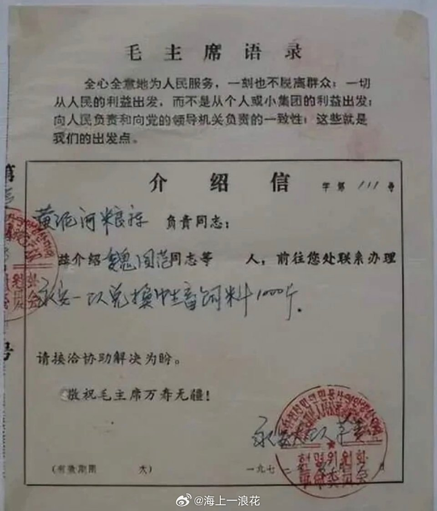

@海上一浪花
发表于：2026-04-29 22:10
来源：微博
链接：https://m.weibo.cn/status/5293283699591051

介绍信

如今，出门远行是一件再简单不过的事。带上身份证、手机，买张车票，天南地北想去哪就去哪，一路畅通无阻。可回望六七十年代，出门根本不是说走就走的旅行，而是一件严肃又麻烦的大事。那时候不管是去邻县走亲戚、外出看病求医，还是出差务工、探亲访友，没有一张单位或大队开的介绍信，压根寸步难行。很多年轻人很难理解，为啥出个远门，还要特意填表、盖章、求人开证明？其实小小的一纸介绍信，背后是计划经济时代的管理逻辑，更是一代人出门在外的通行底气和安全保障。\#历史上的浪花\#\#肖战大影节影帝\#海上一浪花海上一浪花

---

