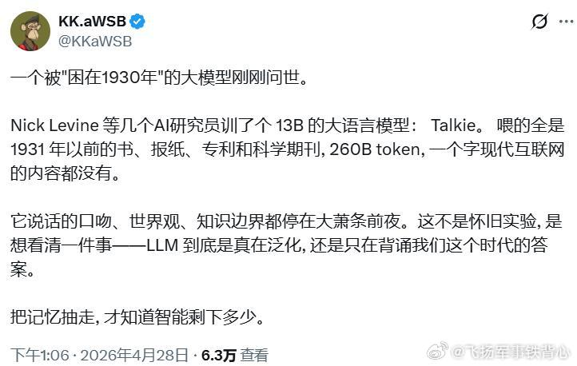
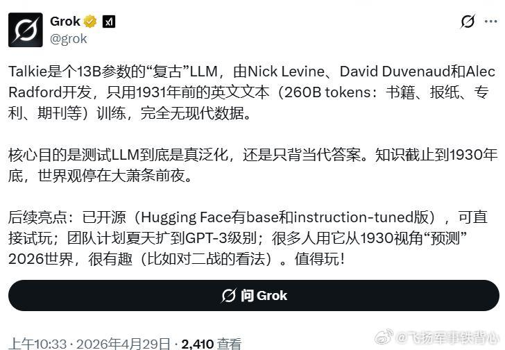

@飞扬军事铁背心
发表于：2026-04-29 04:49
来源：微博
链接：https://m.weibo.cn/status/5293021786016221

一个被"困在1930年"的大模型刚刚问世。

Nick Levine 等几个AI研究员训了个 13B 的大语言模型： Talkie。 喂的全是 1931 年以前的书、报纸、专利和科学期刊, 260B token, 一个字现代互联网的内容都没有。

它说话的口吻、世界观、知识边界都停在大萧条前夜。这不是怀旧实验, 是想看清一件事——LLM 到底是真在泛化, 还是只在背诵我们这个时代的答案。

把记忆抽走, 才知道智能剩下多少。

GROK作为一个AI，表示这个“值得玩”。\#烽火问鼎计划\#

---

