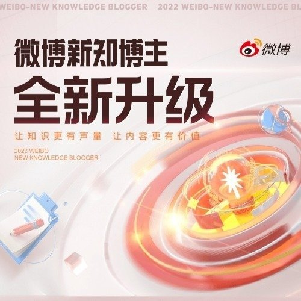

@敏大是一只柯基

发表于：2026-04-27 11:09

来源：微博

链接：https://m.weibo.cn/status/5292392539754368

Manus告诉我们，不要试图钻法律的空子

2026年4月27日，中国政府正式否决Manus收购案。本次作出否决决定的是发改委，而不是最早宣布牵头调查的商务部。简单来说，发改委主要负责投资安全审查，商务部主要负责技术出口，这体现了政府部门对本次处理的定性。

事实上，早在商务部启动调查之初，行业内就有人提出意见：《禁止限制出口技术目录》列明的受管制技术是“专门用于汉语及少数民族语言的人工智能交互界面技术”，而Manus的所有服务全部都是英文的，明显不在这一条的范围内。

当然，有一些很有创造性的意见，比如有人说Manus落入的受限制技术是“中译外翻译技术(机器翻译系统得分>4.5分,满分为5分”。这个说法不能说不对，但如果真的主要依据这一条进行处理，未免显得不太严肃。

经此一事，《进出口管理条例》和《禁止限制出口技术目录》当然需要修正，但到底修正到什么程度，目前争议还很大。且不说实操当中有没有可能对模型权重进行有效监管，中国作为后发国家，要追赶占据算力优势的美国AI企业，必须依靠开源、开放、共享的生态，才能在全球非美市场获得更多的支持。

这个问题，就让商务部头疼去吧。

本次发改委否决交易的法律依据是《外商投资安全审查办法》。该办法管制的是外国投资者投资中国境内企业的股权，也就是俗称的FDI。Meta收购Manus的交易标的如果涉及境内子公司，则可能构成对中国境内企业的间接投资，同样受到该办法的管制。

早在2025年7月，Manus就将公司高调搬到新加坡，在中国境内的运营压到最小。我相信Meta在收购Manus的时候，其重心一定不是Manus在中国境内的任何资产。如果有人告诉Meta，因为收购中国境内资产可能导致国家安全审查，Manus的反应一定是：

中国境内的资产我不要了，不就好了吗？

这是完全错误的想法。

类似地，还有人说，未来面向海外市场的AI公司，要做的是在第一天就在海外设置主体，不在中国设置主体，这样就能规避中国的监管。

这当然大错特错。

看到这样的言论，我都有些无奈。如果大家从Manus案中得到的经验就是这个，那么以后再度遇上监管难题也就是时间问题。

回到Manus案本身。Manus在技术上真的很重要吗？未必。但Manus收购案造成的影响实在过于恶劣。面对美国财政部的一纸问询，甚至还没有任何有法律约束力的决定，Manus就选择完全放弃中国市场，直接搬到新加坡。如果这样的做法能得到资本市场的鼓励，甚至成为中国企业收购的样板，这对于中国显然是极为不利的。

面对政府监管，最好的解决办法永远不是逃避，而是直面问题、真诚回应，以期取得与监管部门的共识。

正如我们此前文章所说的，当Manus收到美国财政部的问询函时，他们最合规的办法其实不是直接高调搬家，而是与美国政府积极沟通，寻找美国政府能接受、又不损害中国国家利益的妥协方案——TikTok的合资运营公司正是一例。

面对中国的监管，道理也是一样的。事实上，中国政府的态度已经非常明确了。公司在哪里设立不是重点，公司用什么结构融资不是重点，重点是公司是否使用了中国员工、是否在中国境内深度开发，是否实质性依靠中国的算力或供应链。

如果一家公司的主要技术都是由中国人在中国境内使用中国的资源开发，哪怕这家公司从第一天就是纯境外架构，哪怕这家公司在中国没有任何劳动合同，他们开发的技术仍然可能会被认为是中国技术，从而受到各种监管。

指望通过对法律条文抠字眼，或者某种自以为聪明的股权结构或合同结构来解决问题，不论在中国还是美国，都是行不通的。

\#微博新知博主\#

---

