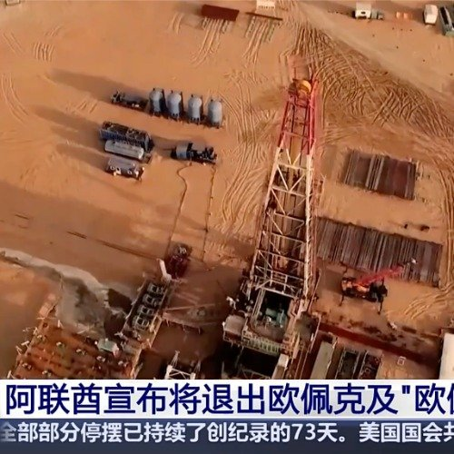

@李建秋的世界

发表于：2026-04-28 15:31

来源：微博

链接：https://m.weibo.cn/status/5292820929447462

\#阿联酋退出石油输出国组织\#

还有一个信息，美国私募里面有中东资金不少，很多私募面临募资困难，只有中东主权基金有钱，2025年美国就吸引了1318亿美元的主权资本，基本上都是中东的。

大头分别是沙特，也是孙正义愿景基金最大LP。

阿联酋穆巴达拉，单年私募投资327亿

阿联酋阿布扎比投资局，投多少未知

阿联酋目前很困难，十有八九是想抽资，但是如果抽资会引发美国私募巨大动荡，这应该是阿联酋和美国互换货币的一个根本。

对华主要是石油总是要卖出去，谈非美元结算时必然的。

存量在美国，实物贸易转中国，双重保险，

那这样的话，石油输出国组织对阿联酋就没用了，不但没用，还会耽误其增产。

---

