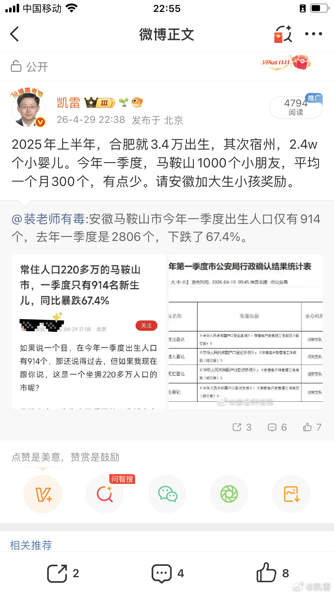

@凯雷
发表于：2026-04-29 15:04
来源：微博
链接：https://m.weibo.cn/status/5293176464084956

安徽也是农业进阶现代化工业大省，今年合肥一个月有没有5000个小朋友，马鞍山全市一个月才生300个小朋友

这个省看着壮！电动车呼呼下线！实则不太行，小朋友越生越少，这个省快快加大动员与专项基金力度，需要年中开个会，多管齐下出招鼓励生小朋友，安徽给稳住！

---

