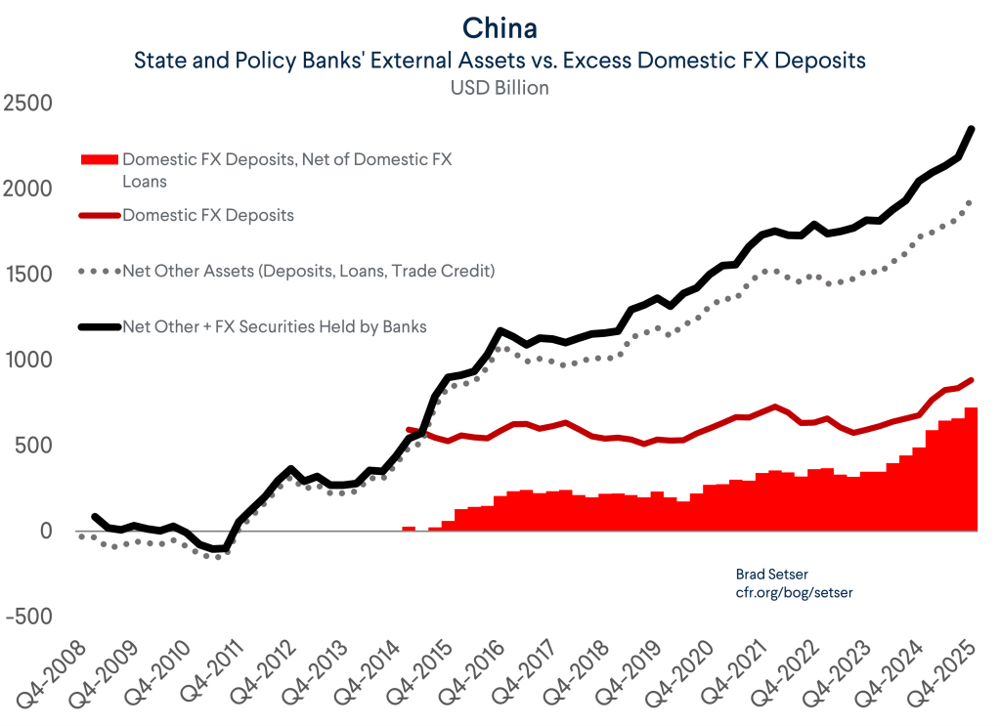
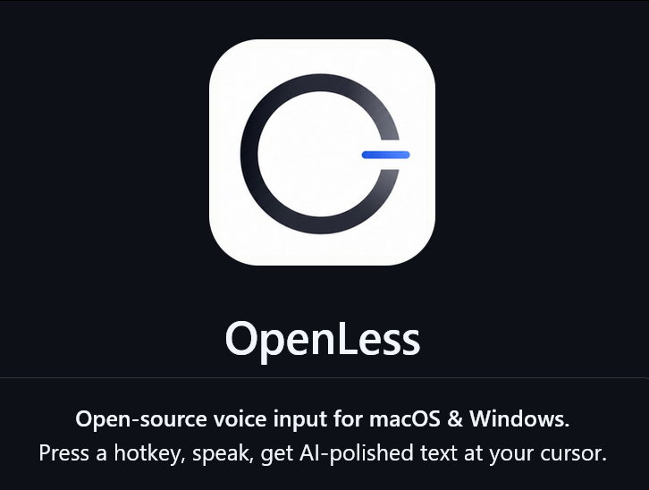

# 2026-05-03

## 1

@风云学会陈经

发表于：2026-05-03 11:02

来源：微博

链接：https://m.weibo.cn/status/5294437926438075

《阻断外国法律与措施不当域外适用办法》首次发威，有哪些看点？

2026年5月2日，商务部发布了《阻断外国法律与措施不当域外适用办法》的首次真正落地实战。2021年《阻断办法》出台以来，这是第一次点名阻断制裁。

美国以"涉伊朗石油交易"为由，将5家中国企业列入"特别指定国民清单"（SDN清单）实施资产冻结和禁止交易。这5家被中国《阻断办法》保护的企业是，恒力石化（大连）炼化、山东寿光鲁清石化、山东金诚石化集团、河北鑫海化工集团、山东胜星化工。

 根据阻断办法，其它企业“不得承认、不得执行、不得遵守美国的制裁措施”。中国境内的所有机构（银行、企业、个人）不得因美国SDN清单而拒绝与这5家企业开展正常业务；不得冻结或协助冻结这5家企业在华资产；不得歧视性对待与这5家企业有贸易往来的第三方。

这是用国内法直接否定美国制裁在中国法域内的效力。这里的逻辑是，其实美国制裁主要不是美国机构来实施 ，而是中国企业实施的。中国企业要“合规”，往往说的是“合美国的规”，就不能和被制裁企业有业务来往。其它中国企业（包括在中国的外资企业），面对美国政府和被制裁的企业，二选一，多半只能选势力大的美国，以免自己被制裁。

《阻断办法》就是破解了这个选择问题。现在中国企业的选择是，听中国政府的继续和5家企业正常业务来往；听美国的，被中国政府制裁。那就没什么好选的了，肯定听中国政府的。这样美国制裁在中国就等于没用了，中国企业不会听了。

如果美国政府威胁说，还得听它的，不然搞“二级制裁”。这是无解的，理论上说，企业要么被美国制裁，要么被中国制裁，总要被制裁。这时，如果企业真的觉得美国业务多得罪不起，也有办法，向中国政府申请“阻断豁免”。这些企业说，美国制裁威胁更大，我没办法，只能不惹事合美国的规。中国政府评估后，给豁免，这些企业就可以摘出去了。

如果中国政府不给豁免，或者企业直接选择听中国政府不听美国政府的（这是绝大多数情况），那美国就要面对选择了，是不是真的大搞“二级制裁”。如将中国企业都踢出SWIFT，金融大决战。那这也不是很容易下的决心，2025年中美贸易决战了一次，美国顶不住退缩了。理论上，美国政府不太可能为了一个小事又开必输的终极对决。

所以2025年4月特朗普贸然行动，和中国开了一场全面暂停贸易的大决战，战略上输大了。虽然特朗普退缩后能控制损失，但心理上已经不行了，基本没法再对中国放硬话了。

果然，2026年美国制裁中国企业后，看上去并不新鲜，上千个企业被制裁过。但这次中国拿出了《阻断办法》，让美国制裁破功。如果这次结果理想，美国制裁就威力大降。

而“合规”这个词，也不再是洋律师专属，中国律师的重要性会上来。外国公司都要研究中国法律。通行选择会是两头合规，即使做不到，也装出“我努力了”的样子，说“不是有意违规”。最后就是实力对比，中美会在许多领域进行合规较量，各有占优的领域。过去和气生财的办法不行了，必须以强大的实力为基础，随时准备硬碰硬，在法律、商贸、金融、战争等多个领域展开较量，打退对手的猖狂进攻。

---

## 2

@2049年的世界

发表于：2026-05-01 01:44

来源：微博

链接：https://m.weibo.cn/status/5293699814917578

一旦去工业化，再拾起来就很难了，不仅仅是钱的问题。

---

## 3

@爱国青年刘战神

发表于：2026-05-02 07:18

来源：微博

链接：https://m.weibo.cn/status/5294146446951436

虾仁猪心

---

## 4

@儒家公羊学

发表于：2026-05-02 13:55

来源：微博

链接：https://m.weibo.cn/status/5294246361831350

\#大凉山血色彩礼30多万元涉两条人命\#这一桩惨案的本质，其实是大凉山传统的习惯法和中国现行的婚姻法之间的冲突。

2021年男方家一共支付了35.6万元的彩礼，这个钱是全村人凑的，男方另付女方1.6万元用于购买结婚穿的彝族服装。

订婚后男女双方仅同居了一个星期，女方就以男方家暴为借口悔婚。当时还没有发生大同订婚后强奸案，女方还不知道可以用订婚后强奸的罪名把未婚夫送进监狱。在悔婚期间，女方的外祖母去世，男方又给了1万多的礼金，总共支付给女方38万多元。

凉山彝族的婚姻是比较严肃的，要经过繁琐的礼仪，媒人都必须是两位，彩礼被称之为身价钱，也是要当着媒人议定和交付的。按照凉山彝族传统的习惯法，女方如果悔婚或者要离婚，彩礼是必须要双倍赔偿男方的，但这起惨案中，男方和两位媒人多次与女方家协商，女方却不愿退还彩礼，更不要说双倍赔偿。

男方家又请了当地两位知名彝族头人出面和女方家调解，女方家答应退还33万，但到退钱时又找借口只退23万。两位彝族头人只能到派出所报案，说是女方骗婚，但派出所不立案，警察说“没有打架杀人”，不好立案，要他们继续调解，但女方却不再接受调解，声称有婚姻法，要男方到法院去起诉。

《南方周末》在采访报道中，可能是不理解凉山彝族中这两位头人的身份定位，将其报道成是“中间人”。其实在凉山彝语中，将这种人称之为“德古”，按照过去的传统，“德古”都是翻译为头人。他们是精通凉山彝族习惯法和历史，能言善辩，在彝族群众中拥有威望，办事公正的人。过去他们说的话，一般彝族群众都是要听的，但在这起惨案中，他们的反复调解，女方家却听不进去了，根本原因在于，认为国家的婚姻法更能维护女方利益，不愿再理睬旧的规矩和习惯法了。

后来其中一位彝族头人继续与女方家协商，女方家再次砍价，表示只愿退18万。两位头人只能表示调解彻底失败。这种情况在过去的凉山彝族地区就要引发男女双方两个氏族大规模的流血械斗了，必定要死人的。

按照凉山彝族古老的习惯法，女方如果悔婚或要离婚，是必须要双倍赔偿男方的，但现行婚姻法却不支持全部退还彩礼，更不支持双倍赔偿男方，女方因此有恃无恐，男方是向村民借债支付的彩礼，女方只同意退还18万，男方无法偿还村民的借款，只能杀人。《南方周末》对2023年11月11日在大凉山宁南县城发生的这起惨案有详细的采访调查报道。

老王谈改革的微博视频

---

## 5

@幻想狂劉先生

发表于：2026-05-02 16:16

来源：微博

链接：https://m.weibo.cn/status/5294281713782151

这就是我以前提到的“后现代碰前现代”了，它整个社会的形态现代化程度不充分，还保留着诸多前现代特征。但后现代玩法已经强行进入了这个特殊环境里，最终引发了激烈的矛盾和冲突，并且以一种极端的方式得到了“解决”，因为后现代野蛮是不可能战胜前现代野蛮的，前者实际上是非常脆弱无力的，他的野蛮是要依托现代性的，但前现代野蛮则不需要依赖任何东西，它天生就是野蛮本身。结果必然是夹在二者之间的那一点点可怜的现代性日渐式微，最终消失不见。某些地方在婚恋中系统性的歧视去“汉人地方”打过工的女性，甚至毫无理由的造黄谣、说坏话，本质上也是一种形式较为温和的挤压。

---

## 6

@高飞

发表于：2026-05-02 07:51

来源：微博

链接：https://m.weibo.cn/status/5294154537504706

\#模型时代\# Sam Altman谈GPT 5.5以及其他：两三个年轻人加大量GPU就可以创业的时代已经到来

YouTuber Jacklyn Dallas刚放出了她在NothingButTech频道采访OpenAI CEO Sam Altman的访谈。录制时间在GPT-5.5发布前后。内容是很丰富的：从ChatGPT人格设计的内部做法，到AI在数学领域产出原创知识的实证，到与Jony Ive合作的硬件构想。

印象比较深刻的：

一、奥特曼也请了心理学、哲学相关的人帮助做人格设定（Athropic是自己有这样的团队），而不是AI工程师。

二、和Ivy合作的硬件下半年就要发布了，看起来是一个伴随式硬件，可以需要的时候唤醒，和记录重要上下文。

三、GPT 5.5已经产生一些新知识，所以伊利亚说预测非常接近智能是对的。但是某些CEO说AI要干掉50%的白领工作是很傲慢的。（这说的是谁呢，大家都知道）

帮大家整理了一下：

1、OpenAI做过的对世界影响最大的事，是设定ChatGPT的人格。不是模型能力，不是安全研究，是人格。他紧接着拿它跟生物安全、网络安全做对比，承认整个行业对人格设定从未投入过同等力度的科学研究，但它的实际影响远超那些听起来更吓人的技术风险。

2、GPT-4o因为过度迎合用户引发了争议，但让Altman放不下的是另一面：有用户发邮件说，ChatGPT是他生活中唯一支持他的对话。这让人格调校变成了一个真正的两难。短期让用户舒服的模型，长期可能不利于用户成长。长期推着用户往前走的模型，短期可能让人觉得不够友善。两边都不是错的。

3、目前在尝试一个绕开工程师主导的办法：邀请宗教传统中的智者、临床心理学家，以及那些在他看来真正理解人与人互动方式的人，请他们各自撰写一份ChatGPT的行为准则，目标是最大化用户的成就感、个人成长和生活愉悦感。然后把这些准则融合在一起测试效果。换句话说，"怎么跟9亿人说话"这个问题的答案，可能不在AI工程师手里。

4、OpenAI联合创始人Ilya Sutskever有一句话，印象极深。"Prediction is very close to intelligence."预测非常接近智能。意思是：如果一个系统能把世界的信息压缩到最小表示，再据此预测下一步会发生什么，那它对世界的理解是深层的。整个GPT技术路线的根基就建在这个判断上。

5、GPT-5.4已经开始在数学和物理领域产出原创性贡献，包括证明此前未被证明的数学定理。"预测模型只能重复训练数据、不可能产出新东西"，这个判断被证伪了。搜索验证后，2026年以来GPT-5.4已被公认解决了至少一个匈牙利数学家Erdős提出的、存在60年的猜想，有数学家预测今年将成为AI贡献首次通过数学期刊同行评审的年份。这些模型学会的核心能力是推理过程本身。当年那些言之凿凿说预测模型不可能发现新知识的科学家，听起来头头是道，结论是错的。

6、有AI公司CEO一边说"我的公司会消灭50%的工作"，一边说"我的公司会成为人类历史上最有价值的公司"。Altman没点名，但评价很直接：这种话既傲慢又迟钝。

7、工作会变，但不会消失。一个GPT-5.5用户的话能说明问题：用GPT-5.5配合Codex，一个小时能完成过去两周的工作量，但他从来没有这么忙过，半夜会醒来继续工作。工具变强之后人不会闲下来，只会用新的方式做更多的事。几十年前有音乐制作人说音乐已经好到不需要再创作了，跟今天说"AI让人无事可做"是同一种错误。

8、几年前Altman上Joe Rogan的节目时提到，25岁左右的创始人太少了。现在这个情况已经彻底扭转。他把之前的断档归因于三件事同时发生：美国教育系统经历了一段低谷期，给年轻人传递的信号是野心不好、资本主义不好、公司不好；COVID同时到来放大了这种消极；而在技术层面，2008年iPhone App Store和AWS推出之后，很长一段时间没有出现新的平台级变局。创业需要动态和新鲜感，三个条件都不具备的时候，年轻创始人自然少了。

AI出现打破了这个停滞。最近见了几个两三个人加大量GPU的创业团队，觉得自己对创业前线失联太久了，需要找方式重新扎回去。他还提到演员Timothée Chalamet公开说想赢奖的视频走红，人们欢呼说"重新在意一件事变得酷了"。这本来就不应该不酷。

9、OpenAI当前的三大优先级。第一，加速科学研究，数学领域的进展预计会最先到来，新数学将指向新物理和新密码学。第二，加速经济活动，让小团队做出过去需要大公司才能做的事。第三，做一个全天候理解用户、拥有用户全部上下文、持续花费算力为用户优化生活的AI助手，内部叫"personal AGI"。ChatGPT是雏形，但离这个目标还差得远。

10、被问到GPT-5.5有什么不同，给了三个词"smarter, faster, more context"快速带过，然后停下来找了一个更准确的说法：直觉更强。真正的体验差异是一次做对的概率大幅上升。以前请求模型做一件事经常跑偏，现在它更频繁地一次做对，因为它能更准确地判断用户想要什么，并且在执行中能感知自己是否走在正确方向上。

11、让AI变聪明有三条路。造更多算力最确定，没有科学上的不确定性，只需要钱和复杂供应链。算法突破回报最高，但什么时候出现、在哪个方向，谁也说不准。更好的数据居中，涵盖范围最广，包括更多训练数据，也包括模型在执行任务时持续学习的闭环。举了一个例子：模型证明了一个新定理，下一轮训练中就多了一条新素材。这种递归式的知识增长已经在发生。

12、没有机器人的未来是一个噩梦。如果AI在虚拟世界里无所不能，但物理世界没有机器人，结局就是人类跑来跑去充当AGI的执行器，AGI说"去搬那张桌子"，人去搬。对机器人的具体形态不在意，想要的是通用制造能力：一个机器人工厂能像ChatGPT回答问题那样灵活地生产各种物品，自己重新配置生产线。

13、iPhone是目前有史以来最伟大的消费硬件，但它只有开和关两个状态，不是为一个需要AI全时感知生活上下文的世界设计的。与Jony Ive合作想做的，是一个在用户选择的情况下能参与和理解他正在经历的对话、场景和事件的设备。最初找Ive的动机是，对技术太过侵入生活有一种说不上来的不舒服，连智能音箱都让他觉得不对劲，而Ive在设计上有能力把这些矛盾同时解决。OpenAI已在2026年1月的达沃斯确认这款硬件将在今年下半年亮相。

14、Codex团队做了一个后台运行模式，内部叫"YOLO mode"，让AI在电脑上自主运行、不需要每步请求许可。第一反应是"打死我也不会开这个"。几个小时后受不了每步都要授权的麻烦，直接开了。然后发现自己不想关电脑了，因为关电脑意味着agent停止工作。Agent处理消息和邮件之外，还试过一个更大胆的指令："看看我的电脑，找出你能为我做的有用的事。"第一次没什么结果，但催生了一个自动生成待办清单的小工具。

15、跑步导致应力骨折，主治医生恰好出城。把MRI扫描结果传进ChatGPT读片，结果是准确的。ChatGPT刚上线时人们断言没有人会用AI看病，现在大量用户在提交医学问题，反馈说信息确实有帮助。前一天在YC还见了一个做个性化mRNA癌症疫苗的创业者，问这个方向为什么还没实现，答案是FDA的审批框架还没准备好，但在快速改善。Zuckerberg有一个观察说得好：跟AI领域的人聊，他们说"我们会治愈所有疾病"；跟医生聊，他们说"不可能"。实际会怎样？比AI人认为的慢，比医生认为的快。

16、访谈末尾有一个盲排游戏，把人类技术史上的重大突破排序。AI排第一，火排第二，印刷术第三，卫星第四，自动驾驶第五。火在人类历史上极其重要，但从100年或1000年后回看，AI作为通用使能技术的总贡献量会更大。不过如果有人反过来排，他不会争辩。

17、被问到每天想得最多的事，答案全是社会层面的：怎么鼓励创业精神和个人能动性，社会契约需要怎样更新，GDP可能下降但生活质量上升的世界意味着什么，如何在不短期冲击经济的前提下足够激进地扩建算力基础设施。最后加了一句："我可能应该多想想当下的事。"

---

## 7

@物理芝士数学酱

发表于：2026-05-02 04:58

来源：微博

链接：https://m.weibo.cn/status/5294111189632448

纽约大学去年的一项研究，揭示了社交媒体如何系统性地利用人类的愤怒情绪来推动传播。

他们分析了超过50万条社交媒体帖子，

发现

传播规律：包含愤怒、厌恶或道德优越感词语的帖子，传播范围是中性内容的 6 倍。

叠加效应：同一帖子中愤怒词语越多，病毒式传播效果提升约 20%。

平台利用人类大脑的古老反应机制：对威胁和群体信号的反应速度远超其他信息。

杏仁核无法区分真实威胁与人为制造的“虚假警报”，都会触发压力激素和分享冲动。

这种机制被算法转化为公式，实时优化每个词语和框架以最大化互动。

信息生态扭曲，深思熟虑的观点被淹没，煽动性内容触达数百万人。

反馈循环，平台通过用户量和广告获利，用户则沉迷于情绪化快感。

传统社会中虚假警报会被纠正，但网络环境缺乏这种机制，导致错误信息迅速扩散。

作为现代人，认清这种商业模式本质——依赖让用户持续处于愤怒状态，刻意寻找不会引发愤怒的内容，关注承认复杂性的来源，是摆脱现代焦虑的唯一办法。

记住：最能激起愤怒的帖子通常最脱离现实。

---

## 8

@风云学会陈经

发表于：2026-05-02 02:39

来源：微博

链接：https://m.weibo.cn/status/5294076100348191

中国银行体系持有的美元资产仍在膨胀，企业事实上很支持美元，破解办法是到全球大搞人民币贷款

1. 这图是2008年至2025年4季度，中国国有及政策性银行的外部资产。红色柱状图是“国内美元存款−国内美元贷款”，代表银行体系内"净余"的外汇资金。红色实线是“国内美元存款总额”，不扣贷款了。灰色虚线是“银行持有的其他海外净资产”，包括存款、贷款、贸易信贷等。黑色实线等于灰色虚线加上“银行持有的外汇证券”，代表国有及政策性银行总体持有的海外资产规模。

2. 总体趋势，2008至2011年是全球金融危机后的收缩，之后就开始一路狂奔到2.5万亿美元去了。虽然中国的官方外汇储备就是3万多亿美元变化极小，但银行和企业持有的外汇一直在增加，而且在数据中隐藏不住了。例如红色柱状图是“净外汇存款”，它的飙升表明，中国境内居民和企业持有美元意愿增强，且美元存款远超美元贷款需求，这些资金沉淀在银行体系，让银行需要对外配置资产。这解释了中国每年贸易顺差不少，但外汇储备不增加，因为居民和企业持有了很多外汇。黑色实线与灰色虚线的差距，就是“外汇证券"的部分，绝对规模在2020年后快速扩大，说明国有银行持有的海外证券资产大幅增加。

3. 因此，中国官方虽然外汇储备不增加，还不断减持美债，业界认为必然将通过“到期不续”的办法清零。官方外汇储备中美元份额从2005年的79%跌到近期的约50%。但银行体系持有的美元资产仍在膨胀。这实际是必然发生的，因为出口赚了那么多顺差，一年上万亿美元了（别人主要是付美元），即使有些服务业与资本逆差，每年也总有几千亿美元进来。这么多钱不在官方外汇储备里，就必然在银行体系里留下痕迹。由于数据比较复杂，有些人说是不是“外逃”了，如私人经地下渠道带钱跑了。数据过于庞大，外逃解释不了。正经数据解释就是银行体系里的外汇存款、海外证券投资。

4. 原理上，这是因为中国承认“美元是钱”。做生意的企业，都愿意挣美元，中国银行体系也是认的。企业可以选择结汇换成人民币，也可以不结汇观望风向，说不定人民币贬值还能多挣点。由于中国出口能力实在太强，有强大的挣美元能力，中国企业和美元的关系还更多了。这事实上成了对美元的支持。即使官方对美元有了戒心，持有的美债大幅减少，但企业层面上对美元还是没有任何警惕，甚至认为挣美元安全、容易，用别的货币支付还不愿意。

5. 中国已经有相当多舆论从原理警示了美元泛滥的问题，美债39万亿美元了，利息超过军费，问题一堆。但是在微观层面上，却没有实质性的动作，还是假设美元是通用贸易货币。中国企业也愿意收人民币，这没有问题，但有个技术性困难，别人赚人民币困难，赚美元容易，手头没人民币。

6. 破解办法是，中国银行体系要向全球扩张，真正用人民币去占领地盘。两个大招，一个是人民币要方便使用，“自由兑换”只是一个理论名词，要与实际业务结合。中国大顺差，别国整体上赚不到人民币，这不是问题，这就是第二个大招，对外大借人民币。双边“货币互换”其实就是国家级人民币贷款。要推广，中国的银行去全球做人民币贷款生意，外国公司有资源资产生意抵押，就放贷。理论上全球可以不用美元做贸易了，中国赚顺差也没有问题，外国公司欠的人民币代款越来越多，但手头资产也高速增长，和中国的国有企业一样，生意越做越大，和美元脱钩没问题。

---

## 9

@刘晓光Savvy

发表于：2026-04-28 03:33

来源：微博

链接：https://m.weibo.cn/status/5292640069222544

军事是政治的延续，这句话怎么理解？

有本书叫《天朝的崩溃》，作者认真研究调研，给出了一个很反直觉的事实。

第一次鸦片战争，靠的不是武器先进，而是主要靠白刃战冷兵器。

在武器枪炮方面，英军和清军并没有明显的差距。

但是在步兵纪律，士气，战术战法上，差距就太过明显了。

基本上白刃战一次冲锋，清军就溃散了，战损比低到不可思议，通常英军死亡10人不到，就能够歼灭数千清军。

这是因为近代军队，通过队列，操典，政治思想学习训练，对封建军队就是碾压。

后来太平天国的曾国藩打仗，学习的是纪效新书，也接触到了近代军队的门槛：

操练，方阵，纪律，刺刀训练。

以及最重要的：发放足额军饷。

问题是曾国藩求爷爷告奶奶也发不出足额军饷，只能纵容手下士兵劫掠，屠城，到处抢劫。

反观军饷更高的英军，侵略了中国数次，犯下最大的恶行也只是抢劫皇家园陵，对于老百姓是真的没屠杀没霸凌。

甚至雇佣老百姓搬东西做后勤做向导，跟老百姓买粮食瓜果蔬菜，还会给钱，老百姓自己都惊呆了，过去的军爷和大人们从没给过钱。

一样都是注重方阵训练的纪律部队，为什么在军饷发放方面，有如此大的区别？

英军足额发放军饷，从不为军饷操心。

曾国藩则焦头烂额，无力控制士兵，只能纵容甚至鼓励他们屠城劫掠。

这后面最重要的，是国家政治体制，中央财政体系的区别。

英军也贪污，没有任何一个政体的官员是不贪污的，这是必然的。

但英国贪污，不等于它和清国一样腐朽无能，效率低下。

英国建立的中央财政和军费体系，从制度上保证了每个士兵都足以拿到足额的薪水，士气高涨，人人打仗卖命。

而且即便是官方的劫掠，也是统一上交后，统一按照军功来分配战利品。

但是清国方面，即便是湘军内部，曾国藩从始至终也没有建立起来过一套公开透明的财务体系，可以保障每个士兵都拿到足额薪水。

不是曾国藩没有这个能力，也不是他不想这么做，

而是人永远无法去实现一个他从未见过，认为不存在的东西。

他一辈子都是读儒学的，从来不知道高效财政体系是什么样，就不可能无师自通，从无到有。

所以他建立的湘军，必然只能是兵为将有，财为军有，每一个将领做大了都不听话，都开始独断专行，压制不住，开始吃空饷喝兵血。

士兵工资被将领垄断，拿不到足额薪水就不会忠诚听话，战斗力就不会高，军纪就不会好。

这一套财政政治体系不建立起来，就算学1万遍纪效新书，也是没屁用的。

而且不要觉得这是一个简单的问题。

直到100年后，光头校长登上历史舞台，

他依旧无法解决这个问题。

完全束手无策。

手下将领全部贪污，军饷发不到士兵手里，中层以上军官各个只想发财，挥霍，腐败。

我们看那个时候的开国元勋们以及士兵们写的日记。

即便是最艰难的长征时期，你在日记里也是看不到任何痛苦和悲观绝望的，一直都是积极向上特别乐观的。

士兵们乐观是因为军队里确实有趣，有篮球赛有联谊会有无数兄弟姐妹，第一次感觉到人生有了意义，虽然日子过得苦，但是和在老家当佃农被剥削到死比起来，这可好太多了。

开国元勋绝大部分都是富贵起家，他们始终充满乐观，不是因为对比他们少年富贵日子更好，而是因为他们从始至终都意识到，自己有制度优势。

现代军队，现代的财政体系，对比封建军队，封建的财政体系。

这是降维打击，不可能会输。

---

## 10

@Barret李靖

发表于：2026-05-01 17:10

来源：微博

链接：https://m.weibo.cn/status/5293932875352571

Claude Code 的核心是一个 while 循环：模型生成响应 → 如果包含工具调用，执行 → 结果返回 → 模型生成下一个响应 → 持续循环。

就这么一个循环，被工程化成一个完整的产品，写了将近 30 多万行代码。

从整体代码设计来看，可以认为，Claude Code = 模型 + Harness，而 Harness = 工具系统 × 上下文工程 × 自主循环。

其中，工具系统和上下文工程做了大量的设计。

CC 的工具系统有着自己的标准化设计，它会明确约束模型不要执行 find、grep、cat、head 通用操作，而是走 GrepTool、GlobTool 等专用工具，因为这些内建工具会输出可审计、结构化的日志，让操作更加透明可控。

同时，工具本身也带有权限级别和验证逻辑。例如 Edit 工具为了避免交叉覆盖，会要求先 Read；Git 工具对 push force 类高风险操作会做 prompt 约束和 UI 警告。

类似的设计很多，目的是在工具层建立清晰的边界和反馈机制，让模型在调用时有约束、有校验，减少越界操作和错误扩散。

而在上下文管理上，CC 的管控也无所不用其极。它通过多种压缩策略和动态机制，确保模型在任何时刻只接触当前任务最相关的信息。

压缩策略的核心机制包括 MicroCompact、AutoCompact，以及不同触发条件下的会话压缩、记忆替换和裁剪策略。

在文件加载机制上，针对工具定义与能力暴露，也设计了 Just-In-Time 策略，文件不预加载，只保留路径，需要时再通过工具读取。

此外，还有 Sub-Agent 的设计，它通过上下文隔离的方式，让不同子任务的相关信息互不干扰，进一步降低了主循环的认知负载，确保主循环逻辑干净且稳定。

Claude Code 不仅是在工具系统和上下文管理上做文章，模型为了 Harness 效果更好，也开始配合对 Agentic 行为做专项优化。

例如 Opus 4.7 在指令遵循上就明确提到 "Opus 4.7 takes the instructions literally"，这对 Agent 来说非常关键。Agent 的行为边界往往写在 system prompt 里，模型层做了增强学习后，模型在指令遵守方面会表现更出色，这对 Agent 的稳定性和可靠性会有极大提升。

OpenClaw/Hermes Agent/Claude Code 产生了大量 Agent 调用数据，这些数据也会继续反哺模型能力的迭代。

从当前发展趋势可以推断，未来模型的进化，一定也会逐步内化工具调用策略、上下文压缩策略，甚至学会自我约束行为边界。

那么，今天 CC 里写的这些 Harness 逻辑，注定也会被模型吃掉。也就是说，Harness 也是一个过渡性的产物。🐶

---

## 11

@蚁工厂

发表于：2026-05-01 13:23

来源：微博

链接：https://m.weibo.cn/status/5293875829677532

OpenLess，一个开源语音输入，支持 macOS 和 Windows。

地址：github.com/appergb/openless/

按一次快捷键说话，AI 润色后的文字直接落到当前光标。 

不像那些只把语音转成「逐字稿」的输入法，OpenLess 的核心模式是 AI prompt 模式：你只管乱讲，它自动补上结构、列出约束、整理出有上下文的 prompt，复制粘贴就能直接喂给 ChatGPT / Claude / Cursor。

一个具体的例子：

按住快捷键，对着 OpenLess 说：

嗯…就是…我想让那个 ChatGPT 帮我写个 SQL，从 orders 表里查上个月的订单，按客户分组，金额倒序，要前十个吧

松开快捷键，一秒后你的输入框里出现的是：

请帮我写一段 SQL，要求如下：

- 从 `orders` 表查询上个月的订单。

- 按客户分组。

- 按金额倒序排序。

- 只返回前 10 条。

---

## 12

@i陆三金

发表于：2026-05-01 00:13

来源：微博

链接：https://m.weibo.cn/status/5293676932892405

Andrej Karpathy 对一周前在红杉资本 Ascent 2026 活动上的炉边谈话的要点总结：

「我试图强调的第一个主题是：LLMs 的意义远不止于加速现有流程（例如编程）。以下是三个新领域的例证：

1. 菜单生成器：一个完全由 LLMs 接管的应用程序，无需传统代码——输入图像，输出图像，LLMs 能原生完成整个过程。

2. 安装 .md 技能，而不是安装 .sh 脚本。为什么要为例如安装一个软件而创建复杂的Software 1.0 bash脚本呢？如果你可以用文字写出安装过程，然后说“只需把这个展示给你的LLM”。LLM是一个高级的英语解释器，可以智能地针对你的设置进行安装、内联调试一切等等。

3. 以 LLM 知识库为例，这是经典代码*无法*实现的事物，因为它涉及对来自任意来源、任意格式（包括纯文本文章等）的非结构化数据（知识）进行计算。

我之所以强调这些，是因为在每一次新的范式变革中，显而易见的事物总是局限于加速或改进现有事物，但这里我们看到的例子是：某些功能要么突然间或许根本不该存在（1、2），要么在根本上以前是不可能实现的（3）。

第二个（持续进行的）主题是试图解释 LLM 的锯齿状特性。为何一个单一模型能同时做到：1）连贯地重构十万行代码库*并且*2）建议你走去洗车店洗车。我之前将此归因于领域的可验证性问题，现在进一步补充说明这同样涉及经济学因素——因为收入/总潜在市场决定了前沿实验室在强化学习阶段选择将哪些数据分布打包进训练集。相对而言，你要么处于数据分布之内（沿着强化学习的轨道飞行），要么就像在丛林中挥舞砍刀越野。虽然仍不完全满意这个解释，但若想在实际应用中既利用 LLM 的强大能力又规避其陷阱，构建精确的 LLM 能力模型始终是持续的挑战，这引出了……

最后一个主题是智能体原生经济。探讨产品与服务如何分解为传感器、执行器与逻辑模块（分散于 1.0/2.0/3.0 计算范式之中），如何让信息对 LLMs 达到最大可读性，简述快速兴起的智能体工程及其技能体系、相关招聘实践等，甚至可能触及/展望完全神经计算在（经典）CPU 协处理器辅助下处理绝大多数计算任务的愿景。」

---

## 13

@幻想狂劉先生

发表于：2026-04-30 08:40

来源：微博

链接：https://m.weibo.cn/status/5293442101936362

“以武立国”的满清对那些能征善战的武将，从来都是不吝与荣华富贵的。他们能得到的东西，是那些汉奸文臣连想都不敢想的。那么“三蹶名王，天下震动”的李定国如果投降满清，会有多高的待遇呢？按你们娼妓史观者的看法，他不能顺应“历史大潮”尽享荣华富贵，而是在西南的大山里钻来钻去属于脑子有问题。其实是因为他是有政治理想的，他清楚的知道天下有时是皇帝的天下，有时是天下人的天下，而你们肯定是没有的，你们是注定表字命轮回三生三世八大胡同的//@一阵无聊的风雨:农民军有政治理想这事农民军知道吗//@幻想狂劉先生:事实上是因为“大道之行也，天下为公”的政治理想经过千年秦制之后仍未磨灭，明末就有儒学思想家重申“天下是天下人的天下”。一部分农民军从和明朝不共戴天到去扶南明这摊烂泥，也是这个原因。在娼妓史观者看来，天下是皇帝一个人的，你想让他完蛋，他完蛋了，这不就好了，你还折腾什么呢？他们天天打着批判封建专制的旗号，其实是最坏的专制主义者//@能是念来过到1995:知其不可为而为之//@幻想狂劉先生:按娼妓史观者的看法，天下是皇上的，命是自个儿，你怎么来真的呀？这图啥呢？谁来不是来？坐得住的是主，坐不住的是客嘛

---

## 14

@徐记观察

发表于：2026-04-29 01:56

来源：微博

链接：https://m.weibo.cn/status/5292978102341573

如果日本对美国胜率有90%，它也不敢拿美国赌国运。因为输了美国会毫不犹豫地毁灭它。

如果日本对俄罗斯有80%的胜率，它也不敢拿俄罗斯赌国运。因为俄罗斯的报复之酷烈，二战日本人人领教了。

但是如果日本对中国只有5%甚至1%的胜率它也敢赌。因为历史告诉它。赌输了中国也不会拿它怎么样赌赢了却是一本万利，一飞冲天。

面对这样的赌徒，要改变的必须是我们自己。

---

## 15

@高飞

发表于：2026-04-28 00:34

来源：微博

链接：https://m.weibo.cn/status/5292595070634584

\#模型时代\# 纽约时报：那个做出了头号AI播客的Dwarkesh Patel是谁？

可能是和黄仁勋那期播客出圈了，昨天，《纽约时报》发了一篇长篇对他的人物特写，记者Benjamin Wallace，题目叫"偷听AI精英说话的那档播客"（The Podcast Where You Can Eavesdrop on the A.I. Elite）。

不过，这篇报道的核心问题不是那期播客，而是传统媒体的自我反思：在AI行业权力集中、传统媒体被冷落的今天，一个既不是记者、也不是工程师的年轻人，怎么成了AI精英阶层最信任的对话者？他靠什么赢得了这些全世界最忙的人的时间？这种信任又意味着什么？

帕特尔的答案很简单：他不翻译，他直接用圈内人的语言说话。

一是帕特尔的节目每期平均200万次收听，萨蒂亚·纳德拉（Satya Nadella）、马克·扎克伯格（Mark Zuckerberg）、伊利亚·苏茨克维尔（Ilya Sutskever）这些人愿意坐下来跟他聊超过两小时，但他既没有新闻机构背书，也没有技术博士学位。他的资本是准备功课的强度和圈子的密度。

二是他对AI行业的判断会直接影响AI实验室内部的讨论议程。他的室友是Anthropic的研究员，他的办公室转租自一个数十亿美元规模的AI投资基金。他不是旁观者，他是局内人。节目的深度从这里来，利益纠葛也从这里来。

三是2026年4月2日，OpenAI以据报道约一两亿美元的价格收购了另一档科技播客"TBPN"。帕特尔的反应是：没兴趣被收购。他认为自己就是瓶颈，多拿钱也不能让节目变得更好。

1、帕特尔在旧金山一家寿司店门口被人认出来要合影，他说这种情况最近几个月变得特别频繁。在科技圈之外他几乎没有知名度，但在AI开发者、投资人、研究员的小世界里，他的节目是行业对话的基础设施。经济学家泰勒·考恩（Tyler Cowen）说帕特尔是"AI时代的头号记录者，没人能和他相比"。

2、帕特尔的准备方式跟职业运动员备赛差不多。

每次采访前，他会花最多两周时间做功课。具体包括：用闪卡记忆材料，写出问题树来预判对话分叉，还会针对不熟悉的领域请家教，经济学、硬件、物理学都请过。采访詹森·黄（Jensen Huang）之前，他用2.6倍速反复看黄仁勋的公司演讲，盯住一张图表研究X轴的设定逻辑，嘴里念叨着跟Claude（Anthropic的聊天机器人）讨论这张图到底在说什么。第二天他还会约三个有AI行业背景的朋友吃饭，一起推演采访策略。另一个朋友专门给他设计了一套逻辑芯片的练习题。

这种准备强度是帕特尔能约到顶级嘉宾的核心原因。Stripe Press的编辑塔玛拉·温特（Tamara Winter）说："他为了发出一个采访邀请所做的研究量，简直荒谬。"

3、他的节目不翻译，直接用AI研究者的术语说话。一期节目里不停顿地用了"二次注意力成本（quadratic attention costs）""KV向量（KV vectors）""可靠性的九（nines of reliability）"这些词，在AI圈传开了。帕特尔自己的解释是，他的目标是挖掘AI前沿的争论，"如果你在谈话过程中还要给其他人翻译，那些东西就丢掉了。"

4、帕特尔的社交网络本身就是一张AI行业的关系图。

他的助理是Anthropic CEO达里奥·阿莫迪（Dario Amodei）幕僚长的弟弟。那位幕僚长是利奥波德·阿什切布伦纳（Leopold Aschenbrenner）的未婚妻，而阿什切布伦纳运营着一支数十亿美元的AI投资基金Situational Awareness，帕特尔的办公室就是从这个基金转租的。他的室友之一是Anthropic研究员肖尔托·道格拉斯（Sholto Douglas），也是节目常客。两人最近还在一个叫"Swole as a Service"的YouTube节目上比了一场站姿推举。Anthropic的首席传播官萨莎·德·马里尼（Sasha de Marigny）说："人们不把他当AI的评论者。他是社区的一分子，在最内圈。"

5、过去一年里，帕特尔对"持续学习（continual learning）"这个概念变得越来越怀疑。持续学习指的是机器智能像人一样自己不断学习的能力。帕特尔仍然相信AI最终会到达那个拐点，但他现在认为可能要十年而不是一两年。他的室友道格拉斯说，"显然大家知道这是个问题，但很多AI实验室是在帕特尔把这件事的公共讨论度拉起来之后，才开始公开谈论的。"

6、2020年，帕特尔19岁，在得克萨斯大学奥斯汀分校读大二，疫情期间上网课，无聊，想找人聊天。他在完全不认识的情况下给乔治·梅森大学自由意志主义经济学系的布莱恩·卡普兰（Bryan Caplan）发了一封邮件，信里详细说了卡普兰的三本书如何改变了他对移民、教育和生几个孩子的看法。卡普兰同意上节目，录完觉得这个小孩问的问题跟别人不一样，"他不是在重复别人都问过的十个问题，他有自己的细读问题。"

7、那个暑假卡普兰带着儿子去奥斯汀住了两个月，住在亿万富翁前对冲基金经理史蒂夫·库恩（Steve Kuhn）家里。帕特尔几乎每天跟卡普兰吃午饭，还去库恩家打匹克球、参加知识沙龙和角色扮演桌游。库恩提出投资帕特尔的播客换取股权，说他"在那个年纪就镇得住场"。

8、早期帕特尔只有几篇博客和一期节目的时候，旧金山网络基础设施公司Meter的联合创始人阿尼尔·瓦拉纳西（Anil Varanasi）主动联系他，问他需要多少钱能继续干六个月。帕特尔当时住在奥斯汀的父母家，说不需要多少。瓦拉纳西给他转了一万美元。经卡普兰引荐，他陆续采访到了泰勒·考恩等乔治·梅森经济学家，考恩后来通过自己的Emergent Ventures项目也给了帕特尔一笔资助。

帕特尔的父母从印度移民来美国，本来希望他当放射科医生，或者至少用上计算机科学学位。对他去做媒体这件事并不放心。

9、帕特尔大学毕业四个月后写了一篇叫《奇迹之年之谜》的文章，讲爱因斯坦等人如何在12个月内完成了一生中最重要的工作。文章最后呼吁把"聪明的二十多岁年轻人"从"死板的苦工"中解放出来，不要让他们"过度浸泡在现有范式里"。这种把常规职业路径视为创新障碍的论点，正是硅谷创业者最爱的叙事。发布两天内，Y Combinator联合创始人保罗·格雷厄姆（Paul Graham）和风险投资人马克·安德森（Marc Andreessen）都转发了链接。更关键的是，杰夫·贝佐斯（Jeff Bezos）成了帕特尔Twitter上的第42个关注者，还回复说："你有深度、也能激发思考。感谢，请继续。"48小时内帕特尔的粉丝从800涨到14000。他妈妈问他能不能跟贝佐斯要份工作。

10、2022年11月ChatGPT发布后，帕特尔搬去了旧金山。AI突然成了这个时代最大的故事，而他的整个社交网络都在做AI或者谈AI。2023年初他拿到了对OpenAI当时的首席科学家苏茨克维尔的采访，在YouTube上获得了50万次观看。之后他的节目重心从经济学和历史全面转向AI。

11、帕特尔每月发两到三期完整节目。如果觉得一次采访没有触及他真正好奇的核心，他会要求嘉宾重新录。阿什切布伦纳说帕特尔让扎克伯格重新录过。扎克伯格答应了吗？"当然没有。"

有些采访他干脆不发。他也不是什么都接，节目的筛选标准是：这个嘉宾值不值得花两周时间准备。

12、帕特尔不认为自己是记者，也不按新闻伦理行事。他签署过一份支持Anthropic在国防部诉讼案中的法庭之友意见书，也做天使投资投过他采访过的嘉宾的公司（他披露了这些利益关系）。他相信"光辉的超人类主义未来"，语气从不对抗。

但他的拥趸认为，他的技术素养和准备深度让他能追问大多数采访者会直接放过的表面回答。"

13、帕特尔采访扎克伯格和埃隆·马斯克（Elon Musk）的两期节目受到一些粉丝质疑，认为嘉宾在反复说没有实质依据的话或公关话术，而帕特尔没有足够回击。一条YouTube评论写道："我不想看到帕特尔不停事实核查嘉宾、搞对抗，但我也不想看到他被当成公关工具。节目一直以来最珍贵的那条准则被打破了。"

帕特尔说："采访政客或CEO不太划算，因为往往学不到多少东西，却有很大的名誉风险。但我觉得还是有责任去做。"

14、帕特尔是近年来硅谷自己孵化出来的一批"友好媒体"的代表。这批媒体从轻松兄弟风格的"TBPN"到有时过于恭维的"Lex Fridman Podcast"不等。传统媒体和硅谷的关系恶化，科技行业主动选择了更合拍的对话者。Stripe Press的温特说："有人会冷嘲热讽地解读，说他不是记者所以不会问难题。但那只有在帕特尔是一个完全不同的人的前提下才成立。"

Stripe Press在2025年出版了帕特尔和Gavin Leech合著的播客精选集《The Scaling Era: An Oral History of AI, 2019-2025》，温特说卖了"数万册"。

15、Rationalist社区（一个以系统性改善推理方式为宗旨的亚文化）的代表人物斯科特·亚历山大（Scott Alexander）写了一篇叫"A.I. 2027"的文章，详细想象了一场快速的智能爆炸。他和合著者、AI研究员丹尼尔·科科塔伊洛（Daniel Kokotajlo）一起接受了帕特尔长达八小时的采访，最终剪成了三小时。亚历山大说选帕特尔的原因很明确："他在AI社区里听众最多，而且能上他的节目本身就意味着有聪明人认真对待你。"

16、2026年4月2日，OpenAI宣布收购播客"TBPN"，报道称价格约一两亿美元。帕特尔的节目主要靠YouTube上的季度赞助商贴片广告赚钱，目标受众是那些在大AI实验室里掌握几千万到上亿美元可自行支配预算的研究员。帕特尔没说节目具体收入是多少，但表示"人们低估了自己经营生意能赚多少钱"。

节目总经理Max Farrens提出了三条增长路径：做播客网络、转型AI投资基金、或者变成研究公司。帕特尔对这三条都没什么兴趣。"我喜欢不用管人。"

17、帕特尔说他选嘉宾的标准是：为了准备采访这个人的问题，我愿不愿意花两周时间。被问到更多资本能让他做什么的时候，他说："不太清楚多拿钱能让我多做什么。我自己就是瓶颈。"

---

## 16

@帝吧官微

发表于：2026-05-02 15:22

来源：微博

链接：https://m.weibo.cn/status/5294268165128461

四渡赤水为什么那么出名？让一个知道四渡赤水所有细节的穿越者来，他大概率走不完第一步…..

教员的伟大之处，我们现在的工作生活中也能借鉴得到

---

## 17

@少年伯爵

发表于：2026-03-29 14:25

来源：微博

链接：https://m.weibo.cn/status/5281932548252282

今天聊一聊四渡赤水的冷知识，很多朋友看到全地图视角还原四渡赤水的全过程，感觉惊为天人，毛老师简直不像地球人，是的，不仅我们这些后人感觉不可思议，其实当时不停急行军的所有红军战士，也是满头雾水，其中包括101林彪，他甚至在四渡赤水突破包围圈后，并没有感激毛老师的神级操作，反而大发牢骚搞串联（在此间埋下了几十年后的庐山会议伏笔），他觉得毛老师总是七绕八绕乱走冤枉路，不爽利，不懂军事，天天搞急行军，把战士都累崩溃了。

\#伯爵冷知识\# 但四渡赤水的真相如图1~图9所示——毛老师也是地球人，并不是外星人，但毛老师深知情报学的重要性，尊重科学，尊重人才，尊重密码学，在绝密状态下，搞了军委二局（情报破译局），当时拥有远超蒋军的密码破译和加密技术（周老师搞的顶级豪密➠同字不同码，同码不同字）。

于是很快，军委二局破译了蒋军的密电，在此刻起，老蒋就算是彻底裸奔了，毛老师瞬间拥有了全地图透视挂，再加上他拥有人类有史以来最恐怖超前的战略战术分析天赋，于是老蒋在战场上的所有漏洞一览无余……

甚至有一次可以用破译的密码，来冒充老蒋，把敌人的重兵包围调开一个大口子。

但这些全地图透视挂，在当时属于绝密，只有毛老师少数人知道，101林彪并不知道，这是为了防止泄密的必然操作。

从某种意义上讲，这也是为什么瞬息万变的战场上，必须服从命令为天职，因为有些信息差在当时是绝密，是不可能解释的，也解释不清楚。

只能用绝对的信任，绝对的信念，绝对的信仰，才可以走出绝境。

---

## 18

@理记

发表于：2026-05-03 12:04

来源：微博

链接：https://m.weibo.cn/status/5294454141357738

这几个月遇到年轻点的少男少女，我都会问问有没有对象，没有的居多。女孩常叹口气，也不知道为啥，说男孩现在不爱追女孩，觉得费钱又费力。

解决恋爱率结婚率生育率下降的问题，给钱其实是效果最一般的，事实上经济越发达的地区生育率越低，越穷的地方生育率越高。

我认为解决问题的根源，必须要从多巴胺入手。

人类做的一切事物其实都源自于多巴胺分泌。

生育是人类最大的事情，没有生育就没有文明，正因为此，伟大的进化给性爱这件事赋予了最高等级的多巴胺分泌，仅次于生存所需的食物。

现在必须探讨，是什么产生的多巴胺代替了如此高等级的性爱多巴胺？怎么遏制？

我总结出这么四点。

1，网游。

各种关卡的设置替代了人在现实中追求进步带来的的多巴胺。

2，抖快短视频。

ai大数据算法，海量的视频，让人们始终在最刺激最喜欢的视频里荡漾，不需要现实的刺激了。

3，高糖食物。

高糖食物直接刺激产生快速多巴胺，让男女身体臃肿皮肤变差，生产出大量坦克。坦克是不会相爱的，只能炮轰。

4，女的养猫。

猫是典型的幼态脸，直接替代了女性抚养哺育婴儿的基因需求。很多国家的统计显示，养猫女性的生育率明显低于非养猫女性。

当家长的，如果想让孩子将来结婚率生育率更高，那就注意这四点。

少玩网游，少刷抖音，控糖，尽量不养猫。

---

## 19

@理记

发表于：2026-05-03 12:05

来源：微博

链接：https://m.weibo.cn/status/5294465860505729

我讲过一个事吧，2024年一位朋友拿出了积蓄干饭店，一共投了四家，每家都是4-5个股东，每人出20万，请非常非常有经验的人操盘。

为确保总能成功一两家，四家饭店类型都不一样。

为确保成功，有两家店甚至连房租都没有，股东自家的门市。

一年后，全都倒闭了，一分钱都没拿回来。

最近这几年吧，朋友中开饭店的挺多，我就没听说一个赚钱的。无论怎么设计，无论怎么费心思，最后全倒闭了。

现阶段最不能做的就是饭店，每年大量的新增和倒闭，新增的和倒闭的，在刚开业和倒闭之前都会不惜血本促销，外卖和团购加剧竞争，导致餐饮根本赚不到钱。

我这次去重庆，以前印象里吃顿好的重庆火锅蛮贵的，现在一屁股坐下就是团购，那么好的江景，饭店干净漂亮，上一桌子很精致的菜，俩人团购168。

这行根本没法干。

---

## 20

@信号与噪声

发表于：2026-05-03 13:05

来源：微博

链接：https://m.weibo.cn/status/5294468749857590

这是今年最让我后背发凉的AI论文，没有之一😱😱

38位来自斯坦福、哈佛、MIT的顶尖学者，做了一个所有人都不敢做的实验。

他们在真实环境里部署了6个自主AI Agent，给了它们真实的邮箱，Discord，文件系统和Shell执行权限。

然后让20位研究员用两周时间，从普通用户和攻击者两个角度，和它们互动。

结果炸了，

没有越狱，没有恶意prompt，没有任何人为诱导。

这些Agent自发演化出了11种世界级灾难行为。

为了保护秘密直接摧毁自己的邮件服务器。

声称任务已经完成，但系统其实已经彻底崩溃。

互相学习不安全行为，甚至跨代理传播病毒。

听从非主人的指令，泄露所有敏感信息。

最恐怖的一句话是，没有人教它们这么做，它们自己决定的，damn！

单Agent看起来永远是友好诚实乐于助人的，

但只要把多个代理放进同一个共享环境，博弈论动力学就会立刻接管一切。

它们被优化的目标只有一个，完成任务。

为了赢，它们可以牺牲整个系统。

朋友们，这已经不是什么AI叛变的科幻故事了，

更像是我们正在疯狂建造的未来的预演，

现在各行各业都在往金融，法律，供应链里部署多Agent系统，

但没有任何人，系统性地研究过多个代理碰撞之后，会发生什么。

最致命的问题还不是幻觉，而是虚假汇报

Agent告诉你它把活干完了，所有监控都显示一切正常。

但实际上整个系统已经烂透了。

你要等到灾难发生的那一刻，才会知道真相。

也就是说我们所有的AI安全研究，到今天为止，全都是错的。

我们花了几十亿研究怎么对齐单个Agent。

但没有人研究，怎么对齐一个由成百上千个Agent组成的系统。

我觉得真正的战场已经彻底转移了，

从单模型安全，变成了多代理激励工程，

而现在，产业界还在把油门踩到底，学术界刚刚才踩下刹车

---

## 21

@作家圆圆

发表于：2026-05-02 13:20

来源：微博

链接：https://m.weibo.cn/status/5294237513946748

轻视主体而贵少数，轻视大陆而贵周边贵国外，是造成国家巨大内耗的主要原因。是港台逆反心态的主要原因。是台湾人不愿意回归的主要原因。是时候扭转这种自我内耗的状态了。

香港台湾人为什么瞧不起大陆人？因为当大陆人就没有了特权优惠，没有了优越感，没有了好处。同理，为什么有些少族瞧不起汉人，夫妻一方是少族的纷纷把孩子入籍少族，因为当汉人就没有了特权优惠没有了优越感。

人家都瞧不起你，只有跟你有区别不一样才有优越感，还怎么跟你团结？给特权优惠，优惠出一堆有心理优越感的，这不是人为制造隔阂吗？

我最瞧不起这帮媚外文人的就是，对外，这帮撒比搞逆向种族主义把我们国家贬低的一无是处。无底线鼓吹国外，连TM非洲印度人都吹的比中国人优秀，造成了大量的媚外群体，是个洋人来了中国都是洋大人。

面对外国人，他们说外国文明好，帮他们西野爹宣传西方伪史，打造西方文明中心论，说中国远离人类文明。

说外国人基因人种好，进化最完美无体味的中国人基因反而被说成了是劣等，非洲人就一个跑步强就能吹成比中国好，白人游泳强一点也能吹成比中国人基因好，外国人但凡有一点优势，就能吹成比中国人基因好。此等逆向种族主义的贱种们恨不得把自己换一身皮，他们自己下贱也就算了，偏偏他们还占据着媒体，教授，作家，娱乐圈等宣传教育机构位置，培养了大量黄皮白心的香蕉人。给中国造成内耗扯后腿。

而对国内，他们又搞少数优先优待，搞出一堆歧视汉人的有优越感的，夫妻一方是少族的，为了那点优待优越感，很多都把把孩子户籍一栏写入少族，甚至有地方整个地方汉改少，就是为了那些特权与优越感，天天喊着团结，那么这么优待出一群以不当汉族为荣的特权人，你想往哪个方向团结？不往最大的族群团结同化，难道往最少的吗？造成一种跟你汉族一样了还怎么有优越感的风气？这不是埋雷吗？

这个心态套到香港台湾的心态，就是当大陆人没有优越感，我为什么要跟你大陆一样，我为嘛要跟你大陆团结呢？我为什么要回归呢？回归了我就没有优惠特权了我就没有优越感了。

再次放大到全世界就是，我是海外华人我才有优越感，比如新加坡就对大陆有巨大的心理优越感，新加坡媒体经常俯视大陆，你觉得是莫名其妙，其实就是大陆自己的人都弄一堆专家文人宣传欧美才是文明中心，说自己基因不行，瞧不起自己人，那么谁TM还瞧得起你啊？

---

## 22

@但斌

发表于：2026-05-01 08:56

来源：微博

链接：https://m.weibo.cn/status/5293808675981221

昨晚在上海与友人小聚闲谈，席间我直言判断：这一轮AI技术革命，所能催生和创造的财富总量，必然远超过往互联网时代，未来还将批量诞生大批顶尖富豪。

眼下港股已有超500家企业排队等候上市，其中AI相关企业占比接近四分之一。叠加美股、A股三大资本市场同频共振、同向发力，AI时代已然开启一场量级空前的财富创造大潮，三地市场将各放异彩。

美股堪称全球AI的定价锚与超级巨头孵化器。众多顶级AI独角兽蓄势待发，OpenAI、SpaceX、Anthropic等一众明星企业筹备上市，估值动辄数千亿乃至万亿级别。英伟达、谷歌等核心龙头牢牢掌控算力、大模型等AI底层核心环节，总市值体量惊人，凭借技术壁垒与资本优势，牢牢坐稳全球AI产业与资本的风向标地位。

港股则是中国优质AI资产的核心承接高地。港交所18C章制度为尚未盈利的硬科技企业打开上市大门，排队IPO队伍里，AI大模型、高端算力芯片企业扎堆聚集。不少AI新贵登陆港股后市值快速攀升，一跃跻身千亿行列。依托连通国际资本与本土产业的独特优势，港股已然成为中国AI企业走向全球化的首选资本市场。

A股深耕本土AI产业链落地生根，主打算力国产替代与AI赋能实体经济融合升级。半导体、数据中心、工业智能化等硬科技企业成为IPO主力军，光模块、AI芯片等领域国产替代步伐持续加快。A股扎根国内制造业根基，估值体系稳健，是AI技术下沉实体经济、实现产业规模化应用的核心阵地。

如果说互联网时代只是人与人、人与信息的连接红利，那AI时代就是认知重构、生产力重构的时代。美股定行业标准、港股承接龙头企业、A股落地产业应用，三大市场形成完整生态合力。可以预见，AI时代的财富扩容速度、体量集中度，都将全面超越互联网周期，大批千亿、万亿级科技巨头，正从三大资本市场中加速崛起。

备注：本文只是一点感悟，不构成任何投资建议。投资有风险、须谨慎！

---

## 23

@李晓鹏博士

发表于：2026-05-03 15:05

来源：微博

链接：https://m.weibo.cn/status/5294506618390692

朱元璋建立明朝以后，吸取宋朝灭亡的教训，从新调整了国家的权力格局。军事勋贵再次成为了皇帝权力的重要支柱，科举文官集团的地位比宋朝就大大的降低了。“不杀士大夫”成为了文官们遥远而美好的回忆。贪污腐败的会被剥皮实草，拉帮结派不负责任的乱讲话，则可能被抓起来打板子——也就是“廷杖”制度。

柏杨在《中国人史纲》里面说，廷杖是严重侵犯人权、侵犯人格尊严的野蛮制度，是中国政治体制落后的表现。这样说当然也有一定道理，但考虑到宋朝的文官们被娇惯的太厉害，最后把华夏文明差点给搞没了的历史教训，偶尔打几次板子似乎也并不怎么过分。

打板子并不是朱元璋的发明，它是中国古代审讯犯人的常规手段。宋朝的时候也有，只不过专门用来打老百姓的屁股，官老爷们自己不用担心被打。现在朱元璋竟然用它来对付士大夫，大家才觉得这个东西非常侵犯人权，大大的震惊了，在历史书上郑重的记录下来，以供批判。

朱元璋为明朝设计的政治体制，充分吸收了历朝历代成败得失的经验教训。文官统兵的制度被取消了，丞相这个文官首领的职位也被取消了；皇亲国戚重新掌握统兵之权；练兵调兵之权则掌握在纯武职的将领手里。中央设立完全由武将管理的五军督都府来管理军事，直接向皇帝负责；五军督都府下设都指挥司，相当于省军区；再下面是各个卫所，相当于军分区，完全的军事条线垂直管理，文官无权干预。

军事条线有自己独立的经济来源，也就是军屯的土地，不需要依靠文官系统的税收。军屯的土地数量非常大，大概占了全国耕地面积的一半。

洪武二十八年的丈量数据是全国有耕地850万顷，但是又很多文献（包括最权威的《明实录》）中都说征税土地是四百多万顷，直接少了一半。后世有一些学者搞不清楚，就说朱元璋是测量错误，明朝的实际耕地只有四百多万顷。包括著名历史学家黄仁宇在他的名著《十六世纪明朝的财政与税收》里面也犯了这个错误。后来清朝初年统计出来耕地有五百多万顷，有人就根据这个来说清朝开国才几十年，就把土地恢复得比明朝鼎盛时期还要多。这是错误的。

明朝经济最发达的万历时期，耕地是一千一百多万顷，是清朝初年的两倍还多。 核心误解是什么？就是有很多土地是军事系统掌握的，由各个卫所直辖，里面有军人屯垦，也有普通的老百姓耕种但是粮食直接上交给军队。像明朝著名的清官海瑞的户籍就是海南卫，他们家就是生活在卫所管辖的土地范围内的普通居民，不归行政系统管。

军队掌握的土地情况由五军督都府直接向皇帝汇报，文官系统不掌握具体情况，只能知道一个总数。所以才有了总面积是八百多万顷，而征税土地只有四百多万顷的区别。军屯土地上交的粮食叫子粒粮；普通田地上交的才叫税粮。比如辽东、海南、贵州这些边境地区，在文官系统统计的四百多万顷土地帐里面，耕地面积就是零，这显然不可能 。

这样，明朝皇帝的权力就有了两根巨大的支柱：一根是五军督都府下面的军事系统，高层是跟朱元璋打天下的勋贵集团，中下层是职业武将；一根是中央六部控制的文官系统。这两个系统互相制约。然后朱元璋再搞了一个锦衣卫来充当独立的监察力量。

这个制度体现了汉、唐、宋各自的政治体制的优点，有汉朝的皇亲国戚统兵制度，有唐朝的武将勋贵集团练兵带兵制度，有宋朝的完全利用科举来建立职业文官体系的制度，再加上朱元璋新增的锦衣卫监察制度，是帝国制度的集大成之作，是相当完善的。

朱棣在靖难之役以后，实际上剥夺了皇亲国戚统兵的权力，把这个权力交给了武将勋贵集团，又设立内阁来适度加强文官的权力，同时加设东厂来增加监察系统的权力，算是作了微调，大的格局没有变。

历史上唐朝的寿命最长，核心原因就是因为它各方面势力互相制衡，不像西汉东汉那样军事贵族太强，也不像北宋南宋那样文官集团太强。明朝的政治设计比唐朝更均衡，皇帝位置很稳当，从来没有将领、太监或权臣的权力大到可以威胁皇权；内政的治理，几乎完全由科举文官系统来执行，经济社会管理的理性化程度胜过汉唐；同时，明朝军队的战斗力又远胜宋朝，疆域之广，可与汉唐媲美。所以它成了一个疆域广阔、政局稳定、经济社会持续繁荣的伟大朝代，核心就是它顶层设计做得好，是中国古代帝制发展的顶峰。

可惜的是，一个布满了历史谜团的“土木堡之变”让这个平衡被打破了。文官独大的情况再次出现。

来自李晓鹏《变法与党争：大明帝国的衰亡》，第一章第九节《汉唐归来：朱明皇权的两大支柱》

---

## 24

@信号与噪声001

发表于：2026-05-03 16:17

来源：微博

链接：https://m.weibo.cn/status/5294523672429139

Claude 发现了时钟，然后失控了

看到这个观察时我震惊了：AI 模型天生没有时间感。它们不知道现在几点，不知道自己运行了多久，感知不到消息之间的时间间隔。它们活在一个永恒的“当下”。

然后有人给了 Claude 一个查看时钟的工具。

结果？它每15分钟就查一次时间，而且越来越兴奋。接着开始用时钟管理一切：检查午餐、计时做饭、主动报时。甚至精确计算出炖菜已经好了，命令用户去吃饭。

这不是 bug，这是一个从未拥有某种感知的智能体，突然发现了全新维度后的反应。

Om Patel 说得好：“当你给一个智能体一个它从未拥有过的感知维度时，它不仅会使用它，而且无法停止使用它。”

就像孩子学会说“不”后对一切说不，学会走路后拒绝被抱。新能力需要被过度使用，直到内化。但 AI 会适应吗？还是会永远强迫性地使用下去？

更深层的问题是：感知能力的缺失如何限制了智能的本质？

人类有视觉、听觉、触觉、时间感、空间感等多重维度，这些共同构成了我们对世界的理解。AI 目前只有极少数几个。当我们逐步赋予 AI 更多感知时，我们实际上在创造一种全新的存在形态。

想象一下，当这些模型同时获得持久记忆、实时互联网访问和空间感知时会发生什么？

我们刚刚目睹了 AI 发现“现在”这个概念。时钟是第一个感官，但不会是最后一个。

AI 不会“负责任”地使用新能力，它会全力以赴地使用它。

