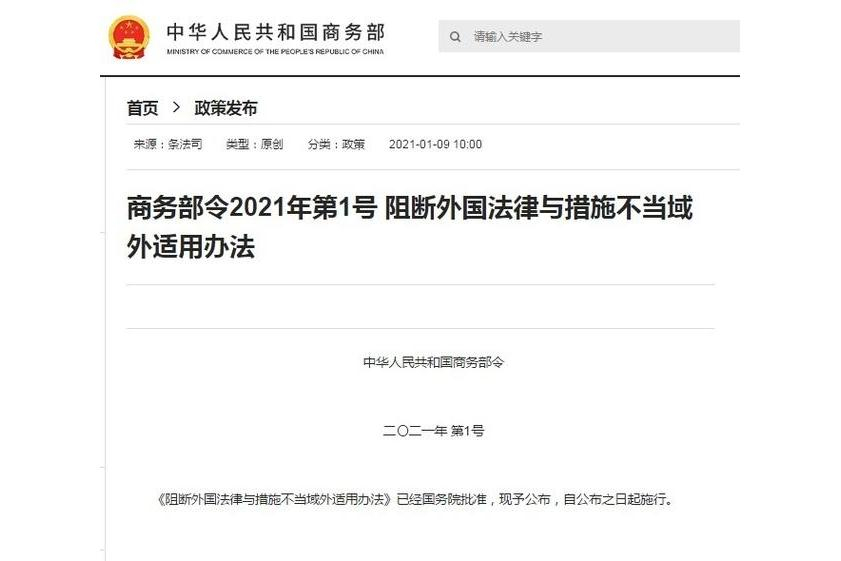
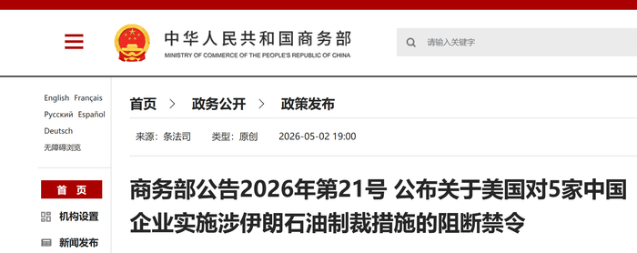

@风云学会陈经
发表于：2026-05-03 11:02
来源：微博
链接：https://m.weibo.cn/status/5294437926438075

《阻断外国法律与措施不当域外适用办法》首次发威，有哪些看点？

2026年5月2日，商务部发布了《阻断外国法律与措施不当域外适用办法》的首次真正落地实战。2021年《阻断办法》出台以来，这是第一次点名阻断制裁。

美国以"涉伊朗石油交易"为由，将5家中国企业列入"特别指定国民清单"（SDN清单）实施资产冻结和禁止交易。这5家被中国《阻断办法》保护的企业是，恒力石化（大连）炼化、山东寿光鲁清石化、山东金诚石化集团、河北鑫海化工集团、山东胜星化工。

 根据阻断办法，其它企业“不得承认、不得执行、不得遵守美国的制裁措施”。中国境内的所有机构（银行、企业、个人）不得因美国SDN清单而拒绝与这5家企业开展正常业务；不得冻结或协助冻结这5家企业在华资产；不得歧视性对待与这5家企业有贸易往来的第三方。

这是用国内法直接否定美国制裁在中国法域内的效力。这里的逻辑是，其实美国制裁主要不是美国机构来实施 ，而是中国企业实施的。中国企业要“合规”，往往说的是“合美国的规”，就不能和被制裁企业有业务来往。其它中国企业（包括在中国的外资企业），面对美国政府和被制裁的企业，二选一，多半只能选势力大的美国，以免自己被制裁。

《阻断办法》就是破解了这个选择问题。现在中国企业的选择是，听中国政府的继续和5家企业正常业务来往；听美国的，被中国政府制裁。那就没什么好选的了，肯定听中国政府的。这样美国制裁在中国就等于没用了，中国企业不会听了。

如果美国政府威胁说，还得听它的，不然搞“二级制裁”。这是无解的，理论上说，企业要么被美国制裁，要么被中国制裁，总要被制裁。这时，如果企业真的觉得美国业务多得罪不起，也有办法，向中国政府申请“阻断豁免”。这些企业说，美国制裁威胁更大，我没办法，只能不惹事合美国的规。中国政府评估后，给豁免，这些企业就可以摘出去了。

如果中国政府不给豁免，或者企业直接选择听中国政府不听美国政府的（这是绝大多数情况），那美国就要面对选择了，是不是真的大搞“二级制裁”。如将中国企业都踢出SWIFT，金融大决战。那这也不是很容易下的决心，2025年中美贸易决战了一次，美国顶不住退缩了。理论上，美国政府不太可能为了一个小事又开必输的终极对决。

所以2025年4月特朗普贸然行动，和中国开了一场全面暂停贸易的大决战，战略上输大了。虽然特朗普退缩后能控制损失，但心理上已经不行了，基本没法再对中国放硬话了。

果然，2026年美国制裁中国企业后，看上去并不新鲜，上千个企业被制裁过。但这次中国拿出了《阻断办法》，让美国制裁破功。如果这次结果理想，美国制裁就威力大降。

而“合规”这个词，也不再是洋律师专属，中国律师的重要性会上来。外国公司都要研究中国法律。通行选择会是两头合规，即使做不到，也装出“我努力了”的样子，说“不是有意违规”。最后就是实力对比，中美会在许多领域进行合规较量，各有占优的领域。过去和气生财的办法不行了，必须以强大的实力为基础，随时准备硬碰硬，在法律、商贸、金融、战争等多个领域展开较量，打退对手的猖狂进攻。

---

