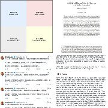

@高飞

发表于：2026-05-02 07:51

来源：微博

链接：https://m.weibo.cn/status/5294154537504706

\#模型时代\# Sam Altman谈GPT 5.5以及其他：两三个年轻人加大量GPU就可以创业的时代已经到来

YouTuber Jacklyn Dallas刚放出了她在NothingButTech频道采访OpenAI CEO Sam Altman的访谈。录制时间在GPT-5.5发布前后。内容是很丰富的：从ChatGPT人格设计的内部做法，到AI在数学领域产出原创知识的实证，到与Jony Ive合作的硬件构想。

印象比较深刻的：

一、奥特曼也请了心理学、哲学相关的人帮助做人格设定（Athropic是自己有这样的团队），而不是AI工程师。

二、和Ivy合作的硬件下半年就要发布了，看起来是一个伴随式硬件，可以需要的时候唤醒，和记录重要上下文。

三、GPT 5.5已经产生一些新知识，所以伊利亚说预测非常接近智能是对的。但是某些CEO说AI要干掉50%的白领工作是很傲慢的。（这说的是谁呢，大家都知道）

帮大家整理了一下：

1、OpenAI做过的对世界影响最大的事，是设定ChatGPT的人格。不是模型能力，不是安全研究，是人格。他紧接着拿它跟生物安全、网络安全做对比，承认整个行业对人格设定从未投入过同等力度的科学研究，但它的实际影响远超那些听起来更吓人的技术风险。

2、GPT-4o因为过度迎合用户引发了争议，但让Altman放不下的是另一面：有用户发邮件说，ChatGPT是他生活中唯一支持他的对话。这让人格调校变成了一个真正的两难。短期让用户舒服的模型，长期可能不利于用户成长。长期推着用户往前走的模型，短期可能让人觉得不够友善。两边都不是错的。

3、目前在尝试一个绕开工程师主导的办法：邀请宗教传统中的智者、临床心理学家，以及那些在他看来真正理解人与人互动方式的人，请他们各自撰写一份ChatGPT的行为准则，目标是最大化用户的成就感、个人成长和生活愉悦感。然后把这些准则融合在一起测试效果。换句话说，"怎么跟9亿人说话"这个问题的答案，可能不在AI工程师手里。

4、OpenAI联合创始人Ilya Sutskever有一句话，印象极深。"Prediction is very close to intelligence."预测非常接近智能。意思是：如果一个系统能把世界的信息压缩到最小表示，再据此预测下一步会发生什么，那它对世界的理解是深层的。整个GPT技术路线的根基就建在这个判断上。

5、GPT-5.4已经开始在数学和物理领域产出原创性贡献，包括证明此前未被证明的数学定理。"预测模型只能重复训练数据、不可能产出新东西"，这个判断被证伪了。搜索验证后，2026年以来GPT-5.4已被公认解决了至少一个匈牙利数学家Erdős提出的、存在60年的猜想，有数学家预测今年将成为AI贡献首次通过数学期刊同行评审的年份。这些模型学会的核心能力是推理过程本身。当年那些言之凿凿说预测模型不可能发现新知识的科学家，听起来头头是道，结论是错的。

6、有AI公司CEO一边说"我的公司会消灭50%的工作"，一边说"我的公司会成为人类历史上最有价值的公司"。Altman没点名，但评价很直接：这种话既傲慢又迟钝。

7、工作会变，但不会消失。一个GPT-5.5用户的话能说明问题：用GPT-5.5配合Codex，一个小时能完成过去两周的工作量，但他从来没有这么忙过，半夜会醒来继续工作。工具变强之后人不会闲下来，只会用新的方式做更多的事。几十年前有音乐制作人说音乐已经好到不需要再创作了，跟今天说"AI让人无事可做"是同一种错误。

8、几年前Altman上Joe Rogan的节目时提到，25岁左右的创始人太少了。现在这个情况已经彻底扭转。他把之前的断档归因于三件事同时发生：美国教育系统经历了一段低谷期，给年轻人传递的信号是野心不好、资本主义不好、公司不好；COVID同时到来放大了这种消极；而在技术层面，2008年iPhone App Store和AWS推出之后，很长一段时间没有出现新的平台级变局。创业需要动态和新鲜感，三个条件都不具备的时候，年轻创始人自然少了。

AI出现打破了这个停滞。最近见了几个两三个人加大量GPU的创业团队，觉得自己对创业前线失联太久了，需要找方式重新扎回去。他还提到演员Timothée Chalamet公开说想赢奖的视频走红，人们欢呼说"重新在意一件事变得酷了"。这本来就不应该不酷。

9、OpenAI当前的三大优先级。第一，加速科学研究，数学领域的进展预计会最先到来，新数学将指向新物理和新密码学。第二，加速经济活动，让小团队做出过去需要大公司才能做的事。第三，做一个全天候理解用户、拥有用户全部上下文、持续花费算力为用户优化生活的AI助手，内部叫"personal AGI"。ChatGPT是雏形，但离这个目标还差得远。

10、被问到GPT-5.5有什么不同，给了三个词"smarter, faster, more context"快速带过，然后停下来找了一个更准确的说法：直觉更强。真正的体验差异是一次做对的概率大幅上升。以前请求模型做一件事经常跑偏，现在它更频繁地一次做对，因为它能更准确地判断用户想要什么，并且在执行中能感知自己是否走在正确方向上。

11、让AI变聪明有三条路。造更多算力最确定，没有科学上的不确定性，只需要钱和复杂供应链。算法突破回报最高，但什么时候出现、在哪个方向，谁也说不准。更好的数据居中，涵盖范围最广，包括更多训练数据，也包括模型在执行任务时持续学习的闭环。举了一个例子：模型证明了一个新定理，下一轮训练中就多了一条新素材。这种递归式的知识增长已经在发生。

12、没有机器人的未来是一个噩梦。如果AI在虚拟世界里无所不能，但物理世界没有机器人，结局就是人类跑来跑去充当AGI的执行器，AGI说"去搬那张桌子"，人去搬。对机器人的具体形态不在意，想要的是通用制造能力：一个机器人工厂能像ChatGPT回答问题那样灵活地生产各种物品，自己重新配置生产线。

13、iPhone是目前有史以来最伟大的消费硬件，但它只有开和关两个状态，不是为一个需要AI全时感知生活上下文的世界设计的。与Jony Ive合作想做的，是一个在用户选择的情况下能参与和理解他正在经历的对话、场景和事件的设备。最初找Ive的动机是，对技术太过侵入生活有一种说不上来的不舒服，连智能音箱都让他觉得不对劲，而Ive在设计上有能力把这些矛盾同时解决。OpenAI已在2026年1月的达沃斯确认这款硬件将在今年下半年亮相。

14、Codex团队做了一个后台运行模式，内部叫"YOLO mode"，让AI在电脑上自主运行、不需要每步请求许可。第一反应是"打死我也不会开这个"。几个小时后受不了每步都要授权的麻烦，直接开了。然后发现自己不想关电脑了，因为关电脑意味着agent停止工作。Agent处理消息和邮件之外，还试过一个更大胆的指令："看看我的电脑，找出你能为我做的有用的事。"第一次没什么结果，但催生了一个自动生成待办清单的小工具。

15、跑步导致应力骨折，主治医生恰好出城。把MRI扫描结果传进ChatGPT读片，结果是准确的。ChatGPT刚上线时人们断言没有人会用AI看病，现在大量用户在提交医学问题，反馈说信息确实有帮助。前一天在YC还见了一个做个性化mRNA癌症疫苗的创业者，问这个方向为什么还没实现，答案是FDA的审批框架还没准备好，但在快速改善。Zuckerberg有一个观察说得好：跟AI领域的人聊，他们说"我们会治愈所有疾病"；跟医生聊，他们说"不可能"。实际会怎样？比AI人认为的慢，比医生认为的快。

16、访谈末尾有一个盲排游戏，把人类技术史上的重大突破排序。AI排第一，火排第二，印刷术第三，卫星第四，自动驾驶第五。火在人类历史上极其重要，但从100年或1000年后回看，AI作为通用使能技术的总贡献量会更大。不过如果有人反过来排，他不会争辩。

17、被问到每天想得最多的事，答案全是社会层面的：怎么鼓励创业精神和个人能动性，社会契约需要怎样更新，GDP可能下降但生活质量上升的世界意味着什么，如何在不短期冲击经济的前提下足够激进地扩建算力基础设施。最后加了一句："我可能应该多想想当下的事。"

---

