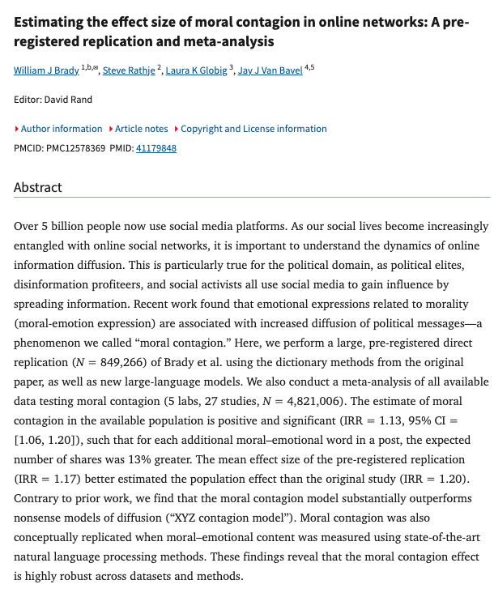

@物理芝士数学酱
发表于：2026-05-02 04:58
来源：微博
链接：https://m.weibo.cn/status/5294111189632448

纽约大学去年的一项研究，揭示了社交媒体如何系统性地利用人类的愤怒情绪来推动传播。

他们分析了超过50万条社交媒体帖子，

发现

传播规律：包含愤怒、厌恶或道德优越感词语的帖子，传播范围是中性内容的 6 倍。

叠加效应：同一帖子中愤怒词语越多，病毒式传播效果提升约 20%。

平台利用人类大脑的古老反应机制：对威胁和群体信号的反应速度远超其他信息。

杏仁核无法区分真实威胁与人为制造的“虚假警报”，都会触发压力激素和分享冲动。

这种机制被算法转化为公式，实时优化每个词语和框架以最大化互动。

信息生态扭曲，深思熟虑的观点被淹没，煽动性内容触达数百万人。

反馈循环，平台通过用户量和广告获利，用户则沉迷于情绪化快感。

传统社会中虚假警报会被纠正，但网络环境缺乏这种机制，导致错误信息迅速扩散。

作为现代人，认清这种商业模式本质——依赖让用户持续处于愤怒状态，刻意寻找不会引发愤怒的内容，关注承认复杂性的来源，是摆脱现代焦虑的唯一办法。

记住：最能激起愤怒的帖子通常最脱离现实。

---

