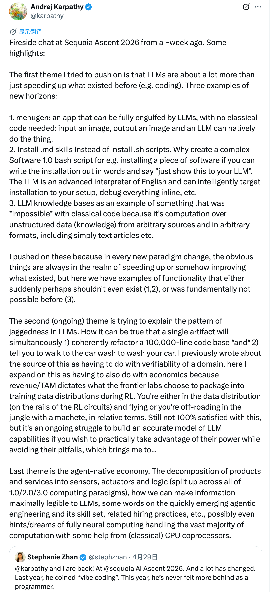

@i陆三金
发表于：2026-05-01 00:13
来源：微博
链接：https://m.weibo.cn/status/5293676932892405

Andrej Karpathy 对一周前在红杉资本 Ascent 2026 活动上的炉边谈话的要点总结：

「我试图强调的第一个主题是：LLMs 的意义远不止于加速现有流程（例如编程）。以下是三个新领域的例证：

1. 菜单生成器：一个完全由 LLMs 接管的应用程序，无需传统代码——输入图像，输出图像，LLMs 能原生完成整个过程。
2. 安装 .md 技能，而不是安装 .sh 脚本。为什么要为例如安装一个软件而创建复杂的Software 1.0 bash脚本呢？如果你可以用文字写出安装过程，然后说“只需把这个展示给你的LLM”。LLM是一个高级的英语解释器，可以智能地针对你的设置进行安装、内联调试一切等等。
3. 以 LLM 知识库为例，这是经典代码*无法*实现的事物，因为它涉及对来自任意来源、任意格式（包括纯文本文章等）的非结构化数据（知识）进行计算。

我之所以强调这些，是因为在每一次新的范式变革中，显而易见的事物总是局限于加速或改进现有事物，但这里我们看到的例子是：某些功能要么突然间或许根本不该存在（1、2），要么在根本上以前是不可能实现的（3）。

第二个（持续进行的）主题是试图解释 LLM 的锯齿状特性。为何一个单一模型能同时做到：1）连贯地重构十万行代码库*并且*2）建议你走去洗车店洗车。我之前将此归因于领域的可验证性问题，现在进一步补充说明这同样涉及经济学因素——因为收入/总潜在市场决定了前沿实验室在强化学习阶段选择将哪些数据分布打包进训练集。相对而言，你要么处于数据分布之内（沿着强化学习的轨道飞行），要么就像在丛林中挥舞砍刀越野。虽然仍不完全满意这个解释，但若想在实际应用中既利用 LLM 的强大能力又规避其陷阱，构建精确的 LLM 能力模型始终是持续的挑战，这引出了……

最后一个主题是智能体原生经济。探讨产品与服务如何分解为传感器、执行器与逻辑模块（分散于 1.0/2.0/3.0 计算范式之中），如何让信息对 LLMs 达到最大可读性，简述快速兴起的智能体工程及其技能体系、相关招聘实践等，甚至可能触及/展望完全神经计算在（经典）CPU 协处理器辅助下处理绝大多数计算任务的愿景。」

---

