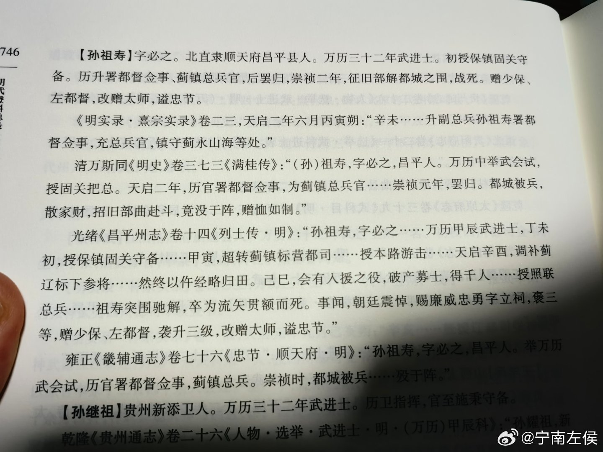

@幻想狂劉先生

发表于：2026-04-30 08:40

来源：微博

链接：https://m.weibo.cn/status/5293442101936362

“以武立国”的满清对那些能征善战的武将，从来都是不吝与荣华富贵的。他们能得到的东西，是那些汉奸文臣连想都不敢想的。那么“三蹶名王，天下震动”的李定国如果投降满清，会有多高的待遇呢？按你们娼妓史观者的看法，他不能顺应“历史大潮”尽享荣华富贵，而是在西南的大山里钻来钻去属于脑子有问题。其实是因为他是有政治理想的，他清楚的知道天下有时是皇帝的天下，有时是天下人的天下，而你们肯定是没有的，你们是注定表字命轮回三生三世八大胡同的//@一阵无聊的风雨:农民军有政治理想这事农民军知道吗//@幻想狂劉先生:事实上是因为“大道之行也，天下为公”的政治理想经过千年秦制之后仍未磨灭，明末就有儒学思想家重申“天下是天下人的天下”。一部分农民军从和明朝不共戴天到去扶南明这摊烂泥，也是这个原因。在娼妓史观者看来，天下是皇帝一个人的，你想让他完蛋，他完蛋了，这不就好了，你还折腾什么呢？他们天天打着批判封建专制的旗号，其实是最坏的专制主义者//@能是念来过到1995:知其不可为而为之//@幻想狂劉先生:按娼妓史观者的看法，天下是皇上的，命是自个儿，你怎么来真的呀？这图啥呢？谁来不是来？坐得住的是主，坐不住的是客嘛

---

