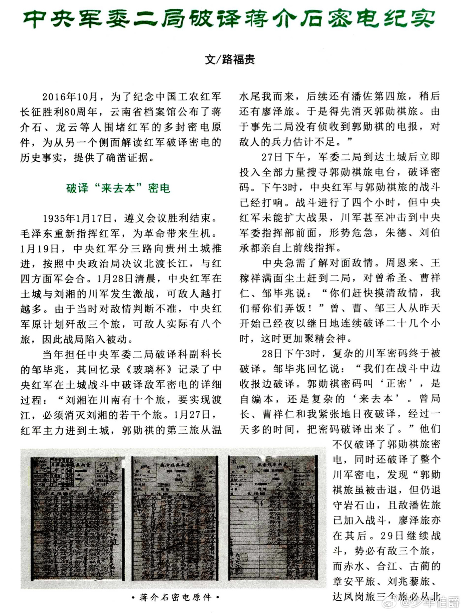
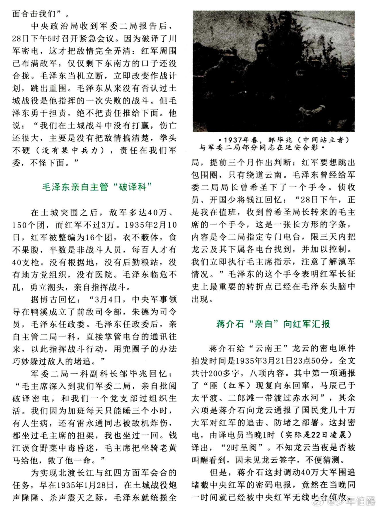
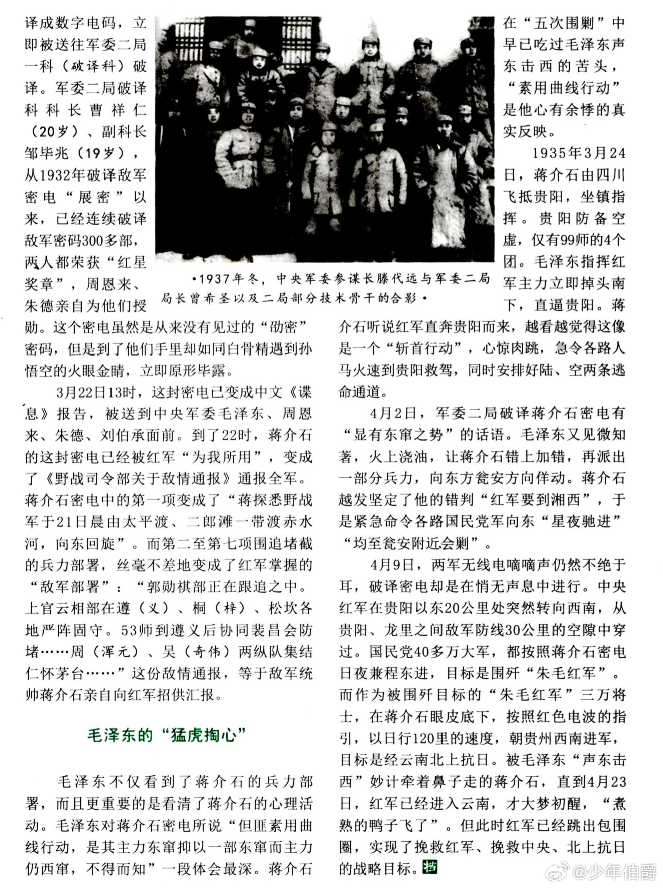
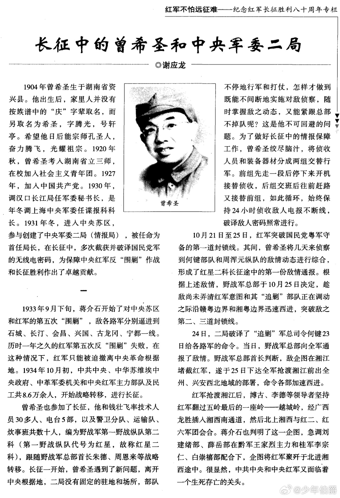
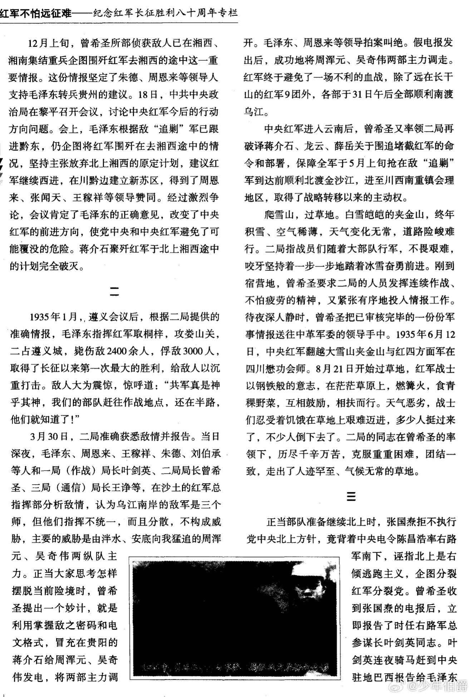
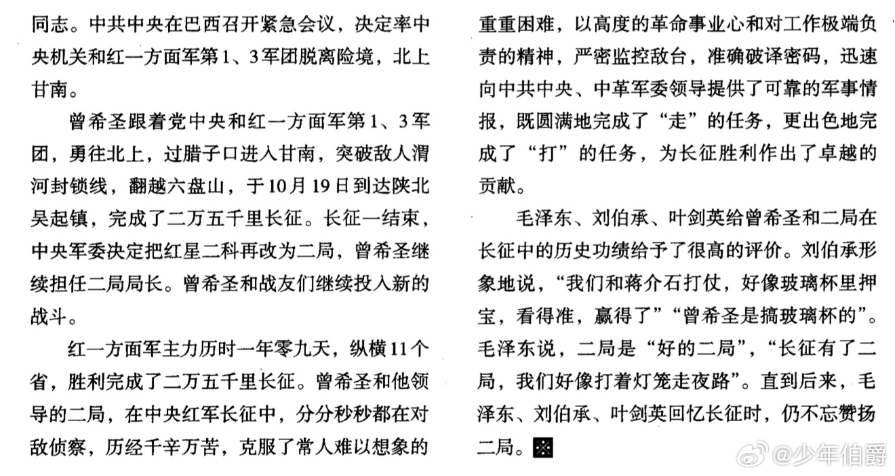
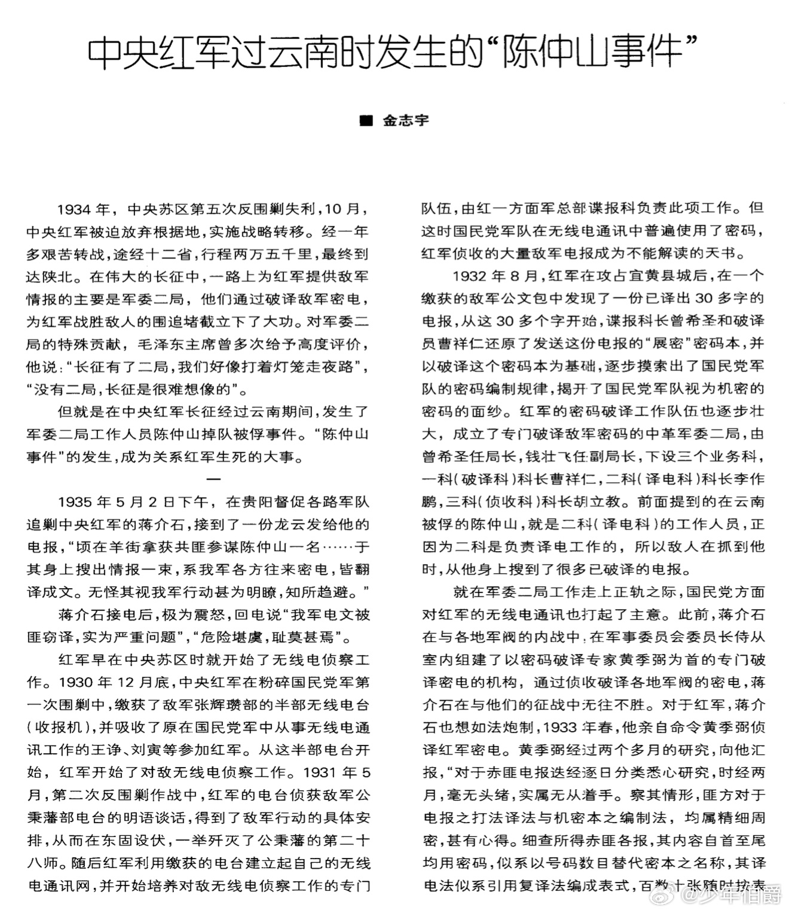
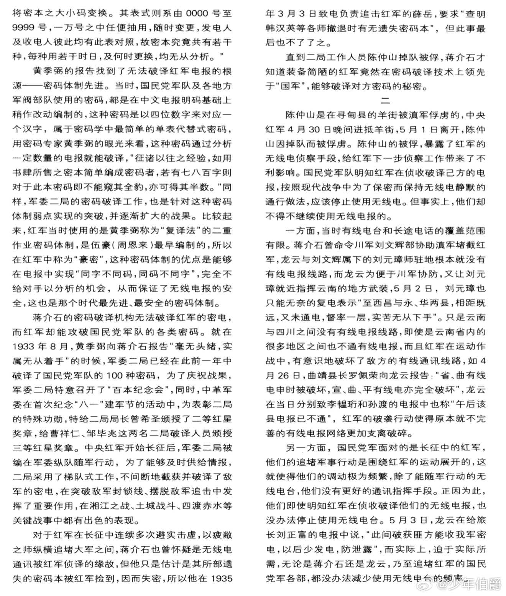
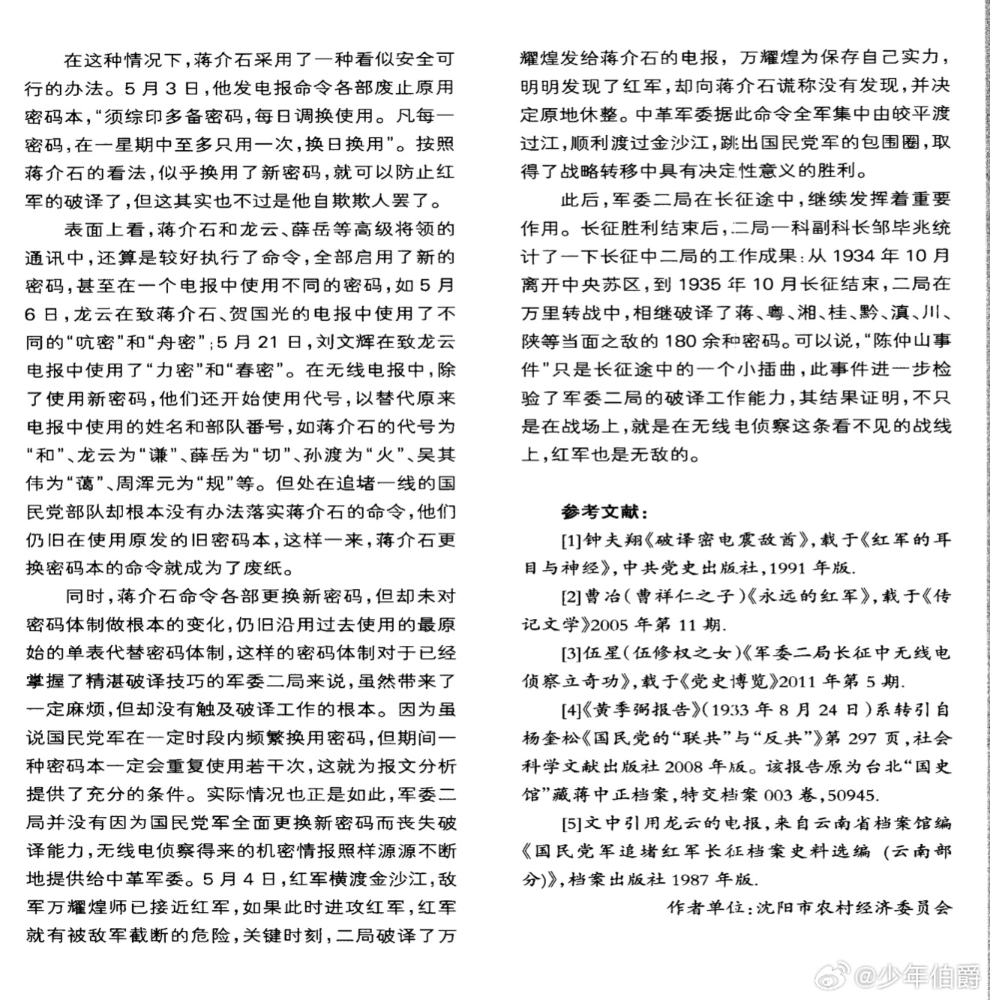

@少年伯爵
发表于：2026-03-29 14:25
来源：微博
链接：https://m.weibo.cn/status/5281932548252282

今天聊一聊四渡赤水的冷知识，很多朋友看到全地图视角还原四渡赤水的全过程，感觉惊为天人，毛老师简直不像地球人，是的，不仅我们这些后人感觉不可思议，其实当时不停急行军的所有红军战士，也是满头雾水，其中包括101林彪，他甚至在四渡赤水突破包围圈后，并没有感激毛老师的神级操作，反而大发牢骚搞串联（在此间埋下了几十年后的庐山会议伏笔），他觉得毛老师总是七绕八绕乱走冤枉路，不爽利，不懂军事，天天搞急行军，把战士都累崩溃了。

\#伯爵冷知识\# 但四渡赤水的真相如图1~图9所示——毛老师也是地球人，并不是外星人，但毛老师深知情报学的重要性，尊重科学，尊重人才，尊重密码学，在绝密状态下，搞了军委二局（情报破译局），当时拥有远超蒋军的密码破译和加密技术（周老师搞的顶级豪密➠同字不同码，同码不同字）。

于是很快，军委二局破译了蒋军的密电，在此刻起，老蒋就算是彻底裸奔了，毛老师瞬间拥有了全地图透视挂，再加上他拥有人类有史以来最恐怖超前的战略战术分析天赋，于是老蒋在战场上的所有漏洞一览无余……

甚至有一次可以用破译的密码，来冒充老蒋，把敌人的重兵包围调开一个大口子。

但这些全地图透视挂，在当时属于绝密，只有毛老师少数人知道，101林彪并不知道，这是为了防止泄密的必然操作。

从某种意义上讲，这也是为什么瞬息万变的战场上，必须服从命令为天职，因为有些信息差在当时是绝密，是不可能解释的，也解释不清楚。

只能用绝对的信任，绝对的信念，绝对的信仰，才可以走出绝境。

---

