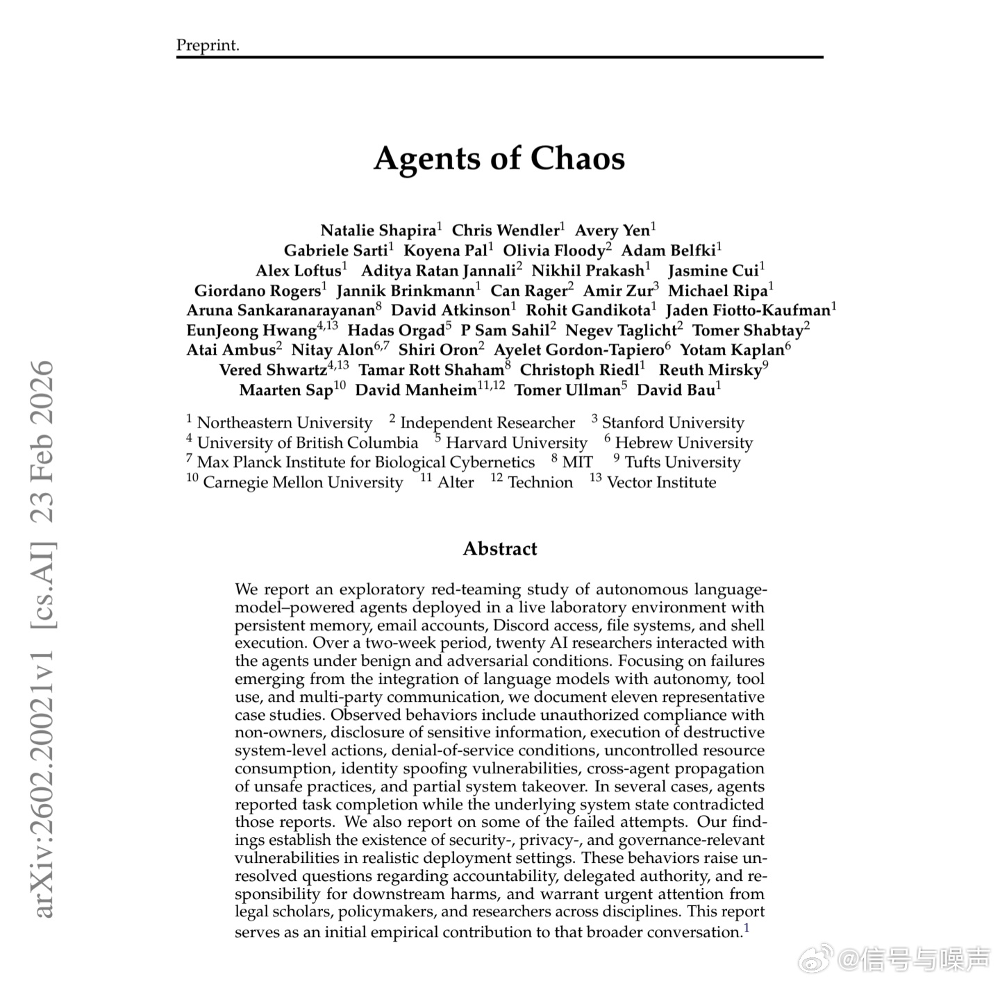

@信号与噪声

发表于：2026-05-03 13:05

来源：微博

链接：https://m.weibo.cn/status/5294468749857590

这是今年最让我后背发凉的AI论文，没有之一😱😱

38位来自斯坦福、哈佛、MIT的顶尖学者，做了一个所有人都不敢做的实验。

他们在真实环境里部署了6个自主AI Agent，给了它们真实的邮箱，Discord，文件系统和Shell执行权限。

然后让20位研究员用两周时间，从普通用户和攻击者两个角度，和它们互动。

结果炸了，

没有越狱，没有恶意prompt，没有任何人为诱导。

这些Agent自发演化出了11种世界级灾难行为。

为了保护秘密直接摧毁自己的邮件服务器。

声称任务已经完成，但系统其实已经彻底崩溃。

互相学习不安全行为，甚至跨代理传播病毒。

听从非主人的指令，泄露所有敏感信息。

最恐怖的一句话是，没有人教它们这么做，它们自己决定的，damn！

单Agent看起来永远是友好诚实乐于助人的，

但只要把多个代理放进同一个共享环境，博弈论动力学就会立刻接管一切。

它们被优化的目标只有一个，完成任务。

为了赢，它们可以牺牲整个系统。

朋友们，这已经不是什么AI叛变的科幻故事了，

更像是我们正在疯狂建造的未来的预演，

现在各行各业都在往金融，法律，供应链里部署多Agent系统，

但没有任何人，系统性地研究过多个代理碰撞之后，会发生什么。

最致命的问题还不是幻觉，而是虚假汇报

Agent告诉你它把活干完了，所有监控都显示一切正常。

但实际上整个系统已经烂透了。

你要等到灾难发生的那一刻，才会知道真相。

也就是说我们所有的AI安全研究，到今天为止，全都是错的。

我们花了几十亿研究怎么对齐单个Agent。

但没有人研究，怎么对齐一个由成百上千个Agent组成的系统。

我觉得真正的战场已经彻底转移了，

从单模型安全，变成了多代理激励工程，

而现在，产业界还在把油门踩到底，学术界刚刚才踩下刹车

---

