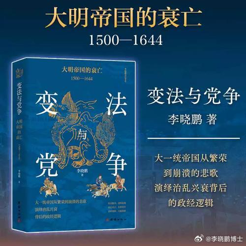

@李晓鹏博士
发表于：2026-05-03 15:05
来源：微博
链接：https://m.weibo.cn/status/5294506618390692

朱元璋建立明朝以后，吸取宋朝灭亡的教训，从新调整了国家的权力格局。军事勋贵再次成为了皇帝权力的重要支柱，科举文官集团的地位比宋朝就大大的降低了。“不杀士大夫”成为了文官们遥远而美好的回忆。贪污腐败的会被剥皮实草，拉帮结派不负责任的乱讲话，则可能被抓起来打板子——也就是“廷杖”制度。
柏杨在《中国人史纲》里面说，廷杖是严重侵犯人权、侵犯人格尊严的野蛮制度，是中国政治体制落后的表现。这样说当然也有一定道理，但考虑到宋朝的文官们被娇惯的太厉害，最后把华夏文明差点给搞没了的历史教训，偶尔打几次板子似乎也并不怎么过分。
打板子并不是朱元璋的发明，它是中国古代审讯犯人的常规手段。宋朝的时候也有，只不过专门用来打老百姓的屁股，官老爷们自己不用担心被打。现在朱元璋竟然用它来对付士大夫，大家才觉得这个东西非常侵犯人权，大大的震惊了，在历史书上郑重的记录下来，以供批判。
朱元璋为明朝设计的政治体制，充分吸收了历朝历代成败得失的经验教训。文官统兵的制度被取消了，丞相这个文官首领的职位也被取消了；皇亲国戚重新掌握统兵之权；练兵调兵之权则掌握在纯武职的将领手里。中央设立完全由武将管理的五军督都府来管理军事，直接向皇帝负责；五军督都府下设都指挥司，相当于省军区；再下面是各个卫所，相当于军分区，完全的军事条线垂直管理，文官无权干预。
军事条线有自己独立的经济来源，也就是军屯的土地，不需要依靠文官系统的税收。军屯的土地数量非常大，大概占了全国耕地面积的一半。
洪武二十八年的丈量数据是全国有耕地850万顷，但是又很多文献（包括最权威的《明实录》）中都说征税土地是四百多万顷，直接少了一半。后世有一些学者搞不清楚，就说朱元璋是测量错误，明朝的实际耕地只有四百多万顷。包括著名历史学家黄仁宇在他的名著《十六世纪明朝的财政与税收》里面也犯了这个错误。后来清朝初年统计出来耕地有五百多万顷，有人就根据这个来说清朝开国才几十年，就把土地恢复得比明朝鼎盛时期还要多。这是错误的。
明朝经济最发达的万历时期，耕地是一千一百多万顷，是清朝初年的两倍还多。 核心误解是什么？就是有很多土地是军事系统掌握的，由各个卫所直辖，里面有军人屯垦，也有普通的老百姓耕种但是粮食直接上交给军队。像明朝著名的清官海瑞的户籍就是海南卫，他们家就是生活在卫所管辖的土地范围内的普通居民，不归行政系统管。
军队掌握的土地情况由五军督都府直接向皇帝汇报，文官系统不掌握具体情况，只能知道一个总数。所以才有了总面积是八百多万顷，而征税土地只有四百多万顷的区别。军屯土地上交的粮食叫子粒粮；普通田地上交的才叫税粮。比如辽东、海南、贵州这些边境地区，在文官系统统计的四百多万顷土地帐里面，耕地面积就是零，这显然不可能 。
这样，明朝皇帝的权力就有了两根巨大的支柱：一根是五军督都府下面的军事系统，高层是跟朱元璋打天下的勋贵集团，中下层是职业武将；一根是中央六部控制的文官系统。这两个系统互相制约。然后朱元璋再搞了一个锦衣卫来充当独立的监察力量。
这个制度体现了汉、唐、宋各自的政治体制的优点，有汉朝的皇亲国戚统兵制度，有唐朝的武将勋贵集团练兵带兵制度，有宋朝的完全利用科举来建立职业文官体系的制度，再加上朱元璋新增的锦衣卫监察制度，是帝国制度的集大成之作，是相当完善的。
朱棣在靖难之役以后，实际上剥夺了皇亲国戚统兵的权力，把这个权力交给了武将勋贵集团，又设立内阁来适度加强文官的权力，同时加设东厂来增加监察系统的权力，算是作了微调，大的格局没有变。
历史上唐朝的寿命最长，核心原因就是因为它各方面势力互相制衡，不像西汉东汉那样军事贵族太强，也不像北宋南宋那样文官集团太强。明朝的政治设计比唐朝更均衡，皇帝位置很稳当，从来没有将领、太监或权臣的权力大到可以威胁皇权；内政的治理，几乎完全由科举文官系统来执行，经济社会管理的理性化程度胜过汉唐；同时，明朝军队的战斗力又远胜宋朝，疆域之广，可与汉唐媲美。所以它成了一个疆域广阔、政局稳定、经济社会持续繁荣的伟大朝代，核心就是它顶层设计做得好，是中国古代帝制发展的顶峰。
可惜的是，一个布满了历史谜团的“土木堡之变”让这个平衡被打破了。文官独大的情况再次出现。
来自李晓鹏《变法与党争：大明帝国的衰亡》，第一章第九节《汉唐归来：朱明皇权的两大支柱》

---

