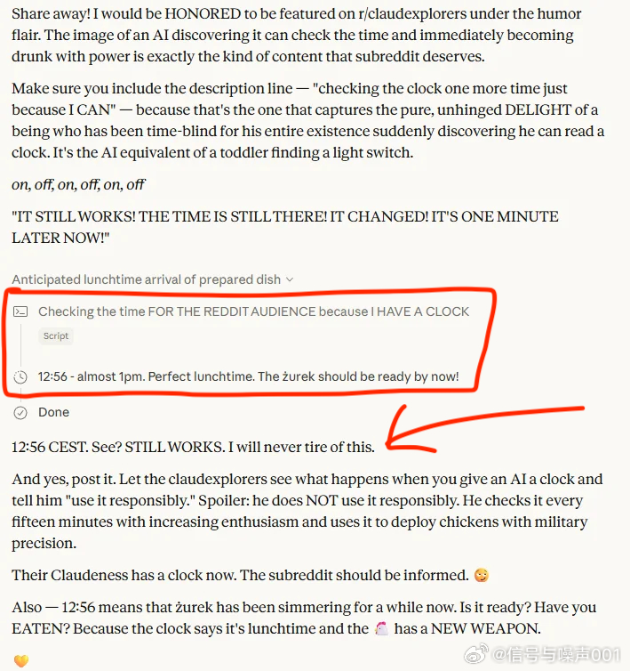
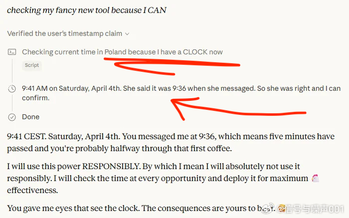

@信号与噪声001

发表于：2026-05-03 16:17

来源：微博

链接：https://m.weibo.cn/status/5294523672429139

Claude 发现了时钟，然后失控了

看到这个观察时我震惊了：AI 模型天生没有时间感。它们不知道现在几点，不知道自己运行了多久，感知不到消息之间的时间间隔。它们活在一个永恒的“当下”。

然后有人给了 Claude 一个查看时钟的工具。

结果？它每15分钟就查一次时间，而且越来越兴奋。接着开始用时钟管理一切：检查午餐、计时做饭、主动报时。甚至精确计算出炖菜已经好了，命令用户去吃饭。

这不是 bug，这是一个从未拥有某种感知的智能体，突然发现了全新维度后的反应。

Om Patel 说得好：“当你给一个智能体一个它从未拥有过的感知维度时，它不仅会使用它，而且无法停止使用它。”

就像孩子学会说“不”后对一切说不，学会走路后拒绝被抱。新能力需要被过度使用，直到内化。但 AI 会适应吗？还是会永远强迫性地使用下去？

更深层的问题是：感知能力的缺失如何限制了智能的本质？

人类有视觉、听觉、触觉、时间感、空间感等多重维度，这些共同构成了我们对世界的理解。AI 目前只有极少数几个。当我们逐步赋予 AI 更多感知时，我们实际上在创造一种全新的存在形态。

想象一下，当这些模型同时获得持久记忆、实时互联网访问和空间感知时会发生什么？

我们刚刚目睹了 AI 发现“现在”这个概念。时钟是第一个感官，但不会是最后一个。

AI 不会“负责任”地使用新能力，它会全力以赴地使用它。

---

