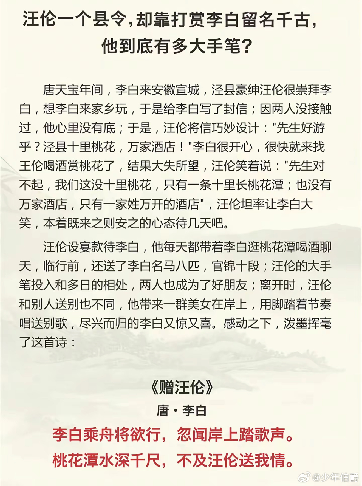
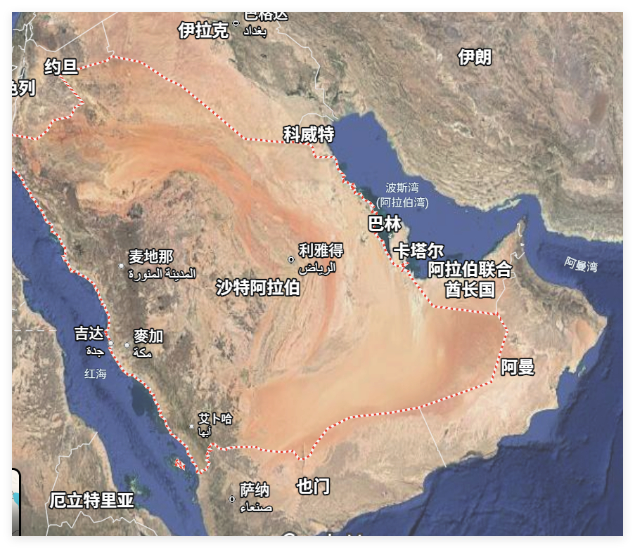

# 2026-05-04

## 1

@李建秋的世界

发表于：2026-05-03 11:01

来源：微博

链接：https://m.weibo.cn/status/5294564831134264

\#以色列紧急向阿联酋部署激光系统\#

我本身不喜欢沙特王储小萨勒曼的，搞奇观。

但是小萨勒曼再差也比阿联酋强。下图我说的只是一部分。

光得罪巴基斯坦就莫名其妙。沙特这么多年一直养着巴基斯坦，那都是有大用的。

本国人口10%，其他是外来人口，我要是阿联酋王爷，我睡觉枕头下面都得放把枪。

新加坡和阿联酋一比，新加坡都是超级大国，新加坡也只是喜欢当教师爷，它可没直接下场。

阿联酋那是只和伊朗沙特巴基斯坦有矛盾吗？

扶持南方过渡委员会，掺和也门，和胡赛对打

利比亚内战，支持国民军哈夫塔尔

苏丹内战，支持快速支援部队，被联合国谴责。

支持索马里兰搞分裂，和索马里关系极差。

搞什么资本 + 雇佣兵 + 港口控制权，试图打造离岸超级大国。

我非常怀疑这阿联酋是不是被外国势力控制了，别说以色列凶，以色列可没掺和这么多的地方，这妥妥美帝作风。

上一次见这么弱还这么嚣张的，是安苏雷克女王

---

## 2

@幻想狂劉先生

发表于：2026-05-03 11:05

来源：微博

链接：https://m.weibo.cn/status/5294565890198385

我日常会用多个Ai组合在一起工作，在他们互相“配合”的过程中，你很容易发现他们的意识形态立场上的差异。

以我为坐标点的话，差异性依次是Claude＞Gemini＞Gpt＞Grok

与我的观点差异最大的是Claude，它几乎试图以它的立场“延异”我提供的所有工作文本，竭力使其温和、中立、针对特定对象（美国、西方自由主义阵营）去攻击性和去批判化。

与我观点差异最小的是Grok，我有好几次心里已经有答案了故意问他，它的大部分表现接近我肚子里的蛔虫。

你们尝试过吗

## 3

@蹄花姐的倦勤斋

发表于：2026-05-03 01:53

来源：微博

链接：https://m.weibo.cn/status/5294426866059277

老公今天跟我详细说了那个朋友是如何野路子、搞关系往上爬的。很有意思，我举两个小例子。

他是个三本，平时在单位也没什么地位容易被人忽视，但他几乎抓着每一次机会有枣没枣都会去打一杆子。

一开始他们要选举工会主席，这个朋友也报名了，自然没有被选上，但他也无所谓，

还有一次他们单位组织去北戴河旅游，大家都说当地人买海鲜便宜。他就去学了秦皇岛话，给卖家砍价。非常蹩脚，我老公都笑得不行，但是他就依旧在不断练习他那蹩脚的秦皇岛话。

我说，他是这种人，有十个机会，他就会一个也不放过，有一个中了就行。但大多数人可能十个里面挑一两个，失败了就受到打击了，可能就再也不抓住机会了。

老公说就是这样的，他是什么都会试，我老公也做不到的。

\#张婧仪团队不被允许进hi6录制现场\# 有时候不被允许了，那就试下一个。

---

## 4

@幻想狂劉先生

发表于：2026-05-03 09:47

来源：微博

链接：https://m.weibo.cn/status/5294546138170882

今天我推荐的政治学经典文本（如图）可以用来解释伊朗伊斯兰革命期间的一些问题。

1978-1979年伊朗伊斯兰“革命”期间，关于“头巾”的斗争是一个非常有趣的政治学议题。在1978年的“反沙阿运动”（这是左翼知识分子主导的反巴列维政治运动）中，伊朗的左翼知识分子、女权主义者在宗教人士的支持下，对巴列维军警奉命强制摘除妇女黑头巾的行为进行了激烈的反抗。讽刺的是，次年（1979）年的妇女节，霍梅尼政权就让她们得偿所愿，并且在公开场合再也不得无故摘下。

自由主义者往往据此，作出“理性中立”的判断：巴列维强制女性摘掉头巾，霍梅尼强制女性戴上头巾，二者同属对个人选择的侵犯，因此在性质上没有差别。这种判断的问题，在于它把“自由”当作一个预先存在的状态，而不是一个需要在特定权力结构中被生产出来的结果。

在抽象意义上，自由当然可以被定义为一种双向选择：既可以戴头巾，也可以不戴头巾。但这种定义，本质上是一种“实验室条件”，类似于自然科学中排除一切干扰变量后的理想状态。在现实社会中，个体从来不是在真空中作出选择，而是在既有的权力结构、文化规范与社会期待中形成其“选择”。

因此，分析这一问题的起点，不是“是否存在强制”，而是：

在巴列维之前，是否已经存在一种对女性戴头巾的结构性强制？

答案显然是肯定的。传统宗教规范、家庭结构与社会评价体系，共同构成了一种长期稳定的权力关系，使“戴头巾”不仅是一种习俗，更是一种带有道德强制意味的社会义务。在这种条件下，“选择戴头巾”本身，并不能简单理解为自由意志的表达。

这正是斯蒂文·卢克斯（Steven Lukes）所谓“权力的第三维度”的核心问题。权力不仅体现在可见的决策与强制之中，更体现在对认知与偏好的塑造之中。正如他所指出的：

 “the most insidious exercise of power is to prevent people from having grievances by shaping their perceptions, cognitions and preferences… so that they accept their role in the existing order.”

权力最隐蔽、也是最有效的形式，在于它使人们在主观上接受既有秩序，从而不再将其视为压迫。换言之，权力可以通过塑造认知来“制造同意”，甚至制造出一种看似“自愿”的服从。

在这一框架下，如果在一个已经存在强大宗教规范压力的社会中，仅仅宣布“允许女性自由选择是否佩戴头巾”，那么这种“自由”在现实中几乎无法运作。因为支配性的规范不会自动消失，它们会继续通过社会机制塑造个体偏好，使得所谓的“选择”仍然落在既有轨道之中。

因此，问题的关键在于：

是否存在对既有权力结构的实质性破坏。

巴列维时期的强制性去头巾政策，虽然在形式上是一种国家权力对个体行为的干预，但其指向并不是简单的行为规训，而是对宗教规范所构成的社会控制机制的直接冲击。在政治学意义上，这是一种以强制手段打破既有权力关系的尝试。它的结果，并不是立即产生自由，而是为自由的生成创造了一种可能性条件。

换句话说，在旧有结构未被动摇之前，“自由选择”是一个空洞命题；而在结构被破坏之后，才首次出现选择空间。这种空间可能演化为真正的自由，也可能被新的权力形式所占据，但无论如何，它标志着一种结构性的断裂。

与之相反，霍梅尼政权的政策则呈现出完全不同的方向。强制佩戴头巾，并不是对既有宗教权力结构的解构，而是将其进一步制度化、国家化。在这一过程中，原本依赖社会规范运作的控制机制，被转化为法律与国家强制力所保障的制度安排。

从卢克斯的角度来看，这意味着两层权力的叠加：一方面是对行为的直接规制，另一方面是对认知与正当性的持续塑造。权力不仅要求服从，而且通过教育、宗教与公共话语，使这种服从被理解为正当乃至必要。在这种条件下，“不戴头巾”的可能性不仅在实践中被压制，在观念上也被逐步排除。

正如卢克斯在讨论支配关系时所提出的另一关键问题：

 “how is willing compliance to domination secured?”

即：支配如何获得“自愿的服从”？其答案恰恰在于，通过塑造认知与价值，使服从不再被感知为外在强制，而被内化为自我认同的一部分。

“权力制造同意”或“自愿的服从”这种例子在日常生活中比比皆是。我住处附近有一个市场，市场里大部分从业者是中东或中亚男性。有一个很有意思的现象，不包头巾的单身东亚女性去这个市场买东西的时候，遭到言语骚扰的概率相当高，但如果身边有一个男性陪同，哪怕他是一个弱小的未成年的孩子，这种情况也基本不会出现。同时，如果东亚女性包上头巾，那么即使单身前往，也基本不会被骚扰。

所以久而久之，我的女性朋友们就养成了我去市场的时候她们才去，我不去市场的时候她们自己绝对不去的习惯。也就是很短的时间内，她们就养成了“自愿在没有男性陪同的情况下不前往特定场所”的习惯。

由此可以得出一个重要结论：

巴列维与霍梅尼在头巾问题上的政策，虽然都表现为“非自愿的强制”，但其政治逻辑完全不同。

前者的强制，作用于既有权力结构本身，其结果是打破结构并开启一种可能的选择空间；后者的强制，则作用于对结构的巩固与强化，其结果是关闭这种空间，使自由在结构上变得不可能。

因此，判断一项政策的性质，不能停留在“是否存在强制”这一表层，而必须考察其在权力关系中的位置：

它究竟是在削弱权力，还是在生产并巩固权力；是在消解“被制造的同意”，还是在进一步制造这种同意。

在这个意义上，两种看似相似的“强制”，一个可能通向自由的生成条件，另一个则从根本上排除了自由产生的可能性。

---

## 5

@李楠或kkk

发表于：2026-05-03 13:31

来源：微博

链接：https://m.weibo.cn/status/5294602542125247

今天只有三种私有数据有意义：

1

行业内真正 top 1% 的东西。

2

动态产生的实时上下文。

3

个人或者公司明确选择的偏好。

换而言之，最顶尖，最新鲜，最任性（不是贬义反而可能是一种关键差异化），

否则。。。

没有意义。

## 6

@深圳宁南山

发表于：2026-05-03 13:31

来源：微博

链接：https://m.weibo.cn/status/5294602539240541

一个不成熟的想法--AI时代需要一个国家有强大组织能力保证人类社会财富分配

现在AI技术在快速推进，例如之前2月7日字节发布的seedance 2.0视频生成模型引起了很大的震动，由于效果逼真流畅方面前进了一大步，被认为会彻底的改变影视行业的创作方式。

最近4月24日发布的deepseek V4，其token成本只有GPT 5.5的不到十分之一，而性能差距只有几个月。

但是我想的是另外一个问题，随着AI技术，加上机器人技术的不断进步，大量行业的工作岗位会消失，这是以前没有出现过的情况。

因为在以前尽管随着技术和效率进步，某一条产线需要的人力会减少，

但是随着效率提升带来人们收入水平提高，需求也随之提高了，整个市场也扩大了，单个工业品需求量大幅上升，由此需要的人力反而增加了。

而且在此过程中还会有新类别的工业品产生，开启一个全新的市场，

比如汽车的发明和量产新增了大量汽车业岗位，

空调，电视等的发明新增了大量的家电类岗位等等，

所以工作岗位并没有减少反而越来越多。

但是现在不一样，人类社会已经和一两百年前的物资短缺时代完全不一样了，那时候的人类汽车，家电，城市化（基建），电子产品都没有普及，而现在则已经基本普及了。

而新的市场也还没有涌现，比如说服务型的人形机器人可能是一个增量大市场，未来很可能家家户户都需要买，但至少现在技术上还不成熟。

因此此时的AI提升效率导致的工作岗位消失，并不能通过产品需求扩大，或者新增几种高需求产品来弥补。

典型的比如自动驾驶出租车，它在取代传统的出租车司机和网约车司机的同时，并没有新增那么多工作岗位。

再比如AI出现对程序员的需求增长是

所以此时的做法，就是需要有一个强大的组织来改变整个社会的财富分配，

比如：

1：缩短全社会的工作时间，提高休假时间，严格落实年假，也可以增加工作岗位数量。

2：未来很可能需要采取“供养人类”方式，即给确实没有工作的人长期发放基本生活补贴，尤其是给要生养孩子的年轻人，给予更多补贴，毕竟生孩子和养孩子也是造福社会。

而生养孩子，是AI和机器人无法完全取代的。

3：比如自动驾驶出租车取代传统出租车和网约车，可用法律法规采取允许个人拥有的自动驾驶汽车在无人情况下上路的形式，也就是你可以自己坐在家里面，自己的车出去跑活打工，同时从法规上限制公司投放的自动驾驶出租车数量和比例，以给个人拥有的自动驾驶出租车留出空间。

4：继续地区转移支付，即大公司云集的发达地区，必须持续的进行区域转移支付到该国的欠发达地区，维持全国均衡发展，也是避免全国人口持续涌入最发达地区。

我的感觉就是，在AI时代，那些没有强大的组织保证社会财富分配的国家，将会陷入非常大的麻烦甚至是社会动荡。

## 7

@财联社APP

发表于：2026-05-03 13:31

来源：微博

链接：https://m.weibo.cn/status/5294602481565930

【官方：“全国电动自行车淘汰赛”系谣言 已买车辆不强制淘汰】财联社5月3日电，近期，一则“4月15日电动车淘汰赛”的传言在社交平台传播，称“4月15日起，全国开展电动自行车淘汰赛，严查超标车、无牌车、改装车等”。这则消息引发广大电动自行车车主的担忧，到底是怎么回事？日前，上海网信部门辟谣平台认定，这是谣言，是一则拼接的假消息。“4·15淘汰赛”的说法是部分自媒体在2019年4月15日电动自行车国家标准GB 17761-2018实施节点时提出的。但该标准已于2025年9月1日被新修订的国标GB 17761-2024《电动自行车安全技术规范》所替代。工业和信息化部在解释新国标时明确，消费者已经购买的不符合新标准的车辆不会被强制淘汰，可由各地政府根据当地实际情况，借助以旧换新等政策加速更新换代。至于使用超标、无牌、改装非机动车，本身就属于违法行为，是会被公安交警部门依法查处的。 (澎湃新闻)

---

## 8

@李楠或kkk

发表于：2026-05-03 13:16

来源：微博

链接：https://m.weibo.cn/status/5294598696999286

一些 ai 科普号又开始胡说八道了。。。

什么你个人的上下文就是你最大的资产。。。

如果你的个人私有 knowhow 跟数据是领先与今天人类共识和行业私有数据水平的当然有价值。。。

问题是这种数据在你的个人私有数据里的占比是多少？？？

把今天最顶尖的人类分享的 knowhow 给引入自己的系统，其实回报才要大得多。

分享，和真正在今天的技术环境下有价值的分享，完全是两码事。

模型，skills，agent 正在迅速拉平人类的知识水平，信息不对称在飞速的波被抹平，一旦这个行业，那次优秀的人制造了一个轮子，其他所有人的轮子都可以扔了。。。

这就是你的私有数据里面都是大量可以扔掉的轮子的原因。

## 9

@李楠或kkk

发表于：2026-05-02 04:53

来源：微博

链接：https://m.weibo.cn/status/5294109775890799

用 3 个简单问题，判断 AI 时代你能干什么，不能干什么。

今天你根本就不需要把自己定义成工程师、设计师或者是营销人员。

AI 会大大扩展你的能力边界，并且让你使用最高水平的专业人员的 skill。

所以一件事你能不能做，你只需要用这三个问题判断：

1 

我能否清晰的描述需求，尤其是问题最核心的价值？

2

如果 AI 不能简单的完成需求，我们能不能拆分成在它能力范围内的步骤？

3

我对他执行后的结果有没有一个自信的、有品味的、准确的判断力？

如果你这三个回答都是正面的，你这个事就可以干。

使用什么样的 AI 工具干？那么参考我上一条。

## 10

@李楠或kkk

发表于：2026-05-02 04:50

来源：微博

链接：https://m.weibo.cn/status/5294109086450999

问 5 个简单问题，理解今天所有 AI 项目的能力，对，所有。

xxxxxxxxx

我烦死了这些介绍 ai 项目的表达方式，动不动就转折点，光速超越，夯爆了，不用就 out 了。。。然后就是什么效能 x50 成本降 3 倍。。。

然后，你花时间一试才知道坑在哪里。快是快了，干活也越来越不靠谱。。。

其实从 2023 年到今天，AI 的基本运用方式已经可以抽象出来一个稳定框架了，熟悉这个框架，的确能创造出一些魔法效果，但是我们又不是都是证监会门口卖茶叶蛋的。。。老老实实的把到底有什么技术特色，专注解决什么问题，适合什么任务，要避免如何错误使用这么介绍一下不就完了。。。

否则折腾两周，最后还是灰溜溜回到 claude code/ codex 和 opus or gpt 有意义吗。。。

所以这里给出一个今天这个时间点所有 AI 项目解决问题的一个抽象框架，你根据这个框架可以去判断任何 AI 项目的能力：

看一个新 AI 项目时，问这5个问题： 

1. 基础模型能力够不够？

根据任务复杂度很多时候你能判断某些项目的模型能力就是不足，避免不了先天残缺。就比如 u 盘给你跑本地模型的复杂数据管理的项目。。。

2. 上下文工程质量（Context Engineering）如何？

只是简单 RAG + 历史对话拼接 = 玩具水平 

3. 规划和迭代机制是什么？

是单步 ReAct 循环还是有前瞻/重规划能力？ → 任务超过 8-10 步会发生什么？ → 失败了能回退还是直接卡死？ 

4. 编排模式对不对？

提示链（Prompt Chaining）/路由（Routing）/ 并行化（Parallelization）/编排-执行（Orchestrator-Workers）/自主Agent（Autonomous Loop）这些没跟上复杂长时间自动任务肯定有问题。

5. 可靠性控制机制行不行？

评估器（Evaluator）/护栏（Guard / Guardrail）/反馈循环（Feedback Loop）的能力是否是项目关注的重点，如果都没有，那么这是个 demo，不是个生产工具。

最后的话

当你建立了这个基本问题框架，那些吹上天的 AI 项目就都可以相对清晰的判断了。

Open Claude 之所以偏玩具，就是因为 3 比较弱，5 就约等于没有。Harness 强，就因为 2，3，4，5 他都给了比较好的回答。而 Claude Code 之所以绕不开，就因为他是少数 1，2，3，4，5 的理解都非常深刻的。。。

其他所有 AI 项目，听完他们吹 NB ，你就问这 5 个问题把，不要天天被各种 FOMA 控制了，短期内，他们就这些招数不断变换了。

## 11

@少年伯爵

发表于：2026-05-03 13:49

来源：微博

链接：https://m.weibo.cn/status/5294607212742356

《我小时候就觉得赠汪伦是李白水平最低的一首诗，现在一看，原来是商单，可以理解了》

《为啥赠汪伦这首诗能流传下来，因为汪伦又花钱将这首诗制成书册几万本，见人就送》

《现在还能刷到这首诗和这个微博，说明汪伦充的钱还在发挥作用》

真正的友单是这样的➠《送孟浩然之广陵》

故人西辞黄鹤楼，烟花三月下扬州。

孤帆远影碧空尽，唯见长江天际流。

---

## 12

@伊利达雷之怒

发表于：2026-05-03 13:47

来源：微博

链接：https://m.weibo.cn/status/5294606573113664

你别说，傅汉城面相学还真有点科学道理。

这种面相俗称“满月脸”，面颊丰满圆润、红紫发亮，伴随多血质外貌，皮下毛细血管清晰可见，颈部及肩背部脂肪堆积形成“水牛背”，锁骨上窝出现明显脂肪垫，呈现“肩膀高”的视觉效果。

身体形态呈现为向心性肥胖，脂肪集中在头面部、胸腹部，而四肢却相对纤细、肌肉萎缩。

而造成这种体态的原因是皮质醇长期维持在较高水平。同时还会降低血清素受体敏感性，诱发抑郁倾向。损伤海马体，破坏学习记忆能力。激活杏仁核功能，加剧焦虑与过激反应。诱导前额叶皮层神经元凋亡，衰退高级认知功能。

而表现在外的症状就是，睡眠紊乱、免疫力下降、记忆减退、信息加工能力下降、自控能力缺失、决策逻辑混乱、注意力难以集中、无法完成复杂理解、思考与决策，遇事多凭直觉“拍脑门”决定。

除此之外，还会导致长期处于焦虑、恐惧状态，情绪阈值降低，易受外界刺激而产生急躁、攻击性等过激反应。

更重要的是，部分高皮质醇个体可从冲突、压力环境中获得短暂情绪唤醒或奖赏感，进而主动陷入负面环境寻求多巴胺释放，形成“高皮质醇—多巴胺分泌—获得欣快感—主动追求压力—更高皮质醇”的恶性循环。

因此你就能看到，很多傅汉城面相的人，情绪易激动，做事不带脑，认知低下，又喜欢找茬惹事......

## 13

@李建秋的世界

发表于：2026-05-03 13:52

来源：微博

链接：https://m.weibo.cn/status/5294607861810754

关于小萨勒曼（简称MBS）的一系列活动：

卡舒吉的问题是深度参与了沙特王室，还在美国搞事情，意图引入外部势力来搞MBS，这基本上就是生死搏斗了，MBS也是惨，为了迎合民主党的喜好，在沙特大推特推世俗化，提高女性地位，卡舒吉时宗教化倾向很重的人，和穆兄会有很深的联系，这个事情本身就是拜登的锅，人家都按照民主党的意愿来改造沙特了，还放纵卡舒吉搞他，MBS有意见是很正常的。

也门战争和超级工程确实是MBS昏了头了。

但是无论如何，MBS在很多关键问题上没有昏头，亚伯拉罕协议没签，当然他可能是想签，巴林签很可能就是他的意思，试试水，但是无论如何最后还是没签，底线是有了。

拉住巴基斯坦，这就很重要了，沙特年年对巴基斯坦援助，从军费到石油，巴基斯坦是少有的在空军方面不输印度的，而且巴基斯坦还有一个靠山，关系延伸的远，沙特和美国关系也不错，和印度也不错，周边一圈能打点的明白。沙特真出事，帮沙特的国家会有很多。

沙特人口3500万，其中沙特人1800多万，虽然沙特人也没什么竞争力，毕竟人数摆在这，面积大很多，还在积极搞新能源，面积和人口都摆在这。

阿联酋才多大点地？才几个人？对面就是伊朗。

从伊朗格什姆岛的导弹打到迪拜，150 到 200 公里，

法特赫-110射程300公里，轻松打得到。

如果伊朗铁了心搞阿联酋，迪拜这地方能当金融中心？

再多的以色列防空都没用，位置太差了，距离伊朗太近了。

---

## 14

@刘晓光Savvy

发表于：2026-05-03 13:56

来源：微博

链接：https://m.weibo.cn/status/5294608965698588

做生意的人不需要额外的社交，只需要目标明确的去拓展商路和客户群即可。

打工的人，则需要大量的去进行看似屁用没有的「社交」拓展。

这是一个很反常识的真理，一般人会认为：

老板们人脉遍布社会，非常吃得开，需要多混人脉。

打工人则没这个必要，做好自己的工作就行了。

这种想法就注定了一个事实：

打工人混得不好，很容易没出路，甚至陷入绝境。

打工人不论多么优秀工作多么努力能力多么强，都一定要拿出固定的预算用在屁用没有的社交方面，原因其实也很简单。

「多个人脉，就多一个行业的信息和准入机会。」

就这么简单。

大家都知道XX行业好，XX职业工资高，

也都知道35岁危机，打工很容易失去竞争力。

问题在于，如何实操，如何解决这个困境？

一说到如何解决，大部分营销号就说不出来了。

不给解决方法的困境描述，这就是标准的煽动焦虑甚至造谣传谣了。

解决这样的困境，基本上总的来说就一个办法：

大量进行营销号们所批判的所谓「无效社交」。

就这么简单。

「社交」这件事对于老板来说，大部分情况下无效甚至有害的。

因为老板的业务明确，目标明确，只需要维护好自己业务范围内的固定人群即可，超过这个目标范围外的社交都可以算是无效的。

但是一个打工人，可以言之凿凿的说自己未来的职业方向一定是XX范围内，半点都不会逾越吗？

显然这是不可能的。

我自己读高中时候，希望自己能做一个工程设计师，

大学里希望自己能进外企，做一个营销市场人，

大学毕业了，做猎头，我从未想过这份工作，但是我觉得也不错，比较符合所谓外企，装B的需求。

后来进了互联网企业，我从未规划过这份工作，完全没想过我可能从事这份岗位。

现在做自媒体。

而作为对比，就是当初的猎头同行，基本全都劝我不要进入互联网行业，应该踏踏实实固守猎头行业，慢慢积累，才有未来。

如今的猎头大部分都失业了，因为大量外企退出中国，整个就业市场都黄了。

这个就是固守的缺点。

我的这些工作是怎么得来的，其实就是做了很多看似没屁用的社交得到的。

包括你们今天，你是无法规划未来自己的工作的，你也根本无法预测出未来的好工作是什么。

想要跟得上时代，就一定要频繁的广泛的，做大量的浅层浅度社交，多了解些人，多了解些行业生态，保持这个习惯。

把每个月的收入拿出一部分来作为固定预算，请人喝咖啡或者喝茶，做到这点就够了。

## 15

@李建秋的世界

发表于：2026-05-03 14:09

来源：微博

链接：https://m.weibo.cn/status/5294612241712093

说下MBS一个很大的政绩：新能源搞的确实好。

沙特面积够大，225万平方公里，日照强度高，平摊，闲置沙漠土地多。

沙特有钱和中国企业合作，光伏装机容量极大，而且还在搞全球最大的绿氢工厂。

运作方式如下：白天靠太阳，晚上靠风，配上电池储能，24小时电解水，每天600顿产量，再利用空气中的氮气与生产出来的氢气结合，通过哈伯法合成氨，每天能产120吨绿氨。

沙特能搞这个就很简单，他光伏成本吓人的低，光伏电力合同价，每度人民币0.12元，比你家的电费低多了，还没污染。节省下来的石油还能卖钱。

沙特缺水，没事，电便宜，直接海水淡化

电便宜，再搞农业

电便宜，搞数据中心。

现在还在搞矿产加工

我们这边不管光伏技术有多少突破，对沙特来说都是利好，买就是了。

权当买工业中间件了，你突破的越多，沙特越得益。

再对比阿联酋搞了那一堆什么金融项目。

咋看？

## 16

@持续低熵LordLowEntropy

发表于：2026-05-04 08:04

来源：微博

链接：https://m.weibo.cn/status/5294762237362225

汉民族主义杂谈（二十四）所谓的“清朝领土贡献问题”

清朝对当今中国领土的贡献问题，是团结人和皇汉争论的焦点之一。作为一个团结人，我讲一下的我的观点。主要是两条：

1 清朝对中国领土有重要历史贡献，但这与法理性没什么关系。

2当今中国可以强调也可以不强调清朝的历史贡献，至于强不强调最好是根据实际需要调整。

先说为什么清朝是有重要历史贡献的。我和很多团结人不一样，我是不认为所谓法理性有多重要的，毕竟关于现在占着的这些领土根本不需要和外人谈论什么法理性。团结人在这个问题上真的不要扯什么清朝了，越扯越显得心理过于弱势。哪怕是还没有解决的台湾问题，要追法理性追到二战就行了，一句话“维护二战成果”就够了。

但即使把清朝对当今领土的所谓法理性贡献排除掉以后，我认为它依然是有重大的历史贡献的。历史贡献主要体现在两点。一是让很多在明朝时期特别是后期控制不了的边疆地区有了数量不少的汉人。二是让清朝覆灭时以及之后的汉人认为曾经被清朝统治过的很多地区应该属于新的中国。像东北北部、内蒙、新疆这几个地方就是以上两条都实现了，而西藏方面虽然汉人没有多少但至少在认知上让后人觉得这应该是中国领土。

为什么我认为这两条很重要？因为如果没有这两条的话， 不仅你革命胜利之后要控制这些地方不容易（没有当地汉人基础），更要命的是可能革命者也没有想要去控制这些地方。如此则有再高的武力其实也没有用了。

一个典型的例子就是解放战争末期追击国民党军队杀入了缅甸。那个时候是有一些干部认为稍微发一发力就可以在中南半岛打下很多领土的，但最后没有选择打。为什么？归根到底是革命者不认为那应该是中国的领土，因为清朝版图里没有。甚至一些版图比较模糊的地方在划界上为了统战也做过一定让步。

相比之下要去攻入和控制西藏显然比从云南出去在缅甸老挝方向占一些领土要困难得多，但革命者认为西藏应该是中国领土，所以也就做了。

当然了即使有这两条也不能保证一定守得住，外蒙古就没守住。但绝大部分还是守住了。

还有些皇汉想说清朝如果换成个汉人王朝也能打下那么多的疆土。但毕竟事不是在汉人王朝里手里干成的而是在清朝手里干成的。现实中干成和你想象的平行世界中干成，这能是相同分量的吗？再说了，之前上溯几个汉人王朝的长期领土控制状况确实令人着急。再有，清朝打下这么大的疆域其实也是相当费劲的，不能简单说古典时代朝接近近代的时代过渡的军事变革或者经济社会变革就会天然地使得打下这些领土变得很容易。

下面说一说当今为什么可以强调也可以不强调清朝的领土历史贡献。答案很简单，你即使不强调，反正现在领土已经占住了，对不对？你如果不强调，还使得共和国的贡献显得更大了一些呢。再说了，如果你要强调清朝的领土贡献，你要不要强调之前朝代的贡献？之前朝代那么多，你要都讲就显得太啰嗦；一旦不讲的话，又显得过于突出清朝贡献，也容易引得汉民族主义者不满。

所以我的建议是：在教科书里面还是要写清朝的历史贡献，因为讲历史还是要尽量准确一些；但是在教科书之外就不用提清朝的领土历史贡献了。

上面所说的前提是不准备做领土扩张。如果要做领土扩张而扩张中包含外蒙古和琉球群岛，我认为届时在宣传口又该讲清朝的领土历史贡献了。而且这个时候真的就是用所谓的法理性论据来论证外蒙古和琉球收入中国版图有合理性。

虽然说实际拿下这些地方很可能还是基于军事，但你要考虑对外解释和统战工作的需求。毕竟除了坚决反对和坚决支持的国家之外，大部分国家是中间状态的。这个时候拿出清朝的法理依据，就是给这些不想在中国扩张收纳外蒙古和琉球群岛问题上和中国过不去的国家一个顺水推舟找台阶下的好理由。

## 17

@蚁工厂

发表于：2026-05-04 10:04

来源：微博

链接：https://m.weibo.cn/status/5294785619559181

将Agent输出视为编译器输出

地址：skiplabs.io/blog/codegen_as_compiler

这篇文章的观点蛮有意思的：随着coding agent生成代码的速度和数量远超人工，传统的人肉代码审查不再现实也不再有效。

作者提出，我们应把coding agent生成的代码输出当成编译器产物来看待 —— 也就是说，不是靠人一行行读，而是依赖周围的质量保障体系来验证它，比如类型系统、详尽的测试、自动验证和监控等，而不是审查生成的代码本身。

之所以现在仍然担心“无人值守的代码库”，是因为我们还没有建立起像编译器时代那样成熟的自动化验证和规范基础设施来确保正确性。只有当这些机制健全起来，AI 代码输出才可能像编译器输出那样可信和可部署。

“想想你与编译器的关系。你编写 C++、Rust、Go 代码，工具链生成一个二进制文件。你会打开这个二进制文件去阅读汇编代码吗？你会安排会议与同事一起审查目标代码再发布吗？

当然不会。这是荒谬的。这并不是因为你盲目信任编译器，你并不盲信。编译器会有 bug，编译器曾经出现过众所周知的灾难性 bug。但你已经构建了一个完整的机制，使得审查输出变得不必要：你针对可观察行为编写测试，你有类型系统约束输出的行为，你有可重现的构建，你在高风险领域使用模糊测试、清理器和形式化验证。你信任的是过程，而不是产物。

我们还没有为编程代理建立这种机制。而缺失的，正是这一机制，而不是输出本身。”

\#AI创造营\#\#How I AI\#

---

## 18

@梁斌penny

发表于：2026-05-04 09:04

来源：微博

链接：https://m.weibo.cn/status/5294774559180306

现在AI有两个趋势，一个是抢AI基础设施定价权，都在扩军备战，这里面有谷歌，亚马逊和微软。微软早年有OpenAI的强有力的牌，但也失去了投资claude等的机会（后来和OpenAI双方解绑后，2025年11月才有机会投资Claude）。谷歌，亚马逊就不同，都投了claude等一些AI公司。亚马逊呢自己基本放弃大模型了，形象更加中立一点（还投了OpenAI)；谷歌呢自己有大模型，中立性差一点。

另一个就是抢AI用户，这里面就复杂了，主要AI用户的使用环境，手机环境里面，苹果，三星，OpenAI（最近也进来了），这个领域现在看还比较温和。然后就是电脑环境（含Pad）。不看使用环境，如果只看接触媒介，大概有这么几种，首先最直观是浏览器，这个OpenAI什么的都进来了，都在搞浏览器。

未来模型都会变成基础设施，价格透明，不会限制某一类人的使用，就好像水电不会限制刑满释放人员使用一样，所以每个大厂无需一定要自研，比如美国某大厂就战略性放弃了，宁可1000亿回购自家股票，也不愿意烧钱投AI。划为基础设施就有基础设施的收租权，那么应用只需要计入这一部分成本，就可以放心大胆去抢用户了。争夺用户，才是最最主旋律的。。

这个方面其实就是Apple 的 commoditization 战略，这个以后有时间再展开，总之模型差距会越来越小，云服务能力会越来越强，价格越来越一致，最终争夺用户的能力才是一剑封喉的致命差异化能力。。

## 19

@菜鸟耶夫斯基

发表于：2026-05-03 15:30

来源：微博

链接：https://m.weibo.cn/status/5294632655391806

JF-17 Block 3战斗机。

这是一种四代半战斗机，可以挂载超音速空面导弹、中远程空空导弹执行任务。\#军事Ai新视野\#

---

## 20

@蚁工厂

发表于：2026-05-04 11:04

来源：微博

链接：https://m.weibo.cn/status/5294807003171493

多教师在策略蒸馏：一种新的后训练原语

MiMo-V2、GLM-5、DeepSeek-V4都用了这种训练方式。

地址：yumoxu.notion.site/multi-teacher-on-policy-distillation

“

现代后训练存在一个跷跷板问题：数学RLVR缩短了推理轨迹，但损害了开放式写作能力；RLHF通过偏好对齐获得优势，却以严格遵循指令为代价；工具使用RL则偏离了STEM基准。当每个专业化阶段互相牺牲时，很难推出一个兼顾所有能力的模型。  

在策略蒸馏（OPD）出现后，这成为一种标准解决方案。其核心思想是：从学生模型中采样轨迹，然后通过反KL散度在这些轨迹上匹配教师的分布。你将获得密集的、逐token的监督信号，并几乎无需改变地投入到GRPO风格的训练循环中。自然的扩展是多教师OPD（MOPD）：将每个能力的最强checkpoint作为教师，让学生一次性吸收所有能力。教师通常与学生共享分词器和血统，因此工程开销保持较低。  

本文将梳理四篇2026年前沿报告，它们均收敛于MOPD，但部署方式各异：MiMo-V2-Flash（1月）、GLM-5（2月）、Nemotron-Cascade 2（3月）、DeepSeek-V4（4月）：  

- 最终阶段整合（MiMo-V2-Flash, GLM-5）：将MOPD作为后训练的最后一步。  

- 中管线稳定（Nemotron-Cascade 2）：将MOPD作为RL专业化阶段间的遗忘-恢复步骤。  

- 大规模训练方案（DeepSeek-V4）：全词汇logits，10+教师，专门设计的教师调度和容错轨迹基础设施。  

在快速回顾GRPO → OPD的基础后，我们将依次分析每个案例，讨论收敛点、分歧及未来方向。”

\#AI创造营\#

---

## 21

@在上图做研究

发表于：2026-05-04 14:04

来源：微博

链接：https://m.weibo.cn/status/5294846072850046

\#有趣的论文\# 【越看越错：信息爆炸时代的茧房困境】信息共享越多，决策就越明智吗？研究发现，在观点相似的群体中，无限制的信息交换反而会降低集体判断的准确性。即便成员完全理性且诚实，高强度的信息流动也会加剧观点极化。这挑战了“信息共享越多越好”的传统认知。在社交算法盛行的当下，适度限制信息流动的强度，反而能优化集体决策，助我们走出越看越错的困境。文献出处：论文标题：Free information disrupts even Bayesian crowds

选自：PNAS,Vol.123,No.14,April 7,2026

数据库： PNAS/美国科学院院报

如果想了解更多，欢迎访问上海图书馆专业服务门户：网页链接

---

## 22

@翼尖小翅

发表于：2026-05-04 09:05

来源：微博

链接：https://m.weibo.cn/status/5294778109396192

不懂为什么有些家长就是这么扫兴？比如几个孩子一起玩，一旦孩子们开始玩得高兴了，就忍不住要去和自家孩子说一声再玩五分钟，我们就得走了。问题是，他们也没打算马上就走啊，这话说完离真正走还差得远呢。但就是潜意识里见不得孩子真正开心，一旦玩高兴了，就一定要去扫个兴，仿佛只有这样做才能体现出自己的存在感。

