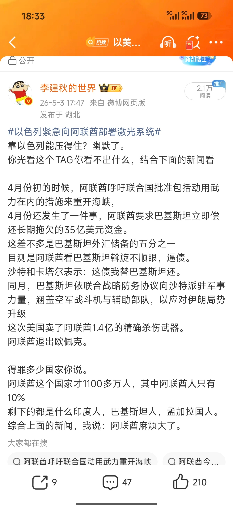

@李建秋的世界

发表于：2026-05-03 11:01

来源：微博

链接：https://m.weibo.cn/status/5294564831134264

\#以色列紧急向阿联酋部署激光系统\#

我本身不喜欢沙特王储小萨勒曼的，搞奇观。

但是小萨勒曼再差也比阿联酋强。下图我说的只是一部分。

光得罪巴基斯坦就莫名其妙。沙特这么多年一直养着巴基斯坦，那都是有大用的。

本国人口10%，其他是外来人口，我要是阿联酋王爷，我睡觉枕头下面都得放把枪。

新加坡和阿联酋一比，新加坡都是超级大国，新加坡也只是喜欢当教师爷，它可没直接下场。

阿联酋那是只和伊朗沙特巴基斯坦有矛盾吗？

扶持南方过渡委员会，掺和也门，和胡赛对打

利比亚内战，支持国民军哈夫塔尔

苏丹内战，支持快速支援部队，被联合国谴责。

支持索马里兰搞分裂，和索马里关系极差。

搞什么资本 + 雇佣兵 + 港口控制权，试图打造离岸超级大国。

我非常怀疑这阿联酋是不是被外国势力控制了，别说以色列凶，以色列可没掺和这么多的地方，这妥妥美帝作风。

上一次见这么弱还这么嚣张的，是安苏雷克女王

---

