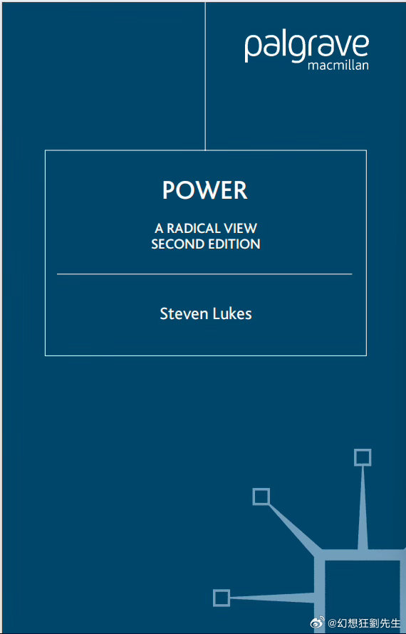
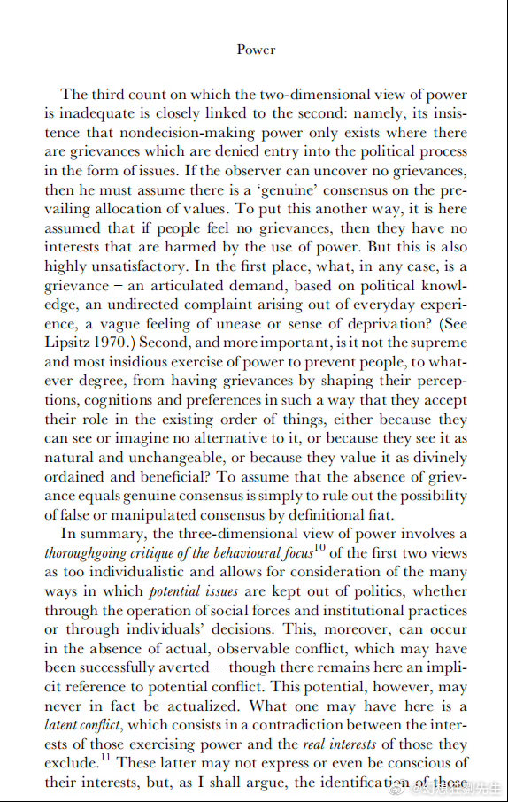
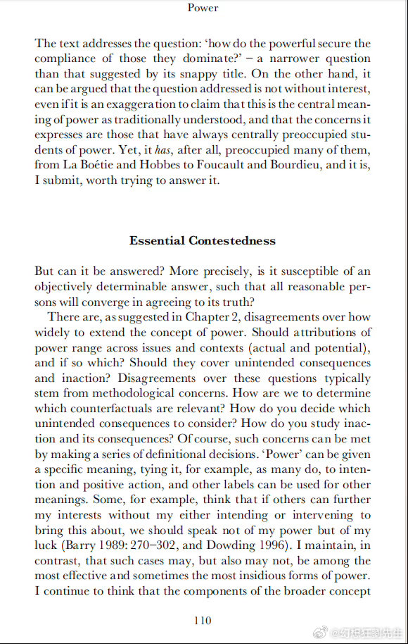
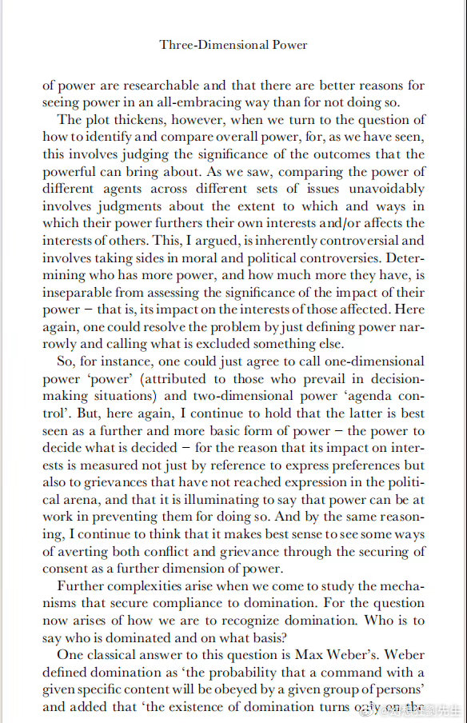
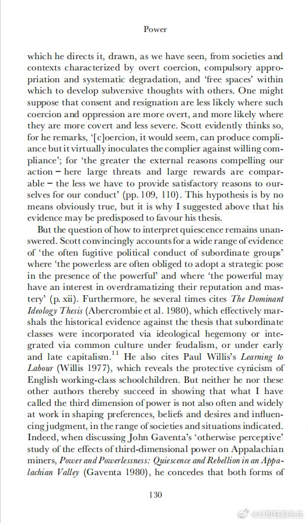
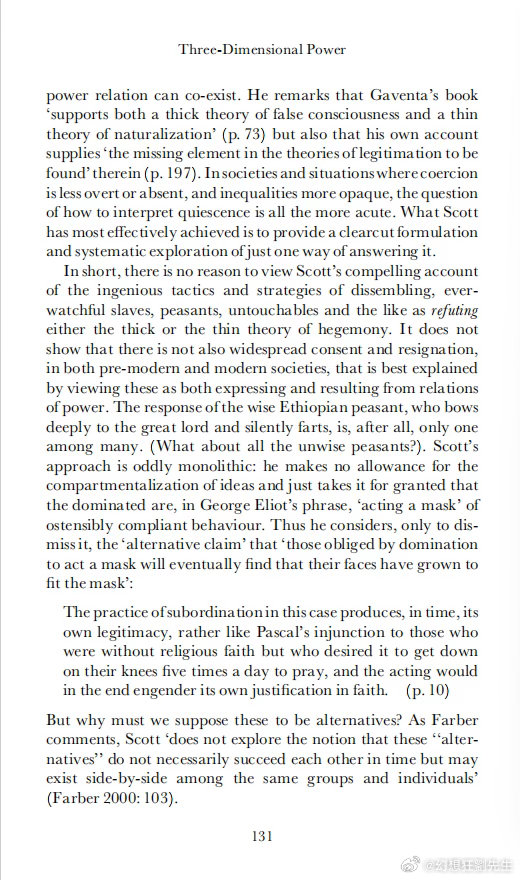

@幻想狂劉先生
发表于：2026-05-03 09:47
来源：微博
链接：https://m.weibo.cn/status/5294546138170882

今天我推荐的政治学经典文本（如图）可以用来解释伊朗伊斯兰革命期间的一些问题。

1978-1979年伊朗伊斯兰“革命”期间，关于“头巾”的斗争是一个非常有趣的政治学议题。在1978年的“反沙阿运动”（这是左翼知识分子主导的反巴列维政治运动）中，伊朗的左翼知识分子、女权主义者在宗教人士的支持下，对巴列维军警奉命强制摘除妇女黑头巾的行为进行了激烈的反抗。讽刺的是，次年（1979）年的妇女节，霍梅尼政权就让她们得偿所愿，并且在公开场合再也不得无故摘下。

自由主义者往往据此，作出“理性中立”的判断：巴列维强制女性摘掉头巾，霍梅尼强制女性戴上头巾，二者同属对个人选择的侵犯，因此在性质上没有差别。这种判断的问题，在于它把“自由”当作一个预先存在的状态，而不是一个需要在特定权力结构中被生产出来的结果。

在抽象意义上，自由当然可以被定义为一种双向选择：既可以戴头巾，也可以不戴头巾。但这种定义，本质上是一种“实验室条件”，类似于自然科学中排除一切干扰变量后的理想状态。在现实社会中，个体从来不是在真空中作出选择，而是在既有的权力结构、文化规范与社会期待中形成其“选择”。

因此，分析这一问题的起点，不是“是否存在强制”，而是：
在巴列维之前，是否已经存在一种对女性戴头巾的结构性强制？

答案显然是肯定的。传统宗教规范、家庭结构与社会评价体系，共同构成了一种长期稳定的权力关系，使“戴头巾”不仅是一种习俗，更是一种带有道德强制意味的社会义务。在这种条件下，“选择戴头巾”本身，并不能简单理解为自由意志的表达。

这正是斯蒂文·卢克斯（Steven Lukes）所谓“权力的第三维度”的核心问题。权力不仅体现在可见的决策与强制之中，更体现在对认知与偏好的塑造之中。正如他所指出的：

 “the most insidious exercise of power is to prevent people from having grievances by shaping their perceptions, cognitions and preferences… so that they accept their role in the existing order.”

权力最隐蔽、也是最有效的形式，在于它使人们在主观上接受既有秩序，从而不再将其视为压迫。换言之，权力可以通过塑造认知来“制造同意”，甚至制造出一种看似“自愿”的服从。

在这一框架下，如果在一个已经存在强大宗教规范压力的社会中，仅仅宣布“允许女性自由选择是否佩戴头巾”，那么这种“自由”在现实中几乎无法运作。因为支配性的规范不会自动消失，它们会继续通过社会机制塑造个体偏好，使得所谓的“选择”仍然落在既有轨道之中。

因此，问题的关键在于：

是否存在对既有权力结构的实质性破坏。

巴列维时期的强制性去头巾政策，虽然在形式上是一种国家权力对个体行为的干预，但其指向并不是简单的行为规训，而是对宗教规范所构成的社会控制机制的直接冲击。在政治学意义上，这是一种以强制手段打破既有权力关系的尝试。它的结果，并不是立即产生自由，而是为自由的生成创造了一种可能性条件。

换句话说，在旧有结构未被动摇之前，“自由选择”是一个空洞命题；而在结构被破坏之后，才首次出现选择空间。这种空间可能演化为真正的自由，也可能被新的权力形式所占据，但无论如何，它标志着一种结构性的断裂。

与之相反，霍梅尼政权的政策则呈现出完全不同的方向。强制佩戴头巾，并不是对既有宗教权力结构的解构，而是将其进一步制度化、国家化。在这一过程中，原本依赖社会规范运作的控制机制，被转化为法律与国家强制力所保障的制度安排。

从卢克斯的角度来看，这意味着两层权力的叠加：一方面是对行为的直接规制，另一方面是对认知与正当性的持续塑造。权力不仅要求服从，而且通过教育、宗教与公共话语，使这种服从被理解为正当乃至必要。在这种条件下，“不戴头巾”的可能性不仅在实践中被压制，在观念上也被逐步排除。

正如卢克斯在讨论支配关系时所提出的另一关键问题：

 “how is willing compliance to domination secured?”

即：支配如何获得“自愿的服从”？其答案恰恰在于，通过塑造认知与价值，使服从不再被感知为外在强制，而被内化为自我认同的一部分。

“权力制造同意”或“自愿的服从”这种例子在日常生活中比比皆是。我住处附近有一个市场，市场里大部分从业者是中东或中亚男性。有一个很有意思的现象，不包头巾的单身东亚女性去这个市场买东西的时候，遭到言语骚扰的概率相当高，但如果身边有一个男性陪同，哪怕他是一个弱小的未成年的孩子，这种情况也基本不会出现。同时，如果东亚女性包上头巾，那么即使单身前往，也基本不会被骚扰。

所以久而久之，我的女性朋友们就养成了我去市场的时候她们才去，我不去市场的时候她们自己绝对不去的习惯。也就是很短的时间内，她们就养成了“自愿在没有男性陪同的情况下不前往特定场所”的习惯。

由此可以得出一个重要结论：

巴列维与霍梅尼在头巾问题上的政策，虽然都表现为“非自愿的强制”，但其政治逻辑完全不同。

前者的强制，作用于既有权力结构本身，其结果是打破结构并开启一种可能的选择空间；后者的强制，则作用于对结构的巩固与强化，其结果是关闭这种空间，使自由在结构上变得不可能。

因此，判断一项政策的性质，不能停留在“是否存在强制”这一表层，而必须考察其在权力关系中的位置：
它究竟是在削弱权力，还是在生产并巩固权力；是在消解“被制造的同意”，还是在进一步制造这种同意。

在这个意义上，两种看似相似的“强制”，一个可能通向自由的生成条件，另一个则从根本上排除了自由产生的可能性。

---

