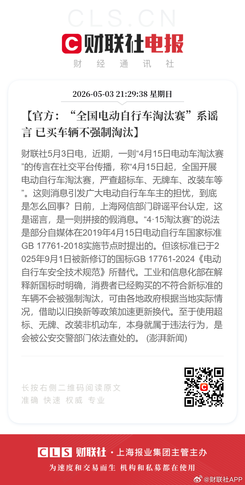

@财联社APP
发表于：2026-05-03 13:31
来源：微博
链接：https://m.weibo.cn/status/5294602481565930

【官方：“全国电动自行车淘汰赛”系谣言 已买车辆不强制淘汰】财联社5月3日电，近期，一则“4月15日电动车淘汰赛”的传言在社交平台传播，称“4月15日起，全国开展电动自行车淘汰赛，严查超标车、无牌车、改装车等”。这则消息引发广大电动自行车车主的担忧，到底是怎么回事？日前，上海网信部门辟谣平台认定，这是谣言，是一则拼接的假消息。“4·15淘汰赛”的说法是部分自媒体在2019年4月15日电动自行车国家标准GB 17761-2018实施节点时提出的。但该标准已于2025年9月1日被新修订的国标GB 17761-2024《电动自行车安全技术规范》所替代。工业和信息化部在解释新国标时明确，消费者已经购买的不符合新标准的车辆不会被强制淘汰，可由各地政府根据当地实际情况，借助以旧换新等政策加速更新换代。至于使用超标、无牌、改装非机动车，本身就属于违法行为，是会被公安交警部门依法查处的。 (澎湃新闻)

---

