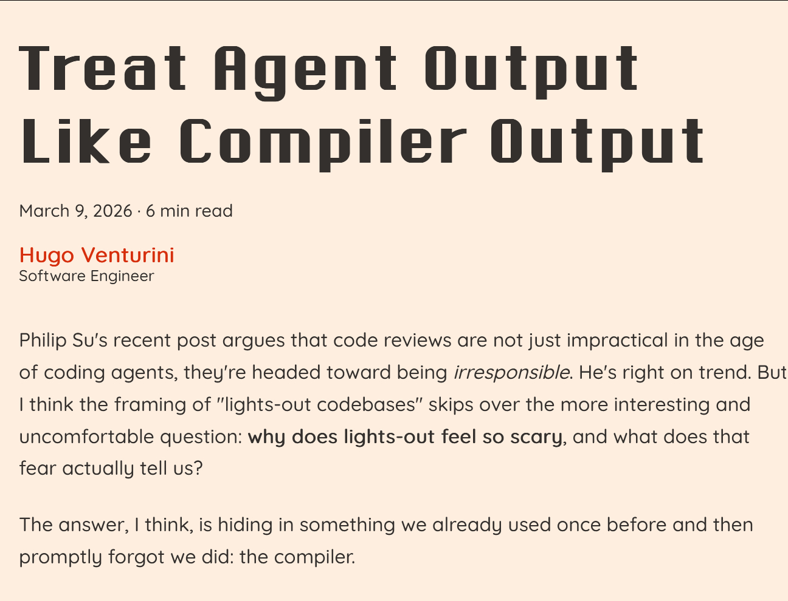

@蚁工厂

发表于：2026-05-04 10:04

来源：微博

链接：https://m.weibo.cn/status/5294785619559181

将Agent输出视为编译器输出

地址：skiplabs.io/blog/codegen_as_compiler

这篇文章的观点蛮有意思的：随着coding agent生成代码的速度和数量远超人工，传统的人肉代码审查不再现实也不再有效。

作者提出，我们应把coding agent生成的代码输出当成编译器产物来看待 —— 也就是说，不是靠人一行行读，而是依赖周围的质量保障体系来验证它，比如类型系统、详尽的测试、自动验证和监控等，而不是审查生成的代码本身。

之所以现在仍然担心“无人值守的代码库”，是因为我们还没有建立起像编译器时代那样成熟的自动化验证和规范基础设施来确保正确性。只有当这些机制健全起来，AI 代码输出才可能像编译器输出那样可信和可部署。

“想想你与编译器的关系。你编写 C++、Rust、Go 代码，工具链生成一个二进制文件。你会打开这个二进制文件去阅读汇编代码吗？你会安排会议与同事一起审查目标代码再发布吗？

当然不会。这是荒谬的。这并不是因为你盲目信任编译器，你并不盲信。编译器会有 bug，编译器曾经出现过众所周知的灾难性 bug。但你已经构建了一个完整的机制，使得审查输出变得不必要：你针对可观察行为编写测试，你有类型系统约束输出的行为，你有可重现的构建，你在高风险领域使用模糊测试、清理器和形式化验证。你信任的是过程，而不是产物。

我们还没有为编程代理建立这种机制。而缺失的，正是这一机制，而不是输出本身。”

\#AI创造营\#\#How I AI\#

---

