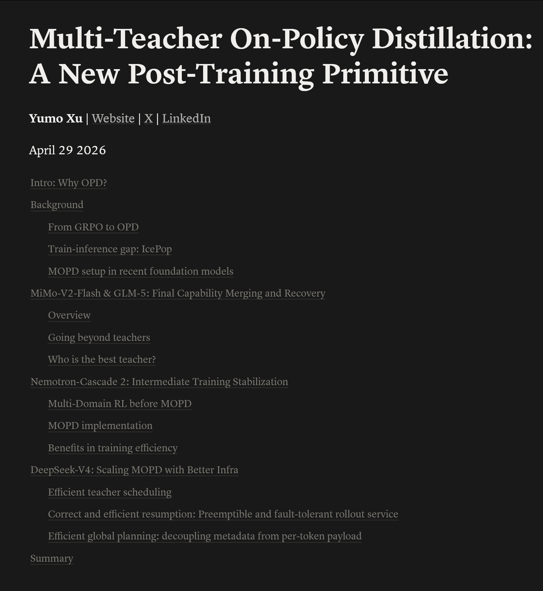

@蚁工厂
发表于：2026-05-04 11:04
来源：微博
链接：https://m.weibo.cn/status/5294807003171493

多教师在策略蒸馏：一种新的后训练原语
MiMo-V2、GLM-5、DeepSeek-V4都用了这种训练方式。
地址：yumoxu.notion.site/multi-teacher-on-policy-distillation
“
现代后训练存在一个跷跷板问题：数学RLVR缩短了推理轨迹，但损害了开放式写作能力；RLHF通过偏好对齐获得优势，却以严格遵循指令为代价；工具使用RL则偏离了STEM基准。当每个专业化阶段互相牺牲时，很难推出一个兼顾所有能力的模型。  

在策略蒸馏（OPD）出现后，这成为一种标准解决方案。其核心思想是：从学生模型中采样轨迹，然后通过反KL散度在这些轨迹上匹配教师的分布。你将获得密集的、逐token的监督信号，并几乎无需改变地投入到GRPO风格的训练循环中。自然的扩展是多教师OPD（MOPD）：将每个能力的最强checkpoint作为教师，让学生一次性吸收所有能力。教师通常与学生共享分词器和血统，因此工程开销保持较低。  

本文将梳理四篇2026年前沿报告，它们均收敛于MOPD，但部署方式各异：MiMo-V2-Flash（1月）、GLM-5（2月）、Nemotron-Cascade 2（3月）、DeepSeek-V4（4月）：  
- 最终阶段整合（MiMo-V2-Flash, GLM-5）：将MOPD作为后训练的最后一步。  
- 中管线稳定（Nemotron-Cascade 2）：将MOPD作为RL专业化阶段间的遗忘-恢复步骤。  
- 大规模训练方案（DeepSeek-V4）：全词汇logits，10+教师，专门设计的教师调度和容错轨迹基础设施。  

在快速回顾GRPO → OPD的基础后，我们将依次分析每个案例，讨论收敛点、分歧及未来方向。”

\#AI创造营\#

---

