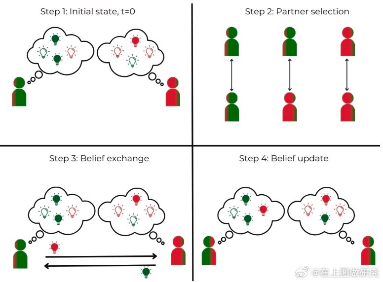

@在上图做研究

发表于：2026-05-04 14:04

来源：微博

链接：https://m.weibo.cn/status/5294846072850046

\#有趣的论文\# 【越看越错：信息爆炸时代的茧房困境】信息共享越多，决策就越明智吗？研究发现，在观点相似的群体中，无限制的信息交换反而会降低集体判断的准确性。即便成员完全理性且诚实，高强度的信息流动也会加剧观点极化。这挑战了“信息共享越多越好”的传统认知。在社交算法盛行的当下，适度限制信息流动的强度，反而能优化集体决策，助我们走出越看越错的困境。文献出处：论文标题：Free information disrupts even Bayesian crowds

选自：PNAS,Vol.123,No.14,April 7,2026

数据库： PNAS/美国科学院院报

如果想了解更多，欢迎访问上海图书馆专业服务门户：网页链接

---

