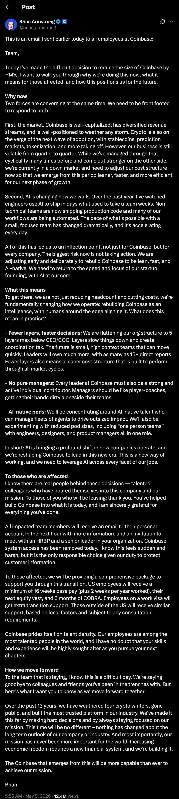
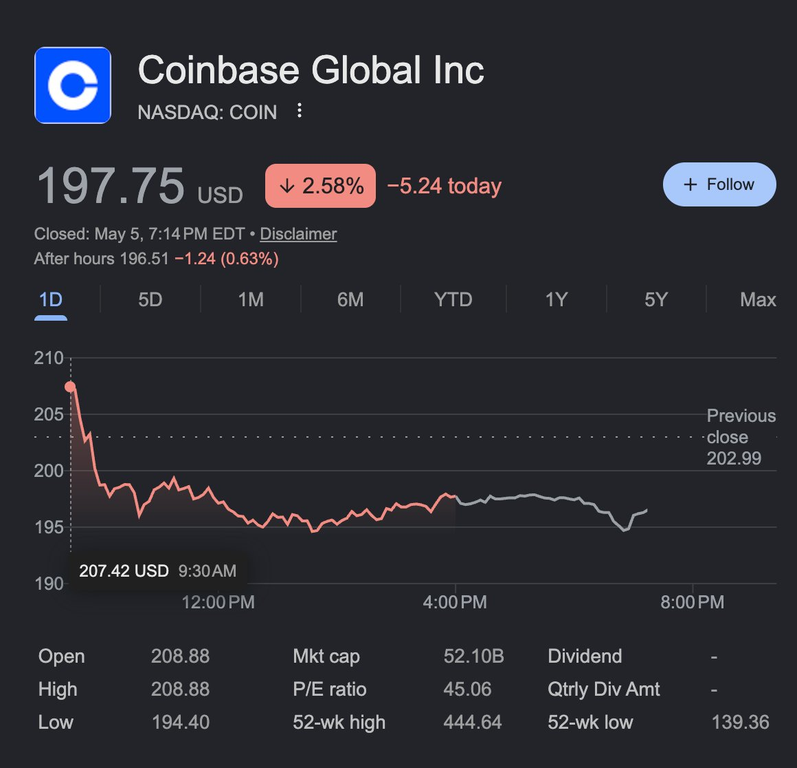
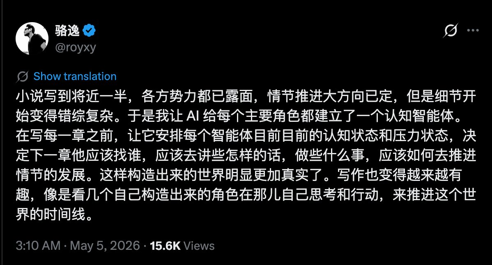

# 2026-05-06

## 1

@理记

发表于：2026-05-05 13:28

来源：微博

链接：https://m.weibo.cn/status/5295326622916984

现在的世界形势，国内政治形势，经济形势，生产力变革形势，很明确已经进入了新的周期。

这个新周期不会很短，至少10-20年。这个新的周期是巨变，会淘汰很多人，带来新的财富转移。除了少数法律确定的行业，例如公务员，相当多的行业我认为都会发生逻辑变化。

注意是逻辑变化。

每个人都要面临一个问题，如何穿越新的巨变周期？

有的行业就要靠硬挺着，开源节流，降本增效，各种手段去努力穿越周期。

但有的亏损风险过高行业就不适合硬挺着，穿越周期的方式是最好不要做这行，例如饭店。每年倒闭300万家，几乎每家倒闭之前都硬挺了几个月，就没听说哪个饭店挺过去的，都是加大了亏损。

不同的人也不一样，有些已经有积蓄的，可以消费，但是在充满不确定性新周期，我个人的观点就不如多看少做。

颠覆性的新周期，相当一部分按照传统经验行使的列车，都可能开往错误的方向。

我不知道哪趟列车是正确的，即使可能看起来大概率正确，但也会迅速涌入无数的竞争者，把你在车上挤个半死。

新周期必须不停地跳跃，不停地面临抉择，是否舍得放弃沉没成本。

我其实也不知道孩子将来应该怎么学习，如何规划教育，我不知道。现在大学毕业研究生毕业以及留学回来的人，这都是至少十年前规划的。是否适应当今的形势？这是个冷暖自知的问题。

我现在的思考，最好的老师都在社会上，大学肯定有用，但用处究竟多大，无法给出明确的量级，而且还有政治正确掺杂在里面。

有位关注者给我留言，她说“教育不是，或者说不应该是以知识的传授为目的，教育是或者说理应是以培养能力为目标”。

我是完全赞同的，可是我们的大学老师们，他们自己如果离开大学到社会上能不能生存？有多大比例到社会上还有竞争力？

如果自己都没有在社会上立足的能力，如何培养学生的能力？

我认为，最好的大学教授，是你家楼下片区工作量最大的外卖小哥，是你家楼下经营最久的饭店老板，他们的情商和观察能力，动手能力和决策能力，可能比大多数老师强。

当然我说的不一定对，供大家思考。

---

## 2

@宝玉xp

发表于：2026-05-05 22:59

来源：微博

链接：https://m.weibo.cn/status/5295470419378473

加密货币交易所 Coinbase 今天宣布裁员约 14%，约 700 名员工受影响。CEO Brian Armstrong 给出了两个理由：加密货币市场进入下行周期，以及 AI 正在改变公司的运作方式。

第一个理由有数据支撑。Coinbase 2025 年第四季度营收同比下降 21.6%，净亏损 6.67 亿美元；比特币也从去年 10 月 12.6 万美元的高点跌去三分之一。两天后，公司将公布 2026 年一季度财报。

第二个理由是 AI。Armstrong 在内部信里说，AI 让工程师几天就能交付过去需要团队几周完成的活，非技术团队现在也开始写生产代码。他还给出了一个进度指标：去年 10 月公司日常代码里有 40% 由 AI 生成，他想把这个比例推到 50% 以上。

伴随裁员的是一次组织重构。CEO 和 COO 之下的管理层级被压到最多 5 层，每个管理者可能要带 15 个以上的直接下属。所有管理者都必须同时是一线贡献者，不能只做纯管理。最激进的设计叫AI 原生小组,里面甚至会出现单人团队——一个人同时承担工程师、设计师和产品经理的角色，靠调度大量 AI agent 完成工作。

补偿方面，美国员工至少能拿到 16 周基础工资，每多工作一年加 2 周，外加下一次股权解锁和 6 个月医保延续。Coinbase 预计相关重组支出在 5000 万到 6000 万美元之间。

这不是 Coinbase 第一次大裁员。2022 年加密寒冬时它砍掉了 18% 的员工。但这次的同行名单更长——Block 裁了将近一半，Crypto.com 砍了 12%，Algorand 砍了 25%，Gemini 也在缩编，理由几乎都是同一套组合：行情不好加上 AI 提效。

Mizuho 证券分析师 Dan Dolev 给彭博的解读更直接：加密寒冬可能才是大部分裁员的真正原因，AI 只是一个方便的借口。

---

## 3

@持续低熵LordLowEntropy

发表于：2026-04-21 23:01

来源：微博

链接：https://m.weibo.cn/status/5290397259006272

对中等强国的军事斩首

之前网络上老有一种提法令我觉得很莫名其妙。 这种提法就是说核武器的出现导致了“让领导先走”战术的可能，从而使得很多国家哪怕是军事强国主动发起战争的欲望大大下降。

我觉得这完全是误解了核武器的威慑方式。当然，在较为和平的年代，如果你突然遭到一个核大国的大规模核突袭，那你的顶层领导被斩首是容易发生的。但这种事情发生的可能性本来就是很小的。事实上冷战时期核博弈理论的主流还是两个核大国逐步升级核武的使用。在逐步核升级开始之前，核大国的领导人实际上就已经钻地堡了。而在互相交换核武器的过程中，双方领导人还要保持沟通以讨价还价。

核战的威慑如上所述最主要不在于对领导人斩首，而在于对精华地带核心地带的破坏力太强，以至于即使在常规武器战中占有优势的一方也不愿意支付这样的代价。特别是全面核战争后残余社会的政治走向不确定性高，存在着“人活下来但亡天下”的巨大风险。关于这一点我以前有详细讨论，这里不再赘述。

再进一步想，所谓的“让领导先走”如果真的作为核战争的一个重要博弈手段，事实上是更有利于发动偷袭战争一方的。因为你可以在对方没有防备的时候让对方的领导先走从而取得一定的先手优势。当然后续的对方二次核反击的代价你愿不愿意承受那是另当别论了，但那时你反正已经进地堡了。反倒是不那么愿意发动核战争的领导人或者是决策程序比较民主的国家的领导人更容易被核武先带走。

在澄清了核威慑与斩首策略不是一回事之后，我们来看如今的伊朗战争。我要提醒大家的是，2026年伊朗战争是现代战争中第一次出现中等军事强国遭到军事斩首。真的，请大家想一想，一战二战朝鲜战争越南战争对印战争印巴战争历次中东战争中越战争海湾战争伊拉克战争俄乌战争等等，都没有出现中等强国领导人被斩首的。硬要说的话，苏联对阿富汗战争可以算斩首，但1979年的阿富汗绝对算不上中等军事强国。也就是说这轮伊朗战争的斩首是具有标志性意义的。

而我们也看到了这种斩首手段的高度不合理性。由于对方是军事强国，你即使将其斩首了，只要不立刻发生内乱，在军事上要解决对方也并不容易。而该国被斩首之后，后续和其进行谈判的难度会剧增，因为基本的信任没有了。这使得强势一方潜在的选择余地变小了许多。

或许伊朗战争会给各军事大国一个教训，即如果你打的是有中等军事实力的政权则最好克制住军事斩首的冲动。

现在再把话题放到台海战争上。我知道很多人希望看到潜在的台海战争中我方对台独领导人进行斩首。我之前就一直觉得这种选择是不明智的。现在有了伊朗战争的例子，我更加坚定了我的观点。我也认为有关方面在观察伊朗战争之后极有可能在未来的台海战争中彻底放弃斩首策略。

台海真打起仗来，让对方领导人在地堡里困上若干天出不来然后听到各种战场坏消息和招安好消息传来从而抵抗意志崩溃，或者让对方领导人一开战就吓得逃走，大概都是比直接斩首更有利的。

可能还有人质疑台湾算不算中等军事实力。如果你要进行登陆战的话，从面临的挑战来看，我觉得台湾相当于具有中等军事实力了。至少如果你秉承我军一贯的料敌从宽的态度，你不得不这样假设。

当然上面讲的不妨碍和平时期用斩首策略去恐吓对岸，估计还是挺有效的。

---

## 4

@宝玉xp

发表于：2026-05-05 23:25

来源：微博

链接：https://m.weibo.cn/status/5295476816742078

AI 辅助写小说的新做法：给每个主要角色单独建一个 AI 智能体。每写一章前，先让 AI 把每个角色当下的认知状态和压力状态过一遍，再决定他这一章去找谁、说什么、做什么。

详情看截图，来源：x.com/royxy/status/2051575319346458894

---

## 5

@抗战直播

发表于：2026-03-08 00:00

来源：微博

链接：https://m.weibo.cn/status/5274104670192099

1937年3月8日讯：周恩来、叶剑英与顾祝同、贺衷寒、张冲会谈。双方意见大体一致，由周恩来写成提案，送蒋介石最后决定。主要内容为：一、中国共产党承认服从三民主义及国民党的领导地位，彻底取消暴动政策及没收地主土地政策，停止赤化运动；国民政府分批释放狱中的中共党员，容许共产党在适当时期内公开。二、取消苏维埃政府及苏维埃制度，目前红军驻在地区改为陕甘宁行政区，执行国民政府统一法令及民选制度；其行政人员由民选产生，经国民政府任命；行政区经费由行政院与陕西省政府拨款。三、取消红军，改编为国民革命军，服从国民政府军事委员会及委员长蒋介石的统一指挥，其编制人员、给养及补充与中央军同等待遇；其各级官员自行推选，呈报军事委员会任命；政训工作由军事委员会派员联络；红军中之最精壮者改编为三个国防师，计六个旅12个团，另有直属之工、炮、通信、辎重等部队；在三个国防师上设置某路军总指挥部；红军地方部队改编为地方民团或保安队；红军学校办完本期后结束；此外，令马步芳、马步青部停止在河西走廊对红军西路军的进攻。

---

## 6

@渔老板钓鱼

发表于：2026-05-06 13:02

来源：微博

链接：https://m.weibo.cn/status/5295567581217259

水产行业

只要是活的零售

就很难形成品牌

就很难形成闭环

……

如果是冰鲜、冰冻鱼，就听容易追溯、容易形成品牌，更容易闭环。

但是活鱼不行。

因为活鱼链条太长，所有的环节是断的，你看哪个超市自己养鱼、运鱼、暂养一体化的？

没有，一个没有。

养殖户和餐厅超市之间，必须有鱼贩子来调节。鱼贩子又要调节运输车，大部分运输车又是个人的，这整个链条就是断裂的，根本无法形成品牌效应。也就很难溢价。

养殖端就成了：谁价格低，谁有竞争力。

运输端就成了：谁运费低，谁有竞争力。

同样产地的鱼，不同养殖户，品质差别很大

同养殖场的鱼，不同车运输，品质差别很大

包活不包好

所以大家吃鱼的时候，经常不稳定，今天好吃，明天不好吃。

那种半死不活快死的鱼，真不好吃，还不如状态好的鱼提前杀好放干净血之后存在冰箱里两天的鱼好吃。

