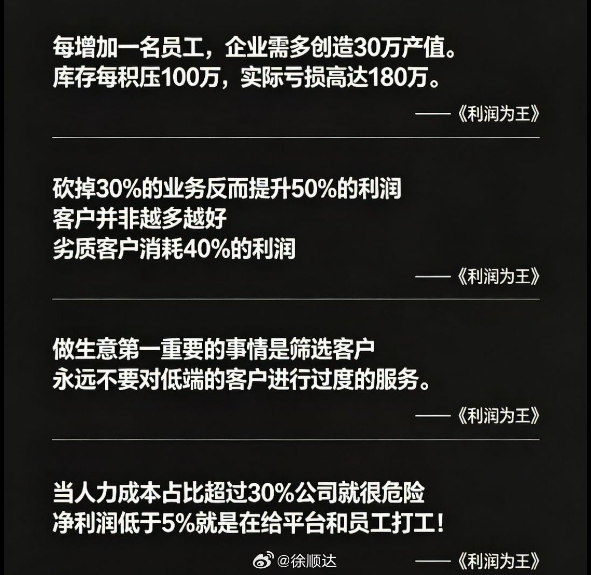

@徐顺达

发表于：2026-05-06 10:48

来源：微博

链接：https://m.weibo.cn/status/5295648632212391

在当下的用工环境里，你越大方，越容易养出白眼狼。这不是道德绑架，这是赤裸裸的人性和风险。

三点说明这个问题。

第一点叫期望值的无底洞。

现在的00后员工，他们不跟你讲老板养着我，他们讲价值交换，你为了留人，今年给5000年终奖，明年咬牙给1万，你以为他会干什么？他只会想明年是不是该给2万了？一旦你哪年给少了，或者因为公司困难没有发，他不会觉得公司难，他只会觉得老板太抠了。一旦你养成了高福利的惯例，将来想降下来，对不起员工不会理解的。升米恩斗米仇，在职场永远是真的。

第二点更诛心，你的大方正在逼走你的优秀员工，很多老板想不通，我对大家那么好，随便请假迟到不扣钱，活干少了也不罚，为什么骨干还要离职？我告诉你，因为你的大方，养了一堆混子，认真干活的员工发现我拼死拼活和那个摸鱼的拿一样的钱，我不干，老板也不扣钱，结果就是老实人要么变坏，要么走人，而留下的白眼狼不仅不干活，离职时还会反咬一口。

第三点，也是最要命的一点，老板的用工风险都藏在我以为我很大方里。举个例子，员工家里出事，你心软，让他先走手续后补，结果他摔了一跤，告你工伤，你没考勤记录，百口莫辩。你的大方如果没有落在白纸黑字的员工手册和绩效考核表上，到最后都会变成刺向你的道具。

老板们，我不是让你当周扒皮，真正的负责不是当好人，而是建立清晰的规则，用制度去管理，用合同去约束。该给的工资一分不少，不该给的人情漏洞一个不留。在这个经济下行的周期，保护企业，就是保护那批真正跟着你吃饭的骨干员工！

---

