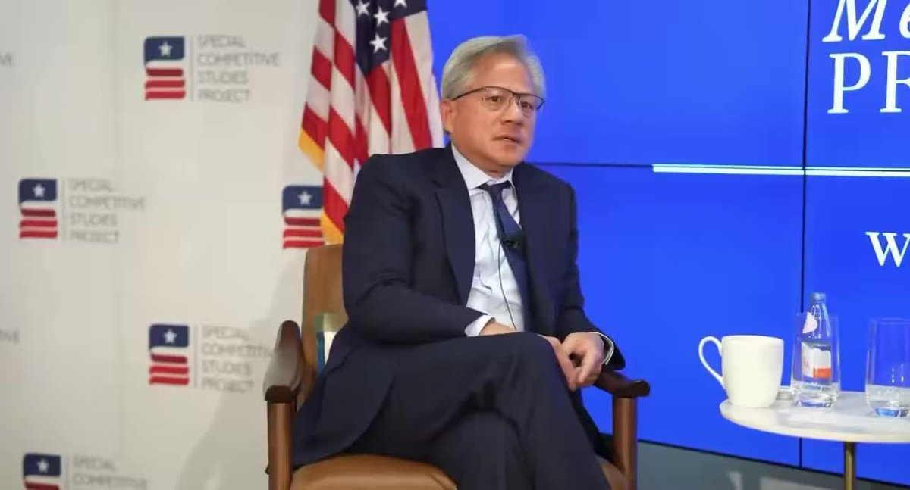

@默庵·超级个体

发表于：2026-05-05 03:54

来源：微博

链接：https://m.weibo.cn/status/5295182209616014

黄仁勋最近直接怼了Dario Amodei。他的原话大意是，这些CEO当久了容易产生一种幻觉，觉得自己无所不知，什么领域都能下判断。

事情的起因是Dario之前说过一个预测，说AI会干掉50%的初级白领岗位。老黄对此的态度很明确：荒谬。

我觉得黄仁勋说得对。历史上每一次重大技术变革，都会消灭一批旧岗位，但同时也会催生一批新岗位。蒸汽机淘汰了纤夫，但它带来了铁路产业，带来了现代物流体系，带来了全球贸易的繁荣。每次技术革命之后，整体的就业机会和经济体量都是扩大的，只是岗位的形态变了。

AI大概率也是同样的逻辑。会有人失去现有的工作，但也会有大量我们今天还想象不到的新职业冒出来。

\#How I AI\#\#科技先锋官\# 默庵·超级个体的微博视频

---

