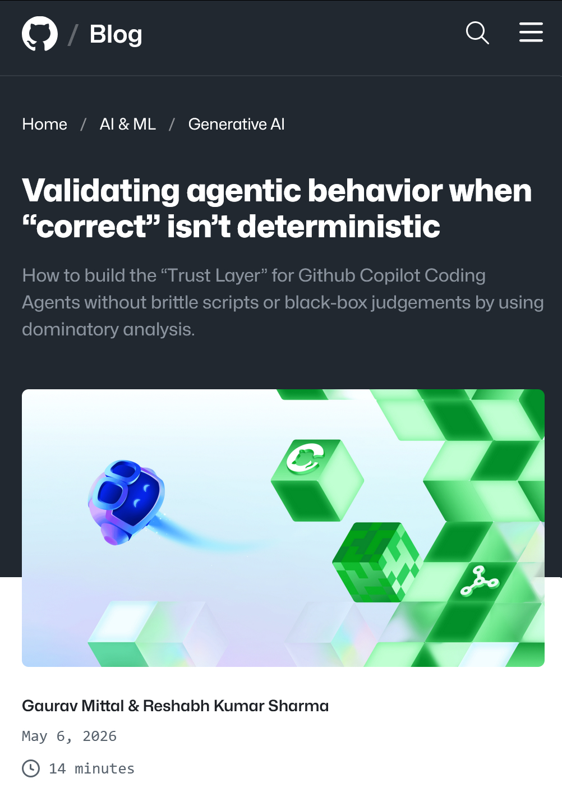

@蚁工厂
发表于：2026-05-07 14:04
来源：微博
链接：https://m.weibo.cn/status/5295934093395721

Github的一篇官博：当“正确”并非确定性时，如何验证智能体行为
 网页链接/

如何在不依赖脆弱脚本或黑盒判断的情况下，使用支配分析为 GitHub Copilot Coding Agent 构建“信任层”。

现代软件测试建立在一个脆弱的假设之上：正确的行为是可以重复的。对于确定性代码来说，这个假设大体成立。但对于像 GitHub Copilot Coding Agent（也就是 Agent Mode）这样的自主智能体而言，尤其是当我们探索集成式“Computer Use”的前沿能力时，这个假设几乎立刻就会失效。

随着智能体不再只是提供简单的代码建议，而是开始与真实环境交互，例如用户界面、浏览器和 IDE，正确性就变成了多路径问题。加载页面可能出现，也可能不出现；时序可能发生变化；多种不同但有效的操作序列都可能通向同一个结果。除非我们的 GitHub Actions 工作流足够健壮，能够处理这种可变性，否则就很常见：智能体其实已经成功完成了任务，但测试仍然失败。这种“误报失败”会阻断生产流程。

这篇博客文章探讨如何摆脱脆弱的、逐步执行的脚本，转向一个用于智能体验证的独立“信任层”。我们将展示一种模型，它关注的是必要结果，而不是僵硬的路径，从而提供一种可解释、轻量，并且适用于真实 CI 流水线的行为验证方式。

\#AI创造营\#

---

