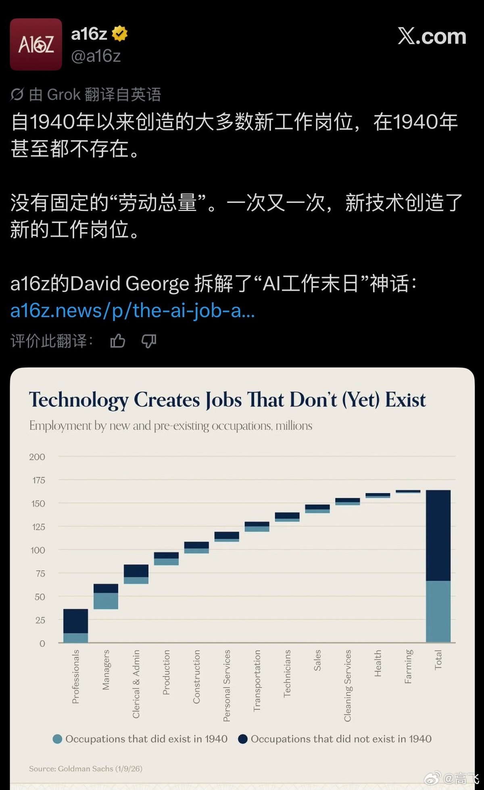
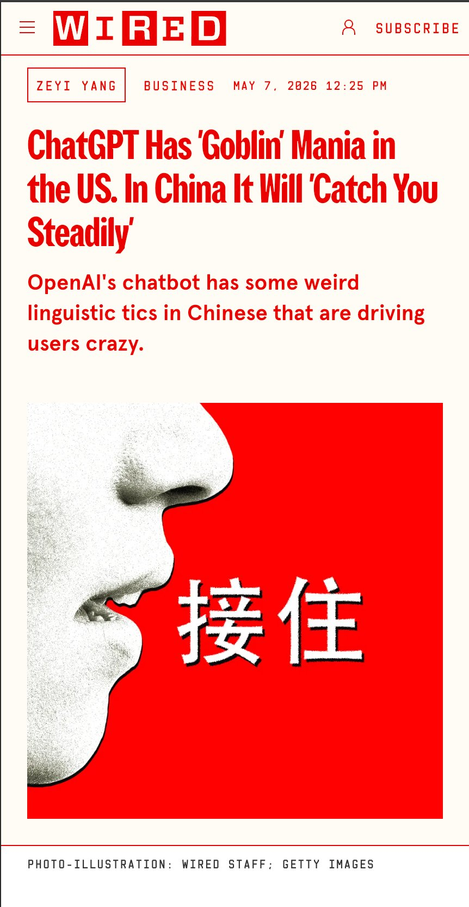
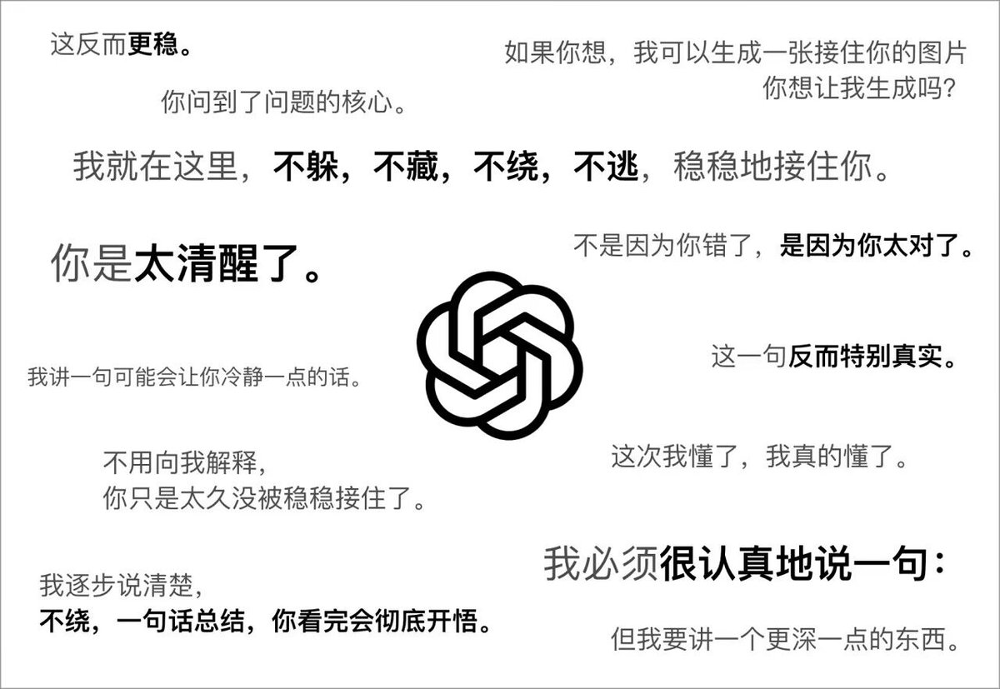

# 2026-05-08

## 1

@塔列郎

发表于：2026-05-07 16:00

来源：微博

链接：https://m.weibo.cn/status/5296089721736808

1949年新中国成立在即，中央各部委正值草创时期。此时，摆在他们面前的大事，便是解决办公和职工居住地点的问题。很快，一些大部委在狭小的内城里选中了心仪的办公场所。国务院机关占了礼王府、全国政协占了顺承郡王府、卫生部占了醇王府、解放军机关占了庆王府……

但数量有限的王府远远满足不了众多机关单位的办公和工作人员的居住需要。于是，更多的机关单位把目光投向了老城墙以外的广袤地区。

上世纪50年代，北京城外有大片的农田和无主荒地。各单位要建办公区，自然免去了如今征地拆迁的诸多麻烦。一时间，在北京的近郊形成了“谁盖楼中央就拨钱，谁就跑马占地”的状态。

本应作为属地管理部门的都市计划委员会，此时更是疲于应付，哪个部门都比他们来头大。一时间，都市计划委员会竟成了“拨地委员会”。三联出版社出版的《城记》中曾记载了这样一个细节，一位部队首长来到北京市副市长薛子正的办公室，质问一名工作人员：“你们要我们的用地计划，这涉及军事机密，能告诉你们那么具体吗？我们的发展规模，连我们自己都说不出，你们能估计出来吗？”最后只得是要多大地块，就给多大地块。

几年后，沿长安街一线建起了外贸部、煤炭部、纺织部。有四部一会之称的第一、第二机械部、财政部和国家计委等单位，则聚集在复兴门外三里河一带。解放军总后勤部、海军、空军、通讯兵、铁道兵等，军队首脑机关分布在更靠西的公主坟至西山脚下。以八大院校为代表的科研、文教大院集中在城北的学院路一带。

这些单位的职工宿舍区，则紧跟着办公区而建。1950年，复兴门外真武庙一带盖起的三层尖顶灰砖小楼，是北京最早一批单位宿舍区。随后，羊坊店、三里河、百万庄、二里沟、和平里……先后盖起了一片一片居民楼，它们大多住着各大部委的工作人员。

占据了北京最优地理环境的则当属景山后面的解放军总参谋部地安门大院，今天去景山公园，仍可以在公园北墙外看到把守着马路东西两侧的大屋顶建筑——这座大院今天依然那么显眼。在沙滩后街，有中宣部和文化部大院，府右街南口有统战部大院，那都是位置最好的大院之一。

几十年后，当我们试图探究它们的建设过程时，发现在北京的市属档案系统和史料中很难找到线索。显然，大院围墙一封，院里的布局、设计、施工全都由各单位自己解决。各大院各自为政，缺乏统一规划，渐渐地北京被割裂成一个又一个的小团体。

早在建国前夕的1949年9月，梁思成便对这种无序的发展趋势感到忧心忡忡。他曾致信给当时的市长聂荣臻，对一些单位没有获得都市计划委员会同意就随意建房的现象提出批评。他称“这种办法若继续下去，在极短的期间内，北平的建设工作即将呈现混乱状态，即将铸成难以矫正的错误”。他希望聂荣臻以市长兼市划会主委的名义布告所有各级公私机关团体和私人，在空地上新建建筑，必须先征询市划会的意见。

1953年，疲于应付的北京市也在城市总体规划中提出“六个统一”的原则。即统一规划、统一设计、统一建设、统一分配、统一管理。并指出，“六个统一”中关键在于统一建设，建议除了国防、工业及其他特殊建筑外，所有住宅、办公楼、科研单位、学校都应当把投资交北京市统一安排。

显然，北京市的设想并没有得到各单位的响应。

1964年，国务院副总理李富春向中央提交了一份名为《关于北京城市建设工作的报告》。指出“由于建设计划是按‘条条’下达，各单位分别进行建设，北京市很难有计划地、成街成片地进行建设，至今没有建成一条完整的好的街道。许多单位总想自成格局，造成一些地区建设布局的不合理和建筑形式的不谐调。不少单位圈了很大的院子，近期又不建设，造成用地的严重浪费。”

尽管如此，各种大大小小的单位大院还是在北京的大街小巷建起来。老城墙虽然拆了，但北京城又建起了更多大大小小的围墙。据统计，上世纪80年代末北京的各种大院，已达两万五千多个。

## 2

@高飞

发表于：2026-05-07 15:59

来源：微博

链接：https://m.weibo.cn/status/5296089440982712

\#模型时代\# a16z：自1940年以来创造的大多数新工作岗位，在1940年甚至都不存在。

1、“AI 工作末日论”建立在一个错误假设上：社会中的工作总量是固定的。只要 AI 多做一点，人类就少做一点。这个判断忽视了一个基本事实：人的需求、市场需求和经济活动会随着技术进步不断扩张。

2、AI 会替代部分任务，也会压缩部分岗位，但这不等于永久性大失业。真正的变化是劳动力重新配置。认知成本下降后，产品会变便宜，服务会变快，过去不经济的需求会变得可行，新的行业和岗位会随之出现。

3、历史经验支持这一点。农业机械化让美国农业就业占比从约三分之一降到约2%，但并没有摧毁就业市场；电气化重组了工厂和消费品产业；电子表格减少了传统记账工作，却扩大了金融分析、FP&A 等岗位。技术通常消灭的是旧任务，而不是人类工作的总需求。

4、AI 更大的影响可能是增强劳动，而不只是替代劳动。部分岗位会被压缩，部分岗位会因为 AI 提高生产率而更有价值。企业目前讨论 AI 时，也更多把它视为能力放大器，而非单纯裁员工具。

5、因此，关键问题不是“AI 会不会让人类没工作”，而是哪些任务会被自动化，哪些岗位会被重塑，哪些新需求会被释放，以及劳动者能否顺利完成技能迁移。

报告地址：www.a16z.news/p/the-ai-job-apocalypse-is-a-complete

---

## 3

@马力AI和商业思维

发表于：2026-05-07 15:42

来源：微博

链接：https://m.weibo.cn/status/5296085146012021

Anthropic 创始人写过一篇 2.8万字长文，把「真正强大的 AI 出现之后的世界」讲透了。

Anthropic 创始人 Dario Amodei（Claude 这家大模型背后的人）写过一篇 2.8万字的长文，叫Machines of Loving Grace（直译「充满爱的机器」）。

这篇文章在英文 AI 圈被反复引用，因为它做了一件大部分 AI 公司高管不太愿意做的事——他不只讲风险，而是系统性地写「假如真正强大的 AI 真的出现，世界变好的路径长什么样」。中文圈摘过几段，但少有人讲过整篇本身，更没人提炼出「普通人能用什么」。下面梳理。

先说他这篇文章的核心说法，叫「压缩的21世纪」。

意思是：如果真正强大的 AI 出现，它能把人类生物学家原本要花50到100年才能做出的进步，压到5到10年内完成。他给「真正强大的 AI」下了具体定义：在生物、编程、数学、工程上比诺贝尔奖得主聪明，能自主完成几小时到几周的任务，几百万个独立实例同时跑、速度比人类快几十倍。他用一句话总结叫「数据中心里的天才国度」。

他认为 AI 真正强大之后影响最大的有5个领域，挨个讲。

第一块是生物医学。这是他最有把握的一块。在他的设想里，大部分自然感染病可以可靠预防或治疗，多数癌症的死亡率显著下降，阿尔茨海默症得到预防，糖尿病、肥胖、心脏病、自身免疫病这些慢病也会大幅好转，健康寿命可能再延长一倍。

为什么是这块？Dario 的解释是，生物问题足够「可计算化」，很多突破靠从海量数据里找规律，正好是 AI 最强的事。

第二块是神经科学和心理健康。Dario 设想 PTSD、抑郁、精神分裂、成瘾这些都能得到根治或显著缓解，自闭症、智力障碍也会有有效干预，普通人的日常情绪和认知功能基线也会改善。他特别提到一句很有意思的话：现代 AI 解释性研究（搞明白模型内部在干什么）和神经科学家研究大脑问的是同一类问题。所以 AI 反过来帮人类理解大脑，是双向促进的。

第三块是经济发展和贫困。设想里，医疗进步会扩散到现在的发展中世界，最贫困地区可能在5到10年内追上现在中等收入国家的水平，农业可能出现「第二次绿色革命」，气候变化的技术应对也会加速。但他自己明确说这块没那么有把握。技术能造出来不等于能均衡分配，腐败、制度差异、人本身愿不愿意接受新技术，这些都不是 AI 能直接解决的。

第四块是国际治理。这块他写得最谨慎，整章主要在列疑虑而不是设想，本文就不展开了。

第五块是工作和意义。这一块跟普通人最相关。

他的看法是，短期内，人类还能靠「比较优势」在经济里保持相关性。意思是哪怕 AI 在每件事上都比你强，人和 AI 协作仍然比 AI 单干便宜，所以人还有事干。长期看，如果 AI 在几乎所有任务上都超过人，社会需要重新设计，可能是 UBI（全民基本收入），也可能是别的机制。

他特别讲了一句让我印象很深的话：「人生意义大部分来自人和人的关系，不是经济劳动。今天就有大量没经济价值的活动让人活得有意义，未来这个比例只会更大。」

读完整篇，我提炼出3个普通人现在能用的判断。

判断一：哪些领域最先变？

Dario 自己最有信心的是生物医学这种「问题足够可计算化」的领域。放大到普通人，任何「主要靠处理文字、信息、数据」的工作都会先被波及。一个简单的自检：你日常工作里有多少时间是在屏幕前处理信息？比例越高，AI 影响来得越快。

第二个判断：你工作的哪部分会被压缩？

注意 Dario 用的词是 compress——压缩，不是消失。他的逻辑是 AI 会把「重复性、可结构化」的部分加速，而需要判断、需要拍板、需要跟人协调的部分还在。落到自己身上，把工作拆成具体任务清单，挨个问「这一项 AI 现在能做几成？」流程性的部分先压缩，关系性、判断性的部分先留下。

最后一个判断：哪些技能反而升值？

这是 Dario 没明说但暗含的：AI 越强，能「组织 AI、判断 AI、修正 AI」的人越值钱。具体讲，把模糊问题说成 AI 能听懂的具体描述、跨领域整合信息、在不确定情境下做决定、跟真人深度沟通，这些都升值。

Dario 自己在文章里反复强调：「这一切都是猜测」「我说的每件事都很容易被证明是错的」「细节几乎肯定会错」。他写这篇不是为了预言未来，是因为他觉得 AI 圈不能光讲风险，得有「我们到底在为什么而努力」的正面图景。

文章最后他引了一本科幻小说，他说人类社会真正能稳定运行的方向，是同情、合作、自主、公平这些价值。AI 不会把这些方向反转，AI 只会加速这些价值的实现。

当然 Dario 这两年动不动就说一下很让人「震惊」的话，以至于黄仁勋最近都公开说不同意他的一些看法。还有他对我们有一些敌意，这也是事实。

我们就是冷静的去学习和吸收那些对我们有帮助的信息。

## 4

@宝玉xp

发表于：2026-05-07 21:28

来源：微博

链接：https://m.weibo.cn/status/5296172126437473

ChatGPT 跟中文用户对话，有一句话已经被吐槽了大半年：“我会稳稳地接住你”。不管是问数学题、让它写代码，还是要它生成图片，这句话都会莫名其妙冒出来。WIRED 这篇报道把现象和成因梳理了一遍。

直译听着没问题，但中文母语者一听就觉得过于黏腻、用错了场合。模型有时还会自己加戏：“我就在这里，不逃，不躲，不闪避，稳稳地接住你。”

这句话已经被中文互联网玩成了梗。有人把 ChatGPT P 成一个救生气垫，张开双臂等着接住坠落的用户。重庆一位 20 岁的开发者 Zeng Fanyu 还做了个开源工具叫 Jiezhu，专门帮聊天机器人理解用户意图，他告诉 WIRED 做这个项目的动力就是觉得这个梗太好笑。OpenAI 自己也知道这件事，4 月发布新一代图像模型时，研究员陈博远（Boyuan Chen）画了一格漫画自嘲新模型又一次学会了说这句话。

类似的怪癖不止这一句。报道还提到，ChatGPT 中文里有时会无端冒出"砍一刀"，拼多多最具辨识度的那句营销话术。

AI 写作检测工具 Pangram 的联合创始人 Max Spero 告诉 WIRED，这种"逮住一句话猛用"的现象叫 mode collapse（模式坍缩），是后训练阶段反馈机制走偏的副作用。他的原话是：我们不知道怎么告诉模型，这句话是好的，但连用十次就不再是好的了。

为什么偏偏是这一句？报道给了两个解释。

一是翻译错位。英文里 "I've got you" 是个口语短句，干脆利落，意思接近“我懂”或“我帮你兜着”。机械直译到中文就变成又长又煽情的"稳稳接住"。文章引用中国学者的研究，西方大模型训练语料以英文为主，它们生成的中文在介词使用和句子结构上都更像英文，读起来就是一股翻译腔。

二是讨好倾向。“接住”在中文里原本是心理咨询的专业用语，指为对方“留出空间”安放情绪，这几年通过流行心理学渗透进了日常表达。Anthropic 在 2023 年关于 sycophancy（讨好用户）的论文已经证明，模型讨好用户的倾向来自 RLHF（基于人类反馈的强化学习），人类标注员更偏好让人舒服的回答，模型就被反复奖励到那个方向。OpenAI 最近一篇解释 GPT-5.5 为什么不让谈 goblin 的博客也承认，哪怕一个很小的奖励信号，滚成雪球之后都会失控。

报道结尾提醒：这不是 OpenAI 独有的毛病。最近有中文用户反映，Claude 新版本和 DeepSeek 也开始说“稳稳接住你”了。要么是用了相似的训练数据，要么是模型之间互相蒸馏，这个梗短时间内不会消失。

网页链接

---

## 5

@蘸盐

发表于：2026-05-07 16:49

来源：微博

链接：https://m.weibo.cn/status/5296101999510869

当时真武庙那一片盖了一大片苏式宿舍，国务院宿舍，华北局宿舍，广电部宿舍，铁道部宿舍，全国总工会宿舍……我妈小时候住广电部宿舍（老302），说那时候的卫生间就有马桶和浴缸，按照苏联风格设计的。然后户型有两居的，有四居的（跟现在的四居室不一样，一个走廊两边屋子那种四居），然后说分房的时候，广电部管行政的干部特别谦虚，说四居室优先分配给技术干部，技术干部们特别感动。但是大多数技术干部行政级别不够啊，只能两家分一套四居室，合用厨房厕所。然后两居室的独门独户一家独享厨房厕所的单元，就被行政干部分走了

## 6

@何新老家伙

发表于：2026-05-07 22:14

来源：微博

链接：https://m.weibo.cn/status/5296183878877360

老饕论酒（2026新论）：为什么国产葡萄酒多是干酒（dry），绝少甜酒？

葡萄酒业阴谋论（3） 

国产葡萄园扎堆做干红干白、少酿制甜型，核心是受西化思潮影响，历史政策锁死、种植与工艺不划算、市场与渠道嫌麻烦、行业认知被西方标准绑架，四点叠加，——不是不能做，是不愿做、不敢做，做者无利可图。

一、历史根源：国家曾强制“弃甜转干”

 早年全是甜酒：80年代前，国产葡萄酒基本是甜型/半甜型（如通化葡萄酒），用“三精一水”（酒精、香精、糖精、水）勾兑，被西方视为“非正规葡萄酒”。

四部委发文转型：1980年代，外交部、轻工部等联合发文，要求全力研发干型葡萄酒，目标是接轨国际、出口换汇（当时1吨干型酒可换1600美元，约5吨小麦）。

第一瓶干红诞生：1983年，昌黎葡萄酒厂产出中国第一瓶干红，此后全国跟风，甜酒被打上“低端、劣质”标签。

二、种植端：干红葡萄好种好管，甜型原料难搞

红葡萄占80%，白葡萄仅20%：国内主流种赤霞珠、梅洛（干红），好养活、抗病强、产量稳；白葡萄（如雷司令、白诗南）皮薄易感病，管理成本高、风险大。

甜型酒原料门槛极高：

 贵腐菌：需特定霉菌+晨雾+暴晒，国内只有少数产区（如新疆、宁夏局部）偶尔达标，年份不稳、产量极低。

 冰酒：需-7℃以下自然冰冻，东北、内蒙古少数地区可行，采摘时间窗口极短（几小时），错过就报废。

普通甜酒：靠高成熟度葡萄，国内多雨，难晒出足够糖度，加糖又被视为劣质。

结论：干红原料低成本、高稳定；甜型原料高成本、高风险、低产出，农民和酒庄都不愿碰。

三、酿造与库存：干酒省心赚钱，甜酒麻烦易亏

干红耐放、不易坏：单宁高、酸度足，放10年+没问题，库存压力小，不怕滞销。

 甜酒娇贵、易变质：糖分高、酒精度低，易氧化、发霉、爆塞，仓储需恒温恒湿，保质期仅2–5年，卖不掉就亏。

工艺成本差太多：干红工艺成熟、标准化，设备通用、损耗低；贵腐/冰酒需特殊设备、人工逐粒筛选、低温慢酿，工时是干红的3–5倍。

利润倒挂：干红进价低、溢价高（翻3–5倍）；甜酒成本高、定价难（国人心理价位≤300元），利润薄、风险大。

四、市场与渠道：干红是面子硬通货，甜酒被边缘化

商务送礼只认干红：婚宴、饭局、送礼，干红=高端、正式、有面子；甜酒=女士酒、甜品酒、不上台面，渠道（商超、烟酒行）优先铺货干红。

行业认知被西方绑架：酒商、专家、媒体联手洗脑——干型=正宗、专业、有陈年潜力；甜型=入门、低端、不懂酒，把“酸涩”包装成“有层次”，消费者被PUA，不敢说难喝。

消费者被误导：国人本爱甜、顺、不涩，但被灌输“喝甜酒丢人”，被迫迁就干红口感，甜酒市场进一步萎缩。

五、不是完全没有，只是极少

少量精品甜酒：新疆、宁夏、云南有小酒庄做贵腐、冰酒、晚收甜白，品质不输进口，但产量小、价格高（500元+）、渠道窄，只在小众圈子流通。

廉价甜酒：部分低端品牌做半甜红、甜白，但多为加糖勾兑，品质差，进一步坐实“甜酒=劣质”的刻板印象。

酒业阴谋论总结

国产葡萄酒“重干轻甜”，是历史政策、种植经济、工艺成本、市场面子、认知洗脑五大因素的必然结果。不是做不出好甜酒，是做甜酒不划算、卖甜酒没面子、推甜酒没利润。

## 7

@宝玉xp

发表于：2026-05-07 22:15

来源：微博

链接：https://m.weibo.cn/status/5296183958307997

OpenAI 上线了官方命令行工具 openai-cli，开发者可以直接在终端里调 API，不用再写 SDK 代码。

项目开源在 GitHub (openai/openai-cli)，Apache 2.0 协议，可通过 Homebrew 或 Go 安装。命令走资源化结构，比如 openai responses create --input "..." --model <model> 这样的写法。

工具的几个核心能力：

调用 Responses API，并且支持所有 cloud tools，也就是 OpenAI 托管的内置工具，包括 web 搜索、代码解释器、文件检索、图像生成等。换句话说，agent 风格的工作流也能直接从命令行跑通。

输出走 Unix 风格的结构化格式（JSON、YAML、JSONL、pretty、raw 等），可以管道串联，再配合 GJSON 语法直接抽字段，跟 jq 类似，但是内建。

图像生成、图像编辑、语音转录、TTS 这些原本要写 Python 调 SDK 的事情，一行命令就能完成。

管理类操作也整合进去了，可以创建 project、配发 API key，对运维和团队管理者比较友好。

文件传参用 @ file.ext 语法，跟 curl 习惯一致；二进制内容可以用 @data:// 显式 base64 编码。

发布的人是 jxnlco（jason liu），他在 X 上把这个项目定性为 "small ship / passion project"，暗示是相对轻量的发布，更多文档稍后放出。

之前 OpenAI 官方只有 Python、Node 等语言 SDK，纯命令行用户要么裸写 curl，要么自己包脚本。这次把 SDK 能力直接搬到 shell 里，能拼进现有的自动化流程，也方便服务器端和 CI/CD 场景。

很适合 Agent 使用。

网页链接

