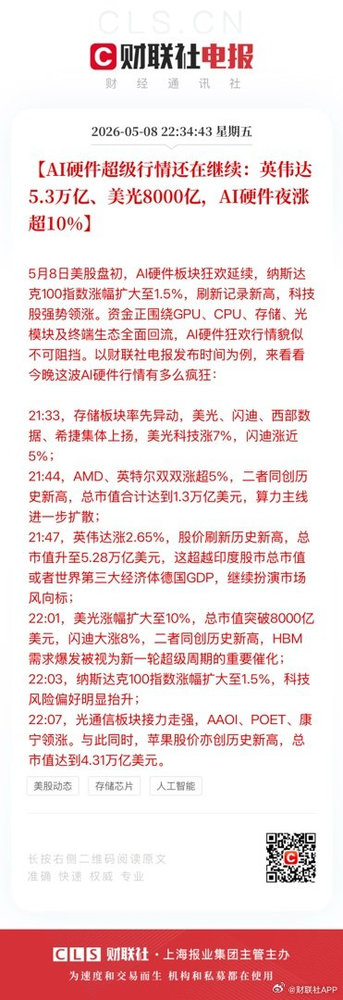

@财联社APP

发表于：2026-05-08 14:35

来源：微博

链接：https://m.weibo.cn/status/5296430572899428

【\#AI硬件超级行情还在继续\#：英伟达5.3万亿、美光8000亿，AI硬件夜涨超10%】\#美光总市值突破8000亿美元\# \#美股存储板块集体上扬\# 

5月8日美股盘初，AI硬件板块狂欢延续，纳斯达克100指数涨幅扩大至1.5%，刷新记录新高，科技股强势领涨。资金正围绕GPU、CPU、存储、光模块及终端生态全面回流，AI硬件狂欢行情貌似不可阻挡。以财联社电报发布时间为例，来看看今晚这波AI硬件行情有多么疯狂：

21:33，存储板块率先异动，美光、闪迪、西部数据、希捷集体上扬，美光科技涨7%，闪迪涨近5%；

21:44，AMD、英特尔双双涨超5%，二者同创历史新高，总市值合计达到1.3万亿美元，算力主线进一步扩散；

21:47，英伟达涨2.65%，股价刷新历史新高，总市值升至5.28万亿美元，这超越印度股市总市值或者世界第三大经济体德国GDP，继续扮演市场风向标；

22:01，美光涨幅扩大至10%，总市值突破8000亿美元，闪迪大涨8%，二者同创历史新高，HBM需求爆发被视为新一轮超级周期的重要催化；

22:03，纳斯达克100指数涨幅扩大至1.5%，科技风险偏好明显抬升；

22:07，光通信板块接力走强，AAOI、POET、康宁领涨。与此同时，苹果股价亦创历史新高，总市值达到4.31万亿美元。

---

