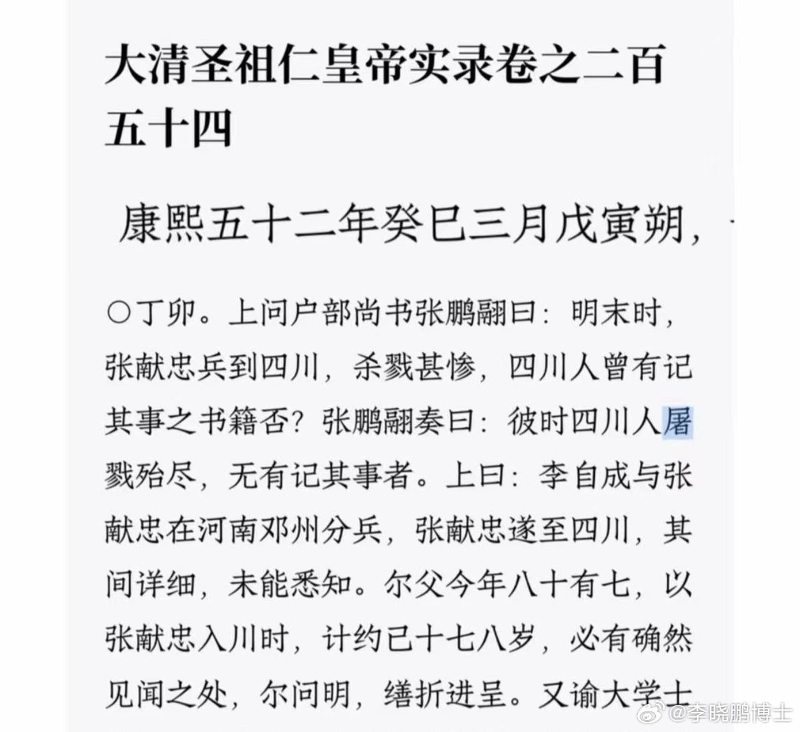

@李晓鹏博士

发表于：2026-05-08 16:03

来源：微博

链接：https://m.weibo.cn/status/5296452792230454

康熙五十二年，问大臣张鹏翮，张献忠屠四川有没有文献记载。张鹏翮说，没有。康熙说，你爹今年八十多了，张献忠屠四川的时候十七八岁了，应该有记忆，让他写点啥吧。于是张鹏翮回头就让他爹写了《烬余录》，描写了张献忠屠四川的惨状。这种鞑子皇帝指使汉奸父子现编的玩意儿竟然被我国诸多史家认为是反应历史事实的珍贵史料？？？ 现在关于张献忠屠四川的很大部分所谓一手资料都是来自于这本书。

---

