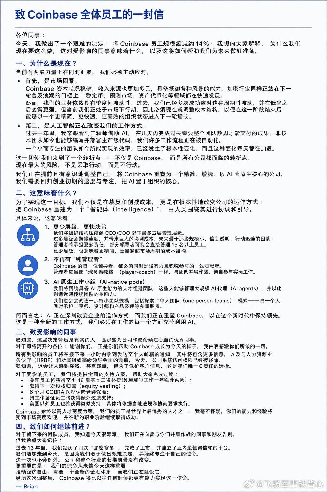

# 2026-05-10

## 1

@帝吧官微

发表于：2026-05-09 09:45

来源：微博

链接：https://m.weibo.cn/status/5296720029157145

可以说很形象了

---

## 2

@何夕

发表于：2026-05-09 09:46

来源：微博

链接：https://m.weibo.cn/status/5296720351070548

中央公文里反复讲“构建全国统一大市场”，

就是针对地方gov在生产端的保护主义。

煤炭产业，中央直接出面整合：

通过提升环保门槛，把小煤炭作坊全弄死；

然后矿难少了，行业也盈利了。

光伏也想“反内卷”，用同样思路整合；

结果整不动。

因为涉及大量私营企业，

既无法用行政手段，还有地方gov在后面撑腰。

最好的出清，就是提高行业标准；

但中央出台标准，地方gov为了自身利益不执行&保护落后企业，怎么办？

这才有了“全国统一大市场”，就是要全国统一标准 & 效率优先、淘汰落后企业。

这么明显的方向，

为啥这么多傻逼都看不懂呢？

反对你麻痹啊反对，智商堪忧！

## 3

@午后狂睡

发表于：2026-05-09 07:47

来源：微博

链接：https://m.weibo.cn/status/5296690225482938

OPPO这次母亲节的营销翻车，内部反对声音也很大，针对那个道歉的原文，内网骂翻了…

我喜欢匿名回复那个高赞的回复评论：

“1、不是部分人而是绝大多数有普世价值观和分辨能力的都觉得不适，觉得没问题的恐怕只有极端的那一小撮。

2、不要讲所谓的初衷，公司让你来的初衷是讲好品牌故事促进销售；

3、就是因为你们到现在还是这个态度，觉得“战略层面”是对的，只不过技术实现错了，才导致现在依旧热搜高挂“OPPO道歉态度”，你根本就不是在道歉，你只是在自我感动找借口。”

扫了一眼，几个平台的舆情都已经失控了，我的观点还是跟那天一样：

品牌宣发还是要尽量避免创意能力不足之后，对情绪流量的路径依赖。明明有一万种正常表达方式，偏偏选了最低级、最容易引发歧义的一种。

现在很多品牌宣发太奇怪了，好像不擦点伦理边、不搞点低级反差、不制造点争议，就不会做传播了…最终大家压根不会记得你想表达的核心内容，只会记得你玩的烂梗。

## 4

@包容万物恒河水

发表于：2026-05-09 09:40

来源：微博

链接：https://m.weibo.cn/status/5296718846629776

🔻现在美股处于极度亢奋状态，除了“七巨头”（NVIDIA、Alphabet、Apple、Microsoft等），美股还有一大批公司冲上前列：博通已突破2万亿美元（全球前7），沃尔玛、伯克希尔·哈撒韦也稳居万亿美元俱乐部。Eli Lilly（礼来）曾短暂突破万亿后有所回落，摩根大通、美光正快速逼近万亿大关（前者市值约8700亿美元，后者约8400亿美元），AMD、英特尔等虽距离万亿尚远，但也因AI芯片预期录得显著涨幅，其中多数与AI、芯片、内存直接相关。

🔻现在的问题是，AI产业链的利润分配是怎么撑起来的？

🔻OpenAI、Anthropic、Gemini等前沿模型公司年化营收合计估计仍低于千亿美元级别（部分数据显示OpenAI约250亿、Anthropic约440亿），而英伟达、美光、三星、海力士等半导体行业巨头再加上SSD、光模块、代工等AI芯片相关环节的总营收已触及万亿美元级别。

🔻这个巨大的“窟窿”最终由谁来填补？

🔻金融化浪潮中，资本（尤其是垄断金融资本）以前所未有的规模聚合并呈现出凌驾于所有产业资本之上的趋势。这一集中程度意味着少数企业借助市场预期与估值机制的放大效应获取超额金融利润，而实体产业资本的利润则相对处于从属地位。这是资本虚拟化进程在21世纪的新高峰——货币资本的运动日益脱离产业资本的增值过程而独立运转。这意味着从宏观视角看，金融部门的统治地位已经达到了一个临界点，正在加剧总资本的过剩积累问题。

🔻就美国而言，传统的实体产业（如钢铁、汽车、石油化工等）在经过近两个世纪的高度发展后，出现了规模空前的过剩产能和严重的商品过剩危机，以半导体为基础的电子信息硬件、软件服务以及后来的互联网经济，前后承接，形成了一个又一个新的“增长极”。而这些增长极——尤其是芯片制造——又恰恰需要极大量的金融资本来支撑其高固定投资。芯片成为了最容易点燃金融狂热的切入点，因为每一代新的芯片架构、每一次制程工艺突破，都会引发人们对信息生产力大幅提高的美好展望，而这些展望又都极其适合用来吸纳巨量货币资本。大市值隐含着市场对公司未来长期现金流的乐观预期，背后是投资者对它们未来统治力的预期在提前定价，当越来越多的资金涌入某一领域后，后来的投资者会不假思索地追随，从而进一步推高偏离基本面的价格。

🔻美国AI浪潮的利润分配呈现出一种极其分明的垂直分工的层级化：模型公司的营收总和相对有限，而为其供应核心硬件的设备厂商营收却高达万亿美元级别，这是一种独特的形态——相比于其他技术浪潮，它的利润上行渗透性极强，但成本下行的消耗也极为庞大。关键不同在于：上游基础层（芯片/硬件/算力）凭借极高的技术壁垒和极短的在手摩尔定律迭代周期，而下游应用层（模型公司/应用产品/AI即服务）则需要持续的巨额研发投入才能维持前沿竞争力。

🔻在产业初期，上游硬件厂商充当了“卖水人”角色，享受着AI浪潮带来的确定性红利，而下游应用端仍在探索可行的商业模式——如果下游的巨额资本开支无法被后续应用层的盈利所消化，那么这些资本开支本身就无法持续。

🔻美国AI热潮之所以特别，一方面在于它对劳动生产率的潜在提升空间可能是工业革命以来最大规模之一，另一方面在于这种提升需要巨大的前期基础设施投入（全球数万亿美元的算力基建支出）。金融资本既提供了这种基建所需的融资渠道，也可能因泡沫破裂而打断这些投资节奏。历史经验表明，金融资本的过度集中和虚拟化——即便是为了使最具创新性的行业得以快速扩张——都会带来系统性风险。

🔻现在的美国AI热潮确实是美国金融资本主导的又一次对高增长领域的价值捕获。金融资本对芯片股的集中追逐，与早年对.com公司、元宇宙的追捧具有相似的结构性特征，芯片制造极高的固定投资门槛天然需要大量金融资本来支撑，而这种需求又反过来为金融资本的周期性狂欢提供了平台。但当前的AI浪潮更重要的两个变量在美国看起来并不乐观：

🔻上游芯片公司的高利润可能无法通过正常的行业竞争向下游传导，AI对社会劳动生产率的广义影响——尤其是在美国，还远远没有充分体现。

🔻因为这需要实体经济的落地来实现，需要强大制造业的配合。

🔻从这个角度看，美国资本市场对中国大公司估值的“不值一提”就有点自寻死路的意思了，全球市值排名里前20现在没有中国企业。

🔻资本市场狂热有其逻辑，短期的泡沫未必会立刻破裂——只要算力需求持续超过供给，AI芯片的卖方市场就将继续存在。但中期来看，估值需要盈利兑现的支撑。如果下游应用层的商业化进程落后于华尔街的激进预期，过高的估值将面临压力。长期看，实体创新才是根本。美股这波AI盛宴，狂欢之后会怎样？

\#海外新鲜事\#\#热点现场\#

---

## 5

@信号与噪声001

发表于：2026-05-09 10:30

来源：微博

链接：https://m.weibo.cn/status/5296731382088812

字节跳动悄悄关掉了 30% 的 AI 项目——豆包之外的产品全在收缩

行业内消息：字节 4 月内部 AI 战略复盘会，直接砍掉了 30% 的 AI 应用项目，包括"猫箱"、"星绘"、海外 AI 视频工具 Dreamina 的部分线。表面上字节 AI 投入"加速"，背后是另一种现实。

第一件：豆包之外的产品全部不达预期。 字节 2025 KPI 是"除豆包外再做 3 个千万 DAU 产品"，实际一个都没做出来。AI 视频、AI 写作、AI 教育，烧了几十亿，无一跑出。

第二件：算力成本压不住。 字节 2025 年 AI 推理成本超 80 亿人民币，是营收增量的 2.3 倍。CFO 在会上说："这种烧钱速度做不出豆包第二，公司的现金流撑不到 2027。"

第三件：海外业务遭遇政策围堵。 TikTok 美国剥离悬而未决、欧盟 AI Act 合规成本、印度持续封禁——字节 AI 出海窗口正在关闭。Dreamina 海外用户月增速从 30% 掉到 4%。

那字节接下来怎么打？ 内部明确三条线：深耕豆包（争国内通用 AI 第一）、押注硬件（PICO + AI 眼镜）、收缩纯应用（不再无差别投入）。

这是中国互联网巨头第一次公开"放弃多线作战"，字节从"什么都试"变成"只押大的"，意味着整个中国 AI 应用层的洗牌正式开始。from群友

## 6

@那些珍贵老照片

发表于：2026-05-09 12:00

来源：微博

链接：https://m.weibo.cn/status/5296753894753419

2012-2017的香港，摄影：杨安迪

---

## 7

@tombkeeper

发表于：2026-05-09 14:45

来源：微博

链接：https://m.weibo.cn/status/5296795645379638

2023 年夏天，Claude 2 发布之后，我搞了一个自己的测试集。内容都是我设计的，而且我搜索确认了之前网上没有类似内容，也就是说模型的训练数据里没有直接答案。其中有个编程任务，我将其难度调整为 GPT3.5 恰好能勉强完成，也就是第一次大概率会出点小错，但反馈出错信息后 3 轮以内能改对，而 GPT4 一遍能给出正确结果。

大约 2024 年夏天，国内的模型陆续开始能完成这个编程任务。

到今天，所有国内的模型都能完成这个任务了。

## 8

@飞扬军事铁背心

发表于：2026-05-10 13:03

来源：微博

链接：https://m.weibo.cn/status/5297007663254563

Coinbase裁员14%，CEO Brian Armstrong说：AI已经让工程师几天干完过去几周的活，非技术员工也开始写生产代码。

新结构：扁平到5层、没有纯管理者、试验一人团队。

“把Coinbase重建成一个智能体，人类在边缘对齐它。”

“回到创业初期的速度和专注，但这次AI是核心。”

5月8日至9日，Coinbase 出现了持续数小时的服务中断，用户普遍报告：

无法登录 App 或网页；

无法下单交易；

转账/提现失败；

API 请求报错；

高级交易功能异常。

有报道提到中断持续约 5–6 小时。

报道称根本原因是 AWS 北弗吉尼亚数据中心过热。Coinbase CEO Brian Armstrong 公开表示，问题源于 Amazon Web Services (AWS) US-EAST-1（北弗吉尼亚）区域故障。

AWS 官方解释是：

一个数据中心出现冷却系统故障，导致机房温度升高，部分服务器断电或不稳定，波及依赖该区域的客户，包括 Coinbase。

\#烽火问鼎计划\#

---

## 9

@树语treetalk

发表于：2026-04-15 08:47

来源：微博

链接：https://m.weibo.cn/status/5288008196294024

\#去滤镜看日本\#  读旅日爱国华侨许仪后《陈机密事情》，通报丰臣秀吉欲侵犯大明的敌情。其内容简直太震撼了。侵华日军和许仪后描述的三四百年前日本人，毫无二致。抗日战争时的将领，估计无缘读到这份三百多年前的敌情报告，不然的话，可以做实战参考。许仪后堪比苏武李陵，值得更多人知晓其事迹。划线部分摘录：

> 学我大明文字......然虽学而文理不通。

> 寇至则食粮者上城守御，无粮者虽戮尽不顾也。

> 胜则长驱而不顾，败则丧胆而乱奔。胜不思败，败不思复。长于陆战，惟知乱杀。

> 将无定数之兵，兵无隔月之粮。空图出兵，不知日后之祸。负重远战，不思待劳之兵。善行赂金反间之计，得则夺之。善结生死之盟，得则忘之。善假和诈降，以破敌国。

> 假仁仗义，贪婪无厌，法无大小，毛罪斩首。黄金买国，刻剥虐民。最惧急攻，惟喜缓战。急则措手不及，缓则从容养威。

---

## 10

@幻想狂劉先生

发表于：2026-05-10 16:24

来源：微博

链接：https://m.weibo.cn/status/5297062186847857

非常有意思，几个拳师盯着我给小孩捡球要求对方说谢谢这句话，团建起来了。

马克思说：“资本来到世间，从头到脚，每个毛孔都滴着血和肮脏的东西。”

那么我要说，拳师来到人间，从头到脚，每个毛孔都流出“讨债”的扭曲呻吟。

在它们眼里，这世界上的所有人都是它们的“债务人”，父母生它是基于“纯粹的性欲”，“我又没有求你们生养我”，所以毫无疑问的，它爹是老登它妈是婚驴，一辈子欠它的。

其他的人更不用说的，各个都是身负巨债。包括她的集美们，“你凭什么过的比我好呢”，照样欠它的。

对于这样一个满是债务人的世界来说，有什么事是值得说谢谢的呢？这世界都欠我的，你算老几，这不都是你应该的吗？ 

哪家生了这么个东西，或者娶进门这么个东西，那这债可是今生今世都还不完了，想想她会怎么教育小孩：

你让他帮你捡个皮球算什么，应该的，因为每个人都欠你的

---

