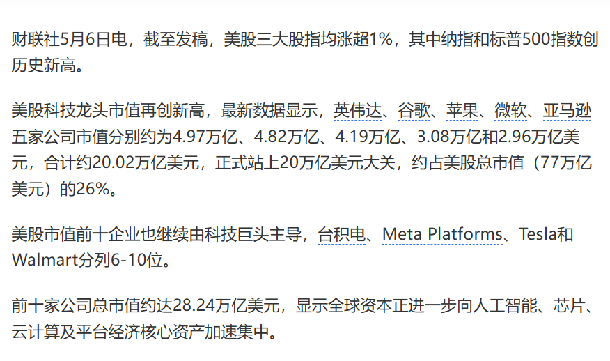
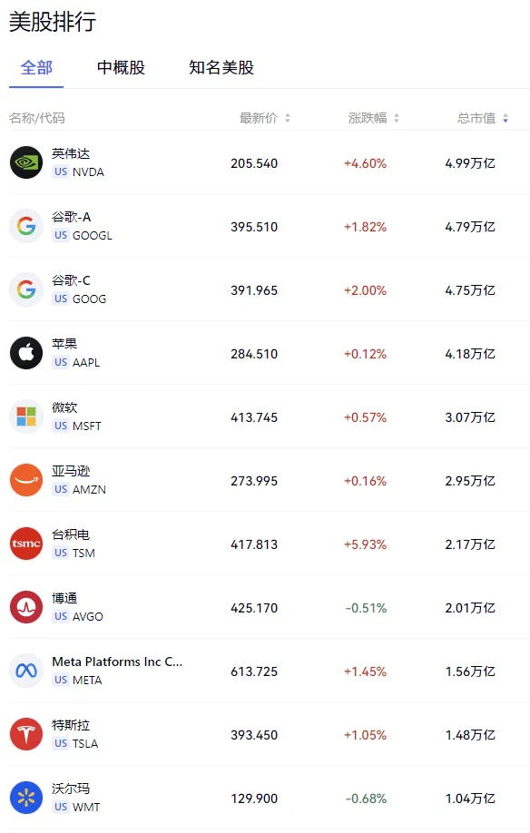

@包容万物恒河水
发表于：2026-05-09 09:40
来源：微博
链接：https://m.weibo.cn/status/5296718846629776

🔻现在美股处于极度亢奋状态，除了“七巨头”（NVIDIA、Alphabet、Apple、Microsoft等），美股还有一大批公司冲上前列：博通已突破2万亿美元（全球前7），沃尔玛、伯克希尔·哈撒韦也稳居万亿美元俱乐部。Eli Lilly（礼来）曾短暂突破万亿后有所回落，摩根大通、美光正快速逼近万亿大关（前者市值约8700亿美元，后者约8400亿美元），AMD、英特尔等虽距离万亿尚远，但也因AI芯片预期录得显著涨幅，其中多数与AI、芯片、内存直接相关。
🔻现在的问题是，AI产业链的利润分配是怎么撑起来的？
🔻OpenAI、Anthropic、Gemini等前沿模型公司年化营收合计估计仍低于千亿美元级别（部分数据显示OpenAI约250亿、Anthropic约440亿），而英伟达、美光、三星、海力士等半导体行业巨头再加上SSD、光模块、代工等AI芯片相关环节的总营收已触及万亿美元级别。
🔻这个巨大的“窟窿”最终由谁来填补？
🔻金融化浪潮中，资本（尤其是垄断金融资本）以前所未有的规模聚合并呈现出凌驾于所有产业资本之上的趋势。这一集中程度意味着少数企业借助市场预期与估值机制的放大效应获取超额金融利润，而实体产业资本的利润则相对处于从属地位。这是资本虚拟化进程在21世纪的新高峰——货币资本的运动日益脱离产业资本的增值过程而独立运转。这意味着从宏观视角看，金融部门的统治地位已经达到了一个临界点，正在加剧总资本的过剩积累问题。
🔻就美国而言，传统的实体产业（如钢铁、汽车、石油化工等）在经过近两个世纪的高度发展后，出现了规模空前的过剩产能和严重的商品过剩危机，以半导体为基础的电子信息硬件、软件服务以及后来的互联网经济，前后承接，形成了一个又一个新的“增长极”。而这些增长极——尤其是芯片制造——又恰恰需要极大量的金融资本来支撑其高固定投资。芯片成为了最容易点燃金融狂热的切入点，因为每一代新的芯片架构、每一次制程工艺突破，都会引发人们对信息生产力大幅提高的美好展望，而这些展望又都极其适合用来吸纳巨量货币资本。大市值隐含着市场对公司未来长期现金流的乐观预期，背后是投资者对它们未来统治力的预期在提前定价，当越来越多的资金涌入某一领域后，后来的投资者会不假思索地追随，从而进一步推高偏离基本面的价格。
🔻美国AI浪潮的利润分配呈现出一种极其分明的垂直分工的层级化：模型公司的营收总和相对有限，而为其供应核心硬件的设备厂商营收却高达万亿美元级别，这是一种独特的形态——相比于其他技术浪潮，它的利润上行渗透性极强，但成本下行的消耗也极为庞大。关键不同在于：上游基础层（芯片/硬件/算力）凭借极高的技术壁垒和极短的在手摩尔定律迭代周期，而下游应用层（模型公司/应用产品/AI即服务）则需要持续的巨额研发投入才能维持前沿竞争力。
🔻在产业初期，上游硬件厂商充当了“卖水人”角色，享受着AI浪潮带来的确定性红利，而下游应用端仍在探索可行的商业模式——如果下游的巨额资本开支无法被后续应用层的盈利所消化，那么这些资本开支本身就无法持续。
🔻美国AI热潮之所以特别，一方面在于它对劳动生产率的潜在提升空间可能是工业革命以来最大规模之一，另一方面在于这种提升需要巨大的前期基础设施投入（全球数万亿美元的算力基建支出）。金融资本既提供了这种基建所需的融资渠道，也可能因泡沫破裂而打断这些投资节奏。历史经验表明，金融资本的过度集中和虚拟化——即便是为了使最具创新性的行业得以快速扩张——都会带来系统性风险。
🔻现在的美国AI热潮确实是美国金融资本主导的又一次对高增长领域的价值捕获。金融资本对芯片股的集中追逐，与早年对.com公司、元宇宙的追捧具有相似的结构性特征，芯片制造极高的固定投资门槛天然需要大量金融资本来支撑，而这种需求又反过来为金融资本的周期性狂欢提供了平台。但当前的AI浪潮更重要的两个变量在美国看起来并不乐观：
🔻上游芯片公司的高利润可能无法通过正常的行业竞争向下游传导，AI对社会劳动生产率的广义影响——尤其是在美国，还远远没有充分体现。
🔻因为这需要实体经济的落地来实现，需要强大制造业的配合。
🔻从这个角度看，美国资本市场对中国大公司估值的“不值一提”就有点自寻死路的意思了，全球市值排名里前20现在没有中国企业。
🔻资本市场狂热有其逻辑，短期的泡沫未必会立刻破裂——只要算力需求持续超过供给，AI芯片的卖方市场就将继续存在。但中期来看，估值需要盈利兑现的支撑。如果下游应用层的商业化进程落后于华尔街的激进预期，过高的估值将面临压力。长期看，实体创新才是根本。美股这波AI盛宴，狂欢之后会怎样？
\#海外新鲜事\#\#热点现场\#

---

