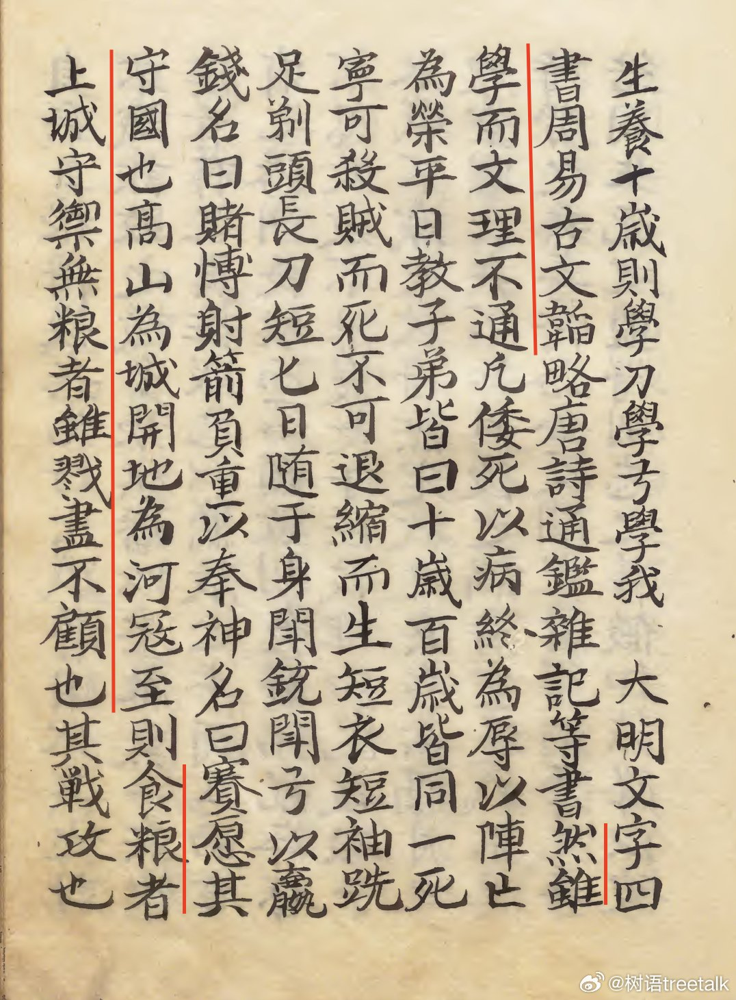
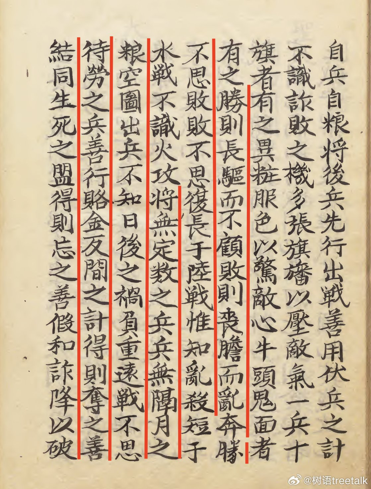
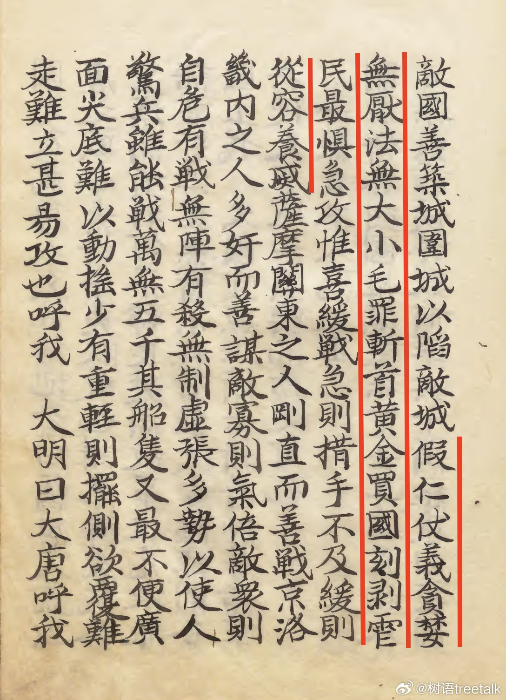

@树语treetalk

发表于：2026-04-15 08:47

来源：微博

链接：https://m.weibo.cn/status/5288008196294024

\#去滤镜看日本\#  读旅日爱国华侨许仪后《陈机密事情》，通报丰臣秀吉欲侵犯大明的敌情。其内容简直太震撼了。侵华日军和许仪后描述的三四百年前日本人，毫无二致。抗日战争时的将领，估计无缘读到这份三百多年前的敌情报告，不然的话，可以做实战参考。许仪后堪比苏武李陵，值得更多人知晓其事迹。划线部分摘录：

> 学我大明文字......然虽学而文理不通。

> 寇至则食粮者上城守御，无粮者虽戮尽不顾也。

> 胜则长驱而不顾，败则丧胆而乱奔。胜不思败，败不思复。长于陆战，惟知乱杀。

> 将无定数之兵，兵无隔月之粮。空图出兵，不知日后之祸。负重远战，不思待劳之兵。善行赂金反间之计，得则夺之。善结生死之盟，得则忘之。善假和诈降，以破敌国。

> 假仁仗义，贪婪无厌，法无大小，毛罪斩首。黄金买国，刻剥虐民。最惧急攻，惟喜缓战。急则措手不及，缓则从容养威。

---

