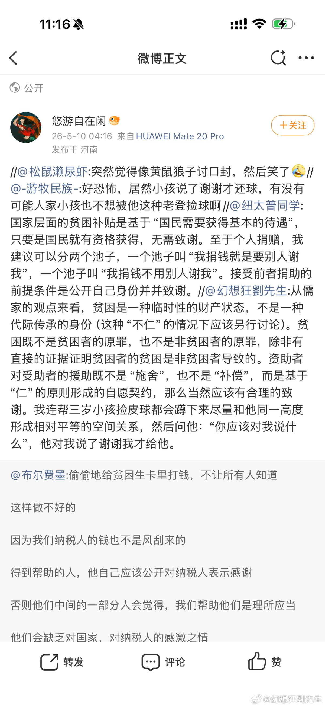

@幻想狂劉先生

发表于：2026-05-10 16:24

来源：微博

链接：https://m.weibo.cn/status/5297062186847857

非常有意思，几个拳师盯着我给小孩捡球要求对方说谢谢这句话，团建起来了。

马克思说：“资本来到世间，从头到脚，每个毛孔都滴着血和肮脏的东西。”

那么我要说，拳师来到人间，从头到脚，每个毛孔都流出“讨债”的扭曲呻吟。

在它们眼里，这世界上的所有人都是它们的“债务人”，父母生它是基于“纯粹的性欲”，“我又没有求你们生养我”，所以毫无疑问的，它爹是老登它妈是婚驴，一辈子欠它的。

其他的人更不用说的，各个都是身负巨债。包括她的集美们，“你凭什么过的比我好呢”，照样欠它的。

对于这样一个满是债务人的世界来说，有什么事是值得说谢谢的呢？这世界都欠我的，你算老几，这不都是你应该的吗？ 

哪家生了这么个东西，或者娶进门这么个东西，那这债可是今生今世都还不完了，想想她会怎么教育小孩：

你让他帮你捡个皮球算什么，应该的，因为每个人都欠你的

---

