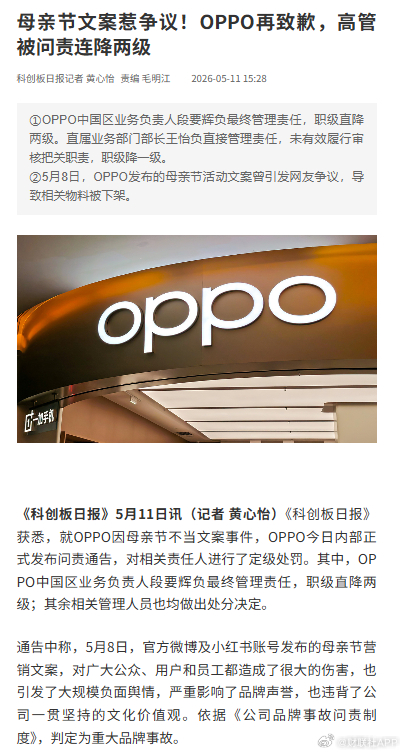
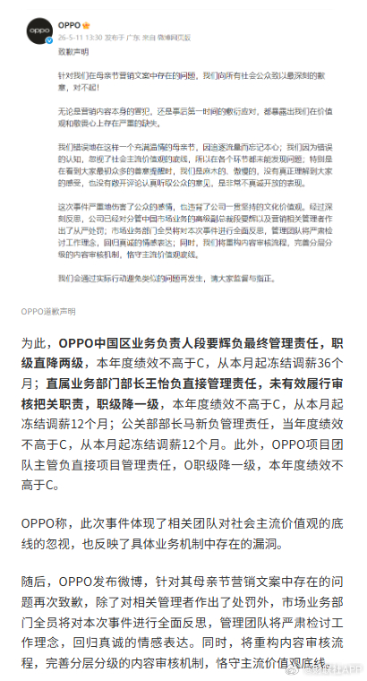

@财联社APP
发表于：2026-05-11 07:46
来源：微博
链接：https://m.weibo.cn/status/5297414963200285

\#oppo高级副总裁直降2级\#【母亲节文案惹争议！OPPO再致歉，高管被问责连降两级】《科创板日报》5月11日讯，《科创板日报》获悉，就OPPO因母亲节不当文案事件，OPPO今日内部正式发布问责通告，对相关责任人进行了定级处罚。其中，OPPO中国区业务负责人段要辉负最终管理责任，职级直降两级；其余相关管理人员也均做出处分决定。

通告中称，5月8日，官方微博及小红书账号发布的母亲节营销文案，对广大公众、用户和员工都造成了很大的伤害，也引发了大规模负面舆情，严重影响了品牌声誉，也违背了公司一贯坚持的文化价值观。依据《公司品牌事故问责制度》，判定为重大品牌事故。 母亲节文案惹争议！OPPO再致歉，高管被问责连降两级

---

