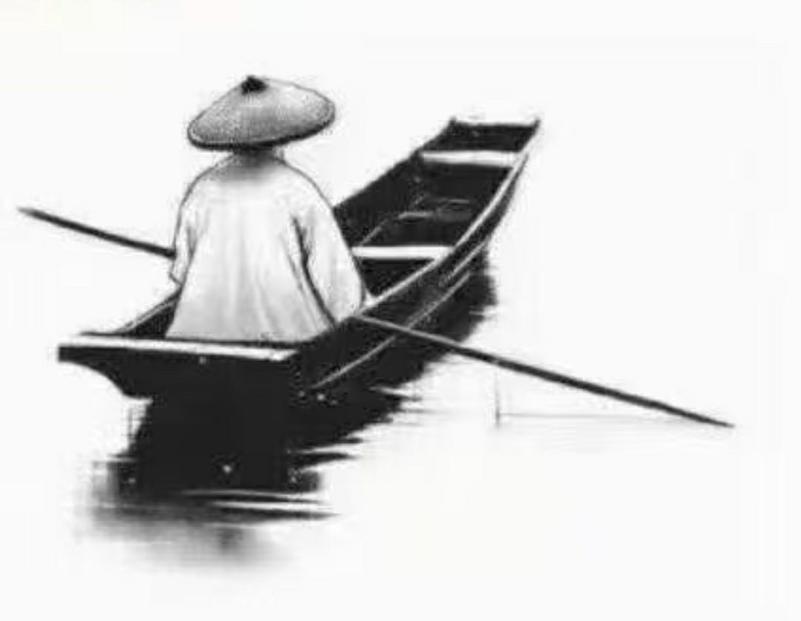

@佛山蟀哥

发表于：2026-04-30 08:46

来源：微博

链接：https://m.weibo.cn/status/5293443586197859

郭德纲老师相声里说：船夫推船入江，压死了沙滩上的几只螃蟹。小和尚问师傅，这是乘客的错，还是船夫的错？师傅对小和尚说：这是你的错。小和尚不解，我什么都没做，何错之有。师傅笑着说：船夫推船是为了养家，乘客渡江是为了赶路，螃蟹钻沙是为了藏身。大家都在拼尽全力的活着，只有你在无中生有，强分是非。万物各有归途，本无绝对善恶，这个世界从来不缺是非，只缺闭嘴的人。

---

