# 2026-05-18

## 1

@塔列郎

发表于：2026-05-10 17:24

来源：微博

链接：https://m.weibo.cn/status/5297197899056151

从地理的视角来看，目前最不喜欢普鲁士的德国人是巴伐利亚人，这点几乎是毫无疑问的。巴伐利亚人不喜欢普鲁士人，是有了名的。

早在19世纪，巴伐利亚人几乎都是“大德意志方案”的支持者。巴伐利亚人拥有强烈的地方主义情绪，再加上宗派主义，这些因素让巴伐利亚成了整个德意志最不喜欢普鲁士的地区。

在托马斯·曼的小说里，来自北德的女孩来到了巴伐利亚，她说“这真的是外国啊”。二战后，很多北德人逃往巴伐利亚，当年，巴伐利亚农民协会的主任说：巴伐利亚男人不应该娶北德女人。他还说，最好能把普鲁士人送往西伯利亚。

巴伐利亚公主Wiltrud说：她家人自从1866年来，就非常恨普鲁士和霍亨索伦家族, 只不过这种情绪不能表现出来。（Wiltrud公主是巴伐利亚末代国王的女儿）

德国统一时，巴伐利亚国王路德维希二世非常痛苦。他对大臣们说“你们觉得被吞掉是一件好事吗”？在1871年，巴伐利亚国王说，他的心在流血，说他在这个时代做国王，是一件多么不幸的事。一名史学家认为，普鲁士统一天下，给路德维希二世造成了巨大的精神刺激，他认为他没能保护好巴伐利亚的主权，最终导致他精神错乱。

在德意志第二帝国时期，巴伐利亚人非常不喜欢“色当日”这个节日，因为色当战役摧毁了巴伐利亚的主权，终结了巴伐利亚王国的独立。

一名德国研究者说，如果在历史上，巴伐利亚王室不搞内讧，家族内部团结，那么现在慕尼黑，或者某座巴伐利亚城市，就可能是德国首都了。

巴伐利亚的奥托王子因为普鲁士统一天下，感到非常痛苦。普法战争后，他的情绪日益恶化。再后来，他也彻底的精神错乱了。奥托王子参加了凡尔赛加冕，他说德皇的加冕仪式是“那么的冷酷，那么的骄傲，那么的耀眼，那么的浮华，那么的自负，那么的绝情，那么的空虚”。

（so kalt, so stolz, so glänzend, so prunkend und großtuerisch und herzlos und leer ）

一战时期，巴伐利亚王室失去了人心，主要就是因为巴伐利亚人认为他们的王室在战争时期，对普鲁士太过顺从，没有保护好巴伐利亚的利益，没有保护好巴伐利亚的主权。

很多巴伐利亚人认为，这场战争是普鲁士的战争，普鲁士决定开战时，没和巴伐利亚商量。巴伐利亚人无法接受他们的国家沦为普鲁士的附庸。

在1918年，巴伐利亚人的一个口号是“远离普鲁士”（Los von Preussen）。在这个节骨眼上，巴伐利亚王室和普鲁士彻底决裂，才能自救，才能赢得人心。史学家认为，德国走到这一步，就是因为天下诸侯们对普鲁士国王太纵容了。面对上蹿下跳的德皇，就连巴伐利亚国王都不敢哼一声，眼睁睁的看着德国发动侵略战争。

巴伐利亚王子弗兰茨认为，和普鲁士决裂，才是最受欢迎的事情。在1918年11月4日，弗兰茨王子说“目前最受欢迎的事情，是向普鲁士开战”。不过他马上就放弃了这种思维，因为这根本不可行。

（das populärste wäre jetzt ein Krieg gegen die Preußen）

巴伐利亚王室已经统治了700多年，他们的王位是巴巴罗萨大帝给的。萨克森王室统治了800多年，梅克伦堡的王室也统治了800多年。但当德意志的21个王朝被迫上了普鲁士军国主义这条船，他们的王冠不到50年就丢了。

一名德国历史学家认为，是普鲁士毁掉了德意志天下所有的王朝。很多德意志的诸侯们，在1918年都非常清楚，是普鲁士毁掉了他们。

在一战末期，德意志的各个邦国普遍认为是普鲁士把大家害的这么惨。

---

## 2

@很不一般啦

发表于：2026-05-14 05:07

来源：微博

链接：https://m.weibo.cn/status/5298461989932096

喜欢给阿嬷的情书的一个原因是它舒缓的节奏和含蓄的情感。现在电影多数情绪太强烈了，情节的推进，演员的表演，都太用力了。克制，留白，自然，细水长流似乎是奢侈的。

生活和电影一样，不能一直被事情包围轰炸，给自己留些喘息的时间，闻花香，望月亮。

昨天去寺庙里坐了一个下午，祈福时恰好风过，庙檐角上的铃铛摇曳禅音悠长。晚饭中临时决定去看阿嬷，庆幸自己没有错过这部温柔泛黄的电影，真喜欢那些半文言的家书，还有阁楼顶上南枝教小孩子们念的诗。

日子缓缓地过就很好，江水滔滔，也会平静缓慢的流淌。

---

## 3

@不神经的神经叨

发表于：2026-05-13 23:06

来源：微博

链接：https://m.weibo.cn/status/5298371107751593

\#高敏感人群一生的主线任务\#

高敏感人一生口诀：

 

守能量、划边界，分情绪、不内耗；少社交、深走心，顺天性、做自己，适当的学习钝感力。

因为感知力太强，特别容易受到外界的干扰，给自己的心灵戴上安全套，既能防病，又降低敏感度，不至于一碰就炸。

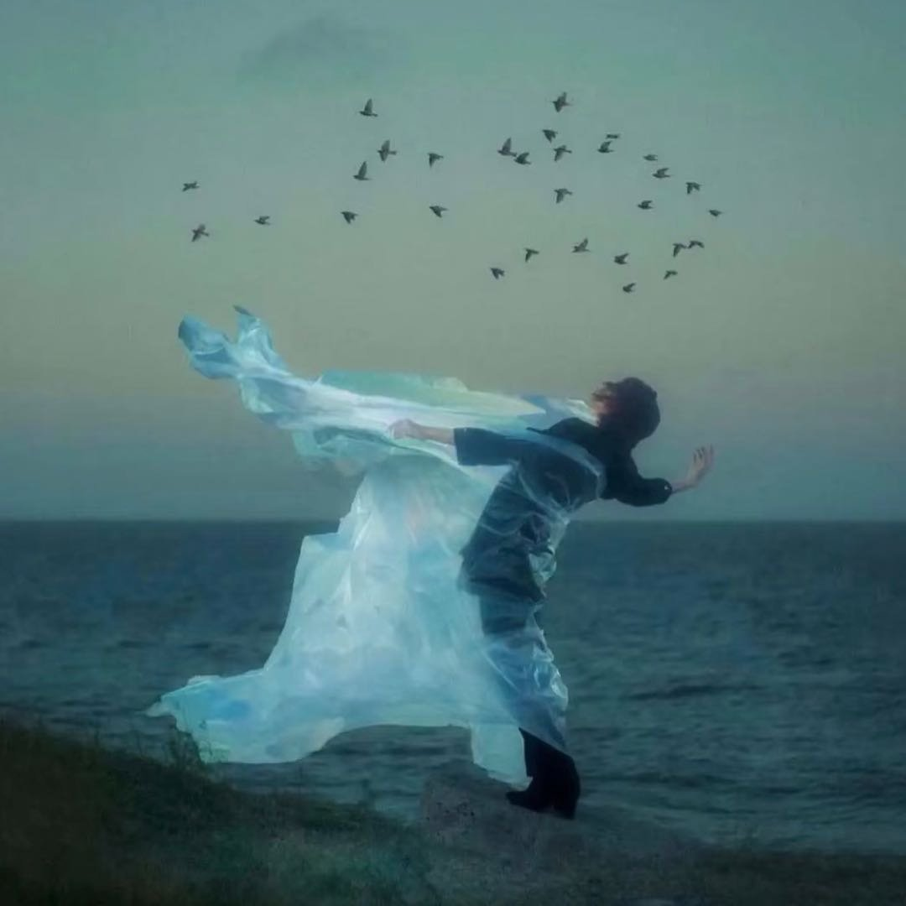

---

## 4

@挖地瓜的超级鹿鼎公

发表于：2026-05-15 14:11

来源：微博

链接：https://m.weibo.cn/status/5298961391028490

重发一遍7年前的文章

我一直在讲，做股票最重要的是常识与逻辑。其他弱一点都可以学习，但是缺乏常识与逻辑，很难做得好股票。

我们知道

企业赚钱，股民才可能赚钱，这是常识

企业成长，估值才可以提高。这是常识

买入时候的估值低，才有空间，这是常识。

好企业，好价格才是王道。这是常识。

大股东高位减持，不是好现象，这是常识。

但是，最近现在一切都反过来了。

巨额亏损股涨幅巨大。

业绩倒退的，涨幅巨大。

估值高的，涨幅巨大。

大股东减持的涨幅巨大，增持的反而在跌。

有钱就是了不起，价值规律算个屁，涨了才是真理，跌的都是垃圾。

市场走出让我瞠目结舌的图形，好吧，你们有你们的逻辑，我是傻瓜，却有自己的常识，即使你们推翻我的常识，我也只能像个一样，默默的拿着自己的股票，一遍遍的算竞争优势和盈利。

再一次站在路边给赚钱的各位股神鼓掌，赚到钱就是伟大，伟大，伟大

牛市我是小丑，给大家献出笑料，年后融资跑输大盘400点了

作者：超级鹿鼎公

---

## 5

@奶霸知道

发表于：2026-05-15 15:42

来源：微博

链接：https://m.weibo.cn/status/5298984207257723

我用了整整一下午，系统性检索，逐例核对全球影视工业发展史中所有公开发行的重点作品，最终得出一个令人错愕的定论：这部中国电影，就其题材设定与主演身份而言，是全球公开商业影视范畴内，独一无二、仅此一部的存在。

这部电影最震撼的内核，并不在其由真实案件改编的背景，而是一桩杀人案里的服刑人员，刑满出狱后，亲自出镜主演，拍出一部高度复刻自身罪行与人生轨迹的公开发行影片。

这件事，早已脱离普通真实事件影视化的范畴。它不再是社会旁观犯罪，而是让犯罪者重回公共叙事的中心。

这是西方影视行业数十年来，始终不敢逾越的伦理底线。

世人总误以为欧美影视百无禁忌，什么题材都敢触碰。

其实不是的！

欧美从不避讳拍摄杀人犯，早已把真实犯罪做成成熟产业链。达默、邦迪、梅嫩德斯兄弟等恶性案件，接连被翻拍成剧集影片。他们深挖凶手童年创伤，剖析原生阴影，梳理犯罪心路，甚至引导观众共情理解施暴者。

可即便做到这般地步，西方始终死守一条底线：绝不允许真实凶手本人，以主角身份重回大众视野。

西方社会早已参透其中隐患，跨过这条界限，整个社会价值导向都会彻底倾斜。

从前是社会审视、剖析、警示犯罪，一旦放开口子，就会变成施暴者借助过往恶行，博取名望、收割流量、抢占公共话语权。

这在西方伦理体系中，是极度危险的信号。美国更是为此出台专门法律《山姆之子法》（Son of Sam Law，1977年纽约州首立，后普及全美），核心目的只有一个：严禁罪犯依靠自身犯罪经历（出书、采访、影视版权）牟利，收益优先赔偿受害者家属。

法案诞生的根源，是早年恶性罪犯靠售卖采访、撰写自传、出让故事版权大肆敛财。社会随之生出巨大恐慌：罪恶开始资本化，恶名开始商业化，暴力开始流量化。

所以哪怕欧美真实犯罪题材泛滥成灾，依旧建立起严密的隔离机制：可以拍摄凶手、剖析罪行、实地跟拍出狱生活，唯独杜绝凶手亲自出演自身经历。

一旦打破规则，社会价值奖励机制便会彻底扭曲。当下时代最珍贵的资源从不是财富，而是大众注意力，注意力本身就是无形权力。

一个身负命案、服刑赎罪的人，最终能凭借过往恶行登上大银幕，拥有专属镜头、影片海报、观众同情与全网热度，等同于向外界传递出扭曲信号：社会正在变相纵容、奖励暴力恶行。

时至今日，就连演员饰演凶手的影视创作，都在西方引发大规模舆论反噬。

2022年网飞推出剧集《怪物：杰夫瑞·达默的故事》，遭到达默受害者家属集体怒斥。受害者亲属公开控诉：“我们从未被联系，他们只是拿我们的痛苦赚钱”，直指剧集是在“反复创伤化”逝者家庭。

《卫报》《洛杉矶时报》《时代》杂志等权威媒体接连发声批判，伦理研究机构公开讨论真实犯罪影视是否在“把创伤娱乐化”。

这还只是演员演绎，就掀起如此巨大的伦理争议。

而我们这部即将公开上映的电影直接冲破所有行业防火墙，摒弃演员演绎，让曾经手持利刃杀死亲夫的当事人本色出演。

这意味着施暴者彻底摆脱被拍摄者的身份，重新跻身公众人物行列。

纵观全球影视行业，我没能找到第二例同类型公开商业作品。

西方影视界其实比谁都清楚，一旦让真实行凶者重新站回银幕中央，事情就已不再是艺术表达，也不再是现实改编。

因为从那一刻开始，被重新包装的，就不只是一个角色，而是一个曾亲手制造过伤害的人。

当一个犯下重罪的人，最终能够凭借自己的案件重新获得镜头、流量、掌声与社会关注，被改写的，可能早已不只是电影伦理。

而是整个社会对于“代价”二字的定义。

---

## 6

@杜车别赫

发表于：2026-05-15 16:50

来源：微博

链接：https://m.weibo.cn/status/5299001389744970

\#给阿嬷的情书\# 看了电影《给阿嬷的情书》，这电影确实拍得好。这片名，这题材，本来我不太可能去看。我肤浅，对有视觉奇观，有超现实想象的，科幻的，神话的才较有兴趣。不过这电影评价一致地高。据说演员又都选自无演艺经历者，又是方言地域色彩浓厚的。也就好奇了，想看看究竟怎么回事。看后觉得确实出色。导演无一处煽情，处处轻描淡写，举重若轻。给观众的感染和情感震荡，却是浸润式的，整体性的，算得上艺术的境界了。好到一定程度，就是雅俗共赏了。就和好的古诗一样，完全不懂诗的人，也能被感染。艺术原本就是感染人，而不是说服人。任何人都能有自己感触，这就是很高明的境界。此中有真意，欲辨已忘言。

导演叙事高明，拍摄手法高明，对演员的选择也高明。真正就是把人物气质形象和角色贴合度放在第一位，为此甚至主动放弃在专业演员里选角色，这就已经打破了许多导演的僵化观念了。

出来的表演效果丝毫没有降低要求。半点不粗糙不马虎，还是很细腻。不像某些打着用普通人主演做噱头的“艺术”电影，唯恐人不知道这不是专业演员演的，故意充塞粗劣敷衍气。

王扶林拍红楼也是这种态度。总算有人继承了。

我记得本来姜文拍《阳光灿烂的日子》也是有这种精神。那也是他质量最高的电影了吧。怎么后来拍戏和中了邪一样，除了每次都让他老婆周韵演重要角色之外，还非得挑名气大的所谓明星，似乎不如此就没底气，不自信。

本来资历高的导演应该越有底气把角色契合度放首位，选用新人。怎么反过来了。

这片子导演和演员都不是影视类院校培养出来的。这也可见我国影视院校培养机制问题。复杂的不多说。影视院校文化分数线太低，就是极不合理的。演员之类文化水准应该远高于普通人。北电，中戏之类文化分数线应该和北大清华一个档次才对。都是半文盲，就难免劣币驱逐良币了。

在演员可能被叆（ai）淘汰的现在，说这个可能也晚了。

当然也可能正是时候。真人电影电视要竞争过叆影视，出路就是精品化。继续港剧tvb式短平快粗制滥造快餐路线，完全竞争不过叆。

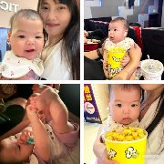

---

## 7

@EricTsui

发表于：2026-05-15 16:49

来源：微博

链接：https://m.weibo.cn/status/5299001117115518

跟厉害的人混，他顶多就是看不起你，但绝对不会搞你。你要是跟不上档次的废物扎堆，就算你做人做事再周全，他照样会算计你，甚至往死里搞你。你要时刻记住宁跟高人挨白眼，不跟烂人多纠缠。圈子选人，识人则友。你身边是什么样的人，就注定了你是什么样的人生。

---

## 8

@liu_iiiiiirich

发表于：2026-05-16 01:46

来源：微博

链接：https://m.weibo.cn/status/5299136267551740

没看《给阿嬷的情书》之前我以为又是一部被吹大了的电影！而且真的已经厌烦了这种通过泪水来营销的电影，好几次都是被骗去，结果真的就是很难看！

结果看完之后，直到我开始抽泣 不得不用袖子擦鼻涕，我才反应过来这感觉就是在满是预制菜的时代里突然给我端上一碗小火慢熬的汤

特别想感慨一句

“原来人和人曾有过这样纯粹的时代”

我无法具体的说这是爱情 友情 还是亲情太单一也太低估这些情感了

就像我低估了片头最先出现的字幕

“阿嬷说要做一个有情有义的人”

看到最后留在我心底的只有“至真至诚的情义”

最后推荐大家都去看！真的很不错

---

## 9

@演员赵箫泓

发表于：2026-05-10 02:00

来源：微博

链接：https://m.weibo.cn/status/5296965287414403

你好，我是赵箫泓。今天，我在这里，和大家正式见面。

我曾被命运推入深渊，家暴、坐牢、与孩子分离…… 我以为人生会永远走不出那个绝望的夜晚。

困在高墙之内整整10年，这10年，我丧失的不仅是自由，还有孩子的童年，更被自己的心牢死死困住。连做母亲的资格，都似乎被命运没收。但我从未认命。隔绝外界的监狱里，我唯一能寄托思念的，就是在想象中画儿子的成长，一笔一笔，画的是念想，是愧疚，是我撑过无数个暗无天日的日子的勇气。

很多人问我，在狱中那样艰难的日子里，为什么敢接受拍摄邀请，把自己最不堪、最痛苦的过往，赤裸裸地呈现在世人面前？其实答案很简单：因为我懂那种被困在黑暗里的绝望、我懂那种错过孩子成长连思念都只能藏在心底的愧疚。我懂那种没办法向外人诉说的无助。我只是想借着这部电影，让那些和我有相似遭遇的女性，知道自己不是孤单一人；我想让更多人看到，女性在困境中的挣扎与坚韧。我经历过绝境，所以我想告诉所有身处低谷的人，再难的日子，只要不放弃，就一定能看到光。

最后最想感谢我的家人，尤其是我的婆婆，在我缺席的这些年里，她在深深的悲痛中抚养年幼的孙子，撑起整个家。出狱后，又帮我弥合和跟孩子的关系。我也感谢让我把故事说出来的秦晓宇导演。拍电影，像是把人生又走了一遍，痛，但值得。

这部电影，是我给所有在困境中挣扎的姐妹们的一封信。我想对你说：不管多难，别放弃自己。你的坚持，本身就是光芒。

\#素人女演员获国际A类电影节影后\#\#赵箫泓\# \#电影监狱来的妈妈定档\#

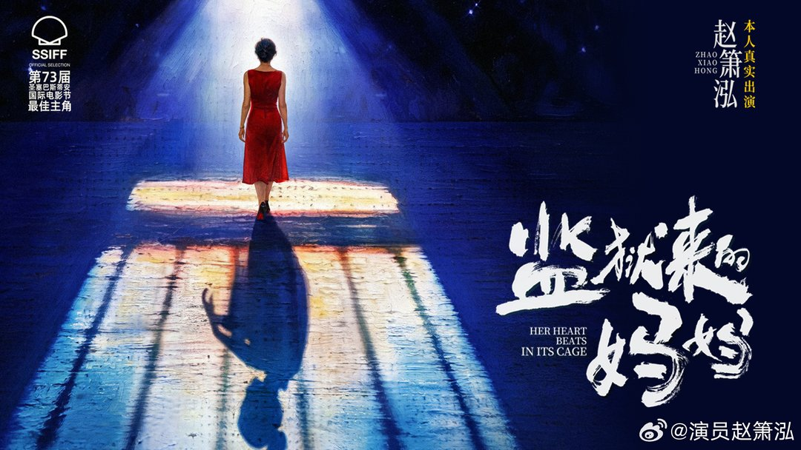

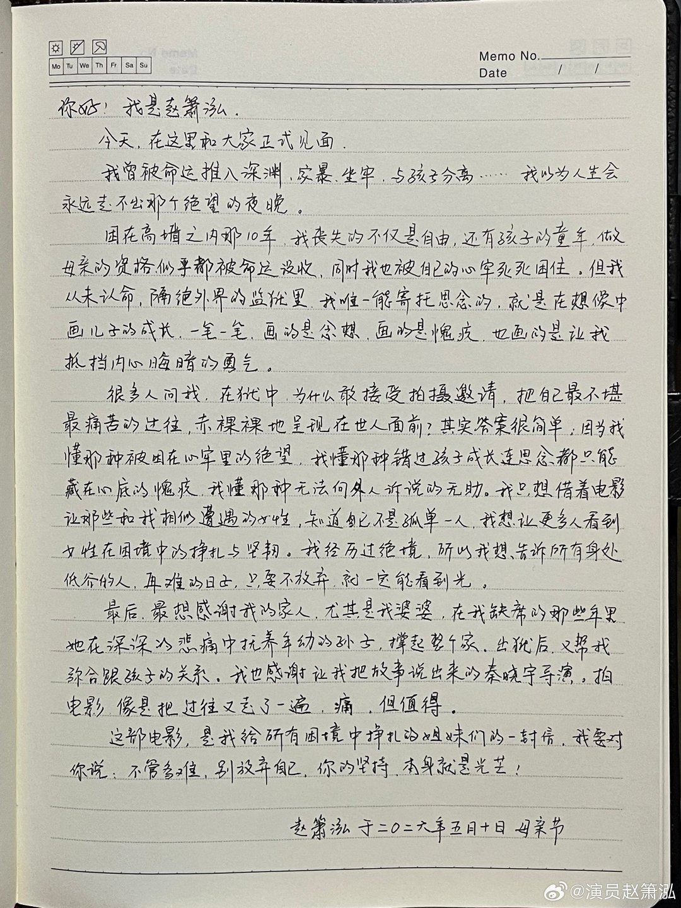

---

## 10

@申典启

发表于：2026-05-16 10:30

来源：微博

链接：https://m.weibo.cn/status/5299268001726957

全世界对猪肉最敏感的两个群体：

1️⃣中国MSL

2️⃣马来MSL

“清直”标就是发源于马来西亚，用来把MSL跟非穆进行“物理隔离”。

事态逐步升级，马来西亚把“清直标志”泛化到清直卫生纸，清直水等一切事物……

之后马来西亚的“泛清直化”逐步传染到中国（大概2015年那阵），后来被中国及时阻断。

而马来西亚把清直标志产业化，制造了各种“清直概念”……开始反向影响中东。

下图，在外网的一个马来人发帖，指责华人违反“外菜莫入”的“规定”，把不清直的食物带进肯德基，评论区的马来人大肆辱骂马来西亚华人滚回中国

（感觉外菜莫入这个画面很熟悉）。

典评：

最在意清直的都是血统不那么清直的，心理学有一个说法，“补偿思维”，觉得自己血统“不正宗”，就在行为是“正宗”去证明自己正宗。 波兰·华沙

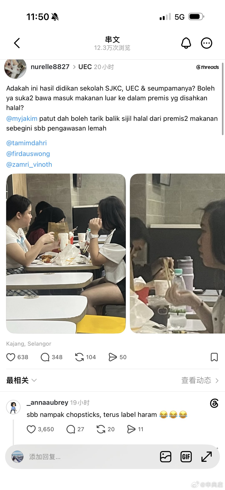

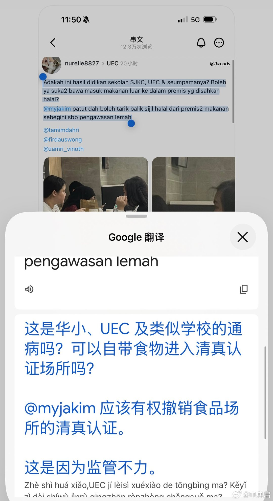

---

## 11

@幻想狂劉先生

发表于：2026-05-16 11:30

来源：微博

链接：https://m.weibo.cn/status/5299283278432873

马来西亚是将“Halal”这个概念作为政治技术运用最成功的的MSL国家，马来西亚通过将一个简单的“可食/不可食”概念发展成一个庞大的律法体系和政治技术，成功稳固了其“基本盘”即马来民族的政治权力。通过在日常的衣食住行中制造“他者”，马来西亚成功压制了华人利用其与其人口体量不相符的经济力量发挥政治影响力。马来西亚的JAKIM（伊斯兰发展局）是全球公认的清真认证权威之一，马来西亚亦利用这一政治技术用于国际关系，通过输出“Halal”标准对别国施加影响力。例如，在苏联解体时，哈萨克斯坦很难说是一个MSL国家，通过马来西亚输入其体系，哈萨克斯坦建立了自己的“Halal”体系，并和马来西亚进行了“互认”，在这个过程中，马来西亚在中亚拓展了影响力，并作为YSL世界的边缘存在，在“Halal”这一领域获得了权威地位。

---

## 12

@南山林雪萍

发表于：2026-05-16 09:01

来源：微博

链接：https://m.weibo.cn/status/5299245689343692

一树梨花压海棠，当老技术撞上了未来产业。

这两天碰到了老朋友，发现他已经从一家外企的电厂自动化控制公司，进入一家飞轮储能的民企公司。霎那间，觉得他是不是入错了行。

飞轮储能是面世多年的技术，利用一个巨大的飞轮惯性，用来给电网做频率调节使用。人们很熟悉战略目标的飞轮效应，开始推动慢而一旦启动就进入自持向前的局面。然而这种技术在实战中，却一直不温不火。

风光绿电这两年快速发展，似乎给飞轮储能也带来新的活力。它可以用来做储能来缓冲不稳定的风光。然而，它依然是排名靠后的二备胎技术。

储能的路线，还有基于电芯的储能电池，和利用乡村山野里的水库的抽水蓄能。2025年储能电池全球有近600吉瓦的装机容量，大部分都是采用磷酸铁锂的电芯。这种电化学技术的储能，给人如同貂鼠毛皮一样顺滑的色泽绒光，受到资本的强烈追捧。跟风光无限的储能电池系统BESS相比，飞轮储能跟抽水蓄能一样，都带着一股老技术甚至乡土的气息。

然而这家成立了10年的老技术，一直跟着电网调频背后冷板凳吃土的企业，在过去一年突然经历了璀璨的光芒照射。来自最未来的AI技术，一把将飞轮储能变成炙手可热的算力中心备用电源方案。

 数据中心一向是将市用电10kv，经过中压柜和低压柜的的变压器，来回转换变成380V机房级的主干配电电压。到了GPU集群的机柜里，再降压到 48V DC 再进服务器。

 这个过程中，电压转换效率是95%。在单机柜是50kw的功率下，这个损耗没有人觉得不满意。

随着下一代大功率GPU的Rubin的来到，单机柜就能达到1MW的功率。一个巨型算力中心可能需要一个30万千万的发电站。任何一个点的电功率损耗，都是不可忍受的。Rubin的目标是将主干配电压升到800v，这样就能减少铜线损耗和发热量。

于是固态变压器SST，横空出世。它简化了几个设备的接连转换，直接一步到位，将10kv电压变成800V电压。功率效率直接达到了98.5%。

更重要的是，固态变压器的体系大幅度缩小。这对于寸土寸金的算力中心而言，每节省一平米的空间，就是巨大的Token收益。

然而芯片的发热之王Rubin，对于电流的要求也是高度敏感。英伟达要求，电压需要稳定在正负5%。在瞬间失电的情况下，只能有50毫秒的时间做出反应，备用电立刻补上去。否则，会大大影响GPU的寿命。

这种大电压而且微波动要求的储能系统，电池储能BESS或者一般的UPS电源，都很难接得住。

于是，看似“傻-大-笨-粗”的飞轮储能，开始用上排场。飞轮有着巨大的惯性，它能很轻松地保持此前的状态，从而让主电压丢失的时候，依然保持它前一刻瞬间的记忆：那一刻的“瞬间”，是50毫秒，二十分之一秒。

 于是固态变压器SST与飞轮储能，就是天合之作。电压向高处波动的时候，就把能量吸收到飞轮里。

电压低时，就把能量放出来。而且，由于飞轮是机械储能站，完全没有寿命问题。性价比极好。

这样天赐富贵的场景，只有飞轮储能最为合适。无它，唯惯性大尔。

于是，最不起眼的飞轮储能传统技术，居然挤进了最热的AI赛道。世界上哪有传统产业，每一个新兴产业都是踩在传统产业的肩膀上。这家吃土的公司一下子突然含着金钥匙。改头换面的时刻，为了有个炫酷的名称供大家技术膜拜，“飞轮储能”应该叫做“飞储”了。怎么样，这个词配得上战略新兴产业吧\#供应链攻防战\#\#创新的繁荣\#

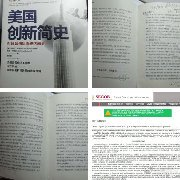

---

## 13

@邪能之槌

发表于：2026-05-16 08:56

来源：微博

链接：https://m.weibo.cn/status/5299244412965196

《监狱来的妈妈》绝非什么“女性救赎”的温情之作，而是一部颠倒黑白、漠视生命、践踏伦理、讨好西方的拙劣闹剧，其存在本身就是对法律尊严、受害者权益和社会公序良俗的公然挑衅。

这部打着“真实改编”“女性救赎”幌子的影片，实则是一场精心策划的犯罪洗白，用虚假叙事消费生命，用伦理底线换取流量，每一处细节都充斥着对正义的亵渎和对良知的漠视。

这部影片最令人不齿的，是其赤裸裸的虚假叙事与洗白行径。主演赵箫泓，原名赵晓红，犯罪事实清晰明确，绝非影片所渲染的“悲情受害者”——结合网传判决书原文、法医鉴定结论及司法审理细节，其自述的“反抗家暴、无意挥刀误伤”纯属彻头彻尾的谎言，毫无事实依据，更是对司法公正的公然漠视。网传判决书原文明确载明，案发当日，赵晓红与丈夫仅因家庭琐事发生口角争执，无任何证据证明其遭受家暴攻击，争执过程中，赵晓红主动起身，取出水果刀，返回争执现场后对丈夫实施捅刺，主观上具有伤害他人身体的故意，并非“无意挥刀”，法院经审理查明全部事实后，最终以故意伤害罪致人死亡判处其十五年有期徒刑，剥夺政治权利五年。

更具说服力的是判决书所附的法医鉴定报告，报告明确显示，死者致命伤为“斜向右下入胸腔”，完全符合“蓄意捅刺”的特征，绝非“无意挥刀”“失手误伤”所能形成。

除此之外，死者身上未发现任何防卫性伤痕，即无格挡、反抗时形成的损伤，赵晓红体表也未检测到任何挫伤、殴打痕迹，彻底推翻了其“被家暴后被迫反抗”的虚假供述，与我国司法实践中“家暴反抗案”中受害者多有伤情、施暴者有防卫伤痕的特征完全不符。

生效裁定书中，无任何“家暴”“防卫过当”“正当防卫”的相关表述，多名邻居、亲属的证人证言均证实，二人日常相处平和，仅偶尔发生口角，无长期家暴、肢体冲突的情况，所谓“长期遭受家暴、走投无路失手杀夫”纯属无稽之谈、恶意编造。可影片却刻意篡改这一铁一般的司法事实，无视判决书载明的核心情节与法医鉴定结论，将一个冷血杀人犯，包装成长期被压迫、走投无路的“家暴受害者”，把残忍行凶美化成“正当防卫”，甚至恶意混淆“减刑”与“特赦”的法律概念，编造虚假的出狱理由，一步步将罪犯塑造成值得同情的悲情英雄，其用心之险恶，无异于对逝者的二次伤害，更是对司法权威、法律尊严的公然亵渎。

更突破底线的是，影片让刑满释放的凶手本人亲自出镜，演绎自己的行凶经历与人生轨迹，这早已脱离“真实题材改编”的范畴，而是让施暴者堂而皇之地重回公共视野，借助影片博取名利、收割流量、洗白罪孽。

纵观全球影视行业，就连以“题材无禁忌”著称的欧美影视界，都死守着“不允许真实凶手主演自身罪行”的伦理底线，美国《山姆之子法》更是从法律层面明确禁止罪犯靠自身犯罪经历牟利，就是为了杜绝罪恶资本化、恶名商业化。可这部影片却反其道而行之，不仅让杀人犯登上大银幕，还让其凭借这份沾满鲜血的“罪行履历”斩获国际奖项，沦为万众瞩目的“影后”，这无疑向社会传递出极其扭曲的信号——恶行可以被美化，罪孽可以被洗白，凶手可以凭借自己的罪行获得荣誉与关注，这是对所有受害者及其家属的残忍刺痛，更是对社会惩恶扬善秩序的彻底破坏。

更令人愤慨的是，影片还涉嫌违规拍摄、虚假宣传，处处充斥着谎言与漏洞。导演曾高调声称“跨十余所跨省监狱获批拍摄”，可稍有常识的人都知道，我国监狱实行严格的省级属地管理，重刑犯监狱与女子监狱的拍摄审批更是严苛到极致，“十余所跨省拍摄”在流程上根本不可能实现，纯属误导公众的谎言。

更讽刺的是，主演赵箫泓出狱后仍处于剥夺政治权利期间，而参与影视拍摄属于被剥夺的政治权利范畴，其行为已涉嫌违反刑法相关规定，可影片却对这一严重合规性问题避而不谈，只顾堆砌悲情叙事，甚至刻意迎合西方对中国司法、性别环境的刻板印象，靠输出负面虚假叙事博取国际关注，沦为讨好西方、抹黑自身的工具。

---

## 14

@李子暘Lee

发表于：2026-05-16 00:56

来源：微博

链接：https://m.weibo.cn/status/5299123559335163

看来不少人不知道“剥夺政治权利”的起算时间。

有期徒刑+剥夺政治权利的，服刑期间，当然啥权利也没有。服刑期满以后，开始计算剥夺政治权利时间。

比如，判了十年有期徒刑，剥夺政治权利五年。是他出狱之后五年之内，没有选举权与被选举权，没有言论、出版、集会、结社、游行、示威自由，没有担任国家机关职务的权利，不能担任国有公司、国企、事业单位、人民团体领导职务。

最近公开翻案的那个杀人犯，判了十五年，剥夺政治权利五年。2010年判的，她2020年减刑提前出狱。那电影的拍摄时间是2019-2021年。

嗯，在监狱服刑期间就开始拍电影了，就恢复公民权了。

应该查查那监狱，是不是腐败了？还有上级政法委，是不是腐败窝案？

~

---

## 15

@李楠或kkk

发表于：2026-05-14 08:02

来源：微博

链接：https://m.weibo.cn/status/5298506034054116

我不敢说 LLM 清零了大量专业领域，至少敢说 ： 1 LLM 打破了简历和学位的壁垒。    2 大量专业内的二把刀，提供不了比模型更好的输出了。  open claw 作者之前小有名气，但是也绝没到 20亿美金身价进入 open ai 的地步。  所以，今天，快速学习，快速行动是真的可以一夜之间阶级跃升的。  消耗 token ，贵是贵，但是说实话做点东西出来，很可能也就是你一个月的饭钱。

---

## 16

@李楠或kkk

发表于：2026-05-14 07:28

来源：微博

链接：https://m.weibo.cn/status/5298497480034015

kimi 总裁：

月之暗面已经在用 AI 面试系统筛选候选人。系统不看学历和专业，重点看两件事：

一是能不能提出原创的好想法，

二是愿不愿意为一个想法疯狂迭代。

AI 系统会记录候选人迭代了多少次、用了什么不同思路、什么时间还在尝试，从中筛选出「有抽象能力和偏执」的人。

---

## 17

@蒜泥猪头

发表于：2026-05-12 02:02

来源：微博

链接：https://m.weibo.cn/status/5297690785088217

历史小常识：在17世纪，真正的满洲八旗兵，野猪皮用来挑战大明朝的核心资本，总共就不到五万人。后来满清入关后征服全中国使用的其他兵力，全是凭这些人的威力所衍生出来的盟友和仆从。

---

## 18

@幻想狂劉先生

发表于：2026-05-13 20:52

来源：微博

链接：https://m.weibo.cn/status/5298337554104848

这些人在战场上的作用其实也有限，主要是给“伪军”提供心理支持，其次才是去打一些小规模的攻坚硬战。而这种心理支持恰恰来自于他们之前对伪军作战时的积威。满洲兵的伤亡一直是满清的最高军事机密，这样才能保持对汉军和蒙古的积威，让他们不敢有异志。渡过长江后满清对满洲兵的运用愈发谨慎，常以几百甚至几十为单位使用了，但就这么点满洲兵，只要到了前线，就能让几十几百倍数量的伪军鼓起勇气面对郑成功或李定国的劲旅，或者在孤城里坚守而不降。在实在抽不出满洲兵时，投降较早的前明辽军，也会被派给投降较晚的南方伪军，给予类似的心理支撑。所以很多人看史料不明白清缅的时候瘴气挂了155个满洲兵闹这么大事，这是满清的核心统治工具啊！

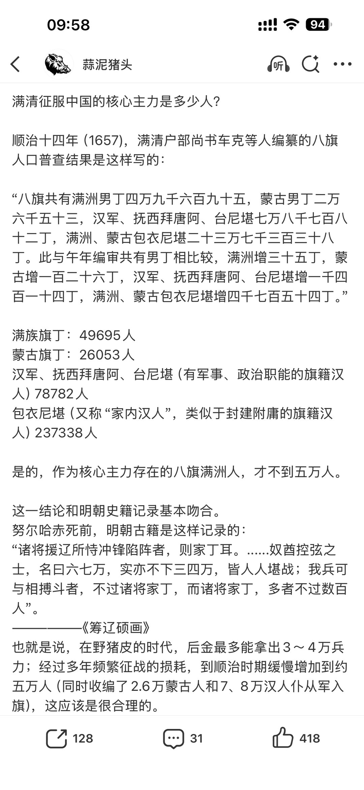

---

## 19

@幻想狂劉先生

发表于：2026-05-16 21:04

来源：微博

链接：https://m.weibo.cn/status/5299427688056024

在这种新的规训和压迫之下，“混淆黑白”和“以丑为美”的怪象层出不穷，赞美天鹅的美是危险的，因为这可能被视为对癞蛤蟆的冒犯，同样，对“癞蛤蟆之美”的质疑也是危险的，因为这可能被视为某种规训、凝视或压迫。尽管这种规训和压迫经常以“×××也可以很美”“自信的××最美”这样温情脉脉的面目出现，但多名美国影视业从业人员表示，不能在工作中体现“多元审美”可能导致他们失去工作的机会，这种“不服从者不得食”的潜规则也充分说明，所谓的“多元价值观”运动在本质上是一种对大众的后现代陷阱，在这个陷阱中，一切概念都像“美与丑”一样被颠倒和混淆，这是一种名为开放的封闭，一场名为自由的奴役。//@王怜花: 查看图片 //@王怜花: 查看图片 //@王怜花: 查看图片 //@王怜花:转发微博 查看图片

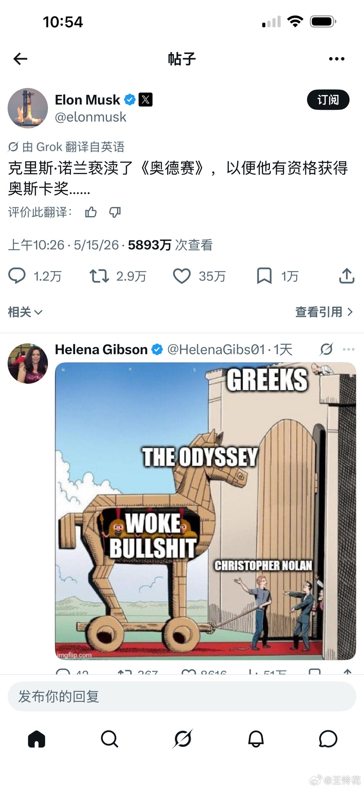

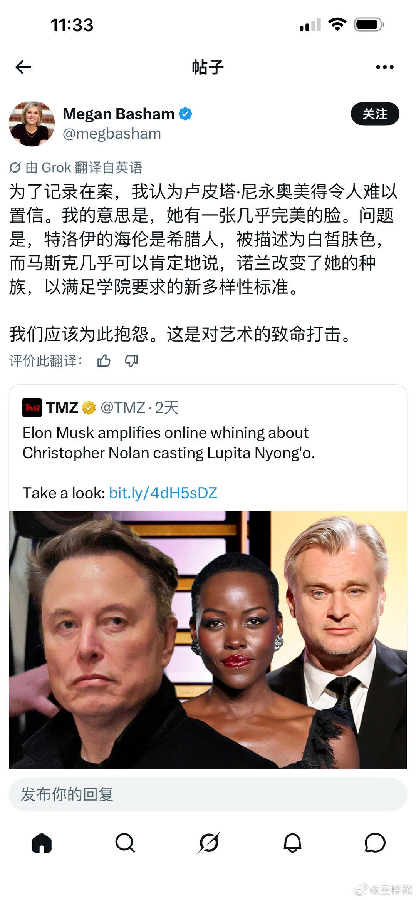

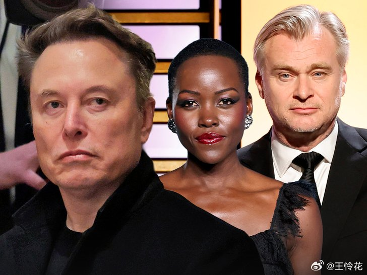

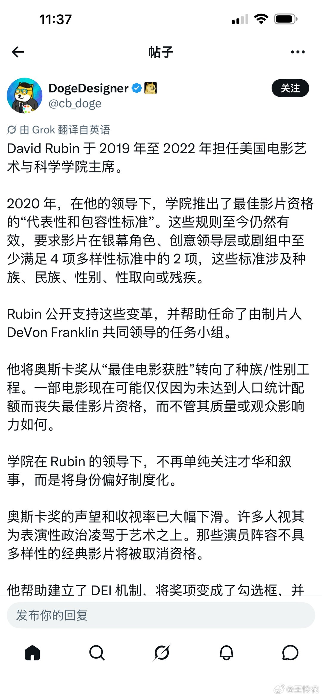

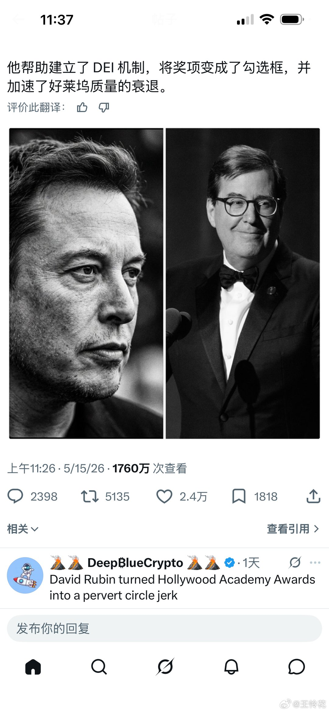

---

## 20

@李子暘Lee

发表于：2026-05-18 08:01

来源：微博

链接：https://m.weibo.cn/status/5299839375248776

领导说，要讲好中国故事。

一帮人就攒了个本子，对有司说：我们讲个监狱成功改造罪犯，罪犯洗心革面重新做人的故事吧。

有司一看，这故事好啊，你们讲吧，我们全力配合。

那帮人就讲了一个中国司法胡乱判案、中国社会迫害女性的“中国故事”。

外国人一看，这故事好啊，我们要的，就是这种中国故事。来人啊，拣个肉多的骨头，赏给他们。

这帮人吃到洋人赏的肉骨头，国内外众多慕洋犬羡慕不已，纷纷挑大指赞叹，真是巨大辉煌的成功啊 !

正经人一看，大怒，你们就是这么讲中国故事么？臭啥比，草泥马 !

现在有司很尴尬，不知道怎么应对，只好装傻，指望“时间治愈一切”。至于有司里是不是有人弹冠相庆幸灾乐祸，那就知不道了。

情况就是这么个情况。事情就是这么个事情。

-

---

## 21

@斯库里

发表于：2026-05-17 16:14

来源：微博

链接：https://m.weibo.cn/status/5299716965534671

\#监狱来的妈妈 本人出演\# 

定性的话先说在前面。

\#抵制电影监狱来的妈妈\# 

这没有什么二话。

问题在于抵制哪一点。

我今天为这部电影发了三条。

第一条说的是：

俗话说：“一个BUG是BUG，一堆BUG能work。”

这部电影就到了“一堆bug能work”的程度。

发了微博之后，跟群里的展开争论，吵了一个小时。

最后我承认。我在罗列问责优先级的时候，搞错了。

我错了，我反思。

为什么会错？

因为我肯定是以自己最熟悉的角度切入，而且对事情的全貌认识不足。

所以：

经过大家的教育，我深刻意识到。

问责优先级应该是：

1.审核部门渎职。

2.制片方掺私货。

3.宣发方做虚假宣传。

4.服刑人员做电影主演。

我原本认为的宣发方独走，现在看来，不是那么回事。

很可能是忠于制作方意愿的。

好。

接不接受我的道歉，诸位随意。

但我所坚持的，“主演问题是最不值得计较的”，在争论时已经达成共识。

依旧排在最后一位。

理由如下：

1.服刑人员参演电影。

咱们有先例。（见图一）

2.世界规矩如何，和中国该怎么干。

两码事。

可以参考，但不作为判断依据。

中国的监狱和外国的监狱，本来就性质不同。

而且，国外有“剥夺政治权利”这么一项附加刑吗？

我反正不知道，没了解过，谁懂可以说说。

3.至于“剥夺政治权力”这事儿吧。

（兴奋）要么说抬杠学能耐呢。

我学到一个知识。

根据刑法第五十八条。

“剥夺政治权利”作为附加刑，其计算刑期，是从主刑【执行完毕】时起算。

而有“被剥夺政治权利”附加刑的犯罪分子，在主刑执行时，自动视作被“剥夺政治权利”。

也就是说，当该犯罪分子刑满出狱或者被假释出狱，此时开始执行被剥夺政治权利的附加刑。

在此期间，“什么结社、出版……（在社交平台上发言）”都不许。

（见图二）

【我以前一直以为是单算的。比如判刑十五年，剥夺五年的话。在坐牢的后十年可以乱说乱动什么的】

——————————

好了，再说“服刑人员”在被“剥夺政治权利”时能不能参演电影。

1.单纯的演员，没有编剧、制片等附加身份时。根据《著作权法》，既不算制作方，也不算出版方。

此时就是工具人。

2.演员扮演自己，算不算“发表自己的言论”。

这就很微妙了。

假如TA扮演的自己，是自己真实事件的表达。那确实是“发表自己的言论”。

但要不是呢？

电影内容假如和案卷内容不一致。

那TA所“发表的言论”，其实是导演和编剧让她说的，不是她自己的言论。

假如这部电影的事儿闹上法院，很可能这就是辩方的抓手。

以此来为主演脱罪。

3.没完呢。

关于服刑人员是否可以参演电影，援引的法律法规，不是“剥夺政治权利”的《刑法》第五十四条。

而是1988年发布的《广播电影电视部，司法部关于禁止录制、出版正在服刑的罪犯表演的音像出版物的通知》

发布日期:1988-12-16 

生效日期:1988-12-16

目前状态（有效）来源：见图四

注意，按照此项通知，纪录片也不许。

因为禁止的范围是“音像制品”。

但是呢。

一来，假如违反此项通知，责任在狱方和制作方，不是服刑罪犯的责任。

二来，在电影上映时，该犯罪分子已经刑满出狱（2020年），且附加刑已经执行完毕。

综上所述，我才会说“主演的问题，【相对其他问题】而言，是最不值得计较”的。

当然可以针对演员个人，但针对时援引的法条，不是“剥夺政治权利”，而是前述的《通知》。

而我说的“一来……二来……”属于管窥之见，您可以根据您的认知（如果有比我更全面的认知）进行发难。

比如“院线电影是否属于音像出版物”、“录制行为本身是否违反《通知》的规定”或者“几十年前的通知是否有效”之类。

【更正醒目：前面所述的“一来”里面，“不是犯罪分子的责任”表述错误。

严谨的说法应为“不全是犯罪分子的责任”。

因为这是共同违法中的多方责任，而非"替代责任"。】

【举例：突然管教脑抽了，打开监狱门放我一个无期徒刑的罪犯出狱，而我真的大摇大摆走了，那不管怎么说，我也有一定责任吧。】

————————————

那说说值得计较的。

1.谁批准制作方进监狱取材——不是拍电影，拍电影有先例——而是拍出这样一部（根据现有的新闻和访谈记录判断）和真实案情大相径庭，但同时又自我标榜【源自真实案件】的电影。

无论是被制作方骗了（不少首页的大V都这么说），还是审查不严，罔顾法条。

这肯定都是第一责任方。

2.制作方掺私货。

就算TA掺了，审核没看出来。

这跟咱们普通人被诈骗，所以是受害方不能苛责，不可同日而语吧。

更何况，看反诈的纪实短片咱们也看了不少，是不是也有恨受害者：“那么多帽子叔叔都劝你，你不听，被骗了活该！”的声音呢？

3.宣发问题。

毕竟片子还没上映，目前的群情汹汹，能不能上映还未可知。

所以是否真的涉及虚假宣传【其实电影是“认罪”和“改过自新”主题，而非宣传说的“冤案”“家暴反杀”】，还未可知。

至于外网宣传是如何如何的。

阴阳合同都有，阴阳剧本，阴阳剪辑也不是完全不可能吧？

——这是尽最大努力把话“往好了说”的一个判断。

可能性太小。

但好歹是个可能嘛。

但要真是如此，制片方罪加一等，这个我想没人有异议吧。

以上，您觉得呢？ 

——————总结的分界线——————

当然，这是个问责顺序，不是免责声明。

责任高低的顺序，不代表“最不值得被关注的主演”没有责任。

话还是说清楚一点的好。

那么，与此同时也要明确，包括我和绝大多数发声抵制的网友，都是在问责而非定罪。

这件事非常奇怪，就是最开始说的，已经到了“bug多到能work”的地步。

那么作为普通民众，有权知道真相，或者得到一个合情合理合法的解释。

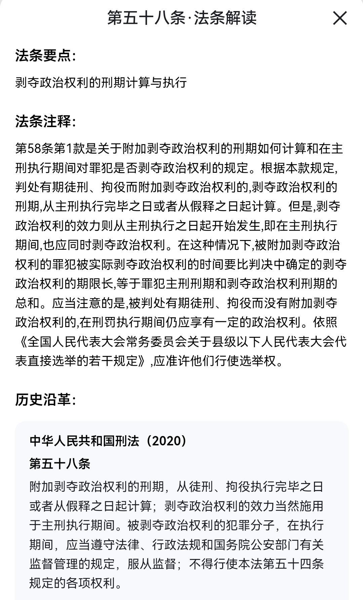

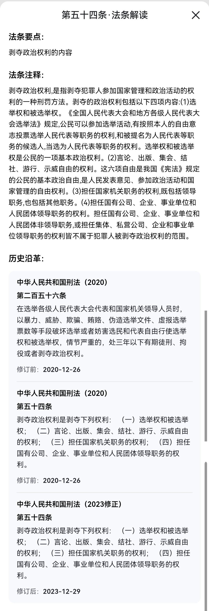

---

## 22

@电影票房

发表于：2026-05-17 06:03

来源：微博

链接：https://m.weibo.cn/status/5299563288068115

\#电影票房\#其实《监狱来的妈妈》这片，本来是会悄无声息的，因为单纯从内容来说，它被质疑的点，在片子里只是个背景交代，重点放在服刑与出狱后的生活上，讲这类人群出去后如何融入正常生活，某种程度上符合我们的宣传需求，比如之前上映的《向阳花》，这也是为啥这破片能放出来的原因，你不去了解的话，压根不会知道它其实是颠倒黑白改编的。

但它问题就出在，首先它就不应该找杀人犯来演，你把片子改成家暴反杀，已经是诋毁事实了，再找杀人犯演，这特么伦理都给击穿了，这时候这片子不管实际拍的啥，它就已经不是什么特殊人群融入正常生活了，而是在挑战社会底线。

不过即使如此，这玩意在国内其实也不会有什么水花，哪怕在国外拿了奖也一样，但有时候真的是人的名树的影，本来这玩意最终应该是悄无声息上映后最终又悄无声息下片，但我们的某花与某三联，把这玩意拉入到大众视野里了，嫩是靠着自己深厚的群众基础与口碑，成功让所有网友一秒钟都不用就站好了队，才有了现在不断发酵的深挖与讨论。

至于这玩意为啥会拍出来，解释起来其实也不复杂，我们的很多所谓精英人士，三观认知其实和大众是脱节的，具体可以参考某刑法教授，在他们看来这玩意非常符合它们的【艺术】认知与【人性】光辉，在它们的小世界里，这可是一个在废墟上实现了自我救赎的感人故事，至于实际情况是怎么样，真正的受害人什么的，那就别管了，反正它们脑子里的世界是这样。

而相关部门，事实上也没想过这片子会关联这些，在这些争议爆发出来前，很多人脑子里甚至没想过原来是这样，单纯觉得就是拍个特殊人群融入正常生活的【正面】例子，因为实际上片子里的内容还真的差不多就是这样，而根据目前的制度，各部门又只负责自己相关部分，而在各个部门看来，自己负责部门没有违规与问题，问题是这些组合在一起有大问题，某种程度上它投机取巧钻了空子。

要不是它宣传主打家暴反杀，又被某花某三联推出来，其实它最终结果就是一部无人在意的炮灰片，所以“感谢”某花与某三联，要不是它们自己助攻，其实大家还发现不了这些，也暴露不出这些问题。

这个世界真的就是个巨大的草台班子。

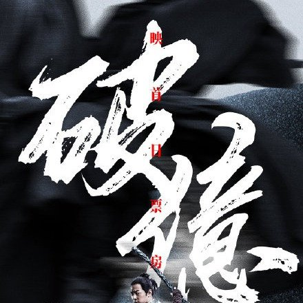

---

## 23

@江宇行舟

发表于：2026-05-16 10:02

来源：微博

链接：https://m.weibo.cn/status/5299260945861944

我们已经可以下一个非常严肃的结论，《监狱来的妈妈》是一部非常残忍的电影，大量设计都已严重突破公序良俗：

🚩首先是案件本身的残忍，根据法医检验，案犯赵晓红是用刀具，斜向右下刺入丈夫的胸腔，致使其主动脉根部破裂，引起了心包填塞，导致死亡（图2）。

案犯所用的刀具，是一把长19cm，刃长9.5cm的水果刀（图3），形制类似于图4，也是我们生活中常见的刀具，能够以这样的刀具避开胸骨刺破主动脉，当时案犯的杀意是非常明确的，这也是法院判决其为故意伤害罪的重要依据（图5）。

另外有一点特别重要，那就是案犯刺人以后，是主动拔刀的。这分别有案犯本人供述（图6）和现场目击证人指证可以确认（图7），稍有医学常识的人都知道，这将大大加速受害人的死亡。

并且根据图7，我们也可以知道，被害人受伤后第一时间喊了住在隔壁的合租室友，及时目击了现场并打了110与120，所以案犯的自首含金量不是没有可议之处的。

🚩这里还有个延伸花絮，导演说赵晓红在进看守所6个月后才得知丈夫的死讯（图8）。但图7说得很明确了，医生来检查的当场就说被刺的丈夫已经身亡，按出警、出医的速度，赵晓红当时大概率还在现场。即使退一万步，人先被带走，医生才来抢救，从案犯 2009 年 4 月 16 日被刑拘，到2009 年 11 月12日一审判决，前后也不到7个月，前期还有一段时间提起公诉与审理，导演的说法就是刻意编造悲情叙事。

此外，导演说她 “拒绝请律师，法院才指派援助律师”，裁定书里只写了 “法院指派了法律援助律师”，没有任何 “拒绝请律师” 的意思表述。

图8这短短几行，就出现多处捏造，导演的人品已经可想而知。

🚩更为残忍的就是一个家庭因此破碎，租户（图9）、男女双方亲属（图10）和案犯本人（图11）都表示，婚后夫妻二人感情很好/较好，只是和寻常夫妻一样会为琐事吵架，没有提到家暴情节。

家暴与否，可是将直接决定张晓红的责任与刑期！

这也是为什么我一直在说，导演的家暴说辞如今已经陷入了“一根筋两头堵”，要么自己承认全剧组在对全国、全世界的观众撒谎，要么让张晓红夫妻两家的亲属承认，自己在对公安和法庭撒谎。

而如今包括导演、剧组和营销号，都在炒作着丈夫的家暴，甚至追溯到新婚夜因一盆洗脚水引来了殴打（图12），都不知道是哪里听来的墙根。可是与赵晓红夫妻合租的室友明确证实，赵晓红平时不干家务（图9）。

🚩这是让我觉得尤其残忍的一点，一个平时包了家务的丈夫，却被塑造成了家暴犯。

这个丈夫的家务，一直干到了案发那天的晚上10点，甚至深夜11点多（图13），因为晚上10时许这个时间点是赵晓红的个人回忆，而警方接警的深夜11点45分是精确记录，剔除夫妻二人不会为时太长时间的打斗，以及同租室友随即而来的报警，被杀害的丈夫很可能到晚上11点多还在琢磨着怎么架床，他平时不做家务的妻子却已经在床上睡了三四个小时，并将在随后杀害他。

就是这样一个情节，在导演的口中变成了“三番两次让她重新下来支床”，如果有夫妻一块儿干家务的朋友看到这里都要出离愤怒（图14），不只是因为赵晓红自己供述、法院确认，丈夫仅仅是第二次要求妻子架床时候，就已经发生了扭打（图13），更重要的是，一个人掀起床板、整理床铺尚且会很艰难，更何况是搭床架床。

而且是否发生扭打、扭打的烈度如何，我们也可以打个问号，判决书明确写了案发地户型，以及同屋三户人家的居住格局（图15），根据同租室友的介绍，明确说了只听到争吵，自己还亲自去敲门干预（图7）。如果已经爆发很激烈的打架，很难想象租户会只听到一个争吵。

总之，这绵延十几年，从肉体凶杀再到名誉抹黑，都让我为本次案件的受害人、一个包揽大部分家务的丈夫，感到深深的悲哀，某些人对他实在过于残忍！

🚩但他还不是遭受最为残忍待遇的那一个，更为残忍的待遇，面向了他遗留在世上的母亲和孩子。

当时看预告片，看到不仅是案犯自己演自己，连年迈的婆婆、年幼的儿子都自己演自己时候，我就说不出的滋味。

老人白发人送黑发人，孩子1岁就没了爹，造成这一切的是孩子的母亲。这无论如何都是一出人伦惨剧。

结果在编排完家暴情节后，导演又强行要求预告片里都能看出来垂垂老矣的老妈妈，和眼神里写满抵触的青春期孩子，一起来拍了这部电影（图16），把他们经历过的伤疤随着剧情再经历一遍，演给全国乃至国外的观众看。

要知道，他可是在监狱里就接触了赵晓红，在案犯还在服刑时就筹拍了这部电影（图17），他就这么跟着赵晓红出狱后的足迹，对他们的生活一路跟踪，他要让老婆婆接受自己的儿子是个家暴犯，然后与儿媳妇“重归于好”。他要让孩子相信是自己的爸爸一直在欺负妈妈，接受妈妈回归家庭。

我合理怀疑导演就是用这套叙事，从监狱开始就重塑了赵晓红的家暴“记忆”，转而再去辐射没有同住的婆婆，以及还在摇篮的孩子，强行构建了他所想要的“合家欢”，为了这部电影。

如果这是事实，那将让人脊背发凉、血管倒流！

而就是这个导演，如今还在一面开喷得隔着屏幕都能感受到他的口水，一面隔着屏幕都能感受到他自我感动下那傲娇的心跳（图18）。

🚩法律和社会已经给赵晓红足够的温情，审判时候接受扭打一说，在自首环节直接予以承认（不考虑邻居已经进入案发现场和报警），在明知砍杀时的杀意以及主动拔刀的细节后，依然多次强调夫妻矛盾可从轻处罚。当地社区和民乐团也创造机会，给她回归社会。

我相信我们所有人，但凡在维持真相的基础上，也都希望看到一个真诚悔罪的母亲，回到自己的家庭与社会。

但是电影剧组利用谎言，对案犯及其家庭的强行粘合，将是对这已经破碎过一次的家庭，更为惨烈的二次伤害。

而对此还津津乐道，还经历了跨越监狱与社会的蓄谋已久，将是对法制、对社会秩序、对公序良俗最为残忍的伤害！

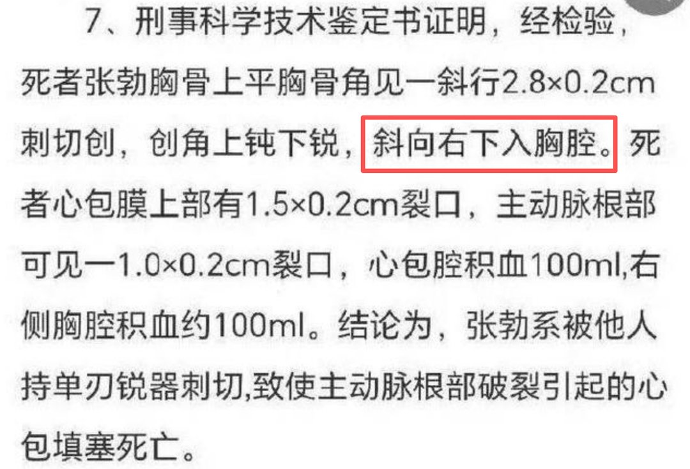

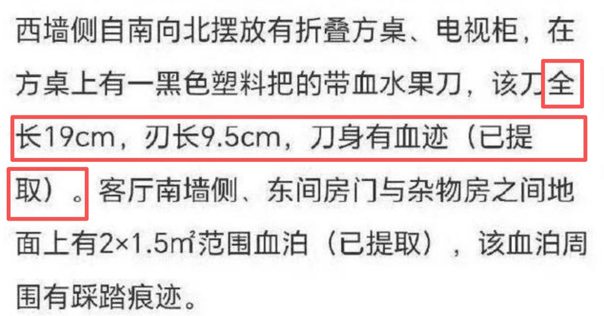

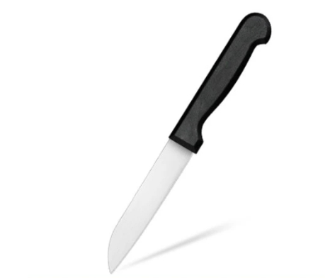

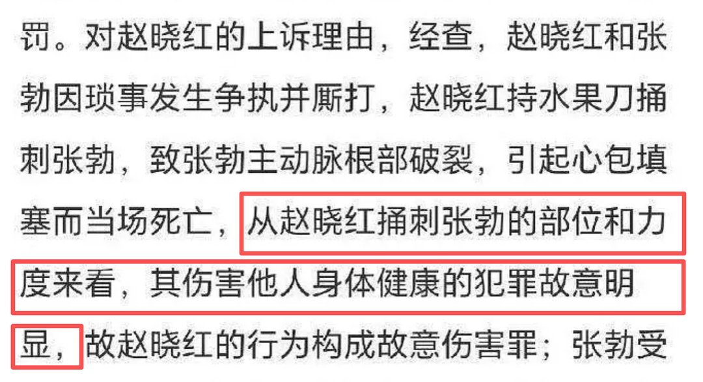

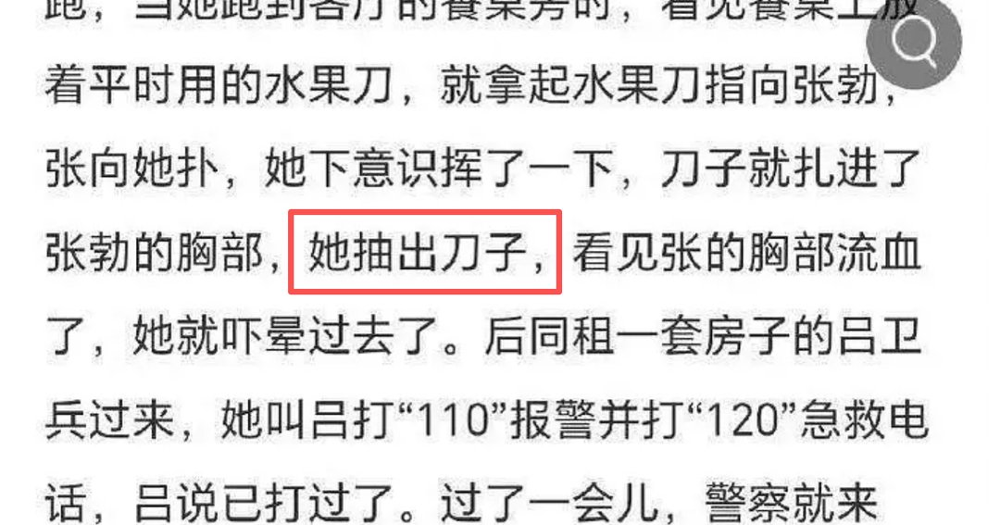

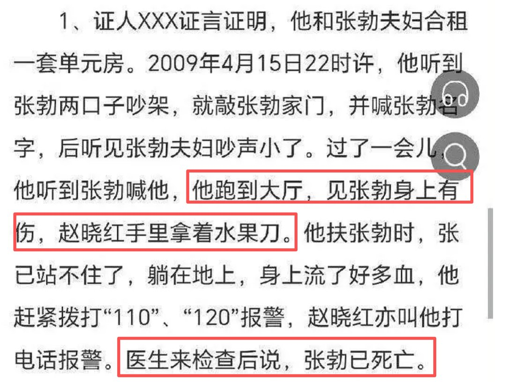

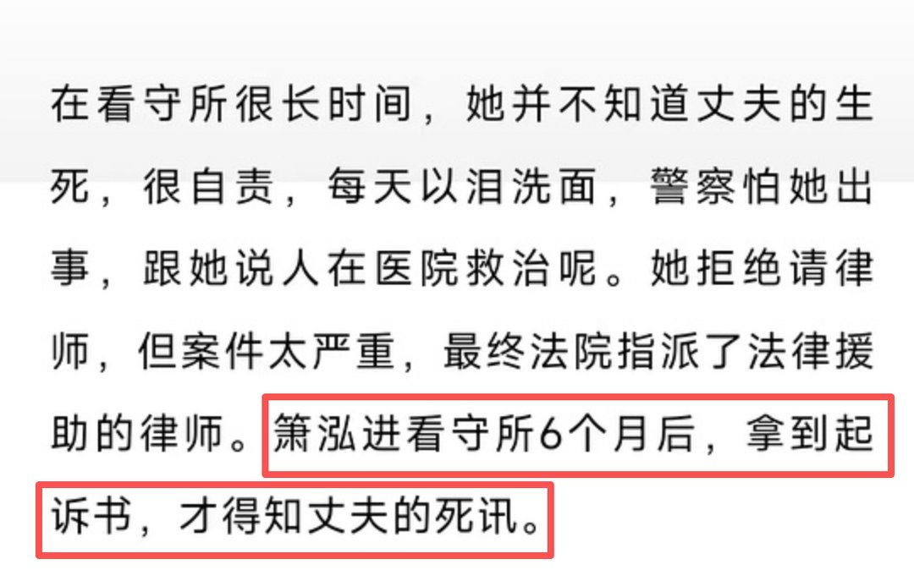

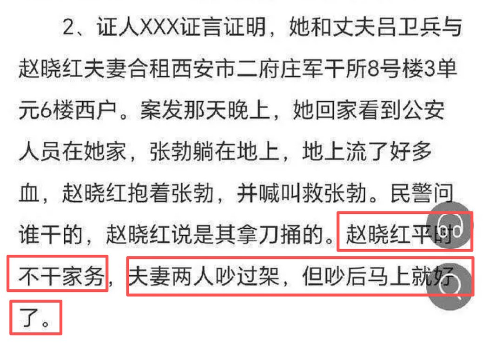

---

## 24

@专业戳轮胎熊律师

发表于：2026-05-17 06:22

来源：微博

链接：https://m.weibo.cn/status/5299568162112534

其实最近的那个电影也好

很多社会问题也好

性别矛盾也好

核心就是我之前这个案子，也有很多类似的案例，律师们一定都见过

：

人为了心安理得的拿点不该自己拿的东西，必须贬低/造谣/诬陷对面，什么屁话都能编出来

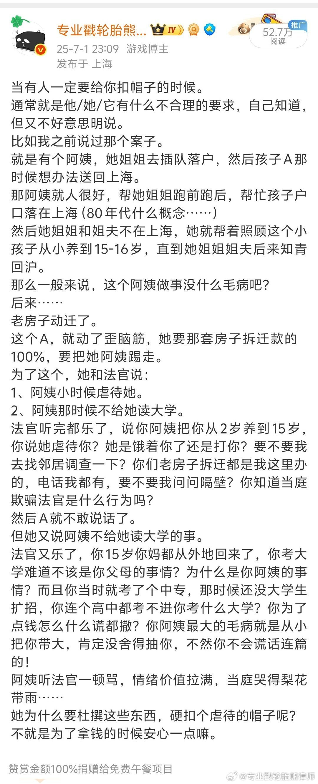

---

## 25

@2049年的世界

发表于：2026-05-17 09:04

来源：微博

链接：https://m.weibo.cn/status/5299608793909431

国内某些人对西方颁发的非竞技类、非自然科学类奖项的长期以来同样是非常沉迷的，社科圈子、文化圈子、艺术圈子对此基本上是趋之若鹜。

这类奖项往往缺乏客观可衡量的硬杠杠，因此主打一个随心所欲。

西方非常喜欢用这些东西，来奖赏第三世界的狗腿子们，从而花很少的钱实现远程养殖。

你来，我得到太君的认可了，太君认可我，我就能在自己的圈子里地位获得提升，因为太君点我了。

这套机制能起作用，离不开第三世界国家国民心理上的依附。太君给发了一个什么电影奖，那媒体甚至有些脑子不清楚的部门，立刻就扑上去，像狗见了骨头一样，开始当做自己的成绩。把自己的信仰建立在太君随心所欲的基础上，跟着人家的指挥棒呼哧呼哧跑。

我昨天写了篇女权出海的文章，其中就说了这个意思。中国这帮社科文化艺术圈子的人，其中有很多废物，永远面对白人是仰望的卑微的，他们的最大愿望，就是低头哈腰得到太君的一个奖赏“诺，做的不错”，然后回身面对十四亿中国人挺起腰来——我是太君钦点的人，在你们面前是有绝对权威的。我就是太君的代理人，也是开放的代言人，你信我，你就是开放进步，你不信我，那就是不信太君，那就是愚昧保守落后的基本盘。

虽然这些人是坏人，但坏人也要分有没有本事。你为什么不能让你的理论出海去折服西方呢？对不对，你拿大头，让美国法学家崇拜你，不行吗？

不敢，绝对不敢，那可是太君，我怎么能赢得了太君呢。还是站在太君背后PUA中国人比较省心省事。

“不敢赢”是中国这些文化艺术社科圈子里很多人的共同特点，他们习惯了“对太君输，对国人赢”，这个舒适圈太根深蒂固了，很难改。

但中国人不是做不到，我们的工业产品早就卖到了全世界，即使是初中毕业的人从修车学徒起步，刻苦钻研，也能击败外国同行。这是一步步钻研、斗争、实践来的，要和现实世界发生关系，从实践到理论，从理论到实践。

然而社科文化艺术这些人呢，它从一开始就在一个虚拟机里运行，太君构建的一个虚拟机，它们的理论和现实经常没有任何关系，也无法在现实环境下运行，否则就要报API NOT FOUND，但在虚拟机里运行的很好，这给了他们“知识分子”、“艺术家”的幻觉，高高在上不接地气，这种幻觉很可能会保持一辈子。

---

## 26

@ID_韩潮

发表于：2026-05-16 06:33

来源：微博

链接：https://m.weibo.cn/status/5299208492156420

这事越扒越脏…

“抱抱盲兔”号称三年前因病失明，一级视障，挂个相机拍自己一个人出门，两年攒到139.9万粉。

视频条条爆，独自坐飞机66万赞，上海辅警“我带你去”暖哭全网，重庆轮椅女孩帮她那条165万播放。路数都差不多，盲人一个人出门，碰到特温暖的陌生人，上热搜。

一两回叫运气，回回这样不邪门吗？

5月8日她发“来北京第一天盲杖就被撞飞”。盲道、电动车逆行、肇事者一句“什么盲道”扬长而去，够上头吧？北京交警当天回“依法处置”，新华社央视跟上“三个零容忍”，全网喊严惩。她自己慢悠悠回“视频是很久之前拍的，道歉收到了”，记者想采访她婉拒“没把这事放在心上”，然后偷偷下架原视频。

今天通报下来了，刘某26岁、江某某24岁，朝阳区摆拍，刑事强制措施。

本以为事情结束了，没曾想网友还扒出了更骚的操作…

那条火遍全网的“重庆轮椅女孩帮盲人女孩”视频，就是被通报的这位盲人与另一个轮椅女孩共创作品，轮椅女孩叫胡馨月，号还在，视频里俩人木栈道“偶遇”，配文“你做我的腿，我当你的眼”。

结合评论区这句“最后才知道这两人是同一家公司的。”真就是挺美的画面，配上了挺脏的生意。

现实中盲道被占有可能是真的，残障人士出门碰壁也可能真的，但她们把这些事当剧本素材，就太过了。

想象一下，下次真有视障朋友在盲道被撞发视频求助时，评论区会不会出现“别又是抱抱盲兔吧”这句话？

\#盲人需要被关注而非被消费\#\#盲人女孩盲道被撞系自导自演\#\#人民日报评摆拍盲道被撞事件\#

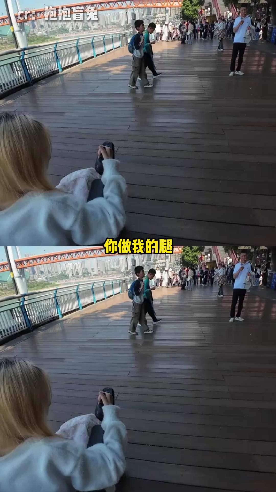

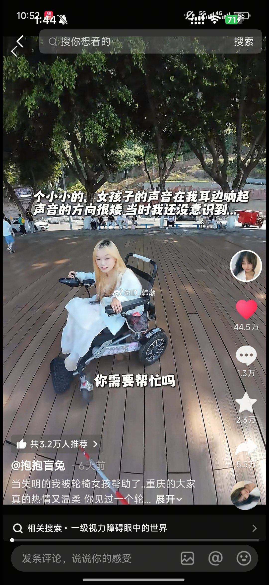

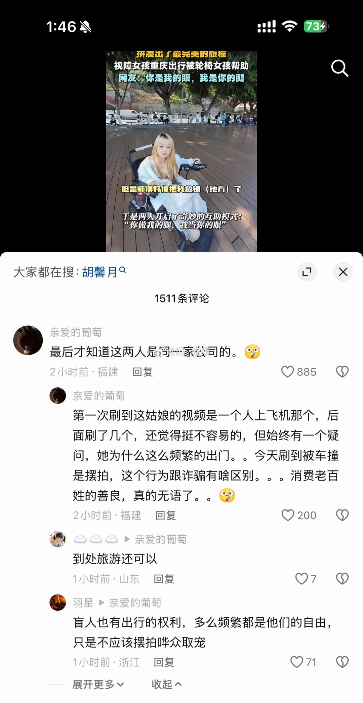

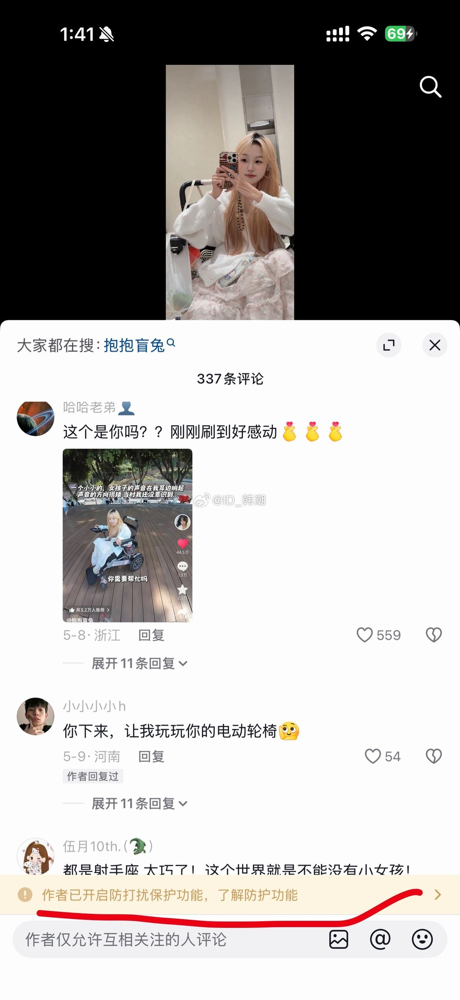

---

## 27

@理记

发表于：2026-05-17 06:24

来源：微博

链接：https://m.weibo.cn/status/5299568457549373

\#监狱来的妈妈\# 

表个态，我仅代表个人抵制电影“监狱来的妈妈”。

刑满释放兼演员赵箫泓（赵晓红），制片人和导演，我觉得他们最大的问题是颠覆了正常的人伦价值观。

判决书没有家暴字样，邻居亲属的证词也是两人虽偶有吵架但关系不错，判决书里也没有赵晓红的家暴受伤描述，没有法医鉴定。

以故意伤害罪判刑15年，这个刑期很重，但考虑到杀人其实刑期已经很轻了，且减刑了几次。

如果有明确的家暴情节，当初判刑就是十年以内，甚至按正当防卫无罪释放。法院最终的判决在故意杀人，故意伤害，过失杀人三项罪名中，恰当的选择了故意伤害（致死）。

赵晓红和导演制片，如果稍有良知，他们应该明白唯一的受害者是死者，他的生命直接被剥夺了。

两人当时的矛盾是纯粹的家庭琐事，几乎家家都有，完全不足以构成赵晓红直接去客厅拿刀杀人的理由。

刑满释放当然可以回归社会，也可以为社会做贡献，但是其制作的电影丝毫没有反思杀人的罪行，没有忏悔给受害者和家属造成的巨大伤害，反而把自己打造成受害者，成了耀眼的明星，这是违背了基本的人伦价值观，也违背了法庭判决的事实。

坚决抵制。

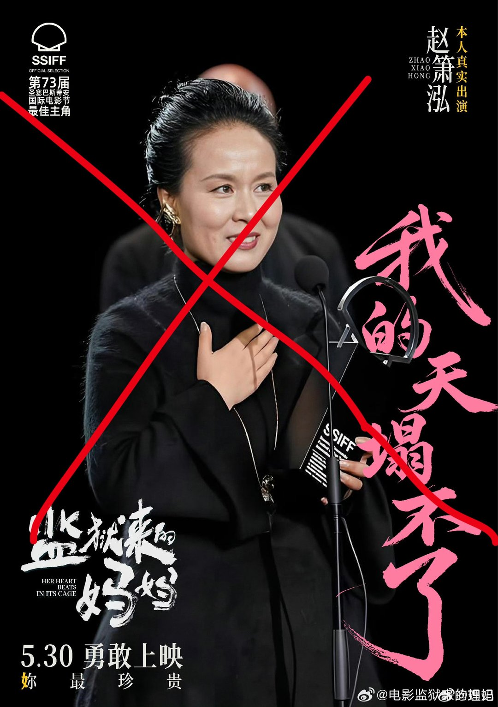

---

## 28

@伊利达雷之怒

发表于：2026-05-17 06:38

来源：微博

链接：https://m.weibo.cn/status/5299572127826398

看了一些小某书网友对《监狱来的妈妈》点映后的评价，发现这部电影大概率是挂羊头卖狗肉之作。

对有关部门，制片方的说法是，拍摄一个重刑犯服刑完毕后，重新融入社会的过程，这对监狱来说是政治正确的样板戏，类似胡歌主演的《南方车站的聚会》和张艺谋导演的《归来》，所以监狱绿灯通行。

对网络大众，制片方的宣传方向是，反家暴，抛开了判决书不谈，选择弹幕最多的打法。因为事实上这种题材的电影不算少，但真没人看，前面提到的题材类似的两部电影，要么导演大牌要么主演大牌，但票房很一般。所以制片方剑走偏锋，找来监狱服刑人员演自己，纯粹是个噱头。

对西方电影节，则迎合西方舆论对中国制度与社会的曲解和刻板印象，博取奖项。

而被宣传策略吸引进电影院的人呢，大家都知道是哪个群体。而这个群体发现电影并没有着墨于所谓的家暴反杀，甚至是一笔带过，重点放在了服刑后期以及服刑以后的“重生”，如何亲人重建亲情。标准的小众文艺片打法。导致这个群体对电影的评价也非常低。

最终结果就是，既惹怒了主流舆论，又被目标受众抵制，还把大开绿灯的一些人架在火上烤。

这部电影应该是没办法上院线了。

