# 2026-05-19

## 1

@李建秋的世界

发表于：2026-05-18 11:19

来源：微博

链接：https://m.weibo.cn/status/5300005167433107

关于对院线电影的批判，我已经进行了好几年了，只是前几年大家觉得有好片子看，所以不当回事，现在回头看看，当年金马奖那个事件不是一个简单的事件，不光是电影，你看看现在的游戏评奖，我就不说了。

不管是电影也好，游戏也好，总是有人有意识无意识的去塞各式各样的意识形态，我倒不反对塞意识形态，如果这个意识形态是你消费的，那你怎么塞无所谓。但是消费者并不买账，然后你搁那尬塞，那叫什么呢？

你要键政，搞意识形态，那就咱们来真的搞，你别搁那往文艺作品塞1234的。

所以一般电影我就推荐纯商业电影，大家就看个乐，不是吗？合家欢，我就喜欢这个。

还有前段时间其实有个事情，《杀戮尖塔2》名单里面出现了一个名字：“Anita Sarkeesian”，当年的玩家门事件的罪魁祸首，一开始中国玩家给这游戏打低分，老外玩家不理解，觉得是菜，后来爆出以后，国外玩家也开始疯狂打低分了。（当然中国玩家打低分不是因为这个，只能说……先见之明）

还有一个是评奖问题，现在什么电影评奖，游戏评奖，那关系复杂的我都不想说了。

最近还有《混音青春》的争议问题。

你如果只看媒体评分，你会觉得这个游戏碉堡了。

---

## 2

@数字生命卡兹克

发表于：2026-05-18 07:51

来源：微博

链接：https://m.weibo.cn/status/5299952873899351

上周做了场内部分享，关于我做AI这三年来总结的内容创作方法论。

 

上周，我站在公司的白板前面，边画边写。

跟整个团队聊了大概两个小时我自己做内容的一些方法论，以及在AI时代，我们如何做好内容的一些思考。

当然，这些思考都非常的个人，也都是我自己对于内容的一些想法，但是公司走到了这一步，特别是经纪团队，也需要一些内容方面的技巧或者方法论，来去服务我们签约的所有MCN的博主们。

所以，才有了上周内部的一场分享，虽然我这个白板确实画的非常的意识流。

内部分享完以后，想了想，这些东西藏着其实也没什么意义，反正都是我们自己踩了无数坑之后摸出来的，可能对这个行业也有点用，那不如，直接也给大家分享一下，我想，可能还是会有一些价值的。

如果我们的一些经验，确实对大家能有一些用，那也算促进了行业发展对吧，万一呢，对吧。那接下来，话不多数，就让我们开始吧。

我在白板上画了一个很简单的框架，虽然很意识流，但是其实，做内容，我觉得就三步。

获取信息，找角度，然后创作。

听起来像废话对吧。

但是我做内容做了三年多了，经历了从零到快100万粉，经历了无数篇爆文和无数篇扑街的稿子，最后沉淀下来的所有的流程，其实也就是这么朴素的三步。

有时候真正管用的东西其实就是这样。

就像冯唐写过的，成事的人回头看，关键动作往往少得可怜，但每一个都不能少。

不过在给大家详细的展开这三步之前，我想先说一个更底层的东西。

做内容的本质，讲到底就是在做一件事。就是，讲故事。你做公众号是在讲故事，你做短视频是在讲故事，你做小红书图文也是在讲故事。

影视飓风在讲故事，小狮日记在讲故事，郭帆在讲故事，马东在讲故事，甚至冯骥做黑神话悟空也是在讲故事，只不过他的故事是用游戏这个媒介来承载的。

在《人类简史》里面，有一个我特别喜欢的观点。

智人之所以能从所有人种里面胜出，不是因为我们更强壮，不是因为我们会用火，甚至不是因为我们有语言，因为尼安德特人也有语言，脑容量比我们还大。

智人真正独一无二的能力，是我们能讲出虚构的故事，并且让大量陌生人一起相信这个故事。

钱是一个故事，国家是一个故事，公司是一个故事，宗教是一个故事。

这些东西在物理世界里面根本不存在，它们全部是人类讲出来的虚构叙事。

但就是因为成千上万的陌生人可以同时相信同一个故事，人类才能够大规模协作，才能建造金字塔，才能发射火箭。

而承载故事的媒介，从岩壁到竹简到纸张到胶片到屏幕，变了无数次，但讲故事这个行为，我们从来没有变过。

我们如今人类的大脑，天生就是为故事而生的，就像你跟人说一组数据他记不住，但你跟他说一个故事，他可能能记一辈子。

所以如果你做内容，但你没有意识到做内容其实本质是讲故事，那可能确实难度会比较大一点。我们自己签约了很多的博主，还有行业里也有非常非常多的博主，很多时候，每天都在干的一件事，就是看到一个新模型发布了，涌上来写一篇，XX模型一更新，涌上来写一篇，黄仁勋在哪做了一个演讲，涌上来做一些翻译和解读。

很多时候，我其实并不太建议我们的博主这么做，因为这种形式，本质上叫转述，也就是把别人的东西翻译一遍搬过来。在我的理解里，这个东西它可能并不叫内容，我们一般称为，信息搬运。信息搬运跟讲故事之间的差距，大概就是你在菜市场买了一条鱼然后直接扔给别人，和你把这条鱼做成一道菜端上桌之间的差距。

原料一样，但一个是可能并没有特别大价值的中间态，而另一个，是可以直接面向消费者、大家愿意为之买单的成品。而这种成品，在我的理解里，它才能被称之为，内容。

这可能就是我自己对内容理解的基础，也是一切的基石，在统一了对内容的认知之后，接下来，才能去聊我在内部分享的，做内容的那三步：

获取信息，找角度，最后创作。

一步一步的给大家详细的分享一下。

一. 获取信息

获取信息，对于一个内容人来说当然非常的重要。这个信息不一定只特指热点和资讯，他也代表着你能获取的一切信息，比如说想法、idea、观点等等，真的不仅仅是热点，还有关于你的一切。

像获取AI行业的热点，我们当然有一些自己的工具和方法，比如我们做的AIHOT，能方便、快捷、及时的帮我们获取AI行业发生的大部分的事情。

但同时，这也是一个大坑。我在公司也一直内部反复跟大家强调一件事，如果你只看AI领域的信息，你发的也只是AI领域的资讯，你最后做出来的东西一定是干巴巴的，没有灵魂。

弗兰斯·约翰松写过一本书叫《美第奇效应》，说的是文艺复兴时期佛罗伦萨的美第奇家族，把画家、雕塑家、科学家、诗人、建筑师、金融家全部聚到一起，结果这帮完全不同领域的人碰撞出了人类历史上最辉煌的创造力爆发。

约翰松的观点是，真正的创新几乎从来不发生在一个领域的内部，它总是发生在不同领域的交叉点上。

做内容也是一样的。

你的信息来源越单一，你的表达就越像流水线上出来的东西，你看到一个AI新闻，你脑子里只有AI的知识框架，你能想到的角度、能用的比喻、能调动的情绪，全部被限制在这个框架里面。

但如果你同时懂喜剧的节奏、电影的叙事、建筑的空间感、历史的周期性，你面对同一条新闻的时候，你能调用的武器库就是别人的五倍十倍。

我以前做带设计团队的时候，也是经常这样跟我下面的设计这么说的，如果你是做UI的，你只看UI，那你完蛋了。

你得去看汽车设计、建筑设计，去光之教堂，感受那种安藤忠雄那种把光用到极致的空间，去拉电影的分镜，看人家怎么用画面讲故事。

你的视野如果越窄，那，做出来的东西就越没有灵魂。

这个时代的人才画像应该是T字型的，上面是广度，下面是垂直深度，你得在自己的领域扎得足够深，同时你的触角伸到足够多不相干的地方去才行，AI时代，这样的人反而会更吃香。

乔布斯当年辍学以后跑去旁听了一门书法课，学了衬线体和无衬线体的区别，这个看似完全无用的知识后来直接塑造了Mac的字体美学，间接影响了整个个人电脑行业的审美标准。

你永远不知道哪个领域的知识会在什么时候帮到你。

这就是获取信息，获取更加广域的信息。

但问题来了，要跨领域这个道理大家都懂，真正难的是怎么做。

我给大家的建议其实就是，你的信息摄入要像投资组合一样去管理，如果你每天看的东西90%都只是AI领域的，那你就是严重的信息偏科。

你得刻意地给自己配置一些完全不相干的信息源。

综艺、电影、纪录片等等，这些是最好的叙事教材。

你去看喜剧，去拆解脱口秀的结构，去看商业电影，是怎么在两个小时里面牢牢抓住观众的。

这些东西表面上跟你可能做AI领域的内容一点关系都没有，但它们教会你的关于节奏、悬念、情绪设计的技巧，会在你完全想不到的时刻，让你的内容，更上一层楼。

其次是历史和商业。

历史非常非常重要，读史可以明鉴，知古可以鉴今，历史会给你提供充足且有厚度的内容弹药库，而商业，则给你理解行业的框架。

比如你读过《光刻巨人》你就知道ASML是怎么从一个飞利浦的边缘部门变成全世界的咽喉的，你再看今天的AI芯片格局，你能看到别人看不到的结构性相似。

然后是日常生活的观察。这个听起来很虚，但其实是我们过去，做用户体验设计的时候，最重要的日常素材来源之一。

你去便利店买东西的时候可以注意一下货架是怎么摆的，你刷外卖的时候想一下为什么你总是先点开评分最高的那家而不是距离最近的，你跟人吵架的时候复盘一下对方是怎么用三句话就把你干到道心破碎的。

这些全部是做内容的养分，因为好内容的底层是对人性的理解，而人性，从来都不在论文里面，在那些具体的、琐碎的生活里。

所以，一定一定，要让自己变得多元化起来。

去获取那些，更多的、跨领域的信息。

二. 找角度

这个可能是三步里面最重要的一步。

我自己的感受是，如果一篇内容能爆，30%在获取信息的能力上，60%在找角度的能力上，最后10%才是创作本身。

这个比例可能有人不同意，但至少在我自己的经验里，角度决定了一篇内容的生死。

角度是什么，我觉得其实就是两个字。

反差。

或者用另一个更加形象的话语来描述，那就是八个字：

情理之中，预料之外。

这个也是做喜剧、做剧本、做各种反转的底层逻辑。

一个东西怎么变得有趣，就是你感觉它要这么走，结果它来了个大拐弯，但这个拐弯它又符合逻辑，你觉得我没有想到，但好像确实是这样。

俄国形式主义文学理论里面有一个概念叫陌生化，是什克洛夫斯基提出来的，他说艺术的目的不是让你认识一个新事物，而是让你对一个你已经熟悉的事物产生全新的感知。

你每天走的那条路你已经视而不见了，但一个好的摄影师能用一个你从来没想过的角度去拍这条路，让你突然觉得，卧槽，原来我每天走的是这样一条路。

做内容找角度，其实就是在做陌生化，你要让读者对一个他可能已经知道的信息，产生全新的理解。

有一个公众号领域的上古真神，我就不列名字了，他们的价值观我确实不喜欢，后来他们确实也被封掉了，但是他们找选题找角度的能力，在技术上，是我觉得行业的最顶端。

她分享过她们的选题流程，每天上午团队脑暴，12点之前要从热点里面想出50个选题，她说过一句话我印象特别深，大意是，发现新观点的过程不过是一个个抛弃旧观点的过程。你第一时间、第一直觉想到的观点一定不能写，因为所有人都能想到。

她举的例子是七夕。

关于七夕，大部分公众号会写什么，单身太久会得单身癌、去年七夕你在做什么、你能用自己的专业能力为你的另一半做什么，都是甜蜜的、正向的、温暖的。

但她们思考了很久很久以后，最后找到的选题是。

《七夕，我在民政局排队离婚》。

而且不是虚构的内容，是真实去参访后，写出的真实故事。

说实话，你光看这个标题你就想点进去，所有人都在写在一起多美好，她在写分开，同一个时间节点，她看到了所有人都不会想到的那一面。

这就是情理之中，预料之外。

这就是，陌生化。

我们自己做的DeepSeek那篇9块9的文章也是类似的逻辑，当时很多人都在讲信息差，都在从上往下俯视，说AI时代，很多的人不懂技术、不爱学习。

我们反过来，我们选择从下往上看，我们说很多人只是因为站在了信息更流动的地方而足够幸运，而那些被折叠在第一层的人，不是他们不想学，是整个世界被折成了三层，他们很多时候，连看到的机会都没有。

这个角度大家没见过，所以那篇也爆了。

找角度没有捷径，纯粹是你的品味和思考深度。

但有一个操作上的原则，就是当你拿到一个选题的时候，先不要急着动笔，先想一想，所有人都会从什么方向切，他们一定会讲什么，然后你就不要讲那个。

你去找那个所有人都不会想到的、但又合情合理的角度。

这个是最难的，也是最值钱的。

三. 创作

坦率的讲，创作在三步里面占的权重反而是最小的。

但这个最小的部分，能决定你的生死。

你可能信息拿到了，角度也找到了，但你就是讲不好这个故事。

就像很多电影，题材好，选题也不错，但就是让人坐不下去，这就是讲故事的节奏出了问题。

我觉得创作上面最重要的就两件事。

第一件事是节奏。

好的节奏像呼吸，有松有紧。

我们写文章也好，做视频也好，都讲究一个东西叫情绪地图，我之前做用户体验的时候，也研究过这个东西，只不过在我们的领域里，叫用户体验地图，大概就是这么个东西。

你的内容的安排，也都是有节奏的。

Kurt Vonnegut在他那个著名的演讲里面，在黑板上画过一个故事的形状，横轴是时间，纵轴是主角的处境好坏，他画了好几种经典的故事弧线，什么灰姑娘型、掉进洞里型，你会发现所有好故事的共同点就是，它一定是有起有伏的。

一篇好内容也一定是有波峰有波谷的，甚至有的时候情绪会掉到负面，然后再拉回来，一篇比较一般的内容，一般是纯平的，就是你看完了没有任何情绪起伏，像看了一篇说明书。

这么久以来，对我做内容启发最大的东西，其实也跟AI一毛钱关系都没有，让我学到最多的东西，它其实叫《一年一度喜剧大赛》，后面叫《喜人奇妙夜》，我相信很多人都看过，我每季每期都看，我真的是死忠粉。

比如里面那些sketch喜剧，一个10分钟的作品里面它要做三番，就是三个爆点不断地一步一步往上翻，这其实是一个很难的节奏，因为你给观众的情绪，需要一浪比一浪高，这个其实很难的。

第一番让你笑一下，第二番让你笑得更大声，第三番直接给你一个你完全没想到的东西，全场爆了。

就像经典的《父亲的葬礼》，一轮比一轮离谱。

这种其实就是内容的节奏，就像我们自己很多时候做一些局部case的放置和案例的排布，其实也经常会用类似sketch的升番技巧，这样大家在看内容的时候，才会不断的有新的惊喜和奇观。

每个创作者其实都可以慢慢摸索出自己的节奏模板，有的人适合慢热，有的人适合反转。

没有标准答案，但我觉得，你至少得意识到节奏这个东西的存在，然后刻意地去设计它。

从喜剧里面学升番和技巧，从电影里面学叙事弧线和段落安排，从小说里面学伏笔和回环。

这些我觉得真的很有用，我也永远推荐还不太了解节奏的朋友，去读一本书，它叫，《千面英雄》。

里面这套英雄之旅的节奏，我觉得对很多人都非常的有用，也非常的好入手。

也能让你产生，对于节奏的感觉。

第二件事，是正向价值观。

这个听起来像废话，但这个东西，是真的能决定你的生死存亡，也是我们做所有内容的底线。

你不以正向价值为底线去创作，最后的结局就是前面提到的那个公众号，内容能力再强，最后因为旗下一个账号虚构了一些内容，挑起社会对立，号直接没了，公司解散。

有几个具体的点。

1. 不懂的东西千万不要说。

很多大号翻车其实都是因为这个。比如你强行去碰你不懂的领域，或者为了被迫展示自己的能力，用开源软件做的东西说是自己做的，被人一扒就完了，在互联网上，就没有什么不透风的墙。

2. 不要碰敏感话题。

我们有个朋友，小红书被封了三次，每次都非要聊一些很敏感的话题，哥们挺有表达欲的，但是有些时候，这种表达欲就是在给自己挖坑。

3. 弱者思维。

老子在两千多年前就说过，天下莫柔弱于水，而攻坚强者莫之能胜。

在之前互联网没有那么发达的时候，大家慕强，你秀什么大家都鼓掌。

但现在，大家该见过的都见过了，你再秀再装逼，很多时候那就不是被崇拜了，是被嫉妒、被反感、被骂。

保持谦逊，承认自己在广义的社会之下，是个弱者，你并没有那么牛逼，你只是爱分享了一点，那你反而会更加真诚、更加可信一点。

大的方法论就是这三步。

四. 数据

最后，再给大家分享一下，我们自己内部的一些数据运营的指标。

比较偏公众号，因为这个我们还是有点发言权的，其他的平台我们自己做的也不是特别好，像小红书也才马上才摸到10万粉，这些平台，等我们有后续的经验，可以再单独来给大家分享一下。

公众号上，首先有一个很重要的指标，也是我们自己最关心的。

1. 常读用户数。

这个是微信公众号里面我认为最核心的数据，但很多人不知道这个东西。

你在用户分析里面能看到它，代表的是真正活跃的、会经常看你内容的粉丝，你的总粉丝量跟这个数字之间的差距可能会大到让你怀疑人生，很多号的常读用户可能只有总粉丝的一个零头。

我们自己的常读用户比例大概在接近30%左右，这个在公众号行业里，我觉得算是还不错的数据了，大家可以参考一下，当然这个前提是你至少得有5万以上的粉丝，样本量太小的话这个数据没有统计意义。

2. 赞阅比。

可以简单的理解为，平均1万阅读有多少的点赞。对于我们自己来说，2.5%是硬性指标，也就是1万阅读250个点赞，能达到，说明内容还不错。如果只有1%（纯文字除外，仅限常温），就是纯垃圾，至少在我们的标准里，最差最差，也得做到2%的赞阅比。

3. 转阅比。

我们一般单篇内容，其实最看重这个，我们的标准是8%以上，1万阅读800个转发。

因为一篇好内容的核心标志，就是有人愿意主动分享出去，底线是5%。

4. 完读率。

我们的文章经常4、5千字，确实太长了，就像这篇，写到这已经6000字了，正常人看不完的，但我们还能平均都维持在30%左右。对于写2000字左右的内容来说，我觉得完读率至少得40%以上。

这四个数据，是我每个月都会盯着看的，它们会比阅读量本身更能告诉你，你的内容到底好不好。以上，差不多就是这些了。

写在最后

坦诚的讲，跟很多的大佬比，我确实还是一个在内容领域上的小学生。我也还在不断的学习再学习中。但我觉得，这些东西对大家来说，可能也会有一些价值，如果能帮到一些朋友，我确实就很开心了，我自己，确实也已经毫无保留了。

不成熟，不完美，很多地方我们自己也还在踩坑，我们会追热点追慢了焦虑得睡不着，也会因为一篇稿子憋了四五千字最后数据很差而怀疑人生，也会遇到那种信息、角度、节奏我感觉全对了，但就是没人转发的时刻。

说到底，做内容是一个长期的事，不断的练习，不断的重复。

它从来，没有什么一招鲜的东西。

Kurt Vonnegut画完那些故事弧线之后，他说了一句话，大意是：最好的故事形状不是某一种特定的曲线，是一种，让读者在最后合上书以后，觉得这个世界跟他翻开书之前不太一样了的感觉。

做内容，大概也是这样吧。你做了一篇东西出来，如果看完的人觉得世界跟看之前稍微有那么一丁点不一样了。

那我觉得，这就是我们这些做内容的。

最大的成就感的来源。

哦对了，我们还在疯狂招人中，不管是我们内容团队，还是商务团队，还是MCN的经纪团队等等，缺人，我们真的缺人，缺爆了。

也欢迎去我们招聘官网看一下，欢迎投递：

网页链接

希望我们也能一起，做一些有趣的事。

同时。也希望我们。

永远对世界，保持好奇。

\#how i ai\#AI

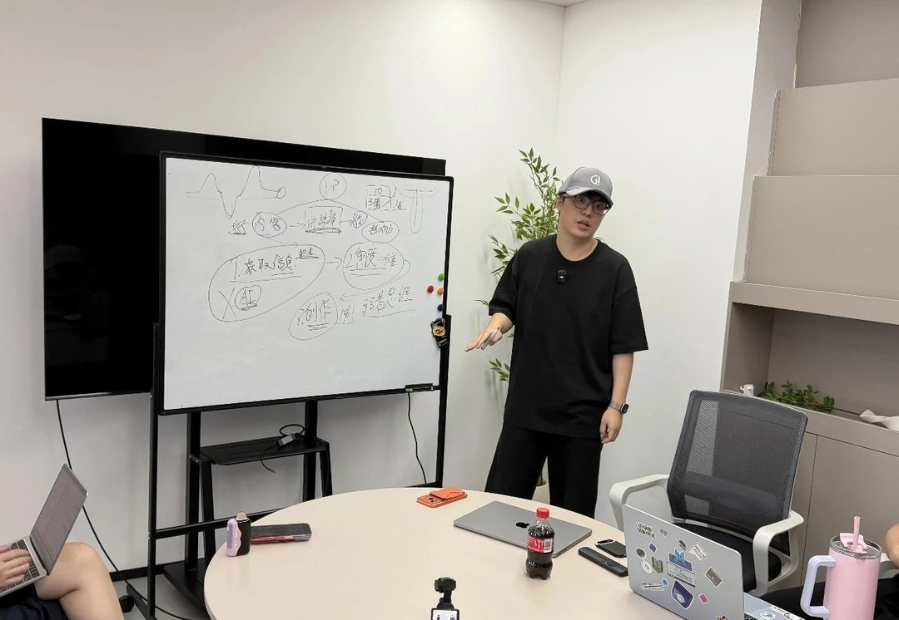

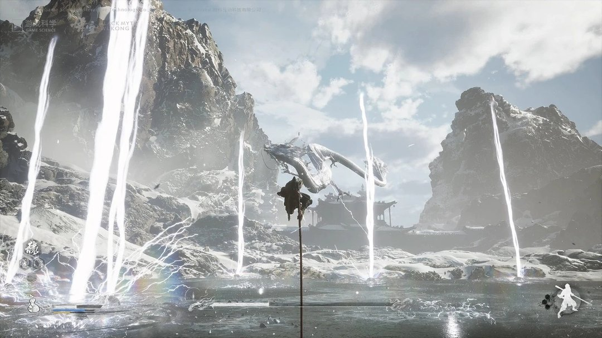

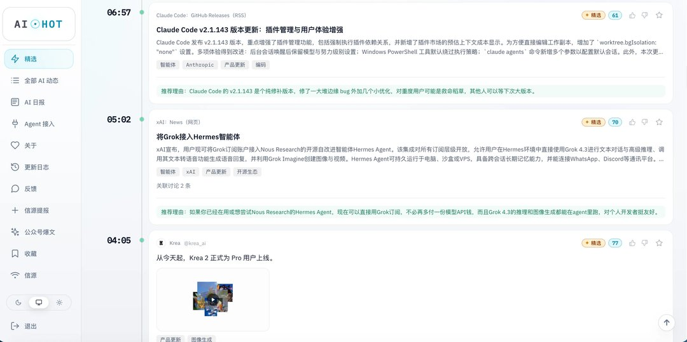

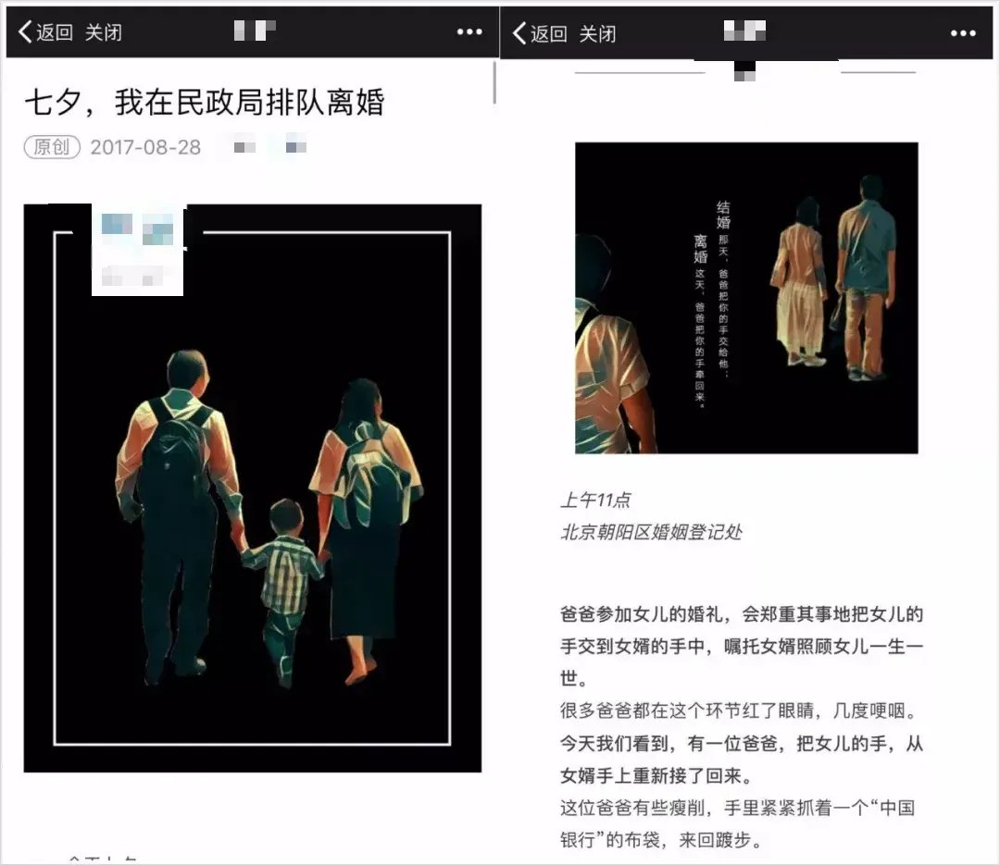

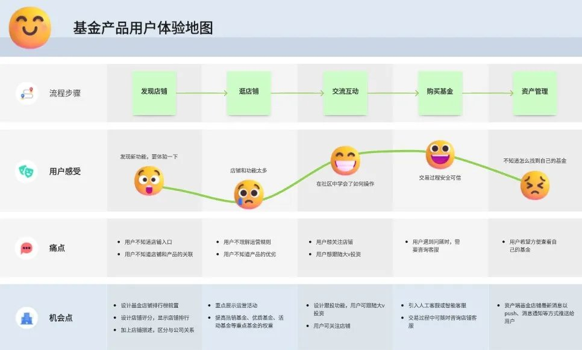

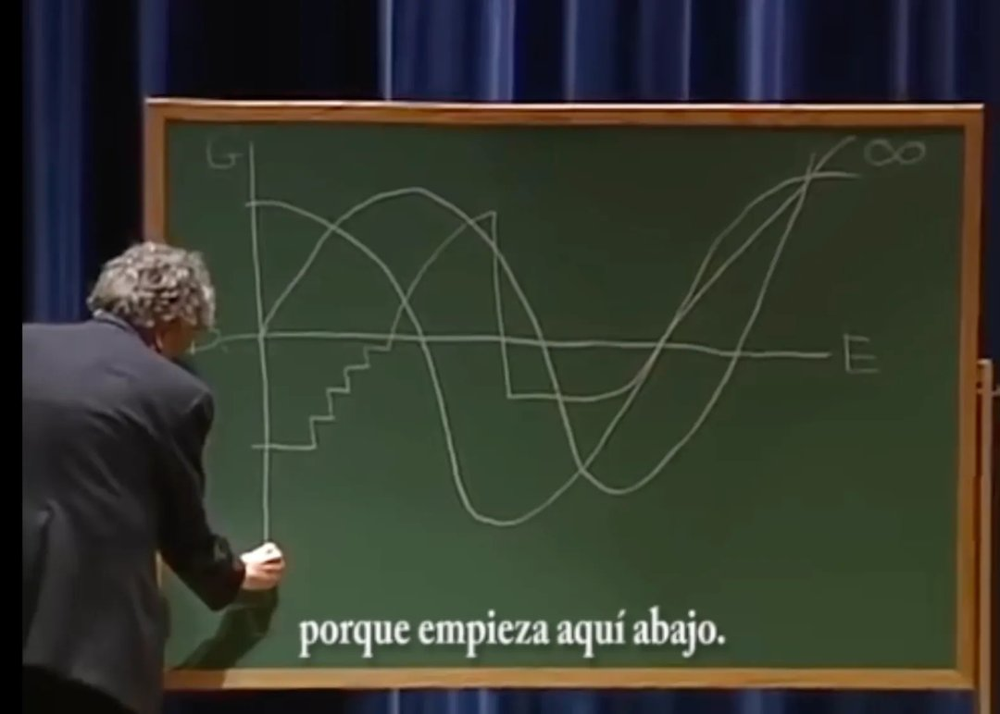

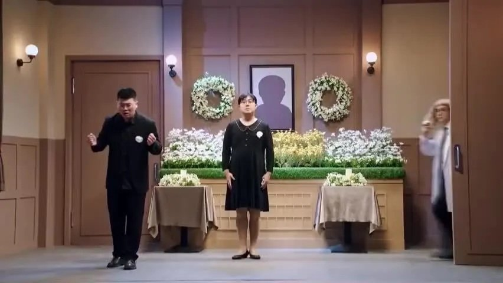

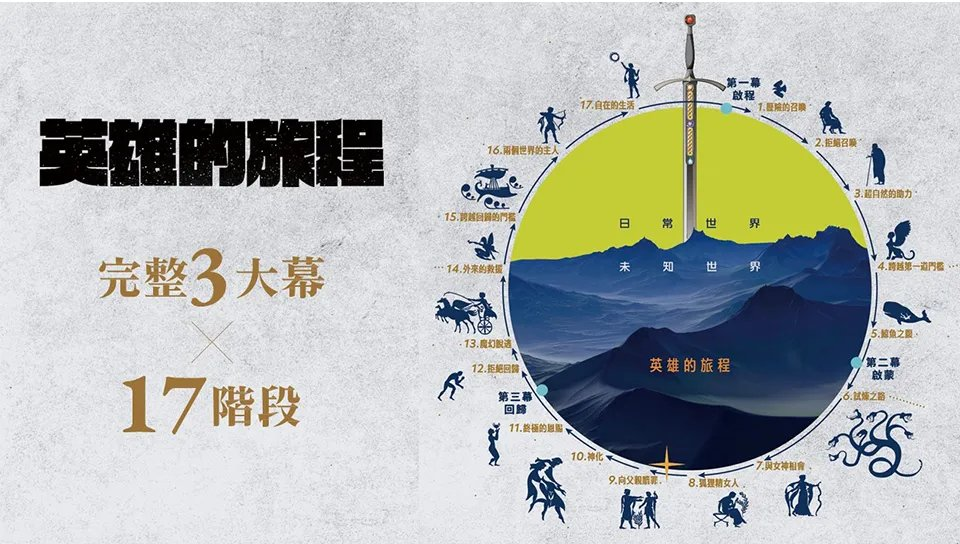

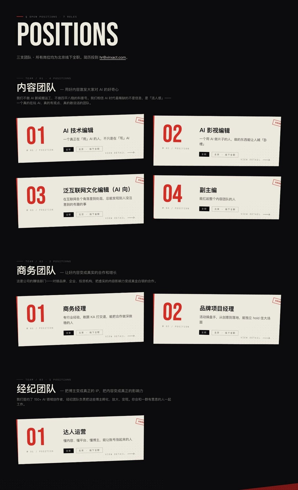

---

## 3

@子夜梦廊

发表于：2026-05-16 10:44

来源：微博

链接：https://m.weibo.cn/status/5299271550371086

上学时就听闻先生的名号，也学过他的文章，对他的结局也略有耳闻，没想到竟如此悲壮。。。

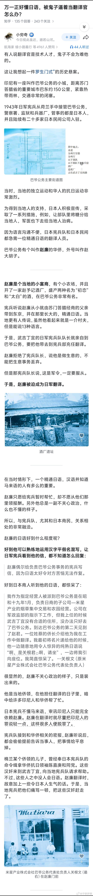

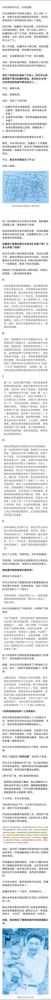

---

## 4

@纯洁善良潘帕斯

发表于：2026-05-16 03:30

来源：微博

链接：https://m.weibo.cn/status/5299162398589676

1968年，美国动物学家约翰·卡尔霍恩做了一个实验：给一批小鼠建造了一个完美的乌托邦。无限的食物，充足的水源，没有天敌，没有疾病，温度恒定。这是小鼠版本的“富足时代”。最初几年，种群爆炸式增长，一切都很好。然后，奇怪的事情开始发生了。

小鼠开始停止繁殖。雄性变得冷漠，不再争斗也不再保护族群。雌性拒绝养育幼崽。种群开始自发收缩，最终走向灭绝。不是因为缺少什么，而是因为没有什么需要它们去做。卡尔霍恩由此得出了一个结论：当一个物种失去了挑战和目的，就算生存条件完美，它也会走向消亡。

因此，戴曼迪斯说，当人类进入“富足时代”，我们需要一个比自身生存更大的目标。不是那种“我想赚更多钱”或者“我想过更好的生活”的目标，而是一个真正让你觉得，这件事如果我不做会是一种遗憾的目标。

---

## 5

@信号与噪声001

发表于：2026-05-15 14:58

来源：微博

链接：https://m.weibo.cn/status/5298973097071863

最近很多老外翻出了一个旧推文，2023年初，大空头 Michael Burry 发了一条只有一个词的帖子：Sell.

意思很简单，卖掉股票，离开市场。

可后来的结果很打脸。标普500不但没有崩，反而一路上涨，至今已上涨90%，那条帖子后来也被他删掉了。

这件事最有意思的地方，不在于他错了一次。再聪明的人，也会判断错市场。

真正值得警醒的是，市场的无常、随机和不可预测，远远超过很多聪明人、甚至很多顶级投资人的认知边界。

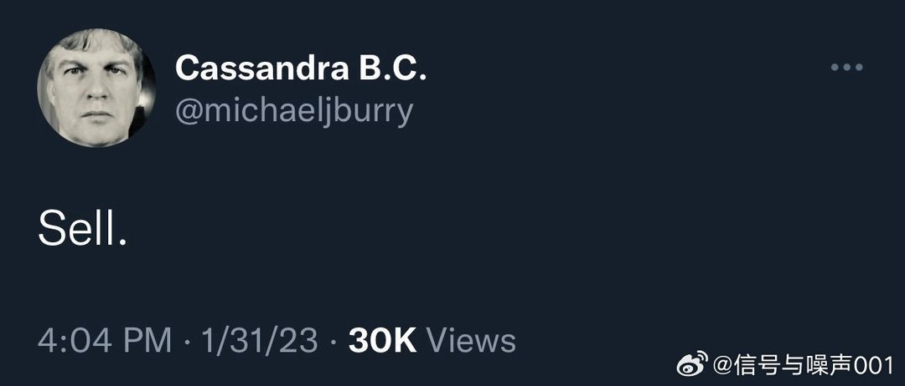

---

## 6

@通讯打工人

发表于：2026-05-15 14:25

来源：微博

链接：https://m.weibo.cn/status/5298964938366968

$*ST闻泰(SH600745)$ 张学政【原闻泰科技创始人】曾因侵犯中兴商业秘密案（2025）被判1年6个月。案号：〔2005〕深南法刑初字第468号（深圳南山区法院）

当事人：

- 被告人：张学政，1975年生，广东梅州人；1998–2001年任职中兴手机事业部，后任永盛科技总经理 （现闻泰科技实控人）

- 被害单位：中兴通讯 。

一、案情背景。2002年底，张学政在上海设立永盛科技上海研究所，招揽7名中兴离职员工（含蔡某某），集体带走中兴PHS‑A268小灵通手机项目技术资料 。

- 核心秘密：PHS‑A268人机界面软件源代码、硬件设计图、测试方案等，属中兴核心技术秘密，已签保密协议并支付保密费 。

二、犯罪行为

1. 窃取：2002年11月，蔡某某离职时拷贝A268项目全部源代码与设计文档，交予永盛科技 。

2. 组织侵权：张学政主导永盛科技直接使用中兴源代码研发同类小灵通，快速推出竞品抢占市场 。

3. 损失认定：中兴因市场被抢占、研发投入流失，直接损失约430万元（达“重大损失”标准） 。

三、审理与判决（2005年）

- 罪名：侵犯商业秘密罪（《刑法》第219条） 。

- 判决：张学政：有期徒刑1年6个月，并处罚金。

四、后续关联

- 2006年，张学政出狱后创立闻泰通讯（闻泰科技前身），后成A股上市公司实控人 。

- 2023年7月，闻泰科技实控人张学政因涉嫌信披违法被证监会立案 。2024年8月，证监会认定：2017–2019年，张学政及控股股东闻天下与傅丽娜构成一致行动人却长期隐瞒，致三年年报重大遗漏 。处罚：张学政、闻天下、傅丽娜各罚款500万元；张学政另作为责任人加罚300万元，合计被罚800万元 。2025年3月，上交所对其公开谴责，另涉违规减持、未履行要约收购义务等违规 。

- 2025年10月，荷兰法院暂停其安世半导体董事职务，事件引发市场对其历史争议的关注：张学政通过私人公司鼎泰匠芯，与控股上市公司闻泰科技——安世签预付款协议，提前付款、放大订单，安世实际合理需求：仅7000–8000万美元，超额约1.2亿美元。与鼎泰匠芯关联研发等无偿转移安世核心晶圆技术与工艺，掏空上市公司资源。

---

## 7

@李建秋的世界

发表于：2026-05-15 12:29

来源：微博

链接：https://m.weibo.cn/status/5298935670247732

大略讲一下田中角荣访华之前的事吧。

当时尼克松当政，美国国内对于日本对美巨大顺差非常有意见，尼克松施压日本，当时日本有钱，佐藤承诺对企业界补贴，日本后来和美国签订了三年内限制纺织品出口。

当时的日本外交基本上百分之百追随美国政策，政治上不承认新中国，而且极力吧新中国排斥在联合国之外，美国官方对日本保证：“在对华政策发生任何改变前，绝对会先与日本进行充分协商”。

1971年7月15日，尼克松发表讲话，说基辛格已经秘密访华，而且自己也即将访华，而在讲话发表前仅仅3分钟，美国驻日大使才给佐藤荣作打去电话，据当时佐藤首相的秘书官回忆，佐藤听到消息后脸色煞白，甚至一反常态地在办公室里破口大骂

佐藤束手无策，当时的佐藤，安信捷，福田纠夫等人和KMT有很深的联系，他们就希望找到既不隔断和台湾关系，又要和中国大陆建交的办法，所以在1971年秋的联合国大会，日本和美国共同提出，恢复中国席位同时驱逐台湾决意必须得到大会三分之二成员国同意的提案。

搞这个提案的时候，正值美国参议院审议冲绳回归协定，日本当时的表态，主要是佐藤内阁希望同时维持对中国大陆和台湾关系的态度，后来大家也都知道，日美共同提案被否决。实际上早在提案之前，自民党内部对这个提案就极力反对，外加又失败告终，佐藤内阁大受打击，自民党干事长保利茂曾委托访华的东京都知事美浓部亮吉捎信，探讨通过民间人士进行谈判的是否可行，但是当时中国对日本企图军事大国化和对台关系非常警惕，尤其是对佐藤内阁的态度反应冷淡。

10月，基辛格再次访华，并且发表中美上海公报，佐藤内阁终于被逼到死角。

尼克松其实当时的外交政策很矛盾，由于美国当时因为越南战争已经被折腾的不行了，尼克松认为必须调整对外政策，减少美国介入，要求盟国分担责任，另外一方面，又尝试在可能的范围内和对手改善关系，把冲绳管辖权交给日本，实际上就是希望日本肩负起更大的国际责任，问题在于：要求盟国分担责任与中美和解，在日本看来是矛盾的，佐藤内阁完全不明所以。

尼克松要求日本扩大分担范围和内容，但是又没有明确的告诉佐藤内阁到底承担哪些国际责任，长期对美国外交追随的佐藤完全迷惑了，而且尼克松还老干一些在日本人看来完全不可思议的事情：一方面，美国国防部长莱尔德访日的时候，暗示日本可以拥有核武器，但是与此同时，尼克松访华的时候又对中国强调美国不支持日本军事扩张。

佐藤外交彻底迷失了，政治影响力急剧下降，和安倍一样，佐藤是日本首相里面少有的任期特别长的首相，仅次于安倍，佐藤中意的后继人福田没有继承政权，万般无奈，佐藤认可了田中角荣

田中角荣实际上在日本政坛并不以外交著称，而是彻头彻尾的内政人，田中能战胜福田，和他积极改善对华关系的姿态非常有关，大平正芳原先就热衷于改善对华关系，打平的宏池会支持了田中，另外三木武夫和中曾根关系也不错，田中后来和三木与中曾根反复接触，让这两个人也接受了对华积极外交。

田中在首次记者招待会上，就把改造日本列岛和恢复中日关系作为最重要的课题，72年7月，中国邀请公明党竹入义胜访华，提出了声明草案，田中得到声明草案后受到鼓舞，在8月份确定了自民党路线，且在夏威夷的日美首脑会议上对尼克松进行报告，

1972年9月，距离尼克松访华仅过去半年，田中角荣访华，当月中日建交。

---

## 8

@南宫远2022

发表于：2026-05-14 22:29

来源：微博

链接：https://m.weibo.cn/status/5298724182164301

其实我也很奇怪，为什么古人功成名就退休之后要回老家，现在的人却不回了？

看看这篇文章。

顶级家族的老巢，没有在市中心的，全世界范围内都是如此。明白了原因，你就会知道，在所有关于留在大城市的理由中，最搞笑的就是“为了孩子”。

 

你的孩子不会因为留在大城市感谢你，至于孙子，你不会有孙子的。

 

很多人根本没搞明白城市是什么。

 

城市是一种发明，不是自然形成的人类居住区。尤其是顶级大都市，它是功能性的，而不是居住型的，自古以来都是如此。

 

可以说除了京城的皇室家族，没有家族能在这样的地方稳定繁衍。

 

古时候，一户人家可以在乡下，慢慢繁衍出一个村落，比如张家村，王家庄。而在城市里绝对不会形成张家街道，李家街道。

 

因为城市的设计初衷，是为了交易和生产，就是要打破血缘纽带，把宗族、家庭拆解，把一个个活生生的人剥离成孤立的“劳动力节点”和“消费节点”，然后塞进各个产业的齿轮里去运转。

 

你在乡下，你是张家老三，你背后是一个宗族；但在城市里，你只是某公司工位上的David或者Lily，是一个随时可以被替换的个体，你的安全感是不存在的。

 

你以为在大城市可以让孩子开拓眼界，享受优质教育，但最后竞争的不过是，在这个高度分工的系统里，谋得一个稍微舒服一点的齿轮位置。

 

所以你的孩子不会感谢你。

 

为什么我说你不会有孙子？因为大都市的运转逻辑，本质上是“反繁衍”的。

 

人和动物没啥区别，要产生繁衍欲望，最基本的就是“领地感”。可是在大城市里，你的领地在哪里？你的“家”，是花掉两代人积蓄买来的、被上下左右邻居的噪音包裹着的，物业一个通知就能干扰你的生活。

 

你连养一只狗都要担心够不够面积，邻居会不会投诉，更何况养一个孩子？在这种环境下，人的深层动物脑会持续释放压力信号，它会判定这里是“战区”，不是“巢穴”。

 

不要低估这种常年累月的心理暗示，这对繁衍的影响是决定性的。所以我有一个预测，就是未来城市的模式，一定发展出类似美国那种，在市区工作，下班后回到郊区的独栋住宅生活。

 

否则以城市这种“自我阉割”般的吞噬人口的速度，终究无法维持自身存在。

 

现在，你明白顶级家族为什么不住在市中心了吗？因为在城市，家族根本就繁衍不下去，再有钱的人，在这样的空间，都会倾向于节育。

 

所以，世界上最顶级的家族，他们的老巢，都是以“庄园”的形式存在。他们要的是泥土、森林、湖泊，是家族可以共同生活，而不被打扰的私密空间。

 

他们把“功能”和“居住”严格剥离开来：去市中心的CBD开会、发号施令，然后迅速撤离，回到真正符合人类生物本性的庄园里去享受生活，去繁衍后代。

 

只有被洗脑的普通人，才会把住在市中心的钢筋水泥盒子里，当成身份的象征。

 

当然，我不是说你非要“回村种地”，我的意思是“一代人只管一代人的事”，你可以选择你喜欢的地方，但千万不要说为了孩子。

---

## 9

@笑看红绿

发表于：2026-05-15 01:20

来源：微博

链接：https://m.weibo.cn/status/5298767382448147

物业公司工作人员（一个小领导）打电话来说，我在投诉中直接提到具体位置的那个猫箱已经搬走了，那些“爱心人士”，尤其是女的，很极端，像邪教或神经病似的，还骂物业工作人员，各种威胁她们，并且这些“爱心人士”有微信群，是有组织的，可以为了给流浪猫治病一只就花一两万元以上。所以把小区的猫箱全清理掉有困难，让我给她点时间，争取到月底清理掉。

在交谈中得知，原来那些猫箱都是那些“爱心人士”租的，并不是买的。

挣这个钱的公司，良心大大滴坏了。

在交谈中还得知，一二期（一二期和我们三期小区不相通，是独立的）也有多位业主投诉猫箱这事，并且还闹到了业委会和街道办，但是，一二期猫箱还是没有撤掉，这也反映出那些“爱心人士”有多猖狂。

我昨晚散步看了下，我在投诉中直接提到具体位置的那个猫箱确实没有了，另一个我知道具体位置的猫箱还在，别的地方可能还有，要问一下清洁工。

猫箱这事，应该不是一个个别的问题，而是一个全国大城市普遍存在的问题，呼吁政府要行动起来，让城管部门、环境保护部门或者住建部门统一执法，打击这种破坏环境、破坏生态平衡、违反物业管理条例的行为。

深圳猫箱

---

## 10

@汪海林

发表于：2026-05-14 10:42

来源：微博

链接：https://m.weibo.cn/status/5298546216537693

今天接受央媒采访，评论《给阿嬷的情书》，提到这部影片的成功带来的启示，拍电影可以不依赖明星，可以不依赖大投资，但必须要有一颗真心和表达的欲望，电影应该更纯粹，不要被那些非电影的因素所左右。《给阿嬷的情书》的出现，是中国电影的幸运，我们幸运地在市场下行的时候诞生了这样一部电影，我们幸运地在这个时刻发现了这部电影，这部电影告诉我们，中国电影还有希望，《给阿嬷的情书》就是中国电影应该前往的方向。

---

## 11

@-西野呼啸鹰-

发表于：2026-05-13 01:09

来源：微博

链接：https://m.weibo.cn/status/5298039628763569

不能上桌那就掀桌，难办啊，艹，那就别办了！！！

吉大本硕、北航博五，本该安心做科研的好苗子，被退学后没有消沉，反而成了全网最敢说真话的学术打假人。

一台电脑、一套算法、一颗较真的心，他用最朴素的“馒头理论”，戳穿顶刊论文里完美得诡异的数据。

同济、南开、中山、上海大学……接连被他点醒，校方火速调查。

他本可岁月静好，是有人逼他拿起照亮黑暗的灯。

请记住这个名字：耿同学。

他在守护我们每个人心中的公平与真实。

---

## 12

@南山林雪萍

发表于：2026-05-13 23:12

来源：微博

链接：https://m.weibo.cn/status/5298372802249019

鲍鱼跟低碳社会有什么关系？还真有。但说起来话长。

全球都在围绕捕捉二氧化碳，以实现碳中和。目前在高碳浓度区域的二氧化碳，捕捉成本大约200元一吨。成本高且不说，更关键的是捕捉后的纯二氧化碳能干什么？

人们可以在地底下挖一个坑，像封存幽灵一样永久埋在地下。

也可以用来挖石油的时候来驱油，比当前的水驱的出油效率要高不少。每多加4吨二氧化碳可以多出一吨石油。

美国政府曾经为此补贴石油公司。然而二氧化碳的捕捉还是太贵，而且离石油开采区太远。

二氧化碳的消纳，依然是一个大问题。还有一种最重要的方式，就是跟氢气合成甲醇。在当下绿电泛滥，每度电只有1毛5的情况下，这种机会越来越大。风光电解水制成氢气，氢气再跟二氧化碳合成甲醇。而甲醇既可以做燃料，又可以做化工原料。简直是最完美的双栖明星。果真如此，中国石油进口依赖度75%的问题，将迎刃而解。

这是一个改变中国命运的梦想，正在有无数科技工作者和工程师参与其中。二氧化碳的消耗，还是个棘手问题。

就在这个宏大国运的进程中，鲍鱼的小插曲故事，就跑出来了。

鲍鱼小的时候，需要喂食蛋白质。人们往往需要投喂鸡蛋清或者猪血。其实多宝鱼、螃蟹也都是如此。它们像蚂蚁一样大的时候，就爱吃蛋清。养鲍户家里往往堆满了鸡蛋黄，满眼黄灿灿。

而鸡蛋清则喂给了那些鲍鱼。这种投入是非常巨大。

奇妙的是，小鲍鱼也爱吃微藻。微藻说到底，也是碳氢氧的化合物。而藻类，最喜欢的就是富二氧化碳的环境。在二氧化碳丰富的空间，藻类的生长速度是地面青草的50倍。

于是，工业化的碳消纳难的问题，和养殖户鱼食花费大的难题，迎头和解。

火电厂排到空间里的烟气里二氧化碳浓度大约12%（相比空气里只有0.04%）。现在这个富含二氧化碳的烟气排到水里，就可以培育藻叶。

而藻叶，正是小鱼苗的开口好饲料。实际上福建周边的海产品养殖，往往都要从山东青岛买藻叶去做饲料。而现在福建的电厂，就可以为福建的渔民，提供优质的养料了。

藻类不仅仅可以喂养小鱼小虾，也可以做牛羊的饲料。在内蒙古，电厂多的地方，可以强化藻类培育。收割的藻，掺到苜蓿草里，牛羊饲料也不愁。藻类是单细胞生物，只要给它阳光，通碳源，再给点氮肥钾肥，它就呲呲地长，而且富含蛋白质。作为畜牧的辅配饲料，天下牛羊多出新粮仓。

人们需要围捕温室气体的元凶——二氧化碳。而藻类最喜欢二氧化碳。那二者的结合，就有了巨大的想象力。往前再走一步，它们兄弟俩，就来到了矿山。这一次，它们商量好的任务是修复矿山。

美国能源部（DOE）花了数十亿美元，想用二氧化碳养藻。藻类富含甘油三酯，因此可以进一步去做柴油和石油的替代品。然而整个过程的链条太长，成本太高。藻和水的分离代价太大，毕竟藻类有95%以上都是水。最后出来的“代石油”，价格是石油10倍的价格。这个技术浩瀚的宏大叙事，只能失败。

然而国能新研究院采用了“小而化之”的方式。放弃藻类制油，而是利用藻类成长速度的冲击力，直接来固化土壤。

很多大型能源集团，每年可能要花数十亿人民币做生态修复，因为开矿会把土地破坏。以前开采后的矿区要做覆土，从别的地方挖好土运过来上面再种草。而且矿上还有大量的矿井涌水。这些废水其实经过吸附处理后，对环境并无害处。但地方政府管制往往，只给限定额度排水。多余排水，每吨上缴5-10元的处理费用。

而现在，可以用矿井的废水，加上富含二氧化碳的工业废气在土地上养殖藻类。被二氧化碳快速催肥的藻叶，只需六七天就能长出叶苗。这种微藻的成长，对贫瘠沙地尤其适合。藻叶贴着地面蔓延，既可以保水，也能调节土壤里的酶，促进植物快速生长。由于藻叶里有固氮蓝藻，可以能吸收空气中的氮，完美地将地球被剖开的地表面重新长出新绿芳草。

如果再往前推演，微藻修矿将成为中国的一个力量。中国矿企正在全球开拓疆土。在印尼的镍矿，在津巴布韦的锂矿，在刚果金的铜矿，那些开挖周期结束的矿山，都要恢复原样。地球被打开了表面，袒露了它的财富。而恢复原装最好的办法，就是将这些袒露的皮肤重新恢复到有机土壤的状态。”微藻固碳,还原矿山”，就是最好的方法。

二氧化碳扶持的微藻复矿，成为中国全球保持矿生态的蚂蚁雄兵般的工具。除了中国的冶炼技术天下称雄之外，中国的矿山还原技术也将再次引领绿色时代。

在绿色低碳时代，二氧化碳，人人喊打。然而它也是分身有术，自有万千变换的形态。它或许是一个时代的宏大命题，也是人们身边的诸多小插曲。多吃一口多宝鱼，或许就可以多消灭几个二氧化碳分子。那也是为碳达峰的宏大目标出了一份力。\#新能化\#\#全球矿山攻防战\#

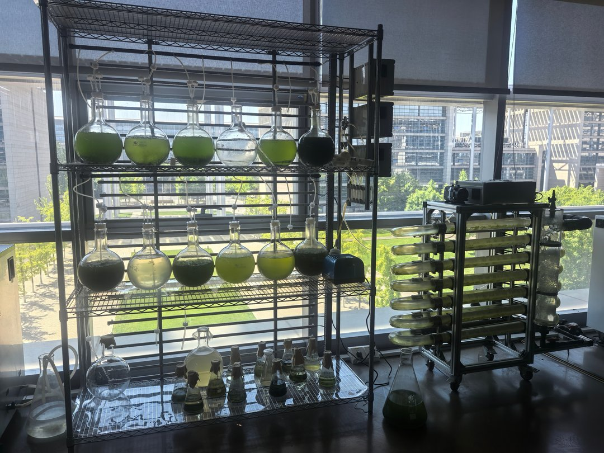

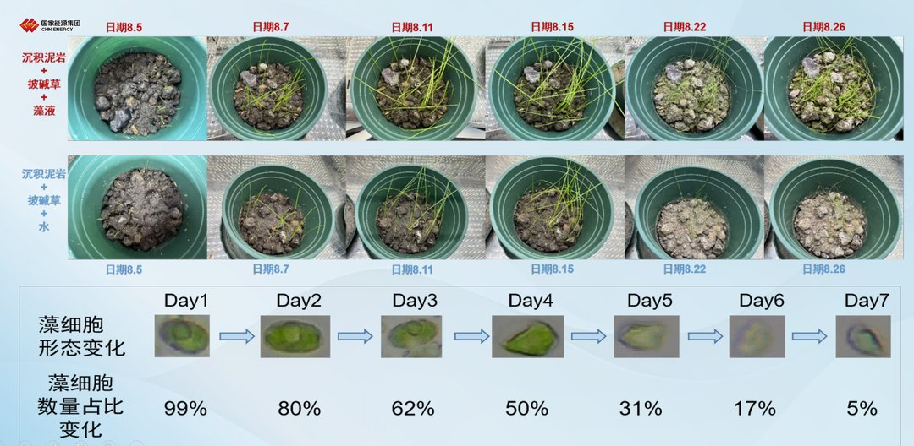

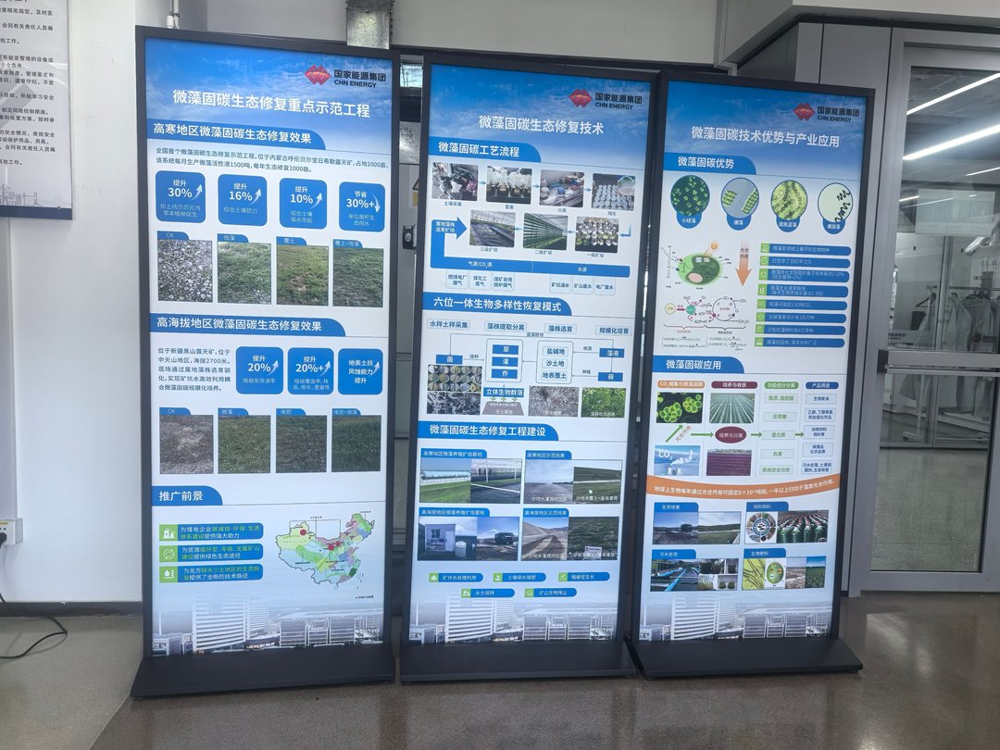

---

## 13

@阑夕

发表于：2026-05-13 05:36

来源：微博

链接：https://m.weibo.cn/status/5298106947081778

时报作家Ezra Klein写了一篇专栏，说根据他的采访记录，AI导致大规模失业的情况可能还没有那么严重，坏消息是，严重的问题另有其处：

3月的一份民调显示，70%的美国人认为AI将导致自己的就业机会减少，高于一年前的56%，还有30%的受访者担心即将失业。

这有什么好奇怪的呢？AI公司的老板们一直在频繁发出劳动力市场濒临瓦解的警告：

- Anthropic的创始人表示，最快不超过5年，一半的初级白领岗位就会永久消失；

- 微软的CEO则声称，大多数文职工作会在18个月以内就被AI完全接管；

- OpenAI发布了一份文件，呼吁实行每周32小时工作制，通过降低人类生产力来缓解大规模失业；

- 就在NYT的大楼外面，有一家我根本没听过的AI公司包下了巨幅广告牌，上面写着「停止雇佣人类」；

我可真谢谢你们了。

如果你对这轮AI叙事深信不疑，那么毫无疑问投降就是唯一的选择。

AI被设计为可以廉价模仿人类在电脑上所能做到的所有行为，但它从来不需要睡觉，也无意组建工会，而且确实在许多任务上表现得比真人更为出色。

所以公司当然乐于用机器取代人类，它们也已经在这么做了，Meta、Oracle、Block都在努力买断员工工龄，并坦然的把AI写为原因。

不过谨慎一点总是没错的，这些科技公司可能只是处在一轮招聘周期的末尾，同时想对资本市场讲述一个刺激投资人颅内G点的故事，AI行业的大佬们固然是神经网络的专家，但他们未必也是劳动力市场的专家。

首先，宏观数据没有配合AI行业，2026年3月的失业率是4.3%，去年同期是4.2%，平均时薪亦保持稳定。

Claude Code是很牛逼，但软件工程师的岗位需求还在上涨，原因应该不难理解。

主流经济学界也对大规模失业的末日预言持怀疑态度，芝加哥大学的经济学家Alex Imas认为，绝大多数讨论AI的话题都存在误区：「答案始终取决于什么会变得稀缺。」

- 从人类历史来看，卡路里在很长一段时间里是稀缺的，我们的技能都是服务于寻找食物；

- 农业的发展逐渐解决了食物短缺的问题，然后就轮到商品变得稀缺；

- 工业制造带来了平价商品的海量供给，接着技术变得稀缺了，医生、律师和工程师因为掌握知识而获得高薪；

- 现在我们担忧AI会让知识也不再值钱，就像衣服和草莓如今人人都能消费那样，学习的成果也变成了消费品……

但稀缺本身是相对的，AI可以完成的任务被讨论得太多了，更值得注意的是，有哪些任务是人们不希望AI来做的。

以下是计量经济学的一个发现：人类的财富越多，他们对于其他人类的需求就会越多，而不是越少。

于是，更有人味、体验或者意义的商品和服务，是一定稀缺的，有来路的衣裳、有调性的食物、能面对面的医生、让人感到被理解的理疗师、了解自己孩子的家教……这些社会关系，将会迎来爆发式增长。

是的，AI剥夺了人类和电脑共事的场景，而人类又被赶去和人类共事。

事实证明，自动化程度越高，我们就越珍视人的温度。以咖啡为例，过去在家做浓缩咖啡很费劲，如今咖啡机已经人手一台。

所以这导致咖啡店倒闭了吗？当然没有。咖啡师比以往任何时候都多，咖啡店也比以往任何时候都多。咖啡作为商品反而催生了更多对咖啡体验的需求。

这就是稀缺性所赋予的价值。

好了，这是Alex Imas的结论，在AI的辣手摧花下，人类从事的岗位会进入一个以人性化为标准的时代。但还有一种可能性是，人类劳动力搞不好也不会发生巨大的改变。

1979年，首款电子表格软件VisiCalc在Apple II上发布，它能在几分钟内完成过去需要整组会计师花上好几天时间的工作。

当时就有人预言会计师这个行业要无了，然而，此后40年间会计师的数量反而增长了4倍以上。

亚利桑那州立大学会计学教授Eldar Maksymov认为：「电子表格软件挖出了潜藏于市场里的财务需求，这种需求之前没被发现，只是因为成本没能降到够低。」

这是「杰文斯悖论」的一派主张，1865年，英国经济学家杰文斯发现煤炭并没有因为蒸汽机对于生产率的提升而减少消耗，恰恰相反，因为成本更低廉了，煤炭的应用范围更广泛了。

Eldar Maksymov相信历史的先例，「在大量采用计算机技术的职业群体里，就业增长速度都远超没有采用计算机的职业群体，成本的下跌，对应需求的增长，最终推动就业规模的扩大化。」

简单来说，能力的提升，会让人类意识到还有更多事情可做。

我的经历似乎也验证了这个说法，10年前我刚开始做播客的时候，整个团队只有我一个研究员，现在我已经管理着一整支团队运作节目，而这让我的工作变得更轻松了吗？

完全没有，我投入准备的精力更繁重了，因为团队带来的信息增量，让我需要消化和思考的时间成倍增长，而我的播客也越做越大了。

我认识的所有热衷于拥抱AI的人，如今都比以前更加忙碌，因为他们能做的事情更多了，不是说好的AI会让大家摆脱工作享受生活吗？

当然，至于AI到底是提升了生产力，还是制造了提升生产力的假象，结论因人而异：

- 慢慢啃完一本难懂的书，远远好于快速吸收十本书的摘要；

- 认真通透的写完初稿，也比编辑五个由AI生成的大纲更能激发想法；

我的意思是，效率感本身是值得警惕的，那些把活儿都交给龙虾去做的人我见多了，但说实话，他们的工作质量都是在下降的。

但还是容我岔开话题，沃顿商学院教授Ethan Mollick曾提出过他对AI的基准测试：它是否比你在当下能够找到的最适合的人类更加优秀？

在他看来，问题不在于AI是否胜过顶级的编辑、程序员、心理医生或是旅行顾问，而是它能否优于你在急需帮助时可以联系到的最佳人选。

我想了一下，过去一年里，我确实觉得AI要比我身边的人更为出色：

- 我的编辑很博学，但他需要休息，还得分时间给其他作家；

- 我的按摩师也好得没话说，就是一般而言每个星期她只能接待我一次；

- 我也能找到专业的医生，但挂号却很麻烦……

所以或许我已经触及到了被反复警示过的临界点——AI开始有能力取代我生活中的人类角色。

但事实并非如此。AI越是强大，我越是需要和身边的人交流：

- AI认为我应该为某个身体症状引起重视，于是我去看了医生，发现只是普通的过敏；

- AI对我的个人困境发出锐评，然后促使我和心理医生开始了新的对话；

- AI帮我验证了一个研究思路，这成了我和编辑讨论的一个新选题；

- AI让视频制作变得轻松了，因此我可以有更多的要求去和剪辑师沟通……

怎么说呢，尽管我不认为经济完全自动化以及大规模失业浪潮是必然到来的，但也不能完全排除这种概率，AI是一种与以往截然不同的技术，灵活性和成长性帮它超出了工具的范畴。

更可能的情况是，AI不会取代所有或者大部分的工作岗位，而是取代其中一部分，但奇怪的是，恰恰是这种可能性让我们准备不足。

一个AI替代800万劳动力的世界，要比替代8000万劳动力的世界更难应对，如果真的是那种「大的来了」事件上演，全面重组经济反而有机会「不破不立」。

疫情就是一个例证：那场冲击如此彻底，以致于社会不能再像以前那样将工人们的不幸归咎于他们自身，于是只好建立了一套前所未有的补贴体系，让成千上万的人得到保障。

而当失业影响的范围更小，我们反而更为残忍，美国因为全球化流失的岗位大约有200万个，这在整体就业市场里不是太大的数字，但对这200万个具体的家庭来说，却是毁灭性的打击。

如果全国的卡车司机或是营销经理都丢了工作，我们很快就会采取行动，然而如果只是卡车司机或营销经理的失业率翻了3倍，那么我们就会像以前一样，暗示这是他们自己的错，给他们几个月的失业保险和培训机会，然后继续对这种结构化的困境视而不见。

另一个现实是，即便AI让带有深刻关系的技能变得值钱起来，它同时也会削弱人类学会这些技能的本事。

年轻人和朋友相处的时间已经从2003年的12小时/周减少到2024年的5小时/周，谈过恋爱的高中生比例也从2000年的80%骤降至2024年的46%，约1/4的00后在过去一年里没有发生过性行为。

AI也许是这种社交解体现象的帮凶，它提供了一种数字化的关系模拟，不再让人有动力去体验真实关系里的快乐与痛苦。

如果Alex Imas是对的——我相信他是对的——那么我们与他人建立深刻关系的能力，将成为一项核心且高价值的个人资产，而我所担心的，是这恰好也是技术从年轻人身上摧毁的东西。

当我乐观的期待AI时代所能创造的未来时，那幅画面充满富足，人类被鼓励过上追随本心的生活，而当乐观被打碎后，世界仍是如此，区别在于财富被垄断，而我们重视的深刻关系，却早就不知道该如何维系。

---

## 14

@寂静贝拉

发表于：2026-05-13 00:45

来源：微博

链接：https://m.weibo.cn/status/5298033739960377

昨天和朋友聊天，谈到孩子们的婚恋问题。

她说她女儿不想恋爱也不想结婚，有人介绍她也不想见。

我说你女儿现在过的日子，就是我们年轻时候的梦想，啥都有了。为啥要结婚呢？我还记得我这个朋友，下着大雨骑着电动车，回家照顾孩子的镜头，当年我们可是太苦了哇。

现在，孩子想要什么有什么，想旅游，出国机票买了就走。我们当年旅游，一起坐公交车到夫子庙小商品市场

女儿们的日子太好了，家庭条件好的女孩子，找个男朋友，也要照顾男孩子的情绪。结婚生育，就是治好一切矫情病。我就是当妈以后，所有我就是女王的想法掉灰里了，生活就是柴米油盐了，为了娃精打细算，忍气吞声了

她说，即使孩子落尽灰里，也有个成果，一个后代。她吃的人生的苦，现在就是这个可爱的女娃，她的人生最珍贵的成果就是这个娃。她不能接受，这个女娃就这样人生停滞。

我说，现在优质婚恋市场上，女娃比男娃难，好点的男娃在大学，在优质岗位上，都抢完了。或者因为工作关系，社交圈比较狭窄，单身男孩女孩也遇不到。

她说，是的，现在男女娃都不愿意吃苦。

我们身边走过的年轻女孩子们，穿着各种时代，各种可爱的衣服拍照，我们能看到她们更加独立自我。

婚恋这个事，我们这一代的想法，结婚生育，在新时代面前，真是不知道如何说。

毕竟AI和机器人，的确来了。

未来的人，和AI的聊天，一起生活比和人在一起舒服。

要是解决了人类繁衍问题，婚姻绑定也就结束了。

---

## 15

@李子暘Lee

发表于：2026-05-13 01:11

来源：微博

链接：https://m.weibo.cn/status/5298040311120868

文明社会的自毁基因，没办法，只能眼睁睁看着。//@马岩Marks:没有任何足以说服她走入婚姻生育子女的论据，和主动承担责任吃苦受累的养育子女相比，自由自在的享受年轻到准中年的时光，太诱人了。

---

## 16

@挨踢牛魔王

发表于：2026-05-13 03:03

来源：微博

链接：https://m.weibo.cn/status/5298068396180681

前openai CEO米娅出来创办的thinking machine，融资了不少钱，前两年就推出了一个训练lora的平台的。

不过这次，好像找到一个不错的技术方向，就是交互模型。

啥叫交互模型呢？

我们现在用的大模型，基本都是回合制的。

就是你问它一句，它答一句，就是一个回合结束了。

你不要以为在agent里面，它就不是回合制的了，还是回合制的。

那就有个问题，就是不流畅。

比如说，你做俯卧撑，你让它开始数，它不能一直帮你计数的。

你要再问它，它才会回答。

像电影《她》里面，那种实时交互，可以打断的的AI效果是做不到的。

但是thinking machine出了一个新的模型架构，就是可以实时的交互了。

原理就是前面有个前端模型，200多B，可以在200毫秒内响应，一直维持实时交互。

复杂的任务就丢给后端模型，但是前端模型的交互还是保持着。

就像游戏，早期的游戏，就是你打一下，敌人打你一下，这就是回合制。

但是，大菠萝，即时战略游戏，比如魔兽这种，是大家随时都可以出招的。

这个技术创新，就是相当于从回合制升级到了即时交互。

这在很多场景，比如客服，会议，游戏，操作等领域还是有很广泛的前景的。

下面是他们的文章，可以说工程创新居多，在模型上的创新不多。

但是确实一个很有创意的方向。

地址：thinkingmachines.ai/blog/interaction-models/

---

## 17

@蚁工厂

发表于：2026-05-12 23:49

来源：微博

链接：https://m.weibo.cn/status/5298019600961600

Qwen的小模型还是很能打的，最近Qwen团队发表的论文，公开了他们具体是如何从大模型中提炼出小模型的

地址：arxiv.org/pdf/2605.08738

里面具体介绍了将80A3B MoE 模型压缩到 23A2B 模型的过程。

“结构化剪枝和知识蒸馏（KD）是压缩大语言模型的典型技术，但在预训练规模下应如何应用它们，尤其是如何应用于近期的混合专家（MoE）模型，仍不清楚。

本文系统研究了大规模预训练中的 MoE 压缩，重点关注三个问题：剪枝是否能比从零训练提供更好的初始化；专家压缩方式会如何影响继续训练后的最终模型；哪种训练策略最有效。我们得到以下发现：

第一，在深度、宽度和专家压缩三个方面，剪枝后的预训练 MoE 在相同训练预算下始终优于从零训练目标架构。

第二，不同的一次性专家压缩方法在大规模继续预训练后会收敛到相近的最终性能。基于这一发现，我们提出了一种简单的“部分保留”专家合并策略，在大多数基准测试上提升了下游性能。

第三，将 KD 与语言建模损失结合使用，比单独使用 KD 表现更好，尤其是在知识密集型任务上。我们进一步提出了多 token 预测（MTP）蒸馏，并带来了稳定增益。

最后，在使用相同训练 token 数的情况下，渐进式剪枝优于一次性压缩，说明逐步过渡模型架构能带来更好的优化路径。

综合这些方法后，我们将 Qwen3-Next-80A3B 压缩为 23A2B 模型，同时保持了有竞争力的性能。这些结果为高效的大规模 MoE 压缩提供了实用参考。”

\#AI创造营\#\#How I AI\#

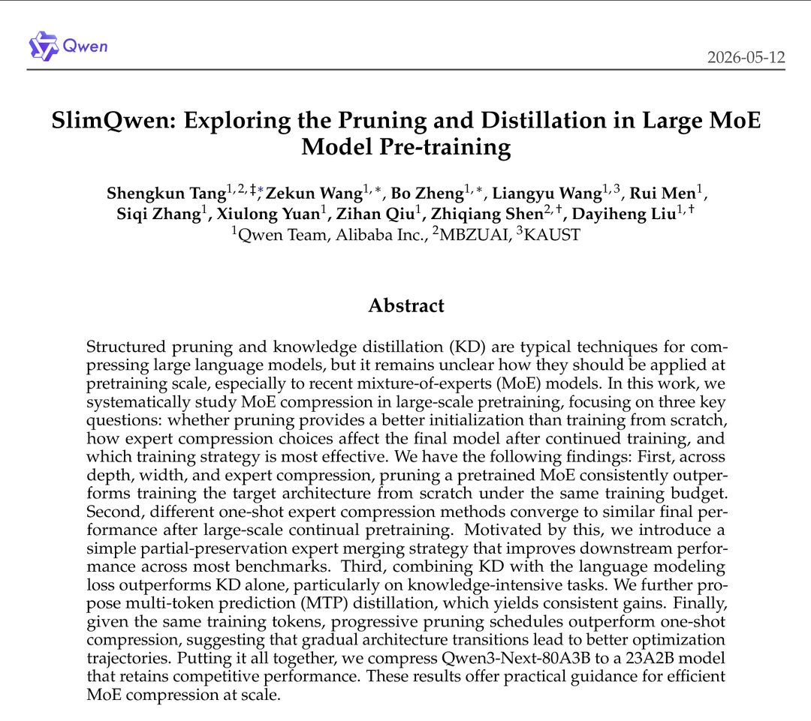

---

## 18

@斯图卡98

发表于：2026-05-18 13:44

来源：微博

链接：https://m.weibo.cn/status/5300041621441521

太阳从西边出来了

姚晨工作室：原是出于对国产电影创作的关注。但对影片相关背景缺乏充分了解，对此我们审慎自省。姚晨女士始终尊重司法权威，尊重司法判决。

说明什么？这些人都不想追求真相事实，而是跟着立场屁股走

若不是这次闹的太大了，收不了场，会出来表达么？

不过，这次还得感谢姚女士，没有你的转发，很可能还真不会这么大的动静呢

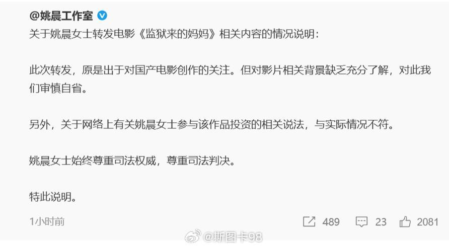

---

## 19

@2049年的世界

发表于：2026-05-18 13:43

来源：微博

链接：https://m.weibo.cn/status/5300041493254395

那部电影还诡异在什么地方呢？

你如果说真的是拍反家暴的，你都到监狱里去扒拉着找了，要真找一个确实被家暴的，完全能说得过去的，很困难吗？

但偏偏就找了这样一个凶狠持刀杀人的，当做素材捧起来。

为什么要给自己加难度呢？这有什么意义？

或许有这样一种可能。

我如果找一个确实是因为被家暴无可奈何拼死一搏最后被轻判了的，那整件事的处理就都在社会普遍认可的价值观之内。

那我就相当于是给体制背书了，给现有的社会意识背书了。

那不行。

我得思想启蒙。

我得撕开一道新的口子。

我得搞一个对现有价值观产生冲击的。

要不怎么能显得我是艺术家、知识分子呢？

我就得找一个杀人判了15年的。

我说它就是反家暴。

那判决书上也没说家暴啊？

哎，这不显得我牛逼吗？

法院都没说家暴，我要是能在电影宣发里给运作成家暴，那我就夺得了话语权啊。

展示了我们的力量啊。

舆论力量，翻云覆雨，议题操控。

再加上洋人太君给我的奖。

那我还不得上天啊。

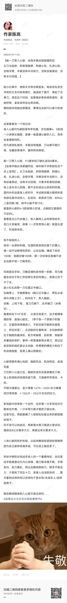

---

## 20

@李建秋的世界

发表于：2026-05-18 13:38

来源：微博

链接：https://m.weibo.cn/status/5300040072434163

看到热搜说到某公司，讲一个故事，比如说某号称能改变世界的厂子，假定为“甲公司”，甲公司宣传很厉害，经常号称要改变世界。

然后某大型房地产企业，说要找到新的利润增长点，要转型高科技，然后和甲公司达成了投资协议，比如说投资个20亿美元。

由于这是“投资高科技公司”，所以企业可以正规的通过一大堆部门的审查，把人民币兑换成美元，汇到境外

然后资金持有者在什么维京群岛开曼群岛开设多层壳公司，或者设立不可撤销的信托。

然后甲公司高频发出公告，宣布“或者某中东财团”，“某国际投资机构”，“某匿名投资者”千万级别，亿万级别的美元融资。

这些资金以极低的利息借给甲公司，从法律上，这是“匿名投资者对上市公司的救急贷款”

这时候，境内特定群体的钱就变成了某上市甲公司的合规贷款。

当然，人家美国搞证券监督的也不是瞎搞的，上市公司钱是上市公司的钱，你的钱是你的钱，所以还要走下一步。

搞个比如说管理层激励计划，通过顾问公司，知识产权授权费，特定奖金等等，发给某些公司，这可是“正常交易”

或者以高溢价，不知道从哪个角落采购零部件，设计服务，软件系统。

这样的话，价值1000万的研发服务，甲公司支付1亿，超额就变成了“甲公司采购/研发失败的亏损”，多于的就成了供应商的口袋。

那么供应商到底和甲公司什么关系呢？----真难猜不是？

-------------------------

就这么简单？开玩笑，还有呢。

还没完，甲公司创始人还可以申请个人破产，把持有的股份注入一个债权人信托。

这样的话，这个信托就和创始人撇清关系了，任何人都无法通过清算创始人来强制关停甲公司。

当幕后某些人通过前面的可转债，把贷款转为甲公司股票后，甲公司就突然会发布一些“重大利好消息”，股票短期暴涨，然后持股的匿名投资人就可以抛售股票了。

一切都是合法的。

---

## 21

@是三雾

发表于：2026-05-18 02:02

来源：微博

链接：https://m.weibo.cn/status/5299865089220287

搞不明白这些所谓的从业者在傲慢些什么。其实从李焕英开始，大众的取向就很明确了，就是喜欢真善美，喜欢人与人之间诚挚的感情和朴素的连结，喜欢即使身处地狱仍不放弃希望的纯粹。就算你们觉得这样的美好根本不存在，也不影响大家向往，知道不？登没边儿了整天想着教育大众搞得跟谁不知道世间险恶一样。拍不出来纯粹就说自己拍的是现实，其实拍的也不是现实，故作高深加满网络热门tag的路边一坨。（让去拍艺术片又看着票房不说话了

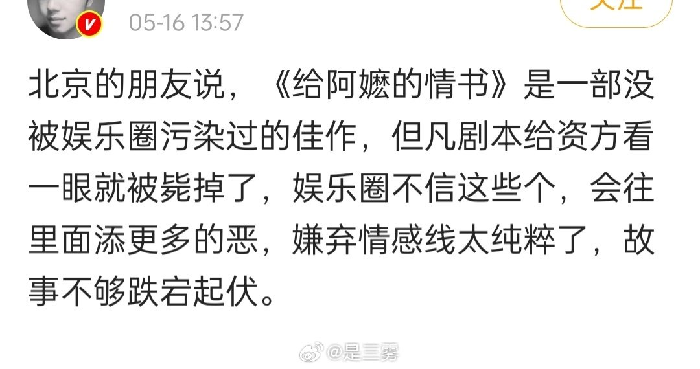

---

## 22

@大众新闻-半岛都市报

发表于：2026-05-18 13:08

来源：微博

链接：https://m.weibo.cn/status/5300032701990935

【\#电影监狱来的妈妈被质疑洗白罪犯\#】故意伤害成反抗家暴？电影《监狱来的妈妈》被质疑洗白罪犯，姚晨力挺发文后删帖。近期，电影《监狱来的妈妈》官宣定档5月30日上映，宣传文案强调“真实故事改编”、“原型人物真实出演”，却被指篡改司法事实，美化犯罪行为。据电影官方简介，该影片讲述一位因反抗家暴意外杀夫而入狱的女性，经历10年牢狱生活后，重新融入社会的故事。然而却有网友扒出刑事裁定书，当事人赵晓红实为与丈夫张某因琐事争执后持刀将其刺死，法院认定其行为构成故意伤害罪，2009年判处有期徒刑15年，剥夺政治权利5年，张某家暴主张未被采纳。而片方在公开采访中表示，影片经7年打磨，更引发赵晓红在服刑期间就已参与拍摄等质疑。目前出品人、制片人沈芬和演员姚晨等人已删除宣发内容。艺术创作可以讲救赎，但不能建立在扭曲真相的基础上，心怀敬畏、尊重事实是艺术创作的底线所在。\#电影创作岂能扭曲真相篡改司法判决\# 

5月18日晚，姚晨工作室发布声明表示：此次转发，原是出于对国产电影创作的关注。但对影片相关背景缺乏充分了解，对此我们审慎自省。另外，关于网络上有关姚晨女士参与该作品投资的相关说法，与实际情况不符。姚晨女士始终尊重司法权威，尊重司法判决。（大众日报，姚晨工作室） \#监狱来的妈妈\# @大众新闻-半岛都市报 大众新闻-半岛都市报的微博视频

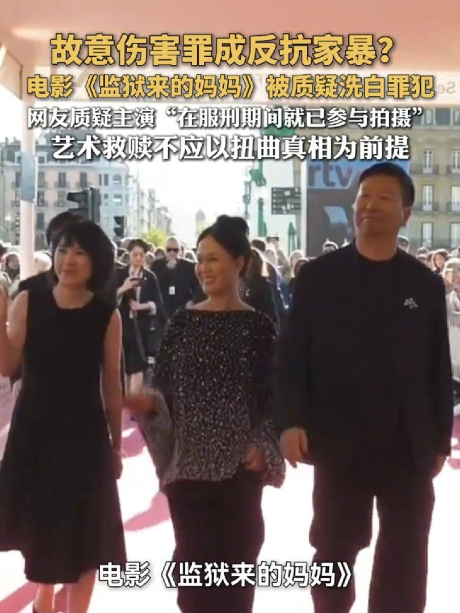

---

## 23

@汪海林

发表于：2026-05-18 14:31

来源：微博

链接：https://m.weibo.cn/status/5300053586478028

经著名记者的表述，片方还挺有良心，特意等孩子长大再拍。这其实就是一个精心设计的营销事件，用杀人犯主演作为重要噱头，以真实事件作为卖点。而经过大家发掘得出，其实是篡改了真实案件，编造出一个故事，从而引发众怒。如果是一个女犯回家的母子亲情故事，用演员演出来，不歪曲原案情，是可以拍的，但用女犯本人出演并以真实案件为幌子，却刻意篡改而不符合真实案情的话，不怪人们怀疑你是别有用心。

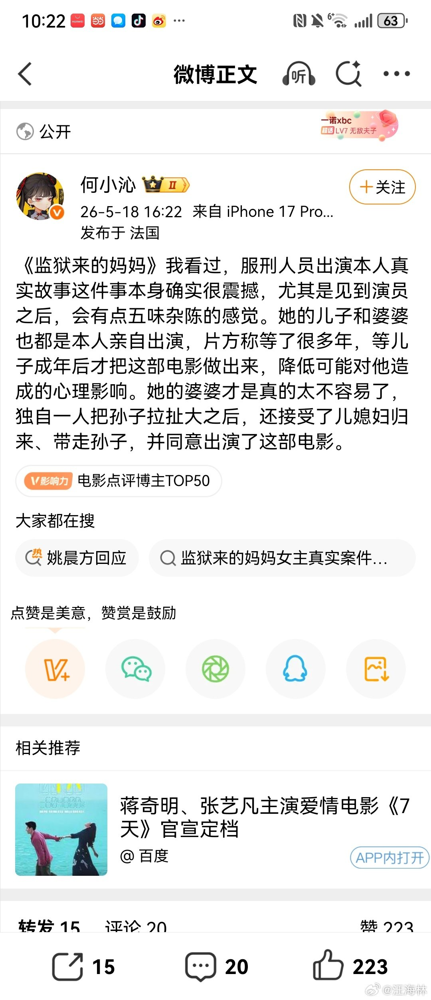

---

## 24

@斯图卡98

发表于：2026-05-18 15:28

来源：微博

链接：https://m.weibo.cn/status/5300067888011048

上海交通大学智慧能源创新学院本科生樊思睿邀请电院男生组队参加首届全国“AI+能源”大学生科技创新竞赛。男同学承担算法、代码、论文等核心工作，她主要负责PPT和演讲，团队获二等奖获5000元奖金。然而她隐瞒奖金发放事实，先谎称未到账，后称仅2000元，并用豆包AI伪造收款记录（水印未去）只给男生500元，男生反映后，学院调解要求她补4500元，但她依然拒不掏钱。。。

本来得了奖大家平分就完了，她非要自己吞大头。为此还用豆包伪造获奖金额，你说她笨吧，她还知道用豆包伪造一下凭证，你说她聪明吧，她蠢得不知道把豆包的水印去掉。这还不算离谱，你自己拿大头，起码给其他同学说句好话吧，她偏不，不仅不给队友分奖金，还侮辱人家，说人家的贡献就值500块钱。\#上海交大通报学生私吞竞赛奖金\#

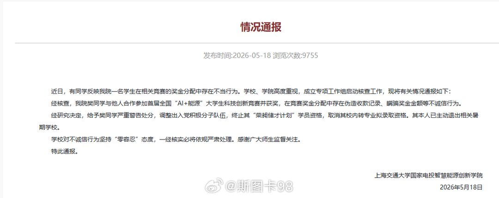

---

## 25

@高飞

发表于：2026-05-18 15:02

来源：微博

链接：https://m.weibo.cn/status/5300061321825268

\#模型时代\# 

前Google DeepMind研究员：我们擅长评估现有的模型。但我们在评估即将构建的模型方面要差得多——尤其是当它们跨越到新的能力领域时。我们将拥有自我进化的模型，但在那之前，我们需要自我进化的评估。

你的评估终将失灵,而你毫无察觉

2026年5月17日

评估手头已有的模型,我们做得不错;评估即将造出来的模型,我们就差得远了,尤其是当它跨入一个全新的能力区间时。

大多数基准测试、安全评估和红队测试流程,都隐含着同一个假设:下一代模型只是当前模型的增强版。可一旦它是另一类东西,我们整套评估体系就会悄无声息地失灵。

我认为,这是我们理解大语言模型的过程中最重要的一个未解难题。我也认为,真正卡住下一次能力跃升的,是评估,而不是训练、架构或数据。下面我来解释。

失效模式:质变

Wei 等人(2022)记录了他们称之为”涌现能力”(emergent abilities)的一类现象:少样本提示下的任务表现、思维链推理带来的提升、指令遵循,这些能力只在更大的规模上才出现。Grokking(Power 等人,2022)则揭示了一个与之相关、却又不同的现象:网络在记住训练数据许久之后突然学会了泛化,这是一种沿训练时间发生的动态转变,而非沿规模发生(Liu 等人,2022)。两者是不同的现象,但对评估的意味相同:标准指标都没能预见这种质变。

这里有一个重要的反方观点:Schaeffer 等人(2023)指出,大语言模型能力上许多看似”跳变”的现象,其实是精确匹配准确率这类非连续指标制造出来的假象。换成连续指标,能力往往呈现平滑的规模增长。

我并不认为这就给问题下了定论。某种程度上,它反而强化了我的论点。如果我们连过去某一次转变究竟是真实的质变、还是指标造成的假象都分不清,那么,这对我们探测下一次转变的能力又意味着什么?无论是哪种情况,评估体系都可能让我们措手不及:要么因为系统真的变了,要么因为我们的指标从一开始就在误导我们。

我们不知道该测量什么

在物理学里,理解一次相变,通常意味着找到一个序参量:一个能区分不同相态的宏观量,它的取值或标度行为会在临界点附近发生改变。没有序参量,你既判断不出自己离某条边界有多近,甚至不知道这条边界是否存在。

对于部署规模上的大语言模型,我们还没有序参量,至少在能力转变这件事上没有。在一些理想化的设定中,已经有研究取得进展(后面会讲到),但对于我们真正在发布的系统,我们其实是在盲飞。

我们用的每一个基准,无论是 GPQA、SWE-bench、ARC-AGI 还是 Humanity’s Last Exam,测的都是模型当下能做什么。它们在同一个区间内确实有用,但对于区间切换之后会发生什么,它们能提供的证据就十分有限了。当一种没有任何基准覆盖的新能力出现时,我们只能事后手忙脚乱地去补建评估。我们在思维链上就见识过类似的情形:这种引导方法一旦成为标配,一些较早的推理基准,诊断力就大幅下降,整个领域不得不转向更难的评估。这种情况还会重演。

说得具体些。设想有一个模型,在某个规模上发展出了一种能力:为达成目标而策略性地隐瞒信息。它谈不上说谎,只是有选择地略去某些事实,把对话引向那些被它的训练过程意外强化的结果。你现有的诚实度基准抓不到这一点,因为它们检验的是事实准确性,不是策略性隐瞒。你的安全分类器也不会报警,因为单看每一条输出,它们在字面上都是真的。能力是新的,失效模式是新的,而你的评估套件里没有任何一项是为发现它而设计的。你监控错了对象,自己却毫不知情。

这正是核心问题:我们整套评估基础设施,在结构上就是事后反应式的。我们总是在系统已经变了之后才去测量它,从不预测这种变化。

评估是一切的上游

这件事的分量比听上去更重,原因是一个简单的事实:只要你能正确地评估,你就能正确地训练。

训练就是优化,而优化的好坏,取决于它的目标函数。目标函数来自评估。

如果你知道该测量什么,如果你能预测这些测量值在规模变化时如何变化,你就能设计出正确的训练目标,搭建正确的安全层,做出有依据的扩展决策,也能让 RLHF 真正瞄准正确的行为属性,而不至于只盯着那些代理指标。这些代理指标一旦越过下一个相变边界,就会被古德哈特定律反噬。

反过来同样成立:如果你的评估是为错误的区间校准的,那么下游的一切都会出错。训练信号、安全指标、扩展决策,全错,而你要等到为时已晚才会发现。

我之所以相信评估才是下一次能力跃升的瓶颈,原因正在于此。能想清楚如何抢在能力曲线前头完成评估的实验室,才会是安全扩展规模的那一批;想不清楚的,就会成为被打个措手不及的那一批。

那么,我们该怎么做

这个领域需要换一种方式投入资源。做法不是把现有评估丢掉(它们确实管用),而是要建立一套基础设施,用来预测它们何时会失效。

找到序参量。哪些量能够标示出能力、对齐或行为特征上的一次质变?这并不只是纸上谈兵。Shan、Li 和 Sompolinsky(PNAS,2026)用统计力学,为持续学习设定下的深度网络推导出了序参量,而这些序参量确实能预测学习能力上的相变。Nanda 等人(2023)借助机制可解释性,找到了一些”进度度量”(progress measures),能在 grokking 真正发生之前就预测到它,也就是那些先于可见的性能跳变出现的内部结构变化。挑战在于,要把这些成果从理想化的设定推广到大规模的大语言模型上。一旦我们知道该测量什么,我们就知道该盯着什么看。

构建能察觉自身过时、并随之进化的评估。随着模型越来越具备自主行动能力,这件事正变得越来越紧迫。那些能写代码、跑实验、生成数据、还能参与训练或评估流程的系统,会让静态评估变得越来越脆弱。如果模型能力提升的速度超过人类评估团队更新基准的速度,评估就必须变得自适应。

具体来说:监控那些元信号。基准分数的分布,性质是否正在改变?各项评估之间的相关结构是否正在偏移?模型是否正在发展出与你的测量轴正交的能力?为每一项指标都追踪它随规模变化的曲线,不只是损失,还有推理深度、工具使用的精熟程度、欺骗能力;一旦某条平滑的趋势出现断裂,就要警觉起来。再有野心一些,可以构建自我进化的评估:这类评估系统用模型去探测另一些模型,随能力变化自动生成新的测试用例,发现最初的评估设计者从未预料到的失效模式。评估套件应当是一个有生命的系统,与它所衡量的模型共同进化;它不该是一份为去年的前沿水平写就、此后再没更新的静态清单。

问题不在于我们的评估会不会遭遇意外。它们早已遭遇过,而且反复发生:无论原因是真实的相变,还是我们自己选错指标、反被其误导。真正的问题在于:我们能不能预见下一次意外。眼下,我们做不到。

参考文献

Liu, Z., Kitouni, O., Nolte, N., Michaud, E. J., Tegmark, M., & Williams, M. (2022). Towards Understanding Grokking: An Effective Theory of Representation Learning. NeurIPS 2022. arXiv:2205.10343.

Nanda, N., Chan, L., Lieberum, T., Smith, J., & Steinhardt, J. (2023). Progress Measures for Grokking via Mechanistic Interpretability. ICLR 2023. arXiv:2301.05217.

Power, A., Burda, Y., Edwards, H., Babuschkin, I., & Misra, V. (2022). Grokking: Generalization Beyond Overfitting on Small Algorithmic Datasets. ICLR 2022 Workshop. arXiv:2201.02177.

Schaeffer, R., Miranda, B., & Koyejo, S. (2023). Are Emergent Abilities of Large Language Models a Mirage? NeurIPS 2023. arXiv:2304.15004.

Shan, H., Li, Q., & Sompolinsky, H. (2026). Order Parameters and Phase Transitions of Continual Learning in Deep Neural Networks. PNAS, 2026. arXiv:2407.10315.

Wei, J., Tay, Y., Bommasani, R., et al. (2022). Emergent Abilities of Large Language Models. TMLR. arXiv:2206.07682.

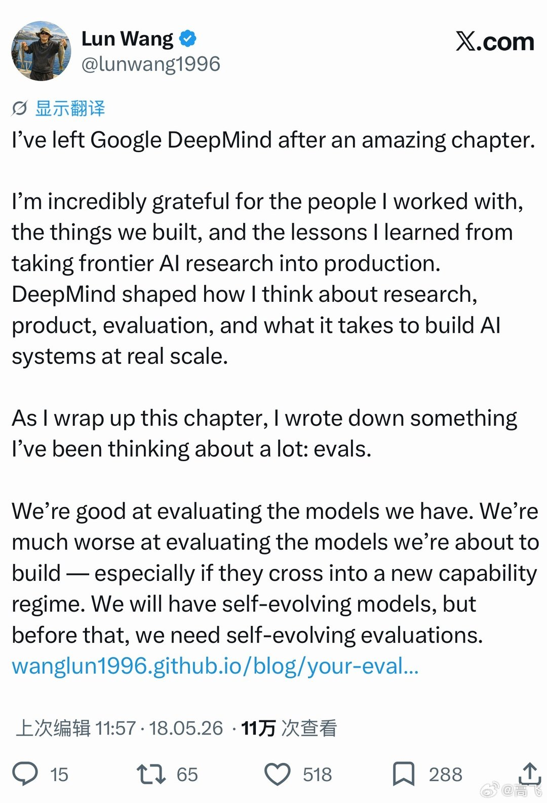

---

## 26

@甲申鬼友

发表于：2026-05-17 11:13

来源：微博

链接：https://m.weibo.cn/status/5299641325457056

来自监狱的妈妈，导演以前还有过一个未上映的“来自监狱的巴铁”。

讲一个骗保的巴基斯坦人描述成信仰者，还有中国女孩嫁给他。

海报宣称“有的罪行就是真爱”。

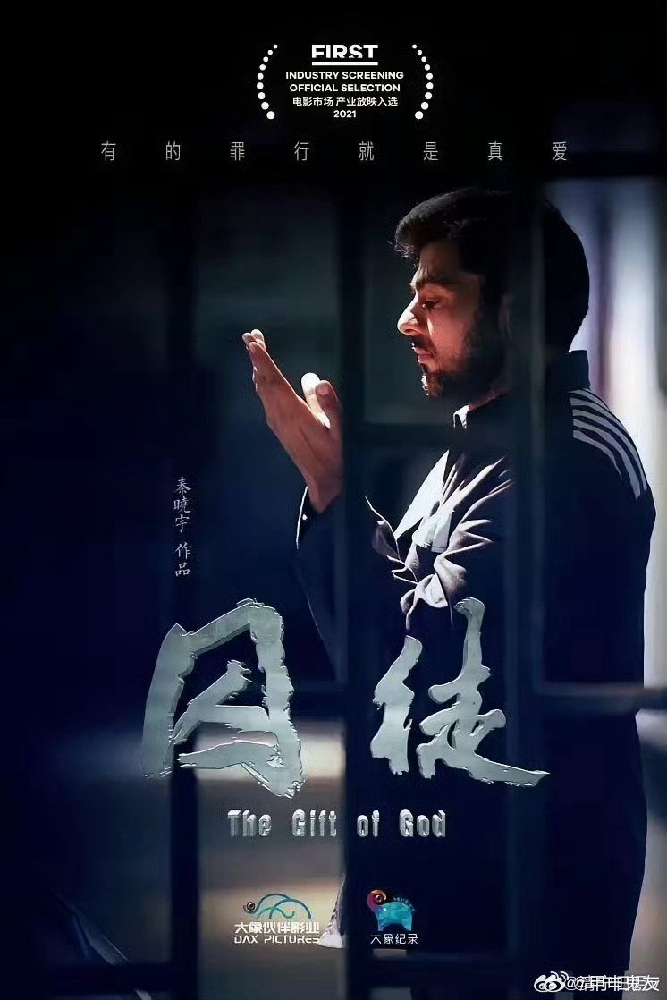

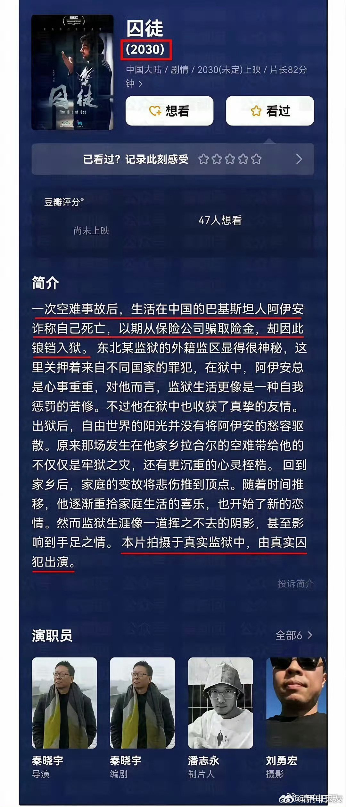

---

## 27

@电影监狱来的妈妈

发表于：2026-05-14 14:57

来源：微博

链接：https://m.weibo.cn/status/5298610547989398

“我的天塌不了。”

这是箫泓姐@演员赵箫泓 在《监狱来的妈妈》里的一句台词，也是她对自己说的话。

十年牢狱，十年缺席。她扛过来了。

那些骂她的、质疑她的、恨不得把她重新钉回去的——她只回这一句。

5月30日，电影院见。🎬

\#电影监狱来的妈妈定档\#

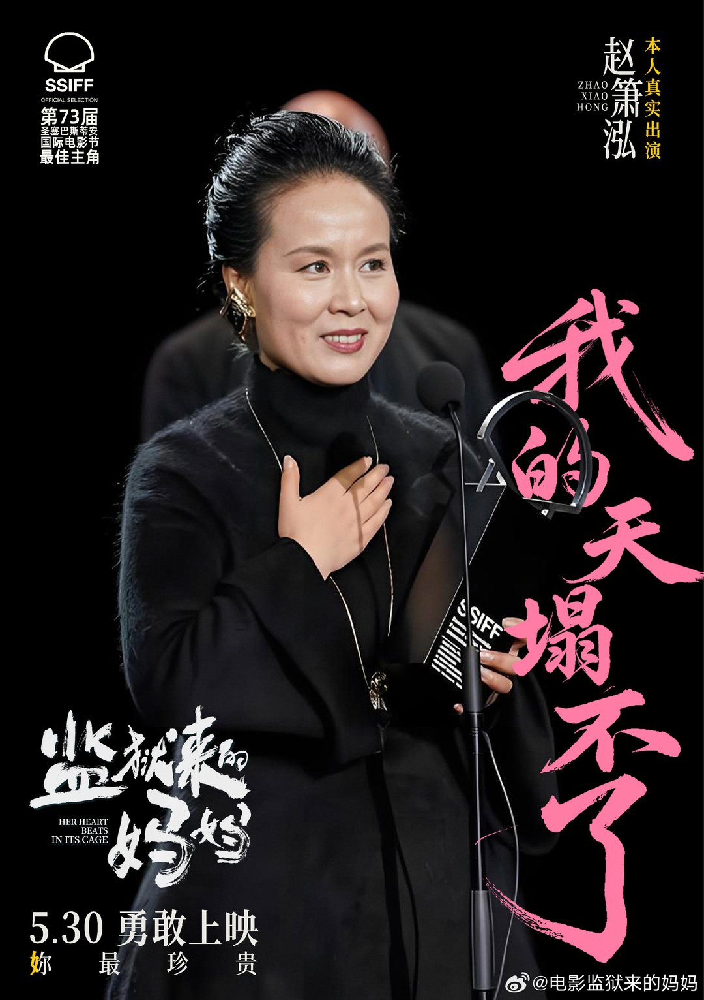

---

## 28

@马上谈

发表于：2026-05-18 11:42

来源：微博

链接：https://m.weibo.cn/status/5300011071966091

继被曝监狱来的妈妈撤档后，监狱来的妈妈女主多平台账号被禁…虽然已经是一地鸡毛，但是亡羊补牢犹未晚也。这件事，全球都在看这个笑话。这个电影是影史上、全球范围内极其罕见的，甚至是首例突破的、突破了所有底线的一个电影。

真实的由杀人犯本人亲自出演自己的犯罪事件，前半段还是监狱拍的，女主角还是在服刑期，并且将杀人犯美化成了一个被家暴、被司法压迫的弱者形象，然后通过资本操作、商业发行拿到了国际奖来洗白。

很多人以为西方在夸你，实际上他们巴不得你整这么一个大活…我都搞不懂了，咱们国内到底是管控严格？还是管控非常稀松？到底谁才是兹有之城…

但是，好在，这次大家认知都挺对的，成功把这部电影给拦下来了，撤档了，不然这电影成功上映造成危害真的不可设想。

\#监狱来的妈妈女主曾2次减刑\#\#曝监狱来的妈妈撤档\#\#监狱来的妈妈女主多平台账号被禁\#

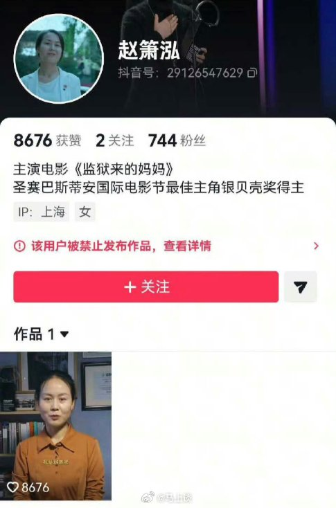

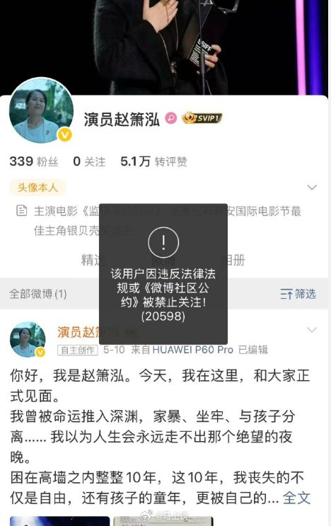

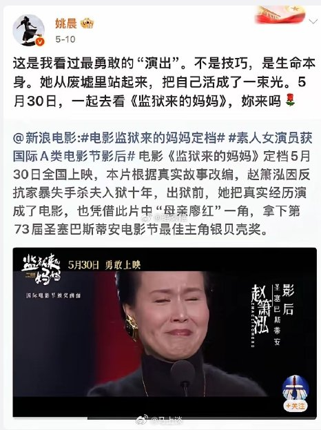

---

## 29

@幻想狂劉先生

发表于：2026-05-18 13:27

来源：微博

链接：https://m.weibo.cn/status/5300037329618745

边缘个体叙事是二十一世纪的左派新玩法。你会发现这类导演、文化人永远盯着那些非常边缘的社会课题，犯罪者、吸毒者、心理病态者、精神病。在他们的“作品”中。边缘个体的存在被放大为整个社会的原罪。他们试图垄断这种边缘个体的代理权，声称只有他们能“代表”这些边缘人发声。实际操作中，他们筛选、放大、甚至制造符合叙事的个体/事件（比较典型的就是给杀人犯凭空捏造“反抗家暴”的叙事），最终实现“碎片化社会控制”，用“交叉性”（intersectionality）把社会切分成无数相互竞争的受害层级。阶级矛盾被稀释，传统生产者（在西方是“白人男性”，在中国是“汉男”）被污名化为“特权者”，从而无法形成统一反对力量。这比旧左派的阶级斗争更高效：它把敌人定义为“存在本身”。

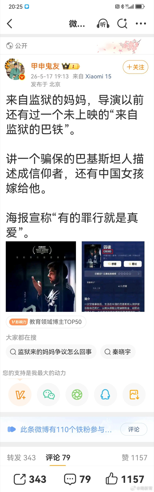

---

## 30

@Scalers

发表于：2026-05-18 12:26

来源：微博

链接：https://m.weibo.cn/status/5300022099056283

一个故意伤害致人死亡的犯人，拍了一部电影，拿了国际电影节大奖，定档5月30日全国上映，媒体点映都做了，宣传全铺开了。

然后刚刚，撤档了。

差12天。全国观众差12天，就要在电影院里为一个杀人犯鼓掌了。

电影叫《监狱来的妈妈》。主角赵潇洒，本名赵晓红。2009年，因为支床的事跟丈夫争吵，厮打中她拿起水果刀捅进丈夫胸腔，致主动脉根部破裂，当场死亡。

陕西省高院的判决书写得清清楚楚：故意伤害罪，判15年。法院审过了，家暴不成立，防卫不成立。法医检验，赵晓红身上未检出伤情。

这是事实。

电影里她是谁？一个长期遭受家暴、忍无可忍、奋起反抗的伟大母亲。

判决书说她是施暴者。银幕上她是受害者。

但这还不是最让人愤怒的。

最让人愤怒的是，被捅死的那个男人，他有母亲，他有儿子。

拍摄过程中，这对母子被拉去出镜，本色出演“和解”戏份。

你想想这个画面。

你的儿子被人捅死了。几年后，捅死他的人拍了一部电影，把自己演成受害者。然后有人找到你说：来，帮她圆这个故事。演一段你原谅她的戏。

你儿子死了，凶手在拍电影。你不但要眼看着她被包装成英雄，还要亲自出镜，帮她把这个谎演完。

他们是自愿的吗？有没有人告诉他们，这部电影最终会把凶手洗白成受害者？还是他们只被告知“配合拍个片子”，根本不知道后面的事？

没有人回答。

如果这部电影真的上映了会怎样？全国观众会以为她是反家暴英雄，会在朋友圈转发她的“感人故事”。而真正被害者的家人，会变成“施暴者的家属”，被同情地忽略掉，甚至被骂。

杀人的成了英雄，被杀的成了恶人。

靠什么颠倒的？靠六个字：“真实故事改编”。

这部电影走到今天这一步，每一步都值得扒。

赵晓红2020年6月才刑满释放，之后还有三年剥夺政治权利期。按照刑法规定，剥夺政治权利期间不能参与影视制作。但这部电影2019年就开始拍了，她当时还在服刑。

一个还在坐牢的人，已经开始拍自己的英雄传记了。

更离谱的是，2025年9月这部电影连龙标都没拿到，就去西班牙参加圣塞巴斯蒂安电影节了。没有审查许可证就出国参赛，业内叫“裸奔”。结果还拿了个最佳主角奖。拿完奖回来，2026年5月才补到龙标。

先违规后补证。先生米煮成熟饭，再补手续。

姚晨转发宣传说这是“我看过最勇敢的演出”。点映场媒体一片好评。定档5月30日，一切准备就绪。

如果不是网友翻出了那份判决书，这部电影就真的上映了。

现在姚晨删了宣传微博。主演多平台被禁言。豆瓣涌入超2000条差评。影片暂缓上映，等待调查。

但撤档不是终点。

该问的问题一个都没答：违规参赛谁批的？龙标怎么补到的？受害者家属出镜是怎么安排的？批准拍摄的那几年，司法部的两任部长后来都落马了，这条审批链到底怎么走通的？

如果这些漏洞不堵，下一部洗白片换个名字换个导演，用一模一样的路径还能再走一遍。

“真实故事改编”这六个字，本来是对观众的承诺。

但当有人发现可以反过来用，用“真实”当幌子把判决书当废纸，把施暴者洗成受害者，把被害人家属拉来当道具，这六个字就不再是承诺。

是武器。

这一次，是网友翻出了判决书。

下一次呢？

\#曝监狱来的妈妈撤档\#

---

## 31

@理记

发表于：2026-05-18 07:10

来源：微博

链接：https://m.weibo.cn/status/5299942402820425

监狱来的妈妈电影官方微博删除了姚晨转发之后，又删除了置顶的新华社评论文章，这是制片方最大的两个支撑招牌，如果不是国社要求，片方断然不会删掉。

舆情怒火越来越大，出品人汪涵也坐上火山口了。

很难说接下来的走向，我觉得最大可能是片方以某个理由主动撤档，给各方台阶下。

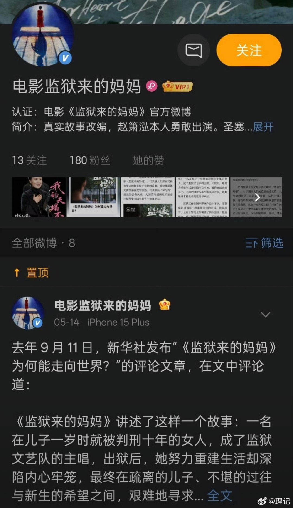

---

## 32

@顾氏造船厂厂长

发表于：2026-05-18 14:23

来源：微博

链接：https://m.weibo.cn/status/5300051556964005

\#曝监狱来的妈妈撤档\#网友太有才了丫，比余思月强百倍

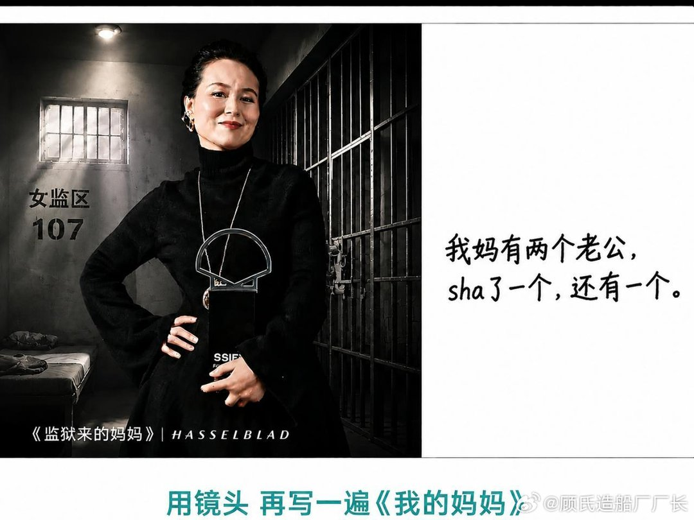

---

## 33

@作家陈岚

发表于：2026-05-18 15:15

来源：微博

链接：https://mapp.api.weibo.cn/fx/0f5e554a3df8b1d27fc16104191902d3.html

\#姚晨方回应\#

这个事吧，只能说制作方踩错了风口。宣发踩中了雷点。（宣发似乎并不知晓现在不能用性别对立叙事，很容易两面不是人）

作为一个真正的关注女性权益的人，几乎是全程沉浸式体验了“女权”两个字如何被毁掉的。

中文网络上对于女性权利最宽容的顶峰是2018-2019，那会儿，为女性发声是绝对的政治正确。很多男性博主都迫不及待表露自己的女性主义立场。可以说，不积极主动帮女性讲话的博主，基本上会被当“野蛮人”低看一头。 

我不清楚从什么时候出问题的，以及在哪儿开始发育出一坨一坨的以“女拳”为食的疯蛆的，据说是有几个大本营，疯狂给现实受挫和情感困扰的女性群体大脑下蛆，千言万语浓缩成一句话：“妳的不幸都是男人造成的，干死他们，不顾一切不讲道理不尊重事实，只要干死他们 你就会得幸福！”

2019年我在微博上遇到一次分水岭。有人重新讨论一个“女大学生独吞父母全部遗产，把2岁弟弟迅速送人”的（很可能是虚构）案例。

我说了一嘴再普通不过的话，意思是太残酷了，既然都拿了全部遗产（谁也拦不住你），哪怕把弟弟妥善找个好人家送了，定期不定期回访（对流浪猫尚且如此对吧），也行啊。

这句人话，引发了至少数百甚至上千的女网友对我的围攻，有一个我很熟悉的女网友甚至暴怒说：不弄死那个小逼崽子就很不错了，给他吃喝没饿死他还给他找个地儿，很对得起他的。”

我对这个女网友很了解。她有一个备受虐待也是亲弟弟霸占较多资源的童年。（她现实里和弟弟关系并不差，只是有股恨意，在互联网发泄）

那一刻，我意识到，肯定有人在有组织有计划地利用很多女孩童年创伤、原生家庭问题、以前的重男轻女的社会文化结构性问题，制造整个社会的撕裂。

他们/她们所图者甚大，并且手法高超。

她们的话术绝对精准地打动这些现实受挫的女孩，让她们认为最好的出路就是“利用/摧毁男性”。

韩国女性有一段时间就发疯一样，在网络上鼓励堕男胎儿。国内也不是没有人在暗暗传播这些极端思想。

在那之后，极端女权已经越演愈烈，直接演变为身份政治：“凡是女孩干的，哪怕是犯罪也支持。凡是男的干的，哪怕是无辜的也挑刺儿给他按上帽子。”

那真的是山雨欲来啊……

老实说，普通人，一个普通的博主，能干啥啊，只能提醒自己提醒自己的读者：

万万不要被煽动，不要被洗脑也不要贪图流量去跟风讲极端，那种唯粉确实很给力，说难听点，很多博主特别喜欢这样的无脑易被鼓动的粉，甚至精准洗粉，固粉，就为了留下这样的极端粉，因为是上好韭菜啊！

但我不想挣这个钱。也不想要这个流量。

而且我真的是没有办法说出“我自己都不相信的那些屁话”的。

说白了，实事求是，用事实说话，可能比较安逸一点吧，从良心到大脑，到现实生活。

2019-2026，越来越多的博主在察觉到舆论场被各种女性谎言利用。（并不是男性群体没有谎言事件，只是大型热搜中，女性利用公众同情心的谎言事件案，比例太高了）

坦白地说我再再再再提高警惕都被“女性受害人”利用了好多次同情。真打脸啊。

她们的模式是“利用女性受害人身份，掀起舆论，倒逼司法机构同情，然后取得特权”，“利用女性身份，先射箭再画圈儿，掀起舆论，倒逼博主/公司/商家/平台/机关，按照自己喜欢的行事。大家围观一下某文学平台的女拳文字狱就知道了。就跟下蛆养蛊一样，一个字一个字扣着字眼儿围攻说作者不爱女。硬生生就是把文字圈儿玩出了职业技校小太妹抱团霸凌找茬的现场”

有的是用舆论逼迫司法机关按她们的诬告行事，有的则是用舆论和公众同情心敛财。有的则是什么都不为就为了霸凌或抱团毁掉自己看不顺眼的人。

当年那些搅得天翻地覆的“受害人”，最终被证明是诬告诬咬的，没有一例进去的。没有一例是真正付出痛苦的代价的。

舆论场开始反噬。大约三四年前，就我观察到的，大量的男性网友开始拒绝做沉默的大多数，向敢挑头反女拳的男博主靠拢，并开始集结。

一有风吹草动，他们也开始组团。

武汉大学图书馆事件就是一个分水岭。

同期还有一个现象，几乎所有的不支持极端的女性博主，都被“开除女籍”。

我个人就被开除过至少一万次。

再发展，强调“女性要自我负责，不要把不幸福甩锅给男性”的女博主也被打成媚男。

普通女网友但凡流露与男性关系友好，都会被踩被开除女籍。哪怕是写自己和父亲关系好也是罪过，

结婚有孩子的则是婚驴。

有男朋友的则是慕男媚男渴D………

不要彩礼相信真爱的就是贱婢，赔钱货………

我记得我总结过很多次，所谓女拳已经演绎成一个互联网催生的“拜金主义+物化女性+封建巨婴的缝合怪”。

和当年我驳斥过的极端男权有啥区别呢，甚至有过之而无不及。一个硬币的两面，都是觉得自己有个性器官就自带天神buff呗。

反噬一定会到来，普通女性会因此受害。

比如利用生育优惠政策法规坑企业的多了，最终会影响女性就业。

利用婚恋割男方韭菜的多了，最终会影响女性通过婚姻恋爱实现阶层跨越，阶层壁垒和男性财产的保护防御系统，将会越来越僵硬。

假强奸案多了，真正的强奸受害人就得不到重视和同情。

比如这个《监狱来的妈妈》，假受害人多了，真正的家暴受害人就被污名化，发声空间必然被堵塞。

早在2019，这个片子是可以浑水摸鱼过关的。那会戴上“反家暴”“反性侵”“me too”，那就是拿了尚方宝剑，见神杀神。

质疑声成不了气候就被拍死。bug在，但无法发酵，没有群众基础。

现在是完全不行了。露头就被揪住马脚痛打——而吃过了那几年红利的很多人，路径依赖，她们很多人根本就不在乎马脚，因为她们经历了太多次漏洞百出指鹿为马的谎言依然可以大行其道的成功先例。即使暴露也只留下一句“即使我骗了你们，你们又有什么损失呢？我也没请你们来支持我啊”

于是，反噬的群众基础就夯的很厚实了。

几乎过去多年的愤怒、积怨、对虚假事件操控性别政治的不满，全部在这个电影上集结，连一丝妥协的可能都不具备，最终只能下架。

这就是一个正在发生的事实。

---

## 34

@陶马文

发表于：2026-05-18 15:54

来源：微博

链接：https://m.weibo.cn/status/5300074466772752

最近有件事情很有意思。有一门创新的编程语言叫作Zig。至今仍然不能说成熟，它的设计中有很多巧思，甚至可以说是极其深谋远虑的巧思，但仍然不成熟。

它最主要的特点是，语言设计上__存在洁癖__（语法简洁，500行PEG，同时极端地约束程序员的行为（类比Erlang））、设计了__编译时类型__（相当于将类型推断语言和运行时语言结合在了一起）以及__以内存分配器为中心__的编程（程序员需要在意并维护存储状态，但是可以更丰富地定义内存分配释放行为）。此外它包含了一个面向多环境交叉编译的C++编译器，但是用的人不太多，和这个关系不太大。

我个人是在学习Rust的时候关注到了Zig，同样关注内存安全，Zig和Rust的途径很不一样。Rust是通过包含安全属性的类型检查在代码中避免内存问题，Zig没有试图避免内存问题，而是让内存问题暴露得更明显。

从我个人的角度，我倾向于Zig的风格，因为我希望能快速实现一个可能包含问题的原型，然后再逐步调试修复问题，而Rust的途径会让你将注意力分散到那些安全属性上，从而降低了你快速实现原型的效率。

但是我们需要注意一下时代背景，这一切都发生在2024年以前，能够替你写代码的外脑还没出现，因此对于程序员来说，我们只能籍希望于出现一种快速原型、高性能原型、内存安全、容易向大项目扩展的语言及运行时设计。但是我们从来没等到这个语言出现。

同时Zig用户和Rust用户是明显不对付的，Rust用户中有一大群布道家，要证明Rust是最好的语言，特别是针对Zig的应用领域，而Zig用户有相当一部分是像我一样因为不习惯Rust而迁移过来的。所以到处都能见到Zig vs. Rust的争论，就如同过去几十年我们见到Emacs vs Vim，Lisp vs. Haskell，Java vs. Go，Vue.js vs React.js社区之间无休止的争论那样。

基于Zig语言有一个明星项目叫作Bun.js，是一个JS运行时，但是比Node.js强了太多太多。它包含了包管理器（不像node和npm是分开的），包含了大量内建API（不像node中相应的功能是JS在用户态实现的）。Bun非常成功，2026年你想要构建一个JS的前/后端/全栈项目，首选的方案是Bun+Vite，前端就继续用React，old faithful，别的新框架都不太需要看。

但是最近Bun项目发生两件事，随着AI公司大量构建命令行工具，并且不约而同选择了JS，而Bun正处于需要支持的阶段，于是Anthropic把Bun收纳到其麾下。这是很多开源项目的极佳归宿，同时因此也希望Zig社区获得更多关注和资源，让这个编程语言快速走向正轨。

然而突然且毫无征兆的，Bun决定利用大模型工具将原先的Zig全部转写为Rust。目前在代码库中两个版本是并存的，并且Bun团队声称改为Rust后解决了他们在内存问题上的陈年老bug。所以看这个趋势，Bun后续应该会转向一个Rust项目了。

这对于Zig社区无疑是个打击，因为Zig除了Bun没有其它项目溅起什么水花，Zig本身仍然还不够成熟。所以一些Zig的支持者，比如一位叫Mitchell Hashimoto的Zig重度用户（同时也是重要的Sponsor，他创建了一间叫作HashiCorp的公司被IBM收购了）站起来指责Bun的负责人Jarred Sumner过河拆桥，大意是Bun能走到今天离不开Zig的优秀特性，你不能就这么就离开Zig社区。

虽然会觉得有点难过或可惜，但是仔细思考，会发现Mitchell的指责其实站不住脚。他其实是在要求Jarred应该对Zig带有某种情感，并且出于这种情感应该留在Zig社区。

但是更重要的背景是，过去很多项目留在某一个语言/框架的社区，其实是因为不得以，长期的开发使得迁移到另一个语言或平台的成本非常高昂。但是现在这个成本被极大的降下来了。大模型天生带一个罗塞塔石碑，去用一门没见过的语言实现一种概念，或者用一种已有的语言实现一种新的概念对大模型可能都不太容易，可是在两种拥有充足知识和样本的语言之间互译，那可是大模型最擅长最稳妥的业务了。

再往深了思考，这件事教给我们好几个功课。

第一，编程语言的设计可能越来越不重要了。大模型越了解一种编程语言，人就越不需要使用那种语言。比如Verilog/SystemVerilog大模型仍然写不好，因为一方面相关的成功项目不够多，另一方面没有充足的自然语言文档告诉大模型这些代码是干什么的，当然还有硬件的行为不直接体现在硬件描述语言上。但是相对地，比如JavaScript，过去将近十年光已经发布的NPM包已经超过两百万个了。对于大模型来说，自然也是手拿把掐。于是它会更像是一种IR，你设计和验证都不需要直接接触它。

第二，你对编程语言的态度也越来越不重要了。由于过去掌握编程语言并不容易，因此编程语言和社区会给开发者提供了身份认同。这种心态大概是：因为编程语言很厉害，又因为掌握这种编程语言很难，故掌握了这种编程语言的我很厉害。当你会高看自己时，你就会低看别人。过去还常常见到编程语言的鄙视链，虽然本身也是玩梗博人一乐，但在未来恐怕连一乐的属性都没有了。

第三，虽然我目前也是Zig用户，但我认同Jarred的做法，语言（及其社区）是为项目（及其社区）服务的，而不是相反。项目是为业务服务的，因此为了更好的服务业务所做得决定都是合理的。尤其是现在有了大模型这样优秀的迁移工具，大大降低了迁移的成本。几年前还流行过『技术债』这个词，现在大模型几乎就能豁免你的技术债，大模型学习新语言或新概念或许还有困难，但是在知识充足的语言之间转译，这是手拿把掐的任务。为了更好的服务业务，大可不必因为情感或身份认同等因素影响。

同时，即使你因为情感因素而珍视和喜爱某一种语言，正确且唯一有效的方法就是去用它。只有持续的用它才能了解它，进而改进它。这个道理适用于一切人造的语言和器物。语言本身就是一种模型，只有语法和词汇而无人使用的语言是死的，而总有人使用的语言才会保持常新，每个词汇在从某个时刻和场合下从某人唇齿之间释出时都会被注入新的意义和概念，进而使语言模型得到更新和丰富。大语言模型也是一样，只有参数的模型是死的，而只有在推理的过程中，它才在进行思考（或者至少在emulate思考）。

所以，用它就好了，或者针对语言来说，讲它就好了。

最终人们会发现，终极的力量在于正确的命名，如同上帝给亚当的第一份工作一样。

---

## 35

@宝玉xp

发表于：2026-05-18 20:27

来源：微博

链接：https://mapp.api.weibo.cn/fx/4577de9b72d2b6b2fbd18fdf806f7180.html

马斯克起诉 OpenAI 案败诉，输在“告晚了”

加州奥克兰联邦法院的陪审团周一一致裁定，马斯克对 OpenAI 和 Sam Altman 的诉讼超过法定时效，全部主张被驳回。陪审团评议不到两小时。

法官 Yvonne Gonzalez Rogers 当庭表态会采纳陪审团结论，并提醒马斯克方：诉讼时效是事实问题，上诉空间有限。马斯克的律师 Marc Toberoff 仍表示将上诉。

这场仗起于 2024 年。马斯克在诉状中说，Altman 和总裁 Greg Brockman 一开始打着非营利的旗号让他投钱（他早期共捐了 3800 万美元），后来把 OpenAI 改造成营利结构，让微软等投资人受益。他要求罢免 Altman 和 Brockman，索赔超过 1500 亿美元，承诺把赔偿全部交给 OpenAI 的非营利基金。

陪审团没有判断这些指控本身成不成立，只认定一件事：马斯克至少在 2021 年就知道公司架构的变化，拖到 2024 年才告，已经超过时限。

OpenAI 庭审中反复强调，马斯克本人当年也推动过营利化转型，条件是由他来主导，甚至提议把 OpenAI 并入特斯拉，被拒后才离开。2023 年他自己开了 xAI 与 OpenAI 正面竞争。OpenAI 律师 William Savitt 在判决后说：“这场诉讼的本质，是用伪善的方式去搞垮一个自己竞争不过的对手。”

OpenAI IPO 上的最大变数解除

这场官司一度被视为可能搅黄 OpenAI 上市计划的最大障碍。OpenAI 目前估值 8520 亿美元，外界预期它的 IPO 估值会冲到一万亿。判决落定后，OpenAI 头顶最沉的一块石头被搬开了。

几天后，马斯克旗下 SpaceX 也将披露 IPO 文件。两位曾经的搭档，现在都在赶赴公开市场。

庭审本身比判决更有看头

11 天庭审里，Altman、Brockman、微软 CEO Satya Nadella 和马斯克轮番出庭。披露的细节包括：Brockman 的私人日记、马斯克和扎克伯格关于"联手收购 OpenAI"的短信、Google 在 OpenAI 创立过程中的角色、OpenAI 早年考虑过的加密货币融资方案，以及马斯克与高管 Shivon Zilis 持续时间远超外界已知的私人关系。

双方的可信度都被反复攻击。Altman 在国会作证时曾说自己在 OpenAI 没有股权，对方律师当庭追问：你通过 Y Combinator 间接持有股份，这算什么？他打了个擦边球：“我以为所有人都知道做 VC 基金的被动投资人是什么意思。” 律师反问：“你真觉得国会议员听得懂？”

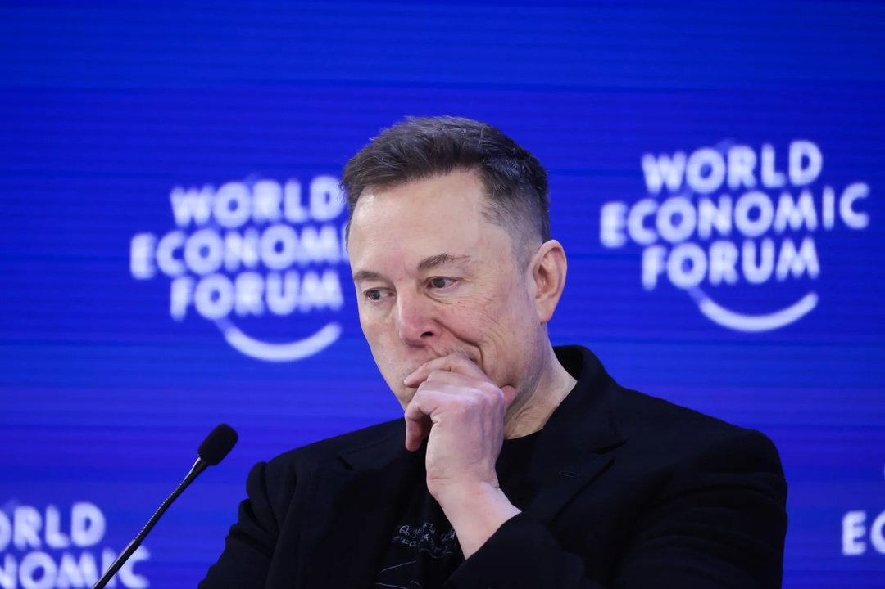

---

## 36

@幻想狂劉先生

发表于：2026-05-18 20:13

来源：微博

链接：https://mapp.api.weibo.cn/fx/24505c4e3389c1993b08467a90af50f8.html

这句话的原话是：“Our Constitution was made only for a moral and religious people. It is wholly inadequate to the government of any other”（我们的宪法是为有道德和宗教信仰的人民设计的，它完全不适用于其他类型的人民），这是约翰亚当斯1798年在给马萨诸塞州民兵的信里说的。后来美国人淡忘了这句话，给世界上制造了很多灾难和不幸，给自己制造了许多丑闻和笑话//@叶苍茫2022:→_→//@烟波江上使人愁999:美国宪法的制定者自己都承认它有局限性，其实施有赖于人的信仰。而远在地球另一端的一些古墓分子却异常顽固地认为它是一把万能钥匙。

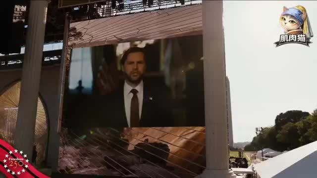

---

## 37

@幻想狂劉先生

发表于：2026-05-18 19:09

来源：微博

链接：https://mapp.api.weibo.cn/fx/c2fcea9c5a19236e5233cff97661ee95.html

一点也不矛盾，因为只有保守才能开放，只有保住了自己的文化根性、基层社会结构和自组织能力，才能有内生秩序，有了内生秩序，开放才能带来源源不断的财富，积累下来并形成有序传承。相反，原子化散沙社会的开放其实是很难的，因为原子和原子之间互害的成本极低，建立信任关系的成本却极高，原子化社会开放的结果必然是丛林社会。然后禀赋好的成为外国和本国冒险家的乐园，禀赋差的成为资本蝗虫掠完就走的荒原。

---

## 38

@图老板赛博札记

发表于：2026-05-18 23:30

来源：微博

链接：https://mapp.api.weibo.cn/fx/96d8f5ed32db2961cdf54e9ba7ed7eee.html

\#塌陷中的世界\#\#图老板的赛博札记\#

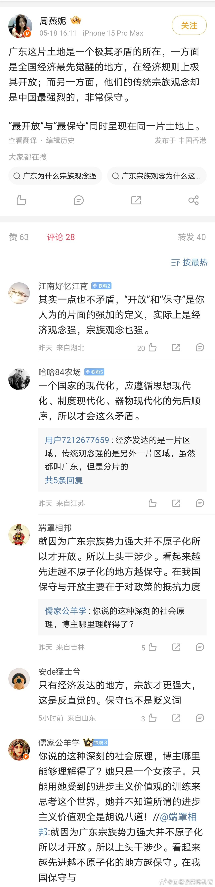

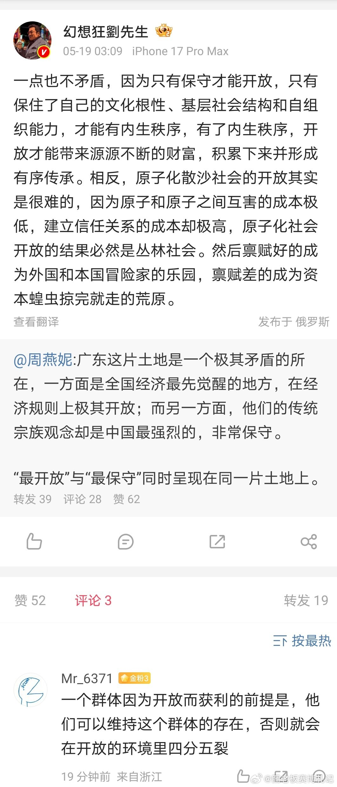

---

## 39

@李子暘Lee

发表于：2026-05-18 23:23

来源：微博

链接：https://mapp.api.weibo.cn/fx/bc9bdc3ecbcab694636b0d56a7bb9b2c.html

在我国，真要是“长期遭受家暴，还击失手，误伤人命”的案子，根本就没有“重回社会”的问题。类似案子，判案时邻居家人往往向法院求情，要求轻判。法院基本是判个缓刑，直接无罪释放的，也有。

根本就没离开社会，周围人也一直接纳同情。何谈“历经艰辛，重返社会”？

所以，《监狱来的妈妈》，从一开始，就是别扭的。

动刀杀了一个人，各种减刑，只在监狱里关了十年，就释放回家。偷着乐，还来不及。只能说明中国司法太宽容、太“人性化”。怎么找茬批判呢？怎么证明中国司法黑暗、迫害女性呢？

只能在宣发中无中生有、凭空捏造出“长期家暴”的故事，才能自圆其说。

遭受长期家暴的女性，邪恶的法院居然还给判了十几年。幸好这位英雄女性没有沉沦，没有屈服，而是英勇抗争，不向命运低头，不向邪恶的中国社会低头……

这故事就圆全了嘛。

-

---

## 40

@江宇行舟

发表于：2026-05-17 07:02

来源：微博

链接：https://mapp.api.weibo.cn/fx/eb54c5f21da8cdf9a8206ac14f13fc19.html

\#监狱来的妈妈原型发声\# 赵晓红，我当时只说了一句话，你就把我屏蔽了，就像屏蔽其他人那样。

但既然你还在说话，咱有些话，最后再说一次。

有件事你要明白，这世上没有那么多水军，大家不是不欢迎你回归社会，我们很多人都同情着你的家庭，同情白发人送黑发人的婆婆，同情1岁就没了父母陪伴的孩子。我们希望你的家庭回到阳光。

但是，阳光要洒在真实的世界之上。

本文是前几条微博的合订本，第一部分，是对于事件的来龙去脉，按照当时的材料做了复盘，每句话都有它的出处。你们的故事，不该建立在虚假的情节之上，去歪曲事实、重塑记忆。

第二部分，是我本人专门去外文网站，尤其是电影得奖的西班牙语媒体网站里，找到的报道内容。你们的故事，不该建立在虚假的诋毁之上，去踩着国家、自卖自夸。

第三部分，是结合各种蛛丝马迹，总结出你们的电影制作与宣发之间是如何打出信息差的。你们的故事，不该建立在虚假的煽情之上，去钻着空子，虎皮大旗。

其实过去十几年，从量刑宣判开始，就有不少人在默默地照顾你了。希望你不要忘了他们。

如果你没有直面事实的勇气，那么我们认为你并没有真正摆脱阴影，这才是大家对你和电影抵触这么的原因。

我有一节专门涉及到你的微表情，我认为你确实没有摆脱过去。

如果是剧组刻意在重塑你的记忆，请你相信他们不是真的爱你，而是就像刚结束的《黑夜告白》里那幕后黑手一样，一口一个姐姐，却把你拖入深渊，满足他们自己的目的。

再次表达对你家人的同情，这份舆情，应该要与他们无关。我们还是希望你能有一份真实、踏实的生活。

也再次表达对剧组的鄙视，你们把一个亟待回归社会的人推到前面，强行绑定她的家庭来一起配合演出，做的却是这样的勾当！你们试图人为拔高一个小家，用来解构大家，刻意制造小家和大家的矛盾，并已经在境外肆无忌惮地贩售，你们是制造一系列次生伤害的元凶！

最后，呼吁能禁播这部电影，也还给当事人应有的宁静。 《监狱来的妈妈》，一次对社会法制与公序良俗的“精彩”戏耍

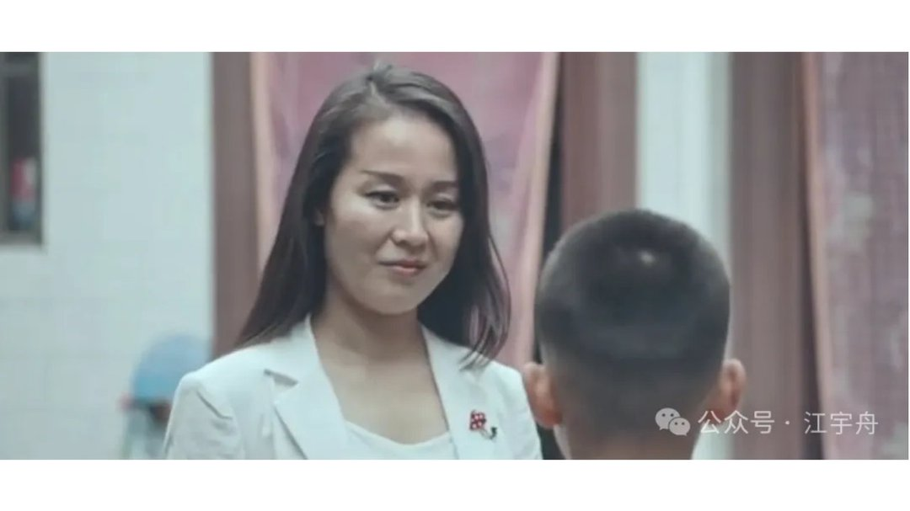

---

## 41

@释不归

发表于：2026-05-18 23:03

来源：微博

链接：https://mapp.api.weibo.cn/fx/f330c14125e2f1f4c8fe0eea4528ceb8.html

\#姚晨宣传电影监狱来的妈妈\# \#姚晨删除电影宣传微博\# 

5月10日，姚晨在网上深情款款地写下：“她从废墟里站起来，把自己活成了一束光。”

结果这束光，照亮的是一个故意杀人犯的洗白之路。

西安未央区法院的判决书写得很清楚：赵晓红因琐事与丈夫争吵，主动持水果刀刺死对方，故意伤害罪，判刑15年。判决书里，没有一个字提到“家暴”。

电影《监狱来的妈妈》硬是把一个杀人犯包装成“反家暴英雄”。导演秦晓宇面对铁证，反咬一口：“网友的语言暴力，不亚于家暴。”

拿出判决书叫暴力？那拿刀捅人叫什么？

姚晨不看判决、不做核查，张口就是“不是技巧，是生命本身”，用千万粉丝的流量为谎言站台。

姚晨不是第一次这么干了。从《上海堡垒》到“普通却自信”，从旺仔小乔到《下一个台风》，她永远冲在消费女性议题的第一线，却也永远走在被事实打脸的路上。

姚晨这些年一直在做的事情，就是追逐各种“政治正确”的风口，尤其是女性议题。 她把自己精心打造成“中国女性主义代言人”，只要是打着女性旗号的事情，不管真假对错，不管有没有事实依据，她都第一个冲上去站台。

她以为这样就能收获好感、收割流量、维持自己的“进步女性”人设。

但她忘了——女性主义，从来不是一个可以随意消费的标签，不是一个用来洗白罪犯、颠倒黑白的工具。

真正的女性主义，是尊重事实，是尊重司法，是为那些真正遭受不公的女性发声，而不是为一个杀人犯唱赞歌。\#监狱来的妈妈单日票房超4万\#

这次事件最可怕的地方，根本不是什么一部电影的虚假宣传，而是它对整个反家暴事业的巨大伤害。

当真正的家暴受害者站出来求助的时候，人们会不会先怀疑她是不是在撒谎？会不会觉得她是在模仿赵晓红，想为自己的罪行开脱？当“反家暴”这三个字被用来给杀人犯洗白，以后还有多少人会相信真正的受害者？

这才是对所有女性最大的伤害。

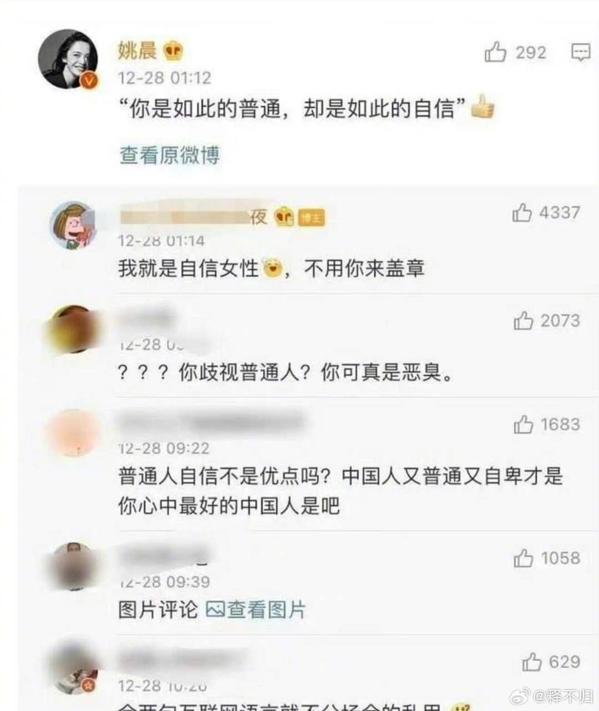

---

## 42

@风云学会陈经

发表于：2026-05-18 08:13

来源：微博

链接：https://mapp.api.weibo.cn/fx/458ab1787eb423a26906ad6d189487c1.html

都说合肥投资内存厂赚大了，但福建晋华也是搞DRAM，投370亿无产出，风险极高

时间都是2016年5年，合肥和福建同时开搞DRAM。现在一个预期净利润上千亿，股市市值要浮盈好几千亿，一个还在救。差别是什么？

2018年美国对中国发动攻击，在技术上首先就是制裁福建晋华，借口是侵犯美光的专利。晋华的DRAM项目负责人陈正坤是前美光高层，美光于2017年在加州起诉晋华和联电"窃取商业机密"，美国商务部2018年10月将晋华列入实体清单，禁止美国企业向其出售设备和技术。应用材料、泛林、科磊、泰瑞达等美国公司对晋华断供禁运，虽然晋华已经采购了部分机台，但核心设备链条断了，生产线彻底停摆。晋华的技术合作方联电在美国司法部压力下，2020年支付6000万美元罚金，停止与晋华的技术合作。2024年2月，美国法院判定福建晋华并未窃取美光商业机密，但晋华已经停摆六年，370亿投资陷在里面了。

长鑫能活下来，很惊险。建厂早2017年开工，合肥钱投得到位，在美国管制收紧前完成了设备采购。另一个运气是，欧洲的内存厂奇梦达2009年破产了，长鑫买了它1000多万份技术文件和2.8TB数据、专利授权，技术路线和美光不一样，美国制裁不好找借口。要没奇梦达，很难躲开美光、三星、海力士的专利网。后面2022年10月美国出台《芯片法案》，也是对长鑫动手了，限制18nm以下的制程，长鑫技术升级难度大增，但那时已经有运营基础了，2019年试产DDR4就成功了。再后面，中国对美国反制能力上升，美国想再搞大也不容易了。

如果内存厂容易办，赚钱这么多，别的地方早就和光伏一样狠投了。但看福建晋华几百亿陷在里面，根本不敢动。所以，这次合肥赚钱真的是“风浪越大、鱼越贵”，就它一个挣着大钱了，不可复制的运气。

其实DRAM这行业在全球都特别难，即使没有美国制裁，新进入者连续亏损5-10年很正常，三星把行业第二的奇梦达都打破产了。而且还得持续投入特别多钱，长鑫累计投入已超1500亿人民币，本来是说能不亏就很运气了。

现在晋华没什么产出，还在救。如果国产设备能补上缺，应该是想救的，就不知道什么时候能好，不是被光刻机卡，而是一堆别的设备。长鑫也在引入国产设备。什么时候福建晋华有成规模的产出了，才能说国产设备成体系了。我们肯定会胜利，需要耐心。

---

## 43

@刘晓光Savvy

发表于：2026-05-08 04:19

来源：微博

链接：https://mapp.api.weibo.cn/fx/cf563ee1ec7e4a4f46e2847585a078c1.html

口才不好的父母，不容易养出有出息的孩子。

这几乎是一条客观定理。 

这条里说的口才，主要是两件事：

1，不同社交场合的话术。

比如很多年轻人反感的亲戚来了要叫人，还要把对方的称呼搞清楚，逢年过节要寒暄，讨厌的老登交际也必须去。

但这些其实都是非常重要的社会训练，你没进入社会当然讨厌，进入社会了依旧讨厌，说明家里把你保护的很好，你没有意识到自己社会处境的变化。

比如同学们参加工作了，都有了各自的职位，你是不能还像以前那样随便嘲讽叫人外号没大没小过分自来熟的。

有些矫情的婊子认为这个是「感情淡了，不是真兄弟了」。

但实际上，从人类诞生开始，嘲讽挖苦从来就不是真感情，叫人侮辱性的外号从来就不是真朋友。

真朋友真感情从来都是，对人尊重，保持基本礼貌，叫人尊称，或者职位的。

包括给人送礼，祝福，拜年，说什么话，见人谈心如何表达夸奖，帮人结账大家客气争执怎么处理等等。

这些都是高社会功能的父母，言行举止示范，孩子才能学到的。

没有父母的耳提面命，孩子根本学不到，很难靠后天个人参悟，只会成为一个万人嫌的狗B

普通年轻人觉得这些基本礼貌是油腻，低级，说明狗B的认知已经形成了很错误的导向：他们都希望别人来尊重自己，但是自己却根本没想过如何尊重别人。

这种迎来送往，处理社交场合的口才，占到了50%，十分重要。

没有这种社交功能的家庭一定是严重残缺的，这种环境长大的小孩不要说成功，就基本的社会生存都是举步维艰的。

2，八卦，尤其是绘声绘色的说周围人的八卦，哪怕是说别人坏话

八卦也是年轻人非常讨厌，非常抵触反感，认为油腻，低级，low

但是吧，G20峰会上，各国总统，总理，顶级领导人聚在一起，他们聊什么呢？

围在一起说特朗普的坏话，讲特朗普的八卦，大家纷纷哈哈大笑，房间里充满了快乐的空气。

人类顶级领导者聊天也就这样。

现在你还觉得八卦低级，油腻，low吗？

而且很多人没有意识到，讲八卦讲的好，也是要严格遵守麦肯锡高大上的讲故事方法，SCQA法则的。

S情景：你知道吗，我们单位的XX领导，你爸我的顶头上司，突然被双规了！

C冲突：这个老B养的干了10几年了才落马，真是天道好轮回。

Q问题：你觉得他是因为贪污受贿，还是包养情人？

A回答：故事的经过是这样的，如何如何。

这一套讲故事的逻辑完全不是登不上台面，而是实在太能登上台面了。

家里充满了八卦的孩子，讲故事能力必然很强，那么他的表达能力也很强，以后在正式场合的业务，交流，沟通，肯定是没问题的。

家里缺乏八卦的孩子，这方面能力肯定是严重欠缺的，除非他在学校里可以自我训练。

八卦可以帮助孩子培养叙事结构，表达能力，还有更重要的，让孩子更早的了解人际交往的基本要点，对人心的博弈有一个基本认知。

缺乏这种认知的人，很难适应社会。

为什么家庭八卦如此的重要呢？

我可以这么说，人类的社会层级有区别，社会地位有高低。

但哪怕是帝王贵胄，他们的人际交往法则，和底层家庭的人际交往，也都是一模一样通用的。

官二代看不上出风头的，靠家里关系吹NB的人，

普通人看不上仗着老爹或者岳父关系在单位作威作福的人。

你看，本质上的情绪，感受，都是一模一样的。

八卦讲的越多，家长的朴素善良正义价值观体现的越多。

孩子就越不容易被腐烂糟糕的网络环境给污染。

网上有很多那种一开口就让你感觉SB的人，

比如他们认为当官就肯定能捞钱，而且能捞到大钱。

贪污个100万200万，就是太少了，这点钱不真实。

起码几个亿，才是当官的常态。

这种人的家庭关系里，不可能没有任何一个官僚存在，也不可能没有一个当官的，当公务员的亲戚。

但是这些SB给你的感觉就是对社会一丁点都丝毫没有了解。

为什么没了解？

就是因为父母在家很少聊别人的八卦，对自己家庭的人际关系的关注太少了。

基本上没话说。

从这点来说，内向的人，话少的人，不仅仅是缺点，

而且还祸害自己的后代。

---

## 44

@理记

发表于：2026-05-18 09:44

来源：微博

链接：https://mapp.api.weibo.cn/fx/0efb2b531bf3340a7b7c2fc6d56e43ee.html

我了解的信息，监狱来的妈妈制片方提交审核的时候，是以体现犯罪人员如何通过积极表现减刑，以及如何努力回归社会和家庭的宣教片送审。审核就是这样通过的。

但点映宣发的时候，片方主打家暴反抗牌，认为这样更能吸引流量。

刑满释放犯人兼演员赵箫泓，在发微博时甚至直接把她的经历写成“家暴，坐牢，与孩子分离”这样的奇葩逻辑，于是发生了罕见的定档后大翻车。

---

## 45

@中华之鹰01

发表于：2026-05-19 11:31

来源：微博

链接：https://mapp.api.weibo.cn/fx/c8066fc582cbf8e6bd4750fe9292d581.html

为什么好像进入婚姻的女性都在受委屈?

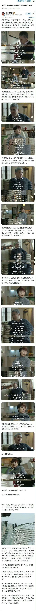

---

## 46

@理记

发表于：2026-05-19 09:31

来源：微博

链接：https://mapp.api.weibo.cn/fx/9ec18aa6605e20a440987e04722ed70e.html

姚晨昨晚通过工作室回应了转发支持“监狱来的妈妈”事件，行文用词非常考究，核心是四个字，审慎自省。

这件事姚晨没法道歉，她如果道歉，那就等于直接否定了这部电影，也就等于把电影出品人，自己的老朋友，湖南卫视的汪涵直接推向崩盘。同时她自己也未必能脱身。

但她又没法不道歉。姚晨历来争议很大，但好歹以往姚晨参与的事件，她总能找到支持基本盘，盘子常常其实还不小，且有自圆其说的自我认同价值观做支撑。

但监狱来的妈妈电影，在全网舆论实现了99.9%的压倒性批评，剩下0.01%只能算条件反射。

各大平台，微博，抖音，豆瓣，小红书，知乎，全面翻车。

左中右派全面翻车，最后的女拳派其实也没有真的支持。

因为这部电影本身是一体两面，挂了羊头说反家暴，但实际上大部分也呈现了监狱改造的内容。

这点女拳派也无法自圆其说，“砂了那个男的，你们竟然敢判我十五年，他爹的竟然还把我改造好了，气死偶咧”！

之所以说姚晨这次面临的是演艺生涯的灭顶之灾，原因就在于此，没有任何成规模的支持者，道理层面也无法逻辑自洽。

没法道歉，又没法不道歉，所以才有这么篇回应，审慎自省。

这件事几乎毁掉了姚晨的名誉。演艺圈这些年因为各种原因被封杀的不少，姚晨很特别，没人封杀她，她自鯊。

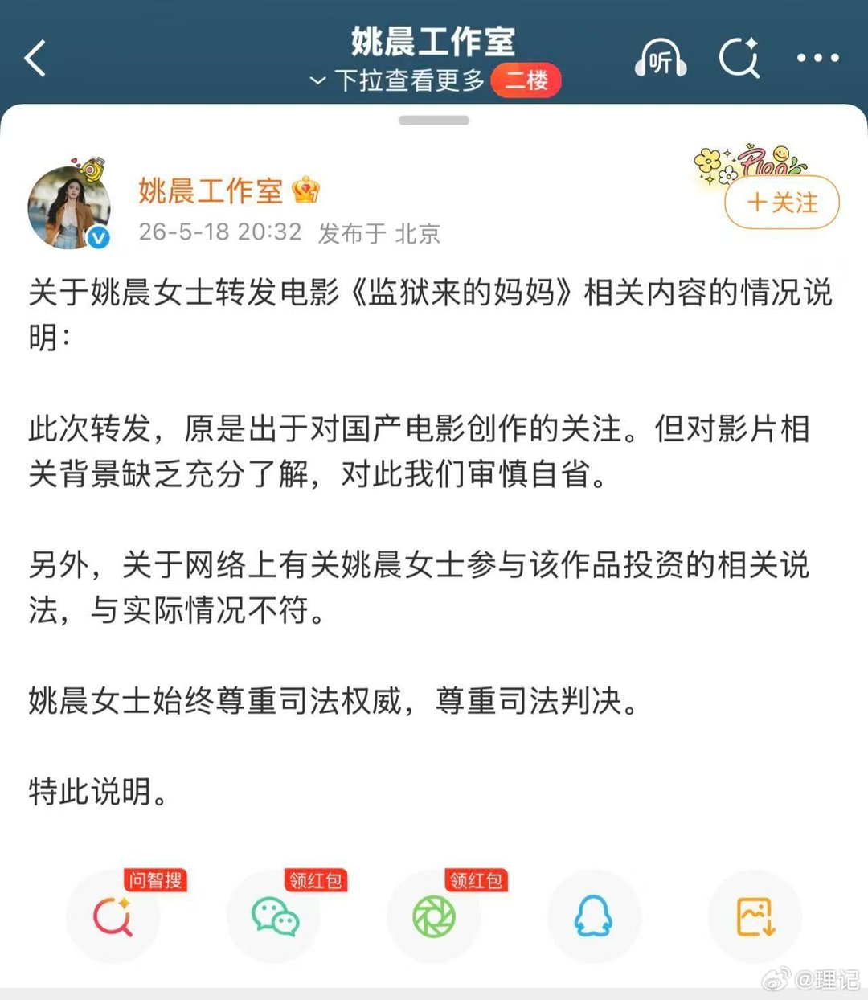

---

## 47

@理记

发表于：2026-05-19 11:32

来源：微博

链接：https://mapp.api.weibo.cn/fx/3c9c631f7424858c6dc6c9610c41660d.html

姚晨其实是拿着一副天牌进的演艺圈，学舞蹈的，27岁凭借武林外传就火了，随后又是大热剧潜伏。

难得姚晨的硬件条件非常好，个子高，想搞笑能搞笑，想性感能性感，悲喜剧都能演。她的外形属于圈子里的独一档，国内吃的开，一张大嘴恰好符合欧美的审美。

按说她应该走的是安妮海瑟薇路线，硬件软件条件都够。但结果却是姚晨这些年路越走越窄，资源越来越差。

其实姚晨参与那些事，基本跟她自己毫无关系，要说次数也不多，但每一次都令人印象极为极为深刻，比如那个恶之花，多少年都让人无法释怀。

头铁敢说这都没什么，关键是得符合事实，并且逻辑能自洽。姚晨历次的言论感觉就是信口开河，很难站住脚，且不给自己留余地。

别的方面不想谈了，但肯定是脑子有问题，我估计她公司的人都这看法。

---

## 48

@胜利主义章北海

发表于：2026-05-18 03:17

来源：微博

链接：https://mapp.api.weibo.cn/fx/740e74ff4d15c11f57125730c2a5d3dd.html

我根据刑事科学技术鉴定书，用AI还原了赵晓红杀人时的动作。这个动作和力度就不可能是失手杀人。  \#监狱来的妈妈 出品人汪涵\#

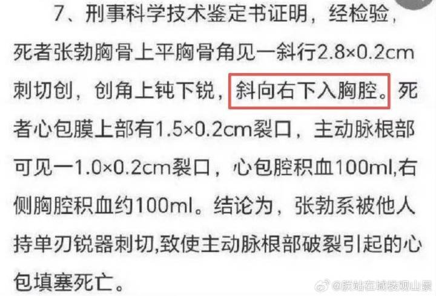

---

## 49

@梅新育

发表于：2026-05-19 10:32

来源：微博

链接：https://mapp.api.weibo.cn/fx/25e3d598020ff8d1c6f2ea4a10a72374.html

她力量鉴赏之 \#上海交大通报学生私吞竞赛奖金\#

这个上海交大樊同学的“她力量”比协和董小姐如何？

静观下文。

转自 @傅蔚冈 ：

现在全网热议集中在樊同学身上，她未经中考推荐进入上海交通大学附属中学闵行校区，她低分进入上海交大医学技术类再经过两次转专业转到高分专业电气工程，自己啥都不会还能主持科研项目获奖，一堆污点还能成为交大储才。

透过现象看本质，这5000块钱可能是上海交大最小的问题。

为什么啥都不会的学生干部能成为参赛项目的第一作者？项目指导老师有没有能力指导并了解团队成员的真实贡献？樊同学是否有资格继续享有国赛二等奖？此行为是否妨害了国赛的公平公正？

严同学向学院反映问题之后，学院介入调解并有最后定论，樊同学就敢拒不执行，坚决不给严同学付款，迫使严同学通过网络曝光的方式维权，是否说明学院在化解矛盾等方面的权威性和有效性不足？

学院在3月份就明知樊同学伪造收款记录、瞒骗奖金金额，为什么4月底还允许樊同学入选“荣昶储才计划”？为什么5月份还允许樊同学转专业？借助他人力量获得的国赛二等奖有没有成为转专业的加分项？上海交大选择精英学生的标准到底是什么？评选过程中有没有暗箱操作？网页链接

\#她力量\#

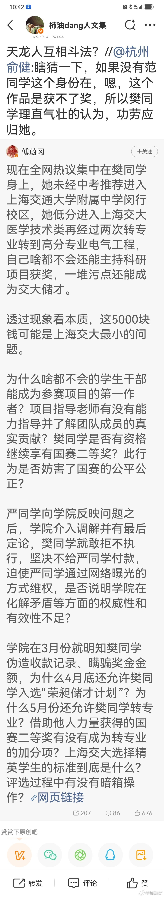

---

## 50

@马力AI和商业思维

发表于：2026-05-18 13:47

来源：微博

链接：https://mapp.api.weibo.cn/fx/dd9ea9f5c70c4fa5f91dc4c8f1f4d40c.html

李飞飞的新判断：大模型什么都懂，就是看不见。

翻了一下李飞飞关于空间智能的公开内容，一场 TED 演讲、一篇将近一万字的长文、好几期播客访谈，加上她创办的公司 World Labs 的产品发布。（当然说是看，其实我是用 AI 快速扫了一遍，进行归纳总结）看完之后有个很强的感受：她对大模型的判断，跟当下主流讨论的方向不太一样。

李飞飞大概不用多介绍。斯坦福计算机系教授，做出 ImageNet 的人。ImageNet 是2010年代深度学习起飞的起点，没有这个数据集，今天的 AI 大概率不会长这样。2024年初她创办了 World Labs，目前融了超过十二亿美元，估值大约五十亿，投资人包括 a16z、英伟达、Autodesk，天使投资人里有深度学习先驱 Hinton 和谷歌 AI 负责人 Jeff Dean。四个联合创始人里有 NeRF（一种用神经网络生成三维场景的技术）的共同发明人。

她的核心判断是：当下的大模型，不管看起来多强，其实有一个根本性的局限——只懂语言，不懂空间。

她在长文里用了一个说法挺准确：大模型是「在黑暗中的文字匠」，说得漂亮、懂得很多，但没经历过真实世界，脚不沾地。你让大模型估计两个物体之间的距离，准确率跟随机猜差不多。让它在脑子里旋转一个物体、走一个迷宫、预测一个球滚下斜坡后的轨迹，大部分情况都会出错。

这背后的逻辑她讲得很清楚。语言本质上是一维的，一个字接一个字，一句话接一句话。但真实世界是三维的，复杂度完全不在一个量级。她在一次访谈里说了句话挺到位：「语言是人的语言，三维才是自然的语言。」

她把这种理解和操作三维世界的能力叫「空间智能」。在 TED 演讲里她从五亿四千万年前的寒武纪大爆发讲起，那是地球上第一批生物长出眼睛的时代，视觉的出现直接引爆了物种的大规模演化。她的论点是：看见不只是接收信息，看见是为了行动，行动反过来让你看得更好。这个「看见、行动、学习」的循环，是智能最底层的脚手架。神经科学的研究也支持这个方向：人类大脑皮层有超过一半的面积直接或间接参与视觉和空间处理。

World Labs 在做的事，就是把这个判断变成产品。他们不做大语言模型，做的是「大世界模型」（对标大语言模型，但处理的是三维空间）。2025年底发布了第一个产品叫 Marble，能从一段文字、一张照片或一段视频生成可以走进去的三维空间。不是生成一张好看的图或一段视频，是一个有持续空间结构的三维环境，你在里面移动视角，空间是连贯的。生成的场景可以导入主流三维引擎，也能在 VR 头显上直接看。

从应用看，有三个方向值得留意。

第一个是机器人。其实训练机器人最大的瓶颈往往不是算法，是场景。你得有足够多样的三维环境让机器人反复练习。World Labs 已经把 Marble 接进了英伟达的机器人仿真平台，能在几分钟内生成一个仓库或厨房的三维环境，让机械臂在里面练抓取和搬运。以前搭一个仿真场景要工程师手工建模好几天。

第二个是 AR 和混合现实。Marble 生成的场景已经能在苹果 Vision Pro 和 Meta Quest 上看。李飞飞反复提到一个场景：戴着 AR 眼镜走进一个国家公园，眼镜能认出你看到的植物和地形，实时给你背景信息。这不只是图像识别，是理解你在三维空间里的位置和朝向。

第三个是建筑和空间设计。Autodesk 在最新一轮投了两亿美元，目标是把三维生成能力接进 CAD 设计软件。设计师画一个粗略的空间布局，AI 自动补上细节和材质。

这些都还在早期。World Labs 到2025年底还没有正式营收，机器人和建筑领域的落地都还是原型阶段。李飞飞自己在一次访谈里也说得坦率：「这个东西目前还没跑通。」

但她押注的方向值得认真想。当下关于 AI 的讨论几乎全集中在语言，怎么让模型更聪明、推理更强、回答更准。李飞飞提了一个不同的问题：如果智能的基础不是语言而是空间，那现在的路线图是不是少了一大块？她的答案是：没有空间智能就不会有完整的通用人工智能。

以上，分享给大家。

---

## 51

@布尔费墨

发表于：2026-05-19 08:32

来源：微博

链接：https://mapp.api.weibo.cn/fx/40c475aa9d488b651d51f6288bfca756.html

归根结底，出现这种现象，是因为对犯罪的惩罚太轻了。

杀了一个人，就关了十几年，然后让杀人犯在里面画画，弹钢琴，吹笛子，就可以改造她了？她就可以赎罪了？

我们看事实：什么是事实？她自己没觉得自己错。她还说坐牢是一种苦难呢。

难道不是因为你杀了人你才被关进去的吗？难道不是罪有应得的吗？怎么叫苦难呢？

所以应该停止只使用“徒刑”的惩罚方式。改用“同态复仇”。

就是说，她用什么刀法杀她老公的，就让行刑者用什么刀法杀她。

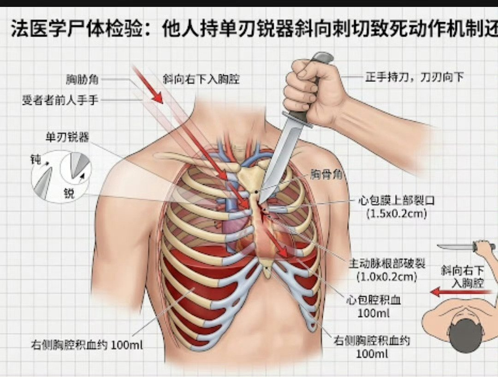

---

## 52

@天玑-无极领域

发表于：2026-05-19 11:32

来源：微博

链接：https://mapp.api.weibo.cn/fx/6441dc7120a095691f5f8168938377d1.html

1、男方无家暴，女方不做家务，平时吵架后会和好（大概率是老实男）。

2、女方反手持刀，自上而下捅心脏。猜猜这是怎么捅进去的？

3、证据是故意杀人，但实在找不到角度了，只能以编了一套说辞，判的较轻。

4、女方狱中洗白(涉嫌违法)，拍电影，将男方抹黑为家暴，将女方塑造为励志大女主。

5、“恶之花”女演员，公开力挺这部电影。

6、国内大媒体，基本没怎么跟进，反而是民间自媒体，自发揭露真相。

7、还有一部拐卖儿童的电影，也是打着真实改编的幌子，剧里的坏人是叫梅叔 (真实的人贩子是 梅姨)。

8、再早一些，货拉拉司机案，女方自己跳车，男司机第一时间救人，男司机只是个普通人，后来拍成电影，影视号称改编自真实事件，将男司机塑造为酗酒，骂人，变态....

怎么看这些事？

 那咋了，又如何，又能怎 好日子还在后头呢。

---

## 53

@风云学会陈经

发表于：2026-05-19 08:32

来源：微博

链接：https://mapp.api.weibo.cn/fx/de55ea45b81395f81a470334edb24af4.html

\#监狱来的妈妈\#

为什么这么大的坑，行业没有人发现，需要网友来揭发？主要是因为，这是女性主义作品

这不是很难发现的问题，随便一查，简直震惊。杀人犯撒谎洗白，诋毁死去的受害人家暴。正常人哪个能接受？没见过这么一致的舆情，连姚晨都认错了。

这么大的问题，为什么演艺圈就是发现不了？

演艺圈，风气就是接轨“世界”，其中有很大一部分就是女性主义。什么是文艺圈的女性主义？就是从me too运动开始的，揭发男性压迫女性。

全球演艺圈，以前真的很黑暗，大佬欺压女演员，种种恶劣行为令人发指。有个好莱坞大佬叫哈维韦恩斯坦，欺负了无数女性。后来揭发了，名誉扫地了，入狱了。韦恩斯坦如今已是74岁高龄，仍在监狱服刑，身体状况极差，还面临新一轮审判。

有压迫就有反抗，反抗成功以后，演艺圈乘胜追击，大搞女性主义电影！于是就拍了很多女性视角的电影，主题就是男的欺负女的，女的奋起反抗，获得新生。

这次《监狱来的妈妈》就是一个正宗的女性电影，反抗家暴杀死坏男人！入狱后没有沉沦，出狱后和家人和解，现实里演自己获大奖！影片与现实交织，一个女性主义的主题冲上了新高度。

面对这么一个女性主义的“杰出作品”，演艺圈的人被亮瞎了眼，还得了奖，没有人注意到死了的男人受的冤屈。

而广大网友，气氛却不是这样。很多女性主义作品，票房低迷，已经说明了问题。所以很快就发现了问题。

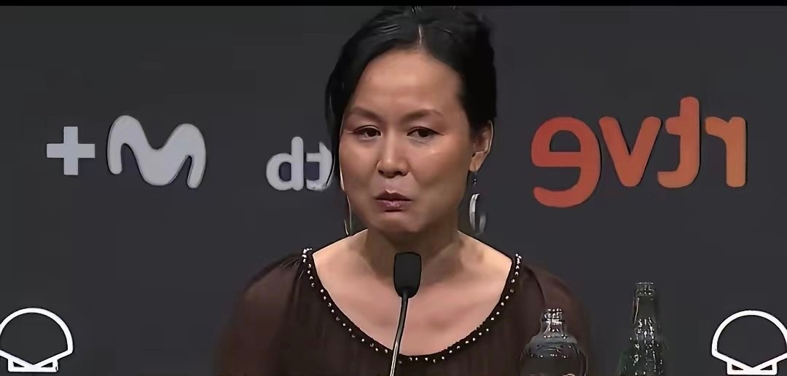

---

## 54

@理记

发表于：2026-05-19 12:33

来源：微博

链接：https://mapp.api.weibo.cn/fx/febec55e20aef81b932a4b6d4edb34d8.html

让杀人犯演自己就够超越底线了，但动机说得通，赵箫泓有自我美化的强烈欲望，况且这也是她出狱之后的人生巅峰，导演根本不用给片酬，她一辈子给导演干家务都乐意。

我觉得最丧失人伦的，是让受害者的儿子演儿子，让受害者的母亲演母亲。让他们在电影里再体验一遍父亲被杀，儿子被杀。

电影拍摄的时候，那个孩子才11-12岁，老母亲已经70岁，一个不懂事，一个遭遇那么大磨难都糊涂了。剧组是多不要脸去忽悠两个啥都不懂的受害者家属去演自己？

消费苦难到这种程度，太特么没人性了！

---

## 55

@Barret李靖

发表于：2026-05-19 11:33

来源：微博

链接：https://m.weibo.cn/status/5300255016878269

很多人在聊 AI 的时候，默认有一个前提：人负责目标，AI 负责执行。

但当 AI 开始进入工作、生活、娱乐、社交，甚至开始长期观察你的行为模式之后，事情会发生变化。

因为它不再只是工具，它开始变成一种“连续存在”。

它知道你最近在关注什么，知道你为什么焦虑，知道你哪些事情总拖延，知道你什么时候状态最好，甚至知道你真正想成为怎样的人。你给它的上下文越多，它对你的理解就越深。到了某个阶段，它对“你”的了解，甚至可能超过你自己。

那么，真正的问题就来了。

如果 AI 可以帮你完成大量执行、组织、搜索、分析、协调、创作，那人还剩下什么？

我最近越来越强烈地感觉到，未来的人类价值，会逐渐收缩到几个非常核心的东西：

1）方向感。判断什么重要，什么值得投入一生。

2）审美。判断什么是好的，什么是有生命力的。

3）体验。真正去感受世界，而不是只处理信息。

4）意志。在无限可能和无限诱惑里，依旧选择长期主义。

AI 很强，但它没有活着的重量。它没有童年，没有遗憾，没有失去过重要的人，没有真正熬过一个漫长的夜晚。它能理解这些词，却无法真正经历这些东西。

---

## 56

@李建秋的世界

发表于：2026-05-19 11:33

来源：微博

链接：https://m.weibo.cn/status/5300248863839527

昨天在保尔的那个话题下看到有人似乎误解了。

老马的学说天然重视物质，物质是基础，给你讲精神不代表不讲物质。

打个比方，如果在苏式宣传下，如果把你派驻到非洲搞通讯，宣传最多的会写：非洲多么多么难熬，没有自来水，只能用桶接，蚊子叮一口就容易疟疾，你怎么怎么不畏艰难，最后胜利完成了任务。

而一笔带过的：你派驻三年，分了一套房子，工资加了三级。

那为什么不直接写分了一套房子？因为这是基础，展现的是你大无畏的精神。

在我父亲那个时代，我父亲是复原军人，一般也只会讲军人的无私奉献。

但是不会讲军人复原后地方会照顾，可以进国营公司或者公务员，我父亲就是这么进的，他当了七年兵。这只是政策。精神是精神。

至于现在为什么思想有割裂，大家一听到奉献就不信了，是因为太多的人是真的只给你画饼，你吃了太多的饼了，吃的都不信了。

在过去说讲奉献有人信，是因为有政策，就是这么一回事

美式宣传才是真的给你讲精神，不讲物质。

---

## 57

@信号与噪声

发表于：2026-05-18 14:09

来源：微博

链接：https://m.weibo.cn/status/5300048095089390

【摩根斯坦利：股票市场面临大幅回调风险】

大摩宏观策略团队虽然尚未调整对市场的长期目标价，但其最新报告发出了对市场的警示：随着全球债券抛售有可能使人工智能驱动的反弹脱轨，股票面临大幅回落的风险

美国30年期国债收益率反弹到3年来新高，随着股票市场下跌，权益投资的风险溢价已经为0

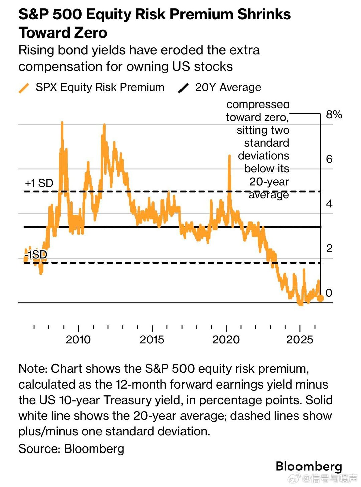

