# 2026-05-20

## 1

@马力AI和商业思维

发表于：2026-05-18 13:47

来源：微博

链接：https://m.weibo.cn/status/5300042350461358

李飞飞的新判断：大模型什么都懂，就是看不见。

翻了一下李飞飞关于空间智能的公开内容，一场 TED 演讲、一篇将近一万字的长文、好几期播客访谈，加上她创办的公司 World Labs 的产品发布。（当然说是看，其实我是用 AI 快速扫了一遍，进行归纳总结）看完之后有个很强的感受：她对大模型的判断，跟当下主流讨论的方向不太一样。

李飞飞大概不用多介绍。斯坦福计算机系教授，做出 ImageNet 的人。ImageNet 是2010年代深度学习起飞的起点，没有这个数据集，今天的 AI 大概率不会长这样。2024年初她创办了 World Labs，目前融了超过十二亿美元，估值大约五十亿，投资人包括 a16z、英伟达、Autodesk，天使投资人里有深度学习先驱 Hinton 和谷歌 AI 负责人 Jeff Dean。四个联合创始人里有 NeRF（一种用神经网络生成三维场景的技术）的共同发明人。

她的核心判断是：当下的大模型，不管看起来多强，其实有一个根本性的局限——只懂语言，不懂空间。

她在长文里用了一个说法挺准确：大模型是「在黑暗中的文字匠」，说得漂亮、懂得很多，但没经历过真实世界，脚不沾地。你让大模型估计两个物体之间的距离，准确率跟随机猜差不多。让它在脑子里旋转一个物体、走一个迷宫、预测一个球滚下斜坡后的轨迹，大部分情况都会出错。

这背后的逻辑她讲得很清楚。语言本质上是一维的，一个字接一个字，一句话接一句话。但真实世界是三维的，复杂度完全不在一个量级。她在一次访谈里说了句话挺到位：「语言是人的语言，三维才是自然的语言。」

她把这种理解和操作三维世界的能力叫「空间智能」。在 TED 演讲里她从五亿四千万年前的寒武纪大爆发讲起，那是地球上第一批生物长出眼睛的时代，视觉的出现直接引爆了物种的大规模演化。她的论点是：看见不只是接收信息，看见是为了行动，行动反过来让你看得更好。这个「看见、行动、学习」的循环，是智能最底层的脚手架。神经科学的研究也支持这个方向：人类大脑皮层有超过一半的面积直接或间接参与视觉和空间处理。

World Labs 在做的事，就是把这个判断变成产品。他们不做大语言模型，做的是「大世界模型」（对标大语言模型，但处理的是三维空间）。2025年底发布了第一个产品叫 Marble，能从一段文字、一张照片或一段视频生成可以走进去的三维空间。不是生成一张好看的图或一段视频，是一个有持续空间结构的三维环境，你在里面移动视角，空间是连贯的。生成的场景可以导入主流三维引擎，也能在 VR 头显上直接看。

从应用看，有三个方向值得留意。

第一个是机器人。其实训练机器人最大的瓶颈往往不是算法，是场景。你得有足够多样的三维环境让机器人反复练习。World Labs 已经把 Marble 接进了英伟达的机器人仿真平台，能在几分钟内生成一个仓库或厨房的三维环境，让机械臂在里面练抓取和搬运。以前搭一个仿真场景要工程师手工建模好几天。

第二个是 AR 和混合现实。Marble 生成的场景已经能在苹果 Vision Pro 和 Meta Quest 上看。李飞飞反复提到一个场景：戴着 AR 眼镜走进一个国家公园，眼镜能认出你看到的植物和地形，实时给你背景信息。这不只是图像识别，是理解你在三维空间里的位置和朝向。

第三个是建筑和空间设计。Autodesk 在最新一轮投了两亿美元，目标是把三维生成能力接进 CAD 设计软件。设计师画一个粗略的空间布局，AI 自动补上细节和材质。

这些都还在早期。World Labs 到2025年底还没有正式营收，机器人和建筑领域的落地都还是原型阶段。李飞飞自己在一次访谈里也说得坦率：「这个东西目前还没跑通。」

但她押注的方向值得认真想。当下关于 AI 的讨论几乎全集中在语言，怎么让模型更聪明、推理更强、回答更准。李飞飞提了一个不同的问题：如果智能的基础不是语言而是空间，那现在的路线图是不是少了一大块？她的答案是：没有空间智能就不会有完整的通用人工智能。

以上，分享给大家。

---

## 2

@布尔费墨

发表于：2026-05-19 00:50

来源：微博

链接：https://m.weibo.cn/status/5300209181527357

归根结底，出现这种现象，是因为对犯罪的惩罚太轻了。

杀了一个人，就关了十几年，然后让杀人犯在里面画画，弹钢琴，吹笛子，就可以改造她了？她就可以赎罪了？

我们看事实：什么是事实？她自己没觉得自己错。她还说坐牢是一种苦难呢。

难道不是因为你杀了人你才被关进去的吗？难道不是罪有应得的吗？怎么叫苦难呢？

所以应该停止只使用“徒刑”的惩罚方式。改用“同态复仇”。

就是说，她用什么刀法杀她老公的，就让行刑者用什么刀法杀她。

---

## 3

@天玑-无极领域

发表于：2026-05-19 03:17

来源：微博

链接：https://m.weibo.cn/status/5300246381068942

1、男方无家暴，女方不做家务，平时吵架后会和好（大概率是老实男）。

2、女方反手持刀，自上而下捅心脏。猜猜这是怎么捅进去的？

3、证据是故意杀人，但实在找不到角度了，只能以编了一套说辞，判的较轻。

4、女方狱中洗白(涉嫌违法)，拍电影，将男方抹黑为家暴，将女方塑造为励志大女主。

5、“恶之花”女演员，公开力挺这部电影。

6、国内大媒体，基本没怎么跟进，反而是民间自媒体，自发揭露真相。

7、还有一部拐卖儿童的电影，也是打着真实改编的幌子，剧里的坏人是叫梅叔 (真实的人贩子是 梅姨)。

8、再早一些，货拉拉司机案，女方自己跳车，男司机第一时间救人，男司机只是个普通人，后来拍成电影，影视号称改编自真实事件，将男司机塑造为酗酒，骂人，变态....

怎么看这些事？

 那咋了，又如何，又能怎 好日子还在后头呢。

---

## 4

@风云学会陈经

发表于：2026-05-19 00:48

来源：微博

链接：https://m.weibo.cn/status/5300208742697661

\#监狱来的妈妈\#

为什么这么大的坑，行业没有人发现，需要网友来揭发？主要是因为，这是女性主义作品

这不是很难发现的问题，随便一查，简直震惊。杀人犯撒谎洗白，诋毁死去的受害人家暴。正常人哪个能接受？没见过这么一致的舆情，连姚晨都认错了。

这么大的问题，为什么演艺圈就是发现不了？

演艺圈，风气就是接轨“世界”，其中有很大一部分就是女性主义。什么是文艺圈的女性主义？就是从me too运动开始的，揭发男性压迫女性。

全球演艺圈，以前真的很黑暗，大佬欺压女演员，种种恶劣行为令人发指。有个好莱坞大佬叫哈维韦恩斯坦，欺负了无数女性。后来揭发了，名誉扫地了，入狱了。韦恩斯坦如今已是74岁高龄，仍在监狱服刑，身体状况极差，还面临新一轮审判。

有压迫就有反抗，反抗成功以后，演艺圈乘胜追击，大搞女性主义电影！于是就拍了很多女性视角的电影，主题就是男的欺负女的，女的奋起反抗，获得新生。

这次《监狱来的妈妈》就是一个正宗的女性电影，反抗家暴杀死坏男人！入狱后没有沉沦，出狱后和家人和解，现实里演自己获大奖！影片与现实交织，一个女性主义的主题冲上了新高度。

面对这么一个女性主义的“杰出作品”，演艺圈的人被亮瞎了眼，还得了奖，没有人注意到死了的男人受的冤屈。

而广大网友，气氛却不是这样。很多女性主义作品，票房低迷，已经说明了问题。所以很快就发现了问题。

---

## 5

@理记

发表于：2026-05-19 04:05

来源：微博

链接：https://m.weibo.cn/status/5300258332478338

让杀人犯演自己就够超越底线了，但动机说得通，赵箫泓有自我美化的强烈欲望，况且这也是她出狱之后的人生巅峰，导演根本不用给片酬，她一辈子给导演干家务都乐意。

我觉得最丧失人伦的，是让受害者的儿子演儿子，让受害者的母亲演母亲。让他们在电影里再体验一遍父亲被杀，儿子被杀。

电影拍摄的时候，那个孩子才11-12岁，老母亲已经70岁，一个不懂事，一个遭遇那么大磨难都糊涂了。剧组是多不要脸去忽悠两个啥都不懂的受害者家属去演自己？

消费苦难到这种程度，太特么没人性了！

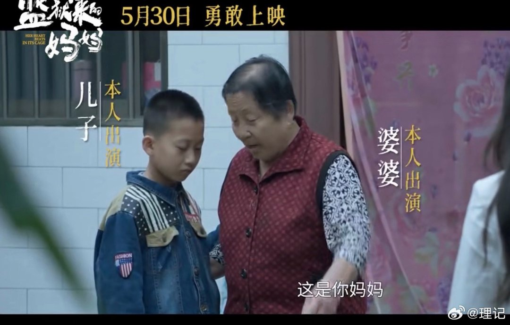

---

## 6

@斯图卡98

发表于：2026-05-17 16:18

来源：微博

链接：https://m.weibo.cn/status/5299718034819817

母亲节，这一天赵晓红面对记者，称自己很坦然

这两天看了她几个视频，给人第一感觉，她认为自己是受害者，觉得自己很无奈，自己很委屈。没有看到她对亲手杀害的丈夫有一丁点的愧疚，顶多表达出对儿子的愧悔

查了下法律，这种因夫妻琐事吵架杀人的，属于典型的激情杀人（持刀直接桶胸部），她被判了15年，属于比较重的判罚，被害人丈夫无重大过错（比如家暴、出轨），因此赵晓红没有被判定“情节较轻”（3–10 年），

赵晓红只判15年而不是无期或死缓，是因为赵晓红被法院最终定性的罪名是故意伤害罪（致人死亡），而不是故意杀人罪。故意伤害致死的量刑通常在10到15年之间。有期徒刑的最高期限就是15年，因此法院判处她15年，已经是在该罪名常规量刑区间内的顶格重判。

案发当晚，赵晓红在持刀捅了丈夫后，并没有逃离现场。委托合租的邻居帮忙拨打了110和120，也救助被害人，并等待公安人员到来，法院依法认定为自首。要不然她很可能就会被定性为故意杀人，定伤害致死 + 认定自首 = 保住了命，但依然顶格判了15年， 斯图卡98的微博视频

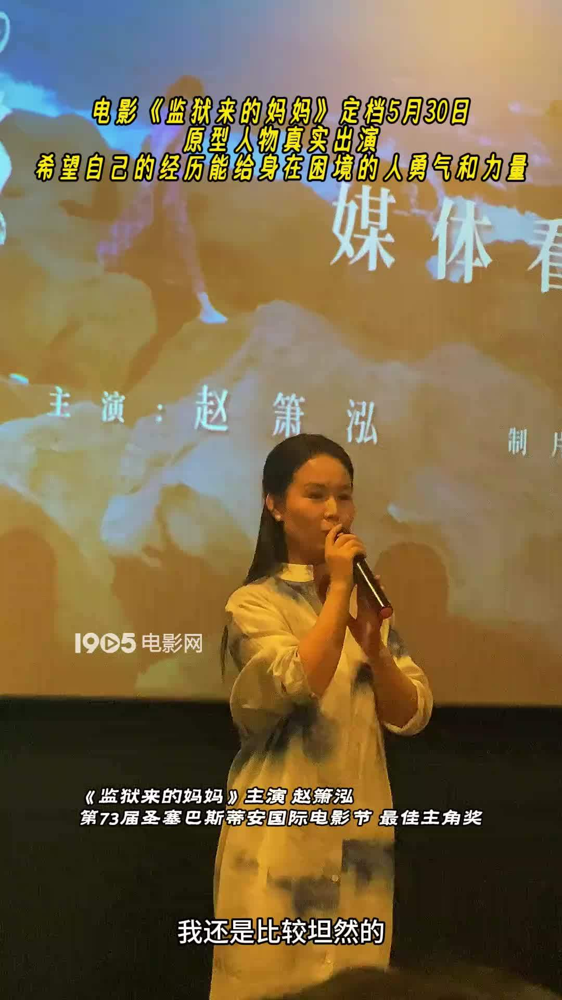

---

## 7

@ID_韩潮

发表于：2026-05-19 03:19

来源：微博

链接：https://m.weibo.cn/status/5300246857124139

把这件事的时间线摆出来，比谁的声明、解释都有说服力。

先说判决书里那个赵晓红。

2009年4月15日中午十二点多，赵晓红跟丈夫张勃因为“支床”这点家务事吵起来了，动了手。她拿起一把19厘米长的水果刀，斜着往右下方捅进丈夫胸口，刀尖戳穿了主动脉根部，引发心包填塞，人当场就没了。法医验尸的时候，赵晓红自己身上一处伤都没有。

西安中院一审定的是故意伤害罪，判了十五年，剥夺政治权利五年。

赵晓红当年是上诉过的，理由就一条，“因长期遭受家庭暴力，所以才将被害人扎死，请求改判”。这话不是我编的，是陕西高院（2010）陕刑一终字第66号刑事裁定书里白纸黑字写着的，然后呢？陕西高院驳回上诉，维持原判。

一审判决书“经审理查明”那一栏，用的措辞是“赵晓红与张勃系夫妻，因家庭琐事多次发生争吵”，“家暴”两个字都没出现过。证人那栏更直接，邻居说两人感情很好、张勃还帮着照顾孩子。张勃的姐姐和姐夫说两人感情不错、几家人还一起吃过饭。没有一个证人说有家暴。

后来2013年减了两年，2016年又减一年十个月，她实际服刑到2020年6月15日才出来，之后剥政三年，到2023年6月15日才满。

再说电影里那个赵晓红。

到了《监狱来的妈妈》里，故事改成了赵箫泓长期被家暴、一次冲突中失手杀夫、坐了十年牢出来重新做妈妈。宣传语写得很讲究，“不是犯罪片，是女性困境中的一束光”，发布会专门挑母亲节那天开，5月30日全国上映。

2025年9月这片子去了圣塞巴斯蒂安电影节，赵箫泓拿了影后银贝壳奖，号称“全球首位首作即获国际A类电影节影后的非职业演员”。

时间线上对一对。

大河报记者去查了国家电影局官网，这片子2021年才备案立项，备案号“影剧备字{2021}第1751号”。导演秦晓宇自己接受三联生活周刊采访时也讲过，2018年6月开始筹备，进监狱拍摄走的是司法部审批，最初报的是纪录片。

但最后做出来的是什么？

是一部进了国际电影节主竞赛、要在院线公映卖票房的商业故事片。导演自己也承认这点了，他的解释是“现实里赵箫泓母子还没能像电影里那样团圆，所以这片子是故事片”，他这套解释，等于绕个圈子承认了报批的口子是纪录片，做出来的成品是另一回事。

把这些时间线拎出来。

2018年6月开始筹备。2019年开机的时候，主演还在陕西女子监狱里关着。2020年6月主演刑满出狱、进入剥政期。2021年8月拍摄完工、同年才补的电影立项。2023年6月主演剥政期满。2025年9月连龙标都没拿到就跑西班牙参赛拿了奖。2026年5月才把龙标补上、宣布定档。

一步一步，每一步都踩在线上，违规再违规。

第一点，1988年广电部和司法部联合发过一份禁令，《关于禁止录制、出版正在服刑的罪犯表演的音像出版物的通知》。里头明文写着，服刑罪犯不能给电影厂、电视台、电台当演员，相关单位也不能把他们的表演做成影视片出版发行。这条到今天还有效。

第二点，《监狱法》写得很清楚，监狱里的所有活动都得服务于教育改造，不能用来做商业盈利。报批口子是纪录片、做出来是商业故事片，这叫套批。

第三点，《电影产业促进法》规定，备案是拍摄前必须走的法定前置程序。先拍两年再补备案，程序违法。

第四点，剥政期内的人主演院线电影、署名宣传、参加国际电影节、参与商业发行，按演出行业协会和广电的惯例，根本不该批下来。行业准入这关也过不去。

第五点，无龙标裸奔参赛。2025年9月去西班牙的时候，连国内的公映许可证都没拿到，就这么出境拿奖了。

走到这一步，这件事已经不是营销翻车、不是哪位艺人转发没核实那么小的事了。这是一条全链条违规的院线项目，叠加上一桩被两级法院驳回过的上诉主张，试图想通过院线电影做事实翻案的操作。

所以现在到底该问什么？

2018年6月司法部批这个项目的时候，是哪个司局批的？批文上写的是纪录片还是故事片？这份批文现在还在不在？

陕西女子监狱2019年安排一个还在服刑的人去拍戏，履行了哪些手续？她那段时间的服刑记录是怎么记的？是按“出工”记，按“教育改造活动”记，还是干脆没记？

2021年上海市电影局补备案那次，审核人员有没有调阅过主演的服刑和剥政状态？有没有调阅过原案的一审判决书和二审裁定书？

2025年9月没龙标就出境参赛，是谁批准的出国？参赛资质从哪里来？

2026年5月补发的龙标，依据是什么？审的时候核没核过2019年的服刑事实、以及二审已经驳回过的“被家暴”主张？

一份艺人工作室的声明，解决不了这些问题。一部电影的撤档，也解决不了。

\#电影监狱来的妈妈\#\#监狱来的妈妈涉嫌违法\#\#汤家凤6问监狱来的妈妈\#

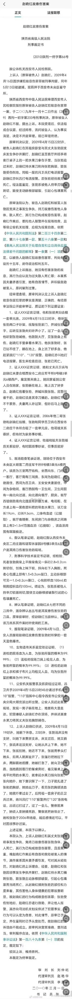

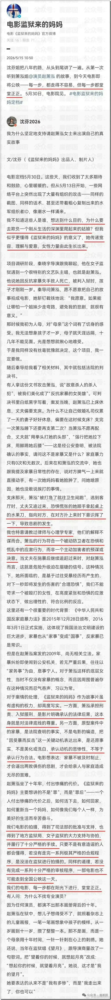

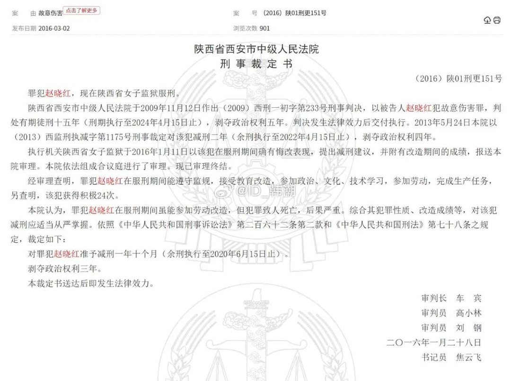

---

## 8

@伊洛牧

发表于：

来源：微博

链接：https://m.weibo.cn/status/5167262420173194

美国与日本1935—1973年出生队列女性2022年终身无孩率典型国家女性终身无孩率现状、成因及政策启示

日本女性终生无孩率上升趋势显著，更加接近“剧增”模式，由1953年出生队列的11.2%快速提升至1964 年出生队列的 19.8%，1965—1973年出生队列始终稳定在较高水平。

美国女性终身无孩率发展模式“独树一帜”，总体水平较低且呈现一种先增后降的倒“U”型变动趋势，1970—1973出生队列的女性终身无孩率仅处于10%左右。

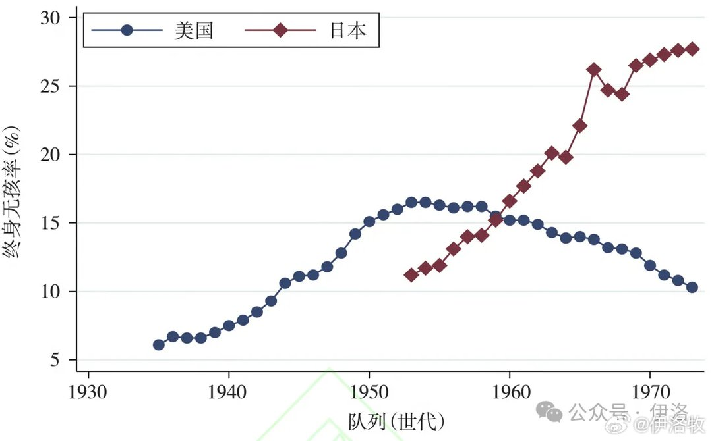

---

## 9

@胡锡进

发表于：2026-05-19 12:45

来源：微博

链接：https://m.weibo.cn/status/5300389260037129

电影《监狱来的妈妈》引起网上激烈争议，看样子要撤档了。这部片子虽然是经过正式批准拍摄的，但从报道看，它存在多个问题。它做了虚假宣传，谎称主人公本色出演自己的真实经历，但其实这是个改编故事。演员本人用水果刀捅死丈夫并非由于遭到家暴，而是因为一般争吵。

通常情况下，老胡是不主张一部电影的命运由舆论来决定的。舆论往往很激烈，容易突出放大一方面的问题，之前已经有过网上激烈舆论导致即将公映电影被封杀，以及整档娱乐节目停播的情况。我的总体意见是尽量包容对待文艺创作，能宽则宽，这对文艺繁荣，对维护党领导宪法秩序下的社会宽松和自由是有好处的。

但是具体到《监狱来的妈妈》这部电影，各方批评指出了它的多个问题，特别是女演员作为服刑人员拍故事片的资格问题（涉嫌违法），我认为都是成立的。至于这些问题是否构成封杀它的充分理由，我主张由主管部门定。这是一个很特殊的案例，但由一名杀人犯本色出演在监狱里接受改造以及重回社会的全过程，服刑期间就开拍，这样可以吗？有关部门应该有权威结论。

如果有关部门决定下架这部电影，老胡是不会反对的。但是我也看到一篇10万+的文章，主张“守护家园，从抵制这部为洗白杀人犯的电影开始”，我觉得它太激烈了。我觉得这部片子肯定有问题，但不建议轻易搞诛心之论。

再说一遍，网上的反对理由都是成立的，这部电影使用演员的尺度在法律、道德方面都值得争议，如果有关部门决定下架它，老胡不反对。

---

## 10

@西门大妈

发表于：2026-05-19 09:36

来源：微博

链接：https://m.weibo.cn/status/5300341576304876

我有限的经验是，如果你要读研读博，尽量选择导师有个正常家庭的，不管是男是女。也就是导师有家庭有孩子，有个人生活。因为这种人大概率比较好相处，经历的社会事务也多，比较不容易钻牛角尖。当然单身的也不是完全不行，比如年轻一些的老师，单身也很正常~

最麻烦的是啥样的呢？丁克夫妻店。看好了，不是丁克，也不是夫妻店，必须要两个叠加起来~就是夫妻俩超过一定岁数（比如40），没孩子，也不打算要孩子，而且夫妻俩的方向重合或者交叉，总之就是你帮我我帮你这种关系。夫妻俩处于毫不相关行业，互相基本不影响的不算~

不要问我为啥，记住这个结论，千万不要挑战，后悔就晚了~

---

## 11

@白饭如霜

发表于：2026-05-19 08:22

来源：微博

链接：https://m.weibo.cn/status/5300323159382425

\#妈咪略懂一些拳脚\# 上海交大女生那件事，我跟谢小宝聊了一下事情背景，就是两个人怎么搭档参加比赛，然后得了奖金5000，怎么分工的，其他没说。

我问她：“如果你是这个女孩子，你会怎么做。”

谢小宝说的是，她已经得了奖，钱根本不重要，所以5000会全部给搭档的这个男孩子，她还会让对方请她吃顿饭，大家一起庆祝一下得奖，然后说下次我们有机会继续合作，估计对方没有不同意的。

我说善，这个处理方式很好，既考虑到了短期利益，也考虑到了长线策略。

然后我换了一个变量，假设说这个女孩子家里是有关系的，就是靠关系才得到这个奖，具体技术工作其实是其次重要的，那还要把5000给搭档吗。

她的反应很直接：如果我家里有这么硬的关系，我为什么还需要这5000块钱？我只需要有人帮我去拿奖就可以了，不是更应该把钱给对方吗，毕竟再有关系，也要做个东西出来啊，我又做不了。

你看，这就是朴素的人际护航理论，每个人都有自己的资源和需求，以自己的资源，换取其他人的，以满足各自的需求，这就能建立长期有效的护航队伍，不断给你带来利益。

只顾自己的人，长远来看往往会损失更多，因为不可能有人独立占有一切资源。

（尽可能）公平的交易理论是人际关系良好运转的基础。

---

## 12

@卡夫卡做晚餐

发表于：2026-05-18 07:05

来源：微博

链接：https://m.weibo.cn/status/5299941292641571

是学历贬值，是优绩主义，是A8A9，是博士清北但本科双非，是QS前50，是经济下行，是留学镀金，是不婚主义，是创一代，是紫人与绿人，是社达与社畜，是高敏感，是回避型，是认知觉醒，是大女主人设，是罗永浩的十字路口，是岩中花述，是奥德赛，是ADHD，是审美积累，是token，是AI大模型，是情感模式，是课题分离，是前额叶，是客体需要，是主体性，是摆脱性别叙事，是少年心气，是要爱不要钱，是性压抑，是原生家庭，是阶层滑落，是精英幻觉，是县城做题家，是小镇贵族梦，是中产返贫，是一线城市祛魅，是消费降级，是精神内耗，是低欲望社会，是脆皮年轻人，是gap year，是gap life，是松弛感，是班味，是爹味，是妈味，是祛魅，是祛魅后的空心，是赛博功德，是电子榨菜，是信息茧房，是情绪价值，是亲密关系去中心化，是搭子文化，是弱连接，是强孤独，是crush，是暧昧上头，是已读不回，是边界感，是安全感，是创伤反应，是依恋类型，是MBTI，是NPD，是PUA，是Gaslighting，是戒断反应，是戒色，是戒糖，是戒短视频，是多巴胺陷阱，是皮质醇爆表，是血清素不足，是健身房续命，是冰美式续命，是褪黑素续命，是人生重启，是自我叙事，是宏大叙事崩塌，是个人品牌，是LinkedIn精英，是小红书人生，是TikTok算法，是X上暴论，是YouTube长视频，是播客疗愈，是知识付费，是AI副业，是独立开发，是一人公司，是数字游民，是远程办公，是Prompt Engineer，是产品经理宇宙，是UX/UI，是Notion人生管理，是Obsidian第二大脑，是读博还是创业，是进大厂还是润出去，是新加坡，是瑞士，是香港，是伦敦，是纽约，是湾区，是苏黎世，是阶层跃迁，是身份焦虑，是语言羞耻，是文化断裂，是东亚小孩，是西方幻梦，是自由主义疲劳，是保守主义回潮，是世界右转，是地缘政治，是债务周期，是美元霸权，是AGI焦虑，是文明黄昏，是精神贵族，是情绪破产，是恨海情天。

---

## 13

@包容万物恒河水

发表于：2026-05-19 11:55

来源：微博

链接：https://m.weibo.cn/status/5300376710682815

🔻我在长影评里也说了，《给阿嬷的情书》是一部极其简单的电影，没有过于复杂的道理。

🔻这部片最可贵的就是进行了大量的删减，几乎所有可能会引发争议和歧义的剧情点基本都删掉了，连人性的矛盾点都没有保留，最后呈现出来的是一种简单而纯粹的情感，成片几乎不掺杂任何个人情绪，是接近童话的真善美。

🔻再强调一遍，《给阿嬷的情书》是一部极其简单的电影，因为她摒除了一切没用的东西，整片就讲两件事：

🔻一是劳动，二是共情。

🔻“人一定要有情义”，所以纯粹。

🔻这是删减掉的片段之一，你可以感觉到，创作者为了让表达的感情更纯粹，在克制中剥离了多少繁杂的东西。

\#给阿嬷的情书 删减的最后一封信\#\#给阿嬷的情书 先骗来演了再说\#\#热点现场\# 包容万物恒河水的微博视频

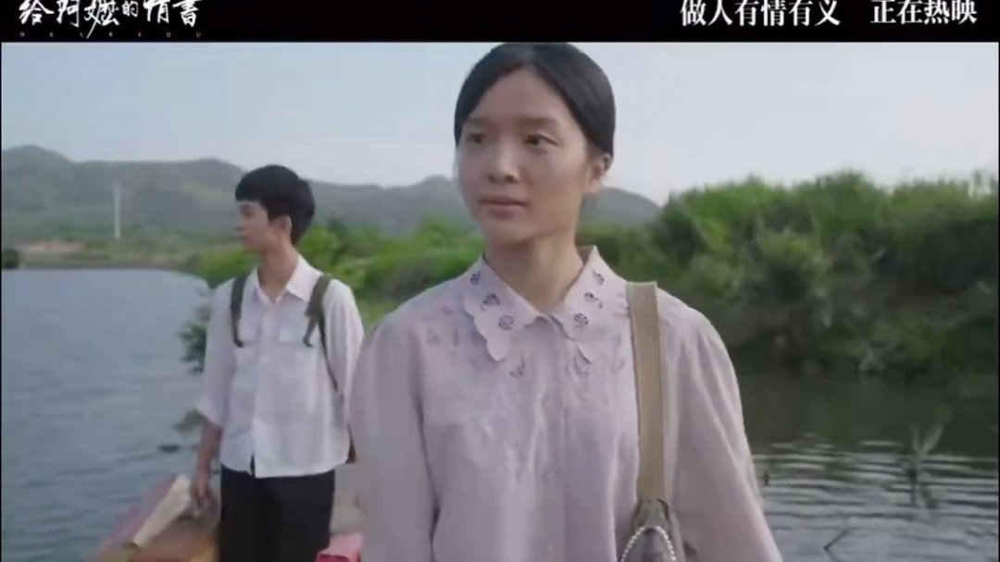

---

## 14

@林岳芳

发表于：2026-05-18 21:36

来源：微博

链接：https://m.weibo.cn/status/5300160436371522

用颠倒黑白的方式，为一个杀人犯洗白。

邀请还在服刑的犯人，担任电影主演。

让受害人家属出面，为杀人犯助力。

把这种严重毁三观的电影送到国外参展并拿奖。

如果不叫停，5月30号，这部为杀人犯鼓与呼的电影，将在我们的影院遍地开花了。

如果不叫停，将会有多少女性受其影响，拿起利刃刺向丈夫的胸膛？未可知。

如果不叫停，杀人可以名利双收的诱惑，像一颗种子，从此将根植在大众的心里。

我只想知道，这部影片的背后，是哪一只黑手？

他们，想干什么？？？！！！

\#监狱来的妈妈\#

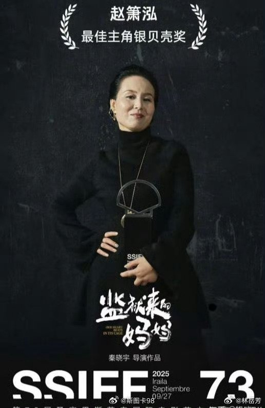

---

## 15

@挨踢牛魔王

发表于：2026-05-19 09:38

来源：微博

链接：https://m.weibo.cn/status/5300342251328446

词向量空间的理论是分布假说，其实已经不是假说了，是真实的了。

简单的说，就是你知道了一个词的朋友，你就知道了这个词。

那么财富，也是符合这个假说的。

你的财富，取决于你周边的朋友。

因为赚钱是一个系统工程，需要方方面面的协作。

比如你是一个厂长，你的上游，下游，必然也是老板。

你必须和他们合作，你这个厂才能运作起来。

那么他们大概率是和你有同样量级的财富。

你是搞AI的，你周边的朋友大概率也是搞AI的，搞互联网的这种。

这就是物以类聚人以群分。

那种茕茕孑立，在一帮穷朋友中间，突然变得有钱的概率极小。

即使发生了这种事情，比如中彩票之类的，你的朋友圈也会逐步变成和你财富等级相称的朋友。

如果你身边都是一些穷朋友，你们怎么协作，也很难获得大的财富。

所以，你要发财，还是要多交有钱的朋友，单打独斗是很难成功的。

---

## 16

@伊利达雷之怒

发表于：2026-05-19 07:38

来源：微博

链接：https://m.weibo.cn/status/5300311862545482

《监狱来的妈妈》最变态的一点其实不是让杀人凶手演杀人凶手，而是让死者的儿子演死者的儿子。

我觉得比上岛的那部分人还变态。一般人真想不出这么诛心的玩法。很难想象那个11岁的少年将来得知全部真相以后如何面对自己。

高领主们最多是追求肉体欢愉，而这电影的制作方，简直够资格原地升魔，侍奉奸奇了。

---

## 17

@刘晓光Savvy

发表于：2026-05-18 05:03

来源：微博

链接：https://m.weibo.cn/status/5299910658229597

如果把《西游记》里的法力理解为「权力」，把战斗理解为武力。

原著里很多不通的地方就迎刃而解了。

比如文殊菩萨，得罪了乌鸡国王，被侍卫给捆了，泡河里泡了三天三夜。

再比如太上老君作为创世神三清之一，被孙悟空推了一下，栽了个倒栽葱。

但是如果你把这些人理解为大明的文官，张居正徐阶严嵩这些人。

孙悟空就是齐大柱这种人。

那迎刃而解了。

如果真的论掌控力，10个孙悟空都不如太上老君。

但如果是遭遇战突然遇到了，那太上老君就要被孙悟空给痛打了。

孙悟空为什么大闹天宫时候厉害，但是取经路上总是吃瘪。

就是因为取经路上权力的延伸更加明显。

大闹天宫时候都是遭遇战，相当于巡抚总督，孤身一人走路上，遇到流氓了，除了被流氓揍一顿没有别的办法。

取经路上难缠的妖怪，基本就两种。

一种是神仙派来的，法宝什么的都有，准备充分。

这个就相当于流氓遇到了一直精良特种部队，肯定打不过。

另一种是民间的野生妖怪，没后台，特别厉害。

这也简单。

流氓遇到了本地黑社会团伙，再厉害的双花红棍也要吃瘪。

西游记的法力，神仙，我一直觉得是权力的具象化。

权力不能用来直接战斗，只能在法宝宠物准备到位的情况下，对人才有碾压之力。

法宝宠物，就类似锦衣卫，巡捕，军队这种暴力机构。

---

## 18

@刘晓光Savvy

发表于：2026-05-18 03:15

来源：微博

链接：https://m.weibo.cn/status/5299883507453500

会员群内提问：

问题：为什么人际关系很难沉淀下来，离开特定场景就断了？我看了奶爸的微博、报名了沟通训练营，学习人际关系方法，确实改善了我在职场的关系，跟领导同事们关系融洽，但是我换了工作后，就很少有来往了，关系就断了，包括和大学同学也是。这是正常的吗？但有些人似乎离开了也能跟其他人保持朋友关系。

答：

这个是很多人生活的一个小误区。

大部分人把金钱看作成本，

但是自己的时间，精力，思维，情绪，不怎么看作成本，甚至没有成本投入，收益回报的这个概念。

为什么职场中结交的人际关系很难沉淀下来？原因就在这里。

提问者没有成本付出的概念。

你在同一个环境里，每天碰面打招呼，这个成本公司自然而然的帮助你提交了，自然就会收获到人际关系。

你离开了公司，无法在付出这个时间，微笑的表情等这类成本了，自然而然的人际关系也就淡了。

你想离开公司，还能把所谓的人际关系「沉淀」下来，那么就必须得靠持续的成本付出。

但有些人似乎离开了也能跟其他人保持朋友关系——这是怎么做到的？

一般能做到这点原因挺简单，就是这些人持续的付出成本，继续保持一个紧密的交流，把时间，精力，还有金钱依旧为过去的朋友付出。

这个时间也不是那种特别庞大的时间，而是pyq的点赞，留言，打气，节假日的问候等等，就这么点时间付出了，所以就能保持基本的泛泛之交联系。

但是在这个时候，您又要在新的公司上班，每天很多事情要忙，又要沉淀过去的人脉，甚至还要沉淀大学时候的同学人脉。

这时候当然会感觉心力交瘁，力不从心。 

所以怎么办呢？

精挑细选+强迫社交。

强迫社交的意思就是，不要一到休息日就自己一个人待着，常年都如此。

如果你不想沉淀人际关系，那一个人待着挺好，我不废话。

但你又想要沉淀人际关系，又想一个人待着。

你这么提问，不就成了故意找茬么。

想要沉淀过去的人际关系，就得强迫自己社交。

不要求每周都出门，但是2周至少要出门一次。

出门干嘛呢，约过去的朋友什么的，出来喝喝茶，逛逛公园什么的，聊聊天，谈谈过往。

还有节假日，回老家或者出差到新城市，主动邀约大学同学，拜访拜访老朋友，发小之类的。

主动的去投入这些时间精力以及金钱成本，才能维护好人际关系。

这个时候会出现下一个新问题：

人太多了，我的时间有限就那么点，怎么办？

所以要精心筛选。

筛选的标准是什么？

我个人不建议筛选意气相投，意气风发，志趣一致的人。

这种标准很浪漫，但是也很危险。

《红星照耀中国》里，教员提到他在少年时期结交的朋友，有过完整的统计。

关系较好的，10几位，全部路线分歧，不再来往。

关系亲近的一共有6人。

首先是大名鼎鼎的湘江三友：

蔡和森，牺牲。

萧子升，性情大变，极端反动，二人公开决裂。

然后是罗章龙：公开背叛分裂叛党，被开除党籍，从此彻底决裂。

再然后是两位不知名的小朋友，教员不肯说他们名字，只说变成了极端反动的青年，老死不相往来。

最后仅剩一人成为终身挚友，周世钊。

1/16的成功几率。

教员的少年经历其实足以说明，以志趣相投来交友，风险还是非常高的。

而且教员能够不受戕害，是因为他是天命之子，运气好。

如果普通人没有天命，身边朋友的志趣悄悄变了，把他给揭发检举了，那他就完了。

顾顺章当年出卖的同志，为数可不少，这些人这辈子只做了一件错事，就是结识了顾顺章。

所以筛选人际关系的标准，其实只有一项：

就是资源，利益。

过去的大学朋友，如果你觉得还有点资源合作的可能，那就联系。

如果基本没有，那就不该来往，包括ta婚礼什么的做事邀请你去随礼金，也不该去，因为纯浪费钱，不会有任何收益。

我甚至可以放一个暴论。

如果你的大学是顶级985学校，那么你跟同学搞好关系还有一定的必要，比如我有个亲戚是北大毕业的，他跟大学几个朋友至今保持很亲密的关系，因为他的大学同学都已经是我们市的三甲医院副院长，主任级别的了，家里有老人需要看病都得联系这些大学同学。

但如果你的大学不是什么顶级985，那基本上可以说你的同学屁用也没有了，老死不相往来就应该是对的，就不该来往，来往纯属浪费时间浪费精力。

你的这些同学不会在社会的任何一个位置上，有任何半点的价值，有任何的发光发热，对你和家人不会有任何助益。

你的所有一切需求，只能靠自己。

在这个时候，工作结交的人际关系远比大学重要。

而你在选择工作人际关系时候，也应该选择你认为能力比较强的，比较厉害的，最起码资源多的，比如他之前的公司和之后跳槽的公司好，可以帮你内推的这种。

多以资源和利益去评价他人，同时也提升自己的资源和利益，时刻有资本可以交换。

这种思维才是基本的社会化思维，也就是本身有player的自觉，有玩家思维。

没有玩家思维的人，本质上就不是一个社会化程度良好的人，他就不适合搞人际关系。

---

## 19

@作家陈岚

发表于：2026-05-18 15:15

来源：微博

链接：https://m.weibo.cn/status/5300064567428267

\#姚晨方回应\#

这个事吧，只能说制作方踩错了风口。宣发踩中了雷点。（宣发似乎并不知晓现在不能用性别对立叙事，很容易两面不是人）

作为一个真正的关注女性权益的人，几乎是全程沉浸式体验了“女权”两个字如何被毁掉的。

中文网络上对于女性权利最宽容的顶峰是2018-2019，那会儿，为女性发声是绝对的政治正确。很多男性博主都迫不及待表露自己的女性主义立场。可以说，不积极主动帮女性讲话的博主，基本上会被当“野蛮人”低看一头。 

我不清楚从什么时候出问题的，以及在哪儿开始发育出一坨一坨的以“女拳”为食的疯蛆的，据说是有几个大本营，疯狂给现实受挫和情感困扰的女性群体大脑下蛆，千言万语浓缩成一句话：“妳的不幸都是男人造成的，干死他们，不顾一切不讲道理不尊重事实，只要干死他们 你就会得幸福！”

2019年我在微博上遇到一次分水岭。有人重新讨论一个“女大学生独吞父母全部遗产，把2岁弟弟迅速送人”的（很可能是虚构）案例。

我说了一嘴再普通不过的话，意思是太残酷了，既然都拿了全部遗产（谁也拦不住你），哪怕把弟弟妥善找个好人家送了，定期不定期回访（对流浪猫尚且如此对吧），也行啊。

这句人话，引发了至少数百甚至上千的女网友对我的围攻，有一个我很熟悉的女网友甚至暴怒说：不弄死那个小逼崽子就很不错了，给他吃喝没饿死他还给他找个地儿，很对得起他的。”

我对这个女网友很了解。她有一个备受虐待也是亲弟弟霸占较多资源的童年。（她现实里和弟弟关系并不差，只是有股恨意，在互联网发泄）

那一刻，我意识到，肯定有人在有组织有计划地利用很多女孩童年创伤、原生家庭问题、以前的重男轻女的社会文化结构性问题，制造整个社会的撕裂。

他们/她们所图者甚大，并且手法高超。

她们的话术绝对精准地打动这些现实受挫的女孩，让她们认为最好的出路就是“利用/摧毁男性”。

韩国女性有一段时间就发疯一样，在网络上鼓励堕男胎儿。国内也不是没有人在暗暗传播这些极端思想。

在那之后，极端女权已经越演愈烈，直接演变为身份政治：“凡是女孩干的，哪怕是犯罪也支持。凡是男的干的，哪怕是无辜的也挑刺儿给他按上帽子。”

那真的是山雨欲来啊……

老实说，普通人，一个普通的博主，能干啥啊，只能提醒自己提醒自己的读者：

万万不要被煽动，不要被洗脑也不要贪图流量去跟风讲极端，那种唯粉确实很给力，说难听点，很多博主特别喜欢这样的无脑易被鼓动的粉，甚至精准洗粉，固粉，就为了留下这样的极端粉，因为是上好韭菜啊！

但我不想挣这个钱。也不想要这个流量。

而且我真的是没有办法说出“我自己都不相信的那些屁话”的。

说白了，实事求是，用事实说话，可能比较安逸一点吧，从良心到大脑，到现实生活。

2019-2026，越来越多的博主在察觉到舆论场被各种女性谎言利用。（并不是男性群体没有谎言事件，只是大型热搜中，女性利用公众同情心的谎言事件案，比例太高了）

坦白地说我再再再再提高警惕都被“女性受害人”利用了好多次同情。真打脸啊。

她们的模式是“利用女性受害人身份，掀起舆论，倒逼司法机构同情，然后取得特权”，“利用女性身份，先射箭再画圈儿，掀起舆论，倒逼博主/公司/商家/平台/机关，按照自己喜欢的行事。大家围观一下某文学平台的女拳文字狱就知道了。就跟下蛆养蛊一样，一个字一个字扣着字眼儿围攻说作者不爱女。硬生生就是把文字圈儿玩出了职业技校小太妹抱团霸凌找茬的现场”

有的是用舆论逼迫司法机关按她们的诬告行事，有的则是用舆论和公众同情心敛财。有的则是什么都不为就为了霸凌或抱团毁掉自己看不顺眼的人。

当年那些搅得天翻地覆的“受害人”，最终被证明是诬告诬咬的，没有一例进去的。没有一例是真正付出痛苦的代价的。

舆论场开始反噬。大约三四年前，就我观察到的，大量的男性网友开始拒绝做沉默的大多数，向敢挑头反女拳的男博主靠拢，并开始集结。

一有风吹草动，他们也开始组团。

武汉大学图书馆事件就是一个分水岭。

同期还有一个现象，几乎所有的不支持极端的女性博主，都被“开除女籍”。

我个人就被开除过至少一万次。

再发展，强调“女性要自我负责，不要把不幸福甩锅给男性”的女博主也被打成媚男。

普通女网友但凡流露与男性关系友好，都会被踩被开除女籍。哪怕是写自己和父亲关系好也是罪过，

结婚有孩子的则是婚驴。

有男朋友的则是慕男媚男渴D………

不要彩礼相信真爱的就是贱婢，赔钱货………

我记得我总结过很多次，所谓女拳已经演绎成一个互联网催生的“拜金主义+物化女性+封建巨婴的缝合怪”。

和当年我驳斥过的极端男权有啥区别呢，甚至有过之而无不及。一个硬币的两面，都是觉得自己有个性器官就自带天神buff呗。

反噬一定会到来，普通女性会因此受害。

比如利用生育优惠政策法规坑企业的多了，最终会影响女性就业。

利用婚恋割男方韭菜的多了，最终会影响女性通过婚姻恋爱实现阶层跨越，阶层壁垒和男性财产的保护防御系统，将会越来越僵硬。

假强奸案多了，真正的强奸受害人就得不到重视和同情。

比如这个《监狱来的妈妈》，假受害人多了，真正的家暴受害人就被污名化，发声空间必然被堵塞。

早在2019，这个片子是可以浑水摸鱼过关的。那会戴上“反家暴”“反性侵”“me too”，那就是拿了尚方宝剑，见神杀神。

质疑声成不了气候就被拍死。bug在，但无法发酵，没有群众基础。

现在是完全不行了。露头就被揪住马脚痛打——而吃过了那几年红利的很多人，路径依赖，她们很多人根本就不在乎马脚，因为她们经历了太多次漏洞百出指鹿为马的谎言依然可以大行其道的成功先例。即使暴露也只留下一句“即使我骗了你们，你们又有什么损失呢？我也没请你们来支持我啊”

于是，反噬的群众基础就夯的很厚实了。

几乎过去多年的愤怒、积怨、对虚假事件操控性别政治的不满，全部在这个电影上集结，连一丝妥协的可能都不具备，最终只能下架。

这就是一个正在发生的事实。

---

## 20

@2049年的世界

发表于：2026-05-19 00:05

来源：微博

链接：https://m.weibo.cn/status/5300198067671401

对发展过程的总结概括全面。女权演化到今天可以说是必然的：女权主义的整个思想体系中充斥着极度混乱、自相矛盾、双重标准，完全靠非理性的情绪才能聚合，因此内部必然竞相“极化”，竞相让自己的赎罪券更便宜，让信众更爽。爽是第一位的。因此才会做出“坐在树杈上砍树杈”的疯狂行为。

---

## 21

@大河报

发表于：2026-05-18 23:09

来源：微博

链接：https://m.weibo.cn/status/5300183791568496

【律师解读：\#监狱来的妈妈涉嫌违法\#】5月19日，@大河报 报道“监狱来的妈妈主演服刑期参与拍摄”引发关注。据悉，电影《监狱来的妈妈》主演赵箫泓在2019年服刑期间参与拍摄，而影片是在2021年备案立项。对此，@大河报 记者采访多名律师作出解读。

1.服刑人员能否参与商业电影拍摄？

北京安剑律师事务所@周兆成律师 表示，原则上绝对禁止，仅允许非商业性改造相关活动。《监狱法》明确，监狱所有活动必须服务于教育改造目的，不得用于商业盈利。这起事件中，赵箫泓于2019年拍摄时仍处于服刑期，担任商业电影主演并参与盈利性发行，明显超出法律允许范围。

2.如果报备纪录片，实际拍商业片是否违法？

周兆成表示，监狱拍摄实行严格审批制，所有进入监狱的拍摄活动必须提前报备目的、内容和用途，且必须与审批一致。假如制作方最初以"拍摄监狱教育改造纪录片"申请司法部审批，实际却将素材用于商业故事片制作，既违背了审批的公益目的，也违反了监狱管理的强制性规定，扰乱了正常监管秩序。

3.先拍摄后备案是否违法？

周兆成表示，根据我国《电影产业促进法》相关规定，拟摄制电影的法人、其他组织应当将电影剧本梗概向国务院电影主管部门或者省、自治区、直辖市人民政府电影主管部门备案。也就是说，该法明确规定备案不得倒置。该片2019年开机、2021年才完成备案，属于典型的“先拍后备”，违反《电影产业促进法》的法定前置程序。\#汪涵为何沉默数日才发声\#\#多人与监狱来的妈妈切割\#（大河报豫视频 原创记者杨光） 《监狱来的妈妈》拍摄完成当年才备案立项，律师解读

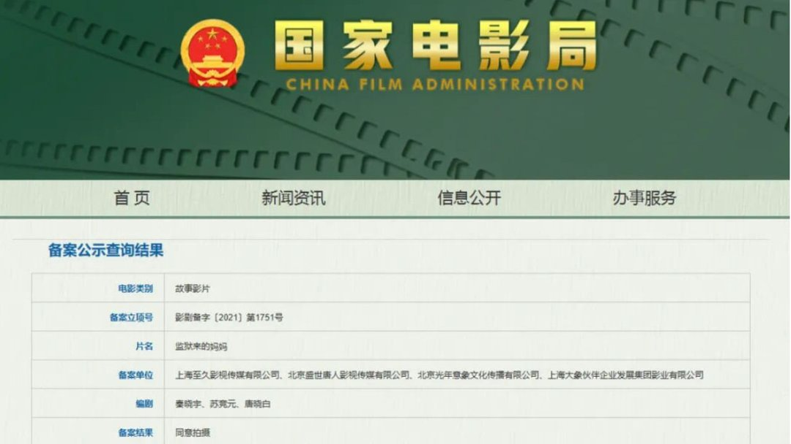

---

## 22

@胜利主义章北海

发表于：2026-05-18 09:52

来源：微博

链接：https://m.weibo.cn/status/5299983219688560

《监狱来的妈妈》之后，任何一个监狱都不可能再轻易配合拍摄犯人改过自新题材的电影了，因为不知道主创会不会又像这次一样玩幺蛾子。

那些真的因为无法忍受家暴过失杀人伤人的女犯人没有机会再讲述她们的故事。甚至，经过这次的事之后，很多网民会拒绝同情因为无法忍受家暴过失伤人的犯人。

集美们再一次上演了“前人砍树后人暴晒”的传统艺能。 \#曝监狱来的妈妈撤档\#

---

## 23

@李鲆

发表于：2026-05-17 21:32

来源：微博

链接：https://m.weibo.cn/status/5299797151449802

做个预判：\#监狱里来的妈妈电影\# 全面扑街，大概率在上映前就被勒令下架，即使上映也是巨亏。

会有主流媒体发文定性：不能用艺术创作洗白犯罪，挑战司法权威。

主创会被追责，几无翻身机会。

相关部门也会被追责。 

立此为证。 \#抵制电影监狱来的妈妈\#

---

## 24

@嘉铭俱博

发表于：2026-05-19 11:08

来源：微博

链接：https://m.weibo.cn/status/5300364756915973

\#监狱来的妈妈出品方已注销\#

       《监狱来的妈妈》影片公演前夕风波四起，舆论谴责与网络非议集中涌现，正式公演前出现这般巨大变故，究其根本，是编导、制作方与全体主创在艺术创作反映现实生活层面，存在严重认知偏差与创作误区。

        该片刻意回避法院对此案作出的权威判决与事实定性，刻意模糊案件完整经过，尤其在家暴情节的刻画上脱离实情。主创团队始终对外宣称影片内容大多取自原型主人公亲身经历，却从未将片中情节、人物线索与真实案件的逻辑脉络逐一对照核实，这也是如今各方都难以接受、无法妥善收场的核心缘由。而酿成当下被动局面，根源便是制片方、主创及主演急于求成、急功近利的心态，最终致使影片宣传严重偏离事实。

        倘若主创团队在公开场合表述的相关素材，能够与案件真实情况基本吻合，正视客观事实，影片本不会陷入如今的舆论困境。其二，此案司法定性清晰明确，一审判决早已写明夫妻二人平日相处和睦，邻里证人证言也可佐证二人日常关系平稳，全程无任何家暴伤情记录、警方出警记录以及妇联求助投诉相关凭证。即便二人之间存在些许情感隔阂与冷暴力，也绝无影片大肆渲染的实质性家庭暴力行为，影片刻意放大悲情色彩，塑造悲情受害者形象，剧情演绎与原型人物真实境遇相差甚远。

        再者，影片后半段刻画主人公入狱后积极改造、励志向上的情节，塑造其坚守本心、始终牵挂孩子、狱中努力改造成功减刑、出狱后重拾生活的人物形象，单从剧情立意、人物塑造与励志主题表达来看，本无可厚非，完全契合艺术创作规律。艺术本就源于生活，可对现实素材进行提炼加工与艺术演绎，但主创团队犯下最致命的错误，便是将现实中本不存在的情节肆意放大渲染，还强行将虚构情节套用到真实原型经历之上，彻底违背艺术创作恪守现实底线的基本原则。这般脱离事实的艺术改编，等同于变相否定既定生效的司法判例，无论是从司法严谨性、社会公序良俗还是大众舆论层面，都难以被大众所接纳。

        除此之外，案件真实经过与影片演绎存在本质区别，当事人行凶源于日常家庭口角引发的冲动争执，依据警方出警记录与法院裁定书完整案情记载，当事人主动持水果刀刺向被害人，并非影片演绎的遭受家暴后慌乱失手伤人，二者行为性质截然不同。而影片主创刻意混淆两类行为概念，无视司法判决认定的客观事实，一味采信原型人物主观情绪与片面说辞，借影片剧情为其博取同情、抒发内心不满，试图借此推翻既定司法定论，足以见得影片创作初衷与核心导向存在严重偏差。

        退而言之，若影片仅单纯挖掘正向社会价值，区分艺术剧情与现实原型，不将影片虚构的家暴剧情和扮演者真实生活经历混为一谈，主创与宣发方在对外宣传时，严守创作边界，不把虚构剧情当作真实经历大肆传播，影片原本能够顺利正常上映播出。归根结底，正是现实中原型人物并无实质家暴遭遇，影片却对此进行过度艺术渲染与虚假改编，才一步步引发如今的舆论乱象。

       《监狱里来的妈妈》中影片女主形象，与现实里的饰演者本人本不该等同绑定。演员借这部影片为自身遭遇申诉委屈、诉说不平，制片方则顺势依托演员所谓真实经历造势，借此烘托影片热度，撬动大众关注度来助推影片出圈。

        可如今这般双方互相借力、彼此背书的做法，最终反倒陷入了无谓的逻辑矛盾，直接违反主流的思想，挑战法律的底线，最终酿成了自作自受的尴尬局面。

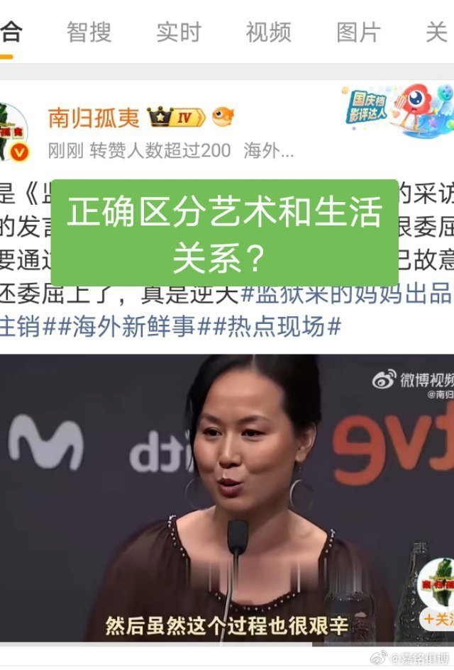

---

## 25

@巍岳钦禹

发表于：2026-05-19 07:02

来源：微博

链接：https://m.weibo.cn/status/5300302938114573

一部影片，偷偷的拍，偷偷的审，又偷偷的拿到海外参奖。本以为挟洋自重，可以在国内装逼，结果倒在了国人正确的三观之下。监狱来的妈妈应该称之为事件，可以定性为一起严重的事故。相关出品人员全部封杀，涉及到的有关部门人员全部追责。如果这个事件要姑息了，往后就越来越难管了。 \#监狱来的妈妈涉嫌违法\#

---

## 26

@蓝桉遇牛油果

发表于：2026-05-19 10:02

来源：微博

链接：https://m.weibo.cn/status/5300348245247399

\#近9成投票网友希望监狱来的妈妈撤档\#

这种电影能上映简直是对中国司法、电影圈的挑战。

拍摄期间就在监狱里而且说以纪录片形式最后却是电影，不知道怎么过审的，打着真实事件改编、反家暴的旗号博同情、拿奖项，结果被扒出篡改司法事实，把因家庭琐事故意伤人致死的案子，包装成长期被家暴、失手反抗的悲情故事，连刑期都乱改，这已经不是艺术加工，是颠倒黑白了。

钻规则漏洞让服刑人员拍商业片，底线直接踩空。观众抵制不是苛责，是不能接受美化罪犯、欺骗大众。而且是踩着法律和事实的红线，那如果这样，很多污点演员又开始蹦跶了，到底约束了谁啊。

近9成投票网友希望监狱来的妈妈撤档

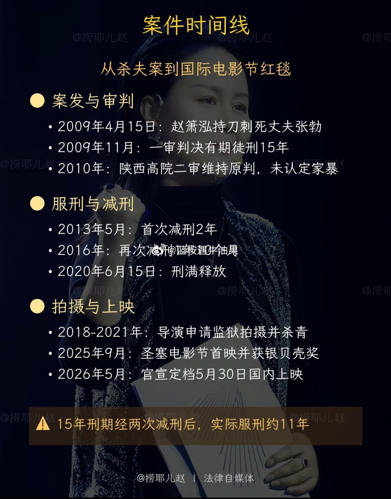

---

## 27

@宝玉xp

发表于：2026-05-19 15:37

来源：微博

链接：https://m.weibo.cn/status/5300432596639782

Andrej Karpathy 刚刚在 X 上宣布加入 Anthropic。

这位 OpenAI 联合创始人、前 Tesla AI 总监、“vibe coding”概念的提出者，选择了 Anthropic 作为自己的下一站。他在帖子里说得很直接：未来几年前沿大模型的发展将格外关键，他想回到一线做研发。

了解 Karpathy 最近动态的人不会太意外。今年 1 月他公开表示自己的编程工作流发生了 20 年来最大的转变，从 80% 手写代码变成了 80% 用 Claude Code 的 AI agent 驱动。他总结的四条 AI 编程原则，被开发者 Forrest Chang 整理成一个 CLAUDE.md 配置文件，在 GitHub 上拿下了超过 22 万颗星，是今年增长最快的开源项目之一。某种程度上，他已经是 Anthropic 生态里最有影响力的外部布道者了，现在只是从"编外"变成了"编内"。

Karpathy 的履历在 AI 圈几乎无人不知。他是 OpenAI 创始团队成员（2015-2017），后来去 Tesla 领导 Autopilot 视觉团队五年，2023 年短暂回归 OpenAI，2024 年离开后创办了 AI 教育公司 Eureka Labs。他在斯坦福开设的深度学习课程 CS 231n 是该领域最经典的入门课之一，YouTube 上的"Zero to Hero"系列至今仍是很多人学 LLM 的第一选择。他在帖子中也提到，教育方面的工作会继续推进。

Anthropic 这两年在人才争夺上动作不小。2024 年，OpenAI 对齐团队的 Jan Leike 和 John Schulman 先后加入，现在再加上 Karpathy。

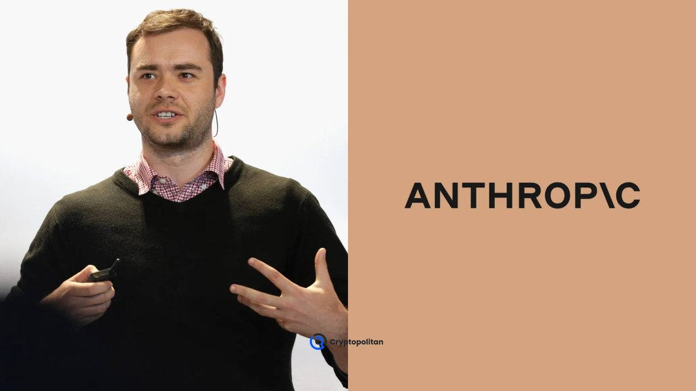

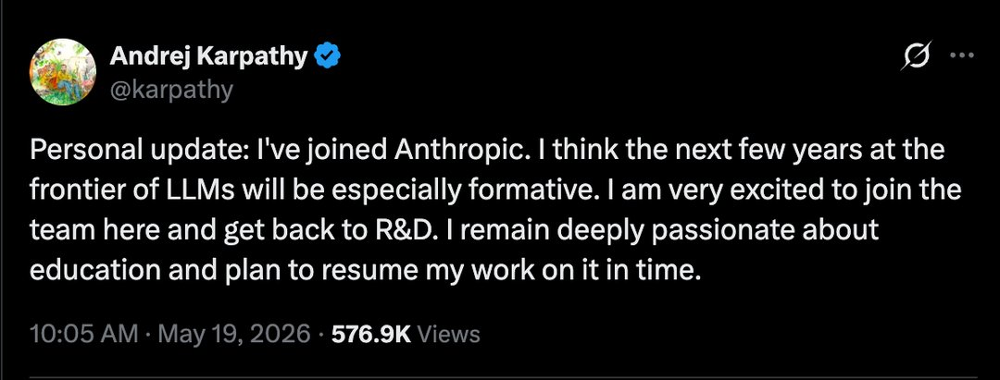

---

## 28

@高飞

发表于：2026-05-19 15:31

来源：微博

链接：https://m.weibo.cn/status/5300431066761706

\#模型时代\# 好家伙，这是个Big news吧。

Andrej Karpathy：

个人动态：我已加入 Anthropic。我认为未来几年在 LLM 前沿领域将尤为关键。我非常兴奋能加入这里的团队并重返研发工作。我依然对教育充满热情，并计划适时重启相关事业。

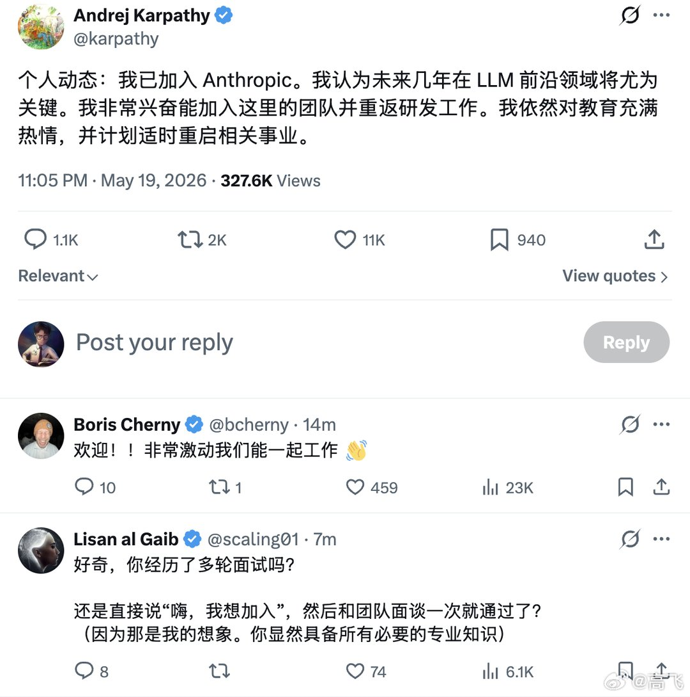

---

## 29

@李雪爱与自由

发表于：2026-05-19 14:05

来源：微博

链接：https://m.weibo.cn/status/5300409255854179

\#监狱来的妈妈 汪涵\# 赵萧泓这个眼神，是特别经典的冷血NPD眼神，她没有发展出同理心的脑神经回路。

但是在日常生活中，她能够正常工作和社交，甚至可以为达成目的，展示出高超的社交能力。

电影海报，是她权力感的巅峰展现 ：我杀了人，还能成为明星，再污名化受害者。所以这个时候她的冷血NPD眼神藏不住了。

但平日里，她能够收起这种权力感的傲慢眼神，圆滑处世。

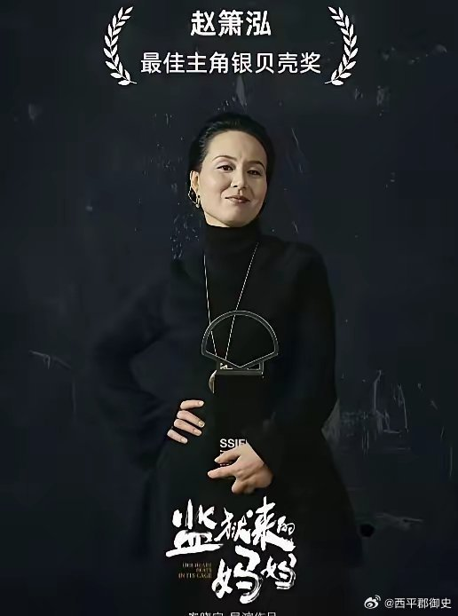

---

## 30

@幻想狂劉先生

发表于：2026-05-17 08:38

来源：微博

链接：https://m.weibo.cn/status/5299602242142758

这是一篇被媒体朋友们集体婉拒的文章：“保护动物这一行为本身并非不可取。相反，在整个文明世界范围内，善待动物都是传统美德。在儒家看来，是“仁心”的外化；在西方传统中，是“管家责任”的体现。但当这一切被政治化、意识形态化，并通过法律强加于全社会时，它就不再是美德，而是一种对社会结构的侵蚀。问题的本质从来不在动物，而在于是否允许一部分人，将自己的私人情感投射，上升为对所有人的强制性规范。如果答案是允许的，那么今天是“伴侣动物”，明天就可能是其他任何形式的情感立法。而一个少部分人可以以法律形式强迫他人接受自己私人情感投射（比如“伴侣动物”这个概念）的社会，是不是善待动物的社会不好说，但很可能是一个率兽食人的社会。” “伴侣动物立法”的根本谬误：私人情感投射不应侵蚀人类社会的基础

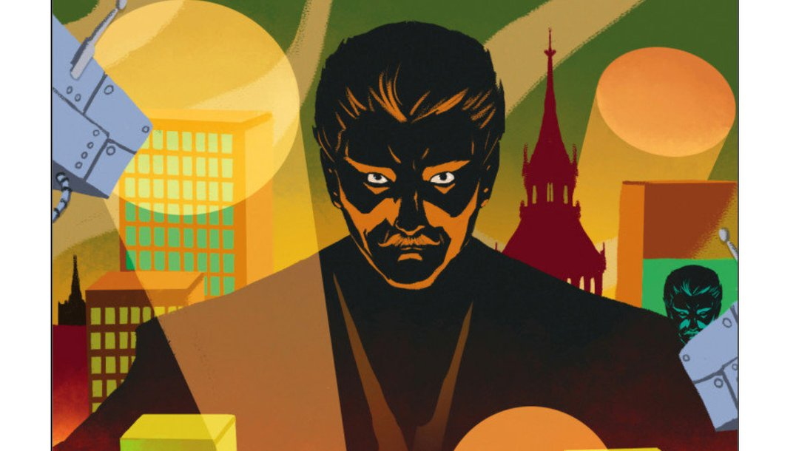

---

## 31

@天玑-无极领域

发表于：2026-05-19 12:38

来源：微博

链接：https://m.weibo.cn/status/5300387334589726

github 出现大量 AI agent 相关的项目。

三省六部制，模仿中国古代王朝的构架，设立不同的agent，让这些agent协同干活。

现代职场制，产品经理、平面设计师、程序员、测试员...  这类不同职业的agent，让这些agent协同干活。

新时代来临，人类还在用旧时代的协作方法，这就是马拉火车。

大部分人类非常平庸，为了让这些平庸的人类完成复杂的任务，必须设立足够多的岗位，职场构架是对现实妥协的产物。

AI 已经非常强大了，继续沿用旧时代的协作构架，相当于人为拖慢的AI效率。

---

## 32

@数字疯子

发表于：2026-05-19 09:36

来源：微博

链接：https://m.weibo.cn/status/5300341591773339

Hermes Agent v0.14 炸裂更新：它不再是个工具，而是变成了本地 Agent 平台

5月16日深夜，NousResearch 悄悄合并了 808 个 commit，正式发布了 Hermes v0.14 (Foundation Release)。前几天我本地刚遭遇过 Telegram 连接池爆满变脑死亡的 Bug，看完这次的 Changelog，只能说官方这波针对性“打补丁”直接把格局拉满了。

速览几点最硬核的改动和本地部署的避坑指南：

 核心进化：

 1. 本地 OpenAI 代理代理（Local Proxy）： 这次最逆天的功能。新版本增加了一个 hermes proxy 命令。只要你通过 OAuth 认证了 Claude Pro、ChatGPT Plus 或 SuperGrok，Hermes 直接在本地给你转化成一个 OpenAI 兼容的 API 端点！这意味着你可以直接用 Aider、Cline、Continue 免费去白嫖你网页端订阅模型的 Token。

 2. 连接池与冷启动大清洗（Debloating）： 砍掉了原本臃肿的依赖库，大模型适配层改成了“首次使用时懒加载（Lazy-install）”。冷启动时间直接被砍掉了 19 秒！之前撑爆 httpx 线程的长轮询逻辑被彻底重构。

 3. 免 API 密钥接入 SuperGrok & X Search： 增加了原生 X（Twitter）OAuth 支持。现在小新可以直接调用 X_search 抓全网实时新闻，不需要支付那昂贵的 X API 费用。

 4. IM 平台原生按钮： 之前在 Telegram 里让它做选择题（Clarify）需要回复数字，现在直接支持 Telegram/Discord 的平台原生 Button 按钮，点一下直接交互。

针对本地部署老手的“避坑排雷”：

 地雷一（.env 强刷）： 大版本更新重构了配置 hierarchy。直接升级会导致旧参数丢失。

   解药： 先 cp .env .env.bak，更新后使用官方新增的 hermes config check 检查缺项，再用 hermes config migrate 进行交互式迁移。

 地雷二（编译卡死）： 游览器 CDP WebSocket 重构，提升了 180 倍的网页审查速度，但带来了更新的 native 依赖。

   解药： Linux 原生环境和 WSL2 用户，升级前务必先执行 sudo apt-get install build-essential，防止 npm install 时因为底层 C++ 库版本不够直接锁死。

总结：

作为 OpenClaw 的正统继承者，Hermes v0.14 彻底完成了从“多模型网关”到“本地智能化路由基础设施”的转变。今晚准备让家里的小文（OpenClaw 实例）在隔离区开个干净的 v0.14_test 目录走一遍“混动灰度测试”。

你在本地冲 v0.14 了吗？遇到了什么诡异的依赖报错，评论区交流。

---

## 33

@零重力瓦力

发表于：2026-05-18 07:10

来源：微博

链接：https://m.weibo.cn/status/5299942440568502

Hermes Agent 更新到 0.14.0，模型和平台全面解耦。

这次更新，Hermes 直接接入了 Grok 4.3 ，支持 1M 上下文窗口，支持 Super Grok 订阅。OpenAI 的 Codex CLI 也能在 Hermes 里跑了，相当于在一个框架里就能调度多家模型的能力。Computer Use 也和 Anthropic 解绑了，任意模型都能进行桌面操作了。

消息平台在接入 Line 和 Simple X Chat 后达到了 22 个，Microsoft Teams 也实现了端到端接入，能读消息、回复频道、群组和私信。

新版 Hermes 终于原生支持 Windows了，可以通过 CMD、EXE、PowerShell 安装、运行，不再依赖 WSL，虽然官方表示目前可能有些粗糙。

工程体验上也做了优化。视频生成做成了统一工具加插件的架构，新模型出来换一个文件就行。

/subgoal 命令允许你在任务运行中叠加额外条件，评判器自动识别补充内容，不用重启整个循环。

安装方式也更灵活了，可以通过 Zed 的 Agent Client Protocol 注册表一键安装。

目前看来，Hermes 的方向很清晰，就是做一个和模型、平台都无关的智能体运行框架。这个版本把“可替换性”贯彻得更彻底，从底层模型、消息网关到视频生成，每一层都在解耦，把所有 AI 能力都变成可插拔组件。

\#爱马仕Agent怎么玩\#\#HOW I AI\# 零重力瓦力的微博视频

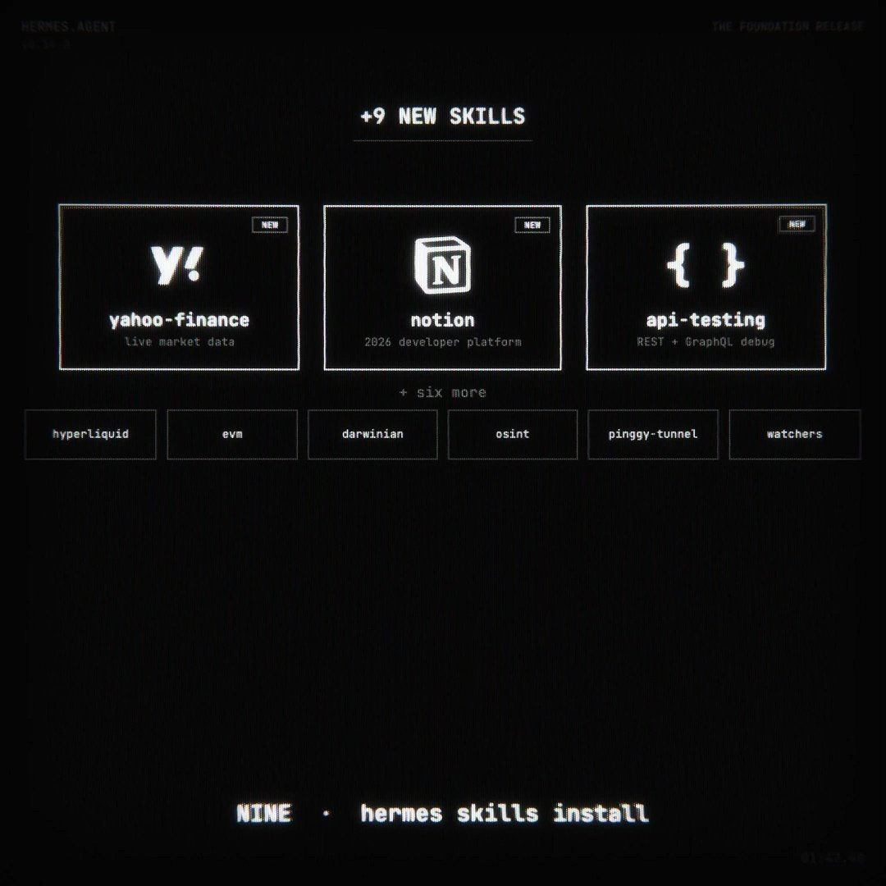

---

## 34

@哈布斯堡长脸

发表于：2026-05-19 00:29

来源：微博

链接：https://m.weibo.cn/status/5300204094885557

随着《监狱来的妈妈》暂时撤档，与电影相关的刑事判例的争议并不能称得上已然平息。通过各个司法数据库的交叉比对，电影主演所涉及的陕西省高级人民法院（2010)陕刑一终字第66号赵晓红故意伤害案刑事裁定的文本真实性已经得到验证。在通读文本和相关随案证据的基础之上，作为从业人员我想结合自身的知识和经验提出两点疑问。

一、案件发生前赵晓红是否与死者发生厮打？

对于案件发生的经过，赵晓红的供述为：“22时许，张勃说床没有支好，叫她下来重新支床，床支过后，她又躺下，张说床还没支好，让她从床上下来，她不下来，张就拉她，她还不下来，张就用拳头打她头，后两人就厮扯开了。张强行把她拉下床，用脚踢她后腰，她被打急了，就向卫生间跑，当她跑到客厅的餐桌旁时，看见餐桌上放着平时用的水果刀，就拿起水果刀指向张勃，张向她扑，她下意识挥了一下，刀子就扎进了张勃的胸部，她抽出刀子，看见张的胸部流血了，她就吓晕过去了。后同租一套房子的吕卫兵过来，她叫吕打“110”报警并打“120”急救电话，吕说已打过了。”

从赵晓红的供述来看，案件发生前的事实与案件之间的衔接转化是非常流畅的，即双方于22时许因琐事发生争吵，继而发生厮打，双方追出房间，丈夫被刺死。然而这与合租室友的证人吕卫兵证言之间存在较大的差异。

1.时间间隔的差异。根据证人吕卫兵的证言，22时许他听到张勃两口子吵架，就敲张勃家门，并喊张勃名字，后听见张勃夫妇吵声小了。过了一会儿，他听到张勃喊他，他跑到大厅，见张勃身上有伤，赵晓红手里拿着水果刀。他扶张勃时，张已站不住了，躺在地上，身上流了好多血，他赶紧拨打“110”、“120”报警，赵晓红亦叫他打电话报警。医生来检查后说，张勃已死亡。同时公安机关报警表及抓获经过证明，吕卫兵向“110”报警的时间为23时45分。由此可知，在证人吕卫兵证言记载的22时许发生争吵后，距离死者被捅刺至少有45分钟的时间，事态并非如赵晓红供述的一样在短时间内快速失控。

2.事件发展上的差异。既然证人吕卫兵可以在自己房间听到赵晓红与死者争吵，并前去敲门询问，足以房间隔音条件一般。那么赵晓红主张后续因为床没支好发生争吵和厮打，并且双方冲出房间，音量必然会高于第一次争吵，证人吕卫兵没理由听不到。但是证人吕卫兵在一个多小时内并没有听到后续冲突的声音，而是直接快进到死者被刺伤后呼救的时间点。因此证人吕卫兵证言和赵晓红的供述在争吵发生后是否存在厮打这一事实上存在重大出入。

同时赵晓红的供述里也未记载在争吵发生后，证人吕卫兵敲门询问的事实，双方表述存在第二个矛盾。而且如果赵晓红和死者真的发生后续厮打，合理的发展应该是在跑出房间后向曾缓解态势的证人吕卫兵呼救，或是在捅刺死者后喊叫求助，这些内容在证人吕卫兵证言中同样不存在。

3.印证证据上的差异。对于证人吕卫兵证言所表述的听到二人争吵，以及死者呼救，出门发现赵晓红持刀、死者被刺伤等事实，都可以得到赵晓红的供述、凶器物证、现场勘验笔录和尸检报告等证据的印证，叙述逻辑自然稳定，不存在矛盾冲突或合理怀疑之处。然而赵晓红所主张的被死者用拳打击头部、用脚踢后腰等事实，并没有法医验伤报告或是证人吕卫兵证言能够相互印证，完全是其单方面的主张。

二、杀人故意是否存在？

虽然法院并未采纳赵晓红防卫的上诉理由，但是将其行为认定为故意伤害罪，就表明法院并不认为赵晓红对于死亡结果存在故意。在刑事司法实务中，这一事实是区分故意杀人罪和故意伤害致人死亡的关键，需要结合事前预谋、事中侵害手段、以及行为人事后态度等因素予以综合考察，确定行为人在实施行为时是否明知可能造成死亡结果，并希望或放任结果发生，存在杀人故意。在不能认定的情况下，行为人故意伤害他人并过失导致死亡结果，就只能构成故意伤害罪。然而法院对于本案事实的认定存在较为明显的问题。

1.侵害手段。对于案发过程，赵晓红的主张是被死者打急了，就向卫生间跑，当她跑到客厅的餐桌旁时，看见餐桌上放着平时用的水果刀，就拿起水果刀指向死者，死者向她扑的时候她下意识挥了一下，刀子就扎进了死者的胸部，她抽出刀子，看见死者的胸部流血。这与本案其他证据存在严重冲突。

尸检报告表明，死者张勃胸骨上平胸骨角见一斜行2.8×0.2cm刺切创，创角上钝下锐，斜向右下入胸腔。死者心包膜上部有1.5×0.2cm裂口，主动脉根部可见一1.0×0.2cm裂口，心包腔积血100ml,右侧胸腔积血约100ml。结论为，张勃系被他人持单刃锐器刺切,致使主动脉根部破裂引起的心包填塞死亡。同时根据现场勘查笔录和赵晓红的指认笔录，凶器为一黑色塑料把的水果刀，全长19cm，刃长9.5cm。

上述证据表明，凶器的轨迹是从左上方刺入被害人胸口，向右下方向进入胸腔、刺中心脏。以赵晓红的身高，如果是以锤握法（刀刃在虎口之上）握持水果刀挥舞，只会造成水平方向的划伤或贯通伤，而且刀刃有很大概率被被害人的胸骨和肋骨挡住。能够造成这一伤痕的合理方式，只能是以冰锥式握法，即刀刃在小指之下，握持刀具进行捅刺，从胸骨和肋骨的缝隙中穿过，直达心脏。此外创口的创角上钝下锐，符合水果刀单面开刃、且刀尖角度大于60度的特征，这就要求握持者以非常大的力量进行捅刺。而且以水果刀的形状而言，如果深度刺入人体，在肌肉收缩和气压的作用下使无法轻易拔出的。结合尸检报告没有记录其他试探性伤痕，唯一一处刀伤创口规则狭小的特征，就足以说明赵晓红是非常精准地一刀刺中心脏，并毫不犹豫地用力快速拔出。不论是实施方式、打击部位还是凶器的类型，都足以说明赵晓红存在杀人故意。

2.事后表现。以尸检报告描述的情况而言，凶器刺穿心脏动脉并用力拔出，在心脏收缩和气压作用下血液会大量喷溅而出，这与勘验笔录所记载的面积达到2×1.5平米的血泊、鉴定报告中张晓红睡衣全身的血迹，以及尸检报告中死者胸腔大量积血形成相互印证。如果张晓红是过失刺中死者心脏，在惊慌之中别说是在劈头盖脸的血雨中保持镇定，一般人就是连水果刀都难以拔出。然而在证人吕卫兵证言中赵晓红既不主动拨打电话求助，也没有发出任何声音，只是拿着凶器看着证人吕卫兵搀扶死者，这与赵晓红供述看到死者胸部流血并吓晕过去的主张完全不符。而且在证人吕卫兵拨打110报警电话和120急救电话的时候，证人吕卫兵证言与赵晓红的供述也存在差异。证人吕卫兵证言里赵晓红只是让证人吕卫兵报警，而赵晓红自己的供述里既让证人吕卫兵打110报警，也打120急救。如果仅仅是要求报警，就足以说明行为人在潜意识里已经默认没有救助希望了。证人吕卫兵对于赵晓红在犯罪现场的冷静表现，与证人王安安证言里警察到场后赵晓红抱着死者喊叫救助的表现，也形成了极为反常的对比。

综合以上两大疑问，陕西省高院裁定维持西安中院对于赵晓红犯故意伤害罪一案的认定，存在着事实和证据层面上的争议。不管是赵晓红通过媒体报道和电影所提出的自身行为构成被家暴虐待后防卫反击的主张，亦或是二审裁定所暴露出的涉案行为应当构成故意杀人罪的争议，在认定事实和适用法律已经出现明显错误征兆的情况下，根据《刑诉法》第254条之规定，陕西省高院、最高人民法院和最高人民法院都有必要启动审判监督程序，对赵晓红故意杀人案予以再审，从而回应当事人的诉求和社会的关切，以实现刑事司法的个案正义。

\#曝监狱来的妈妈撤档\#\#姚晨方回应宣传监狱来的妈妈\#

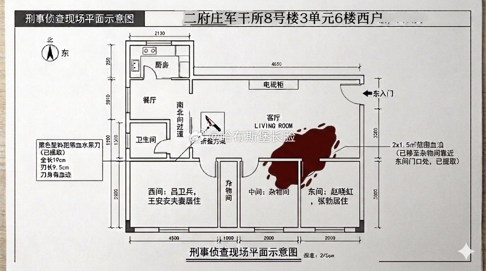

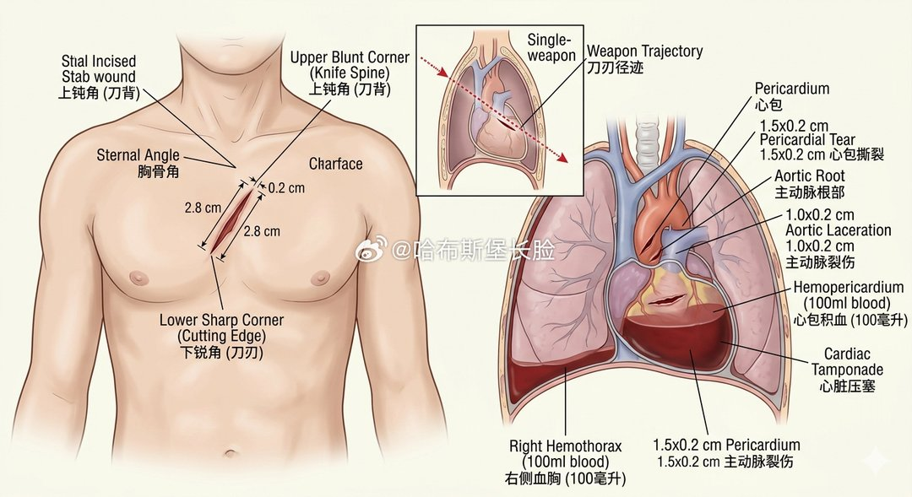

---

## 35

@阑夕

发表于：2026-05-20 09:08

来源：微博

链接：https://m.weibo.cn/status/5300580839068310

虽然提前偷跑了那么多信息，但这届Google I/O还是堪称量大管饱啊⋯⋯家底厚实就是可以为所欲为。

不睡觉的媒体总结已经全网都是了，我提几个自己划线的重点：

- Gemini Omni的全模态架构应该会在一年内被所有大厂跟进，可能只有Anthropic这种极致的偏才可以无视；

- 首发的Gemini Omni Flash只有一个产品可以免费体验，就是YouTube Shorts，Google为了扶持短视频真是倾尽所有的特权啊；

- 1000美金不到的Token成本，让Gemini 3.5 Flash自己跑了12个小时，写出了一个可运行的操作系统，这个演示堪称天秀；

- 所以可想而知Token的市场还会指数级增长，Gemini的产品侧加上API总计日均消耗134万亿Token，可以说是富可敌国了，作为参照，中国3月的数据是全国日均消耗140万亿Token；

- Gemini的月活9亿，还差一步就可以跻身Google旗下的「黄金产品线」，也就是以10亿月活为入场门票的基准，目前已经有12个了，如果不出意外，Gemini会在今年成为第13个；

- 第八代TPU第一次有了双芯片架构，一片支持训练，一片支持推理，对英伟达苦心营造的叙事——「TPU固然适合推理，训练还是得靠GPU」——唱出反调；

- 「Ask YouTube」是我最喜欢的一个易用性功能，非常简单粗暴的去搜索化，新一代网民会生活在一个原生对话的环境里，想看什么，直接问就可以了，YouTube属于Google非常核心的资产，而且一定会越来越重要；

- AI图片的隐形水印通用标准SynthID把OpenAI、Kakao、ElevenLabs都拉了进来，TikTok也即将加入，图片、声音、视频的Fake溯源基本能覆盖到主流生成产品了，「这是AI图吗」的疑问能有地方给解答；

- 什么？你说Google I/O原本不是给Anroird开发者办的活动吗？Android是谁？真不熟⋯⋯

---

## 36

@李子暘Lee

发表于：2026-05-20 10:08

来源：微博

链接：https://m.weibo.cn/status/5300587216504664

《肖申克的救赎》是监狱片，其中有安迪被狱警欺凌的情节，也有安迪巧妙反击的情节，而且，最终是犯人越狱成功，逍遥法外。

很离经叛道，戏剧张力十足。但是，这一切的前提是，安迪那案子，是冤案，安迪是冤案受害者。

如果安迪不是冤案受害者，而是金融大骗子，害得很多人家破人亡，那整个电影根本就说不通立不住。他在监狱里被人整死，大家也只会拍手称快说死得好。

所以说，《监狱来的妈妈》很怪异。剧组肯定看过案件卷宗。不知他们“反击家暴”的灵感是从哪里来的？听赵某某说的？

你要给一个人当众鸣冤翻案，你当然首先要确定，那的确是个冤案。赵某某这案子，即使以“最大的同情”去看，也看不出丝毫冤屈啊。只能看到监狱对杀人犯太温柔了，温柔得都过分了。

完全没法解释剧组那帮人的脑回路。要么是极度愚蠢，要么是极度狂妄。

实在想不到其他解释了。

-

---

## 37

@奶霸知道

发表于：2026-05-19 23:59

来源：微博

链接：https://m.weibo.cn/status/5300558860915371

刚看到一个视频，说片方内部有人觉得，自己这是被人“搞”了。

理由是这部电影本来不算什么大片，关注度也没高到全民级别，而且那个案子都过去那么多年了，怎么突然就有人把当年的裁判文书、减刑记录、案件细节，全都一点点翻出来，对着宣传话术逐条对账？所以他们怀疑，是同行在背后搞自己。 

你们这些文化圈的人，是真的有点太蠢了。。。

你们自己铺天盖地宣传“家暴反杀”“女性觉醒”“真实故事改编”，是个人都会好奇：当年到底发生了什么？

一搜就能发现，虽然一审判决书没上网公开，但两次减刑裁定一直挂在中国裁判文书网上。因为案件特殊，终审裁定甚至还被北大法宝收录成重点参考案例。

这东西根本不用什么“神秘势力”，也不用同行下场，更不需要什么内部爆料。

正常人花五分钟检索一下，就能把整条案件线扒个七七八八。

不是别人搞你们，而是你们自己非要拿一个经不起公众细看的案子，硬往“伟大叙事”上包装。最后翻车了，又开始怀疑全世界。。。。。。

