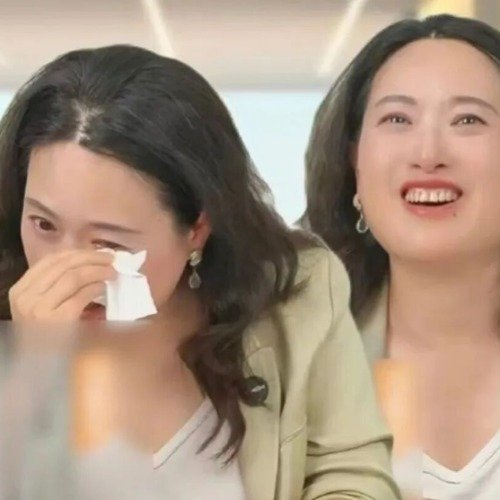
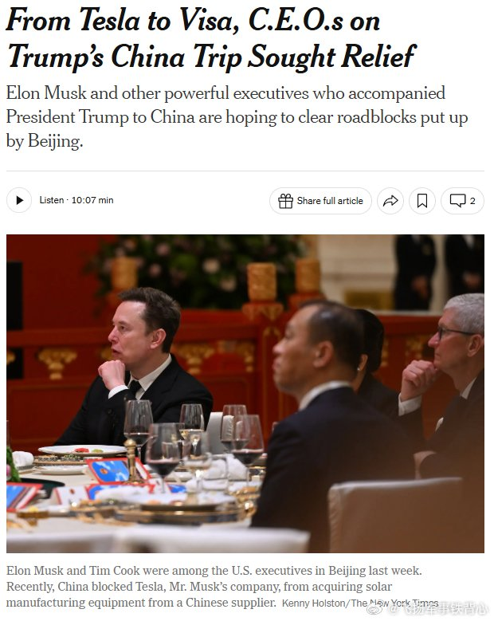
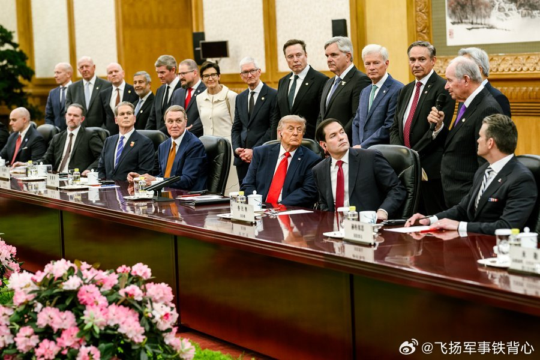
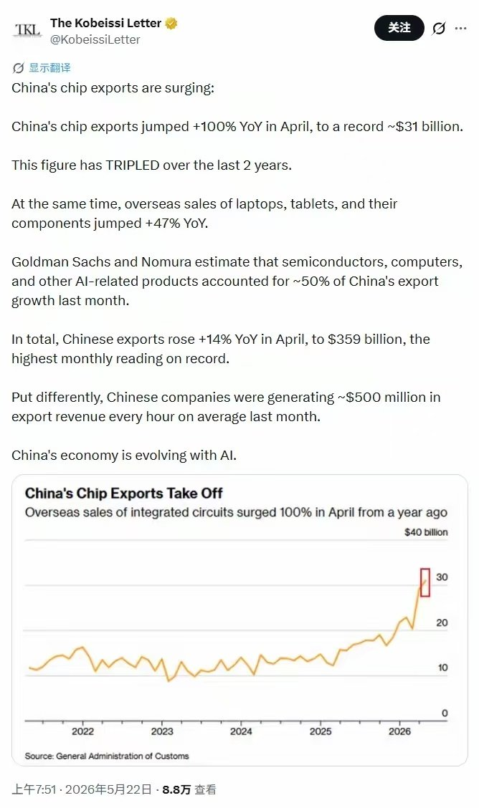
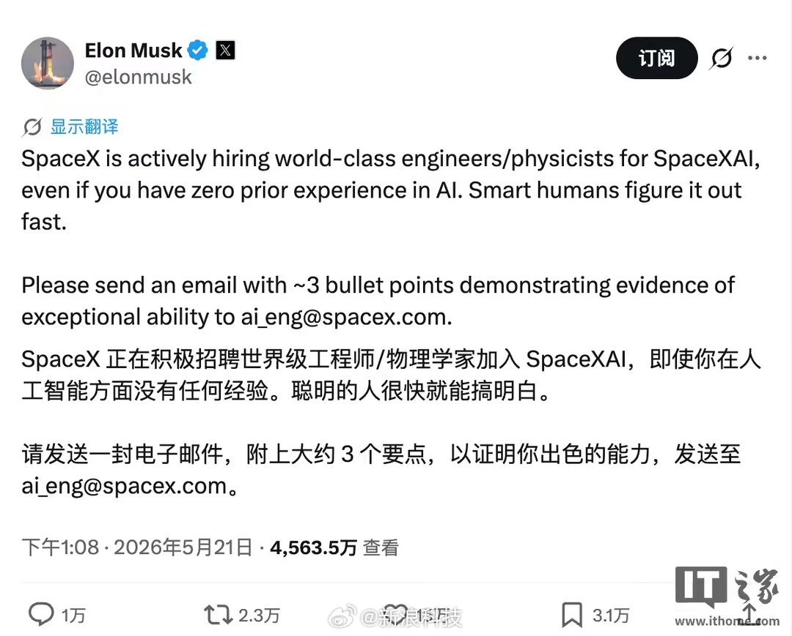
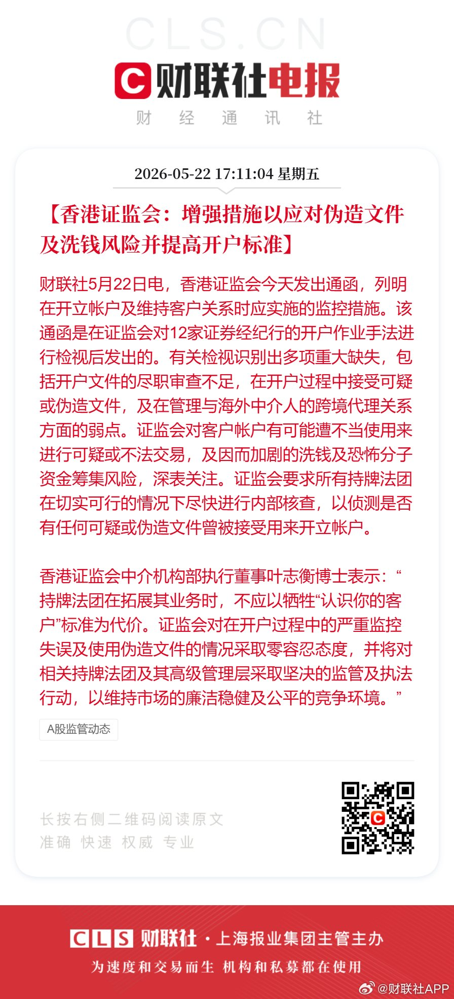
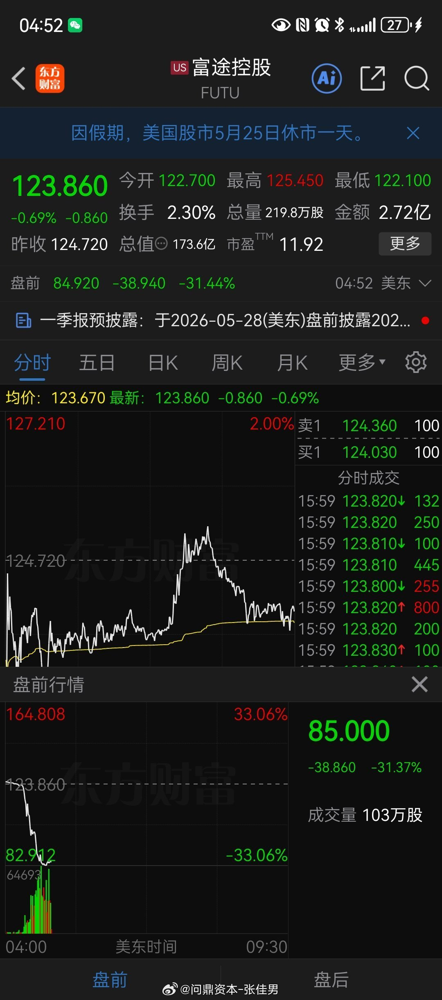
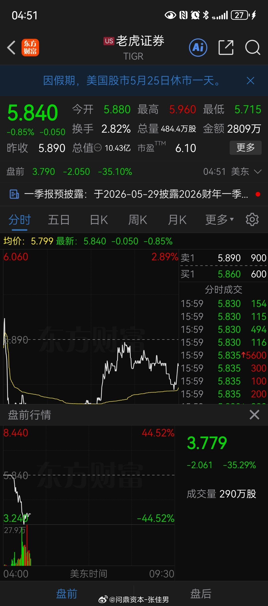

# 2026-05-22

## 1

@何夕

发表于：2026-05-21 11:19

来源：微博

链接：https://m.weibo.cn/status/5301092381624438

印度卢比持续贬值，我想知道丫啥时候崩，

就顺便研究了下印度外汇来源，终于理解了“印度杀猪盘”的由来。

印度外汇来源主要有三个：

1、IT外包，

占比最高，每年2000～2500亿美元；

但是，这个行业正在被AI威胁……未来能不能存在，都可能是问题。

2、侨汇，

占比第二，每年1200～1300亿美元，外劳主要来自美国&中东国家；

但美国在“反移民”，中东由于美伊战争导致海峡封锁油卖不出……导致外劳也受影响。

3、外国直接投资，

因为印度营商环境糟糕，针对外资的杀猪盘时常发生，

导致，近年来外国投资大幅缩减。

另一方面，

·印度跟中国比，油气等资源极度匮乏&自给率极低，每年需要大量进口；

·为了工业化&从组装车间做起，印度需要进口大量设备&器械&零部件等；

·印度人还特别喜欢买金银，也消耗大量外储；

以上，

需要消耗大量外汇储备，导致印度外储“一直紧张+不够用”。

可是，

“IT外包&侨汇”，本质是赚人力的辛苦钱：总量有限 & 难短期大幅增长。

这就尴尬了：

一边是外储获取有限，另一边是外储持续消耗。

怎么办？

……

这个时候，

最快获得外储的方式，就只剩下一种 —— 抢外资！

众所周知，

印度在这个问题上，并没有针对任何一个国家；

几乎所有国家，都被印度抢劫或勒索过。

当下，

印度重点针对的是 —— 苹果，

打算罚苹果380亿美元(占苹果全球营收10%)，用来补充自己稀薄的外储。

按说，

搞“杀猪盘”是短视行为，总这么干还有国家敢来印度投资？

没有外资进入，带来资金技术和经验，印度怎么发展？

但是，

·追求长远利益，本就是“体面人”的思维方式；

·对印度这种极度缺乏外汇的“穷人”，没有外汇就买不了油气 —— 连生存都做不到，何来发展？

不抢劫外资，印度就没有别的渠道获取外汇；

所以，搞“杀猪盘”就逐渐融入了印度gov的基因中。

也包括，

白嫖外国技术 & 不给尾款 & 赖账等，败人品的思维和行为方式；

本质也是“极度缺乏外汇”导致。

举个不恰当的例子，

山东是全国食物中毒第一的省份，原因是很多老人吃发霉过期食物；

为什么过期发霉食物也不舍得丢？

因为曾经极度缺乏食物，

也就养成了极端节俭的行为。

同样，

印度的“杀猪盘”、“白嫖技术设备样品”、“不给尾款&赖账”等等，

本质就是极度缺乏“外汇储备、必须各种节省+找各种渠道搞外汇”导致的。

甚至于，

这种长期的“缺乏+应对”行为，最终深入骨髓；

成为印度人精神和人格的一部分，没白嫖&占到便宜，就感觉自己吃亏了。

换位思考，

我要是印度，大概率也会这么做。

不是人品差，就是为了生存不得不如此。

…… 

综上，

所有投资印度or准备投资印度的中企，

都应该认真研究下印度 & 认识到“杀猪盘”是这个国家的必然行为，

除非哪天，印度永久性的解决了外储缺乏问题，才有可能改变。

若非要投资印度，

一定要做好“被杀猪盘”预案，提前想好应对。

当然，

最好还是别投资印度。

---

## 2

@江卓尔_发言号2

发表于：2026-05-21 22:20

来源：微博

链接：https://m.weibo.cn/status/5301258751836243

为什么《监狱来的妈妈》要完全地，凭空地造假？

就不能找真的被家暴误杀的案例拍吗？

中国那么大，

这种案例多的是，

为什么不用？

因为：「有一个女人，

被丈夫打断了三根肋骨，

反抗时失手打死了丈夫，

法院判了她三年，还缓期执行；

有一个女人，

在被丈夫掐脖子窒息的时候，

拿起花瓶砸了他的头，

法院认定正当防卫，

不负刑事责任」

这样的事实拍出来，

而不是 “家暴误杀被判15年”，

那还能起到煽动性别对立的目的吗？

还能起到攻击中国的目的吗？

所以，境外势力必须这么造假，

也只能这么造假。

可怕的是，整个电影行业，

包括审核，被一把捅穿，

连龙标都拿到了，

连点映都开始了，

才被人民群众制止

---

## 3

@钱江晚报

发表于：2026-05-20 08:13

来源：微博

链接：https://m.weibo.cn/status/5300683076274037

【\#复旦教授硬刚为被举报裹挟老师撑腰\#，\#基层教师不该被恶意举报消耗\#】复旦大学教授，被一位小学生家长举报了，举报到无法正常工作，原因离谱到让人不敢相信。\#中国教师报谈复旦教授遭小学家长举报\#

事情的起因是，一位小学生家长通过直播连麦，向复旦大学副教授、家庭教育专家沈奕斐咨询孩子在学校里遭遇“校园霸凌”的事儿。沈教授请她举几个最严重的例子，但这位家长口中所说的最严重的例子也就两件事儿：一是，自家孩子给同学分零食，但同学有好吃的没分给他；二是两个孩子拌嘴，互相推搡了几下。沈教授认真分析之后直言：“这不是霸凌，而是家长陷入了极端的‘受害者逻辑’，把正常的儿童社交摩擦上纲上线。”

就因为这波分析，家长恼羞成怒，转头就开始了对教授举报。先是举报侵犯隐私，可视频全程只保留了教授声音，还做了变声处理，根本没有泄露隐私；随后她又向复旦多个部门疯狂投诉，举报教授直播影响教学、工作失职。沈奕斐教授被迫连日撰写情况说明、配合调查，连正常工作都无法开展。好在，复旦大学比较公正，面对连环举报，按程序调查，查清事实后，没有因为怕麻烦就处分老师。

沈教授的身边的人劝她：认个怂算了，把视频删了，息事宁人。但她看完评论区上千条留言，决定硬刚到底。

整整1000多条留言，充斥着基层一线教师的委屈与心声。有人说自己被无理家长举报到失眠，有人说为了不惹麻烦只能对孩子睁一只眼闭一只眼，有人说明明用心教书却被步步紧逼，寒透了心……

她不是为了自己硬刚，是为千千万万不敢发声、被举报裹挟的基层老师撑腰。

举报本来是监督不公、保护权益的正当渠道，是维护教育公平的重要武器，可现在，这件本该严肃的武器，正在被一些人恶意滥用。

这位家长此前就靠持续举报逼走了学校的小学老师，如今把报复手段用在大学教授身上，把零成本举报当成要挟工具。家长动动手指就能启动调查，可老师为了证明自己，要耗费多少精力、写多少份说明、磨掉多少对教育的热情？更可怕的是，很多学校为了息事宁人，最后选择牺牲老师。长此以往，老师不敢管、不能管、不想管，最终耽误的是我们的孩子。

老师和家长本该是同一战壕的战友，一起托举孩子成长，而不是互相提防、彼此内耗。教育需要温度，更需要边界。别让过度焦虑毁了孩子，更别让恶意举报寒了老师的心。（潮新闻 记者 李心怡） 钱江晚报的微博视频

---

## 4

@李子暘Lee

发表于：2026-05-22 12:46

来源：微博

链接：https://m.weibo.cn/status/5301360121611378

\#复旦认定沈奕斐教授无违规行为\#

古玩行有个传统，即使东西是假的，也不直接说是假的，说“不真”“不老”，或者说是“新的”。真货则是“老的”。

这传统吧，一直在内行之间互相说，表示客气，给人留面子。

这两年鉴宝节目红火。“国宝帮”兴起，很多“执宝人”不但不是内行，简直就是二百五精神病。可专家习惯了不真、不老、新的等传统说法，对国宝帮也这么说。国宝帮就听不懂，坚持和专家抬杠。

时间一长，专家也烦了，放弃老传统，上来就直接说：假的、仿品，还是低级仿品，粗制滥造……

这就痛快多了。

建议有关部门在对公众发布公告时，也不必执着于严格严密的法律语言。比如，复旦在公告中说沈教授“无违规行为”。这种话，固然严密，但怎么听怎么别扭。

类似于说某人“无盗窃行为”“未发现他强奸幼女”“无证据证明他贪污公款”……

对公众这么说话，很多人会不明白，印象是那人还是有事，只是没查出来而已。

严格严密的法律语言，留在法律文书中就好了。对公众发布公告，建议用简洁明快的直接叙述。比如：

某某某投诉沈教授。经调查，沈教授正常工作，热情周到。投诉属于诬告陷害寻衅滋事。

-

---

## 5

@飞扬军事铁背心

发表于：2026-05-22 08:46

来源：微博

链接：https://m.weibo.cn/status/5301292432099324

美媒说这次特朗普访华时美企大佬站成一排当背景板不是原计划如此安排的，这些企业大老板是会前最后一刻被白宫方面临时叫去参加会议——在元首会晤前几个小时，白宫突然通知他们特朗普希望他们第二天一同出席。

特朗普在做介绍时说：

“我带来了全世界最伟大的商人——最大、也许也是最优秀的。”

“我不要公司里的第二号、第三号人物，我只要最顶尖的人。他们今天来到这里，是向中国表示敬意，也期待开展贸易与合作。”

由于是美方临时起意，这些CEO们入场时一度被耽搁。而且报道称“现场椅子不够，有些高管不得不站着”。

这些老板/CEO大多是带着具体难题来中国求解：

特斯拉想让中国放行近30亿美元的太阳能制造设备出口；

英伟达希望中国放行H200芯片；

波音差不多有十年左右没在中国拿到像样大单；

Visa至今没拿到人民币银行卡清算牌照；

GE航空期盼稀土供应；

Meta则被要求撤销收购中国AI公司Manus。

回到华盛顿后，白宫贸易顾问彼得·纳瓦罗在接受 CNBC 采访时批评这些CEO：

“施瓦茨曼、芬克、马斯克，还有苹果那些人去中国……说实话，那很尴尬。他们甚至一度没被允许进入房间。”

“中国人看待这些人，不过是‘有用的傻瓜’而已。”

但这些企业高管们显然并不认同这种说法。离开人民大会堂时，面对记者提问，库克比出和平手势，然后竖起大拇指；

马斯克说：“我们取得了很多好成果。”

黄仁勋则评价：“两边都非常出色。”

\#烽火问鼎计划\#\#热点现场\# 

彼得·纳瓦罗可以说是特朗普阵营里最持续、最鲜明的对华强硬派之一，是“对华脱钩”理论的设计师，一贯主张极限施压、惩罚中国，而且这种立场已经保持了二十多年。

这次彼得·纳瓦罗吐酸水，很可能是因为这次特朗普访华没带他，新的形势让他有了某种被挤出核心圈层的担忧。

---

## 6

@挨踢牛魔王

发表于：2026-05-22 08:46

来源：微博

链接：https://m.weibo.cn/status/5301302281637456

最近有个新闻，可能被大家忽视了，就是AI解决了埃尔德什（Erdős）单位距离问题。

你也不用知道这个数学问题是什么，反正人类没有解决。

这里的意义是什么呢？

以前，AI解决这些问题，靠的是搜索、穷举，它解决那些问题的技巧在别的地方都见过。

所以，数学家们可以说它是模仿者，没什么稀奇的，但是可以作为数学家的助手。

这次不一样了。

这次AI是独立的解决了这个问题，而且是用自己的推理能力，在其中展示了独特的品位和判断力。

openai把AGI分为几个级别：

1.chatbot，就是聊天，这个级别是解决语言问题，已完成。

2.思考者，就是会思考了，openai o1,deepseek r1都是有思维链的，已经实现。

3.agent，就是能行动的智能体，目前已经实现，在智能体的进程中。

4.创新者，就是不是对原有技巧的模仿，而是可以提出新的理论，解决全新的科学问题，具备创新能力。

5.组织者。

说实话，我对于AI是否有创新能力，一直是怀疑的。

但是这次AI解决了一个人类从未解决的数学问题，那真的是有创新能力了。

普通人可能没有感觉，但是数学家们，包括菲尔茨奖得主们是震惊了。

看来，AGI的第四级，AI已经踏上一只脚了。

太让人震惊了。

---

## 7

@风云学会陈经

发表于：2026-05-22 17:16

来源：微博

链接：https://m.weibo.cn/status/5301423868741045

4月集成电路出口额增100.1%，其实主要是三星和SK海力士在中国工厂涨价出口

境内外不少人关注了中国4月芯片出口的高速增长，并将之视为美国封锁的失败。实际原因还是得实事求是，是三星和SK海力士主导的。

4月集成电路出口额310.85亿美元，同比增长100.1%；出口数量320.4亿个，仅增3.8%。这说明，芯片出口暴增基本是因为涨价。而且，基本可以肯定是存储器出口价格大增。

1-3月芯片出口中，存储器出口459.9亿美元，占芯片出口总额63.3%，同比增长174.2%；处理器及控制器出口160.6亿美元，同比仅增4.9%；其他集成电路出口93.4亿美元，同比增18.4%。4月结构应该类似。

存储器出口方面，长鑫科技生产的DRAM和长江存储生产的NAND主要是自用。长江存储2022年被美国放入实体清单，打断了出口之路，本来2022年3月长江存储打入苹果iPhone SE 3供应链，将为苹果供应NAND Flash。长鑫存储2025年三分之二收入是LPDDR（Low Power DDR，给手机/平板用的），约三分之一是DDR（服务器/PC用），主要客户是国内手机与IT公司。两家公司作用巨大，主要是减少芯片逆差，但还没有什么出口贡献。

三星和SK海力士在中国的产能其实十分巨大，不熟悉的人可能会吃惊。依靠这个巨大产能，两家韩国公司是中国芯片出口的绝对主力。

三星在西安的NAND flash工厂，占其全球产能约40%，占全球NAND产能约15%。它是三星唯一的海外存储芯片生产基地，月产能约15万片，是全球单个产能最高的NAND工厂。产品直接在中国使用，也大量供出口。三星还有苏州工厂，是存储器封装测试，由于是后段封测，不是关键的非晶圆制造，重要性没有西安工厂高。

SK海力士在无锡的DRAM工厂，占其DRAM总产能的30%-50%，月产能约30万片12英寸晶圆，是SK海力士的核心基地。另外还有大连工厂生产NAND Flash，占SK海力士NAND产能的20%-45%，这是2021年底收购英特尔的NAND工厂。产能占比波动较大，是总公司在全球动态分配产能。

全球存储价格暴涨，中国芯片出口也就暴涨了，主要是韩国两家公司中国工厂涨价出口，量不增价大涨。另外，一季度“其他集成电路”出口93.4亿美元同比增18.4%，是传统芯片贡献的，是自主力量为主。

4月中国出口同比美元计同比增长14.1%，集成电路出口是最大单一拉动项，单独贡献了约5个百分点，加上自动数据处理设备（电脑零部件），合计贡献了整体增速的近一半。当然其它出口增长也不算差。

---

## 8

@新浪科技

发表于：2026-05-22 17:16

来源：微博

链接：https://m.weibo.cn/status/5301423843574771

【\#马斯克将亲自审简历\#，\#马斯克SpaceXAI大举招聘人才\#】据《商业内幕》21 日报道，SpaceX 正为 AI 部门大举招聘工程师和物理学家。

随着 SpaceX 推进可能成为史上最大 IPO 之一的上市计划，埃隆 · 马斯克表示，自己将亲自审核通过“基本理智筛选”的求职申请。他表示，求职者不一定需要 AI 从业经验，但必须通过邮件提交三条要点，证明自己“具备卓越能力”。“聪明的人很快就能学会这些东西。如果你曾让一个极其复杂的系统真正运转起来，并产生实际价值，那会是非常重要的加分项。”

这种招聘风格也延续了马斯克一贯的方式：要求简单直接，更看重实际成果，而不是传统履历。今年 1 月，马斯克为特斯拉 AI 芯片团队招聘时，也曾要求候选人用三条要点说明自己解决过哪些“最困难的技术问题”。

SpaceX 此次招聘动作，再次反映出科技行业 AI 人才竞争依然激烈。当地时间周二，特斯拉前 AI 总监、OpenAI 早期核心成员安德烈 · 卡帕西宣布加入 Anthropic，被视为 Anthropic 在 AI 人才争夺中的一次重要胜利。

对于已经并入 SpaceX 的 xAI，马斯克今年 3 月曾表示，在多名联合创始人离开后，他会重新翻查公司过去的面试记录。据IT之家此前报道，马斯克计划再次联系那些有潜力的候选人。

SpaceX 已于周三递交 S-1 上市申请文件，正式 IPO 预计将在 6 月启动。（IT之家）

---

## 9

@财联社APP

发表于：2026-05-22 17:14

来源：微博

链接：https://m.weibo.cn/status/5301423388232855

\#香港证监会要求提高开户标准\#【香港证监会：增强措施以应对伪造文件及洗钱风险并提高开户标准】香港证监会今天发出通函，列明在开立帐户及维持客户关系时应实施的监控措施。该通函是在证监会对12家证券经纪行的开户作业手法进行检视后发出的。有关检视识别出多项重大缺失，包括开户文件的尽职审查不足，在开户过程中接受可疑或伪造文件，及在管理与海外中介人的跨境代理关系方面的弱点。证监会对客户帐户有可能遭不当使用来进行可疑或不法交易，及因而加剧的洗钱及恐怖分子资金筹集风险，深表关注。证监会要求所有持牌法团在切实可行的情况下尽快进行内部核查，以侦测是否有任何可疑或伪造文件曾被接受用来开立帐户。

香港证监会中介机构部执行董事叶志衡博士表示：“持牌法团在拓展其业务时，不应以牺牲“认识你的客户”标准为代价。证监会对在开户过程中的严重监控失误及使用伪造文件的情况采取零容忍态度，并将对相关持牌法团及其高级管理层采取坚决的监管及执法行动，以维持市场的廉洁稳健及公平的竞争环境。”\#整治非法跨境证券期货基金经营活动\#

---

## 10

@理记

发表于：2026-05-22 17:01

来源：微博

链接：https://m.weibo.cn/status/5301420179849886

有人说了这样的观点：谁说电影市场不行了，给阿嬷的情书爆火就是例证，还是没用心拍好片子。

我个人观点，现在的电影市场是多重暴击，可能一个时代已经过去了，只有小成本、素人导演和素人演员成功概率最大，别的都不行了。

你看这两天还有一部电影，名字叫“一个男人和一个女人”，管虎导演，影帝黄渤和倪妮主演，5月16号上映，目前全国票房360万，预测总票房418万。

昨天，全国的票房还不到9万块钱。

这部电影的拍摄、制作、宣发➕资金成本，业内估计1-2亿，裤衩都赔没了。

你说这科学么？甚至连差评都没几个人说，光看黄渤倪妮管虎的招牌，也不至于才这点钱。

我觉得就是时代变了，悄然的变了。

纸醉金迷一掷千金的富豪明星去演穷人，平常过得花花绿绿的明星去演深情，纯商业化的运作就想圈钱，老百姓已经不买账了。

你比如我看徐峥，最后一次看他的电影是逆行人生，他演快递员，也不是说演的不行，但就是觉得不舒服，觉得他在没苦硬吃。

黄渤的电影，我就第一部疯狂的石头觉得最舒服，因为那时候黄渤就是个无限接近素人，演卢瑟就看着像，后来看黄渤的电影也就疯狂的赛车还行，再后面就没感觉了。

现在电影市场比较难，我觉得一方面是短视频给的多巴胺刺激足够多了，另一方面导演也不知道拍啥合适，拍炫富的肯定不行，拍穷人励志的也很难，老百姓对富豪明星演没苦硬吃非常反感。

拍科幻大片吧，ai时代把影像的刺激完全平民化了。拍正能量题材，太拥挤，限制太多，太难打动人。

那些功成名就的大导演，他们根本无法做到像给阿嬷的情书导演那样吃苦，他们晚上那么多宴请饭局，那么多商业活动，人的精力有限。

某种意义上，给阿嬷的情书，我觉得就是时代巨变才凸显出来的作品，是各种因素挤压出来的。

即使导演本人，也不要指望他还能拍出同级别的作品，下个作品能达到50%的水平就烧高香了。

因为导演也从穷导，一下子跻身几亿身家的富豪了，他也有推不完的应酬。

回不去的。

---

## 11

@冈瓦纳

发表于：2026-05-22 16:47

来源：微博

链接：https://m.weibo.cn/status/5301415129908314

有些问题，还没有到解决的阶段，就解决不了的

小时候，刚上小学，就开始接受教育

但离开教室，谁都不会讲普通话

一个人讲，反而会被笑话

大家一个村子里的，普通话说给谁听？

那个时候的人应该感叹推广普通话很难吧

但后来，开放打工了，农民全国跑

大家都会讲普通话了

到了全国跑的阶段，就说普通话了

现在好多事情，也是这样

看起来是必须解决的事情，甚至很急的事情

但它就是解决不了

比如蔬菜水果的安全问题

显然现在没到能解决的阶段

一方面，大家只吃得起非常便宜的东西

另一方面，我们希望吃得几千里外的新鲜水果，鲜活的鱼

只能等大家付得起钱的时候，这些事情才能解决。

付得起成本，唐朝的长安也有鲜荔枝

付不起成本，要么商家欺人，要么消费者自欺

---

## 12

@问鼎资本-张佳男

发表于：2026-05-22 16:52

来源：微博

链接：https://m.weibo.cn/status/5301417809019596

近日，证监会依法对Tiger Brokers (NZ) Limited（以下简称老虎）、富途证券国际（香港）有限公司（以下简称富途）、长桥证券（香港）有限公司（以下简称长桥）境内外相关主体在境内非法经营证券业务等行为立案调查并作出行政处罚事先告知。

