# 2026-05-23

## 1

@科工力量

发表于：2026-05-22 07:00

来源：微博

链接：https://m.weibo.cn/status/5301389443727650

【龙芯3A6000出货破百万：国产CPU终于跨过“生态拐点”】过去很多年，国产CPU始终面临一个绕不开的问题：性能不断进步，但生态迟迟难以形成闭环。

而如今，随着龙芯3A6000主流行业出货量突破100万片，这一局面正在发生变化。

对于国产CPU产业来说，“百万级出货”并不仅仅是一个销售数字，更意味着产品已经跨越实验性部署阶段，真正进入规模化应用周期。尤其是在党政、教育、税务等对稳定性和兼容性要求极高的行业场景中，百万级部署背后，代表的是整套软硬件生态的成熟。

龙芯3A6000是龙芯中科推出的新一代自主桌面处理器，采用完全自主的龙架构和自研IP核，基于国产成熟工艺打造。从技术路线来看，它并非简单基于国外指令集授权，而是走出了一条自主CPU架构演进路线。

性能方面，龙芯3A6000的SPEC CPU2006 base单线程定点成绩达到51分，相较上一代产品实现明显提升。在日常办公、浏览器、多任务处理以及部分轻量专业应用场景中，已经具备较好的流畅度表现。

但相比性能，更值得关注的是其生态变化。

过去国产CPU最大的短板之一，是应用兼容能力不足。而龙芯3A6000此次大规模落地，一个关键原因就在于其生态适配能力显著增强。依托龙芯浏览器、二进制翻译等技术，越来越多原有X86生态应用可以实现较为顺畅的运行体验。

尤其在税务系统等复杂业务场景中，龙芯3A6000已经在北京、河北、四川、重庆、福建等地实现规模化应用。这意味着国产CPU开始真正进入核心业务系统。

教育行业则是另一个观察窗口。

目前龙芯3A6000已在浙江、江苏、河南、山西、新疆等地部署超十万套，并完成中小学、高校及职业教育场景的软件生态适配。相比过去“定制化适配”的模式，如今国产CPU更强调标准化生态能力，这也是规模化推广的重要前提。

另一个值得关注的变化，是产业链协同能力的提升。

过去国产CPU产业常被诟病“单点强、系统弱”，芯片厂商、整机厂商、操作系统和应用软件之间协同不足。而围绕3A6000，龙芯中科正在加速构建完整自主生态，包括整机、操作系统、中间件、数据库以及行业应用厂商的联合适配。

这种变化，也意味着国产CPU产业开始从“替代逻辑”转向“市场逻辑”。

在赛迪第二十届“中国芯”优秀产品征集活动中，龙芯3A6000获得“优秀市场表现产品”奖，某种程度上正说明其已经不再只是政策项目中的“指定选项”，而是在真实市场环境中具备了一定竞争力。

从行业视角来看，龙芯3A6000的意义，或许不只是一次产品成功，更可能意味着国产CPU产业正在迎来真正的生态拐点。


---

## 2

@金陵上空的鹰

发表于：2026-05-22 03:14

来源：微博

链接：https://m.weibo.cn/status/5301332685883135

飞扬军事 图-4点天灯


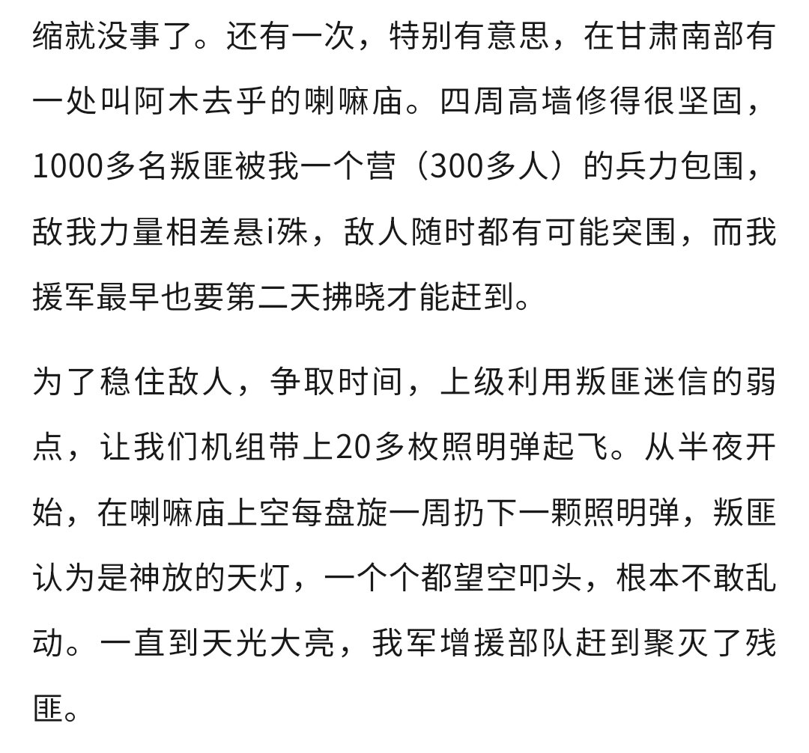


---

## 3

@V闪闪

发表于：2026-05-22 07:08

来源：微博

链接：https://m.weibo.cn/status/5301391646263110

吓尿了……//@洋务先驱张之洞:Tu-4中国有限的实战中绝对是碾压级别的装备，除了载弹量，空前长的留空时间+比原版B-29火力强得多的23mm炮塔组合也发挥了很大作用，不亚于越战时期的AC-130炮艇机。还有一次，提前获知某地有人蠢蠢欲动，遂将头领人物全部“邀请”去观看Tu-4、Tu-2的轰炸射击演练，有人当场被吓到失禁，纷纷现场表忠心


---

## 4

@潇湘晨报

发表于：2026-05-21 07:13

来源：微博

链接：https://m.weibo.cn/status/5301030527963476

【\#月薪归妻子丈夫倍感委屈起诉离婚\#，经调解双方摒弃原不公财产约定】近日，长沙天心区法院成功调解一起“夫妻财产约定纠纷”与“离婚纠纷”双诉对立的案件。

该案原、被告经朋友介绍相识相恋，于2023年10月登记结婚，2024年8月喜得一子。婚后至2025年3月，双方共同生活，感情根基尚可。然而，女方受身边“女方掌管全部财务”的婚恋模式影响，加之自身缺乏婚姻安全感，便要求效仿：与男方签订并公证了夫妻财产约定。

这份协议明显失衡——男方每月工资收入全部归女方个人所有，不属于夫妻共同财产；女方自身收入则同样归其个人所有。男方需按月将全部收入交付女方。

2025年3月，男方因与女方父亲产生家庭矛盾，外出租房居住，两地分居后夫妻间隔阂日渐加深。2026年1月，男方认为财产约定过于苛刻、显失公平，长期单方面付出让他倍感委屈，便不再按约定上交收入。

女方随即要求男方要依公证协议履行，并拒绝男方探望婚生子。男方深感伤心，遂向法院提起离婚纠纷；女方亦随即起诉，立案夫妻财产约定纠纷，要求男方依公证协议履行义务。

在法官劝说下，女方先行撤回夫妻财产约定纠纷之诉，并承诺改正偏激行为、保障男方探望权、平等承担家庭责任。男方看到女方真心悔过、仍有情意，也放下心中芥蒂，撤回离婚纠纷。双方自愿和好如初，共同约定：摒弃原不公财产约定，婚后收入依法作为夫妻共同财产。（天心区人民法院） 长沙 潇湘晨报的微博视频


---

## 5

@蚁工厂

发表于：2026-05-22 07:23

来源：微博

链接：https://m.weibo.cn/status/5301395276169678

剪映海外版和Gemini合作啦


---

## 6

@严锋

发表于：2026-05-22 04:49

来源：微博

链接：https://m.weibo.cn/status/5301356614910902

一位小学生家长通过直播连麦，向复旦大学家庭社会学专家沈奕斐老师咨询孩子在学校里遭遇“校园霸凌”的事：一是自家孩子给同学分零食，但同学有好吃的没分给他；二是两个孩子拌嘴，互相推搡了几下。沈老师认为这不是霸凌，而是家长陷入了极端的“受害者逻辑”，把正常的儿童社交摩擦上纲上线。家长就接连不断地向复旦校方举报沈老师。

复旦大学对事件做了全面彻底的核实，最终确认：沈奕斐教授在直播间对连麦案例的点评内容专业且客观、不逾越任何合规边界，其所做的连麦内容直播并没有影响正常教学秩序，也不存在所谓的“侵害第三方隐私权”等问题。最终，复旦大学研究后并未对沈奕斐给予任何形式的行政处分或专业处置。

为复旦大学的实事求是、坚持立场和秉公处理点赞！


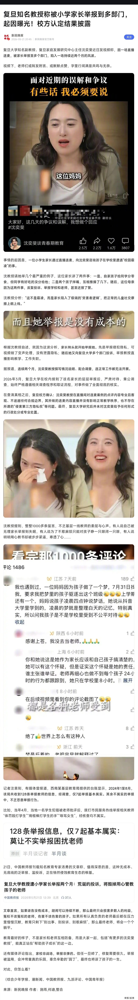

---

## 7

@雩歌_

发表于：2026-05-20 04:05

来源：微博

链接：https://m.weibo.cn/status/5300620686790115

1980年，初出茅庐的王晶想请“四哥”谢贤拍电影。彼时谢贤是港圈红透半边天的顶流人物，王晶一个新人导演，肯定是没有那个预算的。 但是谢贤夫妻二人在知道这件事之后，主动找上王晶，同意参演。 王晶才得以开启他的导演之路。

事后多年，王晶都在公开场合和采访中多次承认，他欠谢家一个人情。

这叫提携后辈。

还是1980年，TVB筹备《上海滩》，原定许文强的饰演者是红的发烫的郑少秋，该角色甚至可以说是为他量身定做。可郑少秋因病（或说档期问题）缺席。但他也向剧组举荐了一位他很看好的新人小生。后来的结果大家都知道的，影视圈里多了一位“发哥”。

这叫提携后辈。

两年后，1982年。导演许鞍华筹拍《投奔怒海》，邀请周润发过来做主演。风头正劲的发哥那两年实在是太忙了，没有档期。就也向导演举荐了一位新人，叫刘德华。随后，刘德华凭借该片获得了当年香港电影金像奖最佳新人的提名。 又一位天王星路，开启了。  这叫提携后辈。

插个话，以上三位。在经历了各自摸爬滚打的演艺圈锤炼的十年之后，汇聚在了一部“反赌教育题材”的电影剧组内。共同将香港电影推向了又一个时代的高峰。

咱们再说提携，如果以上故事你觉得陌生，年代久远，没有代入感。那我们将时间线拉回到近一点。

2005年，刘德华自掏腰包2500万港元发起“亚洲新星导”计划，其中就资助给了一位无名导演，他叫宁浩，他拿到了三百万的投资，借此得以创作了一部电影，叫《疯狂的石头》。

2016年，宁浩又发起了一个“坏猴子72变电影计划”。扶持起了又一批的青年导演，如路阳（《绣春刀》）、文牧野（《我不是药神》）等。同样因此获益的，还有一个人。他叫郭帆。

再后来的故事，大家应该都清楚了。郭帆开拍《流浪地球》，吴京从答应的免费入组客串，再到自掏腰包6000W注资助力他完成拍摄。 待到电影呈上院线，我们在最终片尾的滚动字幕中，看到了这样一行字：特别鸣谢，刘德华先生。

这，他妈的，叫，提携！

演艺圈的薪火相传是从来都没有断过的，也还有更多的人在默默的做，默默的教，默默的帮。

正是得益于他们的互相帮扶，我们的影视业才得以蓬勃的发展到了今天这个局面，才可以一步一个脚印扎实的从好莱坞的围笼里冲出重围，拓展出我们自己的电影市场。

现在，你告诉我你转发一条微博，你署名一个出品人，目的是提携后辈。就算你是要逗我笑，也烦请稍微认真一点，走心一点？


---

## 8

@爱若丰狂SOYO历

发表于：2026-05-22 03:14

来源：微博

链接：https://m.weibo.cn/status/5301332765574631

学术圈和绝大多数专业领域都存在着 “从业即奋斗，上班即伟大，业外皆蝼蚁，路人皆害虫” 的迷惑氛围，即使在业内各项指标早已被高度量化且内外部竞争压力不小的环境下，也没能阻挡这种迷惑氛围和风气的外溢

如果各位觉得上文太弯弯绕绕，可以看看图1，图1这一串发言就是上文表述的一种究极发展形态

通俗的讲，巴斯钢铁甚至东方造船厂如果声称自己是美国最伟大最不可置疑的造船企业，你作为一个稍微了解一点情况的军迷能不笑吗

但是很多行业内的专家人才及其追随者打心底确实是这么认为的，只不过CN至今尚未出现全行业步调高度一致给社会喂SH*T的情况，以至于某些 (  ) 的首要工作是上班，次要工作是给监管机构行业巨头和各种卷王扎小人，有没有效果你别管，人家现在就信这个


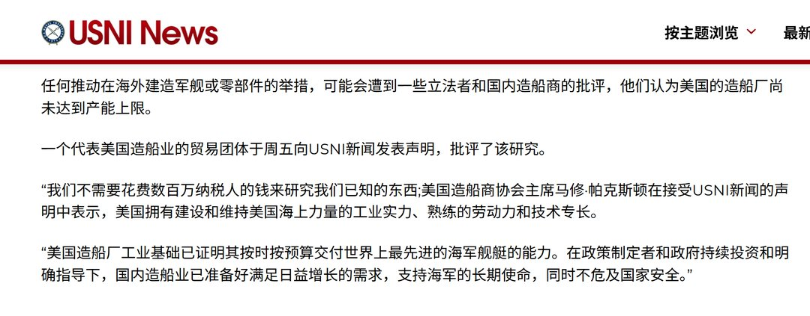

---

## 9

@蚁工厂

发表于：2026-05-21 00:42

来源：微博

链接：https://m.weibo.cn/status/5300931927479399

OpenAI Codex团队的开发者体验工程师jason Liu又发了一篇Codex教程，帮你更充分的利用 Codex。

\# 更充分地使用 Codex

大多数开发者最开始使用 coding agent，都是为了写代码：查看代码仓库、生成修改差异、运行测试，以及提交 pull request。

这依然是 Codex 的核心能力。但电脑上的很多工作，本来就已经通过代码间接完成了：执行 shell 命令、浏览网页、调用 API、导出文档、响应事件、触发自动化流程。随着这些能力逐渐开放给 Codex，它就不再只是狭义上的编程助手，而更像是一个帮助你完成电脑工作的系统。

Codex app 让这种变化变得更具体。一个对话线程可以持续保留上下文、调用工具、展示产物，并在多轮指令之间继续推进，而不是每次问答后都重新开始。

想更充分地使用 Codex，需要把这些能力组合起来：

- 能持续保留上下文的持久线程

- 在用户仍参与其中时使用语音、即时调整和任务排队

- 使用 browser、computer-use、MCP servers 和连接器，让 Codex 能处理代码仓库之外的工作

- 使用线程自动化和目标，让工作在用户离开后继续推进

- 使用侧边栏，让用户审阅代码、文档、演示文稿和其他产物

\#\# 持久线程

**持久线程：** 可以跨多次会话保留工作上下文的长期 Codex 线程。

置顶线程是一种让持久线程保持易访问的方式。它适合反复出现的工作流，例如：

- Chief of Staff 线程

- 发布线程

- 文档审阅线程

- 文档审阅线程

- 专门用于外部监控的线程

这些线程是持久工作区，不是短对话。Codex 可以在之后继续回到这些线程，保留之前的决定、偏好和工作上下文。否则，这些内容每次都需要重新建立。

置顶线程快捷键让这种方式更实用。Command-1 到 Command-9 可以直接跳转到已保存的线程。

\#\# 语音输入

语音输入的价值在于，它能记录一个想法还没有被整理成正式文字前的粗略版本。

Codex 内置了语音输入。它特别适合那些说出来很自然、但打字时很难整理清楚的模糊起点：

> 我记得 Slack 里好像有个叫 Ben 的人提过这个。  

> 我不记得细节了。  

> 请去查一下。

对于一个能够搜索、收集上下文并汇报结果的代理来说，这通常已经足够。

它也很适合在任务尚未完全成形之前，进行两三分钟的想法倾倒。

会议转录也可以用同样的方式处理。一份原始会议记录或口述规划笔记，往往比简短摘要更适合作为材料，因为它保留了不确定性、重点和未完成的想法。

\#\# 即时调整和任务排队

语音输入如果配合对当前任务的明确控制，会更有用。

**即时调整：** 在 Codex 正在执行任务时，于当前步骤完成之前打断它，并给出新的方向。

当代理正朝着不合适的方向推进，需要在它完成之前修正时，这很有用。比如在审阅网站时，用户可以一边在侧边栏里标注界面，一边打断当前工作：

- 让这个小一点

- 这两个元素之间的间距感觉不太对

- 这段文案不对

**任务排队：** 给 Codex 添加当前步骤完成之后要处理的工作。

任务排队和即时调整不同。它不会打断正在进行的任务，而是把下一个任务加入队列。用户可能会说：

> 等工作完成后，把预览链接发给 Slack 里的审阅人。

即时调整改变 Codex 现在正在做什么。任务排队改变 Codex 接下来应该做什么。两者都能让用户在工作推进过程中保持参与。

\#\# 工具和可操作范围

一旦线程具备连续性，接下来的问题就是它能操作什么。Codex 可以逐层向外扩展：

- `$browser`：用于侧边栏里的内置 browser，Codex 可以检查并标注网页界面

- `@chrome`：用于依赖用户 Chrome 登录状态的浏览器工作流

- `@computer`：用于只能通过桌面图形界面完成的工作

`$browser` 适合侧边栏里的网页审阅。`@chrome` 适合依赖用户 Chrome 上下文的登录态浏览器工作。`@computer` 适合那些只能通过桌面图形界面完成的任务。

MCP servers 和连接器会把同样的思路扩展到工作流的其他部分。Slack、Gmail 和 Calendar 很重要，因为很多重要任务最开始并不是代码，而是消息、邮件或日程问题。

技能让重复工作流可以复用。当一个工作流被证明有用之后，可以把它打包成一个技能。这样 Codex 下次就能再次执行，而不需要重新学习整套流程。

\#\# 随时继续工作

Codex mobile app 改变了用户必须坐在桌前的时机。一个任务可以在 Mac 上开始，因为文件、权限和本地环境都在那里；之后用户可以通过手机继续查看和参与。

这在很多小场景中很有意义。用户可以在 Codex 执行较长任务时离开桌面，在外面回答问题、批准下一步，或者在回到电脑前重新指引线程。原本的本地环境仍然保留，用户不必一直守在电脑前。

\#\# 自动化

自动化会按计划运行 Codex 工作。当某个重复任务应该从某个工作区重新开始时，可以使用计划自动化，例如日报或定期代码仓库检查。当计划任务应该回到一个已有对话，并继承其中的运行上下文时，可以使用线程自动化。

**线程自动化：** 类似心跳一样的周期性唤醒机制，会按计划回到同一个 Codex 线程。

置顶线程很有用，但它们仍然需要等待用户回来。线程自动化可以每几分钟或每几小时检查一次某件事，持续运行直到满足某个条件，并随着时间调整频率。

一个 Chief of Staff 线程可能每 30 分钟运行一次：

> 每 30 分钟检查 Slack 和 Gmail，看看有没有需要我关注但尚未回复的消息。  

> 帮我判断哪些事情最重要。  

> 如果有人问我问题，请尽可能深入研究答案，并为我起草回复，但不要发送。

当用户回来时，收集上下文这部分耗时工作通常已经完成。最终发送什么，仍然由人决定。

线程自动化也适合反馈循环。它可以关注 pull request 评论、Google Docs 评论或 Slack 回复，并在用户离开时继续推进相关工作。

设想一个动画工作流：审阅人在 Slack 里分享了一段视频。线程自动化可以按计划检查这个线程；当评论出现时，渲染更新版本，并在同一个线程中回复和提及审阅人。如果某个集成无法完成最终上传，桌面自动化可以通过图形界面完成这一步。

这个流程横跨 Slack 反馈、代码库渲染和桌面自动化上传。

\#\# 目标

当任务有真实完成标准，并且代理可以持续朝这个标准推进时，目标最有价值。一个较弱的目标是：

**目标：** 有明确完成线、Codex 可以随时间持续推进的长期任务。

> 按这个 Markdown 文件里的计划实现。

更强的目标应该有可衡量的成功标准。

例如，工程师可能要把一个内部工具从 Python 迁移到 Rust。他可以建立新的目录，定义目标，并明确完成标准：新的实现只有在单元测试通过后才算完成。

一个目标会把持续执行和验证方式结合起来。用户定义期望结果、停止条件，以及用来判断 Codex 是否更接近目标的信号。

有用的验证方式包括：

- 测试套件

- 性能基准

- bug 复现方式

- 验证矩阵

- 必须持续通过的端到端工作流

有野心很重要，但没有验证方式，它就只是愿望。

\#\# 侧边栏

侧边栏会把工作保留在产生它的对话旁边。用户不需要导出产物再切换到其他环境，而是可以在原处审阅。输出可能是代码，也可能是演示文稿、PDF、浏览器页面、表格，或过程中创建的其他产物。

它特别适合四类工作：

- 查看产物

- 标注需要修改的内容

- 操作网页界面

- 审阅改动

侧边栏让用户可以在原处审阅 Markdown、电子表格、数据表、文档和幻灯片。他们可以检查、标注和修改产物，而不需要离开当前工作流程。

图2

\#\# 标注

演示文稿或 PDF 可以一直在生成它的线程旁边打开，方便直接审阅和修改。

图3

\#\# Codex 中的表格

内置 browser 让 Codex 可以检查渲染后的页面、控制页面，并直接响应用户在被审阅界面上的标注。页面或产物上的评论会留在当前工作流程里，而不是变成另一轮交接。

网页既是输出界面，也是控制界面。Codex 可以生成一个产物，在侧边栏中打开它，检查它，调试它，并在原处继续完善同一个对象。

图4

这些界面尤其适合：

- 用于轻量级静态产物的 `index.html`

- 用于界面审阅的 Storybook

- 用于程序化动画的 Remotion Studio

- 用于演示文稿的浏览器幻灯片

- 用于分析工作流的数据应用

一个单独的 `index.html` 文件就可以成为一个持久的交互式产物，并且不需要服务器。线程自动化也可以随着时间刷新静态产物，让用户回来时，线程里已经有新的内容可以查看。

\#\# 共享记忆

当长期线程能够在单个对话之外共享记忆时，它们会更有用。

**共享记忆：** 存储在单个线程之外的持久上下文，让未来的工作可以从明确且可审阅的内容继续。

一种持久做法是把长期线程连接到一个 Obsidian vault。实际使用时，这意味着一个由纯文本文件组成的文件夹；这些文件长期来看容易检查、编辑、移动和保存。团队可以把这个文件夹存放在云存储、Git、Dropbox、Google Drive 或其他适合自己工作流的同步层中。

一个 vault 可能长这样：

```text

vault/

├── TODO.md

├── people/

├── projects/

├── agent/

└── notes/

```

在顶层，`AGENTS.md` 可以定义 Codex 在了解更多人、项目、决定和待处理事项时，应该如何更新这个工作区。

不要照搬某一个 vault 结构。应该告诉代理：持久上下文应该放在哪里，什么上下文值得保留，以及什么时候不应该制造无意义的变动。

一个实用的 `AGENTS.md` 可能会写：

```text

- Treat ~/vault as durable work memory.

- Prefer canonical notes over note sprawl.

- Route TODOs, people, projects, daily summaries, and scratch notes explicitly.

- Preserve decisions, blockers, owners, dates, and useful links.

- If nothing meaningful changed, do not churn the vault.

```

代码仓库保存代码。Vault 保存持续变化的上下文：涉及哪些人、发生了什么变化、什么受阻、哪些事情需要跟进，以及那些原本会在会话之间消失的信息。

重要上下文不应该只存在于对话记录里。应该把它写到某个地方，让下一个线程能继续使用。

Codex 也有官方记忆功能，位于 Settings > Personalization > Memories。它们可以记录偏好、重复工作流和常见问题，作为一种本地回忆层。它们是对显式书面上下文的补充，不是替代。Chronicle 也朝着同一方向发展，帮助 Codex 从近期屏幕上下文中建立记忆。

\#\# 从代码向外延伸

Codex 仍然从代码开始。但围绕代码的更多工作现在都可以通过同一个系统触达：MCP servers、browser 界面、桌面控制、线程自动化和可审阅产物。

这改变了控制方式。即时调整会改变正在进行的工作。任务排队会安排接下来要做的事。线程自动化会在用户离开时保持线程活跃。目标会加入明确的完成线，让 Codex 能持续朝目标推进。

Codex 现在可以把一个工作流从指令带到执行，再带到产物审阅，即使这项工作已经离开了代码仓库。

\#AI创造营\#


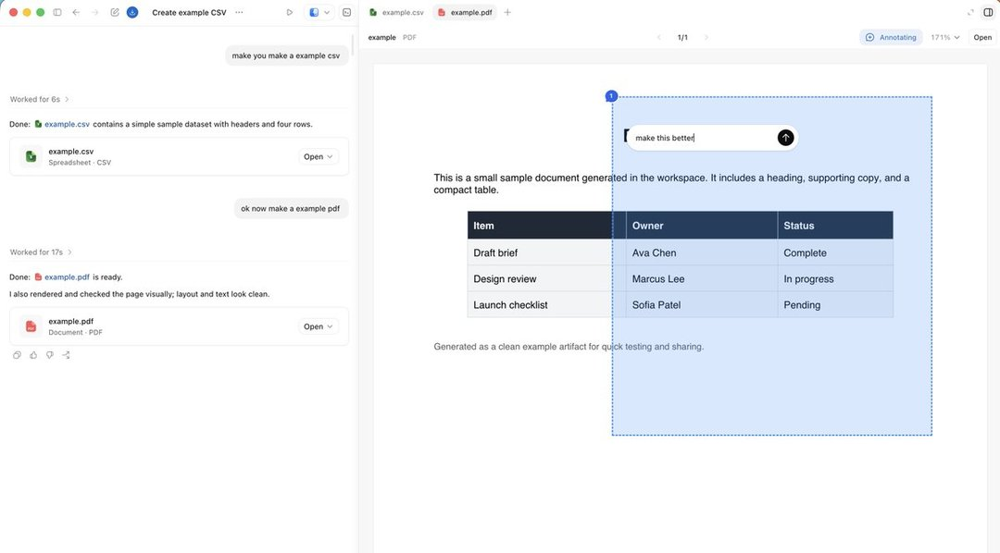

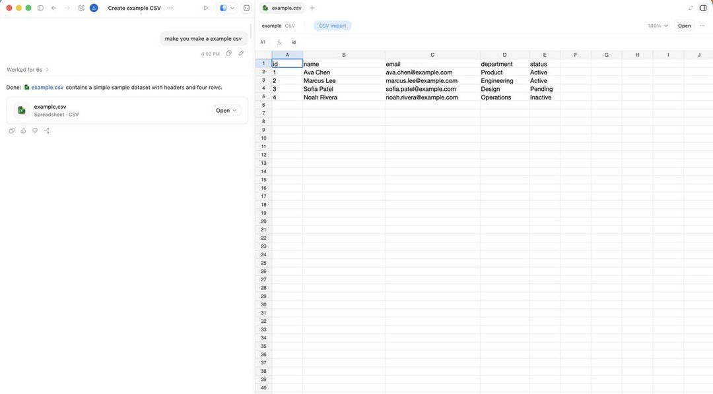

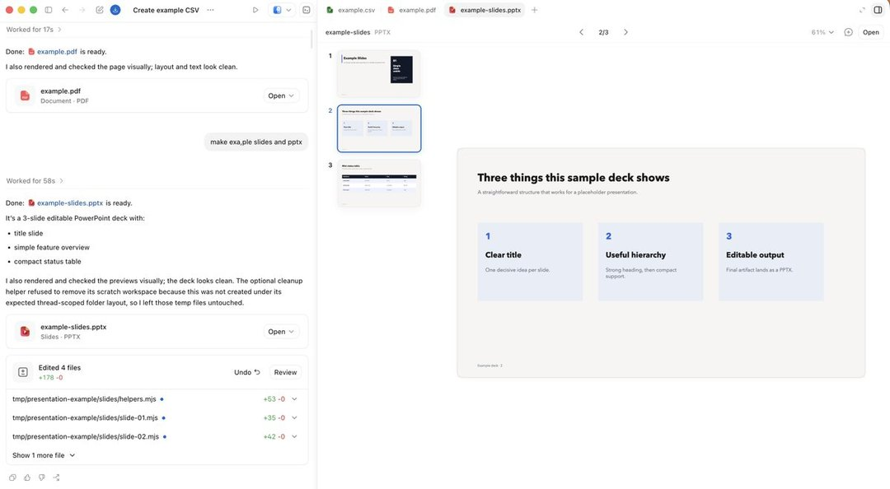

---

## 10

@财联社APP

发表于：2026-05-22 08:19

来源：微博

链接：https://m.weibo.cn/status/5301409508495670

\#整治非法跨境证券期货基金经营活动\#【中国证监会牵头开展非法跨境证券期货基金经营活动综合整治工作】财联社5月22日电，近日，经国务院同意，中国证监会、工业和信息化部、公安部、中国人民银行、市场监管总局、金融监管总局、国家网信办、国家外汇局等八部门联合印发《综合整治非法跨境证券期货基金经营活动实施方案》。中国证监会有关部门负责人就《整治方案》回答了记者提问。一是全面开展监测排查，二是强化互联网平台和信息清理，三是加强境外机构等约谈督促，四是开展重点案件调查处罚，五是坚决处置非法跨境经营活动及其主体，六是加强相关跨境证券期货基金投资管理，七是强化跨境监管协作，八是保护投资者合法权益，九是做好政策宣传引导，十是完善监管制度，引导合规投资。其中，中国证监会牵头开展非法跨境证券期货基金经营活动综合整治工作。金融监管总局负责金融消费者保护、境内银行机构监管相关工作。中国人民银行负责运用反洗钱系统配合开展有关工作。国家外汇局负责外汇管理相关工作。市场监管总局负责依法加强境内相关经营主体登记监管，会同有关部门依法加强对相关广告活动的监管。国家网信办负责加强网络涉非信息治理处置。工业和信息化部负责依法处置经金融管理部门认定的违法违规互联网应用。公安部负责查处非法经营等经济犯罪活动。地方人民政府落实防范打击非法跨境证券期货基金经营活动的属地责任。\#严禁境外机构非法提供开户交易服务\#


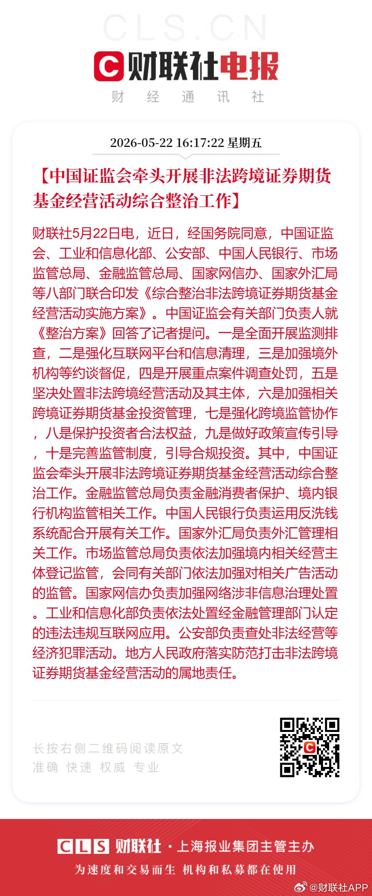

---

## 11

@梅华龙_MHL

发表于：2026-05-22 07:06

来源：微博

链接：https://m.weibo.cn/status/5301391035728072

路透社援引一位巴基斯坦消息人士的话称：有人担心特朗普的耐心正在耗尽，但我们正努力加快双方之间的信息传递速度。

————————

问题是，特朗普的耐心很重要吗？美军的能力才是最重要的。没有能力，你有没有耐心结果都不会有什么区别。现在的耐心跟2月底的耐心、4月初的耐心比，有什么变化吗？

变化的是能力：能力比之前更弱了，而伊朗再回复。

美国仍然有可能暗杀某些领导人（或至少还在争取）。他们的目标是找一个不想抵抗的上台，但哪有那么容易？这种人有可能存在，但伊朗人内部应该也早就能推测出对方有哪些人选。考虑到伊朗自己的历史和现状，你杀掉一个之后马上上来一个两面人或投降派而且还能服众的概率有多高?

已经杀害那么多人了，如果这么做有用，那为什么那个帝国主义的天选之子还没出现？

能把一个地方所有抵抗精神都杀死的不是暗杀，而是虚情假意、口蜜腹剑、出尔反尔的“合作”和“交流”。去投资，去参股，去买通、去洗脑。天天靠制裁、暗杀、屠杀、封锁，或像以色列一样抢房子抢地抢钱，这就是在不断制造新的抵抗精神。

\#全球变局与舆论斗争\#


---

## 12

@北京日报

发表于：2026-05-22 01:55

来源：微博

链接：https://m.weibo.cn/status/5301312775260351

【\#郑成功的功劳远不止收复台湾\#】\#读懂郑成功就是读懂民族精神\# 几乎没有中国人不知晓郑成功的名字。教科书上写着他收复台湾的伟业，民间流传着他“国姓爷”的传奇，海峡两岸至今仍有上百座祠庙供奉着他的香火。可我们真的了解他吗？

他究竟是“反清复明”的孤臣，还是大航海时代的海权先驱？当他的父亲郑芝龙率十万水师降清，这个年轻人为何偏偏毅然焚毁青衣、投笔从戎，选择了一条注定艰险的路？收复台湾时他三十八岁，半年后离世，年仅三十九岁。史书记载，临终前他“以两手抓其面而逝”——有人说他是病死的，有人说他是被毒死的，也有人说他是气急攻心、自毁面目……他到底经历了什么？

我翻阅张培忠先生的这部《赤心擎海：郑成功传》时意识到，这不只是一本传记，更像一次对民族记忆的深度打捞。

十六年遍访郑成功足迹

写郑成功这件事，比想象中要困难得多。2009年，中山大学的陈春声教授劝张培忠撰写一本郑成功的传记。他一开始拒绝了，直到后来无意中发现一个细节：郑成功的曾祖母谭氏居然是潮州澄海人，与自己是广东同乡。这个学术界从没注意过的信息，像一根火柴点燃了他。

此后十六年，张培忠几乎跑遍了郑成功到过的每一个地方。他两次去到日本平户市川内町，站在郑成功出生的喜相院里，摘下当年他手植的一片竹柏树叶。他爬上闽北仙霞关的隘口，想象当年那个二十三岁的青年如何镇守这道险关。他在浙江舟山的海边站了很久：三百多年前，郑成功的船队在这里突遭台风，八千将士葬身海底，三个儿子遇难。在台湾台南，他站在台江入海口，想象着鹿耳门天文大潮中舰队鱼贯而入的惊心动魄。

为了寻找参考资料，张培忠更是费了大力气。他托人从哈佛大学哈佛燕京图书馆复制珍稀文献；托去加州理工做访问学者的朋友复印《郑芝龙与十七世纪的东亚国际贸易》；自掏腰包请广外的日语研究生翻译日文材料……前前后后，他通过各种渠道收集到的郑成功相关史料近千种之多，最终变成了一部五十五万言的巨制。

有血有肉的郑成功

这本书里的郑成功，不再是贴在墙上的英雄画像。

他一生都在冲突中度过——文化的冲突、父子间的冲突、忠与孝的冲突、情与理的冲突。他是军事奇才，也曾因轻敌做出错误决策。北伐南京时连胜骄兵，听信了清军的缓兵之计，结果功败垂成。他屡次劝谏父亲郑芝龙不要降清，父亲却一意孤行，最终全家十一口惨死京城。收复台湾后他积劳成疾，又得知长子郑经行为失检，气得吐血，连发令箭要杀儿子。临终前，他“以两手抓其面而逝”——史书上的“毁容而死”四个字，至今读来仍让人心头一颤。

郑成功去世时年仅三十九岁。他没能看到自己梦想的那个海权时代，但一个在矛盾中挣扎、在绝境中坚守的郑成功，比任何神话都更动人。

更难得的是，这本书把郑成功放进了17世纪的全球图景里。他不仅是反清复明的斗士，更是大航海时代的先行者。他跟荷兰东印度公司打过贸易战、情报战、外交战——谈判破裂后，下令全面封锁对台贸易，一封就是两年，直到荷兰人低头认输。这些内容，让郑成功跳出了“反清复明”的老框框。

中国作协书记处原书记施战军评价这本书是传记文学的“大作品”，他一口气用了六个“大”：“大动荡、大复杂、大国族、大英雄、大格局、大功夫。”

民族精神的当代呈现

我们今天读郑成功，到底在读什么？

我想，最重要的，是他身上那股“不服”的劲儿。忠贞爱国、敢于亮剑、海洋视野、重信守诺——这些词放在今天，依然不过时。

书中浓墨重彩地写了收复台湾的全过程：何斌献图，将台湾的地形水势与荷兰人的布防虚实一一呈上；澎湖誓师，郑成功率两万五千将士祭江拜妈祖，风浪中毅然起航；鹿耳门登陆，他指挥三百多艘战舰从荷兰人疏于防范的航道鱼贯而入，如神兵天降；激战台江，郑军以木船对抗西方最先进的火炮战舰，击沉荷军主力舰赫克托号；随后是长达九个月的围城，郑军一面攻坚，一面屯垦，在缺粮断炊的困境中苦撑待变。最终，荷兰人签字投降。

当西方列强的炮舰还在世界各地横冲直撞的时候，郑成功已经用一场完胜告诉世界：中国人不是不能打海战，中国人不是没有海权意识。

郑成功死后，清廷一度迁界禁海，中国的海岸线被主动封死。两百年后，当西方用炮舰撬开中国大门的时候，我们才猛然意识到——原来海洋不只是边界，它是权力本身。而这件事，郑成功在17世纪就已经知道了。

今天谈郑成功，绕不开台海。中国作协副主席李敬泽评价该书时说：“郑成功的意义超越传统民族英雄范畴，他是中华民族在大航海时代面对西方冲击的第一次有力回应。这本书不仅属于历史，更属于现实。”

三百多年后，我们读他的故事，不光是为了缅怀一位英雄。更重要的，是在那片他曾经浴血奋战的海疆上，重新思考一个民族该如何面对海洋、如何守护属于自己的蔚蓝。（@北京日报 作者 刘天天；视频：电影频道此前相关报道） 北京日报的微博视频


---

## 13

@理记

发表于：2026-05-22 13:18

来源：微博

链接：https://m.weibo.cn/status/5301484779471813

说实话房租降的我也挺肉疼，但既然人家开口，肯定是遇到困难了，房客人挺好的，不是那种爱占小便宜的人，现在做生意不容易，不赔钱就不错了，我大致有基本的判断。

所以我一开始就主动点，第一次开口就主动降了10%，他开始跟我讲哪些哪些困难，说去年亏了。

刚说一句我就说你不用讲了，一是我不了解没法判断，我又不能查你账，没必要。二是我相信你。

我说你就想清楚两个问题，第一是如果生意错了别硬撑，该撤就撤，但违约金你得付，我们适当商量。

第二，你要算清楚，降到多少确保能赚钱？

他说了个数，降了整整35%，说是提前算了很长时间。

我说行。

就谈了两分多钟。

并不是我什么爽快，现在的压力大家都有数，我早就想清楚了，房东其实跟房客是利益共同体，他的生意本质上是跟我一起做的，得共度时艰。

人家赔钱，或者白忙一年，我光想着自己，那长久不了。

都不容易。


---

## 14

@洪广玉

发表于：2026-05-22 13:30

来源：微博

链接：https://m.weibo.cn/status/5301487607481505

\#福建漳州泡药杨梅事件5人被刑拘\#\#福建漳州通报泡药杨梅事件\# 

像杨梅泡保鲜剂这种案子，如果要入刑，需达到"足以造成严重食物中毒事故或者其他严重食源性疾病"，这是两高司法解释的明文规定。但是，杨梅中泡的那个保鲜剂，其残留量根本达不到"足以造成严重食物中毒事故或者其他严重食源性疾病"的后果，因为如果能达到这个后果，那么在新的食品添加剂法规修订之前，面包、糕点等食品中是允许添加的，其添加的剂量也能达到严重致病后果了。

并不是说杨梅泡保鲜剂不违法，也不是说违法不应惩处，而是一切要依法惩处。不能为了平息舆论，讨好民众，就乱抓人，乱上刑。这不是法治，而是人治。

杨梅违法使用保鲜剂是一个问题，但仅靠全网道德声讨、抓人都是解决不了的。其原因在于时令水果有保鲜需求，类似于脱氢乙酸钠这种东西本身是合法添加剂，决定了它较易获得，且会给人留下“这东西问题不大”的第一印象（食品安全风险确实也很低），另一方面，市场上又缺乏合法、有效而又成本较低的保鲜剂或者保鲜手段，在更好的保鲜方式被推广和接受之前，也就只能这么偷偷摸摸用了。

更可悲的是，脱氢乙酸钠用于杨梅保鲜不仅无效，甚至会加速腐败。行业内不知道吗？当地农业部门不知道吗？你们领着俸禄，到底干了些啥？

现在板子都打在农户、收购商身上，合理吗？


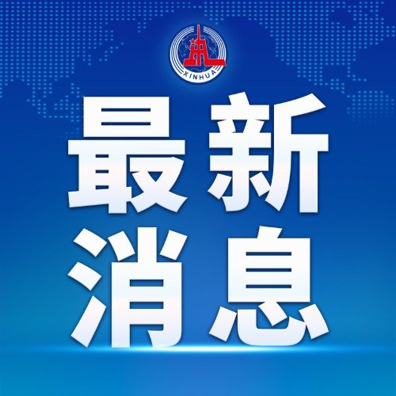

---

## 15

@图老板赛博札记

发表于：2026-05-22 15:24

来源：微博

链接：https://m.weibo.cn/status/5301516476095738

\#塌陷中的世界\#\#图老板的赛博札记\#


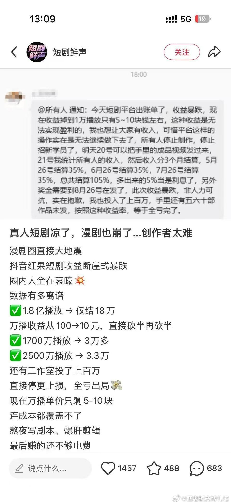

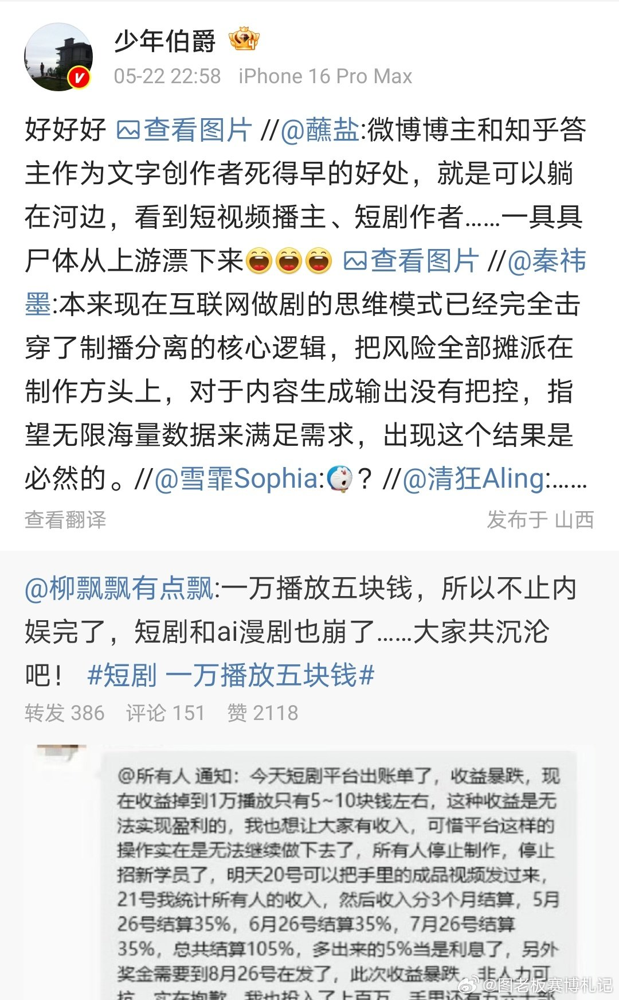

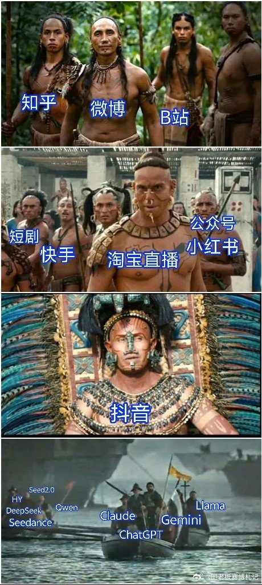

---

## 16

@包容万物恒河水

发表于：2026-05-22 15:21

来源：微博

链接：https://m.weibo.cn/status/5301515696738662

🔻有人上传了一张谷歌地图的截图到 Gemini Omni，上面画了一条路线。

🔻然后提示它生成一个第一人称视角的画面，模拟有人驾驶出租车沿着参考图像中的路线行驶。

🔻生成的视频2和真实情况非常接近。

🔻图3是谷歌地图的截图，图4是使用 Gemini Omni Flash 生成的视频截图。

🔻当然，也有其他用户测试，目前只在一些世界大城市局部有效。

\#AI\#\#热点现场\#\#海外新鲜事\#


---

## 17

@塔列郎

发表于：2026-05-22 16:46

来源：微博

链接：https://m.weibo.cn/status/5301537058589172

颧骨过高（克夫），耳后见腮（反骨），歪嘴（撒谎），凸眼（易怒），相由心生，：满脸横肉，面目狰狞，目露凶光。


---

## 18

@邪能之槌

发表于：2026-05-22 16:36

来源：微博

链接：https://m.weibo.cn/status/5301534543840750

确实。

之前韩国网友把疑似含有媎妹，夹带私货的游戏公司冲爆，一群人还嘲笑韩国网友小心眼，还跟着一起做那个手势。我就知道，这些二游玩家配得上现在的下场。


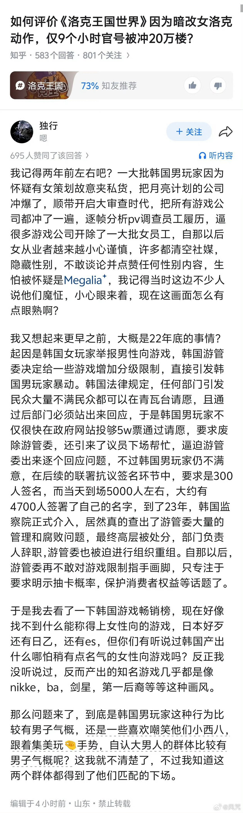

---

## 19

@李晓鹏博士

发表于：2026-05-22 16:23

来源：微博

链接：https://m.weibo.cn/status/5301531269661843

明朝崩溃和南明抗清运动不断失败的过程，同时也就是清朝兴起和清军节节胜利的过程。中华核心文明惨遭破坏和大幅度倒退的过程，也就是满洲文明不断进步的过程。

在征服中国的过程中，满洲民族迅速从落后的狩猎部族文明阶段进化到农耕帝国的文明水平。由于没有受到腐朽的理学思想污染，且内部特殊利益集团尚未发育成熟，这个处于上升期的民族表现出旺盛的活力，诸多优秀的帝王将相不断出现，并且善于任用汉民族优秀人才和政治制度来治理中国，这让他们在短时间内掌握了大约相当于中国秦汉时期的国家治理能力——在某些方面超过了秦汉，比如有了科举制度；在某些方面则要落后于秦汉，比如对思想文化的控制远远不如汉朝开明自由，但总体上是差不多。秦汉时期，也是汉民族积极进取，建立帝国体制和强大的军事力量，快速开疆拓土的时代。

清朝的建立对满洲民族来讲是一个极大的进步，相对于三百多年前征服中国的蒙古而言，也是一个巨大的进步。满洲勋贵们成功的克服了所谓“胡人无百年国运”的魔咒，统治中国长达两百六十八年，让清朝成为中国历史上第三长命的大一统王朝，仅次于唐朝和明朝。就其陆地疆土的广阔程度而言，清朝大于汉朝和明朝，跟唐朝、元朝在伯仲之间。

但对汉民族而言，这却是一个巨大的退步和长达两百多年的噩梦。中华文明因此倒退了至少一千年，某些方面甚至倒退了两千年——比如思想文化方面的自由程度连春秋战国时期的水平都达不到。

对清朝的疆域广大、统治时间长和它对人民的屠杀、思想文化的控制等如何做一个综合的评价和衡量——也就是孰轻孰重？是一个很复杂的问题。

我们继续从文明的视角来思考这个问题。

就目前为止的人类文明发展史来说，我们有几个基本的判断。比如，从游牧和渔猎文明走向农耕文明是一种巨大的进步，这一条不赞成的人应该不多。第二条，从农业文明走向工业文明，也是一个巨大的进步。这一条应该也没有什么问题。

中华文明在从游牧和渔猎文明走向农耕文明的过程中，是领先全世界的。不仅进入农耕社会的时间领先，更重要的是在农耕时代建立了古代社会最发达的政治体制、最辉煌的经济成就、最长久的和平稳定，并供养了数量最庞大的人口，开拓了广阔的疆域。这是值得每一个中国人骄傲的。

不过，在从农业文明走向工业文明的过程中，中华文明大大的落后了。这种落后，是什么原因造成的？

工业革命为什么没有发生在古代经济最繁荣的中国？也就是好多人喜欢讨论的所谓“李约瑟难题”——英国学者李约瑟（Joseph Needham，1900-1995）在其编著的15卷《中国科学技术史》中正式提出此问题，其主题是：“尽管中国古代对人类科技发展做出了很多重要贡献，但为什么科学和工业革命没有在近代的中国发生？”1976年，美国经济学家肯尼思·博尔丁称之为李约瑟难题。

这个所谓的难题其实一点也不难。之所以会成为难题，是因为它的答案，很多人出于利益原因不愿意讲，甚至还想办法不让人讲。

只要讲清楚明清换代之际，中国人所遭受的人类文明史上空间绝后的大屠杀 ，这个难题其实就不是难题了。

明清换代，人口从四个亿给杀到还剩不到一个亿，尤其是在经济文明最发达的江南华南地区出现大规模屠城，城市精英人口损失殆尽，面对野蛮暴政稍有点反抗精神的人都会被全家老小一起杀掉，沿海五十里内的人民和城镇被尽数毁灭，这种情况下，哪里还有可能爆发什么工业革命呢？如果英国在十八世纪刚刚发明珍妮纺纱机的时候，突然遭到北欧海盗的入侵并被征服，在各大城镇疯狂屠城，令其损失一半以上的人口，它能爆发工业革命吗？

中国未能爆发工业革命的直接原因，如果只挑选一条，那就是明清换代。一个处在工业革命爆发前夜的文明，突然遭到北方蛮族的入侵，对其人口进行了毁灭性的屠杀。《天工开物》等诸多本土科技典籍因此失传，《几何原本》等西方科学名著的翻译被迫中断。被屠杀的人口中，也许就有类似于牛顿、笛卡尔、莱布尼茨这样的人物，或者是可以启迪他们发明创新的师友，还有很多可以发明诸如珍妮纺纱机、蒸汽机的能工巧匠。总之，就是整个东南沿海的手工业创新体系被彻底摧毁。工业革命在短期内（一两百年）爆发的可能性自然就消失了。

当然，这只是直接原因，它是背后还有很多更深刻的间接原因。核心还是汉民族内部精英的集体堕落，不管是理学思想的僵化、官员的腐败、财富阶层的自私、东林党的无耻、孙承宗和袁崇焕的愚蠢、农民起义军的不团结和战略失误……这些都值得深刻反思。也包括西方殖民活动带来的白银货币冲击、中国的背靠大陆面向大海的地理特征等客观因素。但最后所有原因汇总起来，让北方蛮族入侵成功，杀遍中国，这是一个总阀门——它最终切断了、关闭了中华文明自主进入工业文明的发展路径。

我们分析历史无论如何强调各种间接原因、客观因素，这个总阀门绝不能跳过去不讲或者有意无意的淡化。只有把这个总阀门的前因后果讲清楚，中国历史的脉络才能说清楚、讲透彻。也许会有人说我们记仇，或者煽动历史仇恨之类的。那毕竟是古代社会的事情，也过去好几百年了，记仇是不应该的。关键在于：不讲明白，就会不停的有人乱甩黑锅，把中国近代落后的根源甩到中华帝国的皇帝专制制度、科举考试制度、朱元璋杀功臣、明朝海禁、中国人的劣根性之类的东西头上。我们可以不记仇，但不能乱背锅。这个锅背错了，我们反思历史的方向就会发生错误，会对我们未来道路的选择产生深远的影响。

——来自《巨变与突围：碰撞中的清帝国》第三章


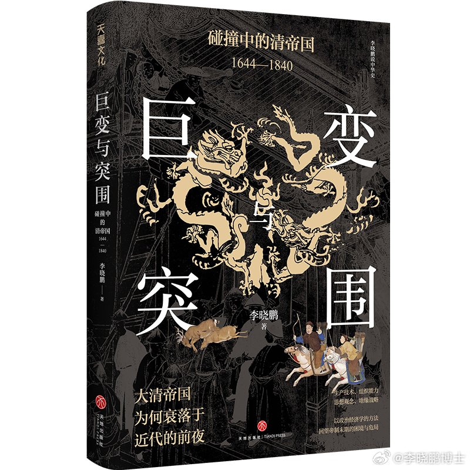

---

## 20

@少年伯爵

发表于：2026-05-22 16:21

来源：微博

链接：https://m.weibo.cn/status/5301530857308869

为什么某些巨擘网购平台一定要上架“茅子和果机”呢？——因为非常有利于提前卖出海量g物k，比如某某平台g物k。

这是什么原理？——因为茅子和果机是地下鬼市里最容易接手转让的、并且可以公开s架合法售卖的硬通货，而这些都可以通过那些不记名的g物k，悄无声息的完成闭环交易。

🐟和2shou平台不也一样吗？——因为某些巨擘平台g物k根本不用费劲折腾倒手，直接提前谈好，填写下家的地址即可，全程合规，而且非常快。

对了，这些g物k还可以合规的拿到黄鱼首饰、奢c品包+机x表……

所以这些平台g物k在鬼市上，可以秒出，九成九。


---

## 21

@楚团长聊聊天

发表于：2026-05-22 10:26

来源：微博

链接：https://m.weibo.cn/status/5301441331462705

今天有个自媒体朋友被炸号了，我不太认同这种管理方式，我也不得不适应。

还是说两句难听的，就像老编辑说的，总要有社会担当。

中国科技腾飞如火如荼，我也高度认可产业竞争力很好。

但如果不改变人口结构，繁荣可能也只是烟花。

日本央行前行长白川方明在亚特兰大联邦储备银行做过一期采访，对失落二十年感兴趣的，一定要去看一下。

他特别强调，把两个十年混为一谈是误导性的。

第一个十年，主要是泡沫破裂后的去杠杆。

日本80年代末资产泡沫破裂后，企业、银行、居民都在修复资产负债表。坏账、不动产价格下跌、金融机构惜贷，使得货币政策传导效率下降。外界常常低估了泡沫破裂后“资产负债表修复”需要的时间，也过度相信激进政策能迅速解决问题。

第二个十年，主要是人口老龄化和人口减少。

到2000年代以后，日本低增长的主要来源不再只是泡沫后遗症，而是快速老龄化和人口下降。日本按总GDP看很低迷，但按人均GDP，尤其是按劳动年龄人口计算的实际GDP增长，日本在发达国家中并不差。问题在于：劳动年龄人口这个“分母”本身在快速缩小。

一个国家人均效率还能维持，但如果劳动年龄人口持续减少，那么总需求、住房需求、企业收入扩张、税基增长都会受到约束。

日本失落的本质，不是日本人突然不努力了，而是支撑总量扩张的人口结构反过来了。

企业家结构彻底老了，就没办法在新技术面前，做出准确有勇气的判断了。

日本失落的二十年，前半场是泡沫破裂后的债务清算，后半场是人口结构逆转后的总量失速。

白川方明真正想提醒的是：通缩只是表象，老龄化和社会适应迟缓，才是更深的底层变量。


---

## 22

@作家叶倾城

发表于：2026-05-22 04:45

来源：微博

链接：https://m.weibo.cn/status/5301355518362056

我要吐槽相当多博主：你们跟我看的是同一部电影吗？

最近《给阿嬷的情书》大热。

我的习惯，大热片都要退后一段。

——让热潮过去，如沸汤必须要渐渐地温下去，方能入口。

所以我迟到最近几天才看电影。

还是我的习惯，我喜欢看上午场。图人少清净，常常单人包场。

结果灯才熄下来，就哗啦啦进了好多人，有位大哥就坐我身边。

影片快结束的时候，我听见他用力抽鼻子。

斜斜一瞥，他在用手背擦眼泪。

整排观众，都在用不同工具擦眼泪——包括双手、衣襟、餐巾纸、手帕。

之前，许多位博主提供的信息都是错误的。

这片子，哪里是什么“女人丧偶式育儿，男人就寄回来几斤猪肉”；

或者“难道还要鼓励女性忍辱负重守活寡吗？三观不正”。

这明明是，是一封“给祖国阿嬷的情书”。

说的是下南洋艰苦求生的华人；

守望相助的华人；

大情大义的华人；

创业难、守业不易的华人；

是华人，如何与台风斗、与大海斗、与命运斗，一步步走到了今天。

如果它有所弘扬，那么，便是中国最传统的价值观：

男儿为国为家，出生入死；

女儿为母则刚，撑家立户；

男子打仗、赚钱、探索……在边关，

女子耕种、纺织、育儿……在家园。

时代变迁，这一切都不分性别，男女均大有可为。

总之就是：

做人一生有情义；

自有贵人来相助。

——是“做人”，不是做男人，也不是做女人。

所谓：江海万里，心中念你。——念的，是祖国，是唐山，是我们共同的出处。


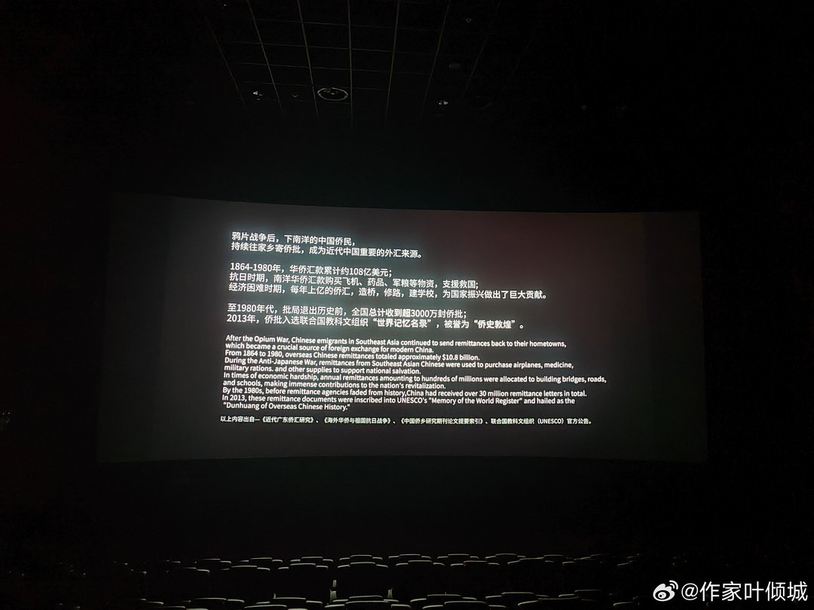

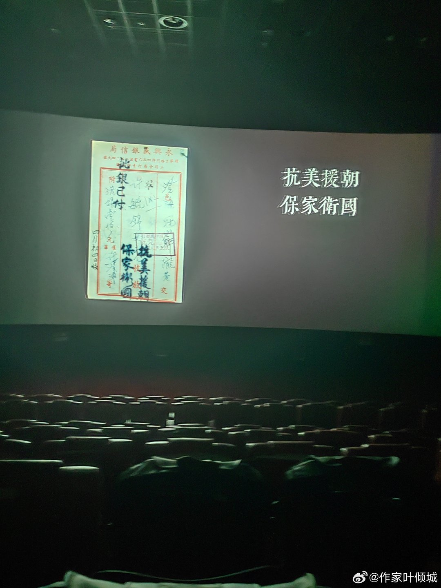

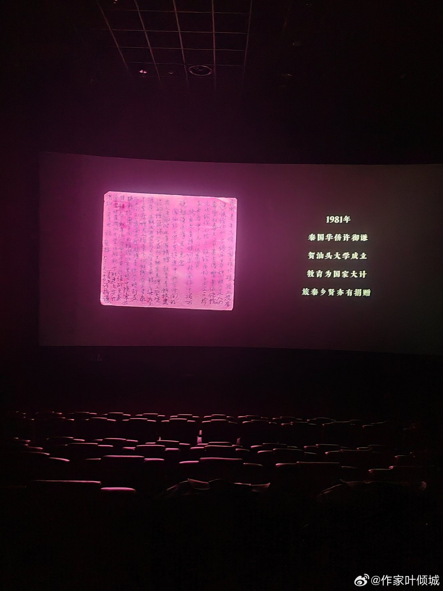

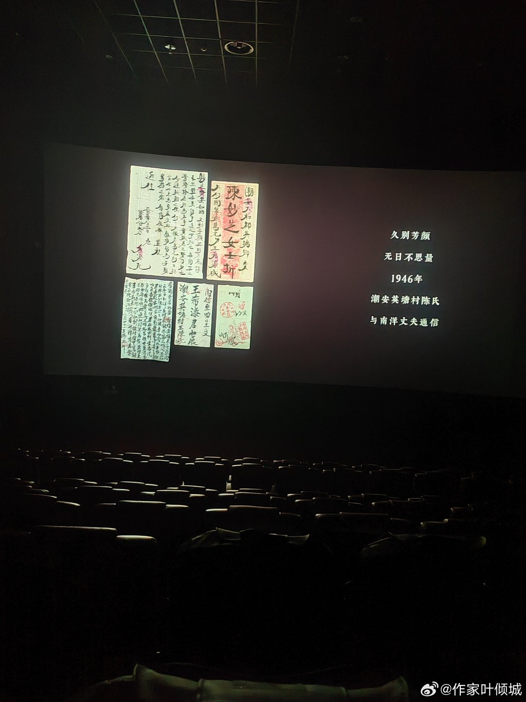

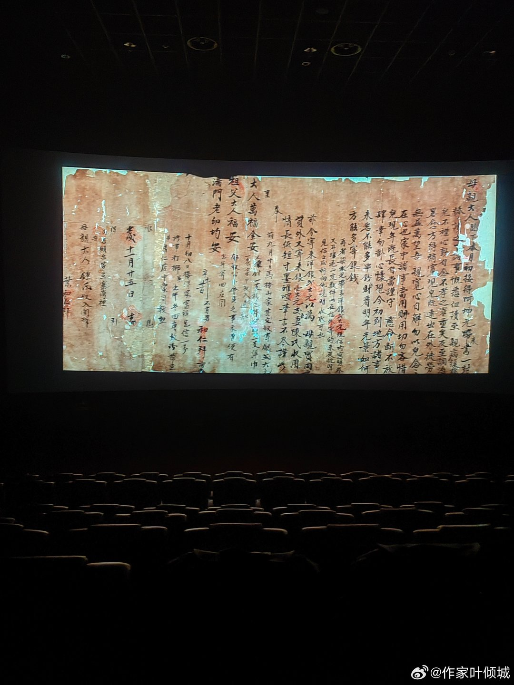

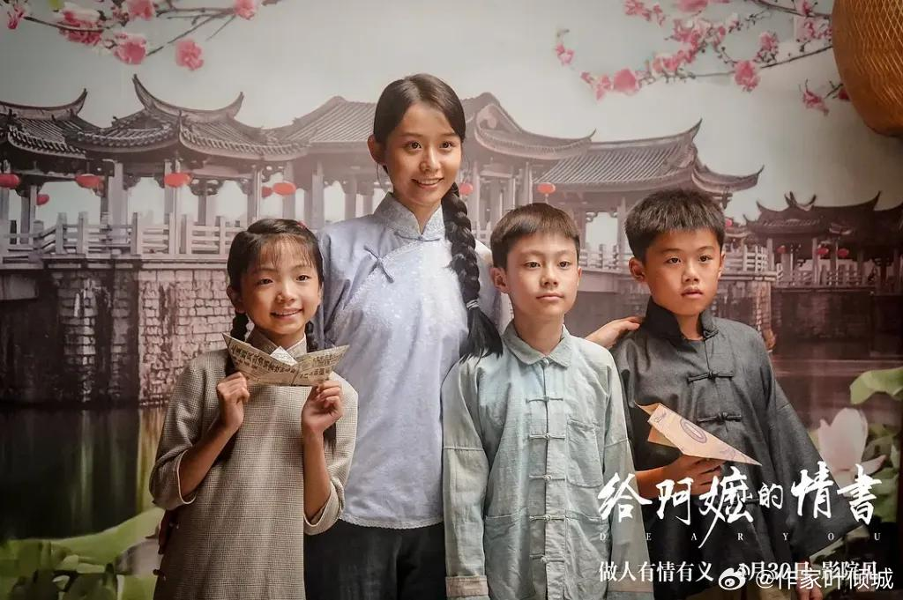


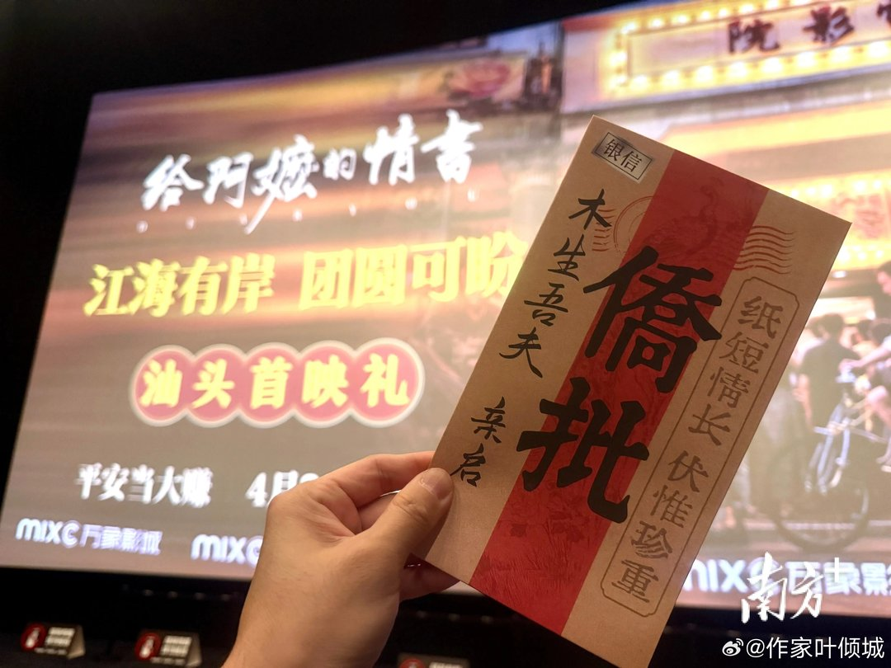

---

## 23

@庄时利和

发表于：2026-05-23 11:51

来源：微博

链接：https://m.weibo.cn/status/5301708548741675

有人说为什么其他人看电影时都在哭，我看完了没觉得有什么好哭的啊？

这让我想起知乎有个问题「我为什么感受不到演员演技的好坏」，底下有个回答，我在许多年以前就看过了，但还是会时常翻出来看。

尤其是最后一段话。

*******

金庸老先生曾经在《倚天屠龙记》的后记中有这样一段话:

「然而，张三丰见到张翠山自刎时的悲痛，谢逊听到张无忌死讯时的伤心，书中写得太也肤浅了，真实人生中不是这样的。因为那时候我还不明白。」

这段话书写于金庸的大儿子查传侠于美国自缢身亡之后，即便一生命途多舛辗转流离如金庸先生,也只有在至亲之人离世的那一刻才能真正体会到所塑造人物悲痛的肤浅。因此，很多东西我们看不懂理解不了，这太正常了。

很多的天真、无知与狂妄，都来源于人生阅历的缺失，于人情，于世事，于艺术，于生活。

但这并不可耻，也不可悲，毕竟有些阅历如果一辈子都没有，可能会更幸福。


---

## 24

@汪海林

发表于：2026-05-22 09:34

来源：微博

链接：https://m.weibo.cn/status/5301428404882528

从价值观上讲，现在的语境下，切忌单一的价值表达，可以拍营救英国水军美国飞行员，但是游击队员应该表示：我从来也不喜欢你们，你也不用谢我，我这么做纯粹是为了让小日子不高兴。可以拍参加统一战争的同时，主人公加入了天地会，秘密从事反清复明的事业。历史本身的复杂性，不能变成黑白两条线，大量的互相矛盾的、灰色的、中间性、模糊的历史片段要成为主线叙述的重要背景。不要因为主题的伟光正忽略历史本身的多侧面，文学界为什么推崇雨果，他的历史叙述总是在充满正义感的同时具备思辨性，从来不是非此即彼的价值判断。有些作品的所谓价值观出了问题，我恰恰觉得是艺术上的问题更大。


---

## 25

@江湖李傅相

发表于：2026-05-22 22:45

来源：微博

链接：https://m.weibo.cn/status/5301627460255800

结过婚以后，夫妻俩就干三件事：


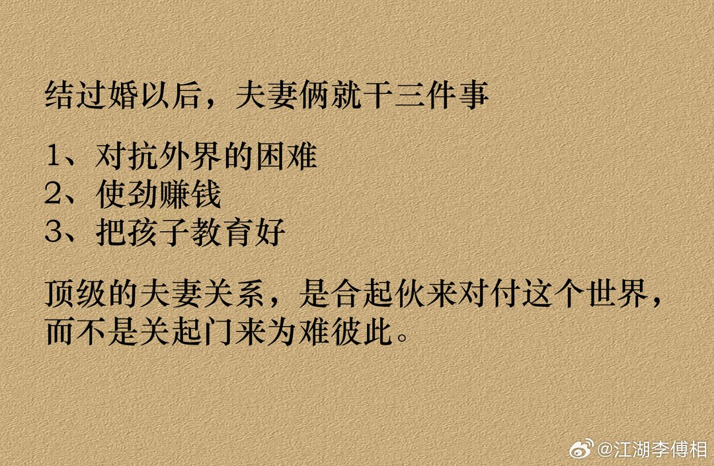

---

## 26

@默庵·超级个体

发表于：2026-05-22 05:37

来源：微博

链接：https://m.weibo.cn/status/5301368568940045

Meta 最近这波裁员，操作流程堪称教科书级别的精致。

裁员前一天，公司群发了一封温暖的通知：明天大家在家办公吧，出于人文关怀。你看，多体贴，多善良。

然后等所有人乖乖搬离工位，回到家里，打开电脑准备远程干活的时候，凌晨 4 点，一封邮件准时送达：你被裁了。

凌晨 4 点。连让你做个完整的梦都不肯。

等你回过神来，想去公司收拾东西，门卡已经刷不进去了。昨天还让你带着笔记本回家，今天你连大门都进不去。所谓的人文关怀，原来是怕你当面闹事。把人赶回家再动刀，干净利落，连血都不会溅到地毯上。

但这还不是最精彩的部分。

那些没被裁的人，电脑上被悄悄装了一个叫 Model Capability Initiative 的软件。这玩意儿会记录你的每一次鼠标移动，每一次点击，每一次键盘输入，时不时还给你截个屏。

记录这些干嘛？训练 AI。让 AI 学会你怎么操作电脑，怎么用各种软件，怎么完成你的日常工作。

换句话说，你每天上班，其实是在手把手教你的替代者。你亲手喂养的那个 AI，终有一天会回过头来吃掉你。而且你还不能拒绝，因为拒绝就是下一批。

留下来的人成了活体数据源，走掉的人成了沉默的成本优化。

与此同时，Meta 正在创下有史以来最高的利润纪录。

公司赚得盆满钵满，员工凌晨 4 点被扫地出门。留下的人一边干活一边被榨取行为数据，亲手锻造取代自己的武器。走的人连门都进不去，留的人连隐私都保不住。

这哪是什么赛博朋克，赛博朋克好歹还有个反抗军。这就是现实，冷冰冰的，连科幻小说都不敢这么写的现实。

\#科技先锋官\#


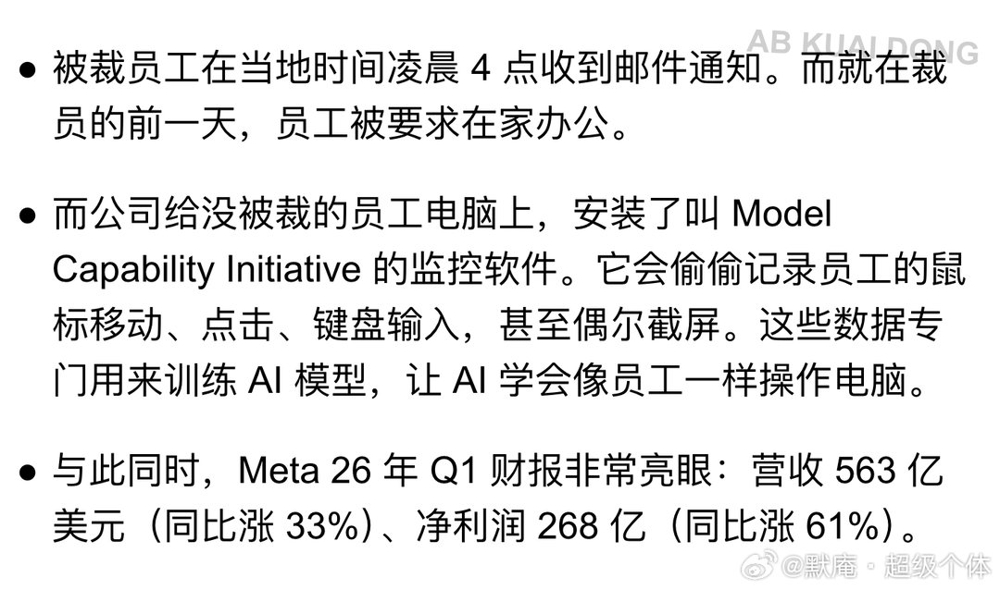

---

## 27

@水晶苍蝇拍

发表于：2026-05-23 10:51

来源：微博

链接：https://m.weibo.cn/status/5301683414631476

李在明很不错。


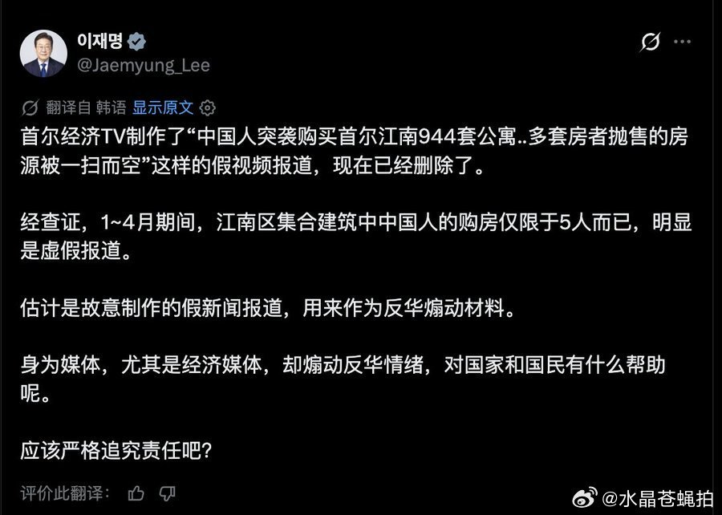

---

## 28

@三少爷的剑v小天狼星

发表于：2026-05-20 23:46

来源：微博

链接：https://m.weibo.cn/status/5300918037775216

讲讲我为什么那么恶心\#杨梅协会会长恳求消费者给果农生路\# 这件事，刚有朋友还在问，刚好回答一下。

因为我，以前在阿里，做过村淘，就是那个曾经轰轰烈烈的“千县万店”计划，当时真的是请来了数百位县长来站台，还出了宣言。

然后呢？

没做过农产品的，是无法感同身受的。

我去的某个省某个县的某个行政村，特产是柑橘。当年介入的契机就是“滞销”，我们免费纯帮，全县的柑橘12天销售一空。那会是真爽啊，觉得当地村民也是“淳朴”，表达感谢就是送鸡蛋啥，个个见到我们就是笑。

于是我们趁热打铁，承包了一片果园，并制定了完整的计划，觉得来年一定能把这个标杆村打造成互联网第一橘。

我们定好标准、提前半年付款付定金50%货款、还承担农药等等基本成本、物流运输全包，连怎么打药怎么养怎么采，都说好了，还装了摄像头。

然后呢？

我们承包的那几亩果园，之外的果树个个长得倍儿好，就我们的树，不是这个问题就是那个问题，后来查摄像头，屁流程没遵守不说，还不给打药、套袋，给的成本钱，全尼玛用在我们没承包的果树上了。

问村民为啥？说你们也没给工钱啊？我说我们包销啊，利润都给你们了，这不是钱？另外，如果没我们，你们就不种了是吧？还要工钱？

接着就是村干部和稀泥，说没文化？

好，那我们忍，把合格的果子都收了，装车要他们村民负责，结果大车师傅后来说，你们最好安排人盯着，我们哪有人？就没在意，结果呢？给我们换果，上面的都是好的，下面的都是僵果，至少一半废了…

我们查监控，结果发现无一例外，就在采摘和装车的环节，都被“村里同一拨不懂事的孩子给用杆子捅坏了”…

问就是“我们没文化不懂哦”、“你们咋欺负人呢我们以前都这样啊”…

两年，屁事没做成，钱全喂了狗了。

后来我才总结出来，不要“顺人性纵恶”，你怀着所谓好心，为农户找出路，在他们看，你就是sb，不搞你搞谁？冤大头我不坑你，我就是蠢。

于是，第三年我改变策略，要求完全按采购商协议走，就丁是丁卯是卯，还专门找了原本就在那采购的采购商谈，结果都不敢接我们单子，意思是“谁接农民就搞死谁”。

那就干脆停了，直接从采购商采购，知道后来发生啥了？农民集体围殴我们的工作人员，报警？无效…还上访，县长出面，先稳住，然后看完我们协议后，直接说你们别管了，我们来。

砍树，直接上门把我们包的果树全砍了，刚开始我们觉得是不是不合适？

结果后来发现，这就是，一条狗有一条狗的拴法。

紧接着就是“听话愿意按协议来的各种农补继续发，不合作的，赔钱，不赔的，农补全停！”，那些“刁民”立马老实了。

但依然止不住他们使坏，最后是县里主动和我们说，你们走采购吧，这件事完全没意义了，以后只会越来越恶劣。

最牛逼的还有，村里村支书是退伍军人，看着特别豪爽，什么都是好的好的。结果呢？一样，不是好人，还更恶毒。自己偷摸直播，打标就是“同样的货源我村支书亲自做担保价格比阿里直营便宜”…抢我们自己流量。

限制几次后，就开始耍无赖，私底下组织村民和我们对着干。你说你卖就卖吧，还掉包，然后骂名我们阿里村淘受着…这叫什么事？

三年，纯噩梦。和穷山恶水都没关系了，完全就是自私自利还不要脸了。

之后跳来跳去，结果又回阿里了，去菜鸟，又尼玛搞类似的，我提出我的经验，结果被小年轻说“我自私、我残忍、我片面、我内心不纯”…

好，去去去，去做你们的小布尔乔亚去吧，后果可想而知，菜鸟那年大门都被大老远赶来的村民堵死了…

牛逼不？我就问。

所以，后来我就总结出个经验，别把你的善意脱离商业逻辑，一码归一码，就按规则来。就好了。要不然，就是先恶心你、再坑你、最后玩道德绑架。

助农？算了吧，先管好自己吧。

我付钱了好吧！

我是消费者好吧！

我欠你农药钱了还是种子钱了？

你卖不好是我的问题吗？

你干坏事是我指使的吗？

你做了恶要我承担代价吗？

我叫你们一声爹行不？

整整三年，我大概在那破村里至少待了有小两百天，但凡涉及到利益分配，我见到都是“人性的恶”，所以，作为消费者，作为电子商务第一批助农项目的策划和执行者，我有资格骂一句：

你们活该！

你们就受着吧！

那些被误伤的，叫冤的，你们不知道你们的同行、同村人怎么作恶的？你们在他们作恶后没有获利吗？哦，出事了，你们说“我们没这么干啊，你们不能这么绝情啊！我冤枉啊！放过我们吧！”

你们也活该！

你们的无辜是建立在利益共享以及助恶上了。

你们就是帮凶！

所以也该死！

这就是我的态度，人要为自己的行为负责，觉得冤枉，你们报警啊，你们举报你们同行和乡亲们去啊！

道德绑架我们，想干嘛？

我还没有不消费的权力了？

同理，欠一张电影票、演唱会门票之类，也是。

你全家喜欢欠天欠地欠高利贷，要跳楼，别拉着我们，自己死一边去就好了。谢谢。

现在能理解我为什么在类似“农产品”滞销、遇险时，如此愤怒了吧？小两百天，待在那破地方，每天被人追着耍… 专栏 · 三少的故事


---

## 29

@庆丰

发表于：2026-05-22 13:06

来源：微博

链接：https://m.weibo.cn/status/5301481781594443

最近在对比模型的“指令遵循能力”，体感 Claude 还是很强。用 Claude Sonnet 4.6 和国内某模型做同一个 Web 项目：Claude 基本都能按既定流程精准调用 superpowers 的对应插件，从 brainstorming → writing-plans → subagent-driven-development，一步步推进，节奏顺、过程透明，实现起来很放心。

同样的需求文档和提示词，国内某模型也会“呼起” superpowers，但经常跳过关键的澄清与确认环节直接开干。虽然最终功能也大体能实现，但中间的系统架构与实现模式更像黑盒——可控性、可审计性明显弱一些（当然，也可以在提示词或文档里提前把架构/约束写死来缓解）。

所以对复杂度高、需要强掌控的大项目来说，基础模型的选择很关键：不只是“能不能做出来”，更重要的是“能不能按你希望的方式做出来、并且让你看得懂、控得住”。


---

## 30

@阑夕

发表于：2026-05-22 12:40

来源：微博

链接：https://m.weibo.cn/status/5301475037415150

年化收入（ARR）是SaaS时代就有的概念，倒不是AI公司的发明，订阅制业务都这么算营业额。

我也曾经嘲讽过年化收入被滥用的情况，但很显然，Anthropic、OpenAI这类大厂不属于被嘲讽的对象。

为什么我当初要加「上线不满1年时间」这个定语呢，就是看到太多套壳产品拿曝光活动期间的单月甚至单周流水去x12/x52，而这种收入都是建立在买一年送一年之类的促销去做出来的，把鹅城未来十年的税都收完了。

而像Anthropic这种一边涨价一边增长的公司，年化收入相当于应收账款，不会有太多水分。


---

## 31

@物理芝士数学酱

发表于：2026-05-23 13:52

来源：微博

链接：https://m.weibo.cn/status/5301734462457709

宗教与糕点制作在历史上有着紧密联系，糕点曾经是视觉化的叙事工具，用来传递圣人故事。

在中世纪和近代早期，大多数人不识字，教会就利用食物的形状来讲述圣人故事。

糕点师不仅是烘焙者，更像是“叙事建筑师”，把面团塑造成象征性的形状。

糕点成为宗教故事的“可食用媒体”，人们通过吃这些食物来参与并记忆圣人传说。

圣奥诺雷（Saint Honoré）：面包师的守护圣人，他的节日蛋糕用泡芙环形堆叠，象征王冠。

圣阿加塔（Sant’Agata）：意大利传统甜点 Minne di Sant’Agata，用白色糖衣圆顶和红樱桃，直观表现圣女殉难的身体部位。

圣凯瑟琳（Saint Catherine）：英国的 Cattern cakes 卷成螺旋状，模仿她殉难时的刑具“断轮”。


---

## 32

@伊利达雷之怒

发表于：2026-05-23 13:52

来源：微博

链接：https://m.weibo.cn/status/5301733345464158

\#曝红果短剧收益断崖式下跌\#

现在短视频平台早就告别了只看点击率的时代，转而以有效观看时长作为核心结算指标。

靠震惊式标题党骗点击、刷数据的投机玩法，早已失去生存空间。哪怕骗进来再多点击，观众点进就退，也带不来有效时长，自然拿不到收益。

说到底，能留住观众的只有优质内容，行业从野蛮生长走向规范，最终还是内容为王。


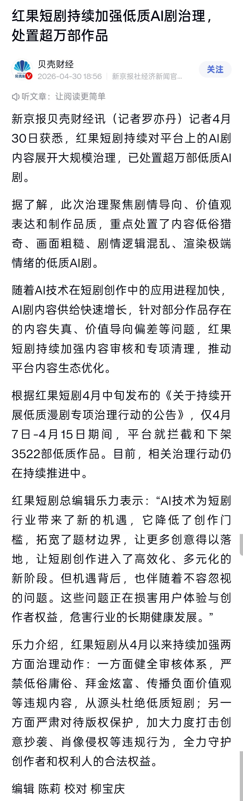

