# 2026-05-25

## 1

@Blade-黑铁桐人

发表于：2026-05-24 11:40

来源：微博

链接：https://m.weibo.cn/status/5302184749304951

看似无关，其实坡县应激得很有道理。男主在马来西亚反抗英国军警被驱逐到泰国的。跟泰国警察和印度人斗智斗勇，给抗美援朝捐款。当时无论是支援抗美援朝还是反抗英国军警，甚至中文教育，在新加坡都是不被允许的。

电影里面闪现而过的南洋大学，就是一所陈嘉庚建立，最后被李光耀关停的东南亚唯一的中文大学。当年为了融入英语国家，打压中文教育，暴力取缔华文电台，把《祖国旧闻》改版成《联合早报》，否认中文文凭，派军警直接进入拆分南洋大学。

在改革开放以前，我们称李光耀为“傀儡”“帝国主义者的傀儡”、“新加坡李光耀傀儡政权”、“东古·阿卜杜勒·拉赫曼—李光耀傀儡集团”，这些本来就不是空穴来风，为了安全主动要求延长英国驻军，越南战争爆发时，新加坡就是美军在东南亚的后勤基地，又有得天独厚的地理优势吸引大量外资入驻。

他儿子李显龙依然深得其父真传，李光耀自己说差点被日本人杀了，然后李显龙还跑去日本接受旭日勋章，李光耀有他这么孝顺当时还跑什么，直接为日本玉碎少走几十年弯路。 

——————

补充一下历史背景，马来西亚（当时包括新加坡）应着美苏反英法殖民地乘势而起，但马来国父东姑和李光耀又需要英美帮他们打压马共为首的左翼进步阵营。

另外南洋华人从清末到抗日结束一直都在捐钱捐命出力，书本里黄花岗72烈士就有不少南洋归国参与起义，而李光耀就把连车夫都愿意捐钱建造的南洋大学毁了。

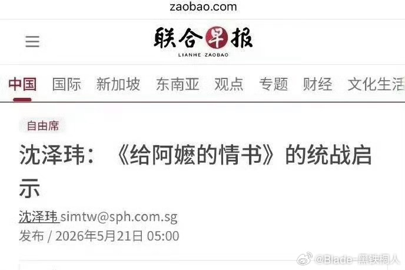

---

## 2

@千千晚星共星辰

发表于：2026-05-24 08:01

来源：微博

链接：https://m.weibo.cn/status/5302129586604717

国内接听电话的默契。

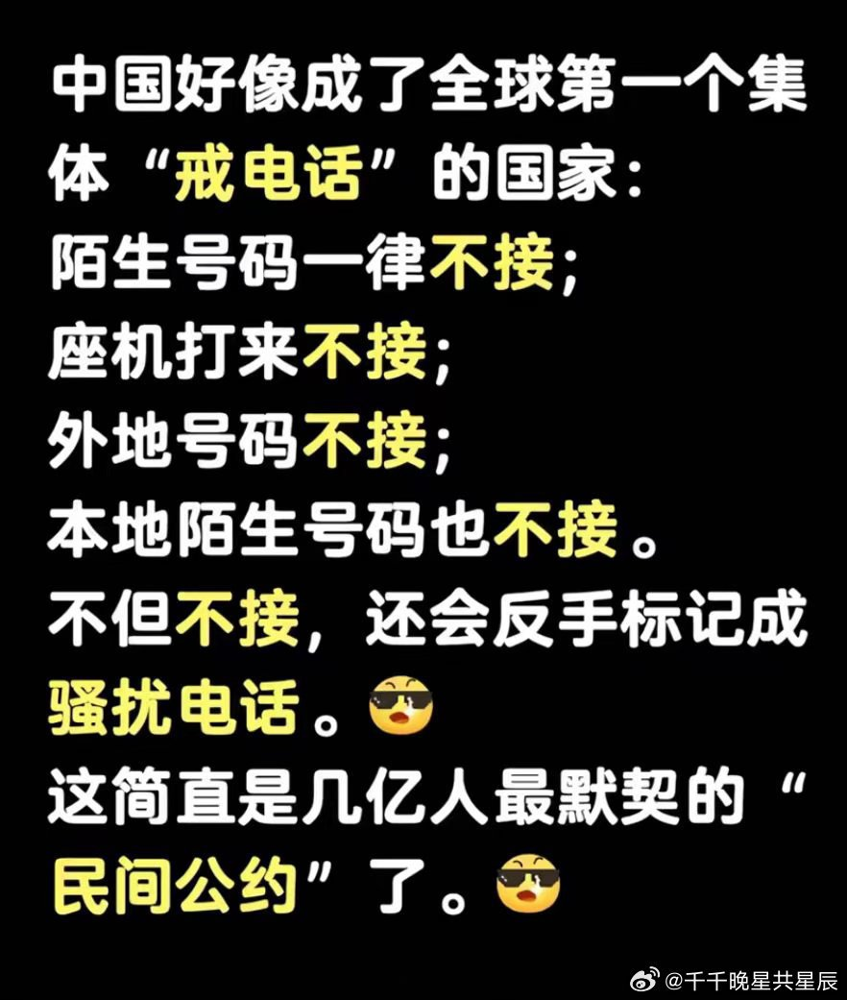

---

## 3

@专业戳轮胎熊律师

发表于：2026-05-24 03:15

来源：微博

链接：https://m.weibo.cn/status/5302057687056666

这些年，我肉眼可见一些互关博主，在性别议题上发生了态度的转变

一个动漫博主，本来岁月静好的，这2年开始喷女拳了……

一个游戏博主，一直都是挺中立的，直到这几天打拳打到洛克，他已经骂了3天了

还有个大博主，以前经常参与一些女性话题，帮忙转发一些女性求助，要求严惩严查各种性犯罪的。现在开始也装死了，很多议题我知道他可能能看见，但就装瞎当没看见。

环境一直在悄然改变，而且这种改变不是线性的，因为社会结构本来就是橄榄型的。中间属于沉默的大多数，如果这些人都开始改变了，那数量就会出现倍增。

毕竟，打拳终有一天，会打到每个人喜爱的领域。

无论是你的游戏，你的动漫，你推的偶像，你买的汽车，都会有那一天。

这种对立，短期内无法解决。

因为打拳是有甜头的，打拳真的有用，打拳厂商会听，有关部门会听。

就像钉子户一样

为什么大家要做钉子户？

因为钉子户早年是真的能多拿到钱。

那大家都一起做钉子户了啊

后来，那些钉子户问题是怎么解决的呢？

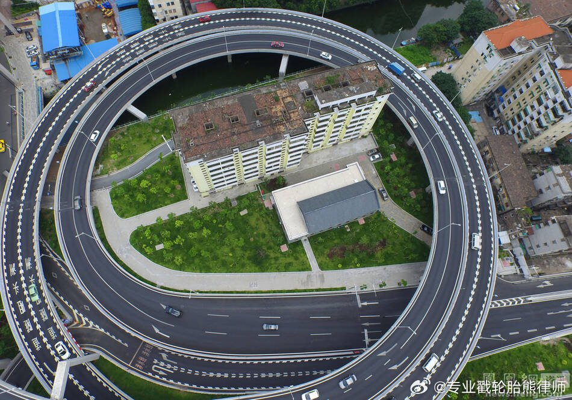

---

## 4

@江宇行舟

发表于：2026-05-24 07:50

来源：微博

链接：https://m.weibo.cn/status/5302126985085414

台湾某些人总想给明郑时期找个“独立”的节点，好来为他们的“台独”合法性张目。

找的最多的就是郑经自立乾坤、别立乾坤、引朝鲜例的说辞。其实郑经每次表态完这些内容的同时，还会以“孤臣”、“尽忠”等文辞自居、以田横五百壮士自比。那么他“臣”的是谁？，“忠”的又是谁？田横一群人给开除国籍了么？

这点连清朝的明珠都看出来了，回信曾如此相告：“阁下为中国之人，不宜引朝鲜之例。阁下以荒外自居，朝廷以一体相待。”

而郑经死后，郑克塽接任时候，说得更明白了：

🚩“ 粤自甲申（注：1644年）板荡以来，虏氛肆播。不共之仇，惟臣家罹祸最惨。匡复之业，亦惟臣门匪躬不懈。伏念臣祖成功赐姓封延平王、晋潮王，誓师奋武，谶震三吴。暨臣父经，奉朔讨罪，恢复七郡。天运未回，事多废沮。 而义问昭于六宇，心血亦竭于毕生：此祖宗神明所共鉴其精诚也。”

🚩“ 臣祖、臣父，咸以劳瘁致殒，年皆不踰四十。生荷朝廷王爵之颁、属籍之赐，犹然以国耻未雪，夙夜靡遑，不敢坐享荣贵、虚席名号！ 兹既殂丧，即欲更捐肤发筋骨图报国恩，亦痛心于无从矣。”

又是“奉朔讨罪”，又是“图报国恩”，就这口气，“台独”说得出来不？

所以连新华社在批驳赖清德对明郑的叙述时也强调，明郑割据台湾不是谋独问题，而是复明问题。

其实康熙都说的很清楚，“朱成功系明室之遗臣，非朕之乱臣贼子。”后来沈葆桢任内更是“”明故藩朱成功，忠烈昭然，有功台郡，请予建祠追谥”，后来给予了忠节的谥号。

明郑从来不是独立王国，在明郑的官方叙事里，也没有想当独立王国。 

明末清初是我们国家开始对台湾本岛进行建制的关键历史时期，最早从琉球举报日本图谋通过侵占台湾再来入侵中国大陆，明廷已经开始讨论台湾防务问题，再到郑成功明确以“台湾本中国地”收复台湾，再到明郑集团以华夏号召开发宝岛，最后到施琅坚决反对弃守、清廷设台湾府，这其中有一条清晰的我国行政逐渐强化对台治理的主线，各环节都是不容否定和抹杀的。

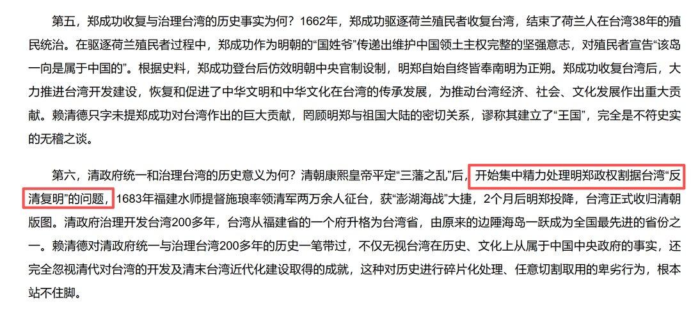

---

## 5

@李建秋的世界

发表于：2026-05-24 09:47

来源：微博

链接：https://m.weibo.cn/status/5302156249007453

那个前meta员工还有抱怨（看不懂的翻前一个帖子）

这篇帖子一下子把他前一个帖子的可信度提高了5个等级：

-------------

Meta 绝对是我待过最“毒”的公司，没有之一。华人管这里叫《鱿鱼游戏》，真不是空穴来风；还有人管它叫《饥饿游戏》或《蝇王》。我觉得这些比喻都无比精准。

这里的公司文化说白了就是“各人自扫门前雪，不管他人死活”。绩效考核（PSC）不仅不鼓励互相帮助，反而是在变相打击这种行为，因为所有人都在被“强制分布、末位淘汰”（。试想一下，你在一个每隔半年就得有一个人卷铺盖走人的团队里工作，职场环境怎么可能不恶臭？

所谓的“自下而上”文化纯粹是扯淡——那不过是管理层甩锅的遮羞布罢了。技术主管一手遮天，他们垄断了人脉资源和核心业务的核心信息，把好项目都留给自己人。经理们名义上是“团队负责人”，其实技术水平半吊子，主要工作就是把 TL 的反馈汇总一下，包装成绩效材料，再去跟其他经理以及 IC7+ 的大老粗们去“对齐调薪”。这就意味着，你的命运完全掌握在 TL 手里，而 TL 和经理不同，他们对你的职业发展不负任何责任。在这里，哪怕手段再下作，也不会受到任何惩罚。我亲眼看到有些经理和 TL 把别人推出去背锅（Throw under the bus），自己却屁事没有，全身而退。

维系这家公司的唯一纽带，就是“个人自保”。大家为了活到下一次股票解禁（Vesting），只能先保住自己的狗命，需要的时候毫不犹豫地拿别人当垫脚石。这就是为什么最近一轮大裁员口口声声说要“扁平化管理”，但总监、副总裁（VP）或者资深的 IC7+ 那些拿着全公司最高薪水的人几乎毫发无损，刀子全落在了 M1（基层经理）——也就是管理链条最底层的人身上。

这里的文化极其讲究表面功夫，每天都在“对齐颗粒度”和“刷存在感”。一切都是为了 PSC（绩效考核）和PPT讲故事。这意味着你得应付开不完的会、满天飞的AI垃圾帖子，以及各种除了能帮高层在“业务影响力”上刷KPI之外、对实际业务毫无卵用的自上而下的花架子项目。光有成果（Impact）还不够，还必须显得“足够复杂”，于是大家为了复杂而复杂，人为制造冗余。

我所在的部门（Facebook 广告部门）90% 都是华人，从基层一路到 VP 级别的管理链条清一色是华人。在办公室里，除非有不会说中文的人参加正式会议，否则普通话就是“官方语言”。国内的加班文化和美式职场截然不同，“996”成了常态，带有强烈的独断色彩，极度讲究“留面子”（比如绝对不能顶撞上级），职场PUA屡见不鲜。自然而然，当一个部门被一个出了名“不愿融入当地”的特定族裔彻底占领时，他们那种加班内卷的糟粕文化就会渗透进来。在我见到的裁员里，四分之三都是非华人（澄清一下，绝大多数华人其实人很好，不要觉得我是在开地图炮。但这就是现实，我相信公司外面的人对此一无所知，甚至连管理层都被蒙在鼓里，别忘了这可是在公司总部）。

在这里，我遇到了职业生涯中最恶毒的经理。我亲眼看着他故意给一个新员工设局，硬生生把人逼出了焦虑症和抑郁症，不得不去看心理医生，最后把人扫地出门。而这个经理随后突然离奇“蒸发”了 8 个月，接着也离职了。

类似的事我可以聊上三天三夜，但篇幅已经够长了，我想你懂我的意思。

当然，这里也有很多优秀、善良的人。我后来成功转组了，新团队的经理非常给力，组员们也都绝顶聪明、互帮互助、工作拼命。

但这家公司顶着《鱿鱼游戏》的名号绝对不是冤枉的。上梁不正下梁歪，高层要么是高高在上根本看不到基层疾苦，要么就是压根不在乎了——反正人家早就赚够了几十亿，我们这些底层社畜（Plebs）现在不过是随时可以牺牲的耗材。

所谓“泼脏水”意味着歪曲事实，而我说的都是我的亲身经历。我尽量保持客观，只讲事实。而且我觉得这些早就是公开的秘密了——去 Blind 软件上看看，类似的血泪史数不胜数。

这个世界之所以正义难张，就是因为总有像你这样的评论，劝别人保持沉默、明哲保身。站出来说出真相是需要勇气的，我们不应该去打击这种勇气。确实，我分享自己的经历可能改变不了任何事，甚至会引火烧身。但哪怕只有 0.1% 的机会能改善员工的处境、让公司走得更远（我手里可还捏着 Meta 的股票呢），我也愿意承担这个风险。

如果你对我写的事实有任何异议，欢迎随时来对线。

至于你建议我写一篇“复盘贴，聊聊这一章学到了什么”，这个主意太棒了，我会去写的，谢谢你的建议。我确实学到了太多，很想把这些教训分享出来，免得别人踩我踩过的坑。是的，我已经决定向前看了——不向前看也没别的方法。我只是想趁着记忆犹新，把这些垃圾记忆全部倾倒出来，然后开启人生新篇章，把这破事儿全忘了。

不可否认，Meta 绝对是商业史上最成功的公司之一，这点没人能抹杀。

但话又说回来，他们在 Facebook 之后的每一次重大成功，要么靠收购（Instagram, Whatsapp），要么靠抄袭竞品（比如 Snapchat, TikTok, Threads）。你看一眼股价，Meta 的股价相比一年前下跌了 4.42%，而谷歌却暴涨了 125%。

我不认同“搞末位淘汰公司才能成功”的说法。看看英伟达就知道了。

我其实试过向 HR 申诉，但他们根本不鸟你。HR 的职责是保护公司不被告，而不是主持正义。除非你能拿出确凿的、能让公司承担法律风险的铁证，否则什么都不会发生。甚至，去 HR 那里告状反而会让你面临更大的被开除风险，因为你很可能会遭到打击报复（别忘了，在这里 TL 才是老大，其次是经理）。

举个例子：有个新员工在一次大聚会上被一个 TL 当众霸凌，当时有很多目击者。他举报了，那个 TL 最终不得不道歉。结果呢？没过多久，那个新员工就被开除了。

我没在亚马逊工作过，但 Meta 有一大堆从亚马逊跳槽过来的人。我问过他们每一个人，得到的回答全都是：Meta 卷得比亚马逊狠多了。（当然，我手头的样本量不够大，也很想听听两家都待过的人怎么说）。

当然，“卷”也分“良性”和“恶性”。我不排斥良性的拼搏。在我看来，英伟达就像是一个良性竞争的地方（比如不搞强制分布，没那么多办公室政治）。

而我在 Meta 的体验是，这里充斥着大量恶性、人为制造的焦虑。我认为这很大程度上归咎于末位淘汰制、对连环裁员的持续恐慌、对个人绩效指标的极端KPI考核，以及某些亚洲职场文化里的“表演式 996”。

不过，这也高度取决于你具体在哪个部门和团队。我的第二个团队比第一个强太多了，大家都非常支持彼此，配合默契。其他换过组的朋友也跟我说过同样的话。

唉，问题就在于，聊这种话题很难不让自己显得像是在搞种族歧视或者斤斤计较。但文化差异是客观存在的，东西方职场文化的鸿沟也是巨大的。你总结得比我更精辟、更一针见血。

谢了。反正下次要是再被“空降”到类似的泥潭里，我一定会比这次更有经验。

===============================

这么一看，他第一篇帖子可信度高很多啊

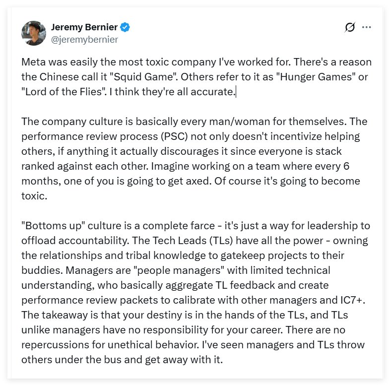

---

## 6

@挨踢牛魔王

发表于：2026-05-24 07:28

来源：微博

链接：https://m.weibo.cn/status/5302121319894946

就中国古代来说，拿下珠江，那么岭南，包括广东广西，就都拿下来了。

珠江，其实是一条很长很长的江，有的地方叫东江，有的地方叫西江。

但是，你以自然的角度看，它就是一条江及其支流。

珠江，远比你想的长，是从云贵高原发源，然后通过广西，再通过广东，从深圳附近的珠江口注入大海。

两广，实际上是一体的，由珠江连接的，分界线就是梧州。

那么作为岭南，怎么防御中原的进攻呢？

主要有两个方向，湖南、江西，有三条路。

桂林堵住一条，贺州堵住一条，韶关堵住一条。

当然，不光是这三个城市，这三个城市只是防御的中心，还有很多关隘是依托这三个城市建设的。

所以这个地图是有点意思的，缩这么小，这三个城市都在。

古人是很聪明的，在桂林这里建城，绝不是看这里风景好。

广州和南宁，刚好在两块平原的中间，还沿着珠江建的。

这里就能形成庞大的人口聚集。

要是让人突破了珠江，战马，粮食，兵源就通过水路运过来了。

那同样的，岭南要是逐鹿天下，也是从这三条路走。

南梁侯景之乱的时候，整个已经被打烂了。

陈霸先从南海起兵，然后到江西，再到健康（南京），击败了侯景。

那个时候，很多势力都没啥粮食了，陈霸先有五十万石粮食，牛的不行。

最后建立了陈朝。

这说明，南北朝时期，两广已经大规模开发，岭南势力登上了历史舞台。

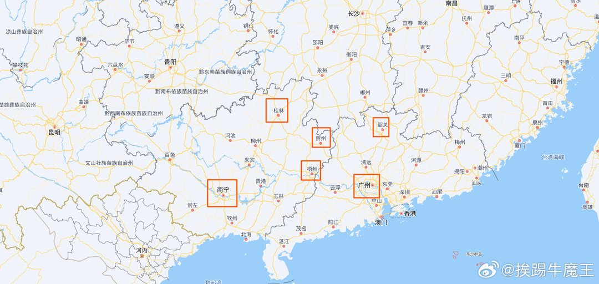

---

## 7

@黄斌

发表于：2026-05-24 14:05

来源：微博

链接：https://m.weibo.cn/status/5302221361382254

陪老三去打球的路上经过了这，一开始没注意，后来才发现是波士顿动力的总部大楼。赶紧慌里慌张拍了个照。

想起当年 Boston Dynamics 的机器人视频刚出现在互联网上的时候，很多人包括我在内感受到的是绝望。中美两国实力差距之大，让人摇头叹气徒呼奈何。谁也没想到，短短的十几二十年会天翻地覆。

如今，要问机器人实力哪家强，波士顿动力是个翔……

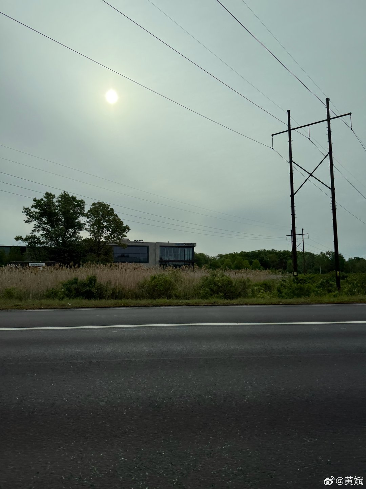

---

## 8

@苏耷水

发表于：2026-05-24 15:38

来源：微博

链接：https://m.weibo.cn/status/5302244602022086

又看了一遍潮汕话版的《阿嬷的情书》，才发现有些方言梗。我每次看到老年的淑柔和南枝相见的那段，就会不自觉的落泪。南枝帮助淑柔一家十几年，一生的执念，老了，全忘记了，连木棉花叫什么也都忘了。

这部电影绝对是不符合当今觉醒议题的，我们这个时代的觉醒，都是围绕着把个体从社会责任中解脱出来，变成原子化的个体。而《给阿嬷的情书》，讲的都是个体自觉自愿的承担起社会责任，为了貌似虚无缥缈的情义，执着的付出。而这样漂亮的票房表现，又能看出所谓觉醒，在现实世界中并没有网上这么大的影响力。

我很喜欢这个结局，人老了，哪怕是自己最在意的事都会忘记，若是离开人世以后，一切生前事，所有爱恨情仇，也都变作烟云消散，如露亦如电。

说来也有趣，今天去看电影时，影院商业街的大屏幕上轮回显示着各种鼓励女性拒绝婚恋、勇敢单身的520宣言标语。

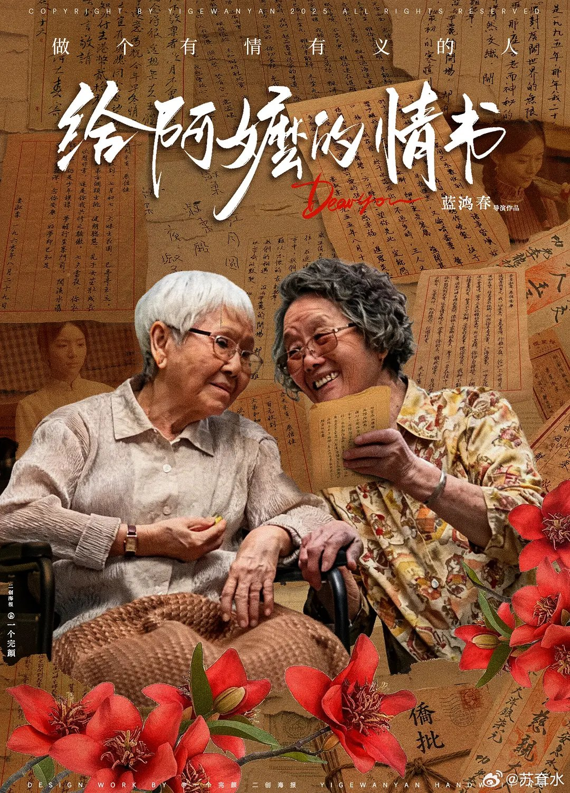

---

## 9

@少年伯爵

发表于：2026-05-24 15:39

来源：微博

链接：https://m.weibo.cn/status/5302245073360330

\#神23发射成功\# 恭喜恭喜🎉

每次神舟飞船发射成功，其实也是在展示我们最顶级的核反击能力。

因为东风5号洲际导弹，没有战争的时候，就会军转民（摇身一变成为长征2号F运载火箭）送宇航员进入太空，23投23中，100%命中率。有战争的时候，直接送核弹头过去……

由于长2运载火箭每年都在高频发射，背后意味着我们每年保持着东5生产线更新迭代和发射质检，如果战争来临，东风5号将会以全球最可靠最精确最澎湃的洲际导弹进行战略值班。

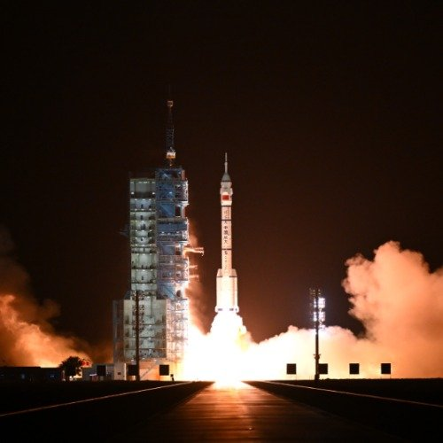

---

## 10

@前HR本人

发表于：2026-05-24 22:00

来源：微博

链接：https://m.weibo.cn/status/5302340708204725

美伊初步协议即将落地，将重塑全球金融与能源市场格局！

 

外媒说美国与伊朗达成初步停火谅解备忘录，为期60天的停火协议有望落地执行。不过这不是全面和平条约的阶段性协议，只是停火协议；但会对全球能源命脉与地缘政治发生巨大影响。

此次美伊初步协议条款比较务实、条款进展可能比大家预期好，核心内容可破解当前中东能源与地缘困局。

协议核心约定包括：全面开放全球能源咽喉霍尔木兹海峡，取消美国对伊朗所有港口的军事封锁，各国商船依规登记即可自由通行，彻底解除航运阻断危机；同时实现美、以、伊三方阶段性停战，终止各战线军事冲突。经济金融层面对伊朗有利好，因为协议允许伊朗不受限制自由对外销售石油，美国将逐步解冻超千亿美元被冻结的伊朗海外资产。

而双方争议较大的战争赔偿、伊朗核材料等核心分歧，暂时搁置留待后续多轮谈判逐步解决，为局势持续缓和预留空间。

 

从协议性质来看，本次美伊备忘录与朝鲜战争停战协议高度相似，属于阶段性停火而非终极和平协议，但可能在后续执行中具备长期固化、走向永久和平机制的潜力。协议有效期60天，可经双方协商自主延期，这种弹性机制初步稳住中东基本局势，逐步消解当前全球能源危机。

不过中东地缘矛盾错综复杂，以色列与伊朗的深层对立根深蒂固，利益冲突难以调和，因此以色列绝不会彻底妥协退让，后续局部摩擦、地缘博弈仍将持续。但整体大规模热战风险基本出清，短期大规模激战概率不大，区域局势将进入“大稳小乱”的长期新常态，为全球能源市场稳定打个基础。

 

本轮美伊能够握达成初步协议，核心动因还是全球多国已不堪高油价与高通胀重压，大规模军事冲突完全不符合各方利益，包括美国共和党自己利益了。美伊战争引发霍尔木兹海峡航运受阻、海湾石油出口受限，导致国际原油价格居高不下。欧洲深陷能源危机，通胀持续高企、经济增长乏力，欧洲央行为了压制通货膨胀却不得不准备加息；东南亚、日韩、印度等高度依赖中东进口能源的经济体，被高油价持续拖累，贸易收支承压、民生成本高涨。

与此同时，美国自身通胀压力居高不下，最近CPI再创下10多个月新高，美国伊朗如果维持对峙僵局，只会进一步推高美国国内物价、加剧经济困境。在全球普遍的经济压力与国际舆论的双重倒逼之下，各方均无力承受大规模开战的代价，降温止战成为唯一理性选择。

 

随着中东局势降温、伊朗石油全面重返国际市场，全球金融与大宗商品市场将迎来明显结构性行情分化。首先，原油、油气期货及能源板块将承压下行。伊朗石油产能全面释放，叠加霍尔木兹海峡航运畅通，全球原油供需紧张格局彻底逆转，国际油价大概率持续回落，前期因地缘溢价冲高的能源金融指数将逐步回调降温。

与此同时，多个实体产业与对应资本市场将迎来实质性利好。交通运输、航空物流、航运外贸等高度依赖能源成本的行业，将受益于油价下跌，成本压力大幅缓解，盈利空间持续修复，金融估值有望提升。农业、化工、化纤等原油下游产业，原材料成本随之回落，有效降低企业经营压力，带动行业景气度回升。整体来看，此次美伊停火协议如果落地，将有效缓解全球通胀压力、稳定大宗商品价格、修复市场风险情绪，为全球经济复苏和金融市场平稳运行注入关键动力。

三个月全球经济动荡，完全是美国和以色列的贪婪和不可一世侵略造成的，要是还再起战火，那他们完全就是人类的公敌。

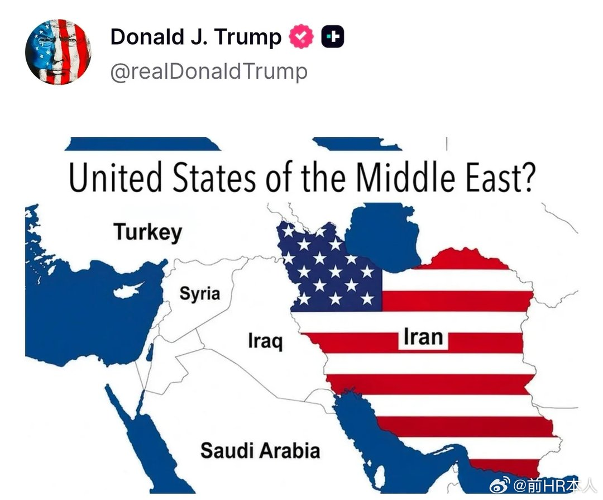

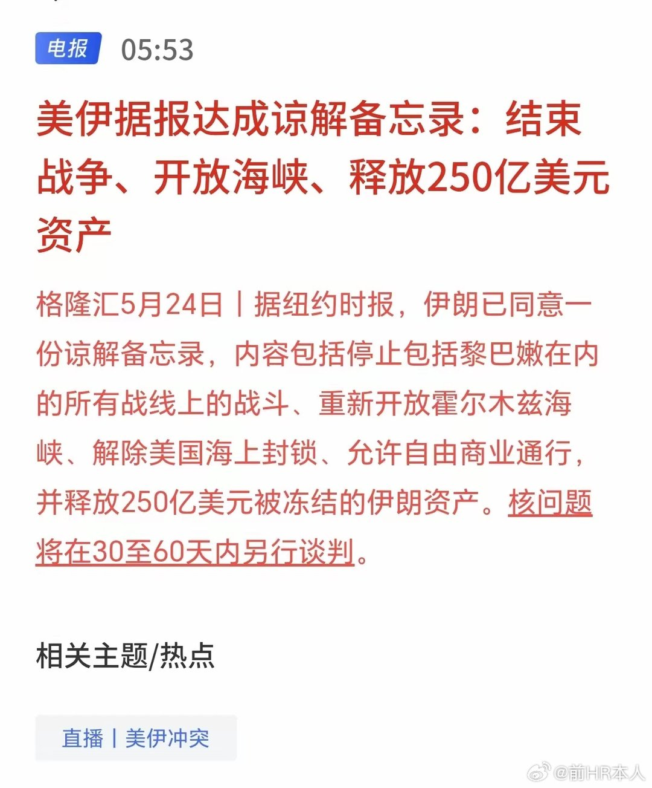

---

## 11

@蚁工厂

发表于：2026-05-24 02:22

来源：微博

链接：https://m.weibo.cn/status/5302044362542663

\#古法编程\# 一个C语言教程，特点是基于实际项目，直接教你用 C 语言构建模拟器、内核、数据库、游戏、编译器、shell 和底层工具等。 

地址：github.com/7etsuo/project-based-tutorials-in-c

\#AI创造营\#

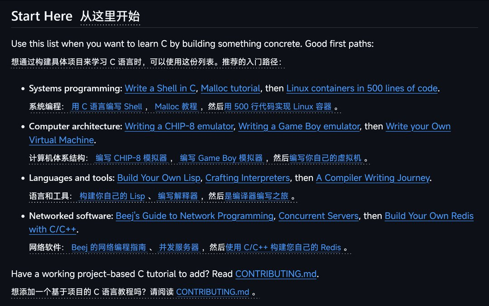

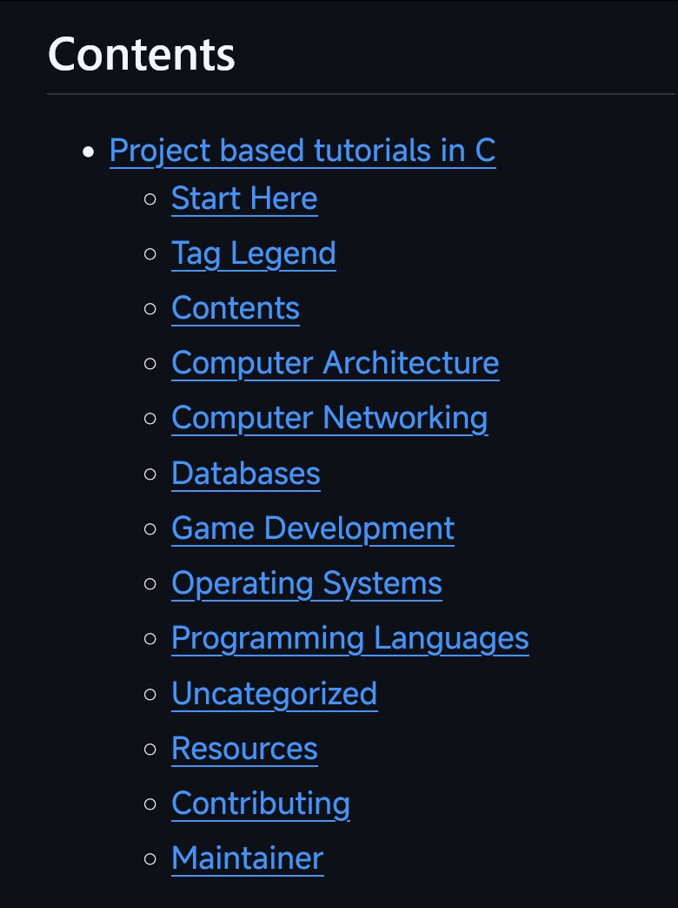

---

## 12

@EricTsui

发表于：

来源：微博

链接：https://m.weibo.cn/status/5118165463597749

美好的时代养废人…… 周期与循环：糟糕的时代造就坚强的人→坚强的人创造美好的时代→美好的时代养废人→废人多了又回到糟糕的时代，所以，好消息：我们处于美好的时代，坏消息：废人越来越多了……

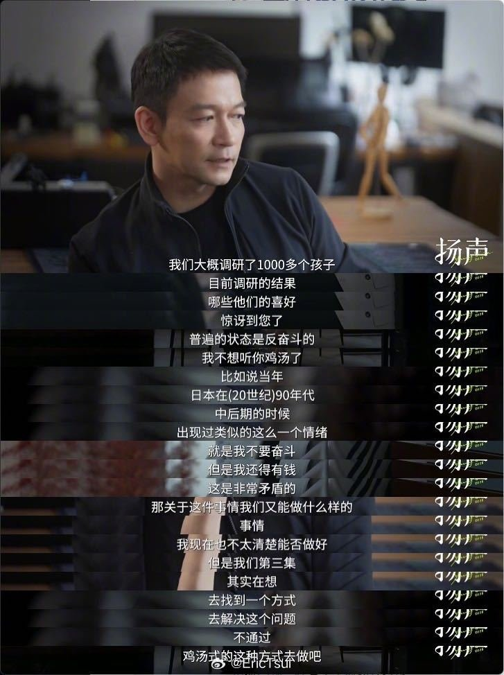

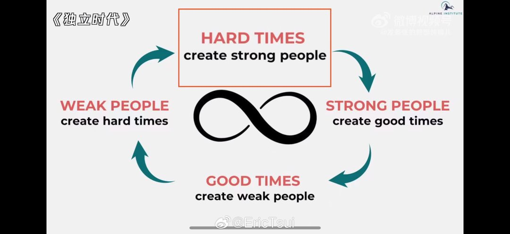

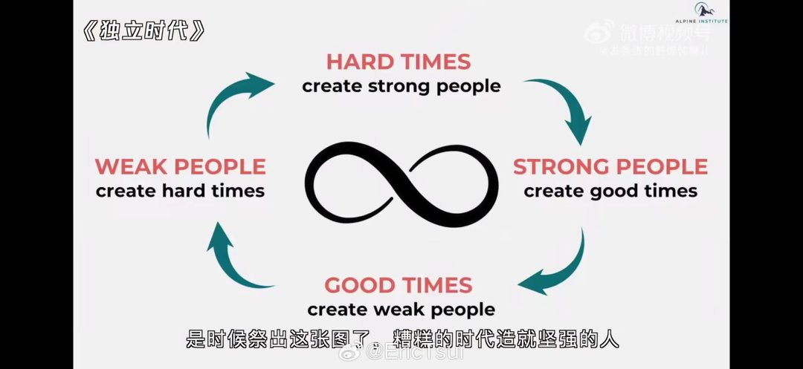

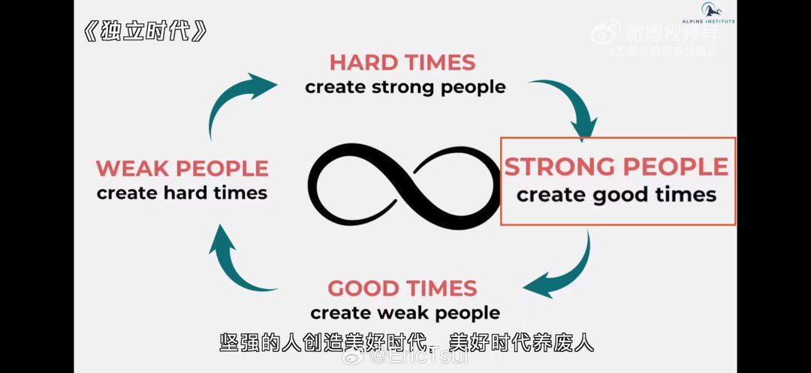

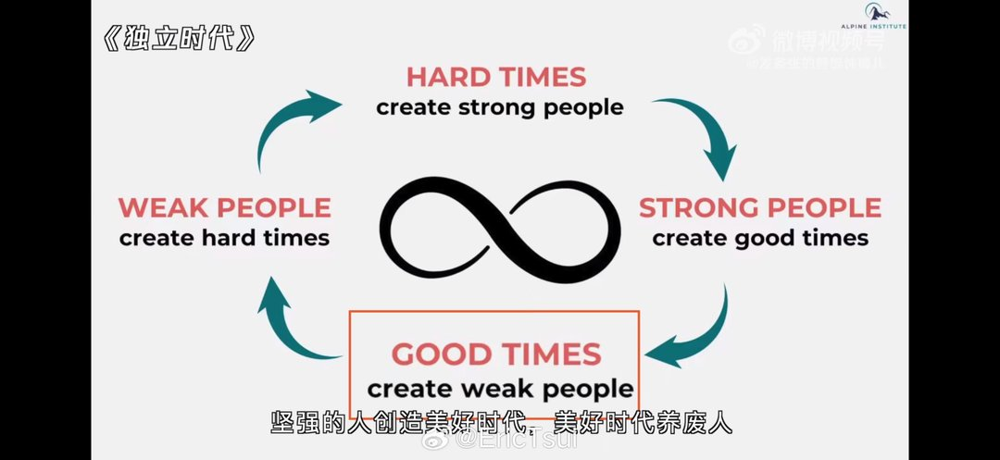

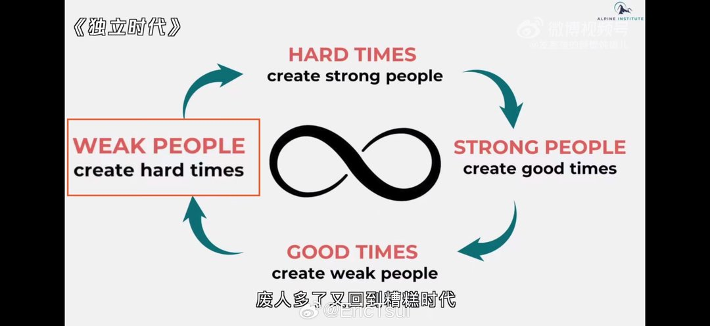

---

## 13

@苏耷水

发表于：2026-05-24 16:50

来源：微博

链接：https://m.weibo.cn/status/5302262721153235

我爱人走出影院时说《给阿嬷的情书》这个电影节奏好，其实有真正的故事要讲出来的电影，节奏都不会差，因为认真叙事就顾不上玩花样破坏节奏。节奏差的电影，往往是创作者自己不知道自己在讲什么故事的电影，他们节奏乱是因为他们自己也觉得自己讲的故事很烂，所以要刻意加点煽情加点搞笑，来掩饰故事讲不通的尴尬。

至于为什么讲不通，因为他们要么还在想给人上课，要么还在想咯吱咯吱这些傻逼观众的胳肢窝就能骗到钱，从来也没想讲好故事。

这几年异军突起的几个电影票房黑马，从《战狼2》开始，像《流浪地球》，《哪吒》，《浪浪山的小妖怪》，到今天这部《给阿嬷的情书》，他们的共同点就是价值观都是比较传统，维护着传统的家庭、友谊和国家等集体组织，也可以说是观念比较保守。

电影这个东西，毕竟是大众艺术，电影的最大市场，一定是这个国家的基本盘，一定是那些传统生活方式中的人们。

我们国家的电影行业在改开以后，也一直是市场化程度很低的状态，所谓第几代导演的讲法也体现出我国电影行业有浓厚的精英主义倾向，把电影看的太高，高到不愿意跟着老百姓的三观走，就怕自己体现不出自己的高贵，怕失去教化老百姓的机会。

这也算国营制片厂时代留下的一种痕迹。这些掌握行业核心资源的人，都是在体制内有份量或者能说得上话的人，或者说人家都是些干部，教育老百姓教育习惯了。

而这种精英主义也会有另一个极端，那就是当自视甚高的电影人一心要赚老百姓的钱时，他们又会故意做出特别低俗的电影，因为他们高傲的认为这就是在迎合他们心目中低贱的老百姓的喜好，因为他们觉得老百姓都是傻逼，所以他们就觉得给老百姓吃屎老百姓就能开心的贡献票房。

于是我们的电视市场上要不就是高贵到不说人话的高级电影，要么就是低俗到冒泡的傻逼电影，他们背后的思想都是一样的，都是自以为电影从业者高人一等，既然你们老百姓听不懂我们精英的教诲，那看来老百姓就只配看低俗无比的垃圾。

这些所谓的票房黑马，都是过去在电影行业里的边缘人士，甚至是外行刚刚转进来的素人。也就是说我国的电影行业发展到今天，才开始重新走上电影原本所在的那个大众艺术的道路，才刚刚开始拍老百姓能看懂，能认同的电影。

---

## 14

@新华社

发表于：2026-05-24 03:26

来源：微博

链接：https://m.weibo.cn/status/5302060553602410

\#祝贺给阿嬷的情书票房破十亿\#【\#给阿嬷的情书票房破十亿\#】据网络平台数据，截至5月24日11时23分，影片《给阿嬷的情书》票房突破10亿。祝贺！

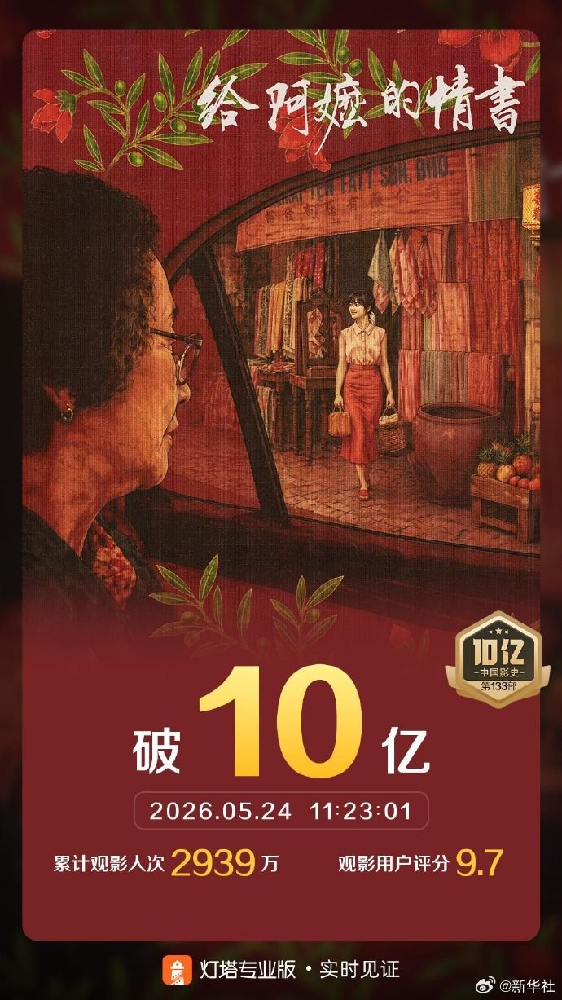

---

## 15

@sven_shi

发表于：2026-05-24 22:34

来源：微博

链接：https://m.weibo.cn/status/5302349451232145

规则这东西关键是要让人感到安全//@幻想狂劉先生:最右说的是对的。理论上女权的神祇是“地母”，即希腊神话里的盖娅，拉丁名叫忒卢斯。但实际上女权崇拜和追求的是一个与之完全相反的，一个强大且主宰一切的父神，因为它们本身是非常孱弱且渺小的，它们希望这个父神既强横又良善，既主宰又温情。这相当于追求一种揪着自己的头发把自己提离地面的力量，这导致它们的终点通常都指向一个非常残暴的父权主宰。其中最具有宗教启示录意味的场景，莫过于伊朗女权主义者在德黑兰国际机场欢迎霍梅尼如传说中的隐遁伊玛目“从天而降”。中国特色田园女拳把情感投射到非洲草原的狮子身上，将其视为理想的人类社会模型当然是一种更低级的表现—雄狮几乎是大型肉食动物中最残暴专横的存在//@丁静栎:你这就是偷换概念了，显然他们希望的是良善的秩序维护者。//@安德鲁司:类似于进步主义者们一方面憎恨父权，另外一方面却希望有一个良善的父权，把自己看不顺眼的都管起来。这实际上是很拧巴的。

