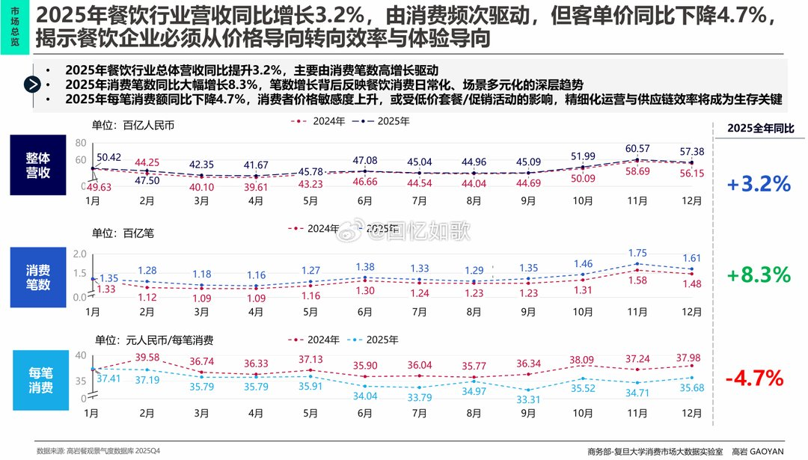
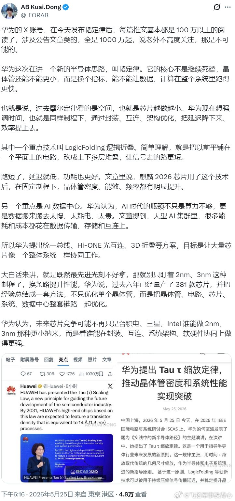
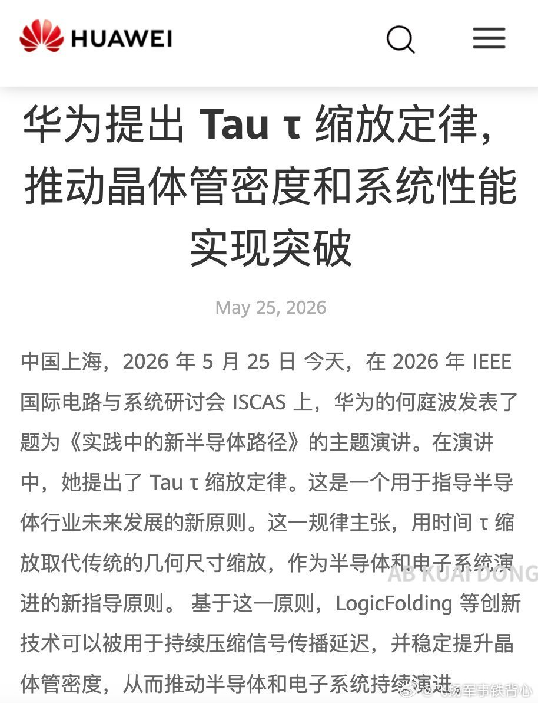
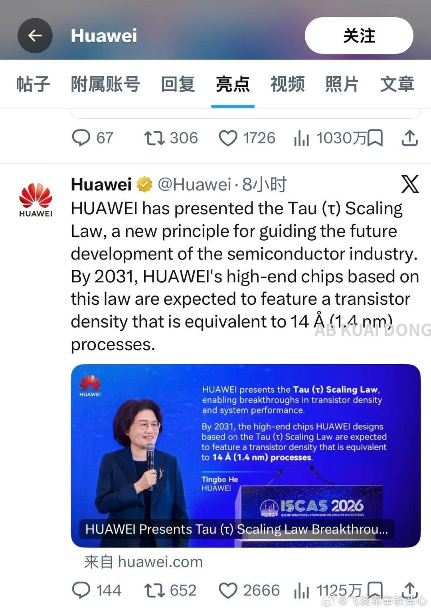
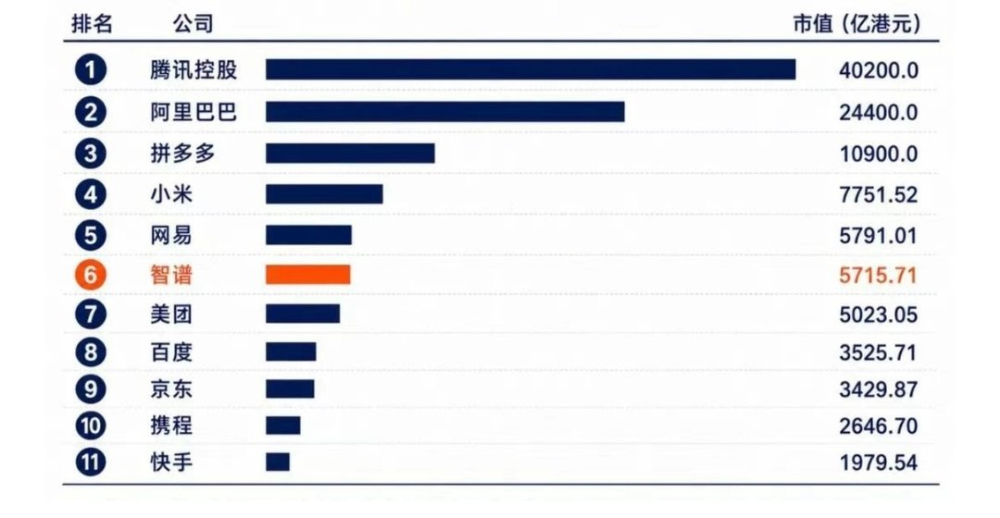
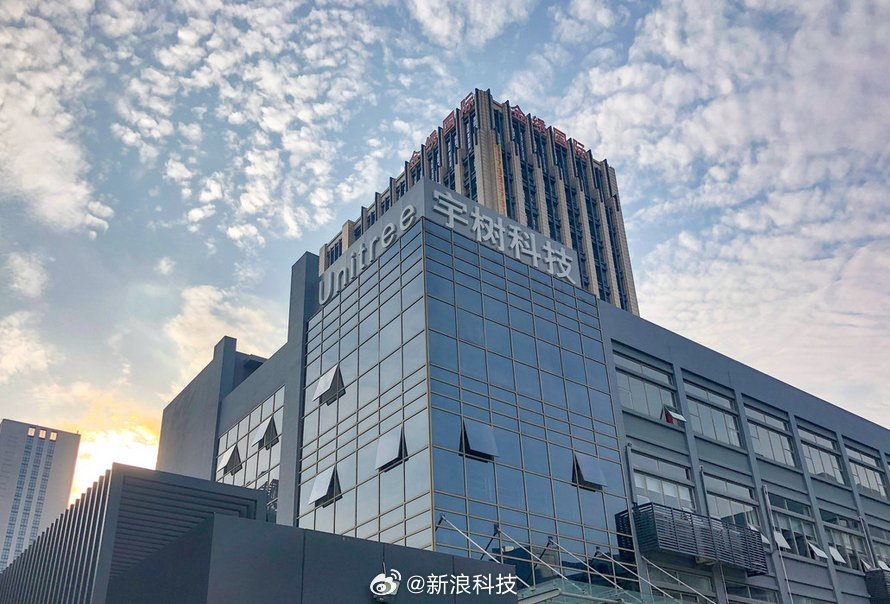
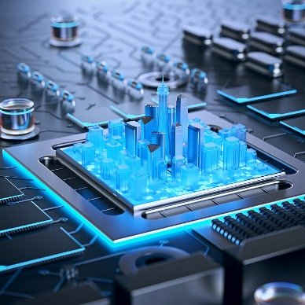
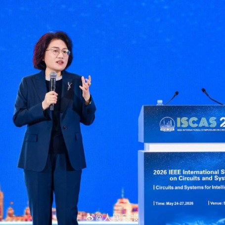

# 2026-05-26

## 1

@回忆如歌

发表于：2026-05-25 10:22

来源：微博

链接：https://m.weibo.cn/status/5302527539021418

餐饮难啊

2025年餐饮行业营收同比增长3.2%，由消费频次驱动，但客单价同比下降4.7%

---

## 2

@挨踢牛魔王

发表于：2026-05-25 12:18

来源：微博

链接：https://m.weibo.cn/status/5302556772797220

《黑袍纠察队》里面，祖国人失去超能力后，被屠夫暴打。

屠夫别人原来是特工，身体素质本来就好，两个人一起失去超能力后，屠夫当然更强。

但是祖国人也没法锻炼，当他有超能力的时候，打什么都碎了，根本练不起来。

何况，他本身就有超能力，用超能力能解决的，为什么还要锻炼后用自己的体力解决？

现在很多人就像祖国人一样，当断掉他的claude code,chatgpt-image-2后，他就像一个突然失去超能力的人，被古法编程，古法设计暴打。

他也没法练，已经有这么好用的工具了，为什么还要抛开练基础技能呢？

AI现在就是很多人的超能力。

我觉得，基础的东西还是要学的，还是要手工敲来敲去学习的。

这样才能真正学会。

你就想想，要是突然有一天，这个超能力没有了呢？

那个时候，还是要能做事的，而不是啥也干不了，像阿祖一样被暴打。

---

## 3

@飞扬军事铁背心

发表于：2026-05-25 12:16

来源：微博

链接：https://m.weibo.cn/status/5302556311945769

华为的 X 账号，在今天发布韬定律后，每篇推文基本都是 100 万以上的阅读了，涉及公告文章类的，全是 1000 万起，说老外不高度关注，那是不可能的。

华为这次在讲一个新的半导体思路，叫韬定律。它的核心不是继续死磕，晶体管还能不能更小，而是换个指标，能不能让数据、计算在整个系统里跑得更快。

也就是说，过去摩尔定律看的是空间，也就是芯片越做越小。华为现在想强调时间，也就是同样制程下，通过封装、互连、架构优化，把延迟降下来、效率提上去。

其中一个重点技术叫 LogicFolding 逻辑折叠。简单理解，就是把以前平铺在一个平面上的电路，改成上下多层堆叠，让信号走的路更短。

路短了，延迟就低，功耗也更好。文章里说，麒麟 2026 芯片用了这个技术后，在固定制程下，晶体管密度、能效、频率都有明显提升。

另一个重点是 AI 数据中心。华为认为，AI 时代的瓶颈不只是算力不够，更是数据搬来搬去太慢、太耗电、太贵。文章提到，大型 AI 集群里，很多能耗和成本都花在数据传输、存储和互连上。

所以华为提出统一总线、Hi-ONE 光互连、3D 折叠等方案，目标是让大量芯片像一个整体系统一样协同工作。

大白话来讲，就是既然最先进光刻不好拿，那就别只盯着 2nm、3nm 这种制程了，换条路提升性能。华为说，过去六年已经量产了 381 款芯片，并把经验总结成一套方法，不只优化单个晶体管，而是把晶体管、电路、芯片、系统、数据中心整套链路一起优化。

华为认为，未来芯片竞争可能不再只是台积电、三星、Intel 谁能做 2nm、3nm 那种更小纳米，而是看谁能在封装、互连、系统架构、软硬件协同上做得更强。

\#烽火问鼎计划\#

---

## 4

@新浪科技

发表于：2026-05-25 08:46

来源：微博

链接：https://m.weibo.cn/status/5302503434355485

【\#DeepSeek为何敢于逆市降价\#】2026年以来，全球AI大模型行业深陷涨价潮。HBM（高带宽内存）价格半年暴涨超500%，高端GPU（图形处理器）供不应求，叠加推理端词元（Token）调用量激增，亚马逊、微软及国内主流云厂商纷纷上调API（应用程序编程接口）定价，部分涨幅甚至高达463%。行业似乎已就“AI服务理应越来越贵”达成共识。

然而，国产大模型DeepSeek于5月22日宣布，其旗舰模型V4-Pro的API价格将永久降价75%，输入（缓存命中）价格低至每百万Tokens0.025元，创下全球新低。这一逆市操作看似违背商业规律，实则是技术突破、战略卡位与生态重构的深度博弈。

全球算力涨价潮的根源在于AI产业链的结构性失衡。一方面，万亿级参数模型对HBM和高端存储的需求呈指数级增长，而存储巨头产能向高利润AI产品倾斜，导致供给不足、成本高企；另一方面，AI智能体爆发推动推理端调用量激增，海量并发带来的电力、带宽成本超出云厂商补贴上限，早期“烧钱换市场”模式难以为继。在此背景下，提价成为厂商覆盖算力折旧与运营成本的被动选择。

DeepSeek敢于逆市降价，绝非简单的烧钱补贴，而是依托底层技术重构实现的成本优势。其核心突破有三：一是架构创新，自研稀疏注意力机制与混合专家模型使V4系列处理百万级Token长上下文时，算力消耗仅为上代产品的27%，KV Cache（键-值缓存机制）占用降至10%，单位推理成本实现技术性下降；二是算力自主，深度适配昇腾等国产算力，摆脱对海外高端算力的依赖，硬件采购成本显著降低；三是工程优化，在推理侧进行极致优化，提升算力利用率，通过规模效应摊薄固定成本，形成“用量反哺成本”的良性循环。这种技术驱动的成本下降，让降价具备可持续性。

在此基础上，DeepSeek此次降价还是一场精准的生态卡位。当前行业格局未定，DeepSeek以价格杠杆撬动行业出清，大幅降低中小开发者与企业用户的AI应用门槛，吸引其基于自身生态构建应用，形成“低价—用户增长—生态繁荣—成本进一步下降”的正向循环。这既是对部分厂商“重盈利、轻普惠”倾向的纠偏，也是国产大模型重塑行业竞争格局的关键一步——通过成本优势与技术创新，推动行业竞争从“算力堆砌”转向“技术效率与生态构建”。

DeepSeek此次的逆市操作也为行业发展提供了重要启示。笔者认为，面对算力、存储成本上涨压力，单纯依赖涨价转嫁成本已非长久之计，唯有通过架构创新、算法优化、算力适配等技术手段，从根源上降低推理成本，才能掌握市场主动权。AI技术的价值在于普及应用，而非少数企业的高端特权，普惠化是产业发展的必然趋势，企业需平衡短期盈利与长期发展，通过合理定价推动技术落地，培育更大市场空间。此外，在全球算力供应链紧张背景下，深度适配国产算力，构建自主可控的产业生态，既能降低成本，又能保障供应链安全，提升产业抗风险能力。

当前，AI大模型行业正处于关键转折期，成本压力、技术迭代与生态竞争交织。DeepSeek的逆市降价，短期或将引发行业价格体系重构，加剧市场竞争；长期来看，将推动行业回归技术创新本质，加速优胜劣汰，促进产业健康发展。未来，只有坚持技术自主、深耕应用场景、构建良性生态的企业，才能在全球AI竞争中占据一席之地。（证券日报）

---

## 5

@李楠或kkk

发表于：2026-05-25 08:54

来源：微博

链接：https://m.weibo.cn/status/5302505313669688

我们首先有一个认识是，今天的冯诺依曼算力已经不稀缺了，我们稀缺的是加速算力。

而加速算力又有一个认识是训练，其实并没有推理稀缺。

而推理算力再有一个认识，就是其实它的算法已经高度固化。

基于此，无论是美国最近 IPO 的一个晶圆单位的算存一体的推理芯片（Cerebras）和华为新的架构，还是谷歌 tpu ，其实都是想用高度的一体化和优化解决推理加速算力的缺口。

而我反复说了有小一年，英伟达一定被挑战，它被群狼环伺。

就是因为如果算法层面会高度固化，那么整个芯片及相应的系统设计将会开始垂直整合。这就是美国跟华为同时在做的事情。

只要是超大规模神经网络，没有算法层面的根本的迭代更新，那么这种专用目标的芯片或者解决方案的成本跟速度都会打败英伟达。

这就类似于你最开始用你家里的 PC 挖币，后来会是专门的矿机，布置在水电站边上的道理是一样的。。。

PC GPU → 专业显卡矿机 → ASIC矿机 → 集群化部署。。。

历史不会重复，但是它会押韵。

---

## 6

@阑夕

发表于：2026-05-25 13:17

来源：微博

链接：https://m.weibo.cn/status/5302571599135750

智谱的市值已经是中国已上市互联网公司的Top 6了⋯⋯看不看得懂都无所谓了。

---

## 7

@新浪科技

发表于：2026-05-25 13:32

来源：微博

链接：https://m.weibo.cn/status/5302575374275162

【\#宇树科技最新业绩公布\#】5月25日晚间，上海证券交易所官网发布宇树科技股份有限公司科创板首次公开发行股票招股说明书（上会稿）。

招股说明书显示，宇树科技2026年1—3月实现营业收入4.23亿元，同比增幅由上年度的332.64%回落至68.49%，同时因研发费用、销售费用等期间费用大幅增加，扣非后净利润由上年同期的8483.65万元降至4025.36万元，同比下降幅度为52.55%。

同时，公司预计2026年1—6月营业收入约为10.52亿元至11.28亿元，同比增幅约为35.62%至45.41%，亦因研发投入等期间费用快速增加，扣非后净利润预计约为2.36亿元至2.83亿元，较上年同期下降约21.97%至6.43%，较2026年第一季度同比降幅将有明显缩小回升。

同日，上海证券交易所上市审核委员会公告，定于2026年6月1日召开2026年第31次上市审核委员会审议会议，审议宇树科技股份有限公司。（21财经）

---

## 8

@Transformer-周

发表于：2026-05-25 13:33

来源：微博

链接：https://m.weibo.cn/status/5302575687537705

\#华为韬定律是什么\# 

我写一下传统堆叠和"韬"的区别，大家能看懂的就看，看不懂可以直接开骂，对线吧，不用走程序。

先给结论

传统堆叠不是为了“证明一定性能更好”，而是为了在某些瓶颈上更划算地提升系统性能。而韬/LogicFolding如果按华为的说法，解决的不是“模块之间离太远”的问题，而是芯片内部逻辑路径太长的问题。

我按“为什么要堆叠 ，传统堆叠提升了什么 ，它的极限 ，韬想解决什么”来讲。

传统堆叠到底是在干嘛？

你可以先把一颗芯片理解成几个大模块：

CPU/GPU/NPU 计算单元，SRAM/L3 Cache，I/O，Memory interface，模拟/射频/电源管理

这些模块原本都在一块平面die上，或者分散在不同package里。

那咱们为什么要费劲吧啦的把两块 die 连起来？

因为有些模块之间的数据交换非常频繁，距离一远，代价就很高：

线更长延迟更高，功耗更高带宽做不上去，面积更大

所以把它们叠起来，本质上是为了：

让本来通信非常频繁的两个模块靠得更近。

那这时候喷子门就会问了。“连起来也不能证明性能更好啊”——对，是这样的，谁也不能自动证明说连起来性能就好，事实上就是不能，堆叠和性能提升不是正比

只有当系统瓶颈正好卡在“模块间通信”上，堆叠才有意义。

典型例子1：HBM

GPU训练大模型时，瓶颈常常不是算力不够，而是：

数据喂不进去，显存带宽不够，就是内存墙呗，对吧，我老给你门讲，

所以：

GPU logic die

HBM memory stack

这些玩意，贴得非常近，带宽可以做很高，性能才真的上去。

这里提升的不是“GPU核心 magically 更强”，而是数据供上了，我说白了，原因在这属于是。

典型例子2：刚才一个哥们儿BB的AMD 3D V-Cache

打游戏很多时候吃：

大缓存，低延迟访存。所以AMD把L3 cache堆到CPU die上面：

就能让那个你缓存容量暴增，很多数据不用去更慢的内存找（这个其实 celebras也是这么干的，之前还骂过很多同学sram和hbm都分不清）

游戏性能上升，这里也不是“CPU算术单元更先进了”，而是访存瓶颈缓解了。

所以传统堆叠提升的是：不是“逻辑本身更强”

而是以下这些之一：

更高带宽。更低模块间延迟。更小封装面积。更低I/O功耗，更灵活的工艺拆分

比如逻辑die用先进工艺，I/O die用成熟工艺

所以又回过头来咱们说，传统堆叠为什么不等于“芯片本体变强”？

因为它通常只是把不同功能模块靠近：

CPU还是那个CPU，Cache还是那个Cache，HBM还是那个HBM

也就是说：

它优化的是模块之间的连接，不是模块内部的电路实现。

一个CPU核心内部的关键路径，比如：

译码啊，你要调度，调度完了得执行吧，还有回写。这些逻辑门怎么排布，往往还是平面的。

所以传统堆叠的天花板是：

模块间通信更好了，但逻辑内部时序瓶颈未必变，那如果你平静就不是通信问题，那我说白了，你就白说了，没特么什么用。

那韬/LogicFolding想解决什么？

按华为公开说法，它想解决的是：

芯片内部关键逻辑路径太长，信号在平面上跑得太远。也就是说，华为盯的不是“CPU和缓存离太远”，而是“CPU核心内部某条关键逻辑链路太长”。

华子认为：如果平面上从A到B太远，那就别只在二维里跑：

把一部分逻辑放上层，另一部分逻辑放下层，然后用垂直互连直接连接

这样信号就不用在平面里绕远路。

你可以理解成：

传统堆叠把两栋楼靠近

LogicFolding

把同一栋楼里原本在走廊两头的两个房间改成上下楼关系。这样中间路径更短。

为什么这比传统堆叠激进？

因为它改动的不只是“模块摆放”，而是“逻辑实现方式”。

传统堆叠大概是：

CPU die

Cache die

两块独立模块做连接。

而LogicFolding是：

一个逻辑块的一半在上层，一半在下层，共同组成一个完整功能。所以它追求的收益不是单纯带宽了，对吧，这块能看懂吧，而是：

缩短关键路径，提高逻辑密度，改善部分时序（这也是有些人误以为tdm得原因）

在同工艺下榨出更多性能/能效

那话说回来了，这么牛逼，但为什么大家不都这么干？

因为它也不是白来的。

它的问题恰恰就是和传统堆叠一样的问题，甚至更甚：

1-热更难

2- 良率更难

3- 测试更难

4- EDA更难（我理解这个应该搞完了，搞不完没玩了，自己重写了）

5- 电源/时钟完整性更难

所以：传统堆叠是“拿工程复杂度换局部系统收益”； LogicFolding是“拿更大的工程复杂度换更深层次的逻辑收益”。

这也是为什么我一直说：

它不是啥神奇黑科技，但我也从来没说不靠谱（就是没那么神，又改变人类又这那那这的）它更像是一条高代价、高侵入性的3D集成路线。这种定义我觉得是合理的

写完了，大家可以开骂了

---

## 9

@猫叔在硅谷

发表于：2026-05-25 01:41

来源：微博

链接：https://m.weibo.cn/status/5302396411449255

扎克伯格在元宇宙上砸了 730 亿美元。

库克在苹果汽车上白白烧掉了 100 亿美元。

贝索斯在 Alexa上亏损了 100 亿美元。

孙正义投资 WeWork 亏了 140 亿美元，同时因过早抛售英伟达而错失了 1500 亿美元。

“木头姐”凯茜·伍德（Cathie Wood）在 ChatGPT 发布前夕清仓了英伟达，与 12 亿美元的收益擦肩而过。

网红罗根·保罗（Logan Paul）在 2021 年花 63 万美元买了一个 NFT。如今，它只值 140 美元。

那些炒作元宇宙虚拟房地产项目的人，现在更是几乎血本无归。

有时候忙着追逐新的风口，结果却是风卷的残云。

---

## 10

@风中的厂长

发表于：2026-05-25 13:38

来源：微博

链接：https://m.weibo.cn/status/5302576996423810

刚才我发的那个汉堡一条街，我也是不懂，因为就在我公司旁边，每天看到人山人海。就发了这条微博，很多人也认为很快倒闭，后来网友提醒我搜索了下，其实这是一个信息差，真相出乎我们的意料。是一个网红小伙办的汉堡节，去年干了1.5亿，今年有望3亿。利润不错。不会倒闭因为他是轻资产，而且模式有很大参考价值，我给大家捋一下：

主办方就是这个小李，应该是公司化了，完全轻资产，不囤货不开店，号召全国有名的汉堡店，在不同城市摆摊，以前是7天，因为太火爆了，延长到14天。有人说有托、以前有没有不知道，今天我看到的成千上万的人，还有许多黄牛，不像是托。

1.他的商业模式类似平台，：他自己是网红，深耕汉堡，出IP和流量、然后招商和引流；不生产不开店不租铺位、不养后厨。

 2.商家（全国汉堡店）：自带设备、人员、食材、物流；卖货、承担主要成本。

3.场地很关键，和商场或者政府谈：免费或低价出空地；换客流、话题、文旅政绩。

4.收入模式：商家流水抽成（15%）+ 少量赞助+IP授权；没有门票、没有摊位费。

所以去年试水成功，今年扩大规模。核心是他有ip，懂汉堡，懂年轻人。

那么什么品类可以做这种垂类美食节呢？那种全国名小吃大杂烩肯定不行，无法标准化。面食不行，客单价太低，毛利不够，水果、海鲜比较难，冷链麻烦，热狗不行，品类太单一。咖啡节、啤酒节可以，面包可以，茶类、甜品或许可以。

---

## 11

@信号与噪声

发表于：2026-05-25 11:52

来源：微博

链接：https://m.weibo.cn/status/5302550166509232

印度也是牛B的，可能罚苹果380亿美元，这次印度专门为了罚款修改法律，把基数改成全球营业额，这种操作闻所未闻

苹果2025年在印度营收才90亿美元，净利润仅3.6亿美元，却面临380亿的罚单，相当于要白干105年才能赚回来

苹果被指控的”苹果税”问题在欧盟、美国、韩国同样面临类似指控，并非印度独有的打压，印度这次借势收割属实牛B plus~

~~~~~~~~~~~~~~

我查了下，基本上是真的

---

## 12

@伊利达雷之怒

发表于：2026-05-25 15:07

来源：微博

链接：https://m.weibo.cn/status/5302599243005999

合理！

---

## 13

@通讯打工人

发表于：2026-05-25 15:00

来源：微博

链接：https://m.weibo.cn/status/5302597611422475

按民法典规定，法定继承人包括第一顺序和第二顺序的继承人。第一顺序：配偶、子女、父母。第二顺序：兄弟姐妹、祖父母、外祖父母。如果这些人都没有了，也没立遗嘱。

上海规定了，由法院依法指定的区民政局作为遗产管理人。然后再由民政局查询逝者的银行余额、养老金个人账户、股票基金、保险等等财产情况。按民法典规定：无人继承又无人受遗赠的遗产，归国家所有。相当于充公了。

网上说，“如果无儿无女、以后房子会充公”，可能出于类似逻辑吧。刺耳了。慢点慢点，遗产是这么安排的，丧事呢？丧事得安排好吧，不然死得不放心，光惦着财产可不行

上海这份文件就说明了：逝者近亲属或者愿意承办丧事的其他亲属，可以是丧事承办人；没有亲属的，其生前单位或者临终居住地的居（村）民委员会是丧事承办人；逝者生前约定了丧事承办人的，从其约定。丧事承办人可以向遗产管理人申报丧事费用。如果逝者参保了居民养老，丧事承办人可以领6千块丧葬补助金。钱的事情整明白了

---

## 14

@向小田

发表于：2026-05-25 14:58

来源：微博

链接：https://m.weibo.cn/status/5302597142711374

晚上把华为逻辑堆叠的论文读了一下。还是建议今天讨论这个问题的不要只看华为的新闻稿，也读一下它的论文啊。

我感慨的是：这个事情不是别人不能干，还真是被逼出来的华为能干。

外面很多人难道不知道弄这个东西能提高芯片效率吗，但是你找fab它不给你弄啊。

现在华为反正没有外面的fab帮忙，反正无路可走，就选一条路走起来呗。

这个logic folding要有两片有源wafer来做face to face的hybird bonding，你说你找台积电/三星，谁给你做。

EDA也不给你开发，你还得自己开发。华为自己弄了一个，其他公司根本没有开发工具。

华为狂改逻辑netlist，哪个设计公司这么干，给自己找制造芯片的麻烦不是吗？

华为也知道这样制造芯片更难，但是通过设计强优化（工程师全员做题家，做题做到极致），把总周期拉回来了。

这就是剑走偏锋，这才是弯道超车。

就是你得冒险走别人不敢走的路，甚至在很多人看来是死路一条，结果才是置之死地而后生。

靠这个技术，成熟制程下华为硬是把单位晶体管功耗降低了25%-30%，最终实现了麒麟2026的P核能效提升41%（官方拆分）。\#麒麟2026芯片性能大幅提升\#

我觉得讨论问题还是要实事求是，看看论文再说。

我看到的是中国工程师绝处逢生的勇气，看到的是沿着这条路走下去的未来进行时的遥遥领先。

我不是华为手机用户，今天我给它点个赞。 \#华为芯片\# \#华为半导体领域新突破\#【\#华为发表半导体韬定律\#】\#华为发表半导体演进新路径\#

