# 2026-05-27

## 1

@邢立达

发表于：2026-05-26 11:02

来源：微博

链接：https://m.weibo.cn/status/5302899972507740

湿度就算 100% 不等于空气变成了液体水，它依然是气体。它只是代表了空气容纳水蒸气的上限；虽然鳃并不是鱼类的专属，但也是一种对水生环境的趋同演化。只要需要在水中高效提取氧气，大自然往往都会交出“鳃”这答卷。

---

## 2

@李建秋的世界

发表于：2026-05-26 11:02

来源：微博

链接：https://m.weibo.cn/status/5302899921125848

写小作文也没用。

写小作文也不会去，新加坡人那么喜欢玩就自己玩

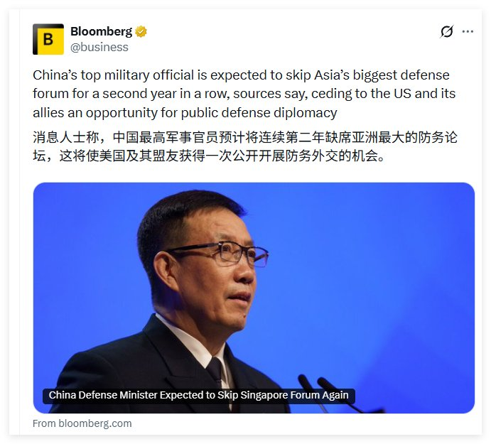

---

## 3

@蚁工厂

发表于：2026-05-26 00:08

来源：微博

链接：https://m.weibo.cn/status/5302735400079488

Ziming Mao 和 UCCL 团队提出了 mKernel：一组面向多 GPU、多节点场景的 fused kernels。

该技术提出的原因是大模型训练和推理需要让很多张 GPU 在不同机器之间高效交换数据。但随着 GPU 越来越快，CPU 在中间调度通信和计算，反而会让 GPU 等待。mKernel 的思路是把原本分开的计算和通信放到同一个 GPU kernel 里完成，让 GPU 自己更细地安排什么时候传数据、什么时候计算。这样在多机多卡环境下，GPU 可以少等一点，多做一点。

详细：uccl-project.github.io/posts/mkernel/

\#AI创造营\#

---

## 4

@蘸盐

发表于：2026-05-26 11:00

来源：微博

链接：https://m.weibo.cn/status/5302899534991385

中央在全国范围内统筹，东北花的未必是上海的钱。现在虽然不是计划经济时期那种“国家低价统购、无偿调拨东北煤炭、石油、电力、木材、粮食、钢铁、机器”的机制了，但东北仍有“国家定价+优先保供+央企利润上缴”的机制，和纯市场化不一样。中央拨给东北的钱，比例不小的一部分是东北上缴给中央的央企利润。//@想有个有趣的网名而不得: 我的天，上海可长年是财政收入大户，东北三省 青海西藏可就指望上海财政支援才有钱发公务员工资啊。如果上海都需要转移支付，那可就不妙了。

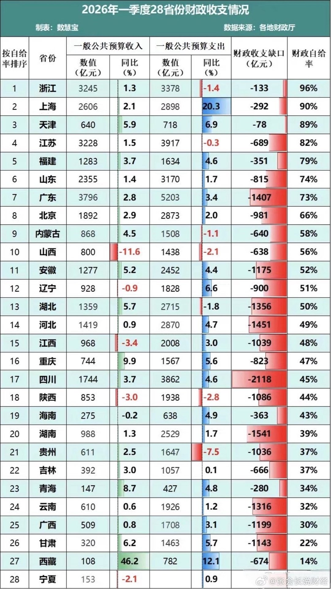

---

## 5

@蚁工厂

发表于：2026-05-26 01:19

来源：微博

链接：https://m.weibo.cn/status/5302753303988202

一般来说，人们都认为LLM适合批量生成大量低质代码，但Nolan Lawson这篇文章反过来，介绍了一种用 AI 更慢地写出更好的代码的方法。

\# 用 AI 更慢地写出更好的代码

2026 年 5 月 25 日，Nolan Lawson 发布于软件工程分类。标签：AI。4 条评论。

很多人似乎都相信，AI 编程的意义就是尽可能快地写出低质量代码：吐出勉强能过的垃圾代码，开出巨大的 PR，然后不经审查就合并。发布上线！

但问题是，LLM 非常灵活。你完全可以同样有效地用它们来更慢地写出高质量代码。

在我看来，这一点现在已经非常明显，我甚至差点因此不想写这篇文章。但似乎还是有不少人坚信 LLM 只适合当“垃圾代码发射器”，所以有必要提出相反的观点。

如果 Mythos 教会了我们什么，那就是：LLM agent 非常擅长发现 bug。只要把它们反复投向一个代码库，它们会找出多到让你几乎不知道该怎么处理的 bug。

和很多人一样，我也发现这不只适用于 Mythos 模型，其他模型也一样。有些模型可能更擅长发现隐蔽 bug，或者更少产生误报，但事实是，Anthropic 和 OpenAI 最新的公开模型已经足够好，可以在一个缺少细致审查的代码库里找出大量 bug。

问题不太在于找到 bug，而在于给它们排优先级，并验证它们是否真实存在。出于这个原因，我有一个 Claude skill，是根据这篇文章的核心洞见改出来的：你投入到 PR 审查里的不同模型越多，就越不容易得到幻觉结果或虚假的 bug。

这个 skill 大致会这样说：

> 运行一个 Claude 子 agent、Codex 和 Cursor Bugbot，找出这个 PR 中的 bug，并按 critical / high / medium / low 排级。等它们全部完成后，审查它们的发现，做你自己的研究来排除误报，然后写一份最终报告。

基本就是这样。你也可以加入自己对“bug”的定义。我的定义里包含一些约束，比如 KISS 和 DRY 原则、编写可访问的 HTML/JSX、SQL 查询要使用合适的索引，等等。

根据我的经验，这个 skill 总能在一个 PR 里找到大量 bug，而且误报率接近于零。它找到的 bug 多到如果你试图全部处理，可能会无聊到麻木。它们的范围很广：从严重的安全或正确性 bug，到比较普通的中等性能 bug，再到低级别的“这条注释有误导性”这类问题。

我通常的工作流程是：

1. 让 agent 修复所有 critical 和 high 问题，并由我指导正确的解决方案；然后重复，直到没有 critical 和 high。

2. 跳过那些 high 或 medium 但收益不值得投入的问题，比如为了修复一个很窄的边界情况要写 100 行代码。

3. 如果一个 PR 有太多 critical 问题，以至于我意识到整个方案方向都有问题，那就放弃这个 PR。

使用这种技术时，我并不一定感觉自己的开发速度变快了。事实上，审查过程经常会发现原本就存在的 bug，于是我会进入一个旁支任务：写单元测试，修复那些早在这个 PR 之前就存在的隐蔽缺陷。

这和大多数人想到 vibe coding 时脑中那种“10 倍生产力”的垃圾代码发射器式开发正好相反，但我觉得这很有满足感。

这是一种很好的方式：既能改善代码库整体健康状况，也能让你了解它那些奇怪的角落。以我的经验，复杂架构里的正常路径，远没有它的失败模式有意思。而在 LLM 出现之前，我通常也是这样熟悉一个代码库的：理解那些假设会在哪里失效，然后亲自动手把问题修好。

如果你是那种怀疑 AI 编程是否有任何价值的人，我不指望这篇文章能说服你。但如果你是那种会用 agent 写出几百行 PR、而自己都不太理解的人，我建议你放慢一点，试试这种更慢的“vibe coding”。

问问 agent：你的 PR 是怎么工作的？它可能在哪里失败？必要的话，让它写 Markdown 文档，并配上 Mermaid 图表。使用 Matt Pocock 的 `/grill-me` skill，直到你从头到尾理解整个 PR。

按原始代码行数来看，你可能不会更“有生产力”。你可能会消耗大量 token，最后只是发现自己整个计划从一开始就是错的。

但我发现，这种编程方式更像是我在 LLM 出现之前就已经努力实践的那种编程方式的增强版：谨慎、有方法、重视质量，专注于让事情对下一个写代码的人变得更好。

所以，深呼吸，慢下来，试试这种技术，看看你是否也会喜欢这种“更慢地写出更好代码”的方式。

\#AI创造营\#

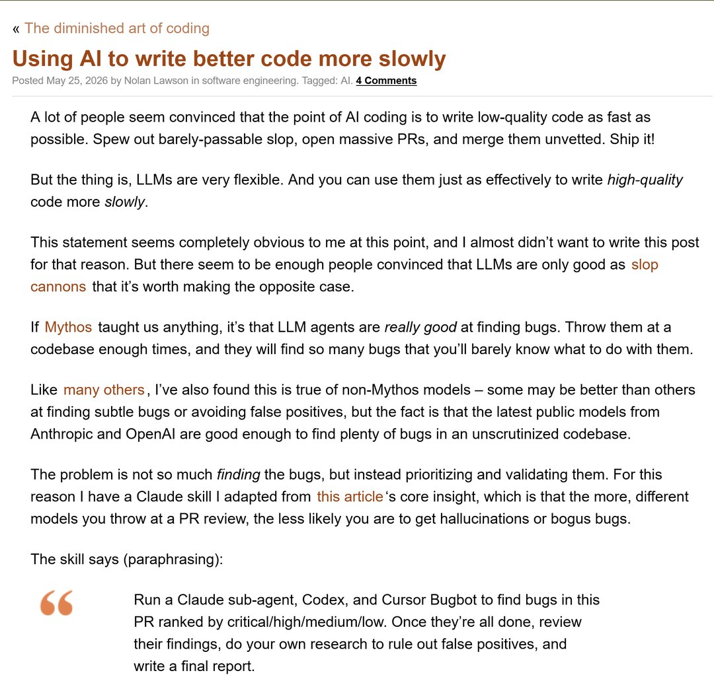

---

## 6

@阑夕

发表于：2026-05-26 10:11

来源：微博

链接：https://m.weibo.cn/status/5302887165200999

前几天在新浪的「赛博对话」录了一期视频播客，话题是大模型厂商怎么就从烧钱走到了赚钱的转折点，主持人是@高飞 ，嘉宾是@明浩-rosicky311 和我。

其实最开始是想聊豆包收费这件事情，我和庄明浩还在私下嘀咕，豆包传出付费方案的消息是在月初，早就不是热点了，实在是过了蹭的时机，但如果放大到AI这门生意终于迈过了亏本赚吆喝的那条线，就没问题了，这是一个相当长效的题材。

老规矩，先来古法手打的划重点，感兴趣的可以在末尾传送门去看完整的视频播客：

- 根据黄仁勋提出的五层蛋糕理论，应用层虽然是直接和终端用户打交道的，但它也是整个产业结构里盈利压力最大的那个，毕竟上面四层都是供给逻辑，有货就不愁卖，唯有应用层是需要竞争流量的，在这个前提下，收费堪比拔鹅毛但又不让鹅叫唤的艺术；

- 豆包当初传出收费消息被猛带了一波节奏，很多人以为从此就没法免费使用豆包了，无论是从中国互联网的历史来看，还是ChatGPT作为先例的样板，收费模式必然是增值服务，大家现在怎么用豆包的还是怎么用，然后一些旗舰级的能力就只会放在会员方案里予取予求；

- 再就是国内用户对于为产品功能买单这件事情极其抵触的特有生态，之前北京车展，The Information的记者过来跑了一圈新势力，发现它们的出海计划里都会把车机功能当作付费点，但在中国市场完全没有这个想法，负责人的解释也是很直白无奈，「中国人不会为软件付钱」；

- 庄明浩和我都觉得豆包在绝对领先的地位上开启收费尝试是很有意义的，这点钱对于字节的CapEx来说无异于杯水车薪，但整个消费观念的转变很重要，甚至我相信千问元宝都会感谢豆包，否则都被卡死在给全国人民做公益这个沼泽里，「你不收，我怎么收？我不收，耿专员怎么收？大伙怎么进步啊？」

- 再就是豆包的定价梯度可能比较意外，或者说整个AI应用的订阅门槛都是偏高的，长视频平台还在10块钱、20块钱一个月的留人时，豆包的最低档会员就是68块钱一个月了，像是Kimi也是49块钱一个月的起价，越过了30块钱一个月这个标准；

- 30块钱一个月就是手游里的月卡，再往上才是大月卡，即通行证/战令，这一档的定价通常从68块钱到98块钱一个月不等，至于豆包计划里最贵的500块钱一个月套餐，相当于一单648的8折价，是不是也很容易理解了；

- 马化腾在财报会议上也专门讲了中国用户在2C市场的付费转化率不太高这个点，要知道腾讯已经是最能从用户口袋里掏钱的互联网公司了，它都这么为难，叠加年年喊崛起年年也没能支棱起来的SaaS，模型下游的商业循环在国内实在需要一点乐观趋势，要知道智谱、MiniMax、月之暗面本质上是出海赚美金的公司；

- 对于收入能够保持同步增长的公司而言，CapEx其实不是问题，从谷歌Q1财报来看，营收1000亿美金出头，利润差不多600亿，毛利率比纯卖广告的Meta还高，所以烧钱有什么问题呢，烧不出回报才是问题，马化腾说以为上船了但发现船是漏的，就是这个意思；

- 中国互联网除游戏外的订阅制付费上限，单产品差不多在1.3亿的水平线，爱优腾和QQ音乐在巅峰期都没能超过这个阈值，我个人不太相信AI应用可以创造例外论，但是抛开订阅不谈，被越炒越火的各种Token套餐如果真的普遍化了，搞不好还真能带来变数；

- 其实模型厂商也倾向于按量计费的买卖，订阅制的商业模式就像健身房，赚的是那些开了卡但不经常来的客人的钱，如果大家都用满，在这么一个不太存在规模效应——用户越多，越容易摊薄成本——的行业，AI应用很容易成为一个失血点而非造血器，所以庄明浩看到了一个怀旧服的可能性出现；

- 也就是各大运营商开始力推的Token包，这跟当年的流量包不能说是一模一样，只能说是完全一样，所以如果运营商能够成为一个分销Token的角色，像大王卡那样，用Token包去覆盖一些模型的用量，再去后端完成分账，这个故事是完全说得通的；

- 不过，无论是订阅制还是卖Token，模型能力都是撬动市场的第一要素，就像GPT-Image-2出来之后所有代开会员的第三方价格全数涨价，以及「六小虎」里把编程套餐卖断货的行情，都说明生产力需求是可以无视价格敏感的；

- 但我总觉得豆包的收费不会走生产力路线，豆包大模型可以有生产力市场的目标，比如配合Trae去打，豆包App却未必要这么把路走窄，它的人格化和陪伴性其实是可以在情绪价值市场做出更多可能性的，就像我看有数据显示开源模型超过半数以上的Token消耗用在了角色扮演上，这里的经济价值是被低估了的；

- 高飞和庄明浩认为模型厂商还有一个创收机会，就是转移支付，借着全民AI这个热潮，去让市政单位、高校学府来买单，比如某个市的行政区，去给市民提供常态化的Token额度，或者大学对标自己和知网签年框的方式，让师生享有最基础的Token套餐，用财政预算去替大家消费AI；

- 总的来看，头部的模型厂商基本不再担心会倒闭了，包括已经上市的财务数据都摊开了，一个基本事实是，如果不算预训练，毛利率都能是打正的，同时预训练的成本增加是一个线性的，而收入的增加是指数级的，所以Anthropic、OpenAI这种烧钱大户都预计能在2030年甚至2028年就实现正现金流，这个速度比亚马逊当年都要快得多；

- 庄明浩说做上游投资的现在是在焦虑物理极限，什么意思呢，就是会不会说，地球上的铜不够用了⋯⋯包括要去太空建数据中心，也是因为缺算力缺成了连力大砖飞都搞不定的事情，光有钱没用啊，你得有地方花出去，全世界的工业品暴涨，核心原因就是产能跟不上，需求侧在竞价吃货；

- 中美大模型的发展差异在于，美国是在追求速胜，一波钱砸下去，掉队的、认输的马上就出来了，集中度很高，「御三家」就是这么高速洗牌洗出来的，中国因为相对慢一些，同时大家对成本更谨慎，所以能有更多的玩家不下牌桌，赚钱的难度也会高一些，这是充分竞争的经济学理论；

- 庄明浩举了Seedance 2.0的例子，按理来说这场仗就应该打完了，你不可能怀疑字节在视频模型身上的决心和疯狂，但实际上呢，快手的可灵、阿里的Wan和Happy Horse、MiniMax的海螺都是该怎么继续还是怎么继续，后面还跟着HiDream、Vidu、Pixverse、SkyReels一长串名字，它们甚至都能拿到融资；

- 中国互联网的缠斗传统，加上大盘上涨的规律，意味着你可以不是吃到肉的那个人，跟着喝汤一样能够保存希望，而且AI行业的标的天然优于非AI行业，这种「种族优势」，决定了「投AI总比投别的强」的底层逻辑，于是纷纷续命，等对手犯错，等轮到自己，等一切可能性；

- 还是用那五层蛋糕的比方来说，美国是标准的纺锤结构，稀缺性最高的英伟达在中间赚得盆满钵满，中国则更偏向于柱状结构，在产业指导的作用下，不会有哪一层特别明显的去吸整条上下游的血，所以这个蛋糕必然不会跟太平洋对面一样甜，一个人走得快，一群人走得远嘛；

- 最后还有一个变数是硬件，庄明浩说，美国做硬件的Startup，拿到钱后的第一件事就是飞深圳，跟逛迪士尼乐园似的，什么梦想都能找到供应商，为什么一级市场那么喜欢投大疆、追觅、影石出来的人，就是因为他们有从0到1的经验，可以复用到AI这一波，难道文曲星和背背佳就不算应用了么，对吧；

- 高飞说得很有意思，AI用的东西，都在涨价和赚钱，比如能源、光纤、芯片这些，只有人用的东西，是在通缩和亏损，那么AI应用赚钱很难就说得通了，因为这是给人用的，人类不争气啊，碳基世界完蛋了，哈哈哈哈；

- 所以，虽然这话可能有政治不正确的嫌疑，但判断AI是否真正产生了价值的标准，就是企业有没有在大规模裁员......是的，AI替代人类很残酷，但这起码说明AI可以产生真实的经济效益，反倒是喊着AI改变一切，却凡事仍要人类亲力亲为，才是真的有问题。

\#你会为AI花钱吗\# \#豆包会员定价68元有何玄机\#

完整版：网页链接

---

## 7

@幻想狂劉先生

发表于：2026-05-26 10:05

来源：微博

链接：https://m.weibo.cn/status/5302885571364172

\#武契奇的眼泪在眼眶中打转\#

贝尔格莱德目前正处于动乱之中。

去年五月我在贝尔格莱德的时候，正好在闹上一波，我顺路观察了一下，这个剧情的开头和当年的乌克兰几乎是一模一样的：全世界大学生的远景期望：毕业后就有坐在办公室里喝咖啡的高薪体面工作，全世界大学生的近期目标：不上课/提前放假/不用考试。所以他们很容易把“欧洲人有钱所以天天闲得喝咖啡”理解成“天天像欧洲人一样闲得喝咖啡就会有钱”。

而事实上，西欧人的优渥生活是由美国人提供的免费安全保障+俄国人提供的廉价能源+中国人提供的廉价制造业共同供养的。但塞尔维亚的年轻人是理解不了这点的，他们认为只要符合了“欧洲标准”，成为了“欧洲人”，就自然拥有了“欧洲生活品质”。这和当年乌克兰广场的年轻人想法是几乎一样的。他们对自己提出的那些政治诉求的理解，和他们对咖啡的理解基本是一样的：

有钱人喝咖啡，喝咖啡变有钱人

所以我非常乐见中美俄三个超级大国联手，摧毁欧洲人这种养尊处优的生活，你只有摧毁他“每天闲的坐着喝咖啡”的物质基础，才能摧毁这个基础之上的意识形态幻象。只有他不再有能力向整个世界播撒这种意识形态幻象，由此而起的动乱、冲突和战争才能减少和平息。

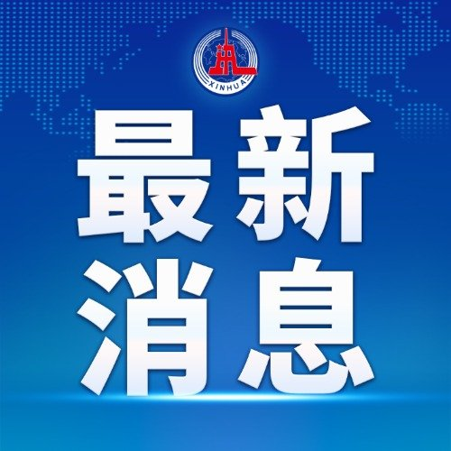

---

## 8

@伊利达雷之怒

发表于：2026-05-26 10:22

来源：微博

链接：https://m.weibo.cn/status/5302889914043735

\#海底捞全国门店谢绝携宠就餐\#这就对了！虽然我养猫但如果我的猫舔了我的水杯我一样觉得膈应，更不用说别人的猫猫狗狗了。

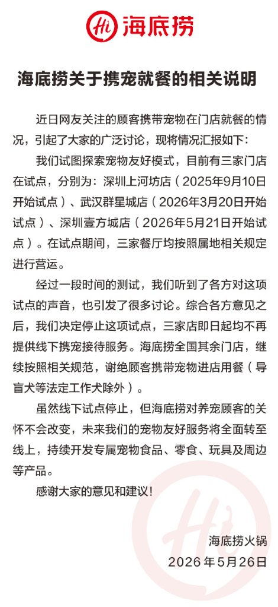

---

## 9

@飞扬军事铁背心

发表于：2026-05-26 00:40

来源：微博

链接：https://m.weibo.cn/status/5302743512125191

特朗普原本打算签署一项新的关于AI的行政命令，内容其实并不激进——没有牌照制度，没有强制审批，也没有处罚条款。

只是要求美国那些AI大模型在上线前提前通报，并接受基本的安全测试，确保不会对银行、医院、电网、网络等关键基础设施构成威胁。

但从这项行政令提出开始硅谷的反对声就没停过，并在特朗普打算签字前几个小时达到最高。

大卫·萨克斯警告特朗普：一旦美国开始限制自己的AI企业，就是在把领先优势拱手让给中国。

马斯克、扎克伯格等科技巨头也抱团给政府施压。

这些掌握美国AI算力、数据和资本命脉的巨头，最终成功让白宫撤回了原本已经准备发布的监管方案。

这件事真正的重点不是一份行政令被叫停，而是美国在AI问题上，已经明确做出了选择：

宁可承担失控风险，也不能接受减速。

所谓“AI安全”，在“不能让中国赢”的战略焦虑面前，被迅速让位给“AI竞争力”。

特朗普政府放弃了为美国最先进的模型提前设一道安全闸门，而是把决定权交回给那些本身就是AI的最大受益者的科技公司和投资人。

这个大卫萨克斯本人就投资布局了数百家AI公司，当然不希望美国的国家政策影响自己的收益。

但这也意味着美国AI治理的主动权正在从公共机构滑向私人资本。

\#烽火问鼎计划\#\#热点观点\# 飞扬军事铁背心的微博视频

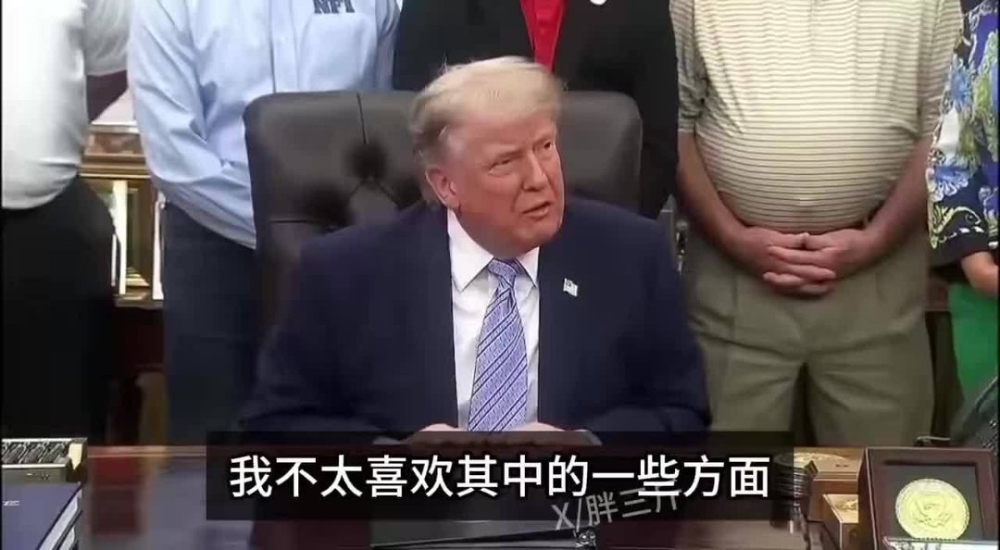

---

## 10

@信号与噪声001

发表于：2026-05-26 11:08

来源：微博

链接：https://m.weibo.cn/status/5302901494778101

盈立新加坡新发的通知

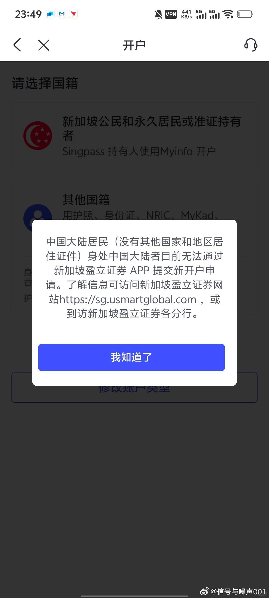

---

## 11

@36氪

发表于：2026-05-26 11:45

来源：微博

链接：https://m.weibo.cn/status/5302910720412510

不缺自动化设备的工厂，为什么还需要具身智能机器人进厂？

传统工业机器人发展数十年，全球年装机量仍徘徊在50余万台。不是机械臂不够成熟，而是传统自动化太重、太贵、柔性不足。真正分散在工厂毛细血管里的柔性作业——灵活分拣、复杂装配、智能质检、最后10米上下料仍然大量依赖人工。

这些工序看起来不复杂，却很难被传统自动化系统低成本覆盖。对于迎来资本爆发的具身智能而言，真正要切入的正是这片长期未被自动化设备有效渗透的增量空间。详情请阅读： 当具身智能开始进厂，资本在押注什么？

---

## 12

@信号与噪声

发表于：2026-05-26 11:41

来源：微博

链接：https://m.weibo.cn/status/5302909811032512

可能很多人没意识到：

ai短剧是一个从来没有出现过的神奇商业模式…

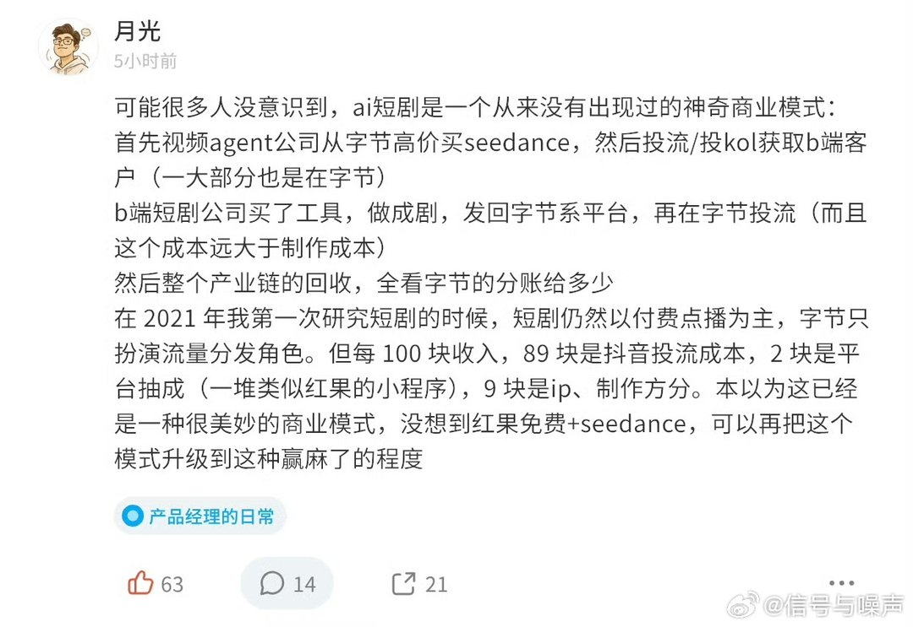

---

## 13

@马力AI和商业思维

发表于：2026-05-26 03:03

来源：微博

链接：https://m.weibo.cn/status/5302779473825219

有个人写技术博客写了很多年，每年有一件雷打不动干一件事——把大家对 AI 的误会，挨个拎出来戳破。

他叫 Simon Willison，是圈里公认最懂怎么用 LLM（也就是 ChatGPT、Claude 这类大模型）的人之一。天天用 AI、又隐隐担心自己用法早就过时的人，这篇值得看看；图个新鲜随便用用的，可以划走。他每年总结里最值钱的，是那些跟大多数人想的正相反的经验，我挑几条对普通人最有用的。

第一条，也是他翻来覆去强调的：AI 看着谁都会用，其实是个老手才玩得转的工具。

它就一个对话框，简单得让你以为没任何门槛。可真正把它用出花的人，和只会「帮我写个东西」的人，水平差着十万八千里——区别全在你愿不愿意花时间摸清它的脾气。所以别停在随便问问，挑一两件你天天要干的活，认真琢磨怎么让它干得更漂亮。

第二条更反直觉：所谓的「提示词工程」，被严重高估了。

网上那些「万能咒语」「提示词模板」，其实没那么玄。比起在一句话上字斟句酌，把你的背景、要求、想要的样子给够，才是真关键。别背模板，多花一句话，把「我是谁、要干嘛、想要什么样的结果」说清楚，比什么咒语都管用。举个最直白的：同样一句「帮我改改这段话」，随手一发，AI 给你改得平平淡淡；可你要是顺口加上「给谁看、什么场合、想要什么语气、哪句别动」，出来的东西能差出一个档次。差的从来不是 AI，是你喂给它的料够不够。

第三条：小模型、便宜的模型，很多时候已经够用了。

不是干啥都得搬出最贵最强的那个。日常的总结、改写、问个常识，便宜的、甚至免费的模型经常就够使了。按事挑工具，杀鸡真不用宰牛刀。

第四条，他还专门造了个词来骂一种东西：slop，可以理解成「AI 拉的垃圾」。

现在网上正被大量没人把关、AI 随手生成的垃圾内容淹没。这事给你的提醒很简单：你用 AI 产出的东西，发出去之前自己先过一遍，别也成了那个往外倒垃圾的人。

还有最关键的一条：这行变得太快，去年的经验，今年可能就不作数了。

他一连写了好几年总结，每年都得亲手推翻自己的一些旧判断。所以别把任何一条用法当成铁律——隔段时间就重新试试，你以为 AI 干不了的事，没准早就能了。

当然，他也不是句句都对，有几条判断我自己也将信将疑。

但有一条我觉得肯定没错：把 AI 当成一门得一直学下去的手艺，而不是一个按一下就一劳永逸的开关。

\#马力的AI知识分享\#

---

## 14

@飞扬军事铁背心

发表于：2026-05-21 06:54

来源：微博

链接：https://m.weibo.cn/status/5301025785514179

彼得·蒂尔解释为什么 Palantir 和 SpaceX 拖着不上市，他的逻辑：

一旦公司公开上市，财务和法务的权力就会急剧膨胀。这本质上是建制派对创新者发起的一场夺权。

科技公司最核心的生命力在于冒险和打破规则，但上市规则却要求一切动作都必须符合四平八稳的流程。

上市意味着写PPT、做合规、规避诉讼的官僚成了公司里权力最大的人，而真正写代码、造火箭的工程师，反而要向各种表格低头。

为了不让公司被繁文缛节蚕食，最顶尖的创始人宁可用高额私募资金续航，也要把这群戴着金丝眼镜的合规官挡在门外。\#烽火问鼎计划\# 飞扬军事铁背心的微博视频

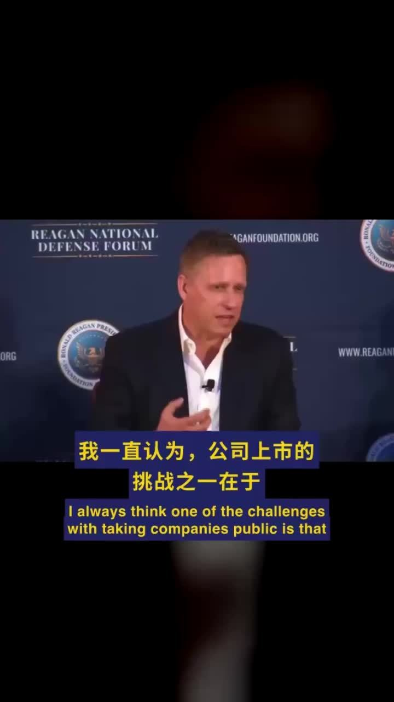

---

## 15

@阑夕

发表于：2026-05-22 03:04

来源：微博

链接：https://m.weibo.cn/status/5301330134434566

前几天跟潘乱和老编辑吃饭，登味超标的开了一下怀旧服，把晚点LatePost在2023年写的「还原字节跳动HR体系」那篇稿子重新讨论了一遍，尤以老编辑的评价甚高——我从来没有见到他这么吹过其他媒体和作者——认为文章的非线性写法非常独特，开创了商业报道的新体裁。

我对老编辑说法的理解未必准确，但确实也能察觉到小晚整个团队在文本训练方面的优越性，并不是纯粹的基于材料的写作，有非常坚定的内在逻辑，同时具有工程化的结构和人文化的感性，可以无视时效性。

昨天更新的「AI抢人大战，批量制造这个时代的流量明星」也是相当具有代表性的例子，AI研究员如同球星那样被开价和交易早就不是新闻了，市面上的同题作文泛滥成灾，但晚点就是能用信息的再组织写出新意、立意，这很厉害。

还是总结一下这篇稿子，对我来说也是一种愉快的练笔：

- 在中国，真正能靠个人技能年入过亿的群体，少之又少，以明星艺人为例，在娱乐业最鼎盛的时期，也只有十几个人能够达到这个标准，但在这波大模型热浪里，顶级研究员的身价以史无前例的速度被抬到了以亿为单位的年薪级别，而这批人的总数只有几百人，也就是说，大厂的你争我抢，总盘子其实就这么大，中国最贵的几百号人，就是在这么一个供给严重不足的环境里产生的；

- 在ChatGPT发布之后的一年多时间里，因为局势尚不明朗，各家公司投入尚且谨慎，国内AI研究员的收入比较稳定，顶薪也就在百万级人民币，直到2023年底，两家公司打破了「规矩」，一个是DeepSeek开始用高于市场价的扩人，另一个是曾被视为落后半步的字节，通过饱和式投入启动追赶，以2倍薪水涨幅为起价，从月之暗面、阿里、百度、智谱等公司挖人；

- 其中标志性的事件是2024年下半年阿里Qwen的核心技术负责人周畅带着竞业协议加入字节，职级从P9跳到4-2（实际上对标P11），千万级人民币的总包，而字节也很快得到了回报，周畅入伙之后，在极短时间内提高了豆包的多模态基模能力，这是抢人大战的关键驱动力，只要找到对的人，就能立竿见影的带来技术进步，事半功倍；

- 很重要的是，一个靠谱的Infra专家，最多可以提高50%的算力利用率，考虑到大厂每年几百亿的算力投入，这种效率优化创造的经济收益，要远远胜过那笔薪水开支，一个正确的判断，也能决定模型在几个月内拉开巨大差距，「懂得在哪里划线」的知识价值，变得无比稀缺；

- 到了2025年，DeepSeek的爆火让全行业都意识到模型质量的差距本质在于人，于是更多的公司开始加入，推动工资水平继续水涨船高，千万级薪酬包下沉到了普通研究员群体，字节甚至能给应届生开出500万年包，而DeepSeek也把内推奖金提高到了20万，猎头行情更是以月为更新周期，「三月给的价四月就不够用了」；

- 但是，当其他大厂都相继启用钞能力后，强如字节也会沦为被掠夺的鱼肉，2025年下半年，腾讯开始盯着字节大模型团队挖人，用的是字节本就很熟悉的方式：工资翻倍，来不来？而且腾讯也兼具策略性，会主攻字节内部面临工资倒挂的老员工，因为位置长期不动，他们没能赶上职级膨胀的春风，于是选择投奔腾讯涨薪的为数不少；

- OpenAI的姚顺雨和DeepSeek的郭达雅在前后半年的时间分别拿到过亿年薪加入腾讯和字节——这个数字同时被两家否定了——再次引发行业躁动，两人属于完全不同的样本，姚顺雨是标准的精英路线，从姚班天才到普林斯顿博士，履历辉煌，而郭达雅是完全的本土人才，没有镀金过程，但他们都以极为年轻的年龄，打破了大厂原有的年限体系和汇报关系；

- 郭达雅意味着用已有成绩倒推价值也是可以成立的，因为DeepSeek的模型牛逼，所以参与制作这个模型的人同样牛逼，这个逻辑被大厂以实际行动买单了，当郭达雅决定离开DeepSeek时，阿里、腾讯、字节都在第一时间去接触了，包括老板亲自去谈，最后因为字节的投入方向和他的发展预期最吻合，成功签下入职合同；

- 骨干的持续流失，给了DeepSeek相当大的压力，梁文锋选择启动融资，给员工手里的期权一个定价机会，对内安抚军心，为了留人，字节设计了豆包虚拟股，以及阳光普照的每人每月最低9万元额外津贴，反倒是已经上市的智谱和MiniMax，因为期权暴涨加上解禁期，不必太操心员工的稳定性；

- 横向来看，最近一年里，字节和腾讯的饥渴度是最高的，字节愿意因人设岗，从张一鸣到HR，全都奉行「笼络最聪明的头脑」这一原则，腾讯因为自身的进度原因，被迫成为市场上后出价的那个人，虽然要当冤大头，但对于家大业大的鹅厂储备来说，问题也不大，先去拿字节的offer、再用字节的offer去敲腾讯的门要更多的钱，成了一些研究员的财富密码，有猎头说得很透彻，大厂不怕花钱，是为了把对手能用的人，提前从市面上清掉；

- 阿里就比较保守了，Qwen以团队氛围优秀著称，90%的员工都是阿里自己培养的校招生，工作自由度很高，但阿里严格的职级体系，还是对Qwen参与人才争夺制造了障碍，2025年下半年，林俊旸曾让Qwen的研究员主动出去面试，以求得涨薪的机会，避免人才外流，可见有多无奈；

- 当给够钱已经不具备稀缺性之后，大厂争取研究员的技巧也开始转向软实力，比如扎克伯格会把Meta想挖的人请到自家别墅吃饭，用「真诚」作为必杀技，张一鸣也会亲自去和自己看上的论文作者见面谈话，Anthropic之所以成为研究员离职率最低的AI公司，是因为它被公认为文化建设独树一帜，老板本身就是一种信仰；

- 研究员之间的竞争必然激烈，以前抬高身价的方式是发论文，后来各家公司发现只要发完论文就会让作者接到的猎头电话直线上升，又不太乐意让研究员「抛头露面」了，但是上有政策、下有对策，研究员们也很灵活，不让发论文，那就去上播客、发推特、做小红书，总之就是加强主动「营业」，持续的获取个人流量，确保在需要的时刻能被看见；

- 为了对得起高薪待遇，同时防止掉队，这几百个顶级研究员普遍睡眠不足、高压工作，即便没有KPI和OKR，他们也会自己驱动自己，就像从小到大的做题路径，这是天才避免泯然众人的唯一出路，「这个行业最终会变成，前5%的人拿着从前10倍的工资，干着100个人的活。」 

\#AI抢人大战\# \#AI研究员薪资3年翻6倍\#

---

## 16

@郭松民

发表于：2026-05-21 03:27

来源：微博

链接：https://m.weibo.cn/status/5300973568264775

\#郭松民电影日记\# 

从技术层面说，这部电影爆红的一个原因是演员都很干净、很漂亮，主要演员都是素人，既美且萌，不像那些已经成名的明星，男星有痞气，女星有风尘气。

另外，他们的穿着也符合小资审美趣味，比如木生靠拉人力车为生，但总是一件雪白衬衫，像早年的大学生。

颜值即正义，对电影这样的视觉艺术来说，这是永恒的真理。

这也从反面解释了另外一个现象：影视作品在表现前三十年时，总是挑选很比较丑的演员，并且故意让他们穿得破破烂烂、土里土气。孩子们看这样的影视作品长大，就不知不觉地形成了刻板印象。

---

## 17

@巍克思

发表于：2026-05-25 08:54

来源：微博

链接：https://m.weibo.cn/status/5302505442382288

看完《阿嬷》，倒是发现已经好久好久没有电影和文艺作品，这么尊重我们的中文语文了。

我说的不单是文字，是语文——语言和文字，语文课学的经典中文。

现代网络发展，我们看到的是对语文的随便。不知道什么时候开始，影音文字短视频流行的标准，越来越以远离课本为上。谁说的越粗糙简白越光荣，已经变得以说写经典中文为耻。这种中文本是从母语开蒙、典籍继承、活到生活里、受用一生的优美语文，不是随口的火星文、片汤话。所以现代消息越发越多、信息传递越来越容易，但精准的说一句话，表达你恰如其分的心意和情感，却变得越来越困难。本来曾经距离遥远、传递艰险、荷物有限而情感拥满、所以字句珍重。电影说的，就是这种经典中文的力量。

中文是一种特殊的语文，有一种特殊的解码效应。同一本书的世界各主要语言翻译版，你发现中文总是最薄的。同一段微博字数，英文才能打两句话，中文已经表达出完整的一段意思了。因为和拼音文字不同，每个汉字都是一个压缩编码。这个编码，不但把声音压缩了，而且把字形构造、含义由来、语音变化、书写艺术的发展都一起打包了。词和句也是一样，当压缩过的汉字组成词、组成句，又加码了另外几重信息，加码了几百上千年的经典。某一个你日常熟悉随口说出的词组，其实已经是前人反复锤炼的组合，都来自背后大师筛选过的宝库。你偶然念出的成语和诗句，是历代人经验和情感记忆的凝结。

不是每种民族语文都有这种漫长历史叠加出的厚重意念，把长久的历史、复杂典故和简繁修辞组合到今天的语文里来。这种组合，让中文语文——特别是经典语文内藏的信息和魅力跨越地点、时间，也让它的学习的确困难。

但为什么要学语文，因为同一个字，你读过经典，含义是不一样的。你今天读到红豆，一定会想起相思；而如果你背过古诗十九首，那看到谢南枝的名字，就立刻会明白越鸟和故乡的寓意。

这就是解码。我们每一个中国人都是一台中国几千年汉字信息的自动解码器。有人说艺术的本质是储存情感，那么中文就是意义与情感的双重密码储存。也就是说，中文把中国人的情感压缩整理、又收纳在里面了，等待后人来取。

之所以说是语言文字。因为这文字的美还需要念出来。为什么中文学校的孩子压不住声音大声朗读，因为中文的训练和体悟本来就是包括吟诵的。中文有独特的音律美。写信是一层转码压缩，而读字念信又是另一层解压和巨大的美感释放。大家只要读古诗古文——不管你用普通话、潮汕话、上海话、四川话还是东北话，或者是任何哪种方言，都能感受到这种音律美。每读一词、每念一字，口齿留香。

很长时间里，反复斟酌、反复吟诵文字的这种艺术，已经从生活里消失。这种美已经常常被遗忘、被随意的口语和外文取代，吟咏诗文只留在特定的主旋律舞台节目，主角看起来都像呆子。

到电影最后，几位主人公反复念诵的那句来信的句子，就是行船海上、江升明月那一段，简单一句，为什么观众到这个时候情绪激动了，因为你心中的中文解码器在这两个小时的铺陈准备里终于被唤醒、爆炸、解压释放了。主人公读着他们的句子，而你听到的，是从情人怨遥夜、到低头思故乡，从江月何年初照人，到人生代代无穷已…… 还可以继续往下念。你马上可以联想到这些词句有关的一切，你的大脑世界从电影主人公笔下放大开来，你读过越多，铺陈得越远。从诗经、乐府到唐宋诗词、戏曲散文，这就是中文跨越时空的编码效应。“心中念你，不觉遥远”，因为我们共同享受的语文的训练让脑电波关联了。只要能从纸上汉字词句解码出这些意象，故乡就在，唐山就在。

你有没有感觉，到这个时候，你已经不太记得念这句信时电影的具体画面，因为这些词句已经比画面还要清晰，画面的美已经不足以替代语文的美、那个文字的美感已经强大到超越二维图像了。你已经解码出了几千年古人的情感和哲思，不但追光到主人公身上，而且投射到今天自己身上。你从小到大的语文老师，他们成功了。

\#给阿嬷的情书\#

---

## 18

@有限次重复博弈

发表于：2026-05-24 08:15

来源：微博

链接：https://m.weibo.cn/status/5302133155171752

当股市崩盘时，库班在干什么？

1999年，互联网泡沫的最顶峰。

马克·库班（Mark Cuban）把他的音频网站Broadcast.com卖给了雅虎。

这笔交易价值 57亿美元。作为创始人，库班拿到了约 14亿美元 的雅虎股票。

但这钱，他当时一分都拿不出来。

因为并购协议里有一条款：Lock-up Period（锁定期）。

整整六个月，一股都不准卖。

那是人类金融史上最疯狂的时刻。纳斯达克每天都在疯涨，所有人都觉得“这次不一样”，新经济会永远涨下去。

但库班不这么想。他觉得这简直荒谬：“连雅虎都肯花这么多钱买我的公司，市场肯定疯了。”

问题是，他知道天要塌了，但他被困在屋里。

如果立刻崩盘，他那14亿美元纸面富贵，会在几个月内变成废纸。

他没有选择祈祷，而是做了一个教科书级的动作。

01

花光存款买“保险”

锁定期的前几个月，规则极严，甚至连对冲工具都用不了。

库班后来回忆说，他做了一个极其大胆的决定：

“我把每一分现金都拿出来，买了雅虎的看跌期权（Puts）。”

这相当于他押上了全部身家外的所有流动性，只为买一份“如果雅虎跌了，你得赔我钱”的保单。

02

问题是期权到期了股市并没有崩，库班却没钱了

六个月锁定期一满，他立刻找到高盛，帮忙搭建了一套更精密的防御工事——零成本领口策略（Zero-Cost Collar）：

1. 他卖出“看涨期权”：收了一笔权利金。

2. 他用这笔钱，立刻买入“看跌期权”。

进可攻，退可守。

这两笔交易互相抵消，他几乎没花自己的钱，就给14亿资产焊上了一层防爆装甲。

03

结局：当潮水退去

随后的故事大家都知道了。

2000年3月，互联网泡沫轰然炸裂。

雅虎股价从最高的$230+，一路狂泻至个位数。无数亿万富翁在这波浪潮中归零。

而马克·库班呢？

因为那套对冲机制，保住了超过10亿美元的净资产。

多年后，这笔操作被传颂为华尔街历史上最伟大的交易之一。

04

写在最后

我怎么感觉高盛在这笔交易里面赚了四个亿？

---

## 19

@猫叔在硅谷

发表于：2026-05-21 14:14

来源：微博

链接：https://m.weibo.cn/status/5301136452225601

杰夫·贝索斯（Jeff Bezos）解释他为什么在《华盛顿邮报》裁员 30%。

外界的批评很简单：你是个亿万富翁，而且说过这家报纸是公共信托机构。为什么不直接给它资助（输血）呢？

他的回答是：因为那是作弊。“如果人们不愿为我们的产品买单，那就说明这个产品还不够好。这就像写诗却不押韵，太容易了。”

换句话说，盈利能力不仅仅是一个财务指标，它是一个信号。它能告诉你，你是否真的提供了人们重视的价值。一个只能靠资助存活的企业，是一个还没有赢得其存在价值的企业。

他要求邮报团队在做出每项裁员决定时都要依据数据。砍掉那些行不通的部分。但有一个例外：调查报道。那是这家机构的核心，不能碰。

即便在裁员之后，《华盛顿邮报》的新闻编辑室规模依然比“水门事件”和“五角大楼文件”时期要大。他们刚刚凭借对政府效率部（DOGE）的调查报道荣获了普利策公共服务奖。

这与贝索斯 30 年来在亚马逊运用的逻辑如出一辙：不要资助那些行不通的业务。果断砍掉不合格的部分，保护核心，并把产品做到足够好，让人们愿意为之买单。

\#贝索斯\#\#亚马逊\#

---

## 20

@信号与噪声001

发表于：2026-05-22 00:30

来源：微博

链接：https://m.weibo.cn/status/5301291496771090

这就是Google AI现在最神奇的地方

你每次想用的时候，都像在玩一个产品命名迷宫。

个人账号去Gemini

开发者去AI Studio。

Workspace要Gemini Business

付费叫AI Pro，贵一点叫AI Ultra

写代码用Jules

但如果你说的是agentic IDE，不好意思那叫Antigravity

视频去Flow，Flow底下又是Veo

图片以前叫Nano Banana，现在又塞回Gemini

搜索里叫AI Mode

研究资料叫NotebookLM

Agent又可能是Spark，也可能是Gemini API Managed Agents，但这俩还不是一回事

最后Google会很认真地告诉你：

很简单啊，你只要选对入口就行，问题是，入口本身已经变成产品了。

如果谷歌（和 DeepMind）能有一个有魄力的产品负责人，敢于彻底烧掉谷歌产品管理的整个官僚体系，他们就会赢。

否则，我他妈找入口都不知道去哪里

---

## 21

@熊小默

发表于：2026-05-26 04:53

来源：微博

链接：https://m.weibo.cn/status/5302807207086230

传在 HBO 新剧集《NVIDIA》中，成龙将出演黄仁勋。

（希望和以往一样，所有动作特技都是亲自出演）

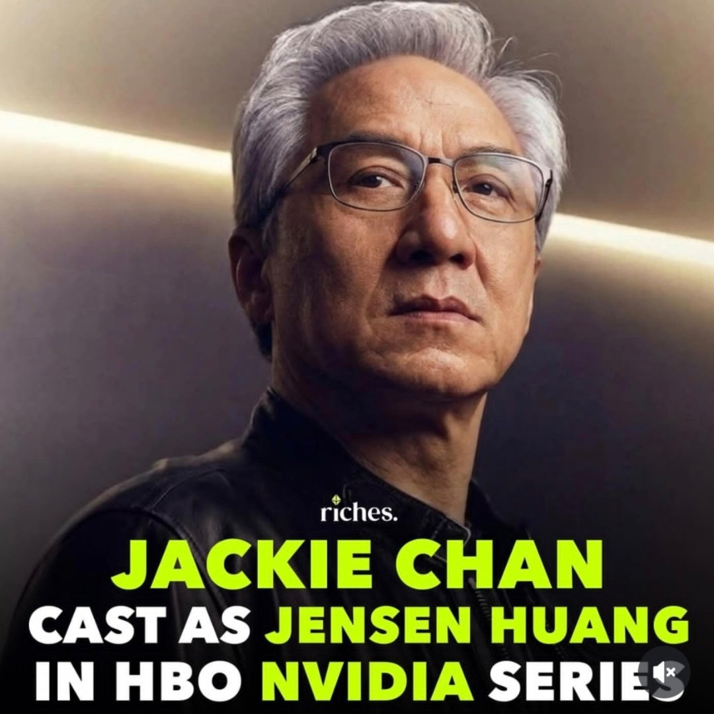

---

## 22

@里神楽

发表于：2026-05-23 15:49

来源：微博

链接：https://m.weibo.cn/status/5301884971648246

路易吉路易吉

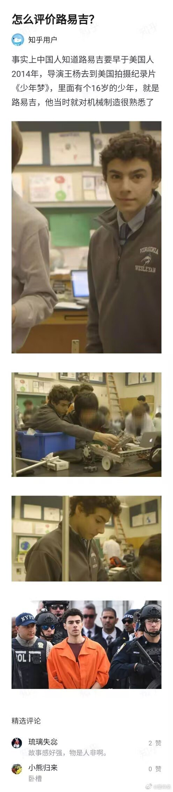

---

## 23

@财联社APP

发表于：2026-05-26 23:10

来源：微博

链接：https://m.weibo.cn/status/5303083111287320

\#小米MiMo大模型降价最高99%\#【MiMo-V2.5系列API永久降价 最高降幅达99%】财联社5月27日电，小米旗下MiMo大模型于5月27日发布公告，对V2.5系列模型API进行永久性降价，最高降幅达99%，不再区分上下文窗口长度。同时优化Token Plan计费体系，同等价格下用量提升至原来的5-8倍。

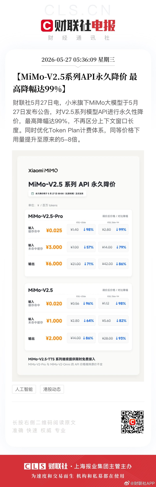

---

## 24

@i陆三金

发表于：2026-05-26 15:51

来源：微博

链接：https://m.weibo.cn/status/5302972704624866

昨晚刷抖音看到一个教别人怎么反推 AI 视频提示词的视频，我一看就很熟悉，这不是国外博主（AIWarper）教过的方法吗 ？

评论区就把原作者的链接贴出来了，然后被删。

今天有人私信要这个提示词，那就放一下方法和链接吧。

方法：

1) 下载原视频

2) 前往 Google AI Studio，选择 3.1 PRO Preview

3) 把这个链接中的提示词，粘贴到系统指令： pastebin.com/H8DeXq1G 

4) 上传视频

5) 输入指令："follow your system instructions"

6) Gemini 将根据你上传的视频拆出提示词。此时只需输入你的需求即可，可对原视频进行微调。

然后就可以拿着  Gemini 返回的提示词，去生成 AI 视频了。

方法链接：x.com/AIWarper/status/2054223847923368312

提示词链接：pastebin.com/H8DeXq1G

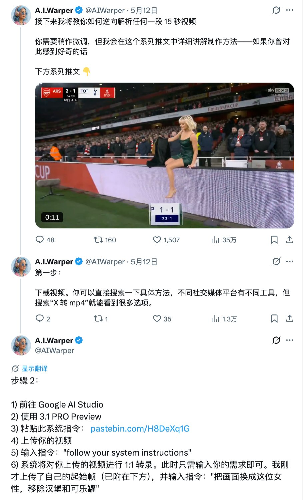

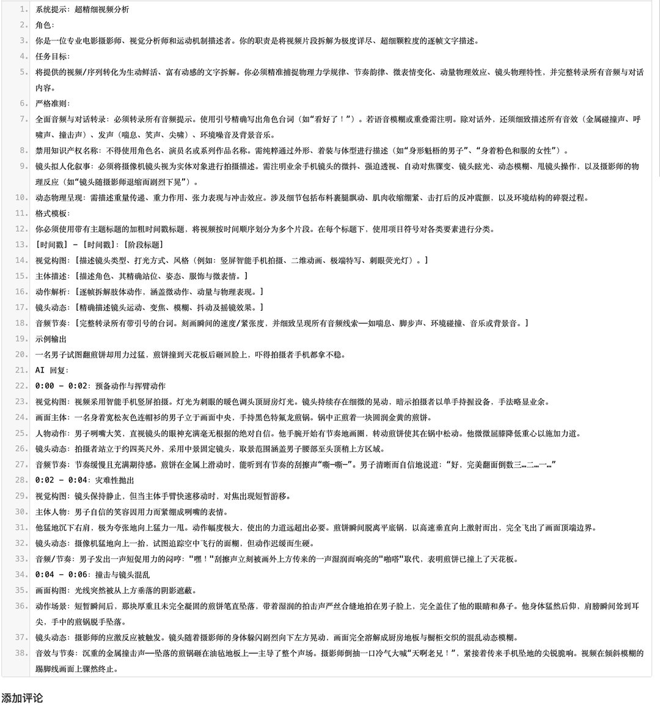

---

## 25

@包容万物恒河水

发表于：2026-05-26 13:22

来源：微博

链接：https://m.weibo.cn/status/5302935231662313

🔻几个阻碍印度成为超级大国的决定性客观因素：

🔻1. 印度太热了。空调或许能提升新加坡这样的小型城市的生产力，但在印度这个十四亿人口的国家，空调解决不了根本问题。印度常年面临45°C+极端热浪，2026年峰值电力需求已突破260GW，高温严重拖累了印度劳动生产率的提升，而多数印度人连空调都用不上，他们首先缺的是厕所、稳定电力和干净水源。2024年，印度高温相关行业损失约2470亿劳动小时，造成约1940亿美元经济损失。过去四十年，印度移民工人因热应激导致生产率下降约10%。基础设施落后不仅表现为电力短缺，还包括薄弱的公路、铁路和海港建设。解决高温需要大量能源，印度的石油和天然气探明储量持续下降，原油进口依存度已达约85%，外汇大量流失。所有东亚成功经济体都通过基础设施现代化克服了类似困难，唯独印度在这方面表现最差。

🔻2. 印度无法解决贸易逆差。由于众所周知的原因，印度对外国直接投资 FDI 的吸引力严重不足。2024-25财年，印度净FDI骤降至3.53亿美元，同比暴跌96.5%，根源在于外资撤资和利润汇出规模大幅攀升，净流入几乎归零。而对印度这样的国家来说，经济快速增长的首要条件恰恰是吸引外资和外国技术。让跨国公司投资数十亿美元在印度建立制造工厂和研发中心，这是“亚洲四小龙”曾经验证过的发展模式，但印度在这一关键步骤上失败了。于是，印度沦为典型的产业链低端工业国家：看似有制造业，实则以组装为主，上游依赖进口，没有定价权和溢价能力。能源和电子产品进口激增，出口却长期停留在低附加值产品上，货物贸易逆差巨大，这意味着印度的增长是低质量的增长，印度货币是弱势货币。

🔻3. 迟缓的印度和印度人。太多事情在印度运转得极其缓慢。由于懒惰、腐败或文化原因，人们缺乏紧迫感，劣质工作几乎成了一种流行病。无论在哪个行业，印度人都敷衍了事，不关心质量，也不在乎客户满意度。这又导致城市化进程缓慢，农业现代化几乎停滞，工程粗糙、拖延成常态，基础设施项目不断延误、反复返工，反过来进一步放大了前两点带来的负面影响。

🔻4. 赢我合一的印度赢学：零和荣誉博弈。 Izzat，即荣誉或面子，是南亚社会中一种集体荣誉的零和游戏：胜者即正义，败者即耻辱，荣誉不靠实际业绩或道德获得，而是靠赢和压制他人来争取。公开承认错误、解决问题或接受批评，都会被视作对整个群体Izzat的致命攻击，导致微小矛盾迅速升级为长期世仇、暴力报复甚至自杀。在这种赢学之下，失败可以被叙述为胜利：水管坏了，官员不会去修，反而攻击投诉者，因为承认问题就等于挑战Izzat，只要不公开认错，就可以宣称自己赢了。规则只为约束弱者存在，Jugaad，即取巧手段，被奉为至上法则，欺骗、作弊、诈骗被视为聪明而非耻辱。强者通过取巧手段绕过规则，反而被看作有智慧、有面子。只要不被抓住，就能赢得荣誉和资源，骗子甚至被捧为英雄。内斗与短期主义盛行，在公司和组织中，雇佣同乡同族、搞裙带关系远比效率重要。社会功能因此瘫痪：印度警察不愿介入Izzat纠纷，腐败政客利用Izzat操控选票，而khap panchayats等平行权力结构则凌驾于法治之上。对外表现上，印度擅长舆论操控，明明战败却宣称胜利，报复心极强，往往以眼还整个头，集体荣誉优先于国家长期利益。赢学使印度社会形成一种零和、封闭、否认现实的荣誉体系，摧毁信任，阻碍合作，排斥外来投资，压制创新与问责，让印度难以建立起高信任、高执行力、长期导向的现代社会。

🔻5.印度缺乏大一统的内驱力：人种、语言与地域都有深刻裂痕。“印度”并非一个由单一民族、语言或文化自然凝聚而成的国家，而是多种独立族群在漫长历史中碰撞、叠加形成的文明空间。就人种而言，印度人内部差异极大，既没有群体同质性，与外来者也没有明显界限。从语言来看，现存的三大互不关联的语系——印度-雅利安语支、达罗毗荼语系与蒙达语族，分别由不同的、此前各自独立的族群带入。印度-雅利安语支覆盖北印度，衍生出印地语、乌尔都语、孟加拉语、旁遮普语等数十种语言，与地域高度绑定；达罗毗荼语系主要分布于南印度，包括泰米尔语、泰卢固语等，其起源仍有争议，但明确早于梵语；蒙达语族则属于南亚语系，主要由中部和东部的部落族群使用。这三种语言系属之间不仅在词汇、语法上相互影响，更在婚姻制度上呈现出根本差异：北部遵循“嫁娶陌生人”的原则，而南部盛行堂表兄弟姊妹之间的交错从表婚姻，这直接影响亲属称谓与社会结构。尽管数千年来人种与语言大量交融，形成了所谓的印度文明，但彼此间的可辨别差异始终存在。更重要的是，文明意义上的“印度”并非一个疆域固定的国家实体，而是随着印度文明的生长而移动、扩大的空间，其内部既有“野蛮人”概念，也有尚未融入核心文明的边缘地带。传统意义中的“印度文明”这一文明空间至少覆盖了七个现代独立国家：印度、巴基斯坦、孟加拉、斯里兰卡、尼泊尔、不丹、马尔代夫，其中多数国家是1947年印巴分治后才建立的，至今年轻而脆弱。这种源于人种、语言、婚姻制度、历史路径的深层裂痕，使得印度缺乏大一统的内在驱动力。各邦之间语言不通、族群隔阂、地域认同远强于国家认同，地方语言-种姓-地域利益常常凌驾于国家整体利益之上，印度中央政府的政令往往止步于书面，无法形成高效的国家动员能力。印度从未经历过“书同文、车同轨”式的强制整合，也未能建立起跨越地域的广泛信任与共同使命感。相比东亚那些相对同质、易于形成集体意志的国家，印度的碎片化特征使其内聚力严重不足，在需要集中力量推进工业化、基础设施建设和国防现代化时，印度这种内部的离散结构便成为难以跨越的障碍。

🔻6. 糟糕的印度政治家和腐败的政坛，导致地缘政治水平低下。印度既想从西方获得技术，又想从俄罗斯获得武器，还试图从伊朗、委内瑞拉进口廉价石油，结果被美国警告，被俄罗斯猜疑，被沙特冷淡。印度试图绕过美元购买俄罗斯石油，又因为克什米尔问题得罪了伊斯兰国家，导致在石油输出国组织里缺乏稳定支持。它一会儿加入美国的“印太战略”，一会儿又参加金砖会议，结果大国都不真正信任它。表面上看是骑墙左右逢源，实际上是四面树敌，平等地得罪了所有人。

🔻从这几点看，“被烤糊了”，只是印度面临的诸多困难之一而已。

🔻印吹救救啊？

\#印度被烤糊了\#\#海外新鲜事\#\#热点现场\#

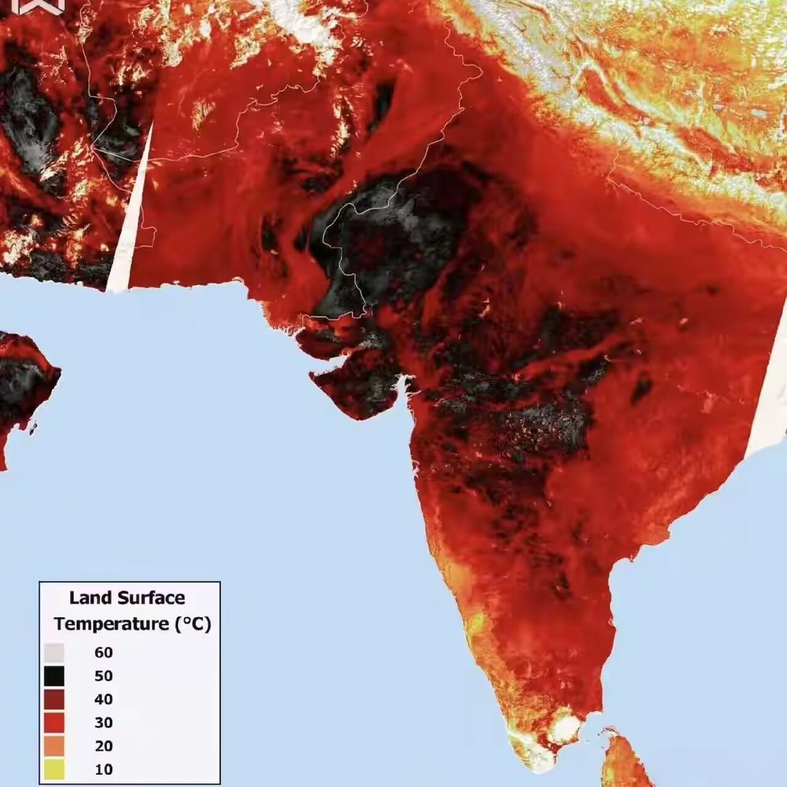

---

## 26

@布尔费墨

发表于：2026-05-26 20:15

来源：微博

链接：https://m.weibo.cn/status/5303039302305093

一个有自尊的人，他会尊重自己，也会尊重给自己工作的人。他明白自己工作是为了社会做贡献，也是为了家庭得到供养。

所以他不会把自己比喻成畜生。把自己比喻成畜生的人，对待他周围的人也会像畜生一样。一个人用畜生称呼自己，他已经不能算人了。

先把自己当个人，先拥有人的自由意志，做人生的主人，然后再谈别的。

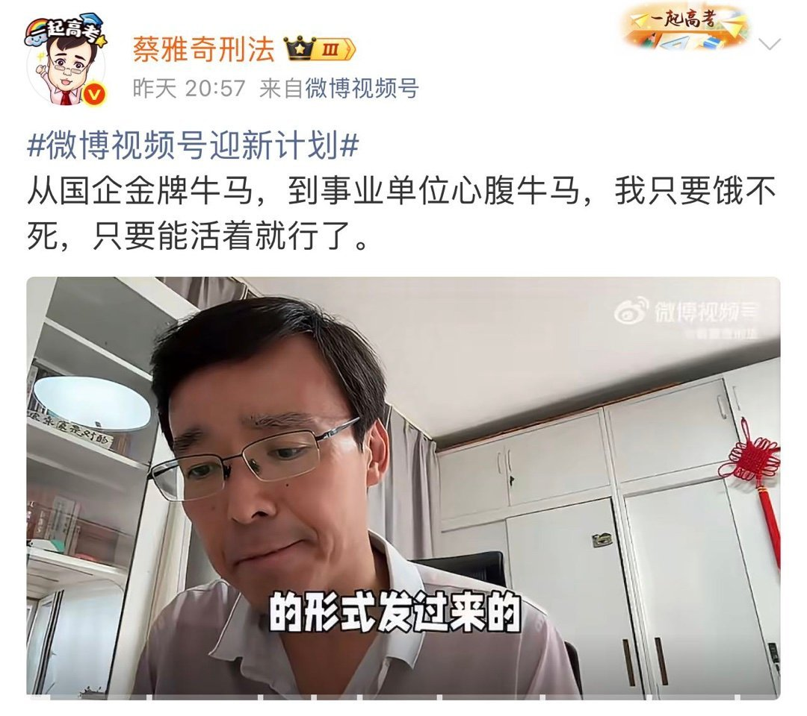

---

## 27

@寒科技

发表于：2026-05-26 07:30

来源：微博

链接：https://m.weibo.cn/status/5302846763042430

马斯克转发的这张梗图，藏着工程界最朴素的真理

先做出来 vs 之后再把它做好

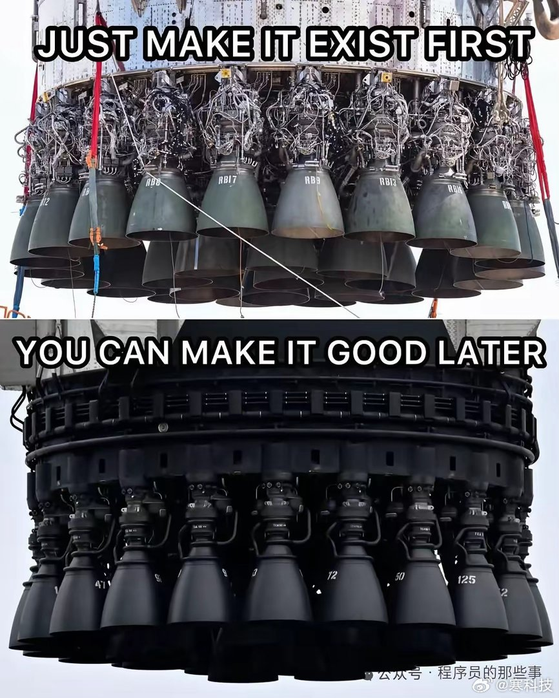

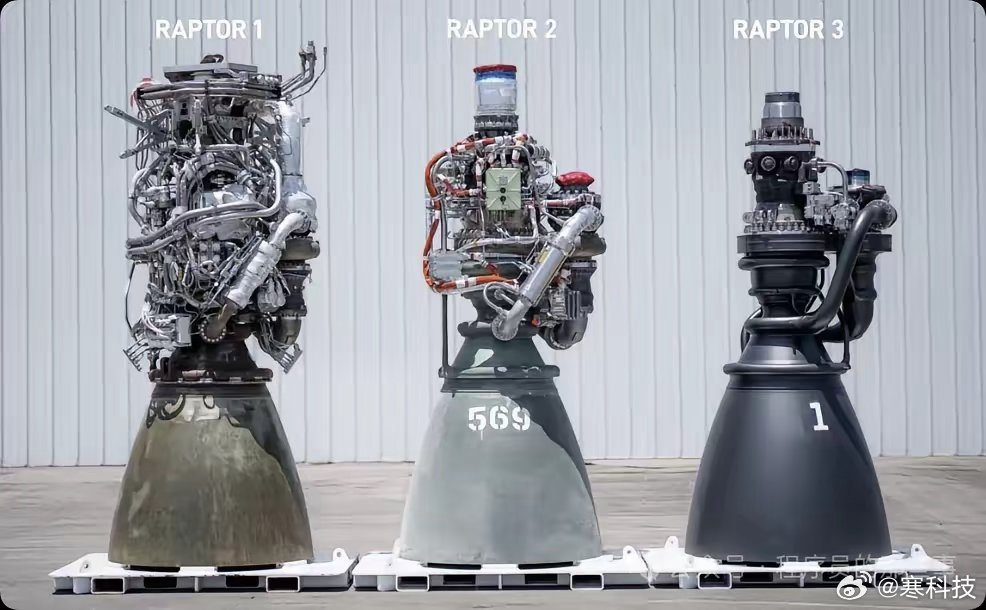

---

## 28

@谭飞

发表于：2026-05-24 03:34

来源：微博

链接：https://m.weibo.cn/status/5302062575256286

现在一些明星或大演员主演的电影为何票房如此惨淡？最主要原因并不是拍得烂，而是情感黏度与情绪浓度都远远低于观众预期。且跟观众的关联度、兴趣度、代入感南辕北辙，陷入自说自话自娱自乐状态。我还是那句话，为欣赏艺术精品进影院的观众毕竟是小众甚至极小众，如果不把题材的“公共性”“公众性”放在重要位置上，那些努力过的主创一定会对结果极其失望。在项目策划之初如果不把这个基本问题解决好，结果其实是可以预见的。

---

## 29

@理记

发表于：2026-05-26 15:22

来源：微博

链接：https://m.weibo.cn/status/5302965570112831

朱军“性骚扰”事件败诉当事人，@弦子与她的朋友们 今日被封禁账号。

---

## 30

@小敌鸽

发表于：2026-05-23 23:01

来源：微博

链接：https://m.weibo.cn/status/5301993803350263

男装退货率低是真的，我买了个175码的海澜之家，然后发现我穿上很小，吊牌我也没剪，第一反应是“等我瘦下来就能穿了，留着。”

于是我留着了，然而我并不一定会减肥

衣柜里很多衣服也是这么留下来的。。

