# 2026-05-28

## 1

@南京摩天汉

发表于：2026-05-27 11:50

来源：微博

链接：https://m.weibo.cn/status/5303274551909020

“一旦皇帝不受‘祖制’的束缚，真正表现出皇权‘威不可测’的面目，这种市井无赖般的小聪明根本不堪一击。明朝灭亡之后，试图在清朝玩弄这一套"骗廷杖"把戏的前明官员，无不付出惨重的代价”

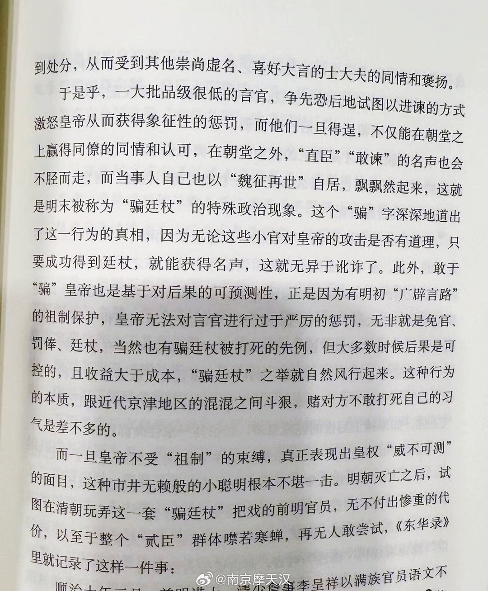

---

## 2

@挨踢牛魔王

发表于：2026-05-27 11:55

来源：微博

链接：https://m.weibo.cn/status/5303275775853347

\#小米MiMo模型API降价\#

小米这个模型为什么能降价？

其实小米MIMO官方已经说明原因了，如下:

我们基于 SGLang HiCache 完整支持 SWA（Sliding Window Attention），将 KV Cache 在 GPU 显存、CPU 内存、SSD 等多级存储之间的数据搬运量降低至优化前的近 1/7，并将可缓存 token 数量提升至优化前的近 5 倍，显著提升了缓存命中率和推理效率。

同时，我们通过优化专家并行方案、输入长度分桶策略等，进一步提升了集群输入吞吐能力，从而在保障服务质量的前提下持续降低单位 token 服务成本。

SGlang是一个开源的推理引擎。

那么HiCache是个什么技术呢？

就是可以把kvcache分级缓存到显存，内存，SSD硬盘的技术。

就是说，ssd硬盘也能存大模型推理的cache了，这个容量很大，而且ssd硬盘相对便宜。

有人测过了，小米mimo的缓存命中率能达到94%。

这就是降价的底气。

这样一来，其它厂商不跟也不行了，毕竟deepseek降了，小米也降了，还是开源的。

老美的大模型公司瑟瑟发抖，一旦国产模型性能赶上来，

他们那个估值还能维持吗？

最后，利好ssd硬盘和内存。

---

## 3

@少年伯爵

发表于：2026-05-27 09:14

来源：微博

链接：https://m.weibo.cn/status/5303235288236155

在校内，我们比的是考试分数。

在校外，我们比的是统盏价值。

---

## 4

@理记

发表于：2026-05-27 10:36

来源：微博

链接：https://m.weibo.cn/status/5303255798385876

后来的朱军其实我联络也不多，一两年有那么一次吧，理记这人从不向上社交，我从来没觉得自己能够得上跟朱军这样的大师级主持人交朋友，从哪个角度论，人家也是我老师，差了n个圈层。

虽然朱军对我非常非常非常客气，他也很感谢我当年冒风险调查出了事实，我认为这属于人之常情，况且我始终认为自己是职务行为，根本不需要回报什么，一贯如此。

我调查了他的事情，客观上帮他沉冤得雪，并不等同于我就有资格跟人家交朋友。

我觉得朱军后来心态挺好的，他没有反诉，一方面是因为有纪律，弦子那边是绝对欢迎朱军反诉的，廷杖越多，弦子在女权领域的地位越高。而朱军反诉，一定意味着国台的舆情又来了。

朱军是个极为守纪律的人，军人出身，主持了二十一年春晚，他把组织纪律看得无比重要。

另一方面，我觉得朱军跟自己的内心也和解了，虽然50岁正值顶峰的时候突然坠入低谷，但他觉得自己已经很幸运了，曾经无比辉煌过，该知足就得知足。

退休后的朱军过得挺恬静淡然，访亲拜友，全国各地转转，偶尔职业病犯了就主持个小活动，在家里就随便逛街，写字作画。

我亲眼见过很多辉煌的人，也亲身经历过多次辉煌的人陷入无边困境。

这对我的影响也蛮大的，人有时候，真的就得自己想开。

哪有一帆风顺呐。

---

## 5

@挨踢牛魔王

发表于：2026-05-27 08:45

来源：微博

链接：https://m.weibo.cn/status/5303228048605224

这不是刘德华，这是黄仁勋。

岁月是把杀猪刀，刀刀催人老。

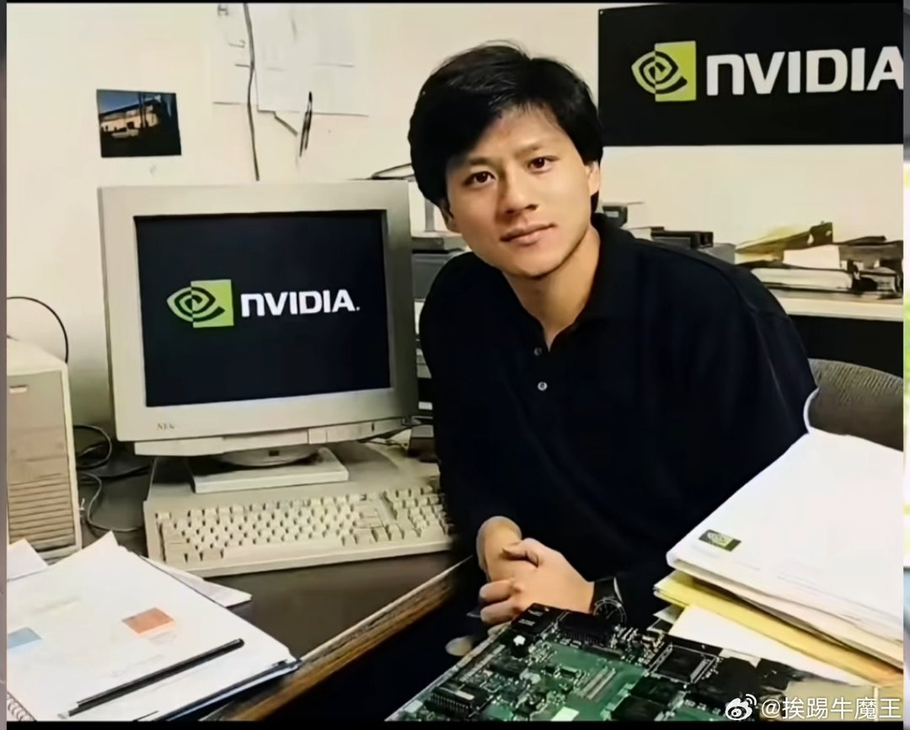

---

## 6

@数字生命卡兹克

发表于：2026-05-27 08:22

来源：微博

链接：https://m.weibo.cn/status/5303222225080577

刚刷到一个非常有共鸣的帖子，是我今年看到的最想哭的一篇

 

我也在努力让自己成为一个有趣的人。

但是我也害怕自由。

 

自由就像漫无边际的旷野。

但是我却不知道该往哪去。

 

所以才那么努力的工作、输出，为自己的人生尽可能找寻一些存在的意义。

 

一定还有什么更重要的东西，对吧？

原文翻译:

我认为AI带给我的最大收获，除了节省时间之外，就是让我意识到自己并不是一个很有趣的人。

面对大量的空闲时间，我意识到除了内容消费之外，我其实并没有什么其他爱好。

我不得不承认，我没有很深厚的友谊，也不是任何特定社群的核心成员。

我发现自己文化水平不高，对艺术、文学、历史或者其他与我的工作没有直接关系的事物，都没有什么浓厚的兴趣。

换句话说，我的生活以工作为中心。AI让我意识到这种生活方式有多么贫乏，它让我不再相信这种生活方式的必要性。

我一直渴望自由，现在却不知该如何利用它，除了更加努力地工作，从而加剧我所学到的教训之外，我反而不知所措。

对人类而言，没有什么比自由更具挑战性。

碎碎念

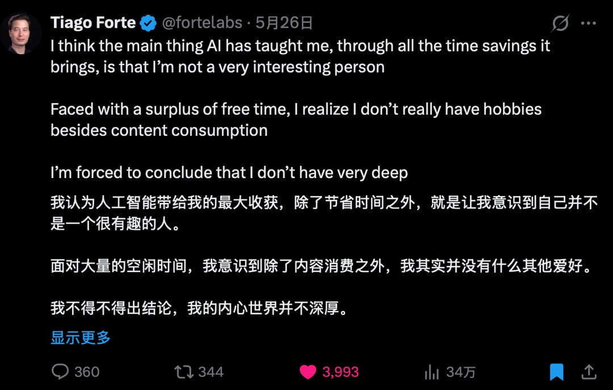

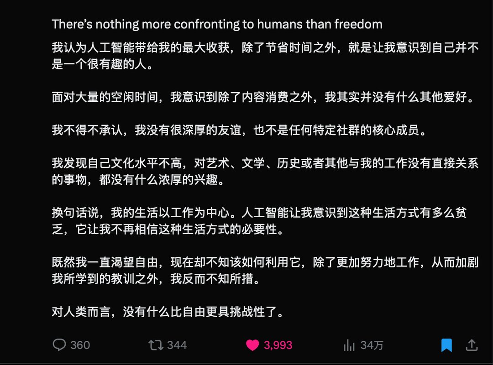

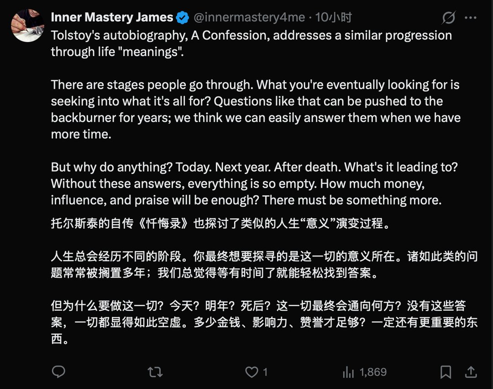

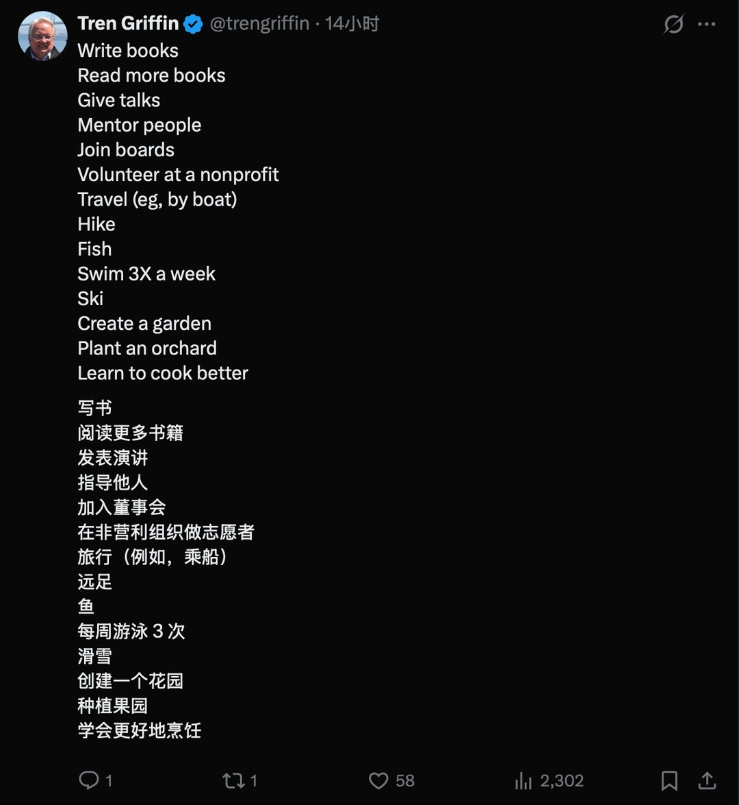

---

## 7

@释不归

发表于：2026-05-27 08:33

来源：微博

链接：https://m.weibo.cn/status/5303225020322647

\#户口以后没那么重要了\#

这就是税制转向的信号，为取消户籍制度做好最后的准备。

未来的税制与公共服务将与大部分不采用户籍制度的国家一样。居民在常住地向地方交税，就地享受公共服务，户籍制度慢慢失去实际作用，最终转变为常住人口登记制度。

本次实施意见的核心，是彻底打破"公共服务跟户口走"的惯性逻辑。户籍作为资源分配工具的功能，在制度层面已基本归零。"房子+户口+稀缺资源"的捆绑体就开始松动。 制度性溢价也将随之重新定价。

2025年末，全国总人口约14.05亿人，全年出生人口792万，死亡人口1131万，自然增长率为 -2.41‰ 。连续多年人口负增长，劳动年龄人口持续下降。过去，城市之间竞争的是"人才"。但当总人口规模开始缩减，竞争逻辑正从"抢人才"向"抢人"转变。公共服务均等化，给了这个转变一个关键推力。

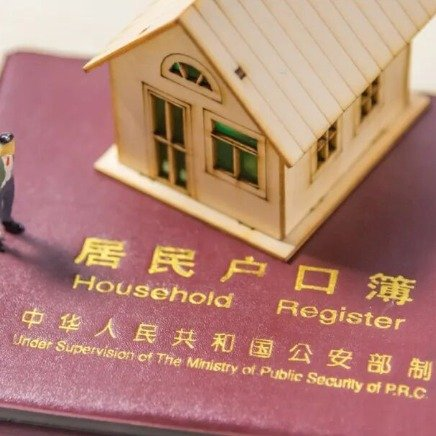

---

## 8

@风中的厂长

发表于：2026-05-27 08:46

来源：微博

链接：https://m.weibo.cn/status/5303228216379524

小老板如何适应大时代？我对比各行业头部公司（中美为主），特别是科技公司的的市值和净利润。十年前和现在比，很容易得出结论：财富加速头部化，十年前赚几百亿的公司，现在赚几千亿，这些钱哪里来的？就是科技突破（技术壁垒）+平台收割（吃干抹净）。平台赚得越多，小老板越艰难。未来趋势不会变。小老板一定要看懂规则，做对几件事，不但不被收割，还能持续赚钱！

首先越是大时代，越要小而美巨头手握算力、流量、供应链、资本、效率（AI）五重优势，规模成本碾压中小经营者。巨头喜欢规模化、标准化大众化，海量通用需求，我们反其道而行之：做巨头最不喜欢的小众、垂直产品，本地化、定制等。其实小众差异化的产品比比皆是，千万别再碰大路货了，死路一条。 

2.产品为王，避开内卷，平台算法是自身利益最大化，商家利益最小化的。表面是算法，背后是对人性的极致利用（贪大、赌性、好胜心），制造内斗（疯狂投流）榨干你们，缺点是会引起劣币驱逐良币，很多人不得不偷工减料。所以多做优质产品、升级产品和大路货区别开来，要学会隐身作战，多平台分流，开拓线下，避免被低水平搅屎棍盯上。

3.利用互联网和高科技提高自身效率。现在可以说是科技带来巨变。有许多大公司臃肿，效率不如小公司。像我公司，今年我亲自培养了2个新人，已经是单兵身兼制作运营投手按时下班不卷的高效一人公司了，没了沟通损耗，一个人比以前五个人效率还高。同行大企业牵扯到方方面面，山头林立，相比转型就困难很多。最近李想接受采访也说AI时代不要轻易裁员，我们也不裁员，而是培养老员工适应新时代。

小老板必须建立新的系统，不再是起早贪黑，自己盯店，而是利用科技带来的杠杆效应。建立一套高效自转的sop为你赚钱。

4.抱大腿，我发现我个人能力再强，在时代和趋势面前也是炮灰。所以要多抱一些头部大腿。和他们优势互补。当然我们自身也要有拿得出手的本领，今年我们生鲜公司因为抱大腿，获得了不少优质资源，持续提高盈利。当然我们也砍掉一些拖后腿的伙伴，因为一些老板短视喜欢过河拆桥，哪怕他们卖惨求你，不要心软，毫不犹豫砍掉，不然还会被他们坑第二次第三次。

抱大腿还包含一层意思，如果你足够了解某些行业包括科技行业，收割你的平台等，可以拿出一小部分资金，买这些行业最优秀的企业的股票，成为他们的股东，让世界上最牛逼的CEO们为你打工。但是需要定力。不要炒短线，短期泡沫多。而是长期持有。做时间的朋友。

5.线上结合线下，即时零售大势所趋，现在隔日达以后小时达。我觉得有条件的话，重点城市试水。线上拿流量、门店做前置仓、公私域双向导流，打通“线上下单、门店发货、到店自提/配送到家”闭环。我公司下半年就要做了。

6..有条件的话，好好钻研一类产品，做这个品类的专家。提高自己审美和表达能力，提升服务水平，建立信任感，打造个人ip，同样的产品，有信任的人卖的就是好。互联网放大了这种优势。做品牌烧钱，但是把自己做成品牌省钱。出问题积极售后，千万不要割韭菜，翻一次车就完蛋了。有的消费者会选择一些私域购买，因为知道那些ip如果不做好服务和售后，结局就是灭亡。

7.小商家还有很重要一点，就是确保足够的现金，随时等待大佬“爆金币”，现在行业变化剧烈，我所在的生鲜行业，以及鞋服外贸行业，时不时有大佬资金断裂，贱卖优质资源、库存、人才、供应链，我因为公司现金充足无贷款，今年已经捡到两次便宜太爽了。但是有更坏的商家，趁别人虚弱的时候捅刀子，这个太缺德了。我们不干这种缺德事，但是有大佬爆装备的时候，我们还是要捡的。

大概就这些，新的等我想到了再分享。

---

## 9

@风云学会陈经

发表于：2026-05-27 00:09

来源：微博

链接：https://m.weibo.cn/status/5303098149177832

\#弦子被封禁\#

我想说胜利，但是很苍白。这是最大的亏，没有之一

社会受影响很大，男女不和谐。一些女性称呼男性为“蝈蝻”。

女性本来有很多不错的品质，纪律好，会共情，好管理。以前工厂都喜欢招女工，吃苦耐劳。后来普通女生还在学习上战胜了普通男生，高考、考研、考公都表现不错，符合科学规律。一些优秀女性受到良好教育，又很有纪律，表现杰出，很多人已经成为科技战线的主力。社会也照顾她们，太累的活不用干，刚出事的煤矿80多人遇难的应该全是男性。

外国敌对势力，派了一些“学者”来搞“女性主义”。这伙人取得了对华最大的破坏性战果，没有之一。

一个女性，纪律没那么好，没那么有同情心，不太好管理，不吃苦耐劳，学习能力一般，这也正常。这在过去，就被认为是没有中国女性的优秀品质，没事了，社会也能接受。

但是，外国敌对势力找到了办法。甚至不是国际女性主义理论，而是发明说，中国男性压迫女性。这些女性被忽悠，以对中国男性发动斗争的办法，搞起了社会运动。不需要优秀品质，有机会就告骚扰、强奸，没机会就扎堆不讲理挑刺，恋爱时要特权，结婚时要彩礼、房车、财权。

这个弦子就是典型，把斗争当成事业，得到敌对势力鼓励。这样的人不少，社会风气被搞到乌烟瘴气。

女性有两个方向，一个是学习中国优秀女性品质，一个是敌对势力忽悠的对中国男性斗争。前一个方向需要克服惰性努力生活，是难的，后一个方向只需要胡搅蛮缠，是容易的。由于人性的弱点，很多中国年轻女性被忽悠了。情况触目惊心，甚至到小学生层面了。

如果不整治，后果会非常严重。经济损失我都不想估算。几个百分点的经济增长率。

---

## 10

@马岩Marks

发表于：2026-05-27 06:20

来源：微博

链接：https://m.weibo.cn/status/5303191371776486

在国内供给饱和需求稳定的市场环境下，如果你的创业不是能创造需求，而仅仅是在原有市场增加供给的生意模式，那么：

趁早拉倒！

在这个市场供给条件下，几乎可以说任何新增供给，都是自我感动。

缺需求，缺创造需求的人，不缺你三瓜俩枣的资本，不缺你拍着脑袋想出来的生意经，更不缺做难而正确的事，尤其是不能因为（市场竞争导致的）太难而自我感动觉得自己就正确……

---

## 11

@梅新育

发表于：2026-05-26 17:14

来源：微博

链接：https://m.weibo.cn/status/5302993608246285

她力量之 \#弦子被封禁\#

【梅新育：封禁弦子姗姗来迟再次暴露中国女拳颠覆性风险】

\#电影监狱来的妈妈\# 

诬告央视主持人朱军性骚扰的女拳先锋“弦子”周晓璇微博账号“ @弦子与她的朋友们 ”26日深夜被封禁，这样的处置几年前就该作出了，却直到现在方才姗姗来迟，再次暴露中国女拳问题之严重，颠覆性风险绝非夸张，而是现实。

本月一个月之内，先是OPPO母亲节文案悍然宣称“我妈有两个老公”，接着是电影《监狱来的妈妈》公然践踏法律法规用杀夫凶手担任主演且大肆吹捧其罪行，连续爆发两起公然颠覆践踏基本人伦的女拳事件，引爆公愤；冰冻三尺非一日之寒，是怎么发展到现在这种程度的？

还要发展到什么地步？

是哪些机构、哪些人在纵容、乃至豢养扶植女拳坐大？

她们的最终目的是什么？ 

十几年前，头一次见识到《中国妇女报》的人，就是公开辱骂军嫂为“婚驴”，当即火冒三丈；2020年美国大选期间，就告诉多位大型企业和金融机构高管，“女权”是对华颜色革命重要主题，如果拜登-民主党阵营胜选上台，对华这方面颜色革命力度会加大；……我早就预见到了女拳之祸，也尽力警示了，但还是目睹女拳愈演愈烈，看她们继续作。

回顾弦子诬陷朱军案时间线：

她2014年去央视实习，2018年通过其朋友“ @麦烧同学 ”微博账号诬告朱军骚扰，诬告所说许多关键内容很快就被证伪：

她宣称的朱军骚扰地方是开着门且人来人往的场所；

她宣称当时阎维文在场，阎维文很快就公开声明自己在相关时间未参与该节目录制；

法院调取的监控视频显示，两人独处时间与她的描述不完全一致；

衣物检测未发现相关痕迹；

……

如此明显的诬告案，朱军2018年10月提起名誉侵权诉讼，直到2020年12月方才开庭，2021年9月一审宣判，法院认为弦子提交证据不足以证明，驳回其诉讼请求。

弦子上诉，2022年8月法院二审维持原判，要求弦子承担相应责任，包括公开道歉和赔偿。

结果是她不但没有执行道歉和赔偿，而且作为影响如此巨大的诬告案件诬告方，法院裁决其败诉后还一直活跃在社交媒体上，直到现在，一审败诉后将近5年、二审败诉后将近4年，她的微博账号才被封禁。可悲！

最后，电影《监狱来的妈妈》主演赵晓红应该重新收监。

---

## 12

@万年炎帝

发表于：2026-05-27 10:21

来源：微博

链接：https://m.weibo.cn/status/5303252140952865

🔻美国媒体不顾自家官兵死活的事情在二战早已有之...1943年美国媒体纷纷报道了日本深水炸弹定深太浅，炸不到美国潜艇的新闻，日本人才发现自己深水炸弹定深不够。

🔻日本的潜艇潜水深度只有200多英尺，美国潜艇有400-500英尺，所以日本早期使用深水炸弹时定深都比较浅。

🔻这个泄密事件导致美军至少多损失了10条潜艇和600名官兵。

\#烽火问鼎计划\#

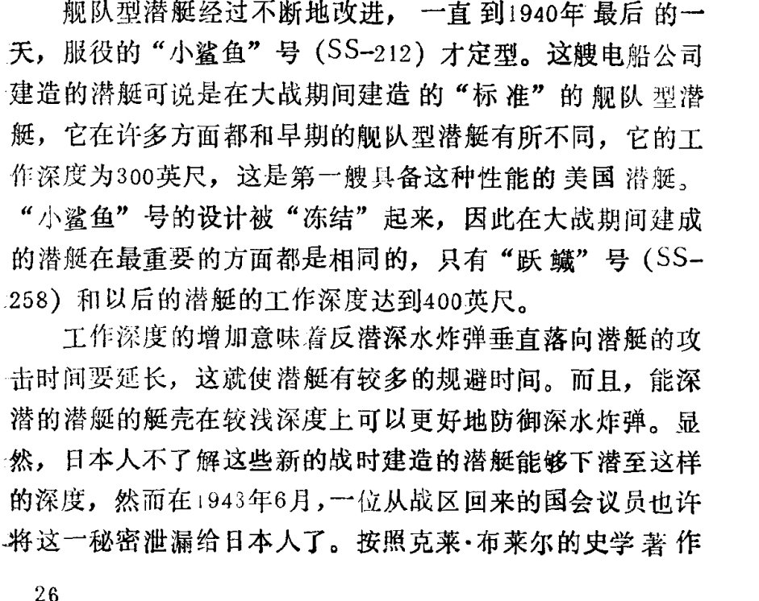

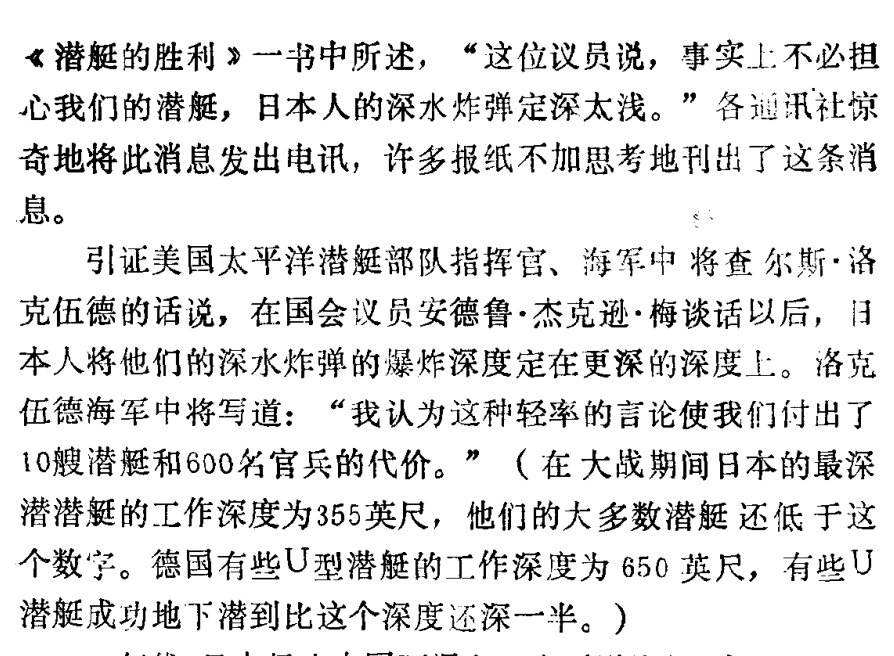

---

## 13

@前HR本人

发表于：2026-05-27 14:06

来源：微博

链接：https://m.weibo.cn/status/5303308584486103

如果方法有效，那Token计费时代确实会土崩瓦解。

用32步，打败了别人1024步的结果。训练数据，只用了人家的十分之一。

 这是MIT何恺明团队最近发的论文里的数字，模型叫ELF。同一个礼拜，字节跳动Seed实验室也发了一篇几乎同方向的东西，叫Cola DLM。

因为这样会变成非常便宜，导致了以前的那些收费逻辑都是错的。相当于新的成本。以后大家都是算力成本加一点点运营费用，那运营这种设施的公司它的收高额费用效果就比较差。也会导致整体的算力需求增长率下降。那美国股市会严重被压制。

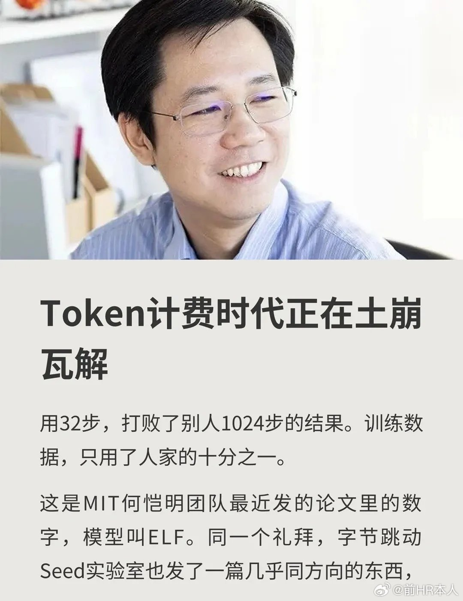

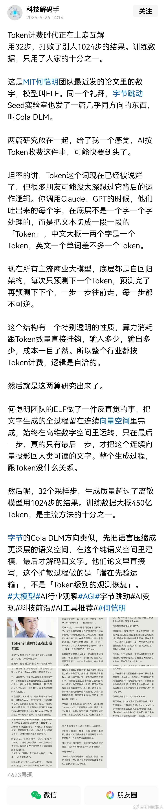

---

## 14

@信号与噪声001

发表于：2026-05-27 14:00

来源：微博

链接：https://m.weibo.cn/status/5303307314927474

合肥市委书记 

长鑫存储这一轮史诗级暴涨， 

所有人又在吹合肥是"最牛风投城市"。 

但很少有人想起一个人，他离开合肥15年了。 

合肥市民论坛上，至今还有人翻出一篇老文章，反复顶帖。 

题目只有六个字——《他改变了合肥》。 

他叫孙金龙。28岁全国劳模，39岁副部级。 

2005年，他来到合肥当市委书记。 

当时的合肥，GDP 589亿，中部六省倒数第一，要啥没啥。 

他到任两个月，落下的第一张牌，震惊了所有人—— 

不是招商，不是批地。是拆违建。 

合肥违建有多凶？听说哪要开发，一夜能造出"隔夜楼"，墙壁用硬纸板搭。 

有人到政府门口闹事晕倒。 

他说：有病先送医院，好了再抓起来。 

更绝的是，他下令炸了一栋18层的楼。 

手续齐全，刚封顶。就因为它挡住主干道。 

6万根雷管。“中国第一爆”，整座城市都听见了。 

从此干部都知道：这个书记不好糊弄。 

但拆违建只是“破”，“破”完，"立"什么？ 

2005年8月，一份重磅文件出炉：《优先加快工业发展行动纲要》。 

四个字，定鼎乾坤——“工业立市”。 

为什么必须是工业？ 

孙金龙的底层逻辑残酷且清醒：一个一无所有的内陆城市， 

没有互联网基因，没有金融底子，想逆天改命，唯一的一条路， 

就是走最苦、最累、但也最扎实的硬核工业。 

此后20年，合肥的班子换了几届，
 

但这四个字，连一个标点符号都没变过。 

方向定了，谁来干？ 

孙金龙干了第二件让所有人大跌眼镜的事：他把自己的市委书记第一秘书，直接派去当了招商组长。 

一把手的核心秘书都去招商了，这就等于给全省、全系统释放了一个顶级信号：招商，是合肥的头等大事。 

3400多支小分队，撒到全国20多个城市驻点招商。 

第一批出去，一年落地982个项目。第二批，翻倍。 

他练出了一支铁军。 

合肥的招商员，一年200多天在外跑项目。 

"上午飞上海，下午飞深圳，晚上回合肥。" 

合肥的招商员，进车间转一圈，目测设备价值3800万。 

误差只有一个零头。 

投行怎么做尽调，他们就怎么做。 

这个基因传了二十年。 

合肥每次"赌"赢，不是因为运气。 

是因为决策者手里永远有一份全产业链分析报告。 

有了团队，有了方向，很快，海尔、美的、格力、长虹全拉来了。 

2008年，合肥冰箱全国第一，洗衣机第二，空调第三。 

合肥，成了"家电之都"。 

但孙金龙看到了更深的窟窿。 

一台电视，三分之二成本在液晶面板， 

中国没有一条自己的大尺寸面板线，完全被日韩捏在手里。 

当时合肥经开区一个副主任去拜访海尔，问还缺什么配套。 

海尔开玩笑说：我要液晶面板，你们反正也给不起。  

这位副主任是清华毕业的，回去翻了一遍校友录，找到了清华大学液晶显示专家张百哲。 

张老说：你要找的宝贝，在北京亦庄——京东方。 

孙金龙立刻亲自带队考察京东方。 

考察回来，他把所有主要负责人叫来开会。 

当场算了一笔账：京东方6代线，总投资175亿。 

合肥一年财政收入才三百多亿。 

更要命的是， 

当时的京东方正处于全中国舆论的火葬场。 

连年巨亏，随时可能倒闭。 

拿全城大半的家当，去砸一个看不见底的无底洞，反对的声音瞬间如山呼海啸： 

“全市公务员十年不发工资，也还不上这笔债！” 

但最终的决定只有五个字——砸锅卖铁，上。 

为了给京东方融资，正在兴建的地铁项目，停了。 

为了京东方的用电，合肥6个月建好了一座110千伏变电站。 

但孙金龙和合肥班子展现了恐怖的战略定力。 

他们算的是底层逻辑：赢了，直接跨入高端制造； 

怕担责缩手，合肥永远只能当个低端组装厂。 

这确实是一场豪赌，但绝不是闭着眼睛摸黑赌。 

2008年10月，项目签约。 

后来的故事，成了中国工业史的传奇： 

6代线投产，逼得外资面板暴跌，中国老百姓看上了便宜的大电视。 

顺藤摸瓜引来上百家配套企业，砸出了一个千亿级的“显示产业集群”。 

合肥建投账面收益超过120%。 

更重要的是，合肥跑通了后来屡试不爽的“合肥模式”： 

国资重金领投-孵化产业链 - 上市后国资退出 - 再投下一个。 

有了京东方做样板，合肥在“工业立市”的路上彻底狂飙： 

2015年，有了面板，他们顺藤摸瓜建了晶合集成，解决驱动芯片；  

2016年，有了芯片，他们故技重施砸出长鑫存储，死磕内存芯片；  

2020年，芯片和屏幕都齐了，他们顺理成章抄底蔚来，抄出了新能源汽车巨头。 

再往后，大众、科大讯飞。 “芯屏汽合”，“集终生智”。 

孙金龙呢？ 

2011年他离开合肥。 

之后去了湖南、新疆。 

2020年回京，生态环境部党组书记—— 

一个跟芯片毫无关系的岗位。 

他没有长鑫的一股。没有京东方期权。 

没在任何一家公司挂名。 

种了一棵树，没等到乘凉就走了。 

今天长鑫暴涨。 

外行聊风口，聊运气。 

但你回头看那条链—— 

2005年的纲要，那支招商铁军，2008年那个惊心动魄的决定。 

人们怀念的从来不是什么风投神话。 

是那种敢为一座城赌上乌纱帽、砸锅卖铁杀出血路的实在人。

