# 2026-05-31

## 1

@萌音大酋长

发表于：2026-05-30 09:07

来源：微博

链接：https://m.weibo.cn/status/5304320738462305

🌾夏商周断代探源：一场跨越数千年的时空追凶🌾

🌍咱们今天来聊一个特别硬核、但又特别像悬疑推理剧的话题——夏商周断代工程。这个名字听起来很学术，说白了就一句话：咱们中国人常说的“上下五千年文明”，前两千多年到底是怎么算出来的？夏朝到底存不存在？商朝人什么时候入主中原？武王伐纣那天晚上，天上到底有没有出现传说中的“岁星当空”？

🌋这事儿要搁在二十多年前，说实话，咱们自己心里也没底。上世纪九十年代中期，夏商周断代工程正式全面启动，但在此之前，国际学术界有个特别尴尬的局面，中国有确切纪年的历史只能上推到公元前841年，也就是西周晚期的“国人暴动”那一年，史学标准叫法为“共和元年”。再往前，全是一笔糊涂账。司马迁写《史记》倒是把夏商周三代君王的谱系写得清清楚楚，从黄帝到周幽王，谁是谁儿子、谁在位多少年，明明白白。可问题是，这些数字加起来对不上，而且没有任何出土文物能直接证明夏朝的存在。这就导致一个很憋屈的局面：咱们自己觉得有五千年，人家西方学者一摊手，说你们能证明的也就两千八百多年，剩下的都是传说。

🏺要理解这种憋屈，咱们得把时间拨回到二十世纪初。那时候中国考古学刚刚起步，整个学科的话语权不仅被西方和日本学者把持，国内学界自己也打得不可开交。1908年，日本人白鸟库吉写了一篇文章叫《尧舜禹抹杀论》，直言尧舜禹并非真实上古君王，是后世诸子百家为宣扬学说整合塑造出的理想圣王形象。白鸟库吉那篇文章的逻辑很刁钻，他说尧舜禹的名字和事迹都能从道家、儒家的学说里找到原型，尧的“禅让”是墨家编的，舜的“孝道”是儒家编的，大禹治水是道家编的，整个三代圣王体系就是诸子百家为了推销自家学说合伙攒出来的一个故事汇。这个论调一出，日本汉学界一片叫好，当时中国学界有识之士气得拍桌子，但气归气，没有出土证据，你再生气也只能干瞪眼。

🦴更让中国学者难受的是，国内也出了个鸟人，跟白鸟库吉形成了内外夹击之势。这个人叫顾颉刚，是胡适在北大教出来的学生，后来成了中国“古史辨学派”的开山鼻祖。顾颉刚1923年在《读书杂志》上发了一篇文章，标题叫《与钱玄同先生论古史书》，提出了一个石破天惊的观点——“层累地造成的中国古史”。什么意思呢？就是说咱们今天看到的古史系统，不是一下子就有的，而是一层一层堆上去的。时代越往后，传说的古史期反而越长，人物形象也越丰满。西周人提到的最古帝王是禹，春秋人提到了尧舜，战国人提到了黄帝神农，到了汉代又把盘古给加上了。按顾颉刚的说法，大禹最早的形象根本不是什么治水圣王，他仅从古文字字形推测“禹”字原始物象可能似虫兽类，后来才被一步步神化为人间帝王。鲁迅后来写小说拿这事开涮，说“顾颉刚说禹是一条虫”，这个标签一贴上去就撕不下来了。

⚡顾颉刚这套理论在当时的破坏力，相当于往史学圈扔了一颗原子弹。你想，那个年代正是民族危机最深重的时候，大家都在拼命找中国人的根来提振士气，结果顾颉刚站出来说，你们的根是编出来的。鲁迅的弟弟周作人也骂过他，说他是“历史破坏主义者”。后来主持殷墟发掘的李济说顾颉刚属于“反革命”，意思是你把中国人的祖宗都快拆没了。

🎭那么问题来了，白鸟库吉说尧舜禹是编的，顾颉刚也说尧舜禹是编的，这俩人是不是一伙的？还真不是。白鸟库吉的动机里夹杂着当时日本学界对中国文化的轻蔑，他是从外面把中国古史拆掉。顾颉刚虽然也用疑古的方法，但他的出发点是“整理国故、再造文明”，他是从内部打扫房间。不过客观效果是一样的——整个上古史体系被拆得七零八落，夏朝更是连影子都找不着了。所以你可以理解，为什么后来殷墟挖出甲骨文的时候，中国学界的激动不是简单的学术兴奋，而是一种憋了几十年的恶气终于吐出来了的感觉。那些被白鸟库吉抹杀的、被顾颉刚解构的、被安特生判了“文化西来”死刑的祖先，终于从地底下浮了出来。

⚡说到安特生，操作更让人窝火。1921年，瑞典学者安特生在河南渑池仰韶村主持发掘，出土彩陶，开启中国现代田野考古。但他随后套用西方理论，判定中原彩陶文化由西亚、中亚地区西向东传入，进而支撑“中国文化西来说”。安特生这个人的身份很特殊，他是北洋政府聘请的矿业顾问，拿着中国政府的工资，挖着中国的地，然后发文论证你们的文化是从西边传过来的。这套“中国文化西来说”在中国学术界压了整整三十年，压得很多人抬不起头来。不过话说回来，安特生晚年已经主动修正了自己的观点，承认华夏本土文明具有独立发展的主体性，可惜当时国内学界已经被“西来说”刺激得太深，没多少人关注他的自省。东西两面夹击——西方人说你的文明是二手的，日本人说你的祖先是不存在的，国内的疑古派也在拆解古史体系，这口气，换谁谁憋屈。

🦴转机出现在1928年。那一年中央研究院历史语言研究所成立，傅斯年出任所长，提出了一个口号叫“上穷碧落下黄泉，动手动脚找东西”。这个口号在当时石破天惊。因为中国传统的学问都是坐在书斋里读经书，从来没人扛着锄头去地里刨历史。傅斯年直接说，不挖出东西来，什么三皇五帝都是空话。他先派董作宾赴安阳小屯实地探查确认遗址，随后由李济带队，正式开启中国学术机构独立主持的第一次殷墟考古发掘。这里需要说清楚：董作宾负责甲骨调查辨认，李济是殷墟正式发掘总负责人，后来被尊为“中国考古学之父”。傅斯年心里憋的那股劲，说白了就是要用中国人的手，在中国的土地上，挖出中国人的祖宗来，狠狠打那帮疑古派的脸。

📜殷墟的发掘，是一场持续了将近十年的学术奇迹。从1928年到1937年抗战全面爆发，一共挖了十五次，出土了十五万多片甲骨文、青铜器、玉器和人骨。其中最震撼的发现，先是王国维在1917年以甲骨卜辞印证《殷本纪》商王世系，证明司马迁的记载基本无误；后续董作宾在殷墟十五次发掘中整理出十万多片甲骨，进一步完善了商王的在位年代和分期，跟《史记·殷本纪》的记载严丝合缝。这个发现的意义怎么强调都不为过——它证明司马迁笔下那个半人半神的商朝，是真的存在过的。更关键的是，商朝甲骨文里反复出现对“西邑”的祭祀记录，后世战国竹简明确将“西邑”与“夏”等同。需要说明的是，甲骨文中的“西邑”多指夏遗民族群势力，不可直接等同于完整夏王朝，但这等于从商人自己的嘴里间接坐实了夏的存在。顾颉刚当年说古史是层累造成的，但甲骨文不是层累，它是商朝人自己刻的，是第一手硬证。既然商朝是真的，那再往前推，夏朝也未必是虚构。这个逻辑给了中国学术界巨大的信心，也让“疑古派”的脸第一次被实际证据抽。

🐉不过，光有甲骨文还不够。甲骨文能证明商朝存在，但它自身的时间坐标是模糊的。你得知道这些甲骨是什么时候刻的，对应的商王在位多少年，才能建立起准确的纪年体系。这就引出了一个更深层的问题：中国古代的天文记录，到底能不能用来断代？

🌠答案是能，而且极其精妙。中国古代有一套独立发展起来的天文历法体系，跟巴比伦体系和埃及体系并列世界三大天文学起源。中国古人观测天象不是为了搞科研，而是为了占卜。在商周时代，天文观测是王室垄断的最高机密，只有贞人和太史令这类专业人士才能掌握。他们认为天象是老天爷给人间发的微信消息，日食月食代表君王失德，岁星位置变化预示战争胜负，金木水火土五大行星的会合周期关系到王朝兴衰。所以历代史官对天象的记载极其认真，不敢有一丝马虎，因为记录错了是要掉脑袋的。

🔭甲骨文中保存了全世界最早的可靠天象记录。《甲骨文合集》第11485片，记录了一次月食，日期是“壬申夕月有食”。现代天文学家结合不同王世模型进行反推，提出该月食可能发生于公元前1183年左右，但此结论属多模型并行推演假说，尚无唯一公认断代结论，仍需与考古地层及甲骨文分期交叉验证。这些记录等于在三千多年前的地下埋了一台天文照相机，咔嚓一下，把当时的天空定格在了甲骨上。

🌪️但是，光有这些零散的天象还不够。要从天象推出准确的公元纪年，必须解决一个核心难题：中国古代历法的岁首不统一。夏以建寅正月为岁首，商改建丑十二月，周改建子十一月，秦更过分，以建亥十月为岁首。这就意味着，同一条“正月甲子”的记录，放在夏历、商历、周历里，对应的公历日期完全不同。再加上古人用的干支纪日法六十天一循环，在没有连续记录的情况下，甲子日到底是哪一年的甲子日，简直是一笔天文糊涂账。

🧱这个难题在汉武帝时期部分解决了。公元前104年，汉武帝启用《太初历》，把岁首重新固定在正月，并且采用了更精确的朔望月计算法。但这已经是西汉的事情了，距离夏商周至少隔了一千多年。用汉代的历法去套商周的记录，就像用现代的北京时间去推算唐朝人几点吃早饭，中间隔着无数次日历改革和置闰调整，误差累积起来能把人逼疯。

💡所以断代工程上马的时候，摆在桌面上的头号难题就是这个：如何把文献里的干支日、月相记录和现代天文计算精确对接起来？这事儿在九十年代初几乎是不可能完成的任务。但有一件事给了学者们巨大的灵感，那就是1994年彗星撞木星的观测。那年七月，苏梅克·列维9号彗星的二十多块碎片先后撞上木星，全球天文台同步观测，记录精确到秒。这件事让所有人意识到，现代天文计算已经发展到了一个惊人的高度，只要知道初始条件，就能把天体的位置反推到几千年前，误差控制在分钟级别。

🌊有了这个技术底气，天文学家和历史学家开始联手啃最硬的骨头——武王伐纣的确切年份。这个年份为什么如此重要？因为它是整个三代纪年体系的“定海神针”。西周一共十二王，文献里记录了每个王的在位年数，加起来的总年数各家说法不同，但大体在二百五十年到二百八十年之间。如果能确定武王伐纣是哪一年，往上加就能推算出西周开始的时间，再往上根据商王世系推商朝，根据夏王世系推夏朝。所以武王伐纣的年代一旦定下来，整个三代的时间框架就立起来了。

🏛️问题是，文献里关于武王伐纣年份的说法有四十多种。是的你没听错，光传世文献就有四十多个版本，跨度从公元前1130年到公元前1018年，差了一百多年。汉代的刘歆说是公元前1122年，唐代的一行和尚算出来是公元前1111年，清代的天文学家推算得更离谱，各种数字满天飞。断代工程要做的就是从这四十多个数字里找出唯一正确的答案，难度不亚于大海捞针。

🔬学者们的策略是这样的：第一步，先用碳十四测年缩小包围圈。他们从西安附近的沣西遗址取了一批先周和西周初年的样品，包括碳化的粟米、动物的骨骼和木炭，送到北京大学和英国牛津大学分别进行加速器质谱仪（AMS）测年。两边背对背测试，结果对比之后，把武王伐纣的时间窗口锁定在公元前1050年到公元前1020年之间。三十年听起来还是很长，但相比之前一百多年的争议区间，已经是指数级的压缩了。

⚙️第二步，引入天文学证据。《国语·周语》里有一段特别关键的记载，说武王伐纣的时候，“岁在鹑火”。岁星就是木星，它是太阳系里最大的行星，质量是其他七大行星总和的两倍半，古人认为它是上天派来监督人间的“太岁”。木星绕太阳公转一周大约是11.86年，古人舍去小数，直接以十二年一周天划分星次，贴合星占体系。鹑火这个星次，对应的是二十八宿中的柳、星、张三宿，在黄道带上的经度范围大约在现在的长蛇座和巨爵座交界处。如果“岁在鹑火”是真实的观测记录而非事后追述，那武王伐纣就一定发生在木星位于鹑火星次的年份。

🪐天文学家把公元前1050年到公元前1020年之间每一年的木星位置全部计算出来，发现木星在这个窗口期内经过鹑火星次的年份只有两个：公元前1046年和公元前1035年。二选一，范围缩到了不能再小。

✨这个时候，一件1976年出土的青铜器登场了，它在陕西临潼零口镇被发现，叫做利簋。这件簋的形制并不特别，圈足、双耳、圆腹，典型的西周早期风格。但它底部那三十三个字的铭文，是真正的无价之宝。铭文开头第一句就是“武王征商，唯甲子朝”，意思就是武王讨伐商朝，时间是在甲子日的那天清晨。后面还提到“岁鼎”，有学者认为“鼎”通“中”，指代岁星正当空，也有一派学者主张此处指代祭祀仪礼，两种解读至今相持不下。若取天象一说，恰好和《国语》“岁在鹑火”的记载完美契合。

📅天文学家立刻开始拉网式排查。把公元前1046年前后所有的甲子日全部找出来，然后逐个验证当天的天象。结果是，公元前1046年1月20日这个甲子日，各项指标全部吻合。木星确实位于鹑火之次，日出前出现在东南方低空，亮度达到负二等，像一盏天灯一样挂在天际，任何站在牧野大地上的人抬头就能看见。而且这一天的月相是“既死霸”，按照断代工程月相定点释义，既死霸指朔日前一夜，月相完全隐没不见，此时月色尽敛、晦暗无光，夜色深沉极适合夜袭。

⚔️这个场景的还原让人浑身起鸡皮疙瘩。公元前1046年1月20日的凌晨，武王率领三百乘战车、虎贲三千人、甲士四万五千人，在黑暗中渡过了黄河。天上是木星照亮行军方向，月亮已完全隐没，商朝的哨兵在寒夜里打盹。等到天刚蒙蒙亮，周人的战车已经冲进了商都郊外的牧野。纣王仓促集结号称七十万的军民战俘迎战——此为古籍虚指动员人数，非实编作战兵力——结果阵前倒戈，傍晚时分商都陷落，纣王登鹿台自焚而死。利簋的铸造者“利”，很可能就是跟随武王冲锋的将领之一，他在战役结束后分到了战利品，于是铸了这件簋来纪念。三千年后的我们，靠着这件簋上的三十三个字和现代天文学的计算，终于锁定了那一天的日期。

📊以此为基点，断代工程最终确定夏代始年为公元前2070年，夏商分界约为公元前1600年，商周分界为公元前1046年，这三个年份至今仍是国内历史教科书的标准纪年。

🌪️当然，学术界的争议并没有就此结束。有学者认为利簋里的“岁鼎”不能解释为岁星当空，而是“岁祭”和“鼎祭”两种祭祀仪式。还有学者质疑《国语》是战国时期的作品，距离武王伐纣已经隔了七八百年，“岁在鹑火”可能是后人附会。这些质疑都有道理，断代工程给出的公元前1046年只能说是在现有证据下的最优解，不是终极答案。

🧬夏朝的问题就更复杂了。这部分的争议之大，甚至让断代工程在国际上承受了巨大的压力。2000年10月，《纽约时报》刊发评论报道说中国学者用政府资金搞了一个“民族主义考古学”，目的是把传说变成历史。背后的潜台词是：你们没有出土“夏”字，凭什么说二里头是夏朝？

🏗️要回答这个问题，得先搞清楚二里头到底是个什么样的遗址。1959年，考古学家徐旭生带着几个学生去豫西调查“夏墟”，在洛阳东边一个叫二里头的小村子旁边，发现了大面积的夯土基址和灰坑。当时谁也没想到，这片看起来平平无奇的农田下面，埋着一座都邑级别的超级遗址。后来的六十年间，二里头持续挖掘，揭示出来的面貌令人震惊：面积约300万平方米，有宫殿区、作坊区、祭祀区和贵族墓葬区，出土了青铜爵、青铜鼎、玉璋、绿松石龙形器等大量高等级文物。其中最震撼的是一条由两千余片绿松石拼成的龙，长达64.5厘米，龙身蜿蜒曲折，鳞片清晰可见，被称为“华夏第一龙”。

🔍二里头文化的最新高精度测年结果在公元前1735年到公元前1530年之间，跟文献记载的夏朝中晚期高度重合。地理位置也在豫西晋南一带，跟文献中“夏墟”的方位吻合。文化面貌上，它既有河南龙山文化的底色，又出现了大量新的文化因素，比如青铜冶铸技术、大型宫殿建筑和明确的等级分化，符合从“邦国”到“王国”的演进特征。这么多证据链扣在一起，大多数学者据此判定，二里头极有可能就是夏朝晚期都城斟鄩。

🏺但也有不同声音。一部分学者认为二里头一期到四期跨越了二百多年，不可能全是夏朝，前三期可能是夏，第四期已经进入商朝早期。另一部分学者走得更远，认为二里头根本就是先商文化，商代所称“西邑”多指夏遗民聚居族群势力，并非直接代指整个夏王朝，可能对应的是陕西石峁或者山西陶寺。这些争论到现在也没有完全统一，学术界的讨论依然激烈。

🗿这里头触及了一个更深层的问题，那就是什么叫“证明一个朝代存在”？是按照西方古典学的标准，必须有当时的文字自证？还是可以用考古学文化加文献记载的双重证据来认定？如果严格套用文字自证的标准，那不但夏朝证明不了——至今未发现夏代同期自证性文字遗存，是国际学界核心争议点——连商朝早期的几位先王也证明不了，因为甲骨文是从武丁时期才开始大量出现的，武丁之前只有零星的刻辞。更极端地说，荷马史诗里的特洛伊古城，在被德国人施里曼挖出来之前，也是“传说”，挖出来之后也没有发现刻着“特洛伊”三个字的城砖，但全世界都认了。

🌏所以断代工程采取的是一个折中的策略：不要求挖出“夏”字，但要求考古学文化在时间、空间和文化内涵上都跟文献记载严丝合缝，再加上高精度测年技术的支撑。这个标准其实比很多国家的上古史研究标准严格多了。国际上承认的埃及第一王朝、两河流域的乌鲁克时期，证据链并不比二里头更硬，甚至有些还更虚，但因为西方学术界长期掌握话语权，人家的传说就是“早期文明”，咱们的传说就是“神话虚构”。这种双重标准，说穿了就是当年白鸟库吉那套“尧舜禹抹杀论”的升级版，换了个学术包装而已。

🎭这就必须提到一个更宏大的学术背景。关于人类文明起源，国际上一度流行“单中心传播论”，就是认为全世界所有文明都是从两河流域那个摇篮里摇出来的，其他地方都是“次级文明”或者“边缘地带”。这个理论早已被国际考古界主流摒弃，但在二十世纪前半叶大行其道，背后既有考古材料的局限，也有西方中心主义的傲慢。按照这个逻辑，中国的青铜冶铸技术是西边传过来的，小麦是西边传过来的，绵羊和山羊是西边传过来的，甚至马车也是西边传过来的——既然所有的关键技术都是外来的，那你中华文明还有什么资格自称“原生”？

🪐这个逻辑在最近四十年被中国考古学的一系列发现彻底粉碎了。浙江上山遗址出土了一万年前的栽培水稻，那是全世界最早的驯化稻之一，比两河流域的小麦驯化早了两千年。河南贾湖遗址出土了八千年前的骨笛，用丹顶鹤的腿骨制成，能吹奏完整的七声音阶，同时期的两河流域还在用骨头敲瓦罐。辽河流域的牛河梁遗址出土了五千年前的玉龙和女神庙，良渚古城的水利系统在五千年前就已经能蓄水4600万立方米，相当于三个西湖的水量。这些发现串联起来，形成了一个清晰的逻辑链条：东亚大陆上的文明演进，有自己的技术路线、自己的审美体系、自己的社会组织模式。它不是任何文明的边角料，而是一棵独立生长的大树。

🎯夏商周断代工程放在这个框架里看，意义就不只是搞清楚几个年代数字了。它是在给一个原生文明的童年补上出生证明。从白鸟库吉说尧舜禹不存在，顾颉刚提出“层累造成的中国古史”，到殷墟甲骨证实商王世系，再到现在用碳十四和天文计算锁定武王伐纣的日期，这条路走了一百多年。每往前推一年，都是从一个多世纪前那个被内外夹击“抹杀”的谷底里，一寸一寸往上爬。当然，这个证明现在开得还不够完美，后续的“中华文明探源工程”从2002年启动，一直干到现在，已经进入第六阶段。探源工程跟断代工程的不同之处在于，它不再把重点放在精确纪年上，而是更关注文明社会的形成过程——什么时候出现了阶层分化？什么时候出现了城市和大型公共建筑？什么时候出现了国家形态？这套研究框架更符合国际学术界的口味，也更容易获得跨文化认可。

🔬最新的研究成果非常提气。良渚古城的系统测年数据在2019年公布，外围水利系统的建造年代被精确锁定在公元前3100年到公元前2700年之间，比大禹治水的传说早了近一千年。这意味着在传说中的夏朝建立之前，长江下游已经出现了能动员数万人修建大型水利工程的社会组织。石峁遗址的皇城台在2019年入选全国十大考古新发现，出土了数以万计的玉器和骨器，测年数据在公元前2300年到公元前1900年之间，恰好跟陶寺遗址的衰落和夏朝的兴起在时间上衔接。这些新发现让三代之前的图景越来越清晰：在夏朝统一中原之前，中华大地上已经是满天星斗，各个区域文明彼此竞争又相互交流，最后在公元前两千年左右汇聚成以中原为核心的文明格局。

⚗️技术的进步是让人乐观的另一个原因。古DNA研究正在揭开古代人群迁移的秘密。通过对古代人类遗骸的全基因组测序，学者们发现黄河流域、长江流域和西辽河流域的古代人群存在长期的基因交流，这与考古学上看到的“文化互动”完全吻合。锶同位素分析可以追踪个体的人生轨迹——你是本地人还是从外地迁来的？从小吃什么长大？这些信息都藏在牙齿和骨骼里。贝叶斯统计模型则能把各种零散的证据整合成一个概率框架，不断迭代优化，让年代判断从“我觉得”变成“数据说”。

📡在断代工程启动的时候，学者们手里只有碳十四一种测年手段，精确度在正负一百年左右。现在对短寿命植物样本进行加速器质谱仪（AMS）测年并导入贝叶斯统计模型后，年代分辨率可压缩至±20-30年区间，为高精度年代框架提供核心支撑。这个进步速度，按天文学家的说法，再过二十年，也许我们就能把武王伐纣精确到某一天的上午还是下午。到时候利簋铭文里那句“甲子朝”到底是几点钟的朝，说不定都能算清楚。

💫说到底，历史研究不是一劳永逸的事情。它会随着技术的进步、新材料的出土和理论框架的更新而不断重写。我们今天认定的“历史真相”，将来可能会被修正甚至推翻，这没有关系。重要的是，每一代人都尽了自己最大的努力，用当时最可靠的方法，去接近那个遥远的过去。当年白鸟库吉用一篇论文就能抹杀尧舜禹，顾颉刚用“层累说”拆解了整个上古史体系，今天我们要动用九个学科二百多位学者去逼近一个日期——把被解构掉的祖先，用最硬的证据重新组装回来，这条路走了一百多年，每一步都踩在质疑和怀疑的荆棘上。

🌾那些埋在黄土深处的陶罐不会说话，但制陶人留下的指纹还在。那些烧裂的甲骨不会复生，但贞人刻字时手腕的力度还藏在笔画里。二里头宫殿基址的夯土里，掺杂着当年民工洒下的汗水和粟米的残渣。沣西遗址的灰坑中，埋藏着武王伐纣那一年吃剩的兽骨和打碎的陶碗。这些细碎的、无声的证据，散落在从黄河到长江的广袤大地上，等着人去发现、去解读、去拼接。

🦅断代工程干的就是这件事：用最硬的科学手段，去触碰最柔软的文明记忆。它不完美，也永远不会完美，但它开启了一个方向——我们不再满足于传说的温暖，也不甘心被别人用“尧舜禹抹杀论”堵住嘴，更不愿意眼睁睁看着自家学者把祖宗的谱系拆成一地散沙，而是敢于用冷冰冰的数据去丈量祖先走过的每一步路。这条路从二里头的夯土台基出发，穿过郑州商城的城垣，经过殷墟的甲骨坑，跨过牧野的晨雾，一直延伸到今天我们的脚下。

🌳一个人如果不知道自己的生日，他会觉得生命中缺了一个坐标。一个文明如果不知道自己从哪里来，它往哪里去的脚步就会发虚。断代工程的价值不在于给出了一个确切的数字，而在于它证明了：那些看似无法追索的过去，是可以用理性的方法和坚韧的努力去逼近的。这种“逼近”本身就是一种信念——相信真相存在，相信时间留痕，相信沉默的祖先会用他们留下的物质碎片与我们对话，相信那些被别人从历史里抹掉的、被疑古思潮解构掉的祖先，终有一天会被我们用双手从地底下刨出来。

🏔️从更大的时空尺度来看，上下五千年放在东亚大陆文明演化的宏大背景里，是极其完整和连续的篇章。良渚的水坝、二里头的宫殿、殷墟的甲骨，这条实物链条在全世界独一无二，没有断裂，没有替代，从头到尾都是在这片土地上独立演进的。其他古文明都曾经断裂过——埃及被希腊化和伊斯兰化，两河流域被波斯和阿拉伯征服，印度河文明被雅利安人覆盖——只有中华文明，从二里头到殷墟到镐京到咸阳到长安到开封到北京，谱系清晰，文脉不断。这份连续性本身就是人类文明史上的奇迹，断代工程干的活就是给这个奇迹写一份尽可能精确的时序表。

✨当下一个千年到来的时候，我们的后人回望我们这个时代，也许会觉得我们用的手段太粗糙了。但他们会记得，在二十世纪末和二十一世纪初，有一批学者，拿着当时最先进的仪器，像侦探破案一样，在星空和黄土之间来回奔走，只为搞清楚祖先在哪一年渡过了哪条河，在哪一夜望见了哪颗星。这种努力，比任何具体的结论都更值得被记住。

💫历史有时候就像一场漫长的拔河，绳子那头是遗忘，绳子这头是追问。

一代人松了手，下一代人就得花更大的力气拽回来。

庆幸的是，这一百多年来，中国人从没松过手。

\#大酋长和他的部落\#\#夏商周断代\#\#考古中国\#\#历史非虚构\#

---

## 2

@陈怡然-杜克大学

发表于：2026-05-31 15:26

来源：微博

链接：https://m.weibo.cn/status/5304653559368913

《来谈谈华为的Tau定律》

我一周没上微博。原因是我回国参加IEEE电路与系统学会（CASS）的国际电路与系统大会（ISCAS）。学校现在规定国际旅行需要带专用的电脑和手机，上面缺乏很多我常用的APP。

华为海思（现在好像叫做华为半导体业务部）的总裁何庭波上周一（5月25日）上午给了ISCAS的开场主旨报告。核心是推出了韬（Tau）定律，讲述了华为半导体从现在开始到2031年的技术路线图。这个报告放在大会的第一天，肯定是作为重头戏推出的。报告一结束各种宣传就密集启动，产生了相当大的反响，甚至影响到了股市。我看周围很多人也在讨论这件事：Tau定律到底是怎么回事？是真的技术突破还是宣传话术。我正好时差倒的睡不着，作为在现场的听众之一，写篇文章从个人角度来讲讲我的理解。

何总的演讲展示了华为对于未来华为（注意这个限定词）半导体技术路线图的思考和未来计划。基本的叙事框架是华为认为半导体技术发展除了尺寸微缩之外，更基础的驱动力应该是越来越快的逻辑速度（也就是代表时间的希腊字母Tau）。所以这个定律叫做韬（Tau）定律。即使尺寸微缩收到限制（原因是什么何总虽然在PPT里没讲，但在场听众都明白），这个韬定律也能让半导体的速度和集成密度持续下去，跟随另一个定律：尺寸微缩（或者说传统摩尔定律）所带来的进化脚步。

接下来，何总展示了几个相关的技术，基本都是围绕面对面堆叠（Face-to-Face （F2F）bonding），包括密集尺寸的互联，设计规则和工艺的优化，逻辑分割和折叠（Logic folding），等等。最后给了未来五年的路线图，主要是芯片频率，集成密度，单片功耗等等。

由于主旨演讲总长包括提问环节也只有一个小时，而且一般公司演讲由于知识产权方面的考量，通常也很少提及Prior Art（先有技术），多注重于公司现有技术的展示，不太可能就每个技术发展的来龙去脉讲的那么清楚。简单来说，面对面堆叠这个想法本身由来已久。相关的各种研究，无论是工艺、设计方法学，架构，还是设计本身，学术界和工业界都有大量的研究。这是为什么黄仁勋说“华为的技术进步让人印象深刻，但TSMC在相关领域深耕了很久”。老黄还是懂技术的。

华为的真正贡献在于把这些原来分属于foundry，EDA，design house等不同层级和公司的技术打通，实现了跨层级的技术集成和联合优化，并设计和制造出了真正的产品。这当然是逼出来的：由于整体技术被限制，华为什么都得做，又要和传统的基于尺寸微缩的技术路线图竞争，它就有动力也有能力把这些技术全部集成起来挖掘现有技术条件下的最大潜力。而TSMC或者其他公司为什么不做，道理也很简单：资源有限。如果尺寸微缩已经带来足够的增益，就没必要再投入资源另搞一套。但华为这条路和尺寸微缩是互相独立和互补的。华为的这一套走通了，以后尺寸微缩不下去，这一套就可以被用来继续提升半导体芯片的性能和集成密度。反过来，如果华为以后半导体制造技术获得突破，它也可以继续从现有的Tau定律所设计的技术发展中获益。最后殊途同归。这一点上可以看出来大家还是做了充分的技术论证和思考的。

何总的演讲也留下了很多问题，比如散热怎么解决（这个是F2F bonding的老问题了），再比如F2F bonding只能面对面集成两层，以后搞多层怎么办。如果靠TSV（Through Silicon Via）的话互联密度就上不去了，等等。会议第二天的一个工程论坛上两位华为的Fellow各自给了有关芯片和AI计算系统的报告。报告和问答环节更深入的讨论和回答了这些问题。那个论坛也是人山人海，很多人被迫到旁边的会议室看直播。

总体感觉，华为整个的思考逻辑是基于短期半导体制造技术（尤其是EUV，极紫外光光刻机）受限的前提下，如何利用现有技术挖掘最大潜力，实现半导体芯片性能和集成密度的进一步提升。不过这种挖掘也是有限度的。所以与其说Tau定律是希望提出一套颠覆摩尔定律的新法则，不如说它想找到一套短期在EUV技术获得突破之前能够延续华为半导体竞争力的方法学。出于种种原因，华为不能或者不愿把这个想法说的过于透彻，所以整个PPT准备的有点纠结，甚至连一张die photo或者layout都没有。

最后留个小问题：你猜为什么华为展示的Tau定律路线图只到2031年？

---

## 3

@刘晓光Savvy

发表于：2026-05-31 22:26

来源：微博

链接：https://m.weibo.cn/status/5304759147825050

我的历史观一直都是「狗熊史观」。

即历史不是由一个英雄人物可以推动进步的，这需要多人，甚至数代人的努力。

但是历史可以轻易的由一个人给破坏掉，带来巨大的退步。

还是以李隆基为例。

李隆基的开元盛世，不是他一个人就能够开创的，他最多占50%的功劳，其他的名臣名士还有劳动人民占50%以上。

但是安史之乱可以说就是李隆基一个人彻底造成的。

一开始坚决不相信安禄山会造反，真造反了认为安禄山实力太弱不足为虑，战场微操反复逼着前线将士开城作战，连续害死了三名将军，潼关失守后迅速自暴自弃不守长安，惊弓之鸟迅速跑路，而且跑前一天还欺骗大家说坚决死守，害苦了整个城的百姓。

如果李隆基没有如此昏聩的操作，安禄山会被轻易镇压，此后各个藩镇始终会怀有畏惧，听信中央。

最后藩镇内乱割据肯定还是会发生不可避免，但会大大减缓，不会死那么多人，更不太可能出现五代十国这种中国历史上最黑暗最抽象拟人的时期。

同理，

民国时期的中国积贫积弱，国力和生活水平居然比晚清还要差。

想要改变这个现状，需要几代人的持续努力才行。

但是导致这个现状就容易多了。

只需要校长一个人就可以轻易达到了。

---

## 4

@有个梨GPT

发表于：2026-05-31 17:27

来源：微博

链接：https://m.weibo.cn/status/5304690583011513

分享几个数字让大家感受一下2026年的内存市场

一，超过2/3的dram被数据中心买走了；

二，近1/4的dram产能分给了hbm，hbm狂受市场欢迎供不应求；

三，在此背景下全球手机市场下降13%，PC下降11%。

----

很难预测未来的走向。一种可能是理解为内存短缺是短暂的，或者至少是一个不特别长的时期的，那么几年后比如到2028年，手机和个人电脑市场可以缓过来。

但是存在另外一种可能，就是手机和个人电脑永远缓不过来了。未来的个人计算的90%以上发生在idc一侧。端侧ai并不以今天大家最熟悉的手机和电脑的形态呈现。

如果是这样的话，全球产业又要大洗牌了。非常大的那种，今天猛踩缝纫机的越南人和孟加拉人，10年后不知道还能吃什么。

---

## 5

@信号与噪声

发表于：2026-05-31 09:27

来源：微博

链接：https://m.weibo.cn/status/5304574720083020

\#美股\# 触发"价格冲击反转"历史信号——11次历史案例12个月后100%正收益，平均涨幅+21.94%，但当前信号在历史最高价附近触发是最大的结构性隐患

"价格冲击反转"研究揭示了当前市场中最强的长期多头历史基率信号。该信号的触发条件为：2个月涨幅超过10%，且此前经历了单月-5%或更深的跌幅。

2026年5月，标普500以+16.11%的2个月涨幅（样本中最高）满足了核心条件——这是2020年3月新冠底部、2009年3月金融危机底部、1998年LTCM危机后等历史重大底部反弹的同类信号。

统计结果令人印象深刻：自1970年以来的11个历史案例中，信号触发后12个月内标普500全部录得正收益，无一例外，平均涨幅高达+21.94%，中位数+21.48%；即便是最坏案例（2002年11月互联网泡沫末期），12个月后也上涨了+13.02%。

然而，当前信号存在一个关键的结构性差异：作者明确指出三个条件只满足了两个——缺失的第三个条件（过去6个月回报为负）是整个信号逻辑的核心，因为它确保捕捉的是"在真实恐惧和充分消化下行风险后的反弹"。

当前SPX距历史高位仅-5.15%，6个月回报仍为正，与历史上大多数案例（距ATH普遍在-15%至-44%）的背景存在根本性差异——这不是从底部反弹，而是在历史高位的加速冲刺。

当前信号的价值在于：即便经历短期波动，美股12个月维度的方向性偏多格局有历史依据——它支持的是"逢回调坚定买入"的操作逻辑。

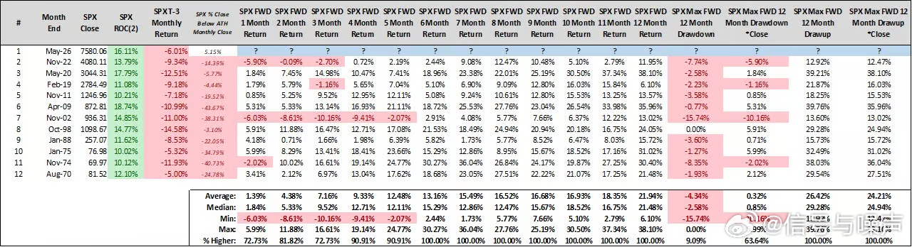

---

## 6

@江宇行舟

发表于：2026-05-30 01:56

来源：微博

链接：https://m.weibo.cn/status/5304212221332172

\#演员刘洵去世\# 每次只要被问到“有哪些演员演什么像什么”，高票入选的一定是刘洵老爷子。

每一个角色，都是千百万人难忘的回忆。

在我们特别呼唤好演员的时候，走了一个老戏骨……

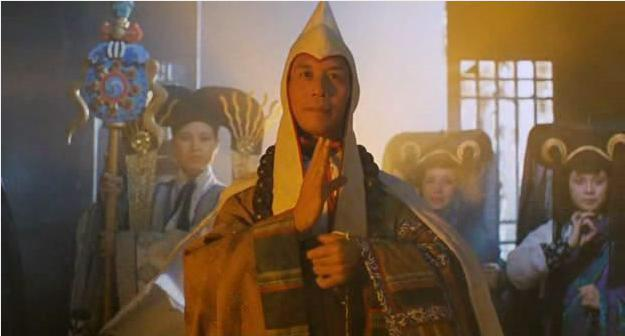

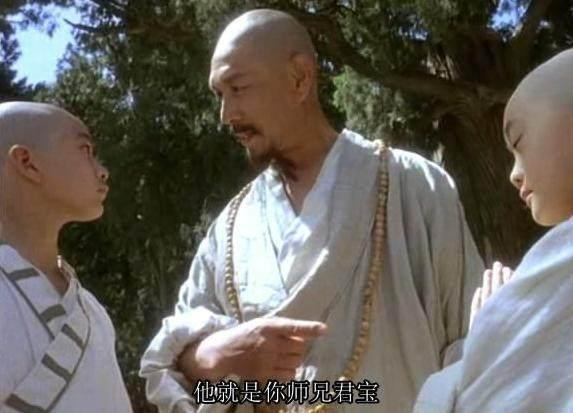

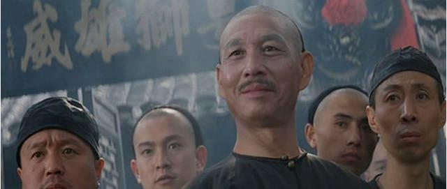

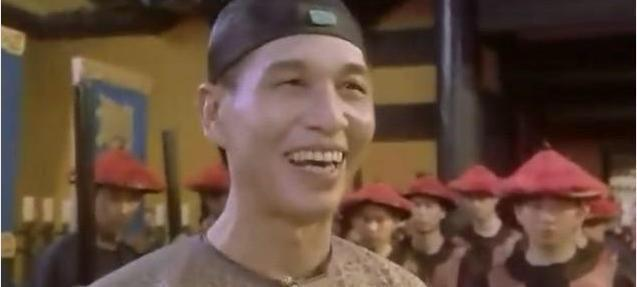

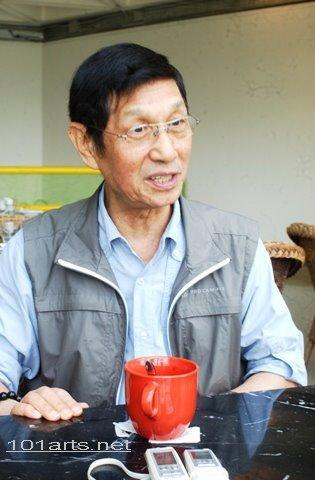

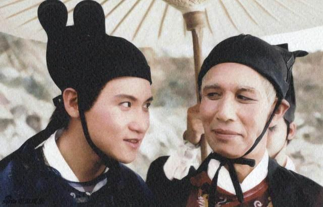

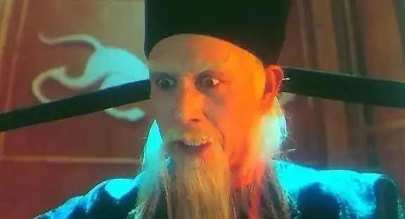

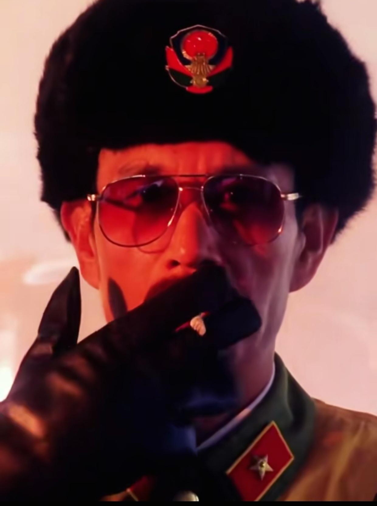

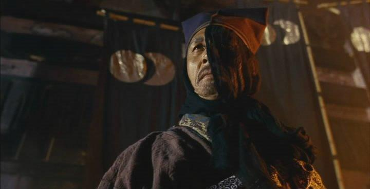

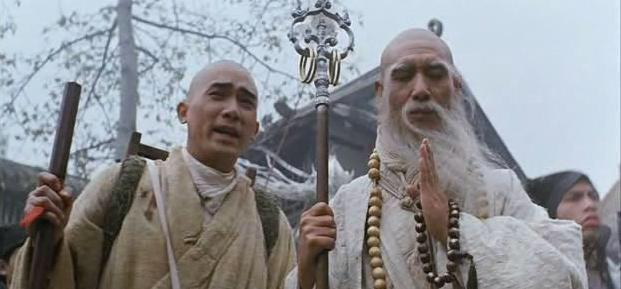

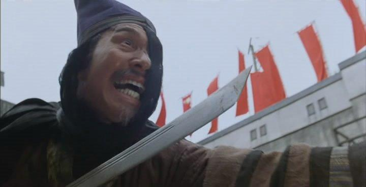

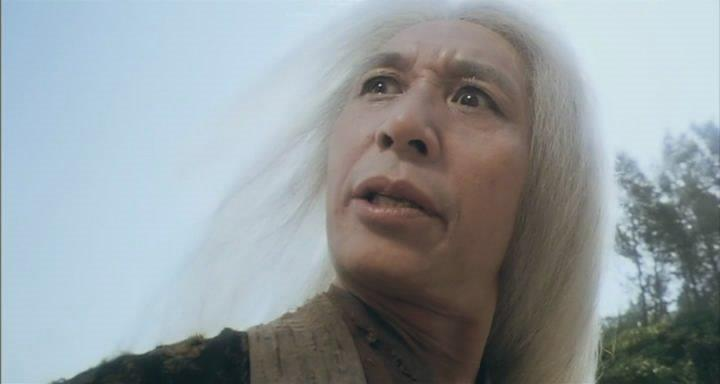

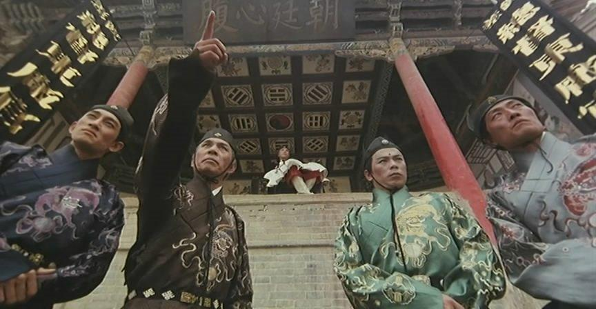

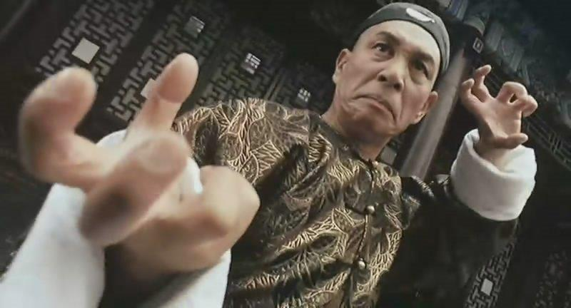

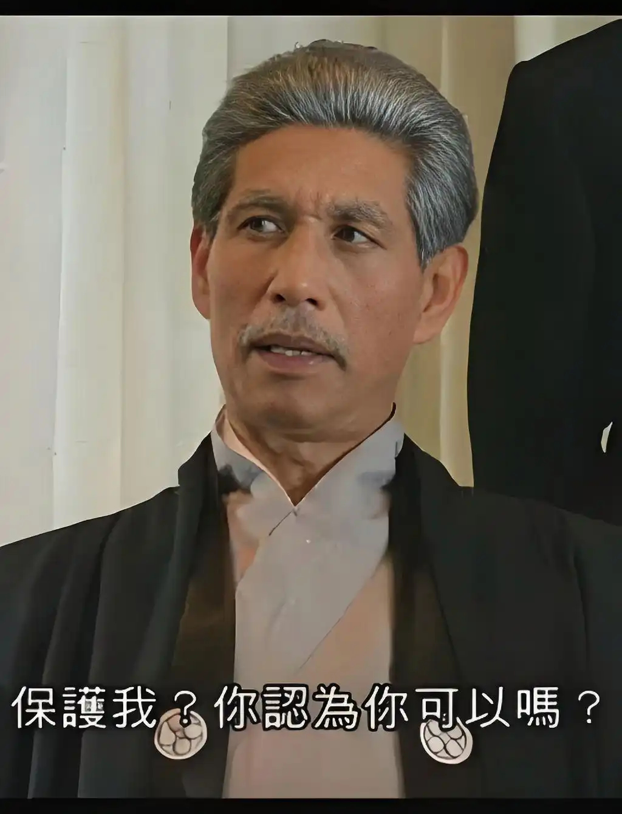

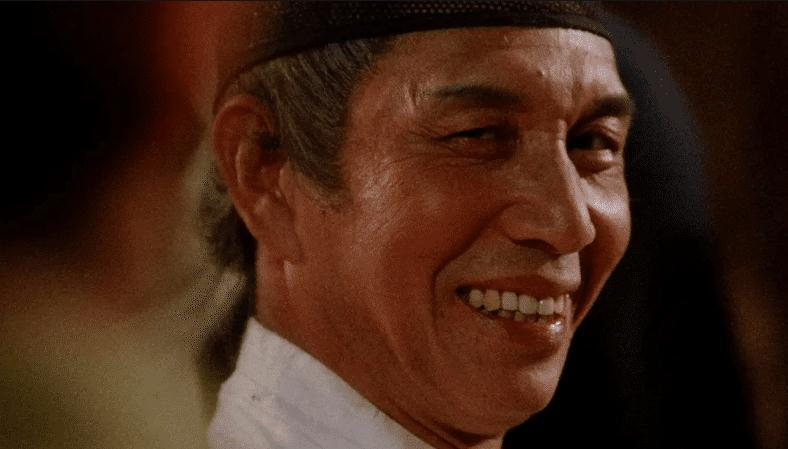

---

## 7

@ruanyf

发表于：2026-05-29 01:51

来源：微博

链接：https://m.weibo.cn/status/5303848484734820

上周，OpenClaw 创始人贴出了自己的 Token 使用量。（下图）

他一个月消耗的 Token 数量为6030亿。根据预设的费率，这些 Token 价值130万美元！

这并不是真实支出，只是一个估计值。因为他是 OpenAI 员工，可以无限量免费使用公司的 Token。

但是，可以用这个金额衡量，如果放开使用顶级模型，公司要支付的费用。一个人一个月130万美元，相当于近900万人民币，一年下来超过1亿人民币！

就算改用便宜的模型，国内的开源模型，价格大约是国外旗舰模型的1/30到1/50，那么一年也要200万～300万人民币。

我写了一点自己的想法。公司会发现，如果无限量使用，AI 编程比真人程序员昂贵多了。网页链接

