# 2026-06-03

## 1

@李楠或kkk

发表于：2026-06-02 10:22

来源：微博

链接：https://m.weibo.cn/status/5305426758599606

J20 当年研发的时候，一直被喷发动机这个核心能力不行。

但是真正的工程人员也都没闲着，气动，飞控，材料，涂料，雷达，导弹，电子战都在想办法。包括配套风洞，体系相关的雷达，预警机等等。

因为，没有强硬的核心技术突破，也可以在能改进的地方上系统工程。

用更高的维度，把整个体系的效率提升了，最终系统的结果也可以抗衡。

最终，涡扇15 搞定， J20 突然就变成了完全体。

先进制程产能，就是航空发动机。

tao 定律，其实就是系统工程。

这个比喻不严谨，但是有一定的道理。可以让你更容易理解在半导体领域内最核心的先进制程产能被严密封锁的环境下，真正的工程和技术人员，是怎么想办法，怎么做事情的。

这不是一个世家小姐怎么高嫁皇子最后老公继位的小仙女爽文。

这是一个凤凰男在各种压力委屈和限制条件下厚壁薄发，屡战屡败最终逆袭的现在进行时的故事。

能否逆袭，我也不知道。

但是如果我们不能拥有先进制程产能和半导体进一步提升效率的成熟的系统工程，那么我确定的是。。。

更强大的 AI 掌握在反人类的 Anthropic 这种公司手里，对每一个中国人，都不是什么好事情。。。

其实也很类似当 F22 全球部署，而我们只有 J8 的年代。

---

## 2

@新君乙58-

发表于：2026-05-31 05:54

来源：微博

链接：https://m.weibo.cn/status/5304634503857115

彭博预测2027年全球最赚钱的十大公司

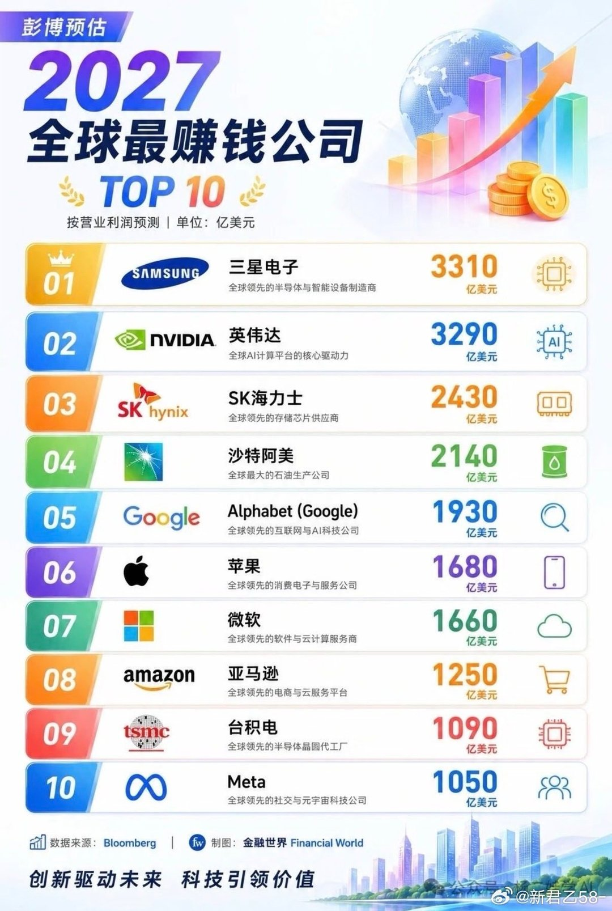

---

## 3

@物理芝士数学酱

发表于：2026-06-02 10:11

来源：微博

链接：https://m.weibo.cn/status/5305423771996234

那些青少年时期缺少魅力的人，在随后的28年里死亡风险大约是那些有魅力的人的两倍。

这种效应在女性中表现得更为明显。

网页链接

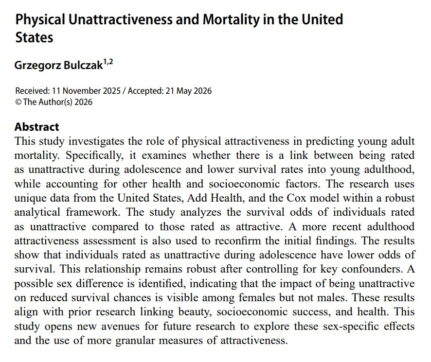

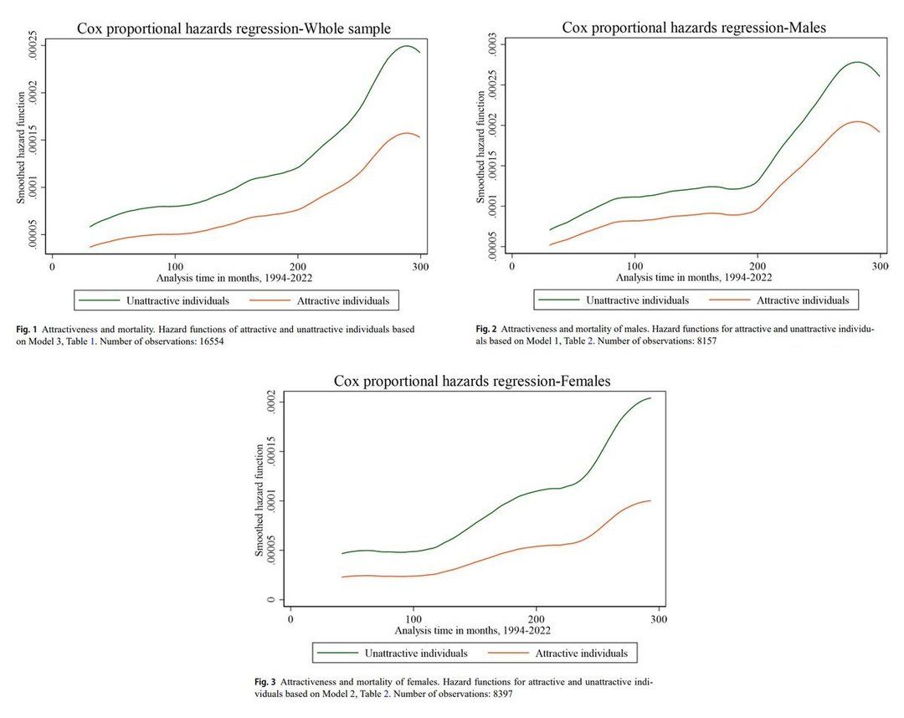

---

## 4

@阑夕

发表于：2026-06-02 10:14

来源：微博

链接：https://m.weibo.cn/status/5305424556852098

根据媒体报道，同在这个月，字节和腾讯的AI产品都会有大动作。

作为断崖式领先的模型应用，豆包在月底就会正式上线付费服务，而且还会开始打通豆包和抖音电商，据说会有补贴，鼓励用户使用豆包购物消费。

腾讯则会拿出压箱底的入口，在微信首页新增右滑进入AI智能体的界面，能够调用微信内所有小程序，并在后台执行任务，而且这个似乎和元宝无关。

两家公司都对新的战略调整寄予厚望，字节是在消费级场景积极搭建长期的商业模式，而基于微信10亿月活的规模，腾讯预备的算力成本堪称天价。

你们觉得这会是神仙打架还是菜鸡互啄？

---

## 5

@挨踢牛魔王

发表于：2026-06-02 05:30

来源：微博

链接：https://m.weibo.cn/status/5305353220653676

腾讯的ima知识库不错。

对于大部分人来说，在本地搞一个知识库，需要处理的东西还是挺多的。

比如向量模型、全文检索，RAG等等。

反正你要在本地搞，还是有一定门槛的。

腾讯这个ima知识库，把这些都帮你搞定了，还能连通很多知识源，比如公号之类的。

自从Copilot推出之后，再加上开放，就有很多人用起来了。

效果不错。

关键是，连api也提供了，你可以将这个知识库接到openclaw等智能体上。

当然也可以接到自己的网站上。

大家可以试试。

---

## 6

@莫非是托的微博

发表于：2026-06-02 03:31

来源：微博

链接：https://m.weibo.cn/status/5305323151690585

谷歌这次大规模的股权融资还是令市场很意外的，谷歌已经化身借钱狂人：

首先在2026年2月，谷歌直接在信贷市场筹集了约320亿美元的企业债，其中包括罕见的100年期债券，以支持其AI项目扩张。

其次是通过SPV方式向私募信贷市场借了360亿美元，用于购买谷歌定制的TPU芯片，随后再由Anthropic租赁使用。

这次再宣布计划进行总额高达800亿美元的大额股权融资（包括公开发行及伯克希尔·哈撒韦的私募配售），所得资金将主要用于人工智能基础设施的建设。

股权融资一般被认为谷歌极力避免的，因为谷歌本身有很好的信用，发行公司债利率很低，而股权融资会稀释股权，导致股价下跌。

但是过去一年谷歌1740亿美元的经营性现金流情况下，其总债务规模已经超过1000亿美元。再借就没钱再回购维持股价了。

而私募信贷市场也借不到钱了，因为监管审查趋严：今年开始，美国SEC对大型科技公司的“影子银行”行为高度警惕。利用私募信贷进行大规模的、不透明的表外融资，会被视为财务不透明或监管套利。

所以只剩股权融资这个下策，感觉连谷歌这种企业为了借钱也不择手段了。难道就为了当内存条的血包？

---

## 7

@物理芝士数学酱

发表于：2026-06-02 05:33

来源：微博

链接：https://m.weibo.cn/status/5305353904063897

Google的母公司Alphabet 正在出售股票以筹集 800 亿美元，用于继续投资人工智能。

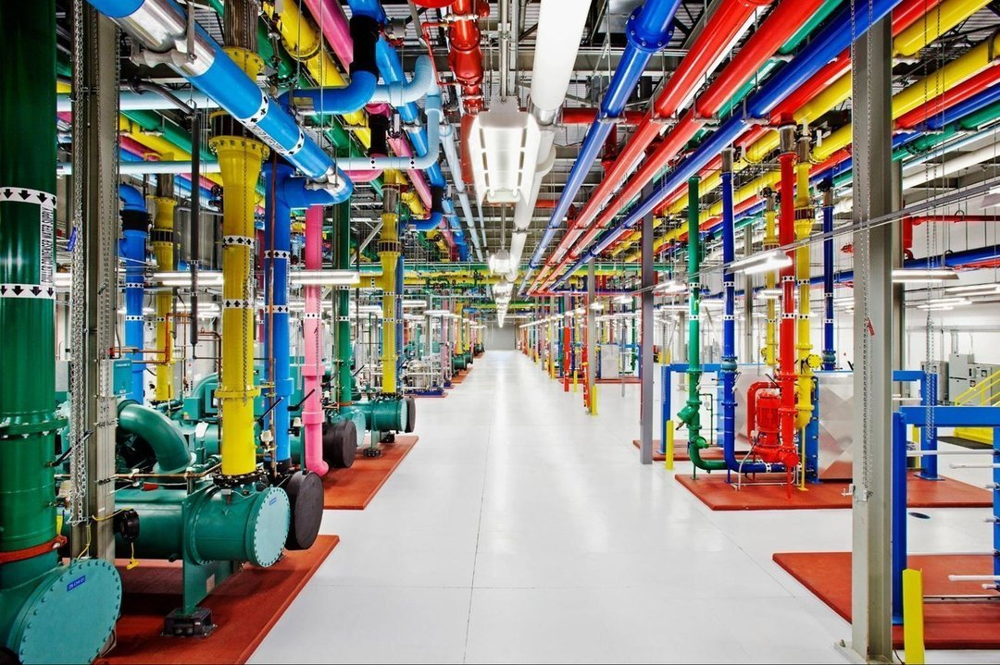

---

## 8

@姬永锋

发表于：2026-06-02 02:17

来源：微博

链接：https://m.weibo.cn/status/5305304621516581

天下苦黄仁勋久矣

摘自 一直在路上的Max 01Founder

2006年的那个冬天，黄仁勋做了一个华尔街认为极其愚蠢的决定。

他要求英伟达全线产品必须支持一种叫 CUDA 的技术。

为了这个毫无盈利希望的项目，这家卖显卡的公司每年的研发开支飙升到5亿美元，利润常年在地板上摩擦。

股东们在痛骂，媒体嘲笑他这是对一个不存在的市场的盲目投资。

老黄没有停。他骨子里是个赌徒。

后来的故事，大家都知道了。

今天硅谷的巨头们为了抢夺英伟达的显卡，几乎要把头挤破。

马斯克把十万张卡塞进得州的机房，然后转手以12.5亿美元一个月的价格租给了Anthropic。

扎克伯格甚至会在Meta的财报里炫耀自己囤了三十万张 H100。

大模型行业诞生了一条极其粗暴的铁律：Scaling Law（规模法则）。

模型越大越好，算力越多越好。

英伟达吃掉了行业里绝大部分的利润，云厂商买下昂贵的显卡，再把算力切碎，按 Token 向创业者和普通用户收租。

每一次 AI 的思考，都在燃烧英伟达的算力，都在向硅谷的铁王座上贡。

天下苦黄仁勋久矣。

历史的剧本写到这里，通常是一个死局。

但有些人决定要反抗。

算力

反抗的第一枪，只能打在最硬的硅片上。

昨天，很多人都在转发华为那篇关于芯片的论文。

最近的国产芯片也取得非常多的突破，至少股市是这样的。

但如果去问真正跑在大模型前线的开发者，他们会告诉你一个残酷的真相：老黄脚下，还有一条深不见底的护城河。

这条河叫 CUDA。

英伟达花了15年，让全世界几百万程序员在这个生态里试错、填坑，砸出了一条极其丝滑的高速公路。

平心而论，华为的昇腾亦或是其他的国产显卡依然很难用。

算力参数上去了，但因为缺乏软件生态，模型跑在上面动不动就断点、崩溃。

很多拿着热钱的大厂，捏着鼻子转身又去特殊渠道上高价买英伟达了。

但硬骨头总得有人啃。

在这场算力大逃亡里，有极少数几家中国公司，选择了最难走的那条泥泞小路。

比如名震硅谷的 DeepSeek。

为了死磕国产算力，把模型硬生生跑通在华为等国产卡上，他们不惜抽调了最核心的工程团队，去一行一行地重新手写底层算子。

这种在泥泞里打滚的代价，

是整个模型发布节奏的严重延迟。

这是一个令人敬佩的孤勇者故事。

但这也暴露了一个残酷的现实：

如果中国大模型只能靠顶尖工程师拿命、拿时间去填英伟达 15 年的生态坑，那我们什么时候才能真正翻盘？

也许有别的路子。

比如面壁智能在走的。

可能有一些朋友还没怎么听过这个名字。

他们的核心班底来自清华大学自然语言处理实验室（THUNLP），带头的是刘知远教授和知乎前 CTO 李大海。

在大模型这个充斥着热钱行业里，面壁一直算是个特立独行的异类。

过去这两年，当所有人都在疯抢算力、卷千亿级云端巨兽的时候，他们一直在开源社区里死磕一系列名叫 MiniCPM 的小钢炮模型。

他们主打一个极致的以小博大，硬生生用几十亿的微小参数，去越级单挑别人几千上万亿参数的庞然大物。

最重要的是确实能追平那些庞然大物的性能。

面对同样让人绝望的国产算力生态鸿沟，这帮清华极客给出的解法，依然极其清奇。

面壁给出的解法是：

让 AI 去干。

比如他们刚发出来的那个叫 ForgeTrain 的训练框架。背后是一套名叫 Forge Engineering 的新规矩。

这是一个完全由 AI 编写的生产级大模型训练框架。

打开它的Github代码仓库，你会看到一个极其嚣张的标签：Zero human edits（零人类干预）。

在这个框架里，人类彻底退到了幕后喝茶。

AI自己充当包工头，自己去查阅芯片文档，自己搭框架，自己看报错日志，自己打补丁修 BUG。

甚至连大模型计算里最吃硬件性能的底层算子（FlashAttention），都是 AI 从零手搓出来的。

它们不知疲倦地钻进华为昇腾的生态里，把那些让人类工程师掉光头发的深坑，连夜填平。

结果是极其凶残的。

这个由 AI 针对特定模型“现写”的定制框架，不仅点亮了国产算力，甚至在老黄自己家的 H100 显卡上，砸了老黄的场子。

实测数据里，ForgeTrain 的算力利用率（MFU）飙到了 44.13%。

作为对比，英伟达花重金养着全世界最聪明的一群工程师，日夜打磨出的原厂 Megatron 框架，这个数字也才在 40% 左右波动。

这个由 AI 写的框架，硬生生比英伟达原厂快了 10%，而且炼出来的模型效果完全一样。

在这个烧钱的行当里，快 10%，就意味着能省下几千万的真金白银。

更有意思的是，在这个项目的开源首页，面壁留了一招极具黑色幽默的部署指南——“Agent 友好（对AI友好）”。

它的意思是：

人类，你连运行命令都不用自己敲了。

直接把提示词发给你的 AI 助手，让 AI 去帮你跑这个由 AI 写出来的框架。

用魔法打败魔法，用 AI 制造 AI。

模型

后端的算力护城河正在被瓦解，但这还不够。

如果你翻翻几家科技巨头的财报，你就会发现一个极其荒诞的现象。

无数的高管和产品经理天天掉头发，思考怎么让用户多对话、多生图，怎么多卖 API、多卖会员。

为了抢地盘，大厂之间甚至打起了残酷的、近乎白给的 API 价格战。

但背后大部分利润都付给了英伟达或者云厂商。

说白了，整个AI行业都在给黄仁勋一个人打工。

黄仁勋和云厂商们的最终幻想，是把所有的高级智能都锁在云端数据中心里，让你永远交网费、交 Token 费。

只要模型还在云端一天，推理的计费表就永远在转。

哪怕这个行业的 API 价格战打得再凶，只要英伟达的显卡还要通电，边际成本就永远降不到零。

天下苦黄仁勋久矣。但怎么反抗？

要彻底终结这种垄断，就必须把战场转移。

转移到黄仁勋的显卡永远触达不到的地方——端侧模型。

所谓端侧模型，其实就是在你自己的设备里运行模型。

把那个绝顶聪明的大脑，直接摁进你口袋里的手机、桌上的旧笔记本，甚至手腕上的一块智能手表里。

这会带来两个好处：

第一是成本。

一旦模型在本地跑起来，云端的 Token 计费器就彻底哑火了。

你不需要再为每一次提问心惊肉跳地算钱，你让它去读几十万字的研报、帮你写一整夜的代码，边际成本统统是零。

没有中间商赚算力差价，更不需要向任何二道贩子交过路费。

第二是隐私。

巨头们再也无法通过云端偷窥你的数据，公司的机密财务表、个人的私密日记，都被死死锁在了物理隔绝的设备里。

即便你坐在毫无网络信号的高铁钻山洞，它依然能为你全速运转。

但这条路，太难走了。

其实在过去两年，行业里也曾涌现过一大批喊着要做端侧、要把大模型装进手机的团队。

但资本是极其现实的。

当大家在泥潭里滚了一圈后发现，做端侧不仅要跟物理硬件的极限死磕，而且利润薄得像刀片。

更要命的是，它完全破坏了那种躺在云端按 API 收租的完美商业模式。

于是，人群很快就散了。

大家一窝蜂地调转车头，回去继续卷千亿万亿参数的云端巨兽。

潮水褪去后，这个赛道显得无比空旷和寂寥。

放眼全球，如今还愿意在这个边缘战场上逆行的人，寥寥无几。

比如美国巨头谷歌的Gemma团队、微软的Phi团队、阿里的Qwen团队等等。

有趣的是，就连卖铲子的英伟达，他们自己的研究院也发过一篇论文，直言不讳地说‘小语言模型才是未来’。

巨头们虽然下了场，但端侧对他们来说，更像是为了补全模型版图的防御性任务。

毕竟，让他们彻底砸碎自己躺着赚钱的云端收租盘，太难了。

但与这些巨头的防御性任务不同。

面壁从一开始就坚定选择了端侧。

他们信奉的是另一个定律——密度定律（Densing Law）。

他们认为，每过100天，模型的智能密度就会翻一倍。

这意味着，同样的聪明程度，我们应该能把它塞进越来越小的载体里。

这个定律也在后来几年里得到了验证。

2024年第一代MiniCPM追平了GPT-3的效果，25年的MiniCPM-3就追上了GPT-4o的效果。

而他们刚刚掏出的这张极度反直觉的牌，一个极其迷你、甚至显得有些“寒酸”的模型：MiniCPM5-1B。

1B，仅仅十亿的参数量。

在新模型动辄堆出几千亿甚至上万亿参数的今天，这个数字简直是个连塞牙缝都不够的玩具。

这个模型，小到不需要云端算力，小到可以完全断网运行在你的旧电脑、轻薄本、智能手机，甚至是一块老掉牙的树莓派上。更致命的一刀是：

它甚至连一张英伟达的消费显卡都不需要，普通的 CPU 或者苹果的 M 系列芯片就能让它流畅运转。

这就相当于，在老黄密不透风的算力铁幕里，它直接给你挖出了一条不需要过路费的地道。

官方给它找了一个非常有意思的场景：

桌宠。

很多人对桌宠的记忆，还停留在二十年前只会吃饭睡觉的 QQ 宠物、电子鸡，或者是那个偶尔在屏幕上翻跟头、打呼噜的瑞星小狮子。

但今天，如果你把这个 1B 的模型在本地跑起来，给那个赛博躯壳注入灵魂，它就会瞬间变成一个智商极高的私人助理。

巨头们总觉得小模型干不了重活。

但这个 1B 的玩意儿，在最考验智商的复杂推理和代码生成上，直接打穿了世界同尺寸模型的开源最高纪录。

它能看懂厚达百页的复杂文档，能帮你梳理一团乱麻的思绪，甚至还能和 Cursor、Claude Code 这些最前沿的 AI 工具无缝协同。

这根本不是什么人畜无害的宠物，而是一个不需要发工资、静静趴在你桌面上干重活的“代码特种兵”。

最重要的是，当你把它下载到本地的那一刻，你就彻底买断了它的全部生命。

你不需要再为它的每一次思考，向云端交一分钱的 Token 过路费；

你不用担心把公司的机密财务报表传给大厂会被偷窥，因为一切都被死死锁在物理隔绝的设备里；

你甚至在毫无网络信号的地下车库、钻山洞的高铁上，依然能让它全速运转。

这从来都不是一句轻飘飘的把模型装进手机里，而是从根子上，砸碎了英伟达和云厂商们费尽心机搭建的“收租”商业模式。

试想一下，如果未来 80% 的日常任务，都不需要再去云端调用算力，而是被这些零边际成本的“桌宠”在端侧悄无声息地解决掉……

那支撑英伟达三万亿美元估值的云端基石，还会那么稳固吗？

明天

昨天，很多人都在为华为的一篇论文激动。

大家似乎看到了掀翻英伟达帝国的曙光。

但今天老黄依然穿着他那件标志性的黑皮衣，他依然是硅谷的唯一神明。

很多人问，中国的大模型什么时候能真正超越美国？

答案或许根本不在于谁能买到更多的显卡，或者谁能用更多的钱堆出一个更大的参数怪物。

真正的超越，往往发生在游戏规则被颠覆的那一刻。

大模型的上半场，是人肉写代码的手工作坊，是买卡囤卡的冷兵器时代。

大家比的是谁的钱包厚，谁能从那个穿皮衣的男人手里买到更多的硅片。

但下半场，规矩变了。

在这场天下苦老黄久矣的突围战中，华为在最底层的硅片上凿冰，DeepSeek 在算法的极限上压榨算力。

而面壁智能在看不到的地下，用 AI 制造 AI，在努力填平中美算力生态的鸿沟，让华为昇腾这样的国产芯片真正长出灵魂。

而在你能摸到的桌面上，他们把极致的智能压缩成一个 1B 大小的模型，试图把大模型的边际成本彻底打到零，把被巨头垄断的算力，还给了每一个普通人。

这才是真正走在 AGI 前沿的中国大模型公司该有的样子。

不盲从巨头的暴力美学，不在旧规则里内卷，而是直接掀翻牌桌。

很多年后，当我们回头看当下发生的这些事，可能会发现这是一个静水流深的分水岭。

现在的硅谷依然热闹，纳斯达克的数字依然在跳动，老黄的饭局上依然坐满了求购芯片的大佬。

那个穿着皮衣的男人依然站在顶端，受万人膜拜。

巨头们也依然在为了云端的算力焦虑地厮杀。

但在他们看不见的地方，旧秩序的基石，已经被悄然抽走了几块。

在那条极其拥挤、昂贵、还随时可能被封锁的英伟达高速公路旁边，有一群中国造反者不再按喇叭催促了。

他们转过身，开始自己修路。

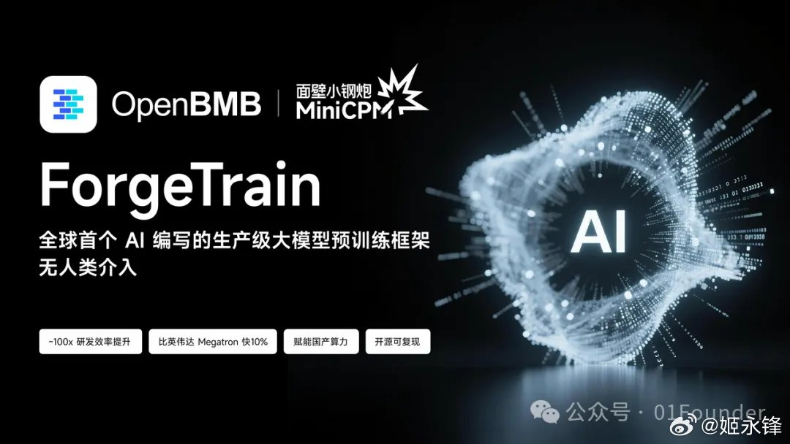

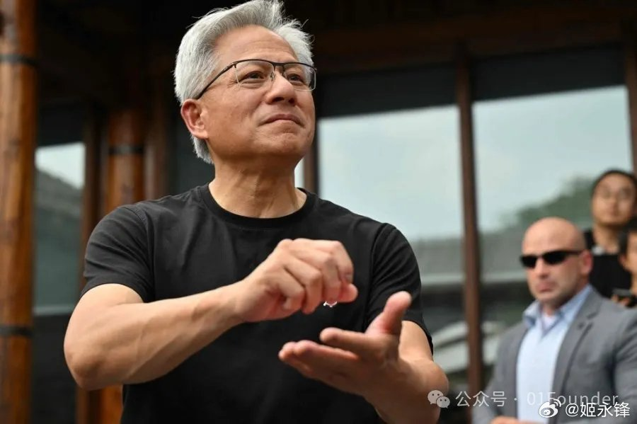

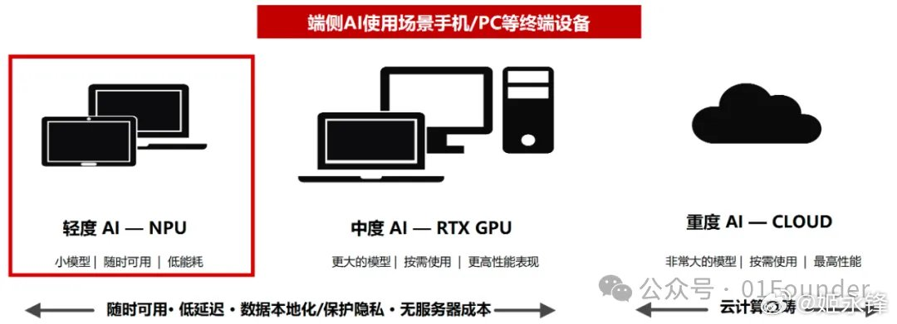

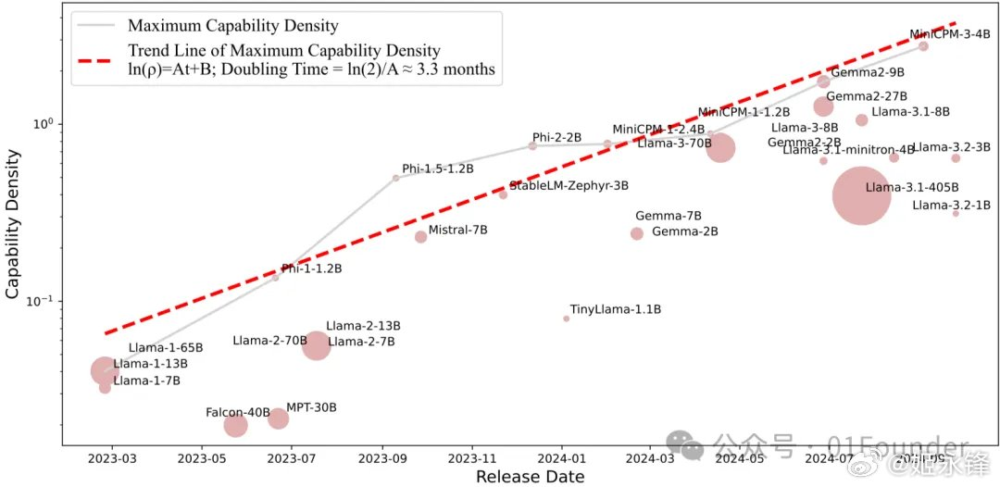

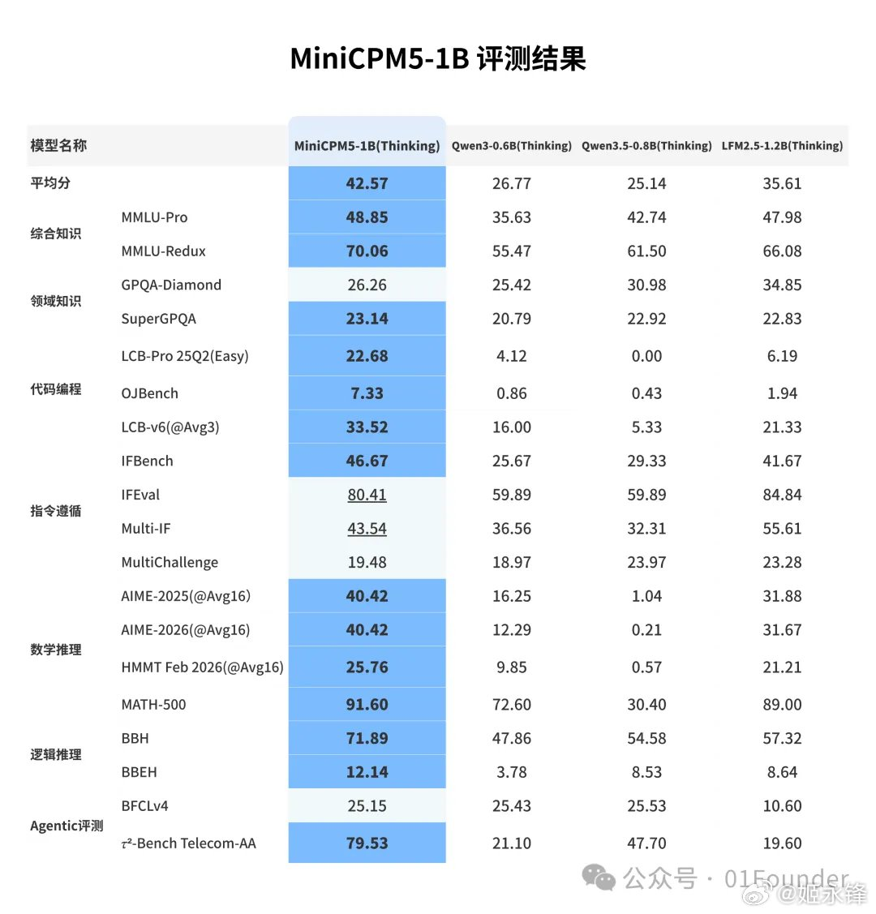

---

## 9

@信号与噪声

发表于：2026-06-02 11:53

来源：微博

链接：https://m.weibo.cn/status/5305449499853420

美光市值从5000亿美元攀升至1万亿美元，仅耗时48天，是有史以来最快达到1万亿美元市值的，远超英伟达创下的490天纪录。

1年前还是500亿美元

所以，没在车上的就不要焦虑了，这等标的，我等踏空也是常态！

想想李录大师，在2019年就开始建仓美光了，那会儿股价跌倒了 40 美元历史低位；

然后他在 2023 年 Q2 就以均价 65 美元清仓了；

相当于错失13倍收益、70亿美金，也就是500+亿人民币！

心里是不是舒服了些许？

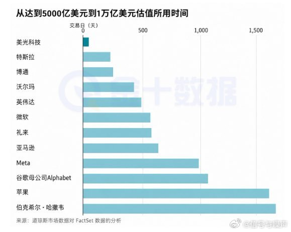

---

## 10

@AI产品阿颖

发表于：2026-06-02 11:53

来源：微博

链接：https://m.weibo.cn/status/5305449578504147

分享下最近 AI Coding 的顿悟时刻。

写一些最近我们公司 AI Coding 的真实感触。我能明显感觉到，我们现在确实在一个十字路口。

软件研发正在从手工艺模式走向工厂模式。

手工艺模式下，工程师亲自写代码、亲自 review、亲自测试，像手工造一辆车，灵活但是慢，质量也不稳定，大部分知识都散落在每个人的脑子里。

工厂模式则像现代车厂，有一条标准化的生产线。

从写代码到 review、测试、部署、监控，大量步骤交给 AI 和 Agent 来跑，人退到后面，负责设计这条生产线、设定规则、处理例外。

这已经是大势所趋了。Software Factory 接下来半年内，一定会成为所有软件公司的标配。

所以，要把工程生命周期当成工厂来看。做汽车有装车门、装方向盘、喷漆这些独立工序，软件工程也可以拆成小的、可组合的环节。

比如分支命名、API 的 service-repository pattern、analytics 埋点、测试、QA，都可以沉淀成 skill。

这里的 skill 不是随便拿别人写好的模板来用，因为不同公司有自己的工程口味和产品手感。

真正重要的是，把自己团队长期形成的模式和护栏，固化进 Agent 能执行的流程里。

我们团队的流程是：

先写 spec，然后让 Agent 反向采访人，把需求问清楚。接着由 Agent 生成 LDD，也就是 Lightweight Design Document。

这个 LDD 会参考公司过去的设计文档，尽量保持同一种工程风格；然后系统自动生成 tickets，再生成 PR。网页链接

---

## 11

@信号与噪声001

发表于：2026-06-02 11:45

来源：微博

链接：https://m.weibo.cn/status/5305447602981829

巴菲特2026年Q1持仓。

重点买入：

$GOOGL — 大幅加仓204% 

$NYT 纽约时报 — 加仓199% 

$DAL 达美航空 — 新建仓 

$LEN Lennar — 加仓43%

重点清仓： 

$V Visa — 全清 

$MA Mastercard — 全清 

$UNH 联合健康 — 全清 

$STZ 星座品牌 — 减持95%，几乎清仓

两个信号值得关注：

Visa和Mastercard一直是巴菲特的长期核心持仓，这次同时全清，有人认为他在规避AI对传统支付行业的冲击。

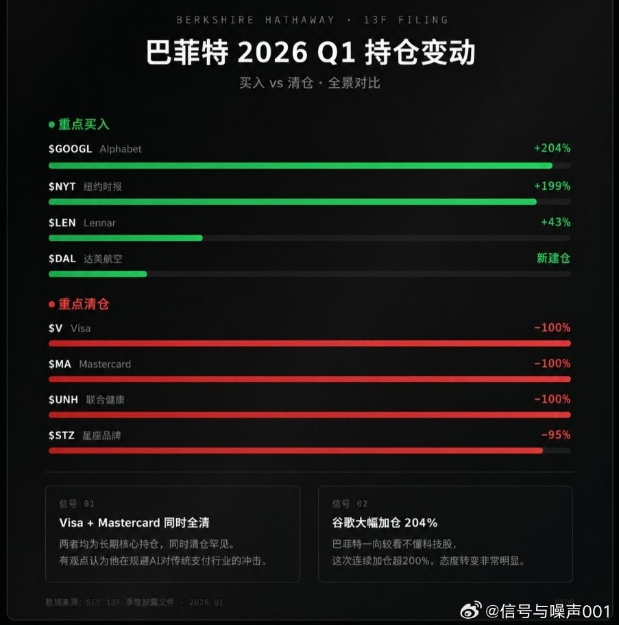

---

## 12

@风云学会陈经

发表于：2026-06-02 11:34

来源：微博

链接：https://m.weibo.cn/status/5305444753213226

关于麦肯锡中国制造业产出接近全球50%，超过美国最鼎盛时期，创历史纪录

我专门写过制造业份额评估的文章。制造业评估的数值有几种，按产值算就是制造业总产出，中国2024年份额是31.6%。按增加值算，中国2023年份额是28.8%。这两个数值都和50%差距很大，麦肯锡报告里的接近50%不是这两个，都超过二战后美国份额最高的时候了。

一种解释是，看产出数量，如钢铁水泥产出10亿吨、24亿吨都超过全球一半。这也是我粗略评估的，因为中国制造业产出定价低，按数量计占比会高于按产值或者按增加值算的。

不过应该不是这个口径，因为有很多不同行业，没法用数量对比。原图说的是manufacturing output。这应该是折算成金额才有份额计算。

一种解释是，麦肯锡把中国资本在海外控制的产能也加进来了。如果这么算，也不够。海外产能有限，远远不如中国本土的巨大产能，加上来也到不了50%。

还有种解释，如果按PPP购买力平价估算，中国制造业产出占比会提高。但由于中国给出了不低的物价，PPP调整没有增加中国制造业产出占比太多。例如，以购买力平价（PPP）衡量实际值，中国制造业占全球份额在“十三五”期间是28.3%，2021-24上行到31.2%。别的发展中国家PPP产出上调得更多，中国产出占比未必能调高多少。

个人猜测，麦肯锡可能对中国用了特殊的PPP调整因子，用更接近真相的物价（而不是中国有意给高的物价），这确实会大幅提升中国产出占比，搞到50%没问题。

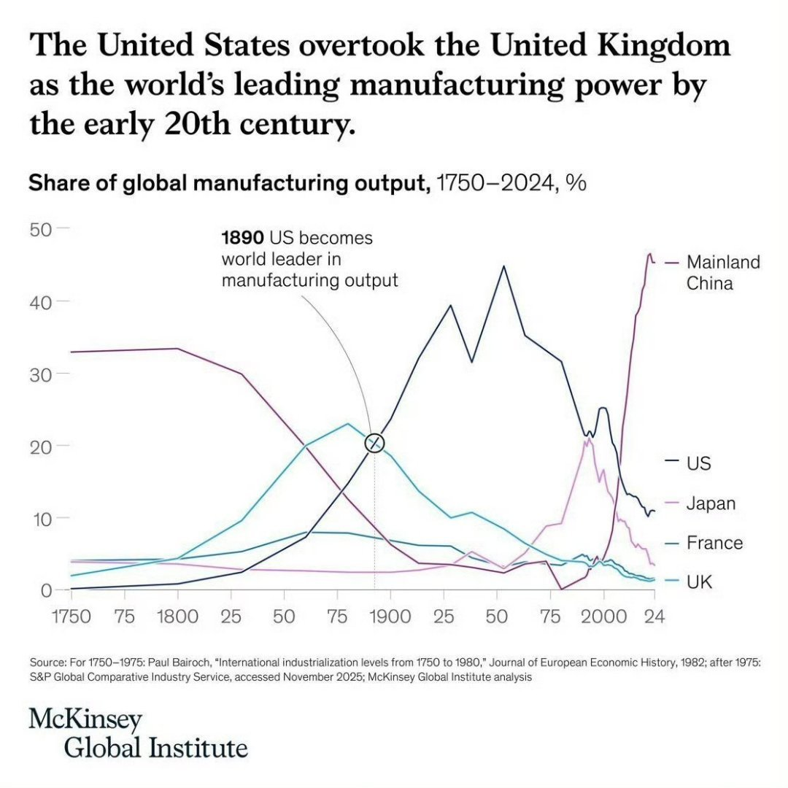

