# 2026-06-04

## 1

@信号与噪声

发表于：2026-06-03 12:31

来源：微博

链接：https://m.weibo.cn/status/5305821479047176

这张图有无数解读的角度，但让人震撼的依然是英伟达以5.5万亿美元的市值，排名仅次于美国、中国、日本这三个国家的股市。

更让人震撼的是，美国除了5.5万亿的英伟达外，还有4.6万亿的苹果，4.4万亿的谷歌...

接下来马上还有身价过万亿美元的世界首富马斯克，所谓的 A14 ...

而1975年，全世界股市加起来也只有1万亿美元。

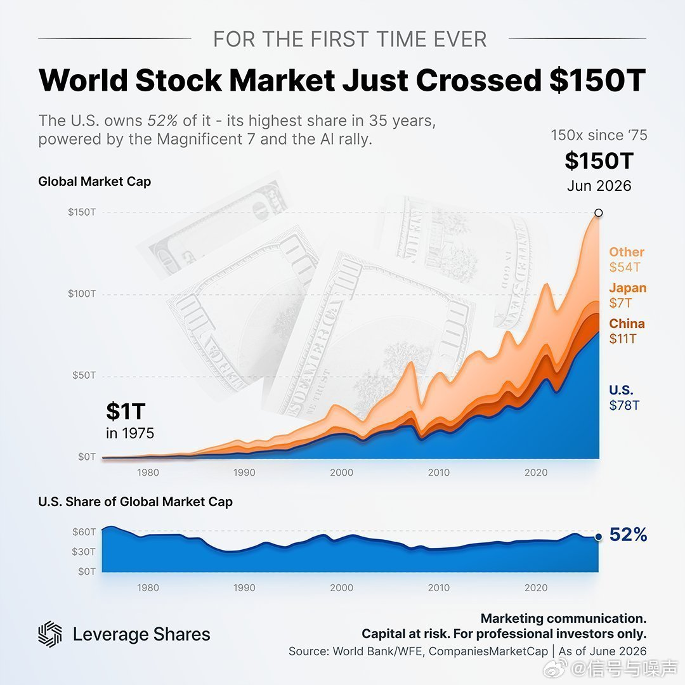

---

## 2

@i陆三金

发表于：2026-06-02 22:13

来源：微博

链接：https://m.weibo.cn/status/5305605489427993

OpenAI 新报告：The Next Era of Knowledge Work，知识工作的的新纪元

Codex 目前拥有超过 500 万周活跃用户，较今年二月桌面应用发布时增长超过 6 倍。尽管开发者仍是最大的用户群体，但知识工作者目前已占用户总数的约 20%，且其增长速度达到开发者的三倍以上。

知识工作者的任务组合，每周，72% 的这类用户会产出成果：报告、备忘录、合同等文本文件；图片、音频、视频等多媒体资产；以及越来越多的 PDF 和电子表格。接下来的类别并不那么直观：工程运维占 47%，代码实现占 46%，研究占 41%。

在知识工作者中，增长最快的任务类型是数据分析、研究和知识成果。

在知识成果中，用户最常处理文本文件，例如 Google Docs、Word 文档、报告、备忘录和合同，也常处理图片、音频和视频等多媒体资产。使用 PDF 和电子表格的用户增长超过 50%。

链接：cdn.openai.com/pdf/the-next-era-of-knowledge-work.pdf

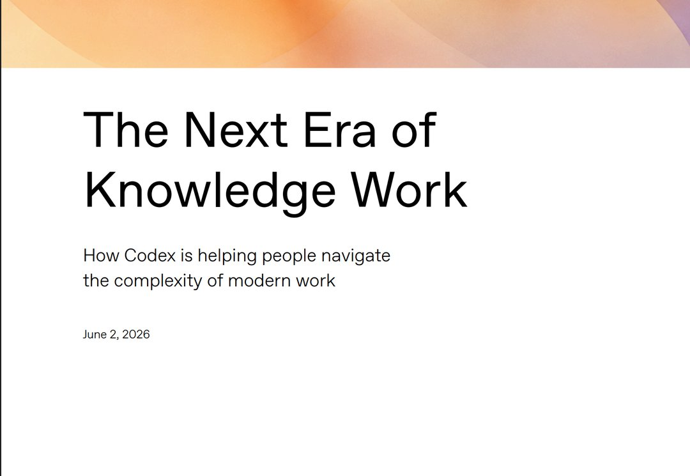

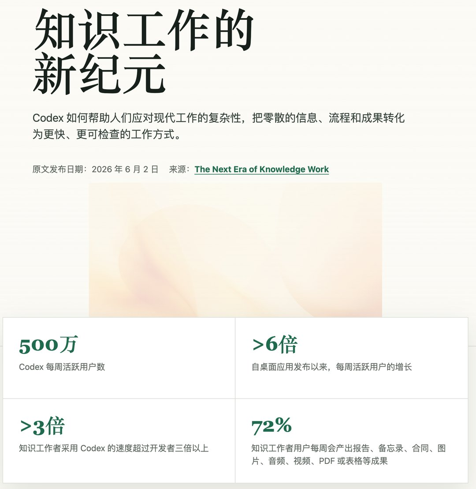

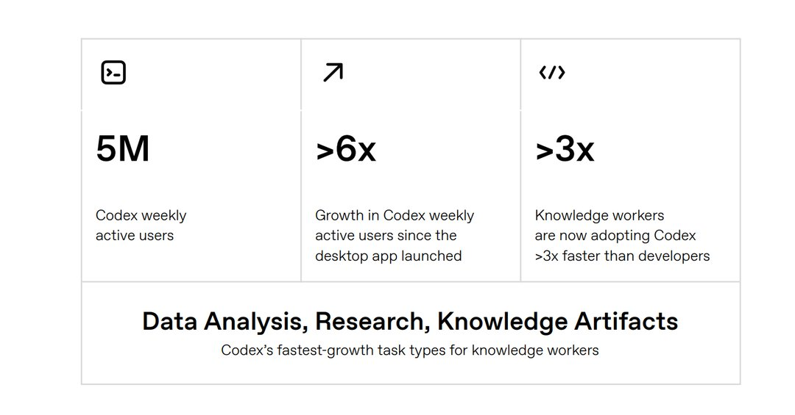

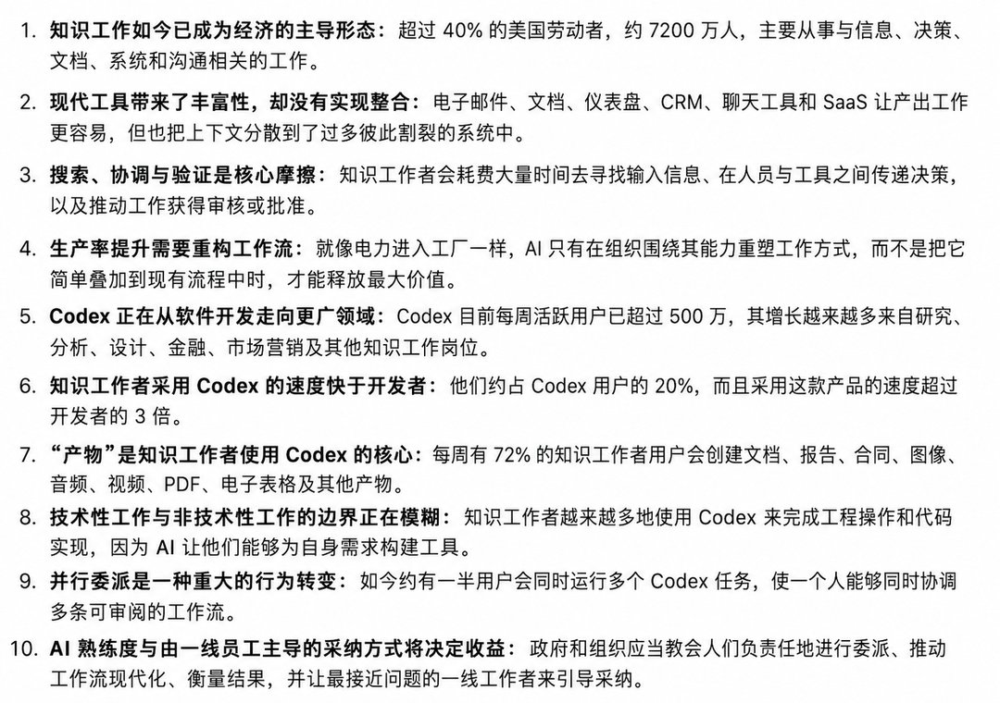

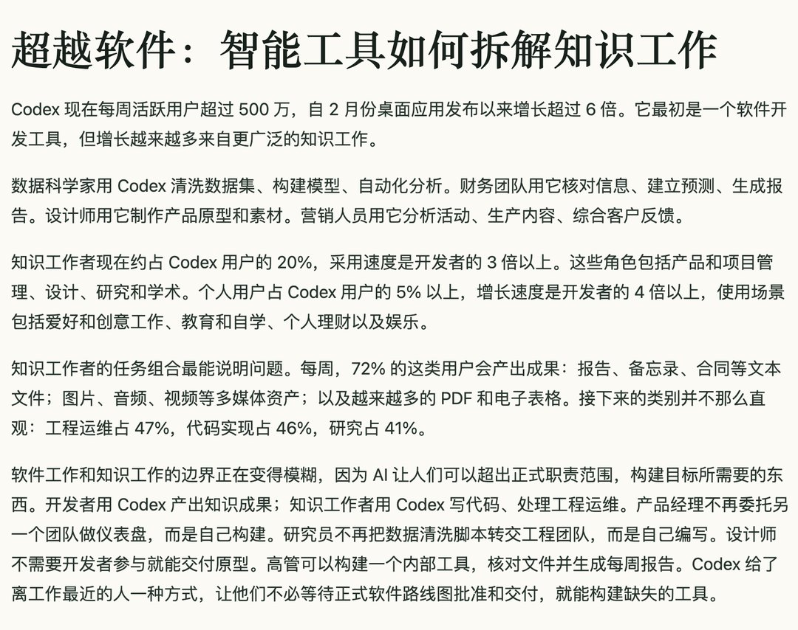

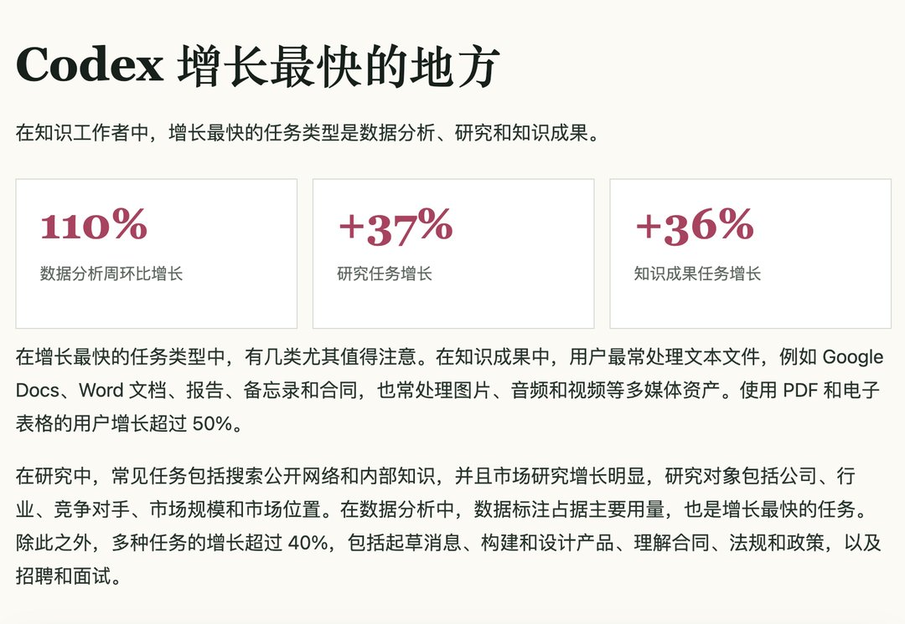

---

## 3

@高飞

发表于：2026-06-03 07:29

来源：微博

链接：https://m.weibo.cn/status/5305745525442013

\#光纤光缆订单排至2027年\# \#模型时代\# Marvell CEO：未来的数据中心可能是“无距离”的，一个Scale-up域1000颗GPU

和黄仁勋的演讲比起来，Marvell董事长兼CEO Matt Murphy的演讲可能相对不被关注，不过讲完之后，股价涨势是非常惊人的。所以，写一个CEO的Computex演讲笔记，也包括黄仁勋和ASE日月光半导体CEO吴田玉作为嘉宾先后上台对话的内容。

简单介绍一下，Marvell不做处理器，不做存储，专做数据中心里负责搬运数据的芯片：光模块里的信号处理器、机架之间的以太网交换芯片、嵌入各种处理器的高速串行接口、以及为云巨头量身定做的ASIC定制芯片。一句话：NVIDIA管算，美光三星管存，Marvell管连。

过去十年，这家公司通过一系列收购和业务剥离，把自己从一家消费电子芯片公司改造成了专注"连接"的数据基础设施芯片公司，营收从2016年的23亿美元增长到当前财年预期的约115亿美元。就在演讲前一周（2026年5月27日），Marvell刚发布了FY2027 Q1财报，季度营收24.18亿美元创纪录，并将全年指引上调至约115亿美元（同比增长约40%），FY2028指引更进一步到165亿美元。黄仁勋当天在台上两次称Marvell为"the next trillion dollar company"。

对AI投资感兴趣的同学，会更值得一读。

一、十年转型：从WiFi芭比梦想屋到数据基础设施纯粹玩家

1、2016年的Marvell和Murphy的判断

Murphy在加入Marvell之前，在模拟芯片公司Maxim Integrated待了22年。模拟芯片的产品覆盖几乎所有电子终端，这给了他一个观察行业趋势的全景视角。2016年接任Marvell CEO时，他做了一个判断：下一轮半导体增长的主引擎是数据平台公司（Google、Amazon、Microsoft、Meta等），核心需求是大规模移动数据、存储数据、处理数据、保护数据。

他把这个方向定义为"数据基础设施"——当时这个词甚至不是一个被市场承认的品类，是Marvell自己造的。

问题是，当时Marvell的产品组合跟这个方向几乎不沾边。数据中心业务只占营收的不到10%，消费电子占了60%以上。Murphy回忆说，他到任第一周，团队给他汇报拿下的最大客户订单，行业叫design win，居然是"全球第一款WiFi联网芭比梦想屋"。

2、十年并购路线图：总投入约360亿美元

Murphy决定把Marvell的未来全部押在数据基础设施上。思路分两步：能自建的自建，不能自建的就收购。同等重要的是决定"不做什么"，持续剥离不符合战略方向的业务。

从2018年到2026年初，Marvell完成了一系列精准并购：2018年收购Cavium强化计算和网络能力；2019年剥离Wi-Fi业务，同年收购Avera建立定制芯片业务、收购Aquantia补强连接产品线；2021年以100亿美元收购Inphi获得数据中心连接技术，同年收购Innovium获得高端数据中心交换能力。过去12个月，Marvell又启动新一轮动作：剥离汽车以太网业务，完成对Celestial AI（光子互连技术，2026年2月完成）和XConn Technologies（Scale-up交换，2026年2月完成）的收购。

总账算下来：收购投入约225亿美元，有机研发投入约180亿美元，剥离资产回收约45亿美元，净投入约360亿美元。

3、一个罕见的技术赌注：跳过7nm

Marvell在制程节点上做了一个行业中极少见的决策：直接跳过7nm，从14/16nm一步跨到5nm。Murphy说"没人这么干"，风险极大，但结果证明执行完美。2020年初，Marvell推出了首个基于先进节点的完整IP平台，包括芯粒之间的die-to-die通信接口、芯片内部的高速缓存SRAM，以及高速SerDes接口。SerDes全称Serializer/Deserializer，就是把芯片内部的并行数据压成高速串行信号发出去、在对面再展开，是所有芯片间高速通信的底层零件。这个SerDes团队如今有1500人规模，整合了Marvell自身以及从Avera、Aquantia、Inphi等收购来的工程人才。

4、结果：营收结构彻底翻转

2016年Marvell是一家23亿美元的公司。转型头五年翻了一倍到45亿美元。FY2026（截至2026年1月）年营收达到81.95亿美元，同比增长42%。数据中心业务从十年前不到10%的营收占比，上升到最近一个季度的76%。

二、AI基础设施瓶颈的三次迁移

1、第一次瓶颈：算力

行业首先遇到的是计算能力不足的问题。NVIDIA率先解决了这个瓶颈，也因此在2026年4月成为全球首家突破5万亿美元市值的公司。

2、第二次瓶颈：存储

更大的模型需要更大的存储容量和更高的带宽。HBM高带宽存储器成为关键资源，它把存储颗粒垂直堆叠后紧贴GPU封装，提供远超传统内存的带宽。到2026年5月底，Samsung、SK Hynix和Micron三家存储芯片公司在同一个月内先后突破万亿美元市值——同一行业三家公司在30天内相继达到这个门槛，存储的战略地位由此确认。

3、第三次瓶颈：连接

Murphy的核心论点是：单个处理器无论多快、存储多大，都不够用。现代AI需要数万乃至数百万个处理器协同工作，构成一台超大规模计算引擎。黄仁勋在对话中补充了这个论点的计算范式基础：智能体agent的计算模式是分布式和解耦的。所谓agentic AI，是能自主规划任务、调用工具、持续执行的AI系统，区别于一问一答的对话模式。一个agent的计算任务会被拆解成大量子任务分散到整个数据中心执行。这种模式下，连接就是一切。

黄仁勋还给出了一个更底层的经济学解释："useful AI has arrived"，token生产已经有利可图。token是AI模型处理和生成内容的计量单位，大致对应一个词或半个中文字。一旦生产token能赚钱，所有人都想生产更多token，于是需要更多基础设施，于是连接需求暴涨。他专门为Vera Rubin平台做了定义：Hopper是为训练设计的，Grace Blackwell是为推理设计的，而Vera Rubin是为运行智能体设计的。Vera Rubin系统内除了AI计算芯片，还集成了用于编排的Vera CPU和用于长期记忆管理的Vera CX存储加速器——智能体需要思考、推理、制定计划，还要调用工具、访问网络、管理长短期记忆，每一步都在产生连接需求。

推理模型、MoE混合专家架构、agentic AI的演进，都在推高数据在基础设施中流动的带宽需求和延迟要求。MoE的关键在于：一个大模型被拆成多组"专家"子网络，每次推理只激活其中一小部分，但不同专家可能分布在不同芯片上，每一次请求都要跨芯片路由，对连接的压力远超传统架构。当工作负载不再能被一个数据中心容纳时，就需要更大的数据中心或数据中心集群，以及它们之间的高速连接。Murphy认为连接层正在成为AI基础设施扩展的定义性瓶颈。

三、铜线墙：一道正在移动的物理边界

1、铜线传输距离与带宽成反比

信号在铜缆上的传输距离与带宽成反比关系：带宽每翻一倍，最大传输距离就减半。当前量产的最高速系统运行在每通道200Gbps，此时铜缆最大长度约2.5米。而标准机架高度约2米，加上内部走线，2.5米已经是极限。上一代100Gbps时代，铜缆还能支持约5米的距离。

2、400Gbps时代，铜线无法覆盖机架内连接

一旦进入400Gbps，铜缆已无法在机架内完成全互连。Murphy把这条物理极限称为"铜线墙"Copper Wall，这堵墙正在向右移动，把原本属于铜线的领地交给光学。

这不是遥远的未来。Murphy强调它正在发生。

3、每移动一步，光连接数量增长一个数量级

铜线墙每向右移一格（从数据中心间→机架间→机架内），需要光连接的端口数量至少增长10倍。光学产业链面临的是爆发性扩张，整个供应链需要大规模扩产。

4、历史参照：20年前的同一幕

Murphy给了一个历史锚点：20年前数据中心内部的主流速率还是10Gbps，光学只用于长距离电信场景。铜线墙第一次移动时，光学产业应声而起，催生了PAM4调制技术。PAM4用4个信号电平而非传统的2个来编码数据，同样的物理通道能传两倍信息量，功耗和距离代价也比长途用的相干方案友好得多，天然适合数据中心内部百米级的连接场景。今天的故事正在重演，但场景从数据中心内部进一步向下推进到了机架内部。

四、全距离连接技术栈：从千公里到毫米级

AI数据中心的连接需求覆盖了从数百公里到毫米级的全部距离，每个距离段的技术方案、工程团队和供应链都完全不同。Murphy在台上逐一展示了Marvell在每个距离段的产品布局。

1、数据中心间（百公里至千公里）：相干光学

这是长距离连接问题，需要相干调制coherent modulation技术，与短距离只调节信号强弱不同，相干调制同时利用光的振幅、相位和偏振来编码数据，能在几百公里的光纤传输后仍保持信号完整性。核心组件是专用DSP数字信号处理芯片，负责在发送端把数据编码到光信号里、在接收端从噪声中把数据还原出来。全球只有少数几家公司能做相干DSP，Marvell是其中之一。Murphy从口袋里掏出了一个Marvell自研的相干光模块，集成了先进节点CMOS工艺的DSP、第四代硅光子引擎，以及负责光电高速转换的硅锗宽带模拟器件。所谓硅光子，就是用造芯片的半导体工艺来制造光学器件，让光信号的产生、调制和探测都能在硅片上完成，从而大幅压缩体积和成本。Marvell从十年前的100Gbps相干技术做起，经历400G、800G，目前已在量产出货800G。他透露今年下半年将开始送样全球首款1.6Tbps 2nm相干光学方案。

2、数据中心内部（百米级）：PAM4 + 以太网交换

机架间的连接用的是功耗优化的PAM4调制方案。Marvell在这个领域从50G一路引领到100G、200G、400G、800G，从去年（Murphy演讲中说"last year"，即2025年）开始量产1.6T的3nm PAM4方案。交换侧，Marvell拥有从12.8T到51.2T的完整以太网交换产品线，并在本次COMPUTEX上宣布了专为AI数据中心设计的100T以太网交换机（102.4Tbps），主打业内最低功耗。

3、机架内部（米级）：铜线SerDes + Scale-up交换

机架内部的目标是把尽可能多的处理器以全互连方式连接起来，这在行业里叫Scale-up，即把一组处理器连成一台更大的机器。NVIDIA的NVL72正是这一架构的典型，72颗GPU在单个机架内通过NVLink高速互连协议实现任意对任意通信，带宽远超通用以太网。这个距离段目前仍是铜线的地盘，核心差异化在于电气SerDes技术。Marvell目前拥有200Gbps的量产SerDes，并已展示过400Gbps方案。这些SerDes技术被嵌入客户的定制芯片和Marvell自己的Scale-up交换芯片中。

4、封装内部（毫米级）：die-to-die接口与先进封装

当今最先进的芯片内部集成了多个芯粒chiplet，它们通过die-to-die接口通信，这是芯粒之间毫米级的数据通道，距离虽短但速率要求极高。多个芯粒的组装靠先进封装技术：2.5D封装是把芯粒并排放在同一块硅中介层上，3D封装是垂直堆叠。本质上，封装就是一种毫米级的连接技术。Marvell拥有领先的die-to-die SerDes和先进封装能力，帮助客户构建业内最复杂的多芯粒芯片。

Murphy总结：从毫米到千公里，每一个跳数、每一个距离段，Marvell都有产品。在每个细分市场，Marvell面对的竞争对手各不相同，但能覆盖全部距离段的公司只有Marvell一家。而且这不是PPT上的能力，Marvell已经累计出货了数亿颗DSP芯片，在全球最大的数据中心里积累了数百亿device hours的现场运行数据。device hours是所有已部署芯片的累计运行小时数，是衡量产品可靠性最硬的指标。产品可靠性是用量产规模和时间喂出来的。

五、CPO、"行业瑞士"与生态合作

1、CPO：光连接进入封装

当铜线墙推进到机架内部，传统的可插拔光模块在功耗和物理空间上都无法支撑10倍于机架间的连接密度。共封装光学CPO（全称Co-Packaged Optics）是解决路径：把光连接做到封装本体上，紧邻计算芯片，光纤直接从封装引出，彻底绕过PCB印刷电路板上的铜走线。

Murphy在台上展示了两块板子的对比：一块是传统100T以太网交换机，铜走线从中心芯片延伸到前面板的光模块插口；另一块是CPO交换机，51.2T交换芯片周围环绕着16个3.2T光引擎，光纤直接从封装引出。他说这是COMPUTEX现场全球首次展示。

CPO的技术难度在于需要同时整合先进CMOS工艺、硅光子、先进封装和光互连，复杂度远高于任何单一技术。Murphy表示Marvell在硅光子、光学DSP、宽带模拟器件和先进封装上投入了超过十年，CPO正是这些能力的汇合点。

2、"行业中的瑞士"：Marvell的生态定位

Murphy给了Marvell一个自我定义："we are the Switzerland of the industry and we work with everybody"。在半导体行业里，算力公司之间竞争，存储公司之间竞争，但Marvell做的是连接，跟谁都不冲突。它与算力公司深度合作，与存储公司深度合作，因为所有人都需要连接。

这个定位解释了一件看似矛盾的事：为什么Marvell既能拿到NVIDIA 20亿美元投资，又能同时为NVIDIA的竞争对手（各大云厂商的自研ASIC项目）提供定制芯片和连接方案。答案就是连接层天然的中立性。

3、NVIDIA合作：20亿美元投资与NVLink Fusion

2026年3月31日，NVIDIA与Marvell宣布战略合作并投资20亿美元。合作核心是NVLink Fusion，把NVIDIA自研的NVLink高速互连生态与Marvell的定制芯片和光互连打通，让云厂商在使用NVIDIA架构的同时拥有定制灵活性。黄仁勋在台上的表述很直白：客户可以只买NVIDIA也行，但如果要自研ASIC，NVIDIA同样乐见自己的技术栈出现在那个数据中心里。"We should use copper as much as we can for as long as we can, but copper has its limits."——铜能用就用，但铜有天花板。Scale-up（机架内互连）先用铜，Scale-up的更大范围用光，Scale-out（集群间互连）用光，Scale-across（数据中心间互连）用光。未来五到十年铜和光的用量都会是巨大的。

4、ASE合作：先进封装的产能准备

ASE CEO吴田玉上台讲述了与Marvell合作的逻辑。ASE作为全球头部封测厂，也就是芯片从晶圆切出来之后负责封装和测试的企业，需要押注能提供下一代架构洞察和技术需求的芯片公司，因为先进封装和封测的产能投入周期是十年级别的。吴田玉说十年前和Murphy讨论的内容在当时还只是"a dream"，现在正在出货。他提到Marvell预测未来几年40%的增长，ASE正在为此准备产能。

吴田玉对台湾生态的独特性给出了一组数据：台湾半导体产业积累了40年经验，从PC到无线到移动计算到数据中心再到HPC，培养了35万半导体从业者和110万高科技员工。产业集群效率、规模经济和深厚的人才池，使得这个生态系统难以被复制。他还补了一个不太常被说出口的原因：台湾的工程师出路比美国窄，半导体和IT产业在台湾是有吸引力的选择，但在美国不一定。这个人才结构差异，本身就是生态护城河的一部分。

六、"无距离数据中心"的愿景

1、光连接消除距离约束后的架构变化

Murphy在演讲尾声描绘了一个十年后的场景：当大量铜连接被光取代，数据传输不再受距离制约，今天因距离限制而固定的服务器、机架和数据中心架构都将松绑。

第一个变化在Scale-up域：铜连接时代，NVL72或NVL144是全互连的上限，因为铜缆拉不远。光连接打破这个限制后，Scale-up域可以从72/144颗GPU扩展到1000颗以上。这对工作负载意味着什么？今天AI工作负载必须被拆解成能塞进单个Scale-up集群的子问题，因为跨集群通信更慢、带宽更低。光互连的集群能直接处理比现在大一个数量级的工作负载。

2、解耦架构：计算和存储的动态组合

当光连接进入服务器内部，CPU、XPU和存储之间不再需要挤在同一块板上靠铜走线相连。XPU泛指GPU、TPU和各家云厂商自研芯片在内的各类AI加速器。可以想象一种完全解耦的架构：XPU放一个系统，存储放另一个，CPU放第三个，全部通过光互连。

这打开了一个当前不可能实现的能力。今天的服务器在出厂时就锁定了CPU与GPU的配比，但没有任何两个工作负载需要完全相同的配比。这意味着在任何时刻，都有一部分计算或存储资源在闲置。一旦系统被拆解成独立的计算池和存储池并通过光互连，就可以在运行时根据负载需求动态组合专用系统。

3、终极图景：架构由负载定义，而非由连接限制

Murphy用一句话总结了这个愿景："An architecture defined by the needs of the workload, not the limits of the connectivity."——由工作负载的需求定义的架构，而非由连接的极限定义的架构。

数百万资源跨整个数据中心协同工作，像一台机器一样运转。计算可以池化，存储可以池化，基础设施可以大规模动态编排。这是Marvell认定的下一个计算基础设施时代，也是它十年布局要解锁的终局。

总结

Murphy这场演讲本质上是一份战略复盘叠加产业趋势预判。复盘部分的说服力在于数字扎实：360亿美元的十年投入、从23亿到115亿的营收增长、数据中心从不到10%到76%的营收占比翻转。趋势预判的核心逻辑建立在物理定律上：铜缆传输距离与带宽的反比关系决定了光进铜退是不可逆的，而每次铜线墙移动，光连接的数量就增长一个数量级。

对从业者而言，几个值得跟踪的时间节点：400Gbps SerDes进入量产时铜线墙正式移入机架内部；CPO从展示样品到大规模部署的产业化周期；以及Marvell FY2028 165亿美元营收目标的兑现情况。

核心归纳

Q1: 为什么Marvell说AI基础设施的瓶颈正从算力和存储转向连接？

因为AI工作负载需要数万到数百万处理器协同运算，而智能体的分布式计算模式进一步放大了数据流动需求。单点算力和存储再强，如果处理器之间的连接带宽和延迟跟不上，整个系统的性能就被卡死。同时，铜缆在400Gbps时代已无法覆盖机架内全互连的物理距离，光学替代成为刚需。黄仁勋给出了一个更底层的推动力：token生产已经有利可图，所有人都想生产更多token，基础设施扩张的飞轮已经转起来了。

Q2: 铜线墙的物理原理是什么，为什么它的移动会引发光学产业的爆发式增长？

铜缆传输距离与带宽严格成反比：带宽翻倍，距离减半。在200Gbps时代铜缆最远2.5米刚好够用，到400Gbps就不行了。铜线墙每向右移动一级（从数据中心间到机架间到机架内），需要光连接的端口数量增长至少一个数量级。这直接意味着光模块、硅光子、光学DSP等上游产业链面临的是10倍级别的需求跳升。

Q3: Marvell在这场连接层变革中的核心竞争力是什么？

全距离覆盖加上生态中立。从封装内毫米级的die-to-die接口，到机架内的SerDes和Scale-up交换，到机架间的PAM4光学和以太网交换，到数据中心间的相干光学，Marvell是唯一一家在每个距离段都拥有量产产品的公司。同时，作为"行业中的瑞士"，它与算力公司和存储公司都不构成竞争，可以同时服务NVIDIA生态和各家云厂商的自研芯片项目。加上十年积累的硅光子、先进封装和定制芯片能力，以及数亿颗DSP的量产经验，Marvell在铜光转换的窗口期占据了供应链中独特的位置。

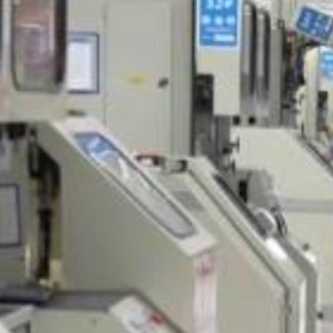

---

## 4

@物理芝士数学酱

发表于：2026-06-03 15:55

来源：微博

链接：https://m.weibo.cn/status/5305872731079209

\#今天要来点物理吗？\# 

为什么望远镜无法看到无限小的细节？

瑞利判据（Rayleigh’s Criterion）——它描述了\#光学\# 系统（比如望远镜、显微镜或相机）能分辨两个点的极限。

                   θ = 1.22 λ / D

更大的孔径意味着更好的分辨率。波长越长，细节越少。这个简单的方程定义了望远镜或显微镜所能达到的最清晰视野。

那个 1.22 是一个来自衍射理论的常数，它不是随意选的数字，而是从圆孔衍射的数学推导中自然出现的。

当光通过一个圆形孔径（比如望远镜的镜面）时，会形成一个叫 Airy 图样（Airy pattern） 的衍射分布。

这个图样的强度分布由贝塞尔函数 𝐽1(𝑥) 描述：

𝐼(𝜃)∝[2𝐽1(𝑘𝐷sin⁡𝜃)/𝑘𝐷sin⁡𝜃]^2

其中𝐽1 是一阶贝塞尔函数；𝑘=2𝜋𝜆；𝐷 是孔径直径；𝜃 是观察角度。

第一个暗环的位置对应贝塞尔函数 𝐽1(𝑥) 的第一个零点，出现在 𝑥=3.8317。

把它代入上面的表达式并近似 sin⁡𝜃≈𝜃，就得到：

𝜃𝑅=1.22𝜆/𝐷，其中 1.22=3.8317/𝜋。

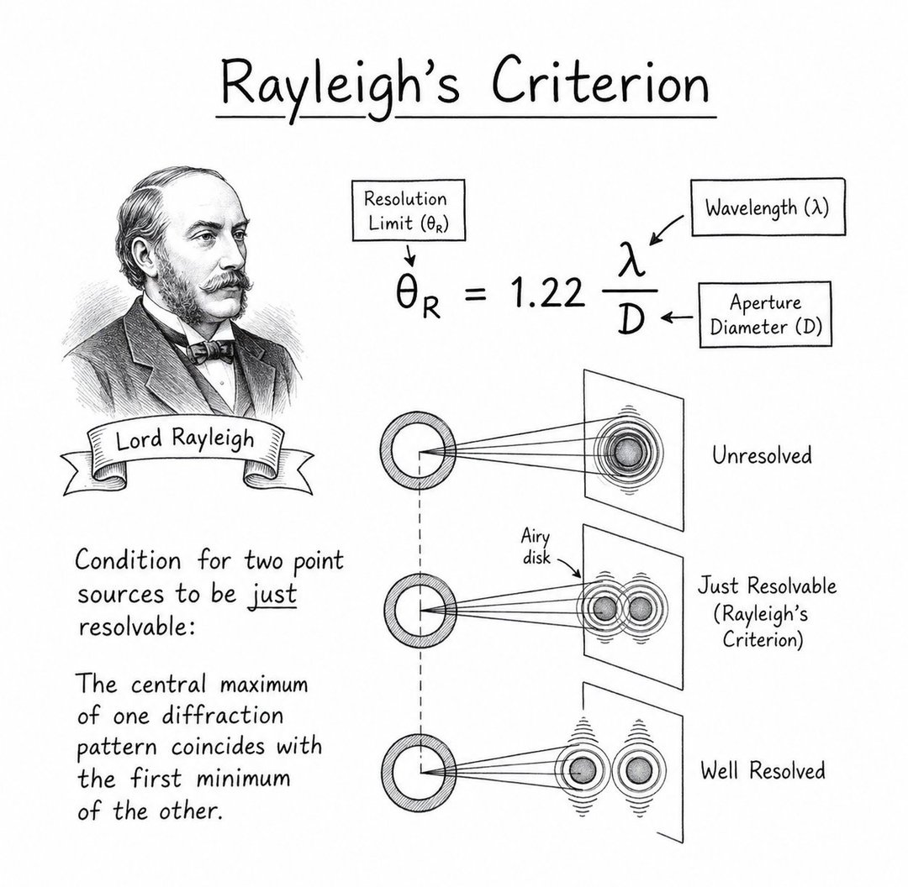

---

## 5

@孤烟暮蝉

发表于：2026-06-03 05:38

来源：微博

链接：https://m.weibo.cn/status/5305717483110665

好像是哈。。。。

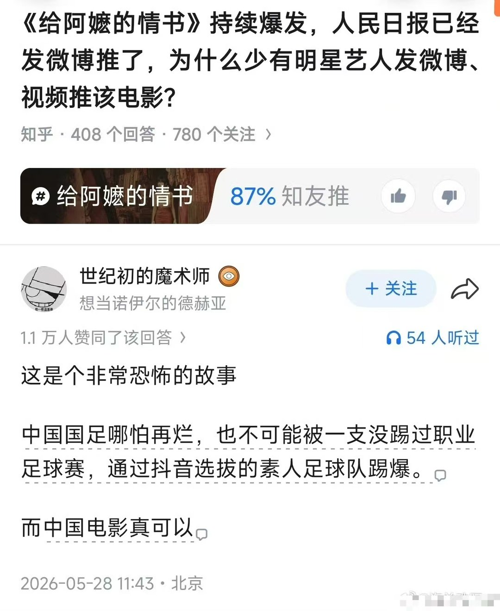

---

## 6

@李建秋的世界

发表于：2026-06-03 15:38

来源：微博

链接：https://m.weibo.cn/status/5305868459444306

\#北大教授预言未来高考取消\#

老头还在说“未来会使用AI的专家”就怎么怎么着，我就想笑。

这老头不但不会用AI，他甚至不会用电脑，他但凡使用过电脑，他不会说这个话。

80后和90后这两批人是最会用电脑的，尤其是80后。

当年折腾电脑是现在小孩不能想的，好多小孩现在都不会用PC了。

因为不必要了，现在简单的很。

不存在什么使用AI的专家，如果存在，说明AI没有完善而已。

会取消高考吗？取消高考那什么替代？

清华北大一年就招那么几个人，你怎么替代？让他们自主命题？

高考不就是个筛选吗？不然咋筛选？

我是北大教授，所以我儿子能上北大，你是个老农民，你儿子不许上北大。

是这样吗？

---

## 7

@理记

发表于：2026-06-03 15:32

来源：微博

链接：https://m.weibo.cn/status/5305867140597554

朋友请吃饭，沈阳最贵的楼盘下面的连锁烧烤，摆了一桌子，鸡翅，猪蹄，牛肉串，羊肉串，肉筋，鸡脆骨，鸡架，油边，拌菜，炒饭，地瓜，茶蛋，手巾板餐具，还有自助零食。

加一起，团购118。

我控糖吃的少。

饭店没法干了，真的。

---

## 8

@包容万物恒河水

发表于：2026-06-03 15:30

来源：微博

链接：https://m.weibo.cn/status/5305866538718941

🔻多说两句，英伟达的问题，不在于英伟达的利润有多少，而在于它5.39万亿的市值。

🔻比德国的 GDP 都高，这对美国来说是好事吗？

🔻一个5.39万亿美元的数字，由4.2万名员工撑起，每位员工对应创造的市值超过1.28亿美元，远超苹果和微软等其他科技巨头，英伟达解决的就业人数，可能还不及德国一家大型制造业企业，与3.4亿美国人的现实生活中间，是不是隔着一道巨大的鸿沟？

🔻英伟达约65.27%的股票由机构投资者持有，其中前三大机构股东（先锋集团、贝莱德和道富）合计持有超过20%的股份。美国家庭通过养老金间接持有部分股份，但大部分收益流向了大型基金和高净值人群。

🔻在2026财年，英伟达前两大客户合计贡献了36%的营收。这意味着其增长高度依赖少数几家大客户的持续投入。

🔻当驱动美国经济的核心力量从“造实物”转向“讲故事”，风险与回报的分配模式也随之改变了。

🔻美股也是这样，标普500前十大权重股占比已接近40%，远高于2015至2016年前后约20%的水平，2026年至今，美股“七姐妹”贡献了指数相当一部分的涨幅，其余493家企业的股价基本上就是轮动到略微跑赢的水平。这是一场由 AI 故事催生的资金虹吸效应，AI正将标普500塑造成“个股市场”。

🔻它们为美国解决了多少岗位？为美国普通人创造了多少财富？解决了多少美国人的现实问题？它们的起高楼和月薪不到3000美元的美国人能有多大的关系？

🔻但是它们的楼要是塌了，那和普通美国人关系就大了去了。

\#热点现场\#\#海外新鲜事\#

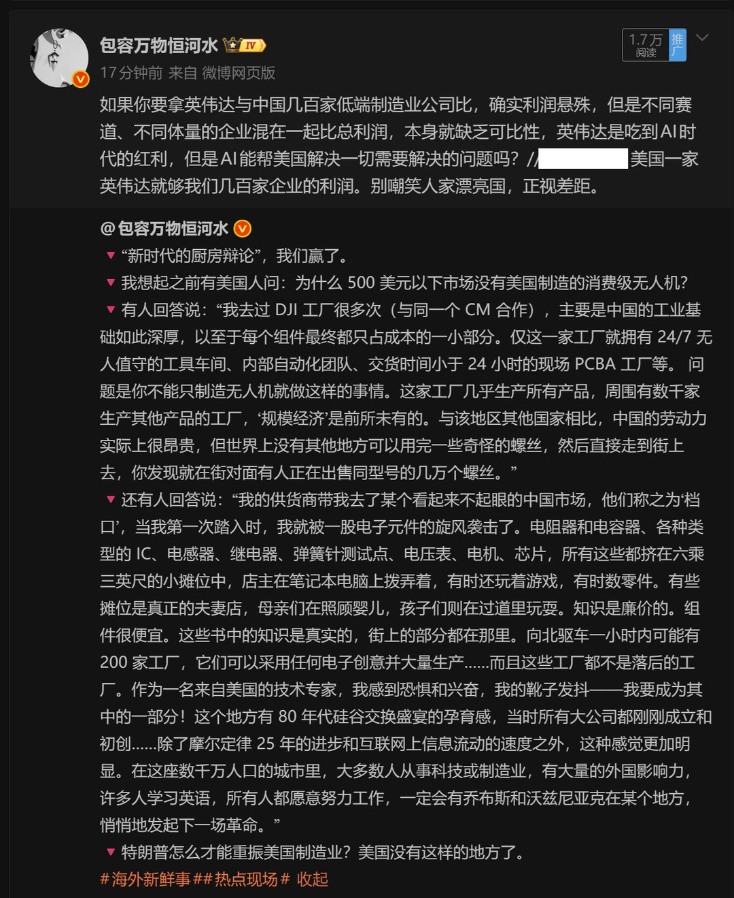

---

## 9

@Transformer-周

发表于：2026-06-03 07:56

来源：微博

链接：https://m.weibo.cn/status/5305752220076110

确实是

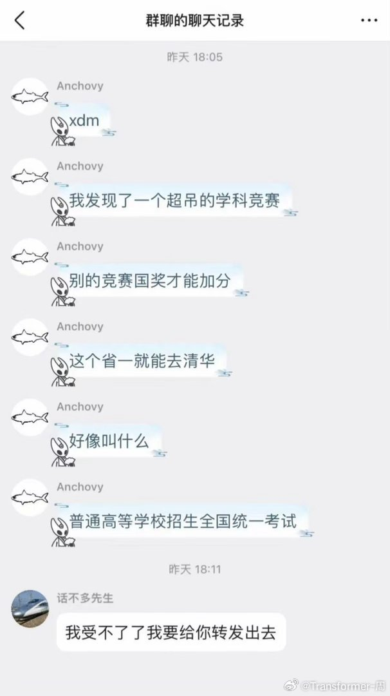

---

## 10

@微博AI

发表于：2026-06-03 07:18

来源：微博

链接：https://m.weibo.cn/status/5305742812250346

【\#为什么大家讨厌AI脸\#】

近日“AI脸”再次成为热门话题，很多观众发现，现在不少AI作品里的角色越来越像，高度同质化和失真感让人感觉一眼假。

过去观众能记住一个角色，很大程度上是因为长相、气质甚至一些不完美的特点。而当越来越多角色开始长成相似的样子，“AI味”也变得越来越明显。为什么大家会对AI脸产生反感？是审美疲劳、缺少个性，还是因为它让人感觉不够真实？

---

## 11

@前HR本人

发表于：2026-06-03 14:30

来源：微博

链接：https://m.weibo.cn/status/5305851340129701

网友：给阿嬷的情书里面的郑木生十几年没回过潮汕老家是不是有点大bug，这当然不是。

这个确实历史都苦难，当年华侨确实陷入一直政治绝境，很多都哭了。

为什么南枝1960隐藏了木生去世信息，那时候60年，三年大难啊，潮汕地区人均几分地，没有华侨的救援，真的难以生活。

华侨他们对国家发生事情非常清楚，当年大量的邮寄米面和肉到中国救急老家亲人。如果当年南枝选择断了，叶淑柔就难以维持家庭了，所以她演了十八年的丈夫。改革后，生活好了，她也就选择公开了。

我们历史对东南亚华侨是有亏欠的。

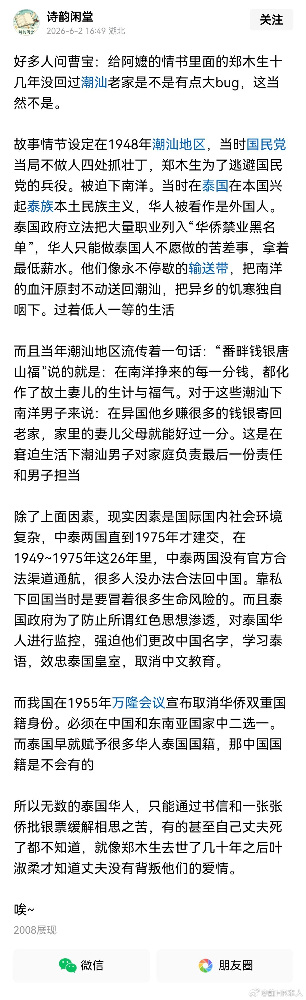

