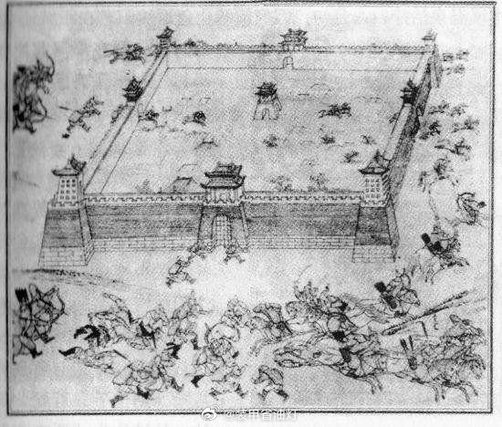
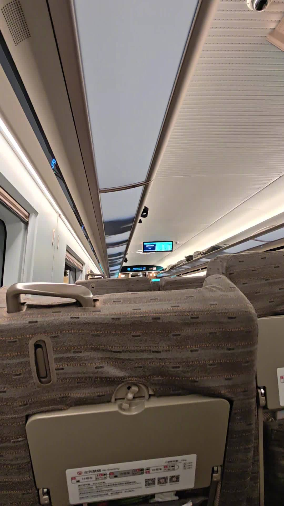
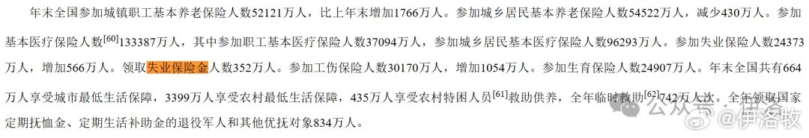
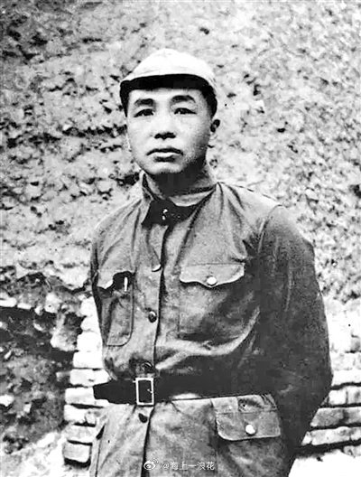
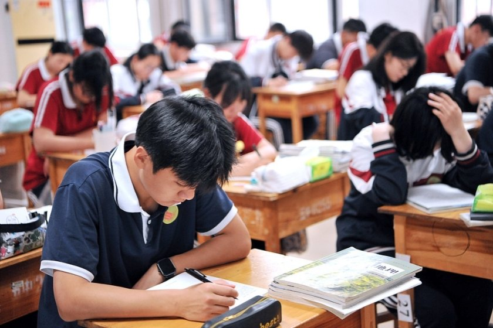
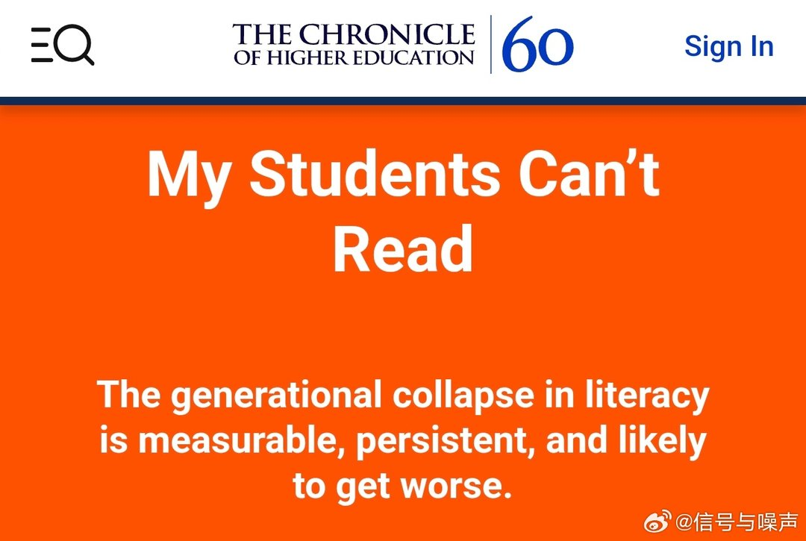
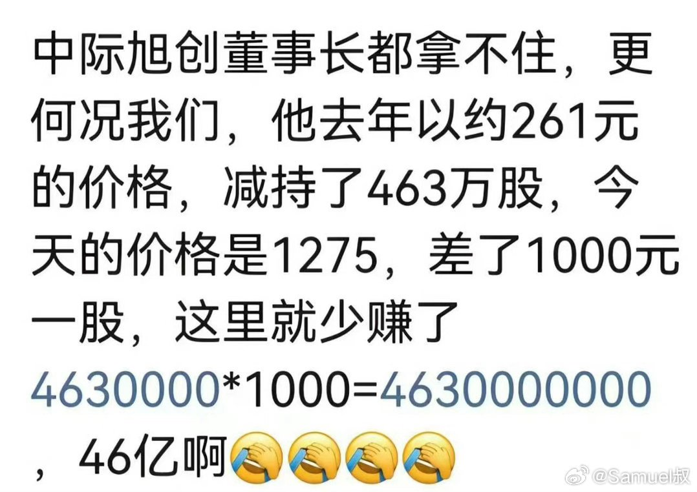
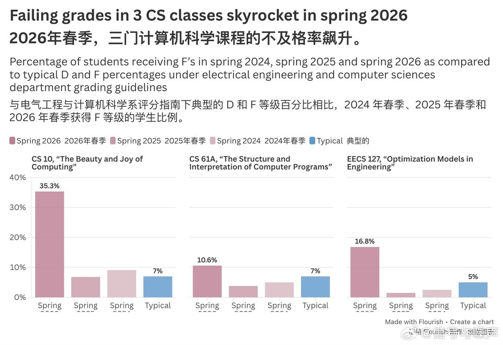

# 2026-06-05

## 1

@Finance鸟不飞

发表于：2026-06-01 11:07

来源：微博

链接：https://m.weibo.cn/status/5305075669142223

很多人都说男孩渐渐变娘，当然有社会大环境变好的问题，其实也我们家长的问题。我们小时候，爬树、游泳，赤脚上山，河里抓鱼，越下雨越兴奋，等着鱼上水。我问了我老婆，她身体也很好，小时候几乎跟我一样，野生的环境。好的社会，人会变得越来越大惊小怪，因为没有那么粗糙的环境了，在温润的环境里，男人、女人都会变得软弱。不能容忍一点点火车上小孩的哭声，过于讲究卫生，小小的挫折放声大哭，动辄抑郁，变得敏感而脆弱，甚至因为过于卫生而导致免疫系统过于敏感，俗称过敏。创二代与创一代是两个物种，因为创一代那种富贵险中求的环境不复存在；建国一代上天入地，无所不能，一代人顶三代，因为他们穿过血海、走过地狱，他们看到今天中国人的好日子也定会欣慰，也为我们变成软蛋，变成小布尔乔亚而暗自叹息。

---

## 2

@姬永锋

发表于：2026-06-04 01:10

来源：微博

链接：https://m.weibo.cn/status/5306012634713902

这简直是最实用的国内旅行住旅馆经验：

去任何一个城市、县城，先打开地图，看市政府、县政府在哪里，然后在附近找宾馆。

大概率会找到那种单体建筑、非连锁、名字很朴素的老牌宾馆。

它们很多以前就是招待所、迎宾馆、国宾馆，现在对外经营。不是网红酒店，也不一定装修多潮，但胜在几个点特别稳：

位置通常在市中心，交通方便；

安全系数高，没什么乱七八糟的消费；

房间隔音普遍比快捷酒店好；

卫生和餐饮更让人放心；

价格还经常比同地段连锁酒店更划算。

很多快捷酒店是办公楼改的，隔音、通风、卫生全靠运气。但这类宾馆本来就是按住宿接待设计的，房间结构、管理标准、服务流程都更成熟。

最关键的是，它们的价格往往受内部接待标准影响，不会像热门商圈酒店那样旺季乱飞。你花三五百，可能住到准四星甚至老牌五星的体验。

比如重庆雾都宾馆、广州广东迎宾馆、北京首都宾馆、上海国际饭店、南京金陵饭店、武汉东湖宾馆、成都锦江宾馆、济南山东大厦、杭州浙江宾馆，都是这类思路。

当然要避开两会、重大会议、调研接待高峰期。

一句话总结：

出门旅行，不一定非盯着网红酒店和连锁品牌。政府附近那些老牌宾馆，才可能是普通人最容易捡到的住宿性价比。

---

## 3

@真主钦点仁波刀

发表于：2026-05-30 16:04

来源：微博

链接：https://m.weibo.cn/status/5304425645867620

红军战士的待遇水平，几乎从始至终都高于同时代的中下层平民。以至于很多人就是活不下去来寻一条生路，连长征期间都具备凝聚力——因为如果离队，这些在家乡早就失去了土地、财产和宗族的人们，落入敌人手中只有死路一条。

结论是：无论事业有多正义，都要保障相对充沛的物质供应，才能更高效更有力地实践正义，而不是饿死在执行正义的路上。

---

## 4

@蘸盐

发表于：2026-06-04 03:17

来源：微博

链接：https://m.weibo.cn/status/5306044532392239

一个是三湾改编后官兵一致，当兵的吃什么当官的也吃什么，还一个是每月节余发伙食尾子当零用钱，打了土豪、打下县城什么的，也能每人分到几块银元。再一个是不搞清教徒式的为吃苦而吃苦，只要有条件就改善生活。何涤宙回忆，到了遵义，“约三位战友逛新城，寻全城最大川黔饭店，掌柜领入雅座，店家主动上招牌：辣子鸡丁、醋熘鱼、血花汤等六七道菜。一盆辣子鸡丁满满堆盘，香辣适口，众人十分满意；一餐合计3块多银元，几人凑钱结账，店家十分惊奇红军自费就餐、不赊不拿”【后面老何在日记中吐槽，入城第五天，“再赴川黔饭店吃辣子鸡，菜品大半垫白菜，分量缩水，当场和店家交涉”。第七天“第三次进店，辣子鸡丁鸡肉极少、大量猪肉冒充，分量薄到盖不住盘底，伙计连连赔罪，几人之后不再光顾此店”】陈云回忆“遵义城内酒肆多川黔风味，辣子鸡、回锅肉、各式泡菜物美价廉，我也曾同战友进店用餐……红军休整期酒楼生意暴涨”。成仿吾回忆“红军进驻遵义后补给充足，除部队食堂统一白米、炖肉外，战士手握结余伙食费，沿街饭馆随处可吃本地特色辣子鸡、碗耳糕、牛羊肉粉，遵义大小餐馆日日客满”。//@亚太空天:你知道红军不发军饷吗

---

## 5

@装甲省油灯

发表于：2026-06-02 14:40

来源：微博

链接：https://m.weibo.cn/status/5305491468323570

明朝万历末年到天启初年，辽东战场接连惨败的消息不断传回北京，朝野震动。时任兵部职方清吏司主事的徐日久，在他的私人笔记《骘言》中，记录下一段极为珍贵的访谈。访谈对象是一名从辽东逃回的浙江残兵，此人亲身经历了萨尔浒、沈阳、辽阳三次大败，九死一生才得以返回关内。

因与徐日久是同乡，他毫无保留地讲述了自己在辽东的所见所闻。这段口述没有官方战报里常见的讳饰与夸大，也没有文人墨客的渲染与想象，只是一个普通士兵最朴素的亲身经历，以下是原文：

兵部职方清吏司主事徐日久《骘言》卷之十一存窃议有一残兵自辽东回者，三次败衄，俱身在行间。以同邑人来见。

余因问日：奴酋人马果真不可当乎？

曰：奴亦人也，南兵士亦有健斗者，但将官不好，兵士也不大管他，呼唤使令，虽若如常，实是离心离德。以此到临阵不甚照顾。

余曰：将官严耶？

曰：非也。此如月粮一两八钱，扣下四钱，与米一斛。此米在百里之外，往返搬费可百余钱。健者肯负，稍弱及骄逸者，觅驴驮载，又费百钱，而米实浥烂，不堪食用，卖之正与所费相等耳。是月粮之数，已苦官少给四钱矣。及至散银，则名色杂出，每军须扣二钱，计军士所实得者，每日四分耳。谨实节省，仅能度日。如同行某人颇好酒，即每日与人垫用，渠亦头上伤三刀。今虽得不死脱归，然衣裳百结，有同乞丐，真可哀也。以马军言之，粮料应每月支三两，然马食须日费五七分，才得养成臕壮。今官既扣减，自然做马不着草，一束直钱廿四五文，且不割舍，买将喂养，那复言料。以此马俱骨立，日报倒死，官亦更不诘问，大家都将就支持，何曾立意与奴酋厮杀？

余曰：将官既克粮，如此军士难道不往上申诉。

曰：金华人也，最蛮。一日见扣银数多，辄相约呐喊散队。本官闻之，急到教场唤过头目，且令各兵俱坐地听着。因数某官致送礼多少，答应陈设多少。前日有一位官来查边寨，送银十两，他心里不满，做出许多事来，后加送一百两。又前闻说要发你们往关外去，我怜你闷劳苦，把银子去用，才得摆墩，计费去多少，何曾是我要你的众军士。既目见其然，而亦谅将官之别难厝置也。以此甘心听扣，谁敢上诉？只是不敢怨，亦不见德，视将官如路人已耳。

余曰：辽阳失时何如？曰：在沈阳时，扎一车营，亦甚坚固，奴来攻不能入，忽传贺总爷来，开营相接，则皆真鞑子也，锋创所及，溅血如电。小人见势急，扯得三四个死人自覆，渠亦见人仆地者，即不顾过去，乃得不死。逃至辽阳。不几日，报奴酋已至，只见经爷传令兵屯城外，道爷又传令入城固守。后毕竟依经爷屯扎城外。然奴酋不知几时，有多少细作在城，一齐放火，厝手不及。若论辽阳，真好高峻城濠。三道是熊爷所挑，要攻不易攻也。

余又问：兵败时如何？一时都走，莫个敢住脚的？

云：也是道爷传令箭，叫大家逃命，才敢散营耳。奴贼与我们初战一阵败了，第二阵他胜，却已疲罢，退至沙沟喂马。若此时有军向前去可胜，无奈人心不齐，军也还少。

余又问：王都爷何如？曰：做道爷时，好不过了，军民无不感戴。至做了都堂，不知这们一个主意。外边军士都说有皇赏，只见将官催造册籍，军士却不曾得，都将去把与西虏，不知干得甚事来。

余又问曰：尔既守墩边，墩上何如？云：器械都是戚老爷时置造，如今都绣了坏了，如何用得？又原设每墩米十石，备急时食用，今亦没了。若官去点验时，俱从小路将已点过的米挑去听验，都是儿戏一般。

嗟呼！若言此有徵，则武弁不足责矣。谁秉军国之成，略不省察？使夫将官吸军士之髓，军士分马驴之食，驰驱靡效，兵将不亲，致败致逃，莫思其故。其甚焉者，浚皇赏以媚虏，至于一事无成，尚饶辩舌，彼冀幸免死，且不必道，而人更为之坚墙壁，攒鳞甲，以淆乱是非，使后来者倘不察而迷于适从也，可胜叹哉！

翻译一下：

徐日久见到这名士兵后，问：后金军的兵马当真所向无敌吗？

士兵回答：后金兵也是普通人，南方来的士兵里也有勇猛善战的人。问题出在领兵的将官身上。士兵们平日里听候差遣看似如常，心里却早已和将官离心离德。到了战场上，彼此之间根本不会相互援护。

徐日久又问，难道是将官治军太过严苛，才导致士兵心生不满吗？

士兵摇了摇头，说出了最核心的问题：军饷。按照朝廷的规定，普通士兵每月的军饷是一两八钱银子。但将官先要从中克扣四钱，剩下的再折算成一斛米发放。可这批米根本不在军营附近，而是存放在百里之外的粮仓。士兵们想要领到米，就得自己往返搬运，这一趟下来，路费就要花上百文钱。身强力壮的士兵还能自己挑着回来，体弱或者贪图安逸的，只能雇驴驮运，又要再花百文钱。更糟糕的是，领到的米大多受潮霉烂，根本没法吃。就算把这些霉米低价卖掉，所得的钱也刚好抵得上运输的开销。算下来，光是这一项，士兵每月就平白损失了四钱银子。

等到正式发放银两的时候，将官还会借着各种名目再扣二钱。这样七折八扣下来，一名士兵每天实际到手的钱粮，只有四分银子。就算每天省吃俭用，也只能勉强糊口。士兵说，他有一个同伴，平日里爱喝点酒，还常常把自己的钱粮借给别人。如今虽然侥幸逃了回来，却衣衫破烂，补丁叠着补丁，和街上的乞丐没什么两样，看着就让人心酸。

接下来是骑兵的情况。按照规定，骑兵每月的军饷是三两银子。一匹战马每天至少要花费五到六分银子喂养，才能养得膘肥体壮，具备作战能力。可如今军饷被层层克扣，士兵们连自己的饭都吃不饱，哪里还有钱喂马。当时辽东的草料价格飞涨，一捆干草就要二十五六文钱。士兵们舍不得买草料，战马只能啃食路边的野草，更别提专用的豆料了。时间一长，所有的战马都瘦骨嶙峋，每天都有马匹接连倒毙。将官们对此视而不见，从不追问原因。全军上下只是敷衍度日，压根没有拼死对敌的心思。

《明神宗实录》中也多次记载，辽东军队的军饷被克扣的情况十分严重。有的士兵甚至数月领不到一分银子，只能靠挖野菜充饥。萨尔浒之战前，朝廷曾紧急调拨三百万两白银充作辽饷，但经过各级官员的层层盘剥，真正能用到军队身上的不足三成。大部分银两都流入了各级官员的腰包，变成了他们府邸中的金银珠宝。

听到这里，徐日久忍不住问道：将官这样公然克扣军粮军饷，士兵们难道就不会向上申诉吗？

于是这名士兵讲了一个发生在金华兵身上的故事。他说来自浙江金华的士兵性子刚烈，有一回，众人见银两所扣太多，实在忍无可忍，便相约鼓噪，不肯归队。主管的将官闻讯后，急忙赶到校场。他没有惩罚带头闹事的士兵，而是召集了所有的大小头目，让全体士兵就地坐下，当众算起了账。他细数自己迎来送往、应酬上官的各种开销：

这名军官说此前有一位上官前来巡查边寨，起初只送了十两银子，对方心生不满，处处刁难。无奈之下，他又追加了一百两银子，这事才算了结。接着他又说，此前朝廷打算调这批士兵去关外打仗，是他怜惜众人劳苦，四处花钱打点，才把大家改派到边防墩台驻守，不用去前线送死。前前后后花了这么多银子，哪里是他自己中饱私囊了。

士兵们亲眼看着将官说得情真意切，也都知道官场的规矩，明白这些开销确实免不了。众人沉默了许久，最终还是散了，再也没人敢提申诉的事。大家心里虽然不敢公然怨恨将官，却也对他毫无感念之情。在士兵们眼里，将官和自己不过是形同路人罢了。

这个细节最能反映明末军队腐败的本质。这不是个别将官的贪腐，而是整个官僚体系的系统性腐败。上级官员向下级勒索，下级官员只能向士兵克扣。形成了一个牢不可破的利益链条。士兵们明知自己被剥削，却无处申诉，只能默默忍受。这样的军队，根本不可能有任何战斗力。

聊完了军中的日常，徐日久又问起了辽阳城陷落时的情形。

士兵说，他先是驻守沈阳。当时明军在沈阳城外布设了车营，防御工事十分坚固。后金军队轮番进攻了好几次，都没能攻破。就在双方僵持不下的时候，忽然传来消息，说贺世贤总兵率领援军赶到了。士兵们大喜过望，立刻打开营门迎接。可冲进来的根本不是什么援军，全都是穿着明军衣服的后金兵。刀锋箭矢所到之处，鲜血飞溅，明军瞬间大乱。这个士兵情急之下，拖过几具尸体盖在自己身上。后金兵只顾着追杀向前奔逃的士兵，根本无暇逐一检查倒地的人。他就这样趴在死人堆里，一直等到天黑，才侥幸逃了出来，一路向南跑到了辽阳。

（除了暖帽和弓箭等很有女真特色的装备外，八旗军的衣服盔甲其实和明军高度相似，几乎没什么不同，所以要伪装并不难）

这一细节与《清太祖武皇帝实录》中的记载完全吻合。努尔哈赤在攻打沈阳之前，就已经派出了大量奸细混入城中。他们不仅刺探情报，还在关键时刻制造混乱，里应外合。号称勇冠三军的贺世贤出城迎战，结果军队大溃，贺世贤率领家丁奋勇冲杀突围，寡不敌众战死之后，后金兵就穿着缴获的明军盔甲，打着贺世贤的旗号，轻易骗开了明军的营门。相比之下，明军的情报系统却形同虚设，连自己的总兵是死是活都搞不清楚。

可他在辽阳也没能待多久。没过几天，后金大军就兵临辽阳城下。这时候，明军的指挥系统彻底乱了。经略袁应泰传令，命大军全部驻扎在城外，与后金兵决战。可兵备道何廷魁却坚持认为，应该全军入城坚守，凭借高大的城墙抵御敌军。两个最高指挥官意见相左，争执不下。

最终，还是袁应泰的命令占了上风，明军主力全部屯驻在城外。可谁也没有想到，后金早已派出了大量奸细潜入辽阳城中。就在两军在城外激战的时候，城里的奸细四处同时纵火，守军猝不及防，军心大乱。残兵说，辽阳的城池其实非常坚固，城墙高大，壕沟深险，三道城壕都是当年熊廷弼主持修筑的，本来是易守难攻之地。可就是因为内部出了问题，才这么快就陷落了。

徐日久又问，大军溃败的时候，是不是所有人都只顾着逃命，没有一个人敢留下来抵抗？

士兵的回答再次出乎徐日久的意料。他说，其实是兵备道何廷魁亲自出示令箭，当众传令让众人各自逃命，大军这才彻底溃散。而且，后金兵也不是不可战胜的。两军初次交锋的时候，明军还打了一场胜仗。第二仗后金兵虽然取胜，人马也已经疲惫不堪，暂时退到沙沟一带休整喂马。如果当时有将领能站出来，组织士兵乘胜反攻，本有机会扭转战局。可当时军心已经散了，兵力也不足，终究没有人敢站出来。

这个细节常常被后世的历史研究者忽略。很多人都认为八旗军是战无不胜的铁军，但实际上，他们也有疲惫和脆弱的时候。萨尔浒之战中，努尔哈赤率领八旗军在五天之内连续奔袭数百里，打了三场恶战，人马早已疲惫不堪。如果明军能够抓住任何一个战机，都有可能改变战局。可此时的明军，已经失去了主动进攻的勇气和能力。

接着，徐日久又问起了王化贞的情况。王化贞此前担任广宁兵备道，后来升任辽东巡抚，也就是士兵口中的王都堂。

士兵说，王化贞做兵备道的时候，政绩口碑极好，军民无不感念他的恩德。可自从升任都堂之后，他的行事举措却让人越来越看不懂。军中一直传言，朝廷拨下了大笔的赏银，用来奖励作战有功的士兵。可只见将官们忙着编造名册登记，士兵们却分文未得。后来大家才听说，这些赏银都被王化贞拿去接济关外的蒙古部落了。至于这些钱到底花在了哪里，有没有起到作用，没有人知道。

王化贞的这一做法，在当时就引发了巨大的争议。他天真地认为，只要用金钱收买蒙古部落，就能让他们出兵帮助明朝攻打后金。可实际上，蒙古部落只是想从明朝手里骗取钱财，根本没有真心帮助明朝的意思。最终，王化贞花掉了百万两白银，却没有换来蒙古的一兵一卒。反而让后金有了充足的时间，逐个消灭明朝在辽东的据点。

最后，徐日久问起了边防墩台的情况。这名士兵此前曾在墩台驻守过一段时间。

他说，墩台上的兵器器械，还是当年戚继光将军镇守蓟辽的时候督造的。这么多年过去了，这些兵器早就锈蚀损坏，根本没法使用。按照规定，每座墩台都要储备十石粮食，以备被围困的时候取用。可如今，所有墩台的粮仓都是空的。每逢上级前来查验，官吏们就提前把别处已经点检过的粮食，辗转搬运到这座墩台来应付检查。等检查的人走了，再把粮食运回去。整个边防体系，就像一场儿戏。

戚继光当年苦心经营的边防体系，到了万历末年，已经彻底崩溃。墩台失去了预警和防御的作用，后金军队可以随意出入明朝的边境，如入无人之境。这也是为什么萨尔浒之战中，努尔哈赤能够准确掌握明军的一举一动，而明军却对后金的动向一无所知。

听完这名幸存士兵的讲述，徐日久发出了沉重的感叹。他说，如果这名士兵所言句句属实，那么基层武官的罪责固然难辞其咎，但手握国家军政大权的重臣，又怎能对这些触目惊心的问题视而不见、不加核查？将领们层层盘剥，榨取士兵的血汗，军马的粮草被不断挪用克扣。将士们奔波劳碌却毫无战力，官兵之间隔阂深重。接连战败、士兵奔逃，根源正在于此。更有甚者，挪用朝廷的赏银去讨好外族，到头来一事无成，还巧言狡辩妄图脱罪。不仅如此，还有人替这类官员遮掩包庇、颠倒是非，让后来主事的人难辨真伪、无所适从。思及种种，实在令人长叹不已。

这段四百多年前的访谈，直到今天读来，依然让人感到震撼。它没有宏大的叙事，也没有激昂的口号，只是一个普通士兵用最平实的语言，讲述了自己的亲身经历。却让我们看到了萨尔浒之战前后，明朝辽东军队最真实的面貌。

长期以来，很多人都认为，萨尔浒之战的失败，是因为明军兵力不足、指挥失误，或者是因为八旗军战斗力太强。但这段口述却告诉我们，明军的失败，早在战争开始之前就已经注定了。这不是一场战斗的失败，而是整个军事体系的系统性崩溃。

从军饷制度来看，明朝末年的财政危机已经到了无以复加的地步。朝廷虽然不断加派辽饷，但大部分银两都被各级官员层层克扣，真正能发到士兵手中的寥寥无几。根据当代学者的研究，万历四十七年，辽东地区的粮价已经涨到了每石一两八钱银子。一名士兵每天四分银子的收入，连买一斤米都不够，更别说养家糊口了。连基本的生存都无法保障，士兵们自然没有心思打仗。\#兵者凶器\# 

从军队的指挥体系来看，明末的辽东军队已经陷入了严重的混乱。经略和巡抚权责不清，命令不一，士兵们无所适从。将领们只知道克扣军饷、中饱私囊，根本不关心士兵的死活，也没有能力指挥作战。官兵之间离心离德，一旦遇到危险，士兵们首先想到的就是逃命，而不是拼死抵抗。武器装备 

从情报和边防体系来看，明朝的情报系统已经彻底失灵，而后金的间谍工作却做得无孔不入。沈阳和辽阳的陷落，都与后金的间谍活动有着直接的关系。而基层的边防墩台，更是形同虚设，兵器锈蚀，粮食空虚，根本起不到任何预警和防御的作用。

徐日久作为兵部的官员，他清楚地看到了这些问题。可他的感叹，却无法改变任何事情。在他写下这段文字之后不久，广宁陷落，王化贞弃城而逃。明朝在辽东的局势，一步步滑向了不可挽回的深渊。

---

## 6

@风云学会陈经

发表于：2026-06-04 03:20

来源：微博

链接：https://m.weibo.cn/status/5306045162326515

伊朗提出“四阶段”方案，感觉和美国要搞成“边打边谈”，长期化

前两天美伊爆发了四月停火以来最激烈的冲突，互炸了几下，海湾多国又拉防空警报了。但市场反应不大，认定了美伊是“边打边谈”，不可能打大。

伊朗方面放了个“四阶段”方案的消息。第一阶段结束战争、停止军事行动。第二阶段谈霍尔木兹海峡问题，解除封锁，取消石油制裁，释放伊朗部分被冻结的资产及受阻资金，这些具体措施。第三阶段谈制裁与核问题。第四阶段成立监督委员会，负责监督实施。

第一阶段是全面停火，伊朗要求以色列也停，不能打真主党，和以前的要求一样。就是停火，和其它事无关。这步感觉特朗普是想实现的，这是脱身而去的第一步，已经让以色列别打了。

第一阶段停火一段时间后，各方真的觉得稳定了，就进入第二阶段。这是真正困难的，需要谈很久，四个关键问题都扯不清。海峡问题及其相关机制，很难谈，美国不想让伊朗控制，伊朗付出这么大代价肯定要捞到些啥，很可能长期谈不成。解除封锁，取消限制与石油制裁，释放伊朗部分被冻结的资产和受阻的金融资源，这些也不容易，但主要还是海峡控制权难谈。

立场差异太大，交战各方仍处于原点，没啥进展。就是最近动手了，又打不大，搞成“边打边谈”。感觉要长期化了，Polymarket赌盘认为6月底达成协议机会不大，之前还被特朗普忽悠得以为要谈成了。油价不容易下来，全球通胀要来了。

---

## 7

@美食家大雄

发表于：2026-06-03 11:20

来源：微博

链接：https://m.weibo.cn/status/5305803580114014

可给我气到了，这趟高铁，刚才特别夸张的广播提示：不要吸烟，然后就是带幼儿的家长，请照顾好孩子，如果哭闹请带到车厢连接处哄劝。没了。

这是去罚站吗？公开处刑？怎么不提示大声打电话的，也不提示大声外放的？也不提示脱鞋臭脚踩座椅的，这些应该去连接处罚站呀！

去过那么多国家，没见过任何公共场所对孩子这么苛刻的。再广播，我得争取录下来，录全了，发视频公开投诉了。这成什么了。。巨婴欺负孩子，高铁也跟着欺负。 美食家大雄的微博视频

---

## 8

@互联网的那点事

发表于：2026-06-04 01:52

来源：微博

链接：https://m.weibo.cn/status/5306023111820217

SpaceX周三向SEC提交修订文件，宣布将以每股$135的固定价格发行5.556亿股A类股票，融资$750亿，整体估值达$1.77万亿。

这将成为人类历史上规模最大的IPO…

按此估值，SpaceX将成为美国第七大上市公司，超越特斯拉的$1.6万亿市值。

马斯克个人持股价值将达$8410亿，将成为全球首位万亿富翁。

值得注意的是，SpaceX今年2月合并xAI时估值仅$1.25万亿，短短四个月估值跳涨41%...

---

## 9

@伊洛牧

发表于：2026-05-16 06:51

来源：微博

链接：https://m.weibo.cn/status/5299212846632739

近年各方面信息披露质量是在全方位下降网页链接

2023年统计公报还披露当年末领取失业保险人数352万人，2024年起就不再披露，后续从迟滞较久的统计年鉴得知数据为463万人，增长32%。

统计公报也未披露2025年末领取失业保险人数，而当年失业保险基金支出2165亿，创历史记录。2026年1-3月份支出536.6亿元，同比增长率：15.40%。

---

## 10

@李建秋的世界

发表于：2026-06-04 01:41

来源：微博

链接：https://m.weibo.cn/status/5306020323921795

那个欧洲央行的报告，你看与不看都OK，欧洲现在是希望独立了，美帝那边现在大家都信不过，老中这边呢，如你所知，资本账户不开放。我感觉我们这边态度最为奇妙，其实前几年华尔街那边嗷嗷叫的希望中国开放资本账户，等了好多年，没动静。

前几年发了一个新闻，在中文互联网好像没人说，叫Wall Street in China: the malleability of global finance in the age of geopolitics，那会好像是给了几个华尔街大佬的牌照，讲一下大致意思。

过去三十年，西方金融资本进任何一个发展中国家，基本上就强迫对方取消资本管制，听华尔街的，但是中国不放弃目前体制，不开放资本账户，然后就僵住了，这个是最关键的。前几年中美地缘战打的轰轰烈烈，从总统到国会都要求华尔街和中国金融脱钩，但是几乎没人听，所有的华尔街大佬，包括高通，摩根大厅，贝莱德和桥水都去中国拿牌照开设子公司。

所以就说未来怎么办，大家都僵住了。

然后华尔街展现出了特别柔性部分，开始配合中国去建股票通，债券通和互换通，也就是说华尔街愿意在这个受限的内部玩游戏。

传统观点认为，中国如果要挑战美元霸权，肯定要另起炉灶，比如说搞个金砖币，搞个新的人民币清算系统去硬杠，但是其实不是，其实可以通过华尔街进行反向搬砖。

也就是说美国政府可以用华尔街，中国未尝不能用啊，何必浪费呢？

美帝内部有相当大的争议，一方面是政客不断指责华尔街，觉得他们把美国人养老金送给中国企业输血，要求出台投资禁令，但是华尔街有很强的游说力量，而且还利用金融离岸中心来玩猫鼠游戏，

结果中国来说，资本账户依然没有开放，依然对资本完全的管控，而对华尔街来说，有了全球超大体量且能提供多元化对冲的资产池，而且展示出了对抗美国政府力量的手腕和能力，韧性十足。

---

## 11

@海上一浪花

发表于：2026-06-04 01:41

来源：微博

链接：https://m.weibo.cn/status/5306020273851664

彭老总所了解的知识分子与工农

1916年３月，彭老总参加湘军，开始了他壮烈的军旅生涯。湘军是地方军阀的部队，士兵多为贫苦的农民，但也有知识分子，一类是军官学校的毕业生，一类是中学生。彭老总对他们的评价是：

“保定青年军官来部队充当见习官、排长、连长，他们来时朝气逢勃，讲解鸦片战争以后的国耻，编写了不少军歌进行爱国主义教育，有时他们也讲得痛哭流涕。他们随着地位的提高，逐步贪污腐化，什么爱国爱民完全置于脑后，如何升官发财，却成为他们一切闲谈的话题。

我在这段时间，也交了一些来营当兵的知识青年（主要是中学生），他们来时也是满口爱国主义，如何发奋图强，廉洁奉功，逐渐发现他们多数是带着升官图来当兵的。

我交了二十个左右的知识青年朋友，最后剩了黄公略、李灿。他俩加入了光荣的共产党，当了红三军军长和红八军军长，为中国人民事业献出了他们的生命！

我也交了一些士兵朋友，他们是贫苦农民和失业的手艺工人，老实纯真，容易接受打富济贫，灭财主、灭洋人的思想。到1921年有十人左右加入救贫会，有的在北伐战争中牺牲了，有的以后加入了共产党，在红军中牺牲了。这批人没有一个叛变的。”（Ｐ29-30）

旧军队中的知识分子之所以腐化堕落，重要的原因在于他们当官的可能性大，而普通的工农子弟因为没有文化只能通过革命改变自己的命运。革命性的坚定性与否与个人在现实环境中选择性的多少成反比，这似乎是人之常情。

不过，对于革命，特别对于彻底破坏现存社会秩序、颠覆传统价值体系的中国革命来说，“人之常情”恰恰不能解释。事实上，彭老总发动平江起义时的一些核心人物，除黄、李外，其他的如贺国中、邓萍、黄纯一都是知识分子出身，革命立场都很坚定。

黄纯一的部下李聚奎称：“黄外表像个文雅的书生，但性格刚毅，遇事沉着果断，作战勇敢，对士兵胜似手足，对革命忠贞不渝。”

同样，彭老总结交的士兵朋友没有一个叛变，而工农革命者并不都是立场坚定的，比如皮匠出身的师长郭炳生1933年就在广昌叛变。正如同是党的负责人，知识分子出身的瞿秋白英勇就义，而工人出身的向忠发却最终叛变、被蒋介石像狗一样杀掉，周恩来评论向忠发：“连妓女都不如。”所以关于知识分子与工农在革命性的差异问题，不能一概而论。

参考文献人民出版社《彭德怀自诉》\#历史上的浪花\#\#带入考场即构成作弊高考安检新变化\#

---

## 12

@财新网

发表于：2026-06-03 08:05

来源：微博

链接：https://m.weibo.cn/status/5305754651209860

\#观点网\#【\#高考报名人数为什么会下降\#】专栏作者陈志文认为，教育部公布2026年高考报名人数1290万，在去年下降7万人的基础上，2026年高考报名人数又下降45万人，多多少少有点意外。网页链接

　　理论上适龄学龄人口仍然在缓慢增长中，比如对应2026年高考，18年前即2008年新生儿数量为1608万，比2007年增长13万人，比2006年增长23万人。为什么高考报名人数反而持续下降了？

      下降人数占今年高考报名总人数的3.4%，理论上还在正常波动范围内，但还是有必要详细分析一下这其中的原因。

　　作者认为，第一，虽然绝对适龄人口增长，但相对生源增长些微下滑。第二，高考命题改革等倒逼复读人数下降。第三，高等教育普及化带来的“学历迷信”退潮。

---

## 13

@信号与噪声

发表于：2026-06-04 14:38

来源：微博

链接：https://m.weibo.cn/status/5306215803657136

美国大学教授写了篇文章 《我的学生不会读书了》

2026 年关于 AI 和人类认知最重要的一段话：

"把认知挣扎外包给 AI，

不是腾出脑力做更高阶的事

是剥夺你做任何认知工作的力量。"

AI 没让我们变笨。 AI 让我们失去了变聪明的肌肉

这事和你 30 岁还是 18 岁无关

和你是程序员、CEO 还是大学生无关

凡是把"挣扎"外包给 AI 的人，都在失去应对没有 AI 的未来的能力。

---

## 14

@Samuel叔

发表于：2026-06-04 14:35

来源：微博

链接：https://m.weibo.cn/status/5306215076993289

朋友圈看到有人发这个图，是这道理，见过些上市公司董事长，对自家股价都没概念，23年去拜访的一个还愁未来大小非解禁其他股东套现会影响他抵押，说掉头发，结果第二年来了牛市

包括从散户到投行老大都说的“看增长、价格就是未来自由现金流折现”没错，但怎么增长，增长多少，基本都是拍脑袋粗算答案，谁能算绝对准确不可能。低频市场像房市，相对的未来现金流折现有大量指标例如过去常说的总价中位数、租金中位数、价格关系、价格倍数，已经非常好算了，这不仍会有被套在绝对高点的人

任何真金白银的下注，都不能忘记先给自己建立安全垫

---

## 15

@信号与噪声

发表于：2026-06-04 14:33

来源：微博

链接：https://m.weibo.cn/status/5306214612735535

UC Berkeley 计算机系作为全球 CS 教育的天花板，被 AI 击穿了

AI用的越多，计算机系学生的数学技能却日益下降，不及格率也随之飙升

UC Berkeley CS 61A 挂科率 10.6%，前两年都不到 10%

教这门课的 Dan Garcia 教授原话：

"主要原因是学生用 Claude、ChatGPT、Gemini 带来的学术不诚信激增。"

AI 让一代人失去了"挣扎着学会一件事"的肌肉。

如果全球最强 CS 项目的学生都开始批量挂科，明年的 Berkeley CS 学位，含金量已经不是去年那个含金量了？

