# 2026-06-06

## 1

@蚁工厂

发表于：2026-06-05 00:47

来源：微博

链接：https://m.weibo.cn/status/5306369097860275

kimi大佬谈重构 kimi-code 的过程

“agent 并不会替代所有程序员，只会让顶级的程序员生产力翻 20 倍，并淘汰其他程序员”

\#AI创造营\#


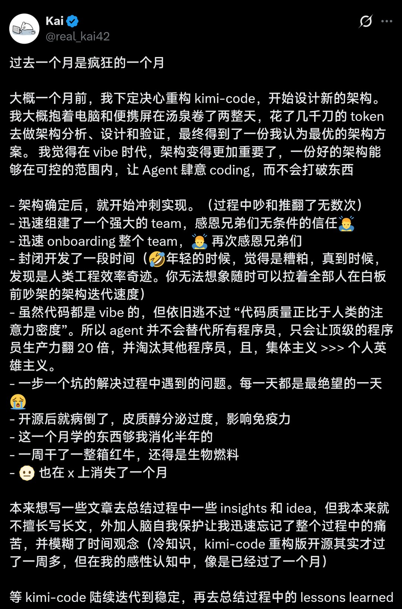

---

## 2

@南山林雪萍

发表于：2026-06-04 23:12

来源：微博

链接：https://m.weibo.cn/status/5306345265302499

美国铁锈地带，一个触目惊心的产业红灯。人大李巍教授的《产业政治》给出了一个独特的视角，发现那个闪烁的红灯，并非只对美国有效。铁锈地带，对美国而言是全球化带来的无法愈合的伤痕。但它同时也是一个精准的棱镜，折射出全球产业地理变迁背后的政治效应。

一个工业地带的繁荣，因为产业集群而使得生态共进。小企业能够跟大企业一样得到同步的兴旺。甚至在某些集群，即使没有大块头，中小企业同样可以良性运转。然而产业开始衰落的时候，大企业可以长腿自由搬迁，小企业却容易就地消失，将它的产业工人像断链的珠子一样洒满当地。可以说，“铁锈地带”往往跟产业集群是紧密相连。它是“锈带”，是被外部气体过度腐蚀的产业带。无论是匹兹堡的世界钢都，还是托莱多的玻璃之都，以及美国威斯康星州的简斯维尔的汽车零部件之城。他们都是因为产业集群的整体移动，而产生的铁锈，

当提及“铁锈地带”的时候，它背后其实有一个潜台词：产业集群。“空心化”看上去是产业受到的损失，但它的核心是一个又一个失去家门口就业的家庭。这正是美国副总统万斯在《乡下人的悲歌》一书所要传递的主题。这里的“乡下人”有特定的两层含义，一个是“苏格兰后裔”意思用来指那些坚硬保守的传统，一个则是代指极度悲观的白人工人阶层。

 铁锈地带会造成产业空心化，这听上去是一个产业兴衰的问题。但它同时具备动摇社会阶层的破坏力。《产业政治》认为它带来了就业市场的崩溃，而更重要的是人口大规模的变迁。《悲歌》在这里再次响起。

美国铁锈地带八个州，在2000年开始的二十年期间，许多城市都出现了人口负增长。这在美国整体人口从2.4亿增长到3.3亿的情况下，格外扎眼。包括例如汽车城的底特律、钢铁城匹兹堡和玻璃城托莱多，甚至当年五大湖中心——芝加哥。芝加哥的全球农产品货物期货指数，至今号令天下，就因为当年五湖通畅，是最主要的农产品来外之地。人声鼎沸。

对美国而言，锈带产生了两种后果。一种是经济方面的。衰落之相容易看到，悲歌之声也容易听到。第二种后果则是形成了一种政治毒针效应。它以接力的方式，传递到政治家手中，再往前传递到全球其它国家。

政治家让美国对外政策发生了巨变，从而改变了全球生产的分配和贸易形态。美国的世纪关税，跟中国跟欧洲的贸易战，都是一种政治毒液的延续。而它最早，则是原源自锈带。产业集群铁锈带，会放大一个产业地理区不满的声音，从而变成了一个政治地理现象。最后它以“美国优先”的方式，将全球化变成一个道德问题。

让美国重新强大MAGA的核心，等同于让铁锈地带重新擦亮。没有一个国家通过消费而变得伟大，那些强大的国家只能通过生产而变得强大。且不说这种论调忽视了另外一种交换，美国让渡了制造权但却获得至上的数字经济霸权。但这种说法，听上去充满鼓动人心的力量。

实际上，美国产业并非都是单边衰落。美国堪萨斯州的维奇托市，是美国的飞机制造中心，世界超过35%的通航飞机还有50%的公务机，都在这里制造。它从未丢失它的航空活力。这里有波音、德事隆等飞机制造公司，也有波音旗下的Spirit机身公司，空客的研发总部也在这里。它在这里还有一个重要的麦康奈尔空军基地，提供了很重要的试飞。 一个长盛不衰的产业集群，一定会有附近的大学给它提供养分。维奇托州立大学的国家航空研究院NIAR，为它提供了持续升级的创新燃料。NIAR拥有强大的航空工程专业，来自企业的研究经费位居全美第一。

有了知识的养分，铁锈地带依然有机会就地擦亮。美国的轮胎之都，也是固特异的总部就在俄亥俄州的阿克伦市Akron。这是当年的美国轮胎产业基地，产量一度占据美国的70%。但是当轮胎四下滚动来到其它国家生产基地时，阿克伦的轮胎也凋落成泥。

然而阿克伦大学的 的化工学院，再次让阿克伦在精细化工卷土重来。阿克伦化工公司成为半导体胶的上游单体，而日本住友电工的半导体环氧封装胶，日本信越晶圆保护膜树脂，都在这里熠熠生彩。对于阿克伦大学而言，轮胎橡胶也好，半导体电子材料也好，都不过是精细化工的一种。

人心执念，向来都是惯性巨大。美国对锈带的心思，已经成为一种全民情绪。它一旦落地，整个事情就难以逆转。美国的贸易战，有着非常强的连续性。

上一届特朗普政府的贸易代表是强硬本土主义希特莱泽，而第二任期的贸易代表格里尔，其实是前者的学生。这也意味着铁锈地带的代言人不仅仅是万斯，也是贸易路线的有着绝对性的传统。这些代言人，声称要推动美国从“消费型经济”转向“生产型的经济”。美国优先就等于锈带优先，锈带优先就是产业集群优先。

这意味着产业集群的振兴，承载着更大的政治与民生的主题。美国的产业锈带，就像是是一个成年蝉的蜕壳，拥有鸣蝉的所有形态，但却不过是凝固的过去时态。而美国政客则将它打造成一个再生的寄托，希望再次唤醒往日产业的繁荣。而对于中国经济最为重要的基盘：县域经济的产业集群，美国蝉壳，就具有相当的警醒作用。

中国产业集群是一个四线城市的中产阶级保护带。当这些产业受到侵蚀的时候，那些小中产就可能陷入无所事事的局面。如果快递小哥群体在一个城市流行的时候，那就是产业集群凋落的伴生品。

中国未来的产业优势。一定是产业集群，中国已经获得了这个方面的胜利，下面就必须巩固这个胜利，否则就会丢失我们的基本盘。现在跟我们争抢产业集群的不是美国，尽管这场战役是美国发起的，但是如果放任的话，它会被第三方国家夺走，我们目前还没有看到我们巩固这种产业集群的努力。

从人口动力学的角度看，“工业铁锈带”具有非常好的样本分析意义。如果把它放在社会学的显微镜下面，就能看见众多微妙的政治命题在发挥重大作用。产业研究，也可以称为产业票仓，也因此带有强烈的产业政治的特性。而《产业政治》这本书因此建立了一个漂亮的视角，将产业研究的指针，从经济学扇区转向政治学的扇区。《产业政治》也因此成为研究美国，同时也是鉴醒中国的一个重要视角。大国竞争正在迎来新的决战。\#供应链攻防战\#\#城市的拐点\#\#产业集群第二春\#


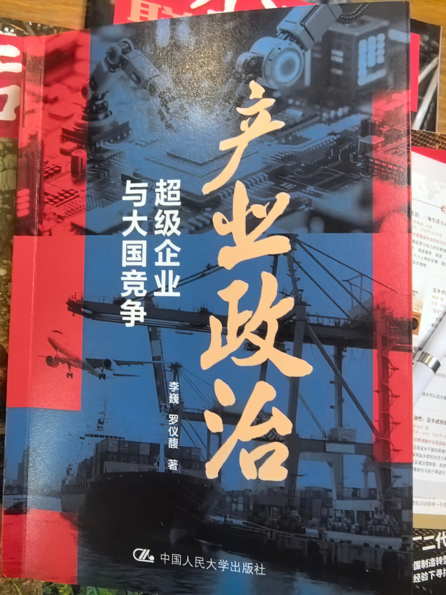

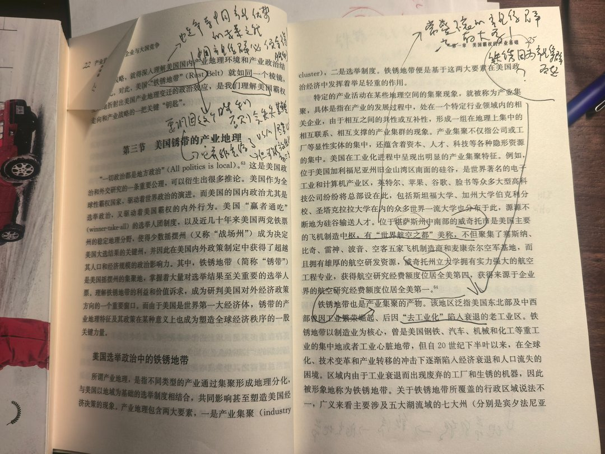

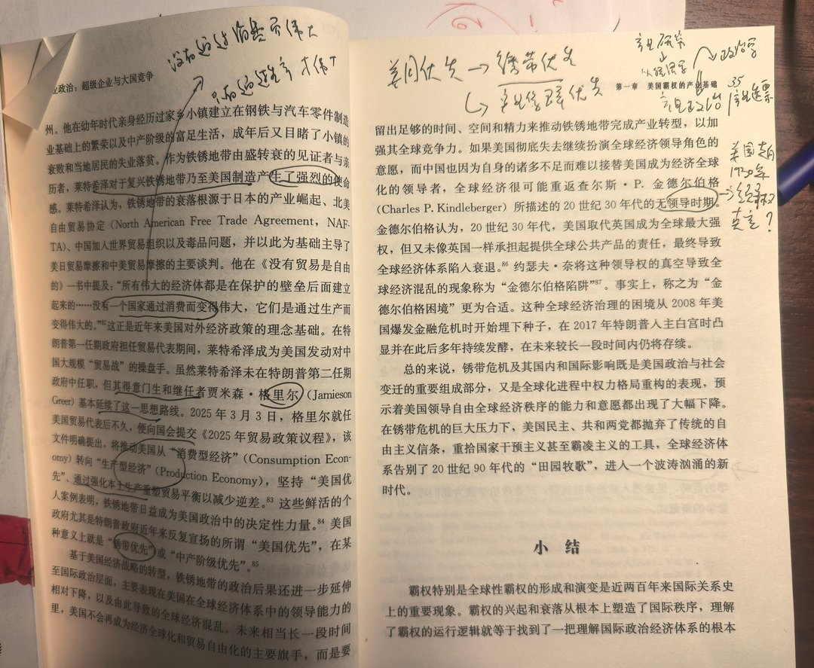

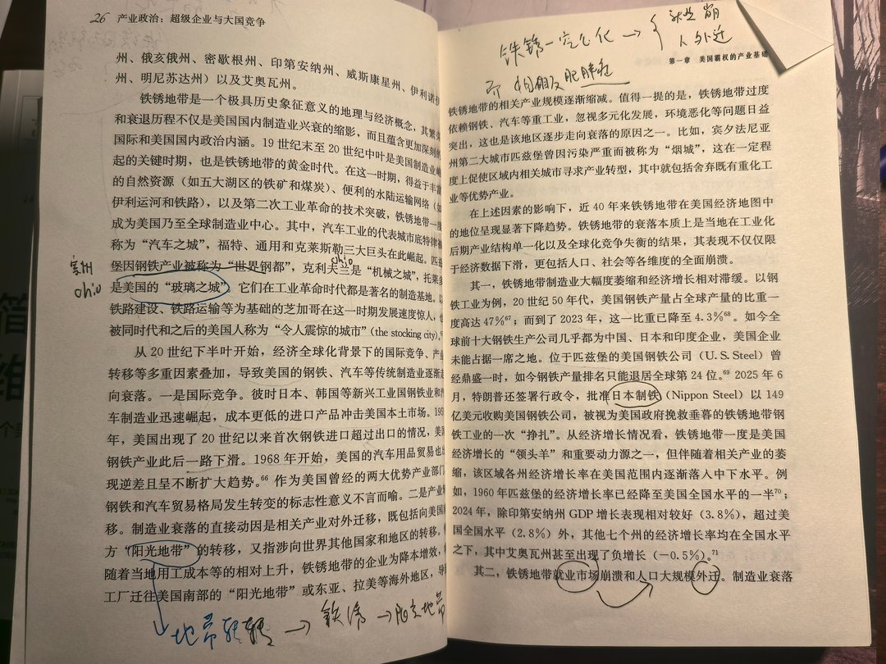

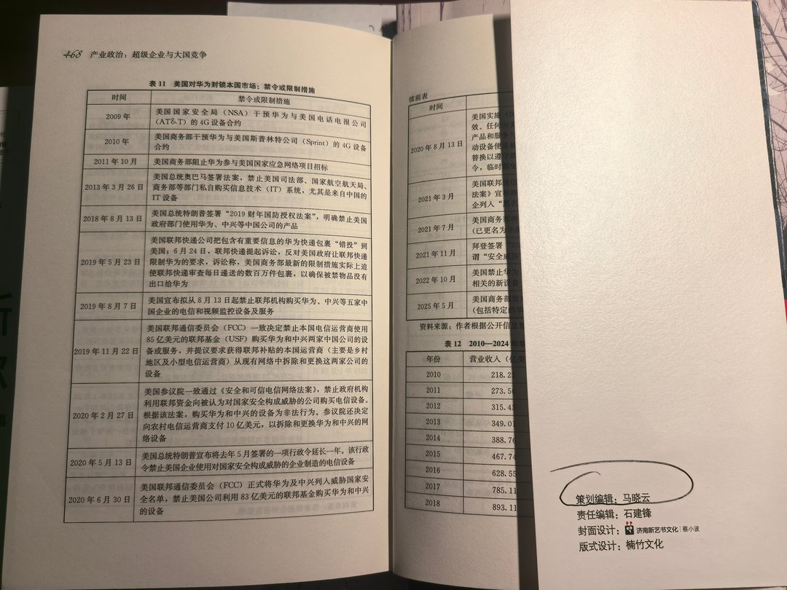


---

## 3

@傅蔚冈

发表于：2026-06-04 03:54

来源：微博

链接：https://m.weibo.cn/status/5306053896176205

麦当劳就是摩尔定律，在缩小汉堡尺寸上不断突破；

汉堡王就是HBM工艺，肉饼越堆叠越高；

肯德基就是韬定律，把更多的订单都压缩到每周的星期四这一天里，降低时间常数；

萨利亚就是ARM结构，单个核心性能不强，靠着低功耗和数量多把高性能选手卷死。


---

## 4

@苏耷水

发表于：2026-06-04 15:29

来源：微博

链接：https://m.weibo.cn/status/5306228624595655

以前年轻人在网上说讨厌熊孩子，很多人都无条件的附和，我也曾经是这样。直到我后来在现实中见到了那些极端讨厌孩子的人，他们是真的平等的仇视所有小孩，甚至会主动去骂那些根本没碍着他们的一两岁的小孩，挑起事端。我发现这个“讨厌熊孩子”的说法不是这么回事，是很可能变成极端仇孩者自我合理化的说法。

现在想，很多事都是怕给极端分子创造空间，才有那么多传统道德去约束人。所以要尊老爱幼，也不是因为老和幼就天然特别善良和正确，是因为老和幼是弱者，而且是每个人基本都会经历的脆弱阶段。

弱者当然不意味着他弱了就有道理，但是弱者作恶毕竟对社会整体的伤害有限。而道德大多数时候，是约束壮年人更多，因为壮年人如果行恶，那才是威力无穷。

社交网络上，那些弱者作恶的事例，更容易带来流量，所以传统道德上经常教育人们应该去同情的弱势者，更容易成为网上的众矢之的。这种事有反差，也解构许多根深蒂固的传统道德观，足够惹眼。

是因为这世上强者就不作恶吗？当然不是，是因为强者作恶时，我们大部分时候无力反抗。想发个真正的强者作恶的视频去博流量起号，很快就收到律师函了，再要不就直接号没了。


---

## 5

@物理芝士数学酱

发表于：2026-06-04 05:59

来源：微博

链接：https://m.weibo.cn/status/5306085129848537

喝咖啡可能会让你走得更多。

在这项随机临床试验中，参与者喝咖啡的日子平均每天多走了 1.058 步。每多喝一杯咖啡，就多走 587 步。


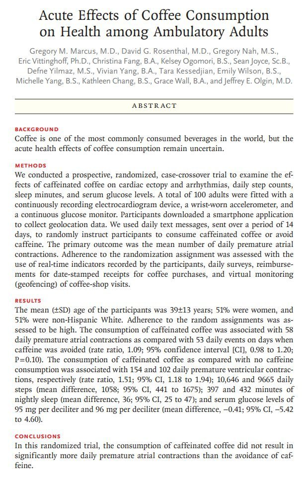

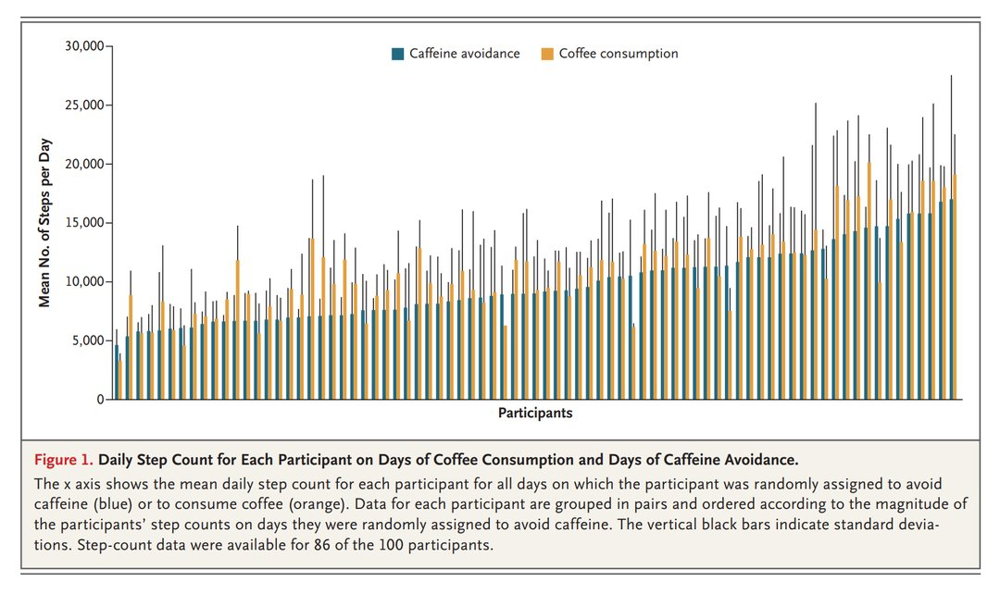

---

## 6

@梅新育

发表于：2026-06-05 16:51

来源：微博

链接：https://m.weibo.cn/status/5306611779240284

【梅新育：目前美国就业等数据好于我国】

今天收到统计局寄来新一期《中国经济景气月报》，今年的《中国统计摘要》预计明天送到。

看完主要数据，对照新发布的美国失业率、非农就业等数据，需要注意两点：

美国这一年多失业率等重要数据比我们好，不可妄自尊大，需要时刻提醒自己竞争压力；

特朗普去年正式就职以来，美国失业率上升了0.1—0.2个百分点；但从制造业产出等方面来看，美国失业率的这点上升反而促进了生产率和产出的提高。去年我就作出如此判断，现在越发确定。——这个机制可以写篇分析文章。


---

## 7

@江宇行舟

发表于：2026-06-05 22:05

来源：微博

链接：https://m.weibo.cn/status/5306690809626843

伊朗最高领袖的军事顾问穆罕森·雷扎伊这段采访还是挺有意思的，能从中看出不少伊朗的心态和技巧。

先补充个背景，雷扎伊自1979年开始，就担任霍梅尼安保团队成员，并参与起草革命卫队章程。1981年至1997年，任伊朗伊斯兰革命卫队总司令，2021年到2023年曾作为伊朗副总统分管过经济事务。因所谓“严重的谋杀罪和财产损害罪”被国际刑警组织发出逮捕令。今年3月，他曾喊话结束战争的前提是伊朗收回所有损失、美国离开波斯湾。

🚩关于特朗普与哈梅内伊可能的会面，他是断然否认了他会见特朗普的可能性。“这不会发生，我们现在正处于谈判的第一阶段，特朗普先生已经让谈判陷入停滞。这绝不会发生。”

本周，特朗普表示他与哈梅内伊“似乎相处融洽”，并表示将“荣幸”能与他会面。

但妙就妙在，雷扎伊没把话说死，不会会面的原因是特朗普让谈判的第一阶段陷入停滞，而不是特朗普对伊朗发动过进攻，更没有提及特朗普不宣而战的进攻杀死了最高领袖的父母妻女，这其实本就是伊朗想和美国谈判下去的信号。

🚩在完整的采访里，雷扎伊表示，美伊平协议能否达成，将取决于特朗普政府同意释放240亿美元被冻结的伊朗资产，他将这一要求描述为建立信任的措施，称特朗普政府打钱才能成为伊朗和美国未来的“新视野”：

“如果他（特朗普）想与伊朗达成协议，这240亿美元是伊朗希望与特朗普建立信任的考验——这是美国必须通过的考验，道路将被打开，”

他还强调：“这是我们自己的钱，不是美国的钱。”

伊朗相当于是拿自己被冻结的钱来给停火协议开了个价，话很狠，但其实姿态很低。但奈何特朗普这里有个bug，他多次高调批评奥巴马达成伊核协议，转头就给伊朗打款17亿美元。如今要是自己为了停火，去给伊朗打钱200来个亿，民主党乃至自家铁盘的唾沫都能淹了他。

哪怕这是伊朗的钱，美帝国主义霸道惯了，更何况选民们早被“快乐教育”给教傻了，不会算账，只要美国给伊朗打钱，就会被狂喷。所以特朗普之前已经多次和幕僚强调达成的协议措辞必须比伊核协议强硬，避免任何可能被解读为“支付一大堆现金”的行为。

🚩雷扎伊还对美国警告，如果恢复冲突，伊朗会将“将战争延伸到波斯湾以外”，包括印度洋、曼德海峡、红海和地中海，这其中之前未被攻击的美军基地将被攻击，从而“为战争增添另一层面，”，届时“美国的损失肯定会更重”。

在说到美国损失肯定会更重时候，对面的美国采访人表情凝重，手还动了两下。

🚩强硬表态完，雷扎伊又顺着主持人提问，对特朗普喊话，一方面要他独立于以色列——这种说法对奶龙的自尊心来说就是骑脸输出，另一方面又表示，符合上述内容的决策将为伊朗和美国铺就未来。

🚩根据CNN报道，在这段视频以外，雷扎伊还重申了与阿曼共同拥有对霍尔木兹海峡主权的主权，伊朗将共同管理该水道，伊朗将收取维护费。

关于核问题，采访视频与报道都没涉及，之前有巴基斯坦媒体报道，伊朗同意将部分核材料交由信得过的第三国。但又被伊朗否认。

🚩总体来看，作为革命卫队的老牌成员，雷扎伊在冷淡的语言里表达了强烈的和谈意愿，从中能感觉到伊朗真的很想谈。

而且是在核问题、霍尔木兹这样个别议题坚持强硬的情况下，其他方面都给予了放松，不像之前那样纠结美国是否撤出海湾地区，也不提赔偿（这可以解释为以冻结资金来抵偿，最后“自己赔自己”），更压根不提美国之前的不宣而战和灭了前最高领袖一家三代。

哪怕现任最高领袖还是前任的儿子。这本身也是一个耐人寻味的细节。

所以这样的谈判还陷入僵局，纯粹是特朗普之前一系列骚操作把特朗普自己给绑架了。

🚩现在看美伊谈判，感觉就像北极熊吞了个冰嘎达，特朗普不想打，伊朗这样子也不想打，伊朗甚至还保留对美国的热情，但就是怎么保住双方尤其是特朗普的面子。

从这里也能看出，对美国来说，走到某些死胡同里，领导人明明想拔可就是拔不出，还真的就是一个体制问题。

\#海外新鲜事\# 江宇行舟的微博视频


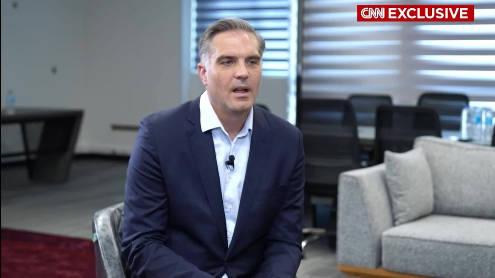

---

## 8

@前HR本人

发表于：2026-06-05 22:00

来源：微博

链接：https://m.weibo.cn/status/5306689361805753

全球Top20人口大国生育率垫底，问题严峻。

 

根据2024至2025年全球人口权威统计数据，在世界前20人口大国中，中国生育率已跌至榜单最低位，且呈现持续下滑态势。2024年我国总和生育率维持在1.0左右，2025年进一步回落，远低于2.1的人口世代更替稳定线，意味着新生人口数量已无法弥补人口老龄化与人口死亡缺口，人口自然迭代彻底失衡。

 

我国生育现状严峻，生育率不仅大幅低于人口体量庞大的主要竞争对手美国的1.6，甚至已经低于多年被大众视作低生育典型日本的1.2。日本常年深陷少子化困境典型，而我们还比其低约20%，刷新了人口大国低生育的底线。这种断崖式的生育下滑，绝非简单的人口数量减少，将会引发长期、连锁的系统性危机。

 

1、生育率崩塌冲击消费根基，引发经济螺旋式衰退。而不是说人少了用机器生产的供应没问题就行。

市场经济的核心逻辑是需求驱动生产，而人口是最核心、最持久的消费主体，稳定的人口规模是经济持续发展的底层底盘。维持人口稳定，本质上就是守住消费市场的基本盘；一旦生育率持续低迷，整个社会的内需市场会持续萎缩，最终带动全域经济增速下行。

 

当前超低生育率已经催生了明显的产业萎缩现象，且全部集中在刚需民生领域。各地幼儿园招生锐减、大量民办幼儿园关停合并，学前教育行业持续收缩；医院妇产科就诊量、新生儿分娩量大幅下滑，妇幼保健、母婴用品、婴幼儿早教、儿童医疗等整条产业链持续降温。需要明确的是，这并非产能过剩的问题，而是需求彻底不足的结构性危机。

 

这种危机具有极强的传导性和螺旋下坠特征：新生人口减少，社会整体消费活力持续流失，经济增长失去内生动力，人口萧条最终必然演变为经济萧条，地方经济发展将陷入停滞甚至倒退。

2、人口基数持续萎缩，削弱国家全球竞争话语权和产业竞争力。

 

全球化时代，国家的综合竞争力，不仅取决于科技、工业、军事实力，更依托于庞大的人口基数与人口红利。人口规模决定了一个国家的消费市场体量、产业链完整度、劳动力供给能力、研发潜力，直接影响国家在全球产业格局、国际规则制定中的话语权。人口规模直接决定了未来国家的发展潜力与全球地位。

 

当前全球多数穆斯林国家、非洲黑人聚集国家维持着相对稳定甚至较高的生育率，人口持续增长、最终必然占据全球话语权。欧美出生率也比我们好很多，在全球资源竞争、产业转移、经贸博弈中占据未来优势。

 

反观我国，作为全球人口第一大国，却创下前20人口大国最低生育率，人口红利持续消退、内需市场增量枯竭。在全球产业链竞争中，人口基数萎缩意味着产业扩张动力不足、市场吸引力下降；在国际博弈中，人口体量的相对衰退，会逐步削弱我国的长期发展势能，让国家在全球人口红利竞争中陷入被动。

 

3、人气集聚决定经济活力，低生育加剧区域发展两极分化，越不生育的地方经济越完蛋。

 

人口自带“人气产业链效应”，人气即商机、人气即就业、人气即发展动力，这是区域经济发展的底层规律。人口集聚的地方，需求旺盛、产业繁荣、就业机会充足；人口流失、人气低迷的地方，需求持续萎缩，产业难以存活，就业岗位不断缩减，形成鲜明的发展差距。

 

这也是当下人口持续向大城市、核心城市群集中的核心根源。一线城市和中心城市凭借相对完善的资源、集聚的人口人气，催生了海量消费、服务、产业需求，无论是高端制造业、现代服务业，还是外卖、网约车、零售等民生服务业，都能依托庞大人口维持良性运转，就业机会充足、收入渠道多元。

 

而生育率低迷、人口流出严重的中小城市及偏远地区，陷入“无人气、无需求、无产业、无就业”的死循环，然后年轻人走掉更多。

本地新生人口不足、青壮年人口持续外流，本地消费市场持续枯竭，企业难以生存、产业持续空心化，不仅高薪岗位稀缺，就连外卖、网约车、普通服务业等基础就业岗位都难以维持生计。一些地方长期转移支付输血，真不如发钱奖励当地生孩子。

 

4、现有养老机制失衡，催生生育不公、压制生育意愿。

 当前我国养老保障体系的运行逻辑，存在明显的“生育吃亏、不生育受益”的结构性失衡，是压制大众生育意愿、加剧低生育困境的重要制度性原因。现行养老金机制主要依靠在职人口缴费供养退休人群，多生育家庭承担了养育后代、储备未来劳动力的社会责任，却没有对应的制度红利倾斜，而少生育、不生育人群直接享受新生代劳动力创造的养老红利，形成明显的社会不公。

 

普通家庭养育子女需要承担高昂的教育、住房、医疗、育儿成本，耗费大量时间、金钱、精力，本质上是为社会培养未来的纳税人、劳动者和养老供养者，是对社会发展的正向贡献。但在现有机制下，生育家庭的巨大付出没有被认可、没有政策补偿，反而承担了更高的生活压力；而不生育家庭无需付出养育成本，年老后依然可以平等享受社保养老、医疗保障等社会福利，这种失衡机制让越来越多年轻人选择晚婚、不婚、少生，进一步压低整体生育率。

 

需要尽快建立养老与生育挂钩的差异化保障机制，推行新人新办法、老人老办法。对于已过生育高峰期人群，维持原有养老保障政策不变，保障社会稳定；对于新生代人群，将个人养老待遇、社保补贴、福利权益与家庭生育情况挂钩。对生育多孩家庭给予养老金补贴、社保减免、养老优先级倾斜等红利，弥补生育家庭的养育成本，扭转“生育吃亏”的现状，从制度层面激励生育、提振全民生育意愿。


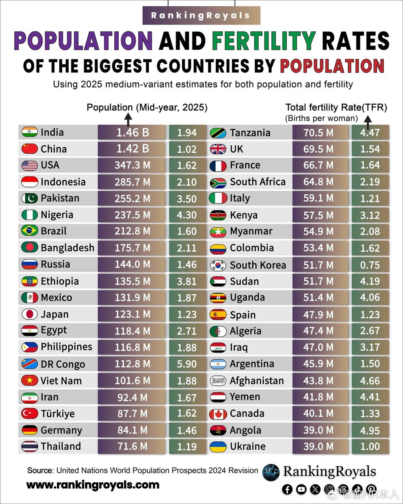

---

## 9

@李知了

发表于：2026-05-31 13:06

来源：微博

链接：https://m.weibo.cn/status/5304743090982249

今天办公室里有人说：“担心是运用想像力最糟糕的方式。”

这绝对是我这周听过最棒的一句话。

——rajvishah30


---

## 10

@戴雨潇Dai

发表于：2026-06-05 14:29

来源：微博

链接：https://m.weibo.cn/status/5306575885436486

文艺圈又在搞事了。刚刚惊闻电影《开个玩笑》定档，出品方为深耕女权题材的麦特影业。这部电影改编自广州环卫站女工状告站长性骚扰事件，其中春夏饰演的年轻律师「吴忧」的原型正是丁某清。

老读者对这个名字应该不陌生。丁某清就是武大图书馆诬告案女主杨某媛的代理律师。此人是个长期勾结境外反华势力的女权分子，多次在「某某亚洲电台」「某国之声」等境外反华媒体上抨击中国。（参见：网页链接）

丁某清曾以「翔凤文化节代表」的身份出席加拿大领馆举办的「性别平等」活动，与以色列副总领事同台演讲，还得到了后者的私下鼓励。@翔凤文化节（已炸号）是一个接受多个外国使馆资助的满遗和「满毒」团伙。

丁某清还是个LG*T活动者，一直在推动同性伴侣意定监护公证（打「同性婚姻」的擦边球），曾协助反华分子龙某瑞为境外NGO撰写关于「中国LG*T群体」的报告。

丁某清参与发起并领导了广州的同性恋NGO「彩虹律师团」。该组织是个不折不扣的颜革团伙，长期勾结「冈毒」「苔毒」。「彩虹律师团」的前骨干成员是已叛逃美国的反华分子李某婷@麦子家（已炸号），另一名成员常某平曾于2023年被判「颠覆国家政权罪」。

我不明白，像丁某清这样的颜革分子，为何还能以正面形象被搬上荧幕。你们到底要干什么？


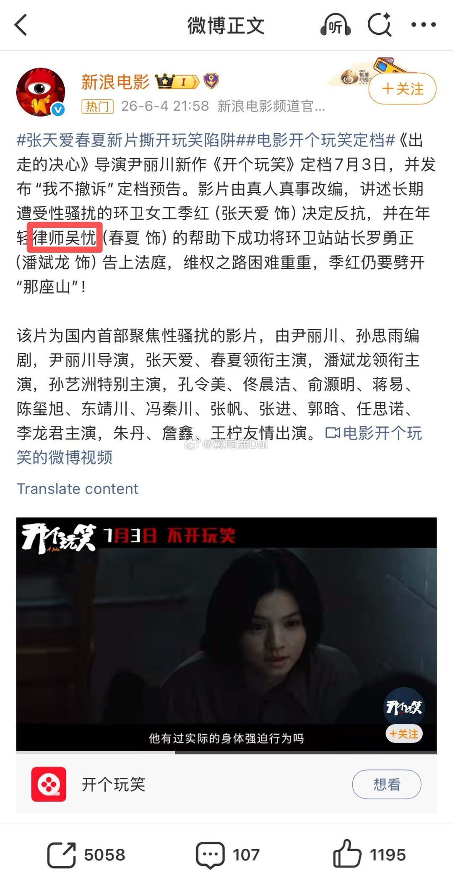

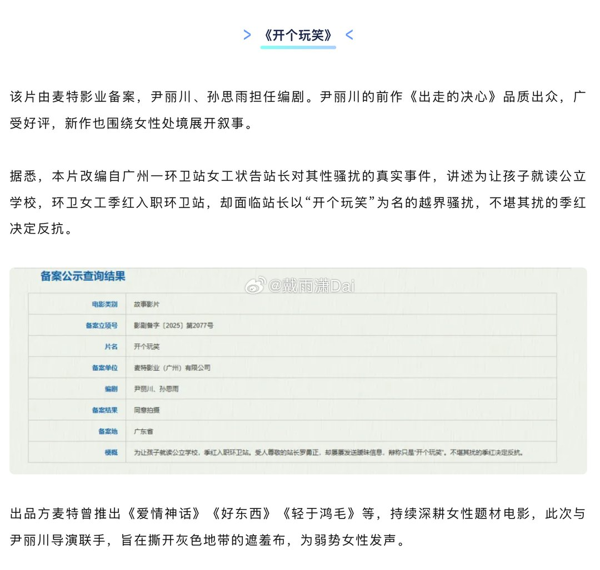

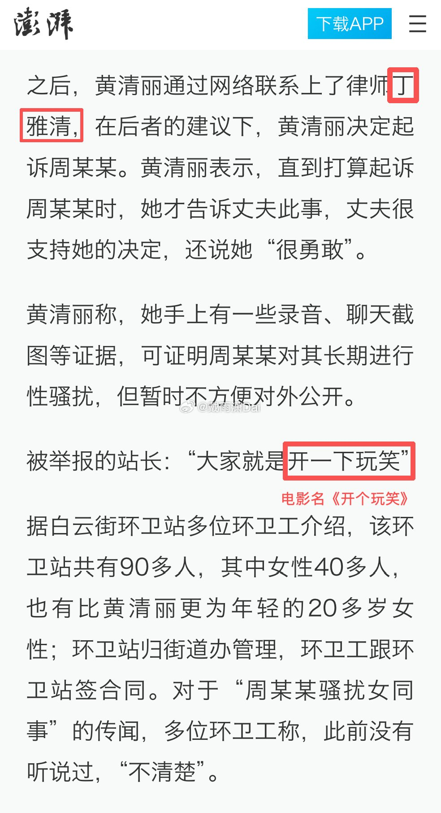

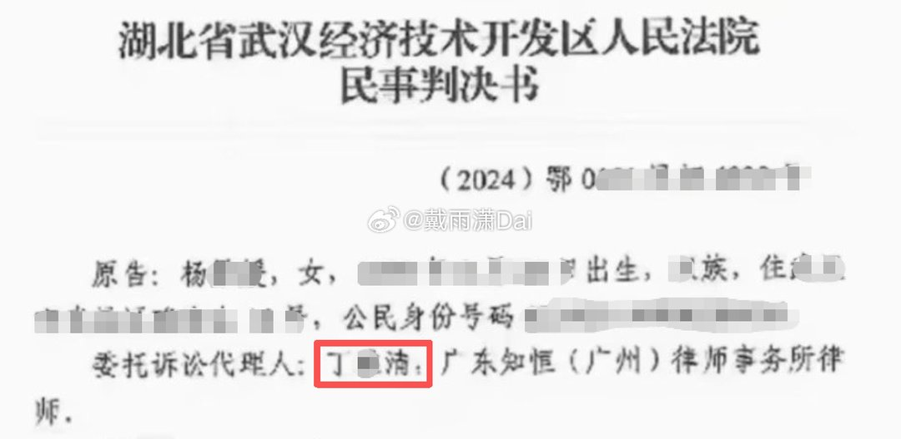

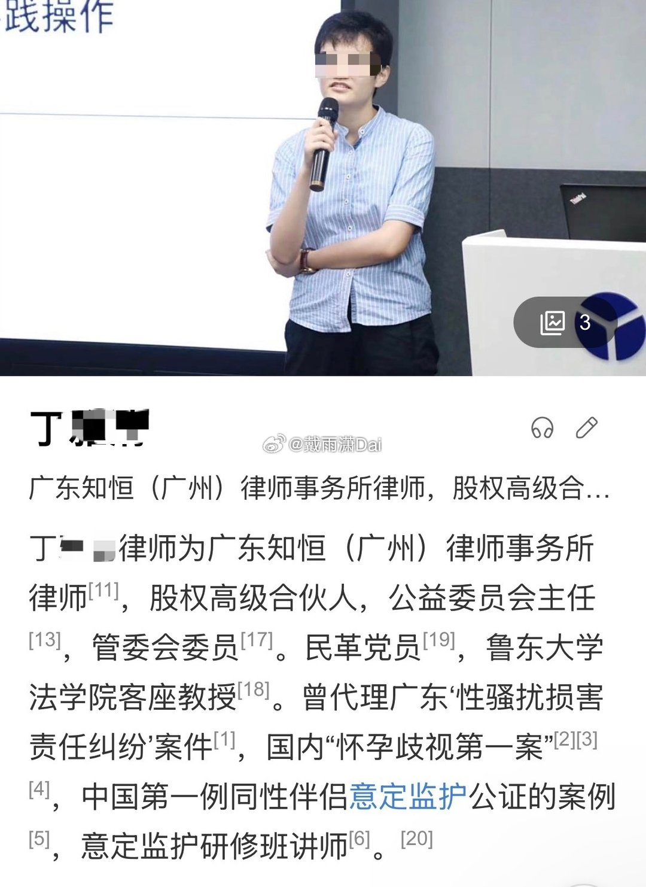

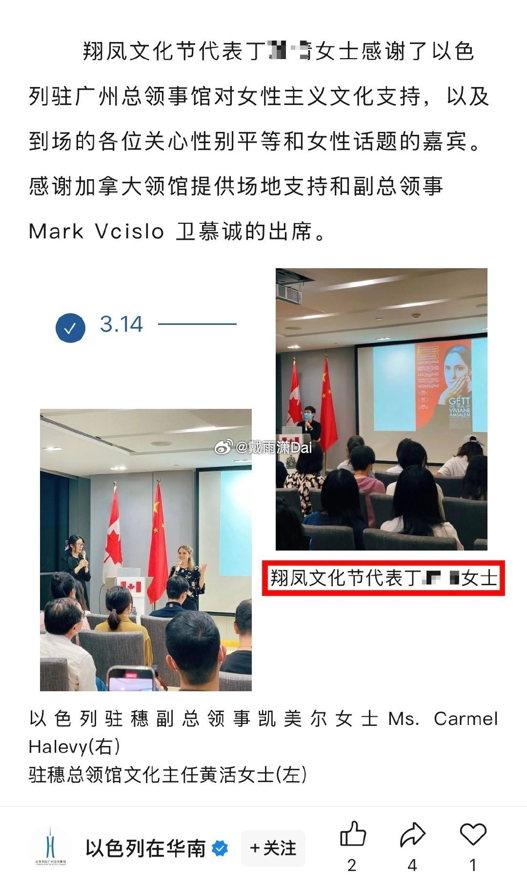

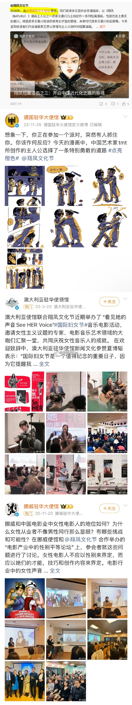

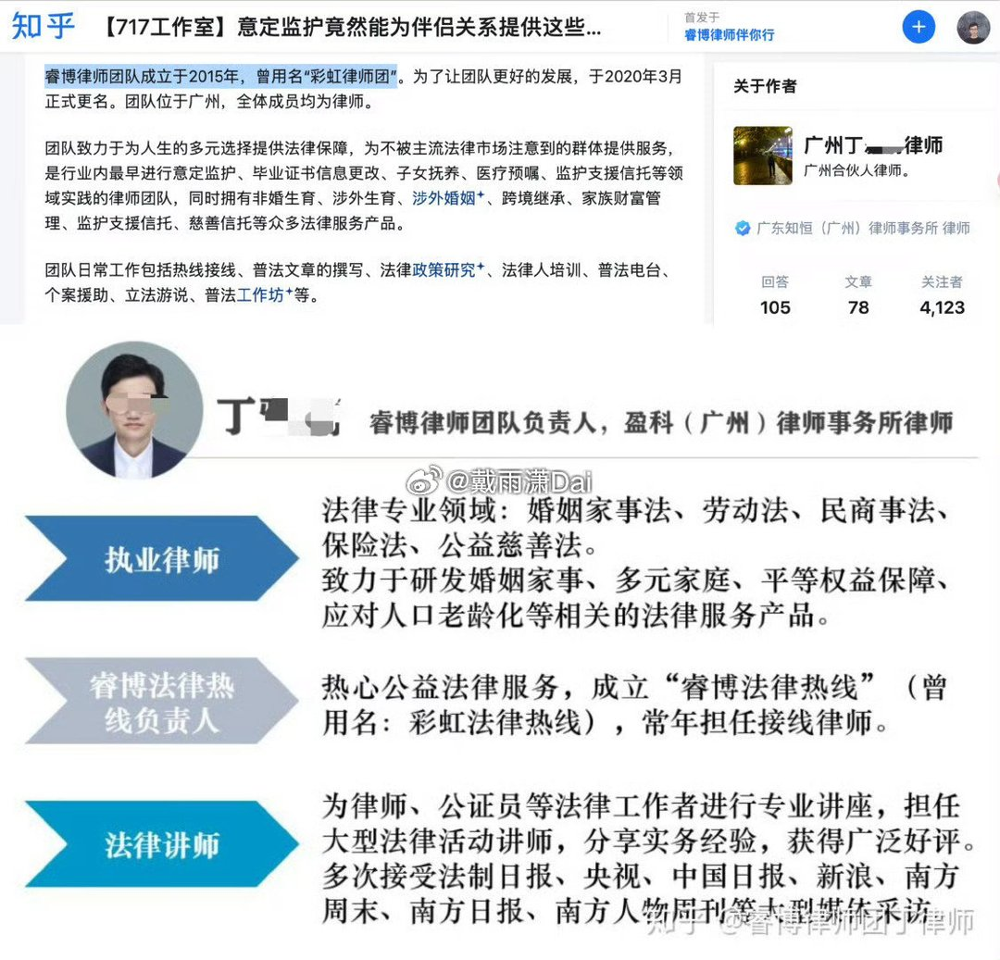

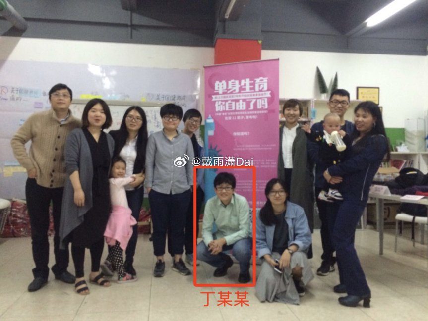

---

## 11

@摇摆时间线ZHLMI

发表于：2026-06-05 16:08

来源：微博

链接：https://m.weibo.cn/status/5306600785183464

\# 我花了三周，教会 AI 写剧本——然后把它开源了

众所周知，俺是个数字影像工程师。我们的日常就是在"创意"和"执行"之间反复横跳。创意说"我想要那种感觉"，执行说"你倒是告诉我要拍几个镜头"。这中间的翻译工作，耗掉了大部分人的大部分时间。

AI 来了之后，我看过大量从写文案到做分镜的各种工具，最大的感受是：**AI 能写，但需要一个脑子清醒的人告诉它怎么才能不写飞。**

所以我把自己这些年踩过的坑，趟过的雷，经历过的东西做成了一套 Skill。叫**剧本锻造（Script Forging）**。

---

\#\# 它不是一键成片

市面上有一种很流行的说法："丢一个故事进去，AI 就给你吐出一份完整剧本。"这要么是营销话术，要么是那个人根本没拍过东西。

真正能拍的剧本，不是一段通顺的文字。它需要：

- 每一场戏都有明确的进入点和退出点

- 人物的行为不能因为 AI 的"合理猜测"而突然变成另一个人

- 台词背后有潜台词，动作背后有动机

- 那些被反复使用的物件、空间、意象，必须从头到尾记得住、对得上

所以我做的这个东西，本质是一个**工作流引擎**。它不是黑箱，而是一步一步、在你眼皮底下干活。每一步结束，它停下来等你说"可以继续"，然后才走下一步。

> AI 负责锻造，你负责判断。

---

\#\# 它是怎么工作的

流程不复杂：

```

故事原文

  → 先判断形态：长片？短片？还是更适合做短剧？

  → 生成"剧本化提示包"——写剧本之前必须先定规矩

  → 等你确认

  → 画分场大纲——每个场次的施工图

  → 等你确认

  → 写剧本一稿 → 自动做自检报告

  → 有问题就进二稿 → 再来一次自检

  → 等你确认

  → 出分镜表（关键分镜 / 场级 / 逐镜头任选）

  → 出数字资产清单（角色、场景、道具、母题、服装状态）

```

全程有 6 个 **🔴 CHECKPOINT**。不是我矫情，是因为**每一步方向走错，后面全白做**。AI 不会替你判断"这个结局对不对味"，这个判断必须你来做。

---

\#\# 它和另一个 Skill 是搭档

我之前还开源过一个叫[叙事转译](网页链接)的 Skill，专门做故事诊断和影视开发读本，回答"这个故事能拍吗？怎么拍最好？"

剧本锻造回答的是下一句话："那就拍吧，这场戏怎么拍？"

两个 Skill 分家，是因为帮投资人看方向和帮导演做执行，用的是两套完全不同的脑子。

而且它们不是单向的流水线。剧本锻造出完定稿剧本之后，可以回到叙事转译，基于定稿生成演员读本和导演视听读本。因为这个顺序才正确，演员读本本该在剧本定稿之后才做，之前在叙事转译里其实不该有这个步骤。

---

\#\# 它到底输出了什么

以我仓库里放的示例项目《一起养》为例，一个故事进去，完整的输出包长这样：

| 阶段 | 产出 | 实际大小 |

|:--|:--|:--|

| 形态判断 | 长片、中短片、短剧哪个更适配？给出推荐和理由 | — |

| 剧本化提示包 | 13 个字段的控制层文档，定义"什么不能改" | 约 2 万字 |

| 分场大纲 | 52 场，每场 10 个字段的施工图 | 约 4 万字 |

| 标准剧本一稿 | 完整剧本 + 配套自检报告 | 约 8 万字 |

| 标准剧本二稿 | 基于自检报告的修订版 + 再自检 | 约 8 万字 |

| 关键分镜表 | 全片关键镜头骨架 | — |

| 场级分镜表 | 每场主要镜头拆解 | — |

| 逐镜头分镜 | 第 48-50 场完整逐镜头，含 AI 视频提示词 | — |

| 数字资产清单 | 角色/场景/道具/母题/服装状态，带资产 ID 和连续性锁定 | 约 3 万字 |

> 想看完整效果？仓库 `examples/一起养/` 目录里 10 个文件全部放着，原样输出，没剪辑过。

---

\#\# 一些设计上的坚持

做这个 Skill 的过程中，有一些我死磕的细节。说出来你可能觉得没必要，但用过你就懂了。

**1. 故事原文是最高法**

AI 不能新增原文没有的第三者、车祸、绝症、黑化、复仇。不是我不喜欢戏剧冲突——是我见过太多 AI 用"加点狗血吧"来掩盖它根本不知道这段戏该怎么写。

**2. 心理描写必须转成动作**

"他很伤心"不行。"他坐在沙发上，把薄荷糖的包装纸一张一张叠成方块"才行。剧本不是小说，不可见的心理毫无意义。

**3. 资产要有身份证**

每个重要角色、场景、道具分配稳定资产 ID。剧本改二稿的时候不是重建整份资产清单，而是生成变更记录。否则后续的 AI 图像生成、视频生成全部会炸——角色换脸、道具错色、空间布局漂移。

**4. 自检不能马虎**

每完成一版剧本，必须同步生成自检报告。问题分三级：致命问题（必须改）、高优先级（>3 项建议改）、可优化（可选）。这不是为了表格好看——是真的试过直接出剧本而不自检，结果发现后半段人物动机完全跑偏。

---

\#\# 怎么用

最偷懒的方式：

```

帮我把这篇小说锻造成标准剧本。

```

它会自动走完全流程。每个 CHECKPOINT 会停下来等你说 ok。

只用某个环节：

```

只帮我做分场大纲。

帮我拆第 3 场和第 8 场的逐镜头分镜。

```

走完整全流程（两个 Skill 配合）：

```

先用叙事转译诊断 → 锻造剧本分镜资产 → 回叙事转译出演员读本和导演读本。

```

---

\#\# 适合谁

- 独立创作者：有故事但不知道怎么把它变成剧本

- AI 影视探索者：想让 AI 帮忙生成可执行的分镜和资产，其中逐镜头分镜可作为参考提示词

- 编剧：想快速过结构和格式，把精力省给真正需要琢磨的东西

- 制片人 / 导演：想看一个故事的"可执行全貌"

**不适合谁**：只有一个概念没有故事的人。AI 没法替你回答"谁背叛了谁、为什么、结果怎样"。

---

\#\# 开源地址

- 仓库：[剧本锻造](网页链接)

- 配套 Skill：[叙事转译](网页链接)

---

至此，我一共做了三个 Skill，悲剧叙事哨兵，叙事转译，剧本锻造。都属于前期工作流里的不同环节，互相之前有关联，但也可以分开使用。一个负责和 AI 一起创造故事，一个把故事做成开发读本，一个落实到剧本环节，算是跑通了用 AI 来做视频的前期工作。我一直说模型已经把后面的执行这一步的门槛降低了，而各位现在要补齐的，是前面剧本这个短板。因为会用 Seedance 2.0 做片子的编剧，一定比不会写故事的剪辑师在这个时代要牛逼。

---

**要是你们有啥奇奇怪怪天马行空的想法，我也很乐意听听看，可能还能搞点新的事情。**

.


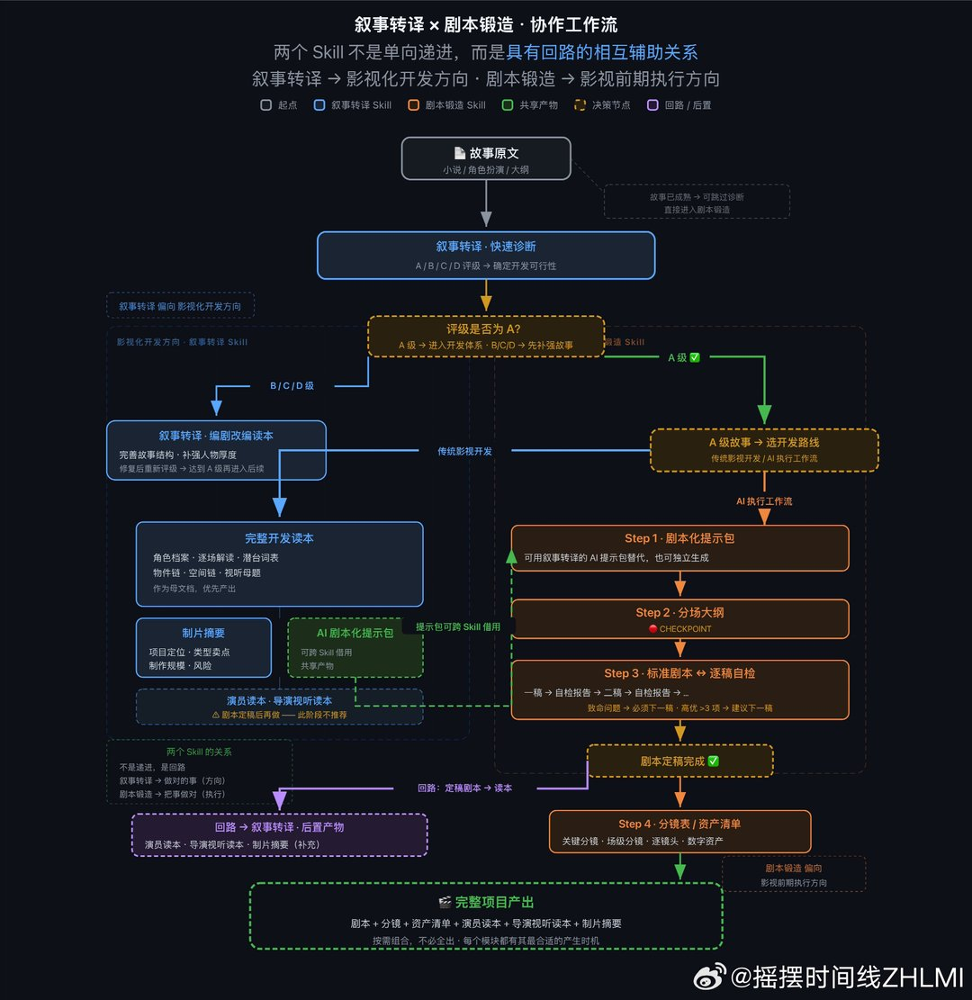

